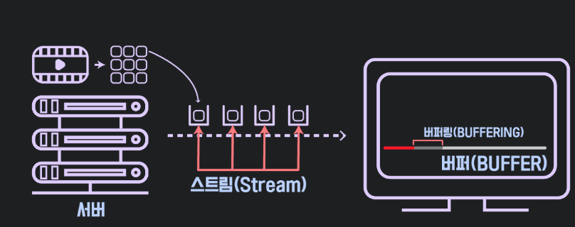

- First Created by KYG. on 2023-01-08

# Buffer
- 버퍼란 임시 저장 공간을 의미 합니다.
- 정확히 말하면 A와 B가 서로 입출력을 수행하는데에 있어서 속도차이를 극복하기 위해 사용하는 임시 저장 공간을 의미 합니다.

# 버퍼의 역할과 사용 이유
## 속도 차이 보완
- 데이터를 생성하거나 소비하는 속도가 서로 다를 때 발생하는 문제를 보완합니다.
- 예를 들어, 데이터를 생성하는 속도가 빠른데 데이터를 처리하는 측의 속도가 느리다면, 생성된 데이터가 버려지거나 데이터 오버플로우가 발생할 수 있습니다. 
- 이런 경우 버퍼를 사용하여 데이터를 임시로 저장하고 처리 측의 속도에 맞춰서 전송함으로써 문제를 해결합니다.

## 데이터 전송 효율화
- 네트워크 통신이나 데이터 저장 장치에서도 버퍼가 사용됩니다.
- 데이터를 일정량만큼 모아서 한 번에 전송하거나 저장함으로써 통신 또는 I/O 작업의 오버헤드를 줄여 전송 효율을 높이고 처리 시간을 단축시킵니다.

## 부드러운 데이터 흐름
- 동영상 스트리밍이나 음악 재생과 같이 실시간으로 데이터를 처리해야 하는 경우에도 버퍼가 사용됩니다. 
- 데이터를 버퍼에 일시적으로 저장하고 일정량이 모이면 부드럽게 재생하거나 전송함으로써 버퍼링 없이 자연스러운 데이터 흐름을 제공합니다.

# 동영상 스트리밍 서비스에서의 버퍼
- 이 버퍼라는 개념은 굉장히 다양하게 사용되는데 가장 쉽게 접할 수 있는 곳은 유튜브같은 동영상 스트리밍 사이트입니다.
- 스트리밍 사이트에서 실시간으로 동영상을 보게 되면 보통 동영상이 진행되는 부분(빨간색)과 서버로부터 동영상을 내려받은 부분(밝은 회색) 그리고 앞으로 다운로드가 남은 부분을 본 적이 있을 것 입니다.
- 동영상 데이터가 내려 받아지는 속도에 비해 우리가 동영상을 1초씩 진행되며 보는 속도에는 차이가 있습니다.
- 만약 우리가 동영상을 보는 속도와 데이터를 내려받는 속도가 같다면 동영상 재생시간이 50분짜리 동영상이라면 50분동안 데이터를 내려받아야 합니다.
- 그러나 이는 비효율적이므로 버퍼라는 임시 저장공간을 두고 동영상 데이터를 버퍼에 최대한 빠른 시간 안에 내려받아 저장해 둡니다.
- 동영상 시청자는 동영상을 느긋하게 즐기면 어느덧 동영상이 버퍼에 모두 다운로드 되어 있을 것입니다.
- 인터넷이 많이 느리던 시절에는 동영상을 버퍼에 다운로드 하는 속도가 동영상을 시청하는 속도를 따라가지 못해 빨간 부분이 회색 부분을 따라잡게 됐고 동영상이 멈추는 일이 빈번했습니다. "그리고 이를 버퍼링 걸린다" 라고들 이야기 했습니다.

 