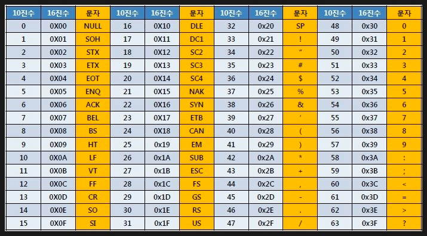
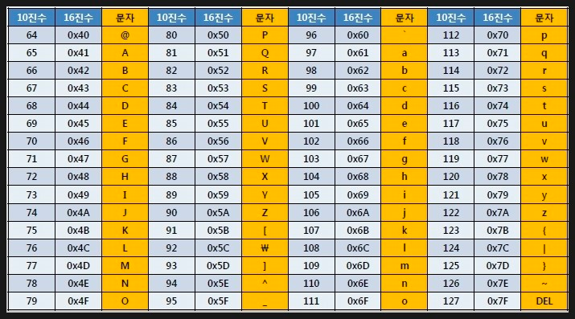

# Bit, Binary

# Bit란?
- Bit 는 컴퓨터에서 다루는 최소의 데이터 단위이다.
- 1 비트 를 이용해서 나타낼 수 있는 데이터 수는 "0 과 1"또는 "true 와 false" 또는 "on 과 off" 등과 같이 2가지이다.

# Binary란?
- Binary 는 2진수를 뜻한다.
- 2진수(Binary System)는 1 과 0으로 수(Number)를 나타내는 수표기법(Representation of Number) 이다.
- 여기서 수 와 수표기법에 대해서 설명을 하면 우리가 보통 일상 생활에서 쓰는 수 표기법은 10진수 이다. 
- 만약, 식탁 위에 바나나가 10개 가 있으면 그 10개 가 있다는 사실은 추상적인 수 이고 그 추상적인 수를 표현하기 위해서 우리는 다양한 수표기법을 사용한다 그 바나나의 수를 나타내기 위해 '10','열','ten' 등 앞에서 부터 차례대로 10진수 표기법, 한글, 영어 로 그 추상적인 수를 나타낼 수 있다. 
- 2진수(표기법) 으로도 그 바나나의 갯수를 나타낼수 있는데, 아래와 같이 나타낸다.

# Binary Data와 Bite Data의 차이
- 바이너리 데이터는 0과 1로 이루어진 이진 형식의 데이터를 의미합니다.
- 각 비트(bit)는 0 또는 1의 값을 가지며, 일반적으로 8비트(1바이트) 단위로 구성됩니다.
- 바이너리 데이터는 주로 컴퓨터가 이해하고 처리하기 위한 형식으로 사용되며, 텍스트, 이미지, 음악 파일 등의 형태로 존재할 수 있습니다.

- 바이트 데이터는 8비트로 구성된 데이터 형식입니다. 
- 바이트는 컴퓨터에서 데이터를 표현하는 최소 단위로 사용되며, 0부터 255까지의 값을 가질 수 있습니다. 
- 바이트 데이터는 주로 텍스트 데이터를 표현하는 데 사용되며, 각 바이트는 문자의 ASCII 코드 값이나 다른 인코딩 체계로부터 유래된 값을 가집니다. 예를 들어, ASCII 코드에서 'J'는 74로 표현되며, 'o'는 111로 표현됩니다. 바이트 데이터는 사람이 읽고 이해할 수 있는 형태로 표현되는 경우가 많습니다.

- 바이너리 데이터: 01001010 01101111 01101000 01101110 00100000 01010011 01101101 01101001 01110100 01101000
- 바이트 데이터: 74 6F 68 6E 20 53 6D 69 74 68

- >바이너리 데이터는 각 비트로 이루어진 이진 형식이며, 8비트 단위로 구성되어 있습니다. 
-  > 바이트 데이터는 8비트로 이루어진 십진수 값으로 표현되며, 각 바이트는 텍스트로 해석될 수 있는 형태입니다.

ex)
바이트 데이터 :  "74 6F 68 6E 20 53 6D 69 74 68"
- 74: 'J'
- 6F: 'o'
- 68: 'h'
- 6E: 'n' :  6E은 16진수로 표현된 값이며, 해당 값은 십진수로 110에 해당합니다. ASCII 코드에서 110은 문자 'n'을 나타냅니다.
- 20: 공백
- 53: 'S'
- 6D: 'm'
- 69: 'i'
- 74: 't'
- 68: 'h'

# ASCII 코드표

