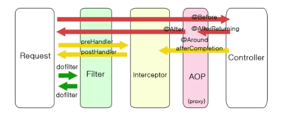

# 버튼을 누르고 스프링에서 구동되는 과정
- 버튼을 누르게 되면 서버에 요청을 하게 되고 스프링의 DispatcherServlet이 controller에서 RequestMapping을 찾고 ViewResolver에서 jsp를 찾아 포워딩합니다.

# Filter, Interceptor, AOP의 흐름

- 컨트롤러가 실행되기 전에 사용한다는 점에서 별반 차이가 없어보이지만 흐름을 보면 명확히 호출되는 시점이 다르다.
- 서버를 실행시켜 서블릿 올라오는 동안 init이 실행되고, 그 후 doFilter가 실행된다. 그 후 컨트롤러에 들어가기 전에 preHandler가 실행된다.
  
- 
Servlet Filter
- DispatcherServlet 이전에 실행이 되는데 필터가 동작하도록 지정된 자원의 앞단에서 요청내용을 변경하거나, 여러가지 체크를 수행할 수 있다. 또한 자원의 처리가 끝난 후 응답내용에 대해서도 변경하는 처리를 할 수가 있 다.
- web,xml에 등록하는데 대표적으로 인코딩 변환, 로그인 여부확인, 권한체크, XSS방어 등의 요청에 대한 처리로 사용된다.
  

Servlet Interceptor
- 필터는 스프링과 무관하게 지정된 자원에 대해 동작한다.
- 스프링은 DispatcherServlet으로부터 시작되므로 필터는 스프링 컨텍스트 외부에 존재하게 된다.
- 그리고 스프링 내의 모든 객체(bean) 접근이 가능하다.
- 인터셉터는 여러 개를 사용할 수 있고 로그인 체크, 권한체크, 프로그램 실행시간 게산작업 로그확인, 업로드 파일처리등에 사용된다.
  

Servlet AOP
- AOP를 바르게 이용하려면 객체지향 프로그래밍을 대체하려고 하는 것 처럼 보이는 AOP라는 이름 뒤에 감춰 진, 그 필연적인 등장배경과 스프링이 도입한 이유, 그 적용을 통해 얻을 수 있는 장점이 무엇인지에 대한 충분 하 이해가 필요하다.
  

AOP는 객체지향프로그래밍을 보완하는 확장적인 개념
- 객체지향프로그래밍(OOP)은 객체를 재사용함으로써 반복되는 코드의 양을 굉장히 많이 줄일 수가 있었지만 객 체의 재사용에도 불구하고 반복되는 코드를 없앴을 수는 없었다. 예를 들어 로그, 권한 체크, 인증, 예외 처리 등 필수적으로 해야하기 때문에 소스에서 반복될 수 밖에 없는 부분이 존재했다.
