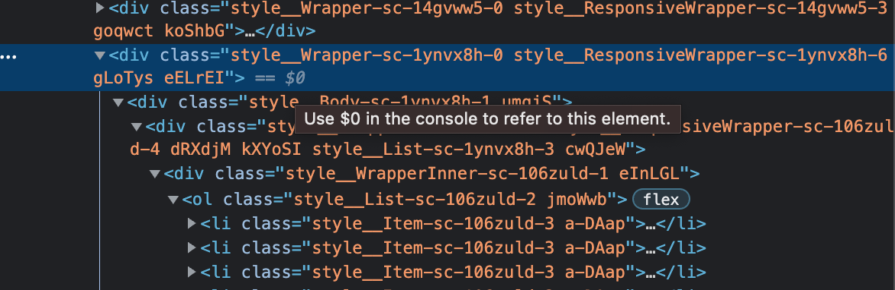
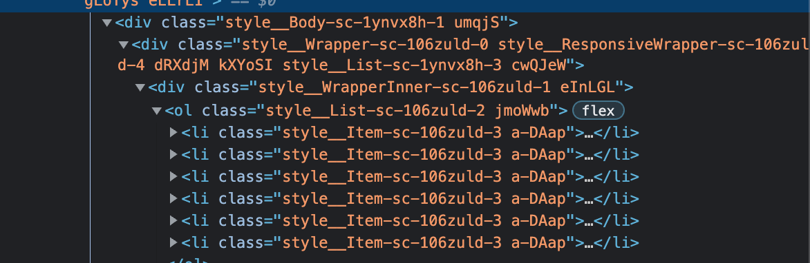

    <!-- Jsoup -->
    <dependency>
        <groupId>org.jsoup</groupId>
        <artifactId>jsoup</artifactId>
        <version>1.8.3</version>
    </dependency>

1. 크롤링을 위한 jsoup 라이브러리 building

> <%@ page language="java" contentType="text/html; charset=UTF-8" pageEncoding="UTF-8"%>
    
    <!--  JSP에서 jsoup을 사용하기 위해 import -->
    
    <%@ page import="org.jsoup.Jsoup" %>
    <%@ page import="org.jsoup.nodes.Document" %>
    <%@ page import="org.jsoup.nodes.Element" %>
    <%@ page import="org.jsoup.select.Elements" %>
    
    
    
    <!DOCTYPE html PUBLIC "-//W3C//DTD HTML 4.01 Transitional//EN" "http://www.w3.org/TR/html4/loose.dtd">
    
    <html>
    <head>
    <meta http-equiv="Content-Type" content="text/html; charset=UTF-8">
    
    <title>Insert title here</title>
    </head>
    
    <body>
    
    <%
    
            // 파싱할 사이트를 적어준다(해당 사이트에 대한 태그를 다 긁어옴)
            Document doc2 = Jsoup.connect("https://www.leagueoflegends.com/ko-kr/news/tags/patch-notes/").get();
    
    
            Elements posts = doc2.body().getElementsByClass("style__WrapperInner-sc-106zuld-1");
            
         
            Elements file = posts.get(0).select(".style__Item-sc-106zuld-3");
            System.out.println(file);
           
            for(Element e : file){
                out.println("<a href='");
                out.println("https://www.leagueoflegends.com"+e.select(".style__Wrapper-sc-1h41bzo-0").attr("href"));
                out.println("'>");
                out.println(e.select(".style__Title-sc-1h41bzo-8"));
                out.println("</a>");
            }
    
    %>
    
    </body>
    
    </html>

- 크롤링은 불법일까?

-> 크롤링 한 데이터를 런칭 이외에 데이터 수집 목적은 불법은 아니지만 영리적인 목적은 저작자의 승인이 필요하다.