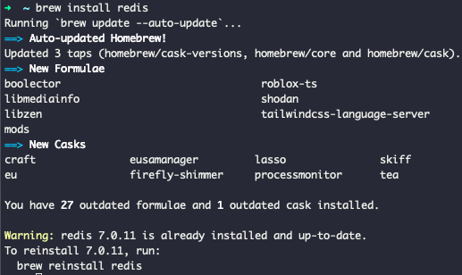
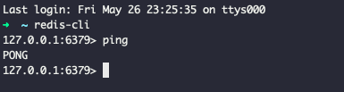

- First Created by KYG. on 2023-01-05

# Redis 실습

# Mac Redis 설치하기 
- brew install redis (Mac Redis 설치)

> 나는 이미 설치가 되어있다.

# Redis server 실행하기
> $redis-server

- redis-server 실행 후 정상실행 확인하기

# Redis Client 접속
> $redis-cli 

- Not connected 라면 레디스 접속에 실패한 것이다.

# Redis 백그라운드 실행하기
> $brew services start redis

> redis-cli

- redis-cli가 정상적으로 연결이되었다면, ping을 날리고, pong 응답이 돌아오는지 확인한다.

# Redis 백그라운드 중지하기
> $brew services stop redis

- redis가 정상적으로 중지되었다면, 다시 클라이언트에 접속해서 Redis 접속상태를 확인한다.

# Redis 서비스 재시작
> $brew services restart redis

- redis가 정상적으로 중지되었다면, 다시 클라이언트에 접속해서 Redis 접속상태를 확인한다.

### Redis 문법에 대해서 알아보자

