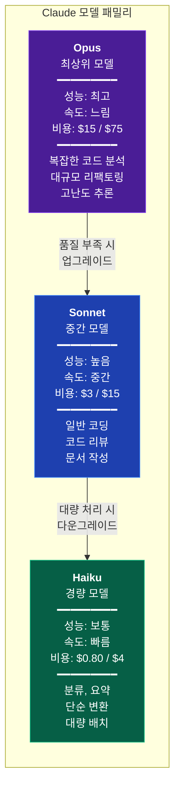
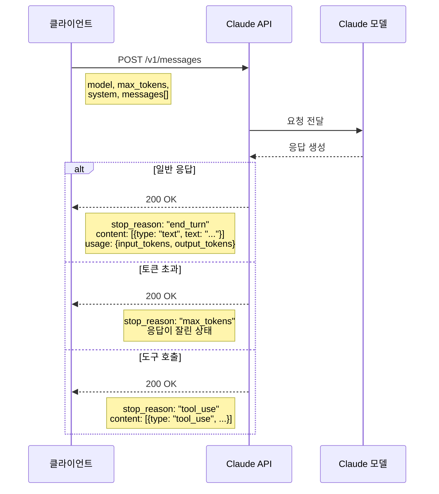
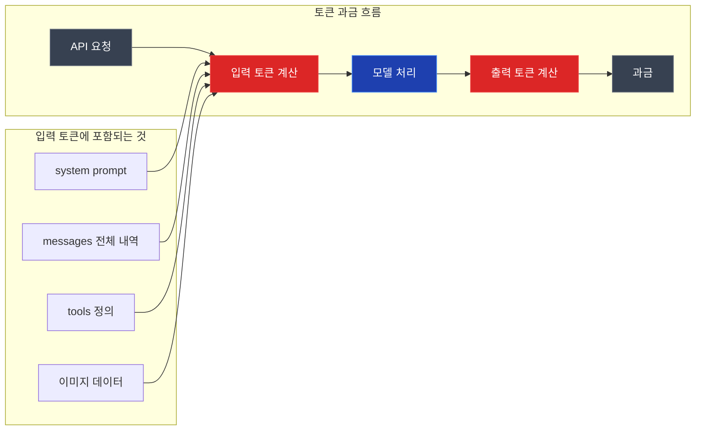
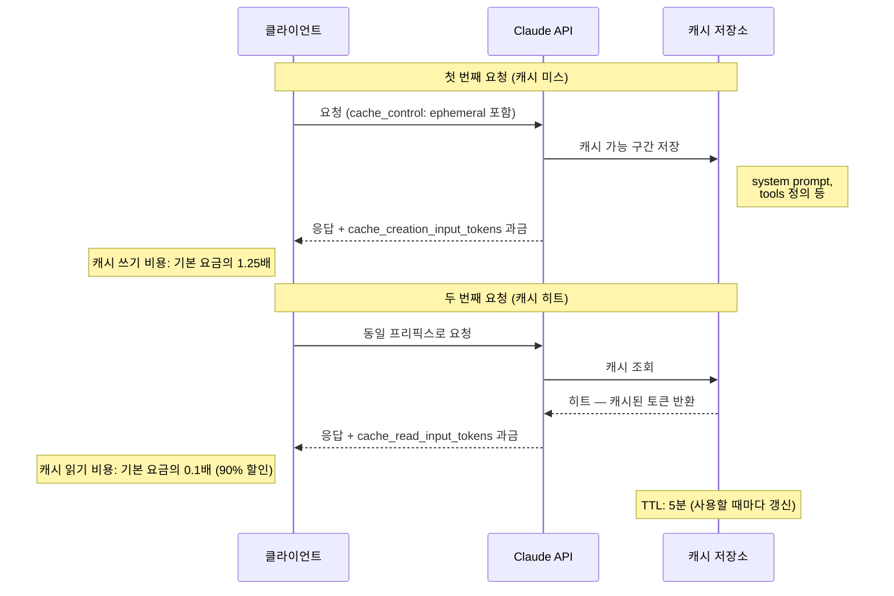
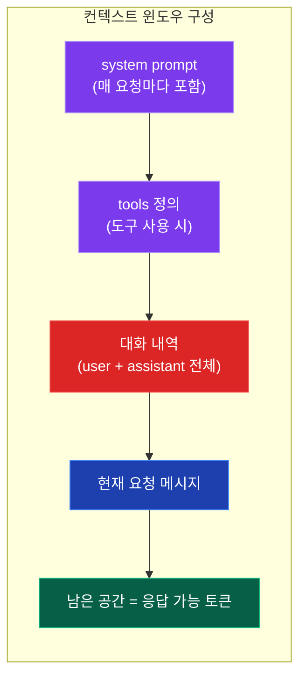
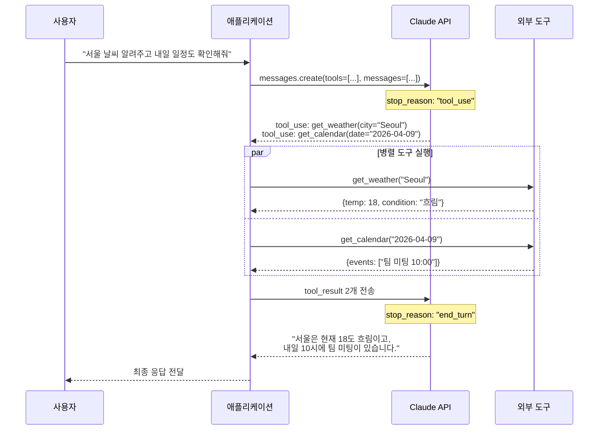

# Claude

## 1. Claude란

Anthropic이 만든 대규모 언어 모델이다. GPT-4o, Gemini와 함께 현재 실무에서 가장 많이 쓰이는 LLM 중 하나다.

Constitutional AI라는 자체 안전 학습 방식을 적용했고, 코딩·분석·글쓰기 등 범용 작업에서 높은 성능을 보인다. 2025년 기준 Claude 3.5 시리즈에서 Claude 4 시리즈로 넘어왔고, 2026년 현재 Claude 4.5/4.6이 최신이다.

---

## 2. 모델 패밀리

Claude는 세 가지 등급으로 나뉜다. 같은 세대라도 등급에 따라 성능과 비용 차이가 크다.

다음 다이어그램은 세 모델의 성능-비용-속도 관계를 정리한 것이다.



### 모델 등급별 성능-비용 포지셔닝

<svg viewBox="0 0 720 340" xmlns="http://www.w3.org/2000/svg" style="max-width:720px;width:100%;height:auto;font-family:'Segoe UI',system-ui,sans-serif">
  <defs>
    <linearGradient id="opus-grad" x1="0" y1="0" x2="1" y2="0"><stop offset="0%" stop-color="#7c3aed"/><stop offset="100%" stop-color="#a78bfa"/></linearGradient>
    <linearGradient id="sonnet-grad" x1="0" y1="0" x2="1" y2="0"><stop offset="0%" stop-color="#2563eb"/><stop offset="100%" stop-color="#60a5fa"/></linearGradient>
    <linearGradient id="haiku-grad" x1="0" y1="0" x2="1" y2="0"><stop offset="0%" stop-color="#059669"/><stop offset="100%" stop-color="#34d399"/></linearGradient>
  </defs>
  <rect width="720" height="340" rx="12" fill="#1e1e2e"/>
  <text x="360" y="32" text-anchor="middle" fill="#cdd6f4" font-size="15" font-weight="600">Claude 모델 등급별 비교 (상대값, 100 = 최대)</text>
  <!-- 축 레이블 -->
  <text x="95" y="75" text-anchor="end" fill="#a6adc8" font-size="12">성능</text>
  <text x="95" y="135" text-anchor="end" fill="#a6adc8" font-size="12">속도</text>
  <text x="95" y="195" text-anchor="end" fill="#a6adc8" font-size="12">비용 (역)</text>
  <text x="95" y="255" text-anchor="end" fill="#a6adc8" font-size="12">컨텍스트</text>
  <!-- 그리드 -->
  <line x1="110" y1="62" x2="620" y2="62" stroke="#313244" stroke-width="1"/>
  <line x1="110" y1="122" x2="620" y2="122" stroke="#313244" stroke-width="1"/>
  <line x1="110" y1="182" x2="620" y2="182" stroke="#313244" stroke-width="1"/>
  <line x1="110" y1="242" x2="620" y2="242" stroke="#313244" stroke-width="1"/>
  <!-- 성능 바 -->
  <rect x="110" y="56" width="510" height="10" rx="5" fill="url(#opus-grad)" opacity="0.9"/>
  <rect x="110" y="69" width="408" height="10" rx="5" fill="url(#sonnet-grad)" opacity="0.9"/>
  <rect x="110" y="82" width="255" height="10" rx="5" fill="url(#haiku-grad)" opacity="0.9"/>
  <!-- 속도 바 -->
  <rect x="110" y="116" width="204" height="10" rx="5" fill="url(#opus-grad)" opacity="0.9"/>
  <rect x="110" y="129" width="357" height="10" rx="5" fill="url(#sonnet-grad)" opacity="0.9"/>
  <rect x="110" y="142" width="510" height="10" rx="5" fill="url(#haiku-grad)" opacity="0.9"/>
  <!-- 비용(역) 바 — 저렴할수록 길다 -->
  <rect x="110" y="176" width="54" height="10" rx="5" fill="url(#opus-grad)" opacity="0.9"/>
  <rect x="110" y="189" width="170" height="10" rx="5" fill="url(#sonnet-grad)" opacity="0.9"/>
  <rect x="110" y="202" width="510" height="10" rx="5" fill="url(#haiku-grad)" opacity="0.9"/>
  <!-- 컨텍스트 바 -->
  <rect x="110" y="236" width="510" height="10" rx="5" fill="url(#opus-grad)" opacity="0.9"/>
  <rect x="110" y="249" width="204" height="10" rx="5" fill="url(#sonnet-grad)" opacity="0.9"/>
  <rect x="110" y="262" width="204" height="10" rx="5" fill="url(#haiku-grad)" opacity="0.9"/>
  <!-- 범례 -->
  <rect x="200" y="296" width="14" height="14" rx="3" fill="url(#opus-grad)"/>
  <text x="220" y="308" fill="#cdd6f4" font-size="12">Opus 4.6</text>
  <rect x="310" y="296" width="14" height="14" rx="3" fill="url(#sonnet-grad)"/>
  <text x="330" y="308" fill="#cdd6f4" font-size="12">Sonnet 4.6</text>
  <rect x="430" y="296" width="14" height="14" rx="3" fill="url(#haiku-grad)"/>
  <text x="450" y="308" fill="#cdd6f4" font-size="12">Haiku 4.5</text>
  <!-- 값 표시 -->
  <text x="625" y="65" fill="#a78bfa" font-size="10">100</text>
  <text x="523" y="78" fill="#60a5fa" font-size="10">80</text>
  <text x="370" y="91" fill="#34d399" font-size="10">50</text>
  <text x="319" y="125" fill="#a78bfa" font-size="10">40</text>
  <text x="472" y="138" fill="#60a5fa" font-size="10">70</text>
  <text x="625" y="151" fill="#34d399" font-size="10">100</text>
  <text x="169" y="185" fill="#a78bfa" font-size="10">$75</text>
  <text x="285" y="198" fill="#60a5fa" font-size="10">$15</text>
  <text x="625" y="211" fill="#34d399" font-size="10">$4</text>
  <text x="625" y="245" fill="#a78bfa" font-size="10">1M</text>
  <text x="319" y="258" fill="#60a5fa" font-size="10">200K</text>
  <text x="319" y="271" fill="#34d399" font-size="10">200K</text>
</svg>

Opus는 성능과 컨텍스트(1M 확장)에서 압도적이지만 출력 토큰 단가가 $75/1M으로 Haiku의 약 19배다. Sonnet은 성능 80% 수준에서 비용이 Opus의 1/5이라 가성비가 가장 좋다. Haiku는 성능을 포기하는 대신 속도와 비용에서 이긴다.

### 2.1 Opus / Sonnet / Haiku

| 구분 | Opus | Sonnet | Haiku |
|------|------|--------|-------|
| **포지션** | 최상위 모델 | 중간 모델 | 경량 모델 |
| **속도** | 느림 | 중간 | 빠름 |
| **비용** | 가장 비쌈 | 중간 | 저렴 |
| **적합한 용도** | 복잡한 코드 분석, 긴 문서 작성, 고난도 추론 | 일반 코딩, 질의응답, 대부분의 작업 | 분류, 요약, 단순 변환, 대량 처리 |

### 2.2 실제 사용감 차이

**Opus**: 복잡한 코드베이스를 분석하거나 여러 파일에 걸친 리팩토링을 시킬 때 확실히 차이가 난다. 코드 문맥을 더 잘 유지하고, 엣지 케이스를 스스로 찾아서 처리하는 경우가 많다. 다만 응답 속도가 느려서 단순한 질문에 쓰면 답답하다.

**Sonnet**: 실무에서 가장 많이 쓰게 되는 모델이다. 코드 리뷰, 버그 수정, 기능 구현 등 대부분의 작업을 무난하게 처리한다. Opus와 비교하면 아주 복잡한 멀티스텝 추론에서 차이가 나지만, 일반적인 개발 작업에서는 체감 차이가 크지 않다.

**Haiku**: 로그 파싱, 텍스트 분류, 간단한 코드 변환 같은 반복 작업에 적합하다. API 호출 단가가 낮아서 대량 처리 파이프라인에 넣기 좋다. 복잡한 코딩 작업에 쓰면 실수가 잦다.

### 2.3 모델 선택 기준

```
복잡한 아키텍처 설계, 대규모 리팩토링 → Opus
일반 개발 작업, 코드 리뷰, 문서 작성    → Sonnet
분류, 추출, 단순 변환, 대량 배치       → Haiku
```

비용이 제한적이라면 Sonnet으로 시작하고, 결과물 품질이 부족할 때만 Opus로 올리는 게 현실적이다.

---

## 3. API 사용법

### 3.1 Messages API 기본

Messages API의 요청-응답 흐름은 다음과 같다.



Claude API는 Messages API를 사용한다. OpenAI의 Chat Completions API와 구조가 비슷하지만, 파라미터 이름과 역할 구분 방식이 다르다.

```python
import anthropic

client = anthropic.Anthropic()  # ANTHROPIC_API_KEY 환경변수 사용

message = client.messages.create(
    model="claude-sonnet-4-6",
    max_tokens=1024,
    messages=[
        {"role": "user", "content": "Python에서 dataclass와 Pydantic 모델의 차이를 설명해줘"}
    ]
)

print(message.content[0].text)
```

### 3.2 System Prompt

System prompt는 `messages` 배열이 아닌 별도 파라미터로 전달한다. OpenAI처럼 messages 안에 `role: system`으로 넣으면 에러가 난다.

```python
message = client.messages.create(
    model="claude-sonnet-4-6",
    max_tokens=1024,
    system="너는 시니어 백엔드 개발자야. 코드 리뷰를 할 때 보안 이슈를 우선 지적해.",
    messages=[
        {"role": "user", "content": "이 코드 리뷰해줘:\n\n" + code}
    ]
)
```

System prompt에 역할, 제약 조건, 출력 형식 등을 넣는다. 길이 제한은 따로 없지만, 너무 길면 토큰을 많이 소모하니 핵심만 넣어야 한다.

### 3.3 멀티턴 대화

```python
messages = [
    {"role": "user", "content": "JWT 토큰 검증 미들웨어를 만들어줘"},
    {"role": "assistant", "content": "...이전 응답..."},
    {"role": "user", "content": "리프레시 토큰 로직도 추가해줘"}
]

message = client.messages.create(
    model="claude-sonnet-4-6",
    max_tokens=2048,
    messages=messages
)
```

`user`와 `assistant`가 번갈아 나와야 한다. 같은 role이 연속으로 오면 에러가 발생한다.

### 3.4 Streaming

긴 응답을 받을 때는 streaming을 쓴다. 사용자에게 실시간으로 보여줘야 하는 경우 필수다.

```python
with client.messages.stream(
    model="claude-sonnet-4-6",
    max_tokens=2048,
    messages=[
        {"role": "user", "content": "Spring Boot 3에서 WebFlux 마이그레이션 방법을 설명해줘"}
    ]
) as stream:
    for text in stream.text_stream:
        print(text, end="", flush=True)
```

스트리밍 응답에서 전체 결과를 모아야 할 때는 `stream.get_final_message()`로 최종 메시지 객체를 얻을 수 있다.

### 3.5 TypeScript SDK

```typescript
import Anthropic from "@anthropic-ai/sdk";

const client = new Anthropic();

const message = await client.messages.create({
  model: "claude-sonnet-4-6",
  max_tokens: 1024,
  messages: [
    { role: "user", content: "Express에서 에러 핸들링 미들웨어 패턴 알려줘" }
  ],
});

console.log(message.content[0].text);
```

---

## 4. 토큰과 과금

### 4.1 토큰 과금 구조

Claude API는 입력 토큰과 출력 토큰을 따로 과금한다. 출력이 입력보다 비싸다.



### 모델별 토큰 단가 비교

<svg viewBox="0 0 720 300" xmlns="http://www.w3.org/2000/svg" style="max-width:720px;width:100%;height:auto;font-family:'Segoe UI',system-ui,sans-serif">
  <rect width="720" height="300" rx="12" fill="#1e1e2e"/>
  <text x="360" y="30" text-anchor="middle" fill="#cdd6f4" font-size="15" font-weight="600">출력 토큰 1M당 비용 ($)</text>
  <!-- Y축 눈금 -->
  <line x1="100" y1="55" x2="100" y2="240" stroke="#45475a" stroke-width="1"/>
  <line x1="100" y1="240" x2="640" y2="240" stroke="#45475a" stroke-width="1"/>
  <text x="90" y="63" text-anchor="end" fill="#6c7086" font-size="11">$75</text>
  <text x="90" y="107" text-anchor="end" fill="#6c7086" font-size="11">$56</text>
  <text x="90" y="152" text-anchor="end" fill="#6c7086" font-size="11">$37</text>
  <text x="90" y="196" text-anchor="end" fill="#6c7086" font-size="11">$19</text>
  <text x="90" y="244" text-anchor="end" fill="#6c7086" font-size="11">$0</text>
  <line x1="100" y1="55" x2="640" y2="55" stroke="#313244" stroke-width="0.5" stroke-dasharray="4"/>
  <line x1="100" y1="103" x2="640" y2="103" stroke="#313244" stroke-width="0.5" stroke-dasharray="4"/>
  <line x1="100" y1="148" x2="640" y2="148" stroke="#313244" stroke-width="0.5" stroke-dasharray="4"/>
  <line x1="100" y1="192" x2="640" y2="192" stroke="#313244" stroke-width="0.5" stroke-dasharray="4"/>
  <!-- Opus 입력 바 -->
  <rect x="140" y="203" width="55" height="37" rx="4" fill="#7c3aed" opacity="0.5"/>
  <text x="167" y="225" text-anchor="middle" fill="#cdd6f4" font-size="10">$15</text>
  <!-- Opus 출력 바 -->
  <rect x="200" y="55" width="55" height="185" rx="4" fill="#7c3aed"/>
  <text x="227" y="48" text-anchor="middle" fill="#a78bfa" font-size="11" font-weight="600">$75</text>
  <!-- Sonnet 입력 바 -->
  <rect x="320" y="233" width="55" height="7" rx="4" fill="#2563eb" opacity="0.5"/>
  <text x="347" y="228" text-anchor="middle" fill="#cdd6f4" font-size="10">$3</text>
  <!-- Sonnet 출력 바 -->
  <rect x="380" y="203" width="55" height="37" rx="4" fill="#2563eb"/>
  <text x="407" y="197" text-anchor="middle" fill="#60a5fa" font-size="11" font-weight="600">$15</text>
  <!-- Haiku 입력 바 -->
  <rect x="500" y="238" width="55" height="2" rx="1" fill="#059669" opacity="0.5"/>
  <text x="527" y="234" text-anchor="middle" fill="#cdd6f4" font-size="10">$0.8</text>
  <!-- Haiku 출력 바 -->
  <rect x="560" y="230" width="55" height="10" rx="4" fill="#059669"/>
  <text x="587" y="225" text-anchor="middle" fill="#34d399" font-size="11" font-weight="600">$4</text>
  <!-- 모델 레이블 -->
  <text x="195" y="260" text-anchor="middle" fill="#a78bfa" font-size="12" font-weight="500">Opus 4.6</text>
  <text x="375" y="260" text-anchor="middle" fill="#60a5fa" font-size="12" font-weight="500">Sonnet 4.6</text>
  <text x="555" y="260" text-anchor="middle" fill="#34d399" font-size="12" font-weight="500">Haiku 4.5</text>
  <!-- 범례 -->
  <rect x="240" y="278" width="12" height="12" rx="2" fill="#7c3aed" opacity="0.5"/>
  <text x="258" y="289" fill="#a6adc8" font-size="11">입력 토큰</text>
  <rect x="360" y="278" width="12" height="12" rx="2" fill="#7c3aed"/>
  <text x="378" y="289" fill="#a6adc8" font-size="11">출력 토큰</text>
</svg>

그래프로 보면 Opus의 출력 토큰 비용이 얼마나 큰지 체감된다. Sonnet 출력 단가가 Opus의 1/5, Haiku의 출력 단가는 Opus의 약 1/19 수준이다. 코드 생성처럼 출력이 긴 작업에서는 모델 선택이 비용에 직접적으로 영향을 준다.

| 모델 (4.6 기준) | 입력 (1M 토큰) | 출력 (1M 토큰) | 입출력 비율 |
|-----------------|---------------|---------------|-----------|
| Opus 4.6 | $15 | $75 | 1 : 5 |
| Sonnet 4.6 | $3 | $15 | 1 : 5 |
| Haiku 4.5 | $0.80 | $4 | 1 : 5 |

모든 모델에서 출력이 입력의 5배다. 출력을 많이 생성하는 작업(코드 생성, 긴 문서 작성)일수록 비용이 크게 늘어난다.

가격은 수시로 변동되니 공식 문서를 확인해야 한다. Opus는 출력 토큰 단가가 Haiku의 거의 20배다.

### 4.2 토큰 계산 시 주의사항

- System prompt도 매 요청마다 입력 토큰에 포함된다. 멀티턴 대화에서 system prompt가 길면 비용이 빠르게 늘어난다.
- 이전 대화 내역을 계속 붙여 보내므로, 대화가 길어질수록 입력 토큰이 기하급수적으로 증가한다.
- 이미지를 포함하면 토큰 소모가 크다. 고해상도 이미지 하나가 수천 토큰을 차지하는 경우가 있다.

### 4.3 비용 절감 방법

```python
# 1. 대화 내역 잘라내기 — 오래된 메시지 제거
if len(messages) > 20:
    messages = messages[-10:]  # 최근 10개만 유지

# 2. Prompt Caching — 반복되는 긴 컨텍스트에 캐싱 적용
message = client.messages.create(
    model="claude-sonnet-4-6",
    max_tokens=1024,
    system=[
        {
            "type": "text",
            "text": long_system_prompt,
            "cache_control": {"type": "ephemeral"}
        }
    ],
    messages=messages
)
```

Prompt Caching의 동작 구조는 다음과 같다.



캐시 히트 시 입력 토큰 비용이 90% 줄어든다. 긴 system prompt나 대량의 참고 문서를 반복 전송할 때 효과가 크다. 첫 요청에서 캐시 쓰기 비용이 25% 추가되지만, 두 번째 요청부터 바로 회수된다.

---

## 5. 컨텍스트 윈도우

### 5.1 모델별 컨텍스트 크기

| 모델 | 컨텍스트 윈도우 |
|------|----------------|
| Claude 4.6 Opus | 200K (1M 확장 지원) |
| Claude 4.6 Sonnet | 200K |
| Claude 4.5 Haiku | 200K |

200K 토큰은 대략 코드 파일 수백 개, 일반 텍스트 기준 책 한 권 분량이다.

### 컨텍스트 윈도우 구성 시각화

<svg viewBox="0 0 720 260" xmlns="http://www.w3.org/2000/svg" style="max-width:720px;width:100%;height:auto;font-family:'Segoe UI',system-ui,sans-serif">
  <rect width="720" height="260" rx="12" fill="#1e1e2e"/>
  <text x="360" y="28" text-anchor="middle" fill="#cdd6f4" font-size="14" font-weight="600">200K 토큰 컨텍스트 — 실제 사용 시 구성 예시</text>
  <!-- 첫 번째 예: 짧은 대화 -->
  <text x="30" y="62" fill="#a6adc8" font-size="11">단순 질문</text>
  <rect x="110" y="48" width="40" height="24" rx="4" fill="#7c3aed"/>
  <rect x="150" y="48" width="16" height="24" rx="0" fill="#2563eb"/>
  <rect x="166" y="48" width="534" height="24" rx="4" fill="#065f46" opacity="0.3"/>
  <text x="130" y="64" text-anchor="middle" fill="#fff" font-size="9">sys</text>
  <text x="158" y="64" text-anchor="middle" fill="#fff" font-size="9">Q</text>
  <text x="433" y="64" text-anchor="middle" fill="#34d399" font-size="10">응답 가능: ~195K</text>
  <!-- 두 번째 예: 코드 리뷰 -->
  <text x="30" y="106" fill="#a6adc8" font-size="11">코드 리뷰</text>
  <rect x="110" y="92" width="40" height="24" rx="4" fill="#7c3aed"/>
  <rect x="150" y="92" width="120" height="24" rx="0" fill="#dc2626"/>
  <rect x="270" y="92" width="30" height="24" rx="0" fill="#2563eb"/>
  <rect x="300" y="92" width="400" height="24" rx="4" fill="#065f46" opacity="0.3"/>
  <text x="130" y="108" text-anchor="middle" fill="#fff" font-size="9">sys</text>
  <text x="210" y="108" text-anchor="middle" fill="#fff" font-size="9">코드 파일 5개 (~30K)</text>
  <text x="285" y="108" text-anchor="middle" fill="#fff" font-size="9">Q</text>
  <text x="500" y="108" text-anchor="middle" fill="#34d399" font-size="10">응답 가능: ~165K</text>
  <!-- 세 번째 예: 에이전트 + 도구 -->
  <text x="30" y="150" fill="#a6adc8" font-size="11">에이전트</text>
  <rect x="110" y="136" width="60" height="24" rx="4" fill="#7c3aed"/>
  <rect x="170" y="136" width="80" height="24" rx="0" fill="#ca8a04"/>
  <rect x="250" y="136" width="200" height="24" rx="0" fill="#dc2626"/>
  <rect x="450" y="136" width="40" height="24" rx="0" fill="#2563eb"/>
  <rect x="490" y="136" width="210" height="24" rx="4" fill="#065f46" opacity="0.3"/>
  <text x="140" y="152" text-anchor="middle" fill="#fff" font-size="9">sys</text>
  <text x="210" y="152" text-anchor="middle" fill="#fff" font-size="9">tools</text>
  <text x="350" y="152" text-anchor="middle" fill="#fff" font-size="9">대화 내역 (~50K)</text>
  <text x="470" y="152" text-anchor="middle" fill="#fff" font-size="9">Q</text>
  <text x="595" y="152" text-anchor="middle" fill="#34d399" font-size="10">~105K</text>
  <!-- 네 번째 예: 긴 대화 -->
  <text x="30" y="194" fill="#a6adc8" font-size="11">긴 멀티턴</text>
  <rect x="110" y="180" width="60" height="24" rx="4" fill="#7c3aed"/>
  <rect x="170" y="180" width="460" height="24" rx="0" fill="#dc2626"/>
  <rect x="630" y="180" width="40" height="24" rx="0" fill="#2563eb"/>
  <rect x="670" y="180" width="30" height="24" rx="4" fill="#065f46" opacity="0.3"/>
  <text x="140" y="196" text-anchor="middle" fill="#fff" font-size="9">sys</text>
  <text x="400" y="196" text-anchor="middle" fill="#fff" font-size="9">대화 내역 누적 (~170K)</text>
  <text x="650" y="196" text-anchor="middle" fill="#fff" font-size="9">Q</text>
  <text x="685" y="196" text-anchor="middle" fill="#ef4444" font-size="8">!!!</text>
  <!-- 범례 -->
  <rect x="120" y="224" width="12" height="12" rx="2" fill="#7c3aed"/>
  <text x="138" y="234" fill="#a6adc8" font-size="10">System Prompt</text>
  <rect x="240" y="224" width="12" height="12" rx="2" fill="#ca8a04"/>
  <text x="258" y="234" fill="#a6adc8" font-size="10">Tools 정의</text>
  <rect x="340" y="224" width="12" height="12" rx="2" fill="#dc2626"/>
  <text x="358" y="234" fill="#a6adc8" font-size="10">대화 내역</text>
  <rect x="440" y="224" width="12" height="12" rx="2" fill="#2563eb"/>
  <text x="458" y="234" fill="#a6adc8" font-size="10">현재 요청</text>
  <rect x="540" y="224" width="12" height="12" rx="2" fill="#065f46" opacity="0.3"/>
  <text x="558" y="234" fill="#a6adc8" font-size="10">응답 가능 공간</text>
</svg>

네 번째 케이스가 실무에서 자주 겪는 문제다. 멀티턴 대화가 길어지면 대화 내역이 컨텍스트 대부분을 차지하고, 응답 가능 공간이 거의 남지 않는다. 이때 응답 품질이 떨어지거나 잘리는 현상이 발생한다.



대화가 길어지면 HIST 영역이 계속 커진다. 그만큼 응답 가능한 토큰이 줄어들고, 입력 토큰 비용도 늘어난다. 컨텍스트 관리가 중요한 이유다.

### 5.2 컨텍스트 크기별 활용

**짧은 컨텍스트 (1K~10K 토큰)**
단일 함수 리뷰, 간단한 질문, 코드 변환 등. 대부분의 일상적인 API 호출이 여기에 해당한다.

**중간 컨텍스트 (10K~50K 토큰)**
파일 여러 개를 넘겨서 리팩토링하거나, API 문서를 참고하며 코드를 생성하는 작업. 실무에서 가장 자주 쓰는 범위다.

**긴 컨텍스트 (50K~200K 토큰)**
대규모 코드베이스 분석, 긴 문서 요약, 여러 파일에 걸친 의존성 추적. 컨텍스트가 길어질수록 중간 부분의 정보를 놓치는 현상(lost in the middle)이 발생할 수 있다. 중요한 정보는 앞이나 뒤에 배치하는 게 좋다.

### 5.3 컨텍스트 관리 실무 팁

- 전체 코드베이스를 무작정 넣지 말고, 관련 파일만 선별해서 넣어야 한다.
- RAG(검색 증강 생성)를 조합하면 필요한 코드 조각만 컨텍스트에 넣을 수 있어서 토큰 낭비를 줄인다.
- 대화가 길어지면 요약 후 새 대화를 시작하는 방식이 품질과 비용 모두에 유리하다.

---

## 6. Claude Web / Desktop 앱

API가 아닌 claude.ai 웹이나 Desktop 앱으로 사용할 때의 주요 기능이다.

### 6.1 Projects

프로젝트 단위로 대화를 묶고, 공유 지식을 설정할 수 있다.

- **Project Knowledge**: 프로젝트에 파일이나 텍스트를 등록하면 해당 프로젝트의 모든 대화에서 자동으로 참조한다. API의 system prompt와 비슷한 역할이다.
- **Custom Instructions**: 프로젝트별로 응답 스타일이나 제약 조건을 지정한다.
- 팀 플랜에서는 프로젝트를 팀원과 공유할 수 있다. 코드 리뷰 기준, 코딩 컨벤션 문서를 넣어두면 팀 전체가 동일한 기준으로 사용하게 된다.

### 6.2 Artifacts

대화 중에 생성된 코드, 문서, SVG, HTML 등을 별도 패널에 렌더링해서 보여주는 기능이다.

- 코드를 생성하면 별도 창에서 바로 확인할 수 있다.
- HTML/CSS/JS 조합은 실시간 프리뷰가 된다.
- Mermaid 다이어그램, SVG 등도 렌더링된다.
- 생성된 artifact를 복사하거나 다운로드할 수 있다.

실무에서는 프로토타입 UI를 빠르게 확인하거나, 아키텍처 다이어그램을 Mermaid로 그릴 때 쓸만하다.

---

## 7. 다른 LLM과의 체감 비교

### 주요 LLM 특성 비교

<svg viewBox="0 0 720 320" xmlns="http://www.w3.org/2000/svg" style="max-width:720px;width:100%;height:auto;font-family:'Segoe UI',system-ui,sans-serif">
  <rect width="720" height="320" rx="12" fill="#1e1e2e"/>
  <text x="360" y="28" text-anchor="middle" fill="#cdd6f4" font-size="14" font-weight="600">Claude vs GPT-4o vs Gemini — 항목별 체감 비교</text>
  <!-- 축 레이블 -->
  <text x="90" y="72" text-anchor="end" fill="#a6adc8" font-size="11">코딩 품질</text>
  <text x="90" y="112" text-anchor="end" fill="#a6adc8" font-size="11">지시 준수</text>
  <text x="90" y="152" text-anchor="end" fill="#a6adc8" font-size="11">컨텍스트</text>
  <text x="90" y="192" text-anchor="end" fill="#a6adc8" font-size="11">멀티모달</text>
  <text x="90" y="232" text-anchor="end" fill="#a6adc8" font-size="11">가격 경쟁력</text>
  <!-- 그리드 -->
  <line x1="105" y1="60" x2="640" y2="60" stroke="#313244" stroke-width="0.5"/>
  <line x1="105" y1="100" x2="640" y2="100" stroke="#313244" stroke-width="0.5"/>
  <line x1="105" y1="140" x2="640" y2="140" stroke="#313244" stroke-width="0.5"/>
  <line x1="105" y1="180" x2="640" y2="180" stroke="#313244" stroke-width="0.5"/>
  <line x1="105" y1="220" x2="640" y2="220" stroke="#313244" stroke-width="0.5"/>
  <!-- 코딩 품질 -->
  <rect x="105" y="56" width="482" height="8" rx="4" fill="#a78bfa"/>
  <rect x="105" y="66" width="428" height="8" rx="4" fill="#f97316"/>
  <rect x="105" y="76" width="375" height="8" rx="4" fill="#38bdf8"/>
  <!-- 지시 준수 -->
  <rect x="105" y="96" width="510" height="8" rx="4" fill="#a78bfa"/>
  <rect x="105" y="106" width="375" height="8" rx="4" fill="#f97316"/>
  <rect x="105" y="116" width="321" height="8" rx="4" fill="#38bdf8"/>
  <!-- 컨텍스트 -->
  <rect x="105" y="136" width="375" height="8" rx="4" fill="#a78bfa"/>
  <rect x="105" y="146" width="214" height="8" rx="4" fill="#f97316"/>
  <rect x="105" y="156" width="510" height="8" rx="4" fill="#38bdf8"/>
  <!-- 멀티모달 -->
  <rect x="105" y="176" width="268" height="8" rx="4" fill="#a78bfa"/>
  <rect x="105" y="186" width="482" height="8" rx="4" fill="#f97316"/>
  <rect x="105" y="196" width="428" height="8" rx="4" fill="#38bdf8"/>
  <!-- 가격 경쟁력 -->
  <rect x="105" y="216" width="214" height="8" rx="4" fill="#a78bfa"/>
  <rect x="105" y="226" width="268" height="8" rx="4" fill="#f97316"/>
  <rect x="105" y="236" width="428" height="8" rx="4" fill="#38bdf8"/>
  <!-- 값 레이블 -->
  <text x="592" y="64" fill="#a78bfa" font-size="9">90</text>
  <text x="538" y="74" fill="#f97316" font-size="9">80</text>
  <text x="485" y="84" fill="#38bdf8" font-size="9">70</text>
  <text x="620" y="104" fill="#a78bfa" font-size="9">95</text>
  <text x="485" y="114" fill="#f97316" font-size="9">70</text>
  <text x="431" y="124" fill="#38bdf8" font-size="9">60</text>
  <text x="485" y="144" fill="#a78bfa" font-size="9">200K~1M</text>
  <text x="324" y="154" fill="#f97316" font-size="9">128K</text>
  <text x="620" y="164" fill="#38bdf8" font-size="9">1M~2M</text>
  <text x="378" y="184" fill="#a78bfa" font-size="9">이미지 입력</text>
  <text x="592" y="194" fill="#f97316" font-size="9">입출력+생성</text>
  <text x="538" y="204" fill="#38bdf8" font-size="9">영상+오디오</text>
  <text x="324" y="224" fill="#a78bfa" font-size="9">중~높음</text>
  <text x="378" y="234" fill="#f97316" font-size="9">중간</text>
  <text x="538" y="244" fill="#38bdf8" font-size="9">저렴</text>
  <!-- 범례 -->
  <rect x="200" y="270" width="14" height="14" rx="3" fill="#a78bfa"/>
  <text x="220" y="282" fill="#cdd6f4" font-size="12">Claude (Opus/Sonnet)</text>
  <rect x="370" y="270" width="14" height="14" rx="3" fill="#f97316"/>
  <text x="390" y="282" fill="#cdd6f4" font-size="12">GPT-4o</text>
  <rect x="470" y="270" width="14" height="14" rx="3" fill="#38bdf8"/>
  <text x="490" y="282" fill="#cdd6f4" font-size="12">Gemini</text>
  <text x="360" y="305" text-anchor="middle" fill="#585b70" font-size="10">* 2026년 4월 기준 체감 비교. 벤치마크와 다를 수 있음</text>
</svg>

모든 항목에서 한 모델이 압도하는 건 아니다. Claude는 코딩과 지시 준수에서 강하고, GPT-4o는 멀티모달(이미지 생성 포함)에서 대안이 없다. Gemini는 컨텍스트 크기와 가격에서 유리하다.

### 7.1 Claude vs GPT-4o

| 항목 | Claude | GPT-4o |
|------|--------|--------|
| **코딩** | 긴 코드 생성, 리팩토링에서 맥락 유지가 잘 됨 | 짧은 코드 스니펫, 빠른 답변에 강함 |
| **지시 따르기** | system prompt를 꼼꼼하게 따르는 편 | 가끔 지시를 무시하거나 자의적으로 해석 |
| **한국어** | 자연스러운 편이나 가끔 번역투 | 비슷한 수준 |
| **안전 거부** | 과도하게 거부하는 경우가 있음 | 상대적으로 덜 거부 |
| **멀티모달** | 이미지 입력 가능, 이미지 생성 불가 | 이미지 입출력 모두 가능 |
| **도구 연동** | Function calling 지원 | Function calling + 자체 플러그인 |

코딩 작업에서 Claude는 긴 컨텍스트에서 일관성을 유지하는 능력이 좋다. 파일 10개를 넘겨서 "이 구조를 리팩토링해줘"라고 하면 GPT-4o보다 맥락을 잘 따라가는 경우가 많다. 반면 GPT-4o는 짧은 질문에 빠르게 답하는 데 강하고, 이미지 생성이 필요한 작업에서는 대안이 없다.

### 7.2 Claude vs Gemini

| 항목 | Claude | Gemini |
|------|--------|--------|
| **코딩** | 코드 품질이 안정적 | 간단한 작업은 잘 하지만, 복잡하면 실수가 느는 편 |
| **컨텍스트** | 200K (Opus 1M) | 1M~2M |
| **멀티모달** | 이미지, PDF 입력 | 이미지, 비디오, 오디오 입력 |
| **Google 연동** | 없음 | Google Workspace, Search 연동 |
| **가격** | 중간~높음 | 상대적으로 저렴 |

Gemini는 컨텍스트 윈도우가 크고 Google 생태계와 연동이 되는 게 장점이다. 대량의 문서를 한번에 분석하거나 Google Docs/Sheets와 연결해서 쓸 때 편하다. 코딩 작업의 정확도에서는 Claude가 앞서는 경우가 많다.

### 7.3 실무에서의 선택

모델 하나만 고집할 필요는 없다. 작업 성격에 따라 섞어 쓰는 게 현실적이다.

- **코드 리뷰, 리팩토링, 문서 작성**: Claude가 낫다
- **빠른 질문, 이미지 생성**: GPT-4o
- **대량 문서 분석, Google 생태계 연동**: Gemini
- **비용 민감한 대량 처리**: Claude Haiku나 Gemini Flash

어떤 모델이 "최고"인지는 작업마다 다르다. 중요한 건 각 모델의 특성을 파악하고, 상황에 맞게 고르는 것이다.

---

## 8. API 사용 시 자주 겪는 문제

### 8.1 Rate Limit

요청이 많으면 429 에러가 발생한다. 분당 요청 수(RPM)와 분당 토큰 수(TPM) 제한이 있다.

```python
import time
from anthropic import RateLimitError

def call_with_retry(client, **kwargs):
    for attempt in range(5):
        try:
            return client.messages.create(**kwargs)
        except RateLimitError:
            wait = 2 ** attempt
            time.sleep(wait)
    raise Exception("Rate limit 초과, 재시도 실패")
```

Tier가 높을수록 제한이 느슨해진다. 사용량이 많으면 Anthropic에 Tier 업그레이드를 요청해야 한다.

### 8.2 max_tokens 관련

`max_tokens`는 필수 파라미터다. 빼먹으면 에러가 난다. OpenAI API와 다른 부분이니 주의해야 한다.

응답이 `max_tokens`에 도달하면 `stop_reason`이 `"end_turn"`이 아닌 `"max_tokens"`로 온다. 코드 생성 중 잘린 건지 정상 종료인지 확인하려면 이 값을 체크해야 한다.

```python
response = client.messages.create(
    model="claude-sonnet-4-6",
    max_tokens=4096,  # 필수
    messages=[...]
)

if response.stop_reason == "max_tokens":
    print("응답이 잘렸음 — max_tokens를 늘리거나 이어서 요청 필요")
```

### 8.3 이미지 전송

이미지는 base64로 인코딩해서 보낸다. URL 직접 전달도 가능하다.

```python
import base64

with open("screenshot.png", "rb") as f:
    image_data = base64.standard_b64encode(f.read()).decode("utf-8")

message = client.messages.create(
    model="claude-sonnet-4-6",
    max_tokens=1024,
    messages=[
        {
            "role": "user",
            "content": [
                {
                    "type": "image",
                    "source": {
                        "type": "base64",
                        "media_type": "image/png",
                        "data": image_data,
                    },
                },
                {
                    "type": "text",
                    "text": "이 스크린샷에서 에러 원인을 찾아줘"
                }
            ],
        }
    ],
)
```

---

## 9. Extended Thinking

Claude는 Extended Thinking 기능을 지원한다. 복잡한 문제에서 모델이 답변 전에 내부적으로 추론 과정을 거치게 하는 기능이다.

```python
response = client.messages.create(
    model="claude-opus-4-6",
    max_tokens=16000,
    thinking={
        "type": "enabled",
        "budget_tokens": 10000  # thinking에 쓸 토큰 예산
    },
    messages=[
        {"role": "user", "content": "이 알고리즘의 시간 복잡도를 분석해줘:\n\n" + code}
    ]
)

# thinking 블록과 실제 응답이 분리되어 옴
for block in response.content:
    if block.type == "thinking":
        print("추론 과정:", block.thinking)
    elif block.type == "text":
        print("답변:", block.text)
```

thinking에 할당한 토큰도 출력 토큰으로 과금된다. 단순한 질문에 thinking을 켜면 비용만 늘고 답변 품질 차이는 거의 없다. 복잡한 수학 문제, 다단계 논리 추론, 대규모 코드 분석 같은 작업에서만 켜는 게 좋다.

---

## 10. Tool Use (Function Calling)

Claude가 외부 기능을 호출할 수 있게 하는 API 기능이다. 날씨 조회, DB 검색, 외부 API 호출 같은 작업을 Claude가 직접 수행하지 않고, "이 도구를 이런 파라미터로 호출해달라"고 요청하는 방식이다. 에이전트를 만들 때 핵심이 되는 기능이니 구조를 정확히 이해해야 한다.

### 10.1 도구 정의

`tools` 파라미터에 JSON Schema 형식으로 도구를 정의한다. 도구의 이름, 설명, 파라미터 스키마를 넘긴다.

```python
tools = [
    {
        "name": "get_weather",
        "description": "지정한 도시의 현재 날씨를 조회한다.",
        "input_schema": {
            "type": "object",
            "properties": {
                "city": {
                    "type": "string",
                    "description": "날씨를 조회할 도시명 (예: Seoul, Tokyo)"
                },
                "unit": {
                    "type": "string",
                    "enum": ["celsius", "fahrenheit"],
                    "description": "온도 단위"
                }
            },
            "required": ["city"]
        }
    }
]
```

`description`이 중요하다. Claude는 이 설명을 보고 언제 이 도구를 써야 하는지 판단한다. 설명이 모호하면 도구를 안 쓰거나 엉뚱한 상황에서 쓴다. "날씨를 조회한다"처럼 구체적으로 적어야 한다.

`input_schema`는 표준 JSON Schema를 따른다. `required`에 필수 파라미터를 명시하지 않으면 Claude가 해당 파라미터를 빼먹는 경우가 있다.

### 10.2 tool_use 응답 처리

도구를 정의한 상태에서 요청을 보내면, Claude가 도구 호출이 필요하다고 판단할 때 `tool_use` 타입의 content block을 반환한다.

```python
response = client.messages.create(
    model="claude-sonnet-4-6",
    max_tokens=1024,
    tools=tools,
    messages=[
        {"role": "user", "content": "서울 날씨 알려줘"}
    ]
)

print(response.stop_reason)  # "tool_use"
```

응답의 `stop_reason`이 `"tool_use"`이면 Claude가 도구 호출을 요청한 것이다. `content` 배열에서 `tool_use` 블록을 꺼내야 한다.

```python
for block in response.content:
    if block.type == "tool_use":
        print(block.id)     # "toolu_01ABC..." — 이 ID를 결과 전송 시 사용
        print(block.name)   # "get_weather"
        print(block.input)  # {"city": "Seoul"}
```

주의할 점이 있다. `content` 배열에 `text` 블록과 `tool_use` 블록이 함께 올 수 있다. Claude가 "날씨를 확인해볼게요"라는 텍스트와 함께 도구 호출을 하는 식이다. `tool_use` 블록만 필터링해서 처리해야 한다.

### 10.3 tool_result 전송

Claude가 요청한 도구를 실제로 실행한 뒤, 그 결과를 `tool_result`로 돌려보낸다. 이 과정은 개발자가 직접 구현해야 한다 — Claude가 알아서 API를 호출하는 게 아니다.

```python
# 1. 도구를 실제로 실행 (개발자가 구현)
def execute_tool(name, input_data):
    if name == "get_weather":
        # 실제로는 날씨 API를 호출
        return {"temperature": 22, "condition": "맑음", "humidity": 45}
    raise ValueError(f"알 수 없는 도구: {name}")

# 2. tool_use 블록에서 정보 추출
tool_block = next(b for b in response.content if b.type == "tool_use")
result = execute_tool(tool_block.name, tool_block.input)

# 3. 결과를 tool_result로 전송
follow_up = client.messages.create(
    model="claude-sonnet-4-6",
    max_tokens=1024,
    tools=tools,
    messages=[
        {"role": "user", "content": "서울 날씨 알려줘"},
        {"role": "assistant", "content": response.content},  # tool_use가 포함된 응답 전체
        {
            "role": "user",
            "content": [
                {
                    "type": "tool_result",
                    "tool_use_id": tool_block.id,  # tool_use 블록의 id와 매칭
                    "content": json.dumps(result, ensure_ascii=False)
                }
            ]
        }
    ]
)

print(follow_up.content[0].text)
# "서울의 현재 날씨는 맑음이고, 기온은 22도, 습도는 45%입니다."
```

`tool_use_id`를 틀리면 에러가 난다. `tool_use` 블록의 `id`를 그대로 넘겨야 한다.

`tool_result`의 `content`는 문자열이다. JSON 객체를 넘기려면 `json.dumps()`로 직렬화해야 한다. 도구 실행이 실패한 경우에는 `is_error: true`를 추가한다.

```python
{
    "type": "tool_result",
    "tool_use_id": tool_block.id,
    "content": "API 호출 실패: 타임아웃",
    "is_error": True
}
```

에러를 전달하면 Claude가 사용자에게 실패 사실을 알리거나, 다른 방법을 시도한다.

### 10.4 멀티턴 도구 호출 루프

실제 에이전트를 만들면 도구 호출이 한 번으로 끝나지 않는다. Claude가 여러 도구를 연속으로 호출하거나, 하나의 도구 결과를 보고 다른 도구를 호출하는 경우가 흔하다. 전체 흐름을 다이어그램으로 보면 이렇다.



이걸 처리하려면 루프를 돌려야 한다.

```python
import json

def run_agent(client, tools, user_message):
    messages = [{"role": "user", "content": user_message}]

    while True:
        response = client.messages.create(
            model="claude-sonnet-4-6",
            max_tokens=4096,
            tools=tools,
            messages=messages
        )

        # Claude가 도구 호출 없이 최종 답변을 한 경우 — 루프 종료
        if response.stop_reason == "end_turn":
            return response.content

        # assistant 응답을 대화 내역에 추가
        messages.append({"role": "assistant", "content": response.content})

        # tool_use 블록을 모두 찾아서 실행
        tool_results = []
        for block in response.content:
            if block.type == "tool_use":
                result = execute_tool(block.name, block.input)
                tool_results.append({
                    "type": "tool_result",
                    "tool_use_id": block.id,
                    "content": json.dumps(result, ensure_ascii=False)
                })

        # 도구 실행 결과를 대화 내역에 추가
        messages.append({"role": "user", "content": tool_results})
```

이 루프의 흐름은 이렇다:

1. 사용자 메시지로 첫 요청을 보낸다
2. Claude가 `tool_use`로 응답하면 해당 도구를 실행한다
3. 실행 결과를 `tool_result`로 보낸다
4. Claude가 추가 도구 호출을 하면 2~3을 반복한다
5. `stop_reason`이 `"end_turn"`이면 최종 답변이므로 루프를 빠져나온다

한 번의 응답에서 여러 도구를 동시에 호출하는 경우(parallel tool use)도 있다. 위 코드에서 `for block in response.content` 부분이 이걸 처리한다. 모든 `tool_use` 블록에 대한 `tool_result`를 한꺼번에 보내야 한다. 하나라도 빠뜨리면 에러가 발생한다.

### 10.5 도구 정의 시 실무 주의사항

**도구 개수**: 도구를 많이 정의할수록 입력 토큰을 많이 소모한다. 도구 정의 자체가 system prompt처럼 매 요청에 포함되기 때문이다. 쓰지 않는 도구는 빼야 한다.

**도구 선택 제어**: `tool_choice` 파라미터로 Claude의 도구 사용을 제어할 수 있다.

```python
# 도구 사용을 강제
tool_choice={"type": "any"}

# 특정 도구만 사용하도록 강제
tool_choice={"type": "tool", "name": "get_weather"}

# Claude가 알아서 판단 (기본값)
tool_choice={"type": "auto"}
```

`"auto"`가 기본값이다. Claude가 도구를 안 쓰고 텍스트로만 답변하는 경우가 있는데, 반드시 도구를 쓰게 하려면 `"any"`를 쓴다.

**무한 루프 방지**: 도구 호출 루프에 반드시 최대 반복 횟수를 걸어야 한다. Claude가 같은 도구를 반복 호출하거나, 도구 결과를 해석하지 못하고 계속 재시도하는 상황이 생긴다.

```python
MAX_TURNS = 10

for turn in range(MAX_TURNS):
    response = client.messages.create(...)
    if response.stop_reason == "end_turn":
        break
    # ... 도구 실행 ...
else:
    # MAX_TURNS에 도달 — 강제 종료
    print("도구 호출 횟수 초과")
```

**OpenAI와의 차이**: OpenAI는 `functions` 또는 `tools` 파라미터에 `parameters`로 스키마를 넘기지만, Claude는 `input_schema`를 쓴다. 응답 구조도 다르다. OpenAI는 `function_call`이나 `tool_calls` 필드에 결과가 오고, Claude는 `content` 배열 안에 `tool_use` 블록으로 온다. 양쪽 API를 모두 쓴다면 이 차이를 추상화하는 래퍼를 만들어두는 게 편하다.
