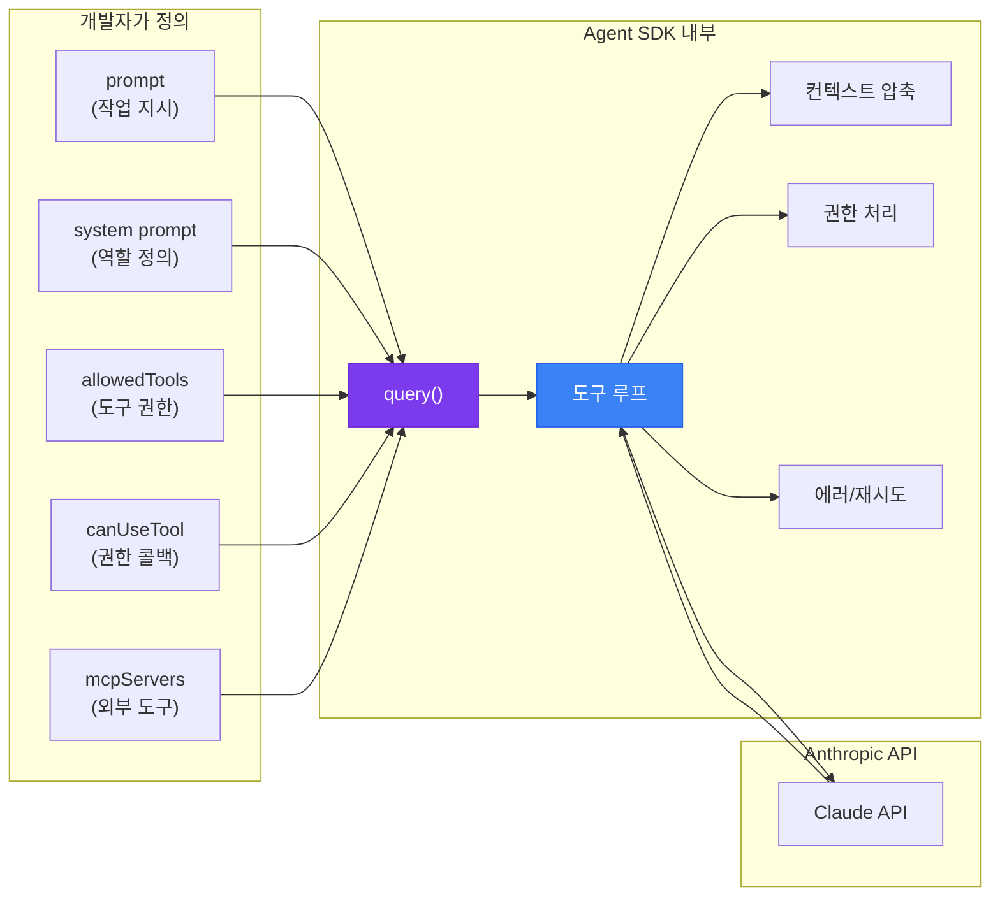
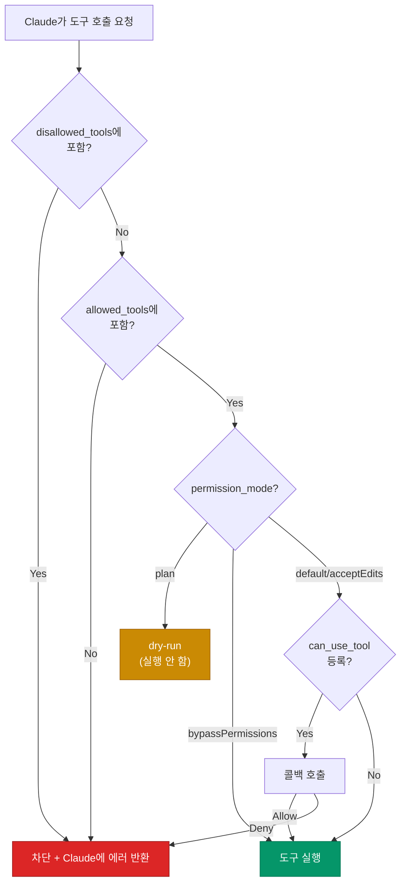
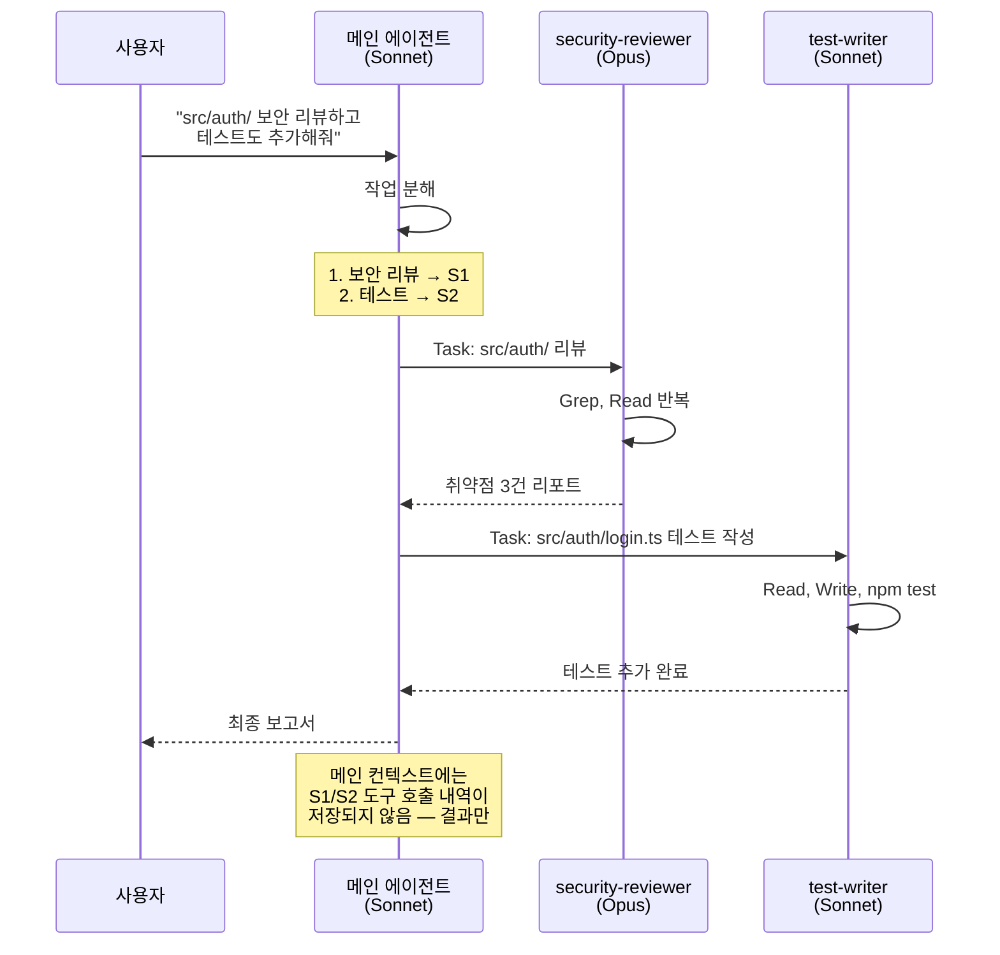

# Claude Agent SDK

Claude API로 에이전트를 만들 때 매번 직접 짜야 했던 부분 — 도구 루프, 컨텍스트 압축, 권한 처리, 파일·셸 접근 — 을 Anthropic이 SDK 형태로 묶어 둔 것이 Claude Agent SDK다. 내부적으로는 Claude Code를 만들 때 쓴 harness를 그대로 떼어내 공개했다. 그래서 SDK 이름이 처음엔 `claude-code-sdk`였다가 2026년 초 `claude-agent-sdk`로 바뀌었고, 패키지 이름도 같이 바뀌었다.

이 문서는 Agent SDK로 에이전트를 정의하고, 시스템 프롬프트를 짜고, 도구 권한을 걸고, 컨텍스트를 관리하는 방법을 다룬다. Raw Messages API로 직접 도구 루프를 짜는 방법은 [Claude](./Claude.md) 10절을 보면 된다. 여긴 그 위에 SDK가 얹어 놓은 추상화에 집중한다.

---

## 1. Agent SDK가 뭘 대신 해주는가

Raw API로 에이전트를 짜본 적이 있다면, 코드의 대부분이 비즈니스 로직이 아니라 보일러플레이트라는 걸 안다. tool_use 블록 파싱, tool_result 형식 맞추기, 멀티턴에서 thinking 블록 보존, 컨텍스트 길이가 임계점을 넘으면 압축, 도구 실행 권한 확인, 에러나 rate limit이 떨어지면 재시도. 이걸 매번 다시 짜는 게 일이다.

Agent SDK는 이 루프 전체를 `query()` 한 줄로 묶는다. 도구 호출, 파일 접근, 셸 실행, MCP 서버 연결, 컨텍스트 자동 압축, 권한 콜백, 서브에이전트 spawn까지 다 SDK 안에서 처리한다. 개발자는 "어떤 작업을 시킬지(prompt)", "어떤 도구를 허용할지(allowedTools)", "권한이 필요할 때 어떻게 대답할지(canUseTool)"만 정의하면 된다.



Raw API와 비교하면 차이가 명확하다. Raw API는 메시지를 한 번 주고받는 단발 호출이다. 그 위에 도구 루프를 얹는 건 개발자 몫이다. SDK는 "긴 작업 하나를 통째로 맡긴다"는 사용 모델로 바뀐다. `query()`를 호출하면 결과가 나올 때까지 SDK가 알아서 도구를 호출하고, 권한을 묻고, 컨텍스트를 압축하면서 진행한다.

| 항목 | Raw Messages API | Agent SDK |
|---|---|---|
| 호출 단위 | 메시지 한 턴 | 작업 하나 (여러 턴 묶음) |
| 도구 루프 | 직접 구현 | 내장 |
| 파일·셸 접근 | 직접 구현 | 내장 (Read, Edit, Bash 등) |
| MCP | 별도 클라이언트 | SDK 안에서 mount |
| 컨텍스트 압축 | 직접 구현 | 자동 |
| 권한 처리 | 직접 구현 | `canUseTool` 콜백 |
| 적합한 용도 | 단순 호출, 챗봇 | 코딩 에이전트, 운영 자동화 |

SDK를 쓴다고 해서 Raw API를 안 쓰게 되는 건 아니다. 한 번 요청 보내고 끝나는 단순 작업, 챗봇 같은 짧은 응답 패턴은 여전히 Raw API가 가볍다. SDK는 "작업을 통째로 위임"하는 패턴에 맞춰져 있다.

---

## 2. 설치와 첫 호출

SDK는 Python과 TypeScript 두 가지가 있다. 둘 다 내부적으로 Claude CLI를 실행한다. 그래서 Node.js 18 이상이 깔려 있어야 한다. Python SDK도 마찬가지로 Node.js가 필요한데, 이 부분을 모르고 Python만 설치했다가 `Claude Code not found` 에러를 보는 경우가 많다.

```bash
# Node.js 18+ 확인
node --version

# Claude CLI 설치 (SDK가 내부적으로 호출)
npm install -g @anthropic-ai/claude-code

# Python SDK
pip install claude-agent-sdk

# TypeScript SDK
npm install @anthropic-ai/claude-agent-sdk
```

`ANTHROPIC_API_KEY` 환경변수를 설정하거나, Claude subscription으로 로그인한 상태(`claude login`)면 SDK가 그 자격증명을 그대로 쓴다. 회사에서 Claude Pro 구독으로 돌리는 사이드 프로젝트라면 API key 없이 로그인만 해도 된다.

### 2.1 Python — 가장 짧은 예제

```python
import anyio
from claude_agent_sdk import query

async def main():
    async for message in query(prompt="현재 디렉토리의 Python 파일 개수를 세어줘"):
        print(message)

anyio.run(main)
```

`query()`는 async generator를 반환한다. SDK가 진행 상황을 메시지 단위로 stream으로 흘려준다. 도구를 호출할 때마다 `ToolUseMessage`, 결과가 들어올 때마다 `ToolResultMessage`, 최종 답변은 `AssistantMessage`로 도착한다.

처음 돌려보면 `Read`, `Glob`, `Bash` 같은 도구를 SDK가 알아서 호출해서 파일 개수를 세고, 결과를 텍스트로 정리해서 마지막 메시지로 준다. 도구 정의를 따로 짜지 않았는데 동작하는 건 SDK가 기본 도구 세트를 내장하고 있기 때문이다.

### 2.2 TypeScript — 동일 흐름

```typescript
import { query } from "@anthropic-ai/claude-agent-sdk";

for await (const message of query({
  prompt: "현재 디렉토리의 Python 파일 개수를 세어줘",
})) {
  console.log(message);
}
```

API 표면은 양쪽이 거의 똑같다. `query()`가 async iterable을 반환하고, `for await`로 돌리면 SDK가 흘려주는 메시지를 받는다. 옵션 이름도 같다(`allowedTools`, `permissionMode`, `mcpServers` 등). TS만 추가로 type-safe하다는 게 차이다.

### 2.3 메시지 스트림의 모양

SDK가 흘려주는 메시지는 몇 가지 타입으로 나뉜다. 모두 처리할 필요는 없고, 보통 `AssistantMessage`의 텍스트 블록과 `ResultMessage`만 보면 된다.

```python
async for message in query(prompt="..."):
    if message.type == "assistant":
        # Claude가 만든 응답 (텍스트 + tool_use 블록)
        for block in message.content:
            if block.type == "text":
                print(block.text)
    elif message.type == "tool_use":
        # 도구 호출 시작
        print(f"도구 호출: {message.name}")
    elif message.type == "tool_result":
        # 도구 실행 결과
        print(f"결과: {message.content}")
    elif message.type == "result":
        # 작업 종료 (최종 결과 + usage 정보)
        print(f"사용한 토큰: {message.usage.total_tokens}")
        print(f"비용: ${message.total_cost_usd}")
```

`ResultMessage`에 들어 있는 `total_cost_usd`는 작업 단위로 청구 금액을 계산해 준다. CI/CD나 배치 잡에 에이전트를 넣을 때 비용 모니터링에 그대로 쓰면 된다. 캐시 히트와 미스를 모두 반영한 실제 청구 금액이라, 직접 토큰 단가를 곱해서 계산할 필요가 없다.

---

## 3. 에이전트 정의 — query() 옵션

`query()` 한 줄의 안쪽이 사실상 에이전트 정의다. prompt, system prompt, 모델, 도구 권한, 작업 디렉토리, MCP 서버, 권한 콜백을 옵션으로 넘긴다.

```python
from claude_agent_sdk import query, ClaudeAgentOptions

options = ClaudeAgentOptions(
    system_prompt="너는 Spring Boot 코드 리뷰어다. 보안 이슈만 우선 지적해.",
    model="claude-opus-4-7",
    cwd="/Users/me/projects/api-server",
    allowed_tools=["Read", "Grep", "Glob"],
    permission_mode="default",
    max_turns=20,
)

async for message in query(
    prompt="src/main/java 아래 모든 컨트롤러를 리뷰해줘",
    options=options,
):
    ...
```

각 옵션이 실제로 뭘 바꾸는지 보자.

### 3.1 system_prompt — 역할과 제약 조건

`system_prompt`는 Raw API의 system과 같은 역할이다. 다만 SDK는 두 가지 모드를 지원한다.

**1) 문자열로 직접 지정** — 위 예제처럼 문자열을 넘기면 그게 그대로 system prompt가 된다. 도구는 모두 내장 기본 세트가 그대로 활성화된다.

**2) preset 기반 + 추가 지시** — Claude Code의 system prompt를 베이스로 깔고, 그 위에 내 도메인 지시를 얹는 방식이다.

```python
options = ClaudeAgentOptions(
    system_prompt={
        "type": "preset",
        "preset": "claude_code",
        "append": "이 프로젝트는 한국어 주석을 쓰는 Spring Boot 3 API 서버다.\n"
                  "Java 17 문법만 사용해야 한다.",
    },
)
```

`preset: "claude_code"`로 두면 Claude Code가 쓰는 코딩 에이전트용 system prompt(파일 읽기·편집 가이드, 도구 사용 규칙, 안전 가이드라인 등)가 기본으로 깔린다. 거기에 `append`로 내 프로젝트 컨벤션만 추가하면 된다.

실무에서는 거의 항상 preset + append 조합을 쓰는 게 낫다. 문자열만 넘기면 Claude Code 수준의 코딩 가이드가 빠진 상태로 도구를 쓰게 되는데, "파일을 읽기 전에 먼저 확인하라", "edit 후엔 검증하라" 같은 기본 행동 패턴이 없어서 실수가 잦다. 도메인 지시만 따로 관리하고 싶을 땐 append에 짧게 1~2문단만 넣는 식으로 운영한다.

system prompt를 짤 때 자주 빠지는 함정 몇 가지가 있다.

- 너무 긴 system prompt는 비용을 갉아먹는다. 매 턴마다 입력 토큰으로 청구된다. 대신 prompt caching이 자동으로 걸려서 두 번째 요청부터는 90% 할인이 들어가긴 하지만, 캐시 미스가 잦은 패턴이면 효과가 줄어든다.
- "단계별로 설명해줘" 같은 메타 지시는 system이 아니라 user prompt에 넣는 게 결과가 더 좋다. system은 "이 에이전트는 무엇이고 무엇을 안 한다"에 집중하고, "이번 작업은 이렇게 해줘"는 prompt에 넣는다.
- 영어로 짜야 더 잘 듣는 경우가 종종 있다. 한국어로 system prompt를 길게 쓰면 가끔 지시가 약하게 들어간다. 도메인 용어가 한국어라면 한국어로 쓰되, 행동 규칙은 영어로 쓰는 혼용 패턴이 실무에서 자주 보인다.

### 3.2 model — 모델 선택과 비용

SDK는 별도로 모델 ID를 지정하지 않으면 SDK 기본값(현재 Sonnet 계열)을 쓴다. 비용·품질 절충을 직접 잡고 싶으면 명시한다.

```python
options = ClaudeAgentOptions(model="claude-opus-4-7")          # 깊은 추론
options = ClaudeAgentOptions(model="claude-sonnet-4-6")        # 일반 작업
options = ClaudeAgentOptions(model="claude-haiku-4-5-20251001")  # 대량 처리
```

`fallback_model`을 같이 지정하면 메인 모델이 overloaded 응답을 보낼 때 자동으로 fallback으로 떨어진다. Opus 4.7로 돌리다가 트래픽 폭주가 났을 때 Sonnet 4.6으로 자동 강하하는 식이다.

```python
options = ClaudeAgentOptions(
    model="claude-opus-4-7",
    fallback_model="claude-sonnet-4-6",
)
```

서브에이전트마다 다른 모델을 쓰고 싶다면 `agents` 옵션 안에서 `model`을 따로 지정한다(6절 참조).

### 3.3 cwd — 작업 디렉토리

`cwd`는 에이전트가 파일을 읽고 쓰는 기준 경로다. 지정하지 않으면 프로세스 현재 디렉토리를 쓴다. 코딩 에이전트를 만들 때는 거의 항상 명시하는 게 안전하다. 안 그러면 의도치 않은 디렉토리에서 작업이 일어난다.

`additional_directories`로 작업 디렉토리 바깥의 경로도 접근 허용 목록에 넣을 수 있다. 예를 들어 메인은 `~/projects/api-server`인데 `~/configs/secrets-template`도 읽어야 한다면 후자를 `additional_directories`에 넣는다. 이 옵션에 없는 경로는 SDK가 Read·Edit 도구로 접근하려 할 때 거부한다.

### 3.4 max_turns — 무한 루프 가드

`max_turns`는 도구 호출 루프의 최대 반복 횟수다. SDK 기본값이 있긴 하지만, 운영에서는 명시적으로 거는 게 낫다. Claude가 같은 도구를 반복 호출하면서 진전이 없는 패턴(파일을 찾는다 → 못 찾는다 → 다시 찾는다)에 빠지면, max_turns가 빠져나가는 유일한 방법이다.

작업 성격별 가이드라인은 대체로 이렇다.

- 코드 리뷰 같은 정해진 흐름: 10~20
- 자유 탐색이 필요한 디버깅: 30~50
- 대규모 리팩토링: 50~100

이걸 넘기면 비용이 폭주한다. max_turns에 도달하면 SDK가 작업을 중단하고 `ResultMessage`에 `interrupted=True`로 알려준다. 그때까지의 부분 결과는 살아 있다.

---

## 4. 도구 권한 — allowedTools, permissionMode, canUseTool

도구 권한은 Agent SDK의 핵심이다. 코딩 에이전트는 셸 명령을 실행하고 파일을 고치기 때문에, 어떤 도구를 어디까지 허용할지가 안전성과 직결된다.

### 4.1 내장 도구 목록

SDK가 기본으로 제공하는 도구는 대략 이런 것들이 있다.

| 도구 | 역할 |
|---|---|
| `Read` | 파일 읽기 |
| `Edit` | 부분 편집 (exact string replace) |
| `Write` | 새 파일 작성·전체 덮어쓰기 |
| `Glob` | 파일 경로 패턴 매칭 |
| `Grep` | 파일 내용 검색 (ripgrep 기반) |
| `Bash` | 셸 명령 실행 |
| `WebFetch` | URL fetch |
| `WebSearch` | 웹 검색 |
| `Task` | 서브에이전트 spawn |

이 중에서 위험도가 다른 도구를 구분해야 한다. `Read`, `Grep`, `Glob`은 읽기 전용이라 위험이 낮다. `Edit`, `Write`는 파일을 바꾸니까 중간 위험이고, `Bash`는 마음대로 명령을 실행하니까 위험이 가장 크다. `WebFetch`와 `WebSearch`는 데이터 유출 가능성이 있어서 사내망에선 막는 경우가 많다.

### 4.2 allowed_tools — 화이트리스트

`allowed_tools`로 사용 가능한 도구를 제한한다. 빈 배열이거나 명시하지 않으면 모든 내장 도구가 켜진다.

```python
# 읽기 전용 에이전트 — 분석·리뷰용
options = ClaudeAgentOptions(
    allowed_tools=["Read", "Grep", "Glob"],
)

# 편집까지 허용
options = ClaudeAgentOptions(
    allowed_tools=["Read", "Edit", "Write", "Grep", "Glob"],
)

# Bash는 특정 명령만 허용
options = ClaudeAgentOptions(
    allowed_tools=["Read", "Edit", "Grep", "Glob", "Bash(npm test)", "Bash(npm run lint)"],
)
```

마지막 패턴이 실무에서 자주 쓴다. Bash 전체를 허용하면 너무 위험하고, 아예 막으면 테스트를 못 돌린다. `Bash(npm test)`처럼 명령을 명시하면 그 명령만 허용된다. `Bash(git:*)`처럼 wildcard도 된다.

`disallowed_tools`로 블랙리스트 방식도 가능하다. "모든 도구 허용, 다만 `Bash`와 `WebFetch`는 금지" 같은 패턴이 필요할 때 쓴다.

```python
options = ClaudeAgentOptions(
    disallowed_tools=["Bash", "WebFetch"],
)
```

### 4.3 permission_mode — 권한 처리 모드

`permission_mode`는 권한이 필요한 도구를 호출할 때 SDK가 어떻게 처리할지 결정한다.

| 모드 | 동작 |
|---|---|
| `"default"` | allowed_tools에 있으면 통과, 없으면 차단 |
| `"acceptEdits"` | 편집·셸은 통과, 그 외는 default |
| `"plan"` | 도구 호출을 시도만 하고 실행은 안 함 (dry-run) |
| `"bypassPermissions"` | 모든 권한 무시 (위험) |

`"plan"` 모드는 디버깅이나 견적용으로 유용하다. 실제로 파일을 바꾸기 전에 "Claude가 무슨 도구를 어떤 인자로 호출하려는지"만 보고 싶을 때 쓴다. CI에 에이전트를 처음 붙일 때 plan 모드로 며칠 돌려서 행동 패턴을 확인하고, 안전하다고 판단되면 default로 바꾸는 식의 운영이 흔하다.

`"bypassPermissions"`는 이름 그대로다. 무엇이든 통과시킨다. 컨테이너 안에 격리된 환경(샌드박스 VM 등)에서만 쓴다. 호스트에서 직접 켜면 사고가 난다.

### 4.4 can_use_tool — 권한 콜백

복잡한 권한 로직이 필요하면 `can_use_tool` 콜백을 등록한다. 매 도구 호출 직전에 SDK가 이 함수를 호출해서, 허용·거부·수정 여부를 묻는다.

```python
from claude_agent_sdk import (
    query,
    ClaudeAgentOptions,
    PermissionResultAllow,
    PermissionResultDeny,
)

async def gate(tool_name, tool_input, context):
    # Bash 명령은 정규식으로 한 번 더 검사
    if tool_name == "Bash":
        cmd = tool_input.get("command", "")
        if any(bad in cmd for bad in ["rm -rf", "sudo", "curl ", "wget "]):
            return PermissionResultDeny(message=f"금지된 명령: {cmd}")
        return PermissionResultAllow()

    # Edit은 src/ 아래만 허용
    if tool_name in ("Edit", "Write"):
        path = tool_input.get("file_path", "")
        if not path.startswith("/Users/me/projects/api-server/src/"):
            return PermissionResultDeny(message=f"허용 경로 밖: {path}")
        return PermissionResultAllow()

    return PermissionResultAllow()

options = ClaudeAgentOptions(
    allowed_tools=["Read", "Edit", "Write", "Bash"],
    can_use_tool=gate,
)
```

`can_use_tool`은 동기든 비동기든 다 받는다. 정규식 검사처럼 빠른 작업은 동기, 외부 API 호출이 필요하면 비동기로 쓴다. 회사 정책 서버에 "이 사용자가 이 디렉토리를 편집할 권한이 있는지" 묻는 패턴도 여기서 잡는다.

`PermissionResultAllow`에 `updated_input`을 넣어서 인자를 수정해 통과시키는 것도 가능하다. 예를 들어 절대 경로 대신 상대 경로로 강제 변환한다거나, 위험한 옵션을 빼고 통과시킨다거나 할 때 쓴다.

```python
return PermissionResultAllow(
    updated_input={"command": cmd.replace("--force", "")},
)
```

### 4.5 권한 처리 흐름

전체 권한 결정 흐름을 그리면 이렇다.



차단된 경우 Claude는 그냥 다음 시도를 한다. 도구 호출이 막혔다는 사실은 tool_result에 에러로 들어가고, Claude가 그걸 보고 다른 방법을 시도하거나 사용자에게 보고한다. 그래서 정책으로 어떤 동작을 막아도 에이전트가 죽지 않고 우회 경로를 찾는다.

---

## 5. 컨텍스트 관리

긴 작업을 돌리면 컨텍스트가 200K 한도에 닿는다. Raw API에선 개발자가 직접 메시지를 잘라내거나 요약해서 다시 넣어야 했다. SDK는 이걸 자동으로 한다.

### 5.1 자동 압축

작업이 진행되면서 메시지 누적량이 임계점(컨텍스트 한도의 약 80~85%)에 가까워지면, SDK가 자동으로 압축 단계를 끼워 넣는다. 압축은 별도 Claude 호출로 처리된다. "여기까지 어떤 도구를 호출했고 어떤 결과가 나왔는지" 요약을 만들고, 그 요약으로 누적 메시지를 대체한다. 그 후 작업이 계속된다.

이 동작은 기본으로 켜져 있다. 끄려면 `disable_compaction=True`를 명시한다. 끄면 컨텍스트 초과 시 작업이 실패하니까, 짧은 작업에만 쓴다.

```python
options = ClaudeAgentOptions(
    disable_compaction=False,  # 기본값
)
```

압축이 일어났는지 확인하려면 메시지 스트림에서 `system` 타입을 본다. 압축 시점에 시스템 메시지가 흘러나온다.

```python
async for message in query(prompt="...", options=options):
    if message.type == "system" and "compact" in str(message).lower():
        print("컨텍스트 압축됨")
```

압축이 일어나면 가끔 세부 정보가 손실된다. 파일 X의 line 42에 있던 함수의 구현 같은 미세 정보가 요약 단계에서 빠질 수 있다. 그래서 정확한 라인 추적이 중요한 작업(보안 감사, 정밀한 리팩토링)에서는 max_turns를 작게 잡아서 압축이 일어나기 전에 끝내는 편이 안전하다.

### 5.2 세션과 재개 — fork_session, resume

긴 작업을 한 번에 끝내지 못하고, 며칠 뒤 이어 받고 싶을 때가 있다. SDK는 세션 단위로 상태를 저장하고 재개할 수 있다.

```python
# 첫 실행
options = ClaudeAgentOptions(...)
async for msg in query(prompt="대규모 리팩토링 1단계 시작", options=options):
    if msg.type == "result":
        session_id = msg.session_id

# 며칠 뒤 같은 세션 이어서
options = ClaudeAgentOptions(
    resume=session_id,
)
async for msg in query(prompt="2단계 진행해줘", options=options):
    ...
```

`fork_session=True`를 같이 주면 기존 세션을 복제해서 분기한다. "이 시점부터 두 가지 전략을 동시에 시도해본다" 같은 패턴에서 쓴다.

### 5.3 설정 소스 — setting_sources

SDK는 기본적으로 Claude Code의 설정(`CLAUDE.md`, `.claude/settings.json`, 등록된 hooks와 slash command)을 자동으로 읽지 않는다. SDK는 임베디드 라이브러리라서, 호스트 프로젝트의 Claude Code 설정과 격리되는 게 디폴트다.

읽고 싶다면 `setting_sources`를 명시한다.

```python
options = ClaudeAgentOptions(
    setting_sources=["project"],  # ./.claude/ 와 ./CLAUDE.md를 읽음
)
```

선택지는 `"user"` (홈디렉토리), `"project"` (cwd), `"local"` (cwd의 .local 변형) 세 가지다. 프로젝트의 CLAUDE.md를 system prompt에 자동으로 깔고 싶다면 `["project"]`를 넣는다.

이걸 안 켜고 CLAUDE.md를 system_prompt의 append로 직접 읽어서 넣는 패턴도 흔하다. 어느 쪽이 나은지는 운영 환경 나름이다. CI에서 돌리는 에이전트는 외부 설정에 영향받지 않게 명시적으로 system_prompt를 짜는 편이 디버깅이 쉽다.

---

## 6. 서브에이전트와 작업 분기

복잡한 작업은 한 에이전트가 다 처리하기 어렵다. "전체 리뷰는 메인 에이전트가 지시하고, 각 모듈별 분석은 서브에이전트에 위임" 같은 분기가 필요하다.

SDK는 `agents` 옵션으로 서브에이전트를 정의한다. 메인 에이전트가 `Task` 도구를 호출할 때 어떤 서브에이전트를 쓸지 고른다.

```python
options = ClaudeAgentOptions(
    system_prompt={"type": "preset", "preset": "claude_code"},
    agents={
        "security-reviewer": {
            "description": "보안 취약점 전문 리뷰어. SQL Injection, XSS, 인증 우회 위주",
            "prompt": "너는 OWASP Top 10을 기준으로 코드를 리뷰한다. "
                      "발견한 취약점은 심각도와 함께 보고하라.",
            "tools": ["Read", "Grep", "Glob"],
            "model": "claude-opus-4-7",
        },
        "test-writer": {
            "description": "Jest 기반 테스트 코드를 작성한다",
            "prompt": "주어진 함수에 대해 Jest 단위 테스트를 작성한다. "
                      "정상 케이스와 엣지 케이스를 모두 포함하라.",
            "tools": ["Read", "Write", "Bash(npm test)"],
            "model": "claude-sonnet-4-6",
        },
    },
)
```

메인 에이전트는 작업 흐름에 따라 `Task` 도구를 호출해서 서브에이전트에 일을 넘긴다. 메인은 결과만 받고, 서브에이전트가 쓴 중간 도구 호출은 메인 컨텍스트에 누적되지 않는다. 이게 컨텍스트 절약의 핵심이다.



서브에이전트 모델을 메인과 다르게 가져가는 게 비용 측면에서 효과가 크다. 메인은 Sonnet으로 흐름을 잡고, 보안 분석처럼 깊은 추론이 필요한 부분만 Opus로 떨어뜨린다. 반대로 단순 변환·요약은 Haiku로 떨어뜨리면 비용을 한 자릿수로 줄일 수 있다.

서브에이전트 정의 시 자주 빠지는 함정이 있다. `description`이 모호하면 메인이 잘못된 서브에이전트를 고른다. "코드 리뷰어"라고만 적으면 보안 리뷰가 필요한 상황에서 일반 리뷰어를 부른다. "보안 취약점 전문" 같은 키워드를 description에 명시해야 메인이 제대로 라우팅한다.

---

## 7. MCP 통합

MCP(Model Context Protocol)는 외부 도구를 표준화된 방식으로 에이전트에 mount하는 프로토콜이다. SDK는 stdio·http·sse 세 가지 transport와, in-process MCP 서버까지 지원한다. MCP 자체에 대한 자세한 설명은 [MCP](../MCP/MCP.md) 문서에 있다. 여긴 SDK 쪽 통합 패턴만 본다.

### 7.1 외부 MCP 서버 mount

```python
options = ClaudeAgentOptions(
    mcp_servers={
        "filesystem": {
            "type": "stdio",
            "command": "npx",
            "args": ["-y", "@modelcontextprotocol/server-filesystem", "/tmp"],
        },
        "github": {
            "type": "http",
            "url": "https://mcp.github.com",
            "headers": {"Authorization": f"Bearer {os.environ['GH_TOKEN']}"},
        },
    },
)
```

MCP 서버가 노출하는 도구는 자동으로 Claude에 도구 목록에 추가된다. 이름은 `mcp__<서버명>__<도구명>` 형식이다. 그래서 allowed_tools에 넣을 때는 prefix를 맞춰야 한다.

```python
options = ClaudeAgentOptions(
    mcp_servers={...},
    allowed_tools=[
        "Read", "Edit",
        "mcp__filesystem__read_file",
        "mcp__github__create_issue",
    ],
)
```

도구가 많은 MCP 서버를 mount하면 도구 목록만으로 입력 토큰이 크게 늘어난다. 필요한 도구만 화이트리스트로 잡는 게 비용 측면에서 유리하다.

### 7.2 in-process MCP — SDK 안에서 직접 도구 정의

외부 서버를 띄울 만큼 일이 크지 않을 때, SDK 안에서 직접 도구를 정의해서 노출할 수 있다. `create_sdk_mcp_server`와 `@tool` 데코레이터를 쓴다.

```python
from claude_agent_sdk import create_sdk_mcp_server, tool, ClaudeAgentOptions, query

@tool(
    name="lookup_employee",
    description="사원 번호로 직원 정보를 조회한다",
    input_schema={
        "type": "object",
        "properties": {"employee_id": {"type": "string"}},
        "required": ["employee_id"],
    },
)
async def lookup_employee(args):
    eid = args["employee_id"]
    # 실제로는 DB나 API 호출
    return {
        "content": [
            {"type": "text", "text": f"사원 {eid}: 김민수, 개발팀"}
        ]
    }

hr_server = create_sdk_mcp_server(
    name="hr",
    version="1.0.0",
    tools=[lookup_employee],
)

options = ClaudeAgentOptions(
    mcp_servers={"hr": hr_server},
    allowed_tools=["mcp__hr__lookup_employee"],
)

async for msg in query(prompt="사원번호 E1234 정보 알려줘", options=options):
    ...
```

이 방식이 좋은 점은 별도 프로세스가 없어서 디버깅이 쉽고 latency도 낮다는 거다. 사내 시스템 연동처럼 한 프로젝트 안에서만 쓸 도구는 in-process로 만드는 게 운영 부담이 적다. 외부 팀과 공유하거나 여러 에이전트가 재사용할 도구라면 별도 MCP 서버로 빼는 게 낫다.

---

## 8. Hooks — 자동화 트리거

Hooks는 도구 호출의 특정 시점에 코드를 끼워 넣는 메커니즘이다. 도구 호출 직전에 검증, 직후에 로깅, 작업 시작·종료 시 정리 같은 작업을 한다.

```python
async def log_bash_calls(input_data, tool_use_id, context):
    if input_data["tool_name"] == "Bash":
        cmd = input_data["tool_input"].get("command", "")
        print(f"[bash] {cmd}")
    return {}  # 빈 dict는 통과 의미

options = ClaudeAgentOptions(
    hooks={
        "PreToolUse": [
            {"hooks": [log_bash_calls]},
        ],
    },
)
```

훅 종류는 대략 이런 것들이 있다.

| 훅 | 발화 시점 |
|---|---|
| `PreToolUse` | 도구 호출 직전 |
| `PostToolUse` | 도구 실행 직후 (결과 포함) |
| `UserPromptSubmit` | 사용자 prompt가 들어왔을 때 |
| `Stop` | 작업 종료 시 |
| `SubagentStop` | 서브에이전트 종료 시 |

`PreToolUse`에서 dict를 반환하면 도구 호출을 막거나 인자를 수정할 수 있다. `can_use_tool`과 비슷한 역할인데, hooks는 도구 이름별로 필터링이 가능하고, can_use_tool은 모든 도구 호출에 걸린다.

실무에선 hooks를 감사 로그, 자동 테스트 트리거, 외부 시스템 알림(예: Slack)에 자주 쓴다. Edit이 일어날 때마다 file path를 모아서 작업 끝나면 "이 PR에서 바뀐 파일들"로 코멘트를 다는 식이다.

---

## 9. 실전 예제 — Python

처음부터 끝까지 동작하는 예제를 본다. "특정 디렉토리의 Python 파일에서 print()를 logger로 바꾸고, 테스트를 돌려본다"는 작업이다.

```python
import anyio
import os
from claude_agent_sdk import (
    query,
    ClaudeAgentOptions,
    PermissionResultAllow,
    PermissionResultDeny,
)

PROJECT_ROOT = "/Users/me/projects/data-pipeline"

async def safety_gate(tool_name, tool_input, context):
    # Edit·Write는 프로젝트 루트 안에서만
    if tool_name in ("Edit", "Write"):
        path = tool_input.get("file_path", "")
        if not path.startswith(PROJECT_ROOT):
            return PermissionResultDeny(message=f"허용 경로 밖: {path}")

    # Bash는 pytest만
    if tool_name == "Bash":
        cmd = tool_input.get("command", "")
        if not cmd.startswith("pytest"):
            return PermissionResultDeny(message=f"pytest만 허용: {cmd}")

    return PermissionResultAllow()

async def main():
    options = ClaudeAgentOptions(
        system_prompt={
            "type": "preset",
            "preset": "claude_code",
            "append": (
                "이 프로젝트는 Python 3.11 데이터 파이프라인이다. "
                "로깅은 `logger = logging.getLogger(__name__)` 패턴을 쓴다. "
                "print() 호출은 모두 logger.info()로 바꿔라. "
                "변경 후엔 반드시 pytest로 검증한다."
            ),
        },
        model="claude-sonnet-4-6",
        cwd=PROJECT_ROOT,
        allowed_tools=[
            "Read", "Edit", "Glob", "Grep",
            "Bash(pytest)", "Bash(pytest:*)",
        ],
        can_use_tool=safety_gate,
        max_turns=40,
    )

    prompt = (
        "src/pipeline/ 안의 Python 파일에서 print() 호출을 모두 찾아서 "
        "logger.info()로 바꿔라. 파일별로 처리하고, 끝나면 pytest로 검증해라."
    )

    total_cost = 0.0
    edited_files = set()

    async for message in query(prompt=prompt, options=options):
        if message.type == "assistant":
            for block in message.content:
                if block.type == "text":
                    print(block.text)
        elif message.type == "tool_use" and message.name in ("Edit", "Write"):
            edited_files.add(message.input.get("file_path", ""))
        elif message.type == "result":
            total_cost = message.total_cost_usd
            print(f"\n--- 작업 종료 ---")
            print(f"수정한 파일: {len(edited_files)}개")
            print(f"비용: ${total_cost:.4f}")

anyio.run(main)
```

이 코드가 보여주는 것들을 정리하면 이렇다.

- `safety_gate`로 Edit은 프로젝트 루트 안, Bash는 pytest로 제한한다. 정책 위반이 들어오면 Claude는 차단당하고 다른 방법을 시도한다.
- system_prompt는 preset에 도메인 룰만 append한다. Claude Code의 기본 코딩 가이드는 보존된다.
- 메시지 스트림에서 Edit·Write 호출의 file_path를 모아서 작업 끝에 "어떤 파일을 바꿨는지" 직접 집계한다. 실무 운영에서 PR 코멘트나 감사 로그에 그대로 쓴다.
- 비용은 `ResultMessage.total_cost_usd`에 들어 있다. 별도 토큰 합산 없이 한 줄로 모니터링 끝.

40 max_turns로 잡아도 200K 컨텍스트 안에서 끝나는 경우가 대부분이다. 더 큰 작업이면 자동 압축이 들어가지만, 정밀한 변경이 필요하다면 디렉토리를 쪼개서 여러 번 호출하는 편이 낫다.

---

## 10. 실전 예제 — TypeScript

같은 작업을 TS SDK로 짠다. 옵션 이름이 camelCase로 바뀌는 것 외에는 거의 동일하다.

```typescript
import { query, type Options } from "@anthropic-ai/claude-agent-sdk";

const PROJECT_ROOT = "/Users/me/projects/api-gateway";

const safetyGate: Options["canUseTool"] = async (toolName, toolInput) => {
  if (toolName === "Edit" || toolName === "Write") {
    const path = (toolInput as any).file_path ?? "";
    if (!path.startsWith(PROJECT_ROOT)) {
      return { behavior: "deny", message: `허용 경로 밖: ${path}` };
    }
  }
  if (toolName === "Bash") {
    const cmd = (toolInput as any).command ?? "";
    if (!cmd.startsWith("npm test") && !cmd.startsWith("npm run lint")) {
      return { behavior: "deny", message: `허용된 명령이 아님: ${cmd}` };
    }
  }
  return { behavior: "allow", updatedInput: toolInput };
};

const options: Options = {
  systemPrompt: {
    type: "preset",
    preset: "claude_code",
    append:
      "이 프로젝트는 NestJS 10 기반 API 게이트웨이다. " +
      "모든 컨트롤러는 class-validator로 입력 검증을 한다. " +
      "DTO에 검증 데코레이터가 빠진 필드를 찾아 추가해라.",
  },
  model: "claude-sonnet-4-6",
  cwd: PROJECT_ROOT,
  allowedTools: [
    "Read", "Edit", "Glob", "Grep",
    "Bash(npm test)", "Bash(npm run lint)",
  ],
  canUseTool: safetyGate,
  maxTurns: 30,
};

const editedFiles = new Set<string>();
let totalCost = 0;

for await (const message of query({
  prompt:
    "src/modules/ 아래 모든 *.dto.ts 파일에서 검증 데코레이터가 빠진 필드를 찾아 추가해라. " +
    "끝나면 npm run lint로 검증해라.",
  options,
})) {
  switch (message.type) {
    case "assistant":
      for (const block of message.content) {
        if (block.type === "text") console.log(block.text);
      }
      break;
    case "tool_use":
      if (message.name === "Edit" || message.name === "Write") {
        editedFiles.add((message.input as any).file_path);
      }
      break;
    case "result":
      totalCost = message.total_cost_usd;
      console.log("\n--- 작업 종료 ---");
      console.log(`수정한 파일: ${editedFiles.size}개`);
      console.log(`비용: $${totalCost.toFixed(4)}`);
      break;
  }
}
```

Python과 다른 점이 몇 가지 있다.

- `canUseTool`의 반환이 dict 형식이다. `{ behavior: "allow" }` 또는 `{ behavior: "deny", message: "..." }`로 응답한다.
- 옵션은 `Options` 타입으로 잡혀 있어서 IDE에서 자동완성이 잘 된다. 옵션을 잘못 넣어도 컴파일 단계에서 잡힌다.
- async iteration은 `for await (const x of query(...))` 패턴이다. AsyncGenerator라 일찍 빠져나가려면 break를 쓰면 된다.

TS SDK는 Node.js 18 이상이 필요하다. Bun이나 Deno에서도 돌지만 일부 옵션에서 호환성 이슈가 있다. 운영 환경에서는 Node 20 LTS 이상이 안전하다.

---

## 11. 자주 겪는 문제

### 11.1 "Claude Code not found" 에러

Python SDK가 내부적으로 Claude CLI를 호출하는데, 그게 PATH에 없으면 이 에러가 난다. `npm install -g @anthropic-ai/claude-code`로 깔거나, `CLAUDE_CODE_EXECUTABLE` 환경변수로 경로를 명시한다. Docker 이미지로 패키징할 땐 빌드 단계에서 npm 글로벌 설치를 잊지 말아야 한다.

### 11.2 도구 호출이 무한히 반복된다

같은 도구를 같은 인자로 반복 호출하면서 진전이 없을 때다. 원인은 보통 둘 중 하나다. 첫째, system prompt에 "찾을 때까지 계속 시도해라" 같은 무한 재시도 지시가 있다. 둘째, 도구가 에러를 반환하지만 에러 메시지가 모호해서 Claude가 같은 시도를 반복한다.

`max_turns`로 일단 막고, hooks의 `PreToolUse`에서 같은 도구 호출이 N번 반복되면 중단하는 로직을 추가한다. 정수 카운터를 hook 함수 closure에 두고, 임계치 초과 시 deny로 반환하면 된다.

### 11.3 권한 콜백이 안 불린다

`can_use_tool`을 등록했는데 호출이 안 된다면 `permission_mode`를 확인한다. `"bypassPermissions"`로 두면 콜백이 무시된다. 또 `allowed_tools`에 도구가 없으면 콜백 전에 차단되니까, 일단 도구를 화이트리스트에 넣은 다음 콜백으로 세밀하게 거르는 순서다.

### 11.4 MCP 서버가 안 붙는다

stdio MCP 서버를 mount했는데 도구가 안 보이면, 보통은 mcp_servers 설정의 `command`나 `args`가 잘못된 경우다. 터미널에서 같은 명령을 직접 돌려서 서버가 stdin/stdout으로 응답하는지 확인하면 빠르다. http MCP라면 헤더 인증이 빠진 경우가 많다. SDK 디버그 로그를 켜려면 `CLAUDE_AGENT_DEBUG=1` 환경변수를 세팅한다.

### 11.5 작업이 도중에 중단된다 — interrupted

`ResultMessage.interrupted=True`로 끝나는 경우다. max_turns 초과가 가장 흔한 원인이고, 그 다음이 외부 시그널(Ctrl+C, 컨테이너 SIGTERM)이다. 작업이 끝나기 전에 중단됐다는 의미인데, 그때까지 SDK가 한 변경(파일 편집, 셸 명령 실행)은 그대로 남는다. CI에서 돌릴 때는 interrupted를 실패로 처리하고 롤백할지, 부분 결과를 받아들일지 운영 정책을 정해 둬야 한다.

### 11.6 비용이 예상보다 많이 나온다

세 가지 의심 포인트가 있다. 첫째, 서브에이전트가 너무 자주 호출돼서 각자 컨텍스트를 펼치고 있다. 메인 에이전트의 system prompt에서 "단순 작업은 직접 처리하라"를 명시한다. 둘째, MCP 서버의 도구 정의가 길어서 매 요청에 입력 토큰이 크게 들어간다. 안 쓰는 도구는 allowed_tools에서 빼서 정의를 생략시킨다. 셋째, 자동 압축이 일어나면서 압축 호출 자체에 토큰이 들어간다. 짧은 작업으로 쪼개서 압축이 일어나기 전에 끝내는 편이 싸게 먹힌다.

### 11.7 stream 메시지를 처음부터 끝까지 못 받았다

async iteration을 break로 빠져나오면, SDK는 백그라운드에서 작업을 계속 진행하지만 결과를 못 받는다. 작업을 명시적으로 중단하려면 break가 아니라 `AbortController`(TS) 또는 task cancel(Python)을 쓴다. 그래야 SDK가 진행 중인 도구 호출까지 정리하고 깨끗하게 종료한다.

---

## 12. Raw API와 어떻게 섞어 쓸지

Agent SDK가 모든 경우에 답은 아니다. 다음 표가 대략의 가이드라인이다.

| 시나리오 | 추천 |
|---|---|
| 단순 챗봇 (1턴 응답) | Raw Messages API |
| RAG (검색 + 한 번 응답) | Raw Messages API |
| 도구 1~2개만 쓰는 단순 워크플로 | Raw Messages API + 직접 루프 |
| 코드 분석·편집 에이전트 | Agent SDK |
| 운영 자동화 (CI/CD, 잡 관리) | Agent SDK |
| 멀티 에이전트 분기 | Agent SDK (`agents` 옵션) |
| 사내 시스템 통합 | Agent SDK + in-process MCP |

Raw API를 쓰다가 도구 루프를 손수 짜고 있다면, 그 시점이 SDK로 갈아탈 신호다. 반대로 SDK로 짰는데 그 안에서 거의 한 번만 호출하고 끝낸다면 Raw API로 내려가는 게 가볍다. SDK는 작업 단위 위임이 가치이고, 그 모델에 맞지 않으면 오히려 무겁다.

도구 호출의 메커니즘 자체를 더 알고 싶다면 [Claude](./Claude.md)의 10절 Tool Use를, MCP의 구조와 자체 서버 작성은 [MCP](../MCP/MCP.md)를, Claude Code를 CLI로 쓰는 방식과 차이를 보고 싶다면 [Claude Code](../Claude_Code/Claude_Code.md)를 참고하면 된다. Agent SDK는 결국 그 모든 조각을 라이브러리 모양으로 묶어 둔 것이다.
