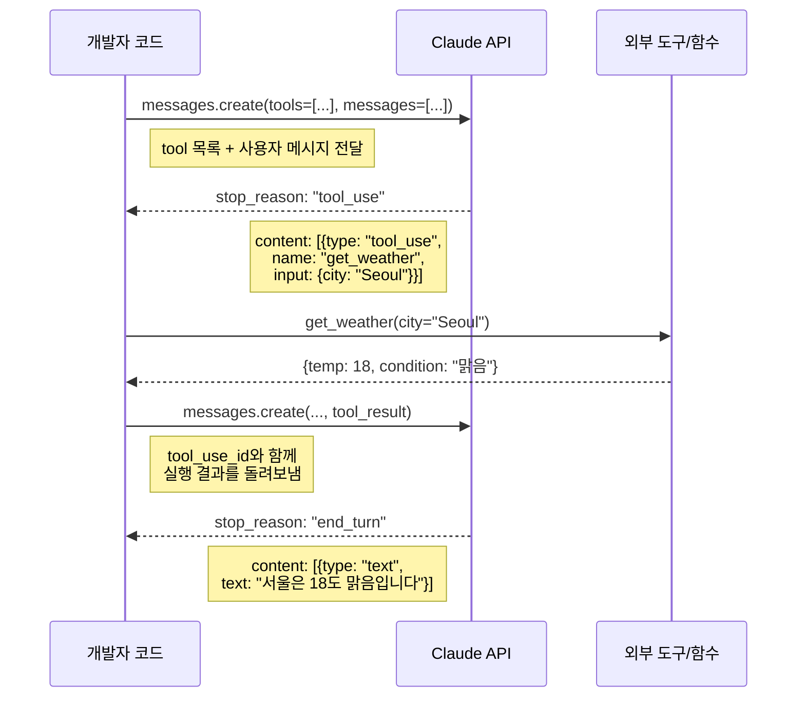
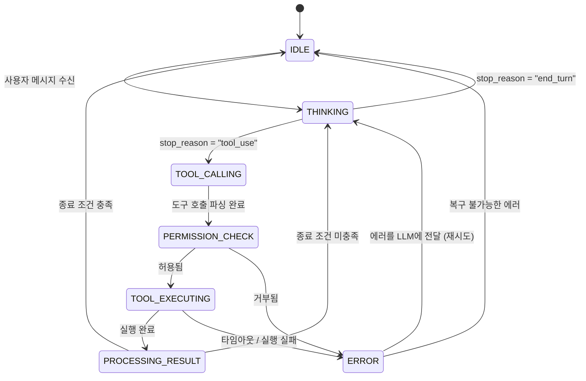
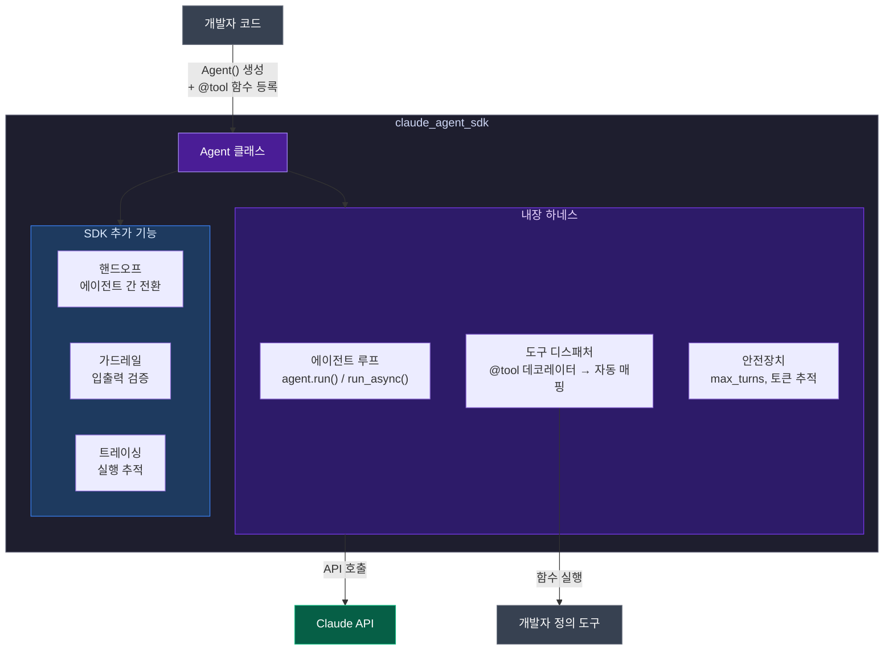
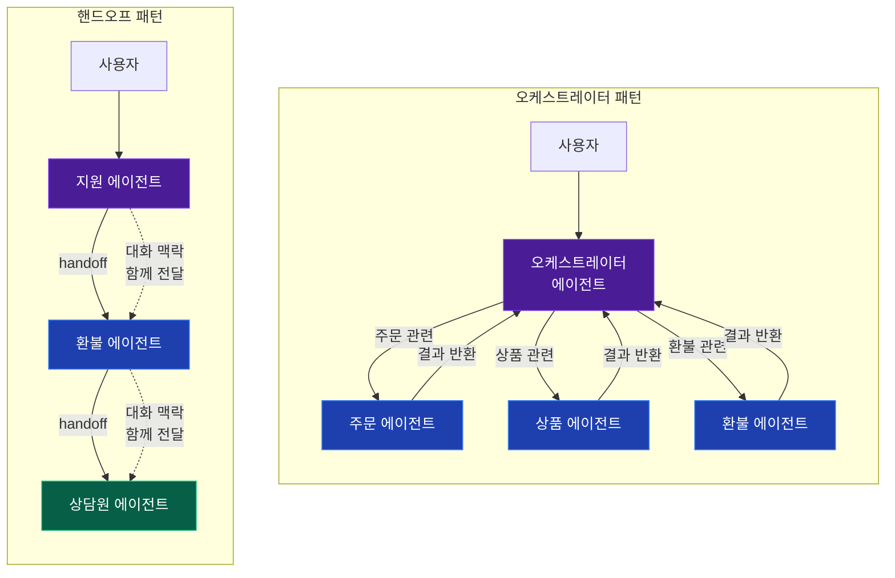
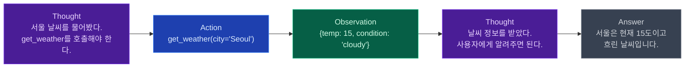
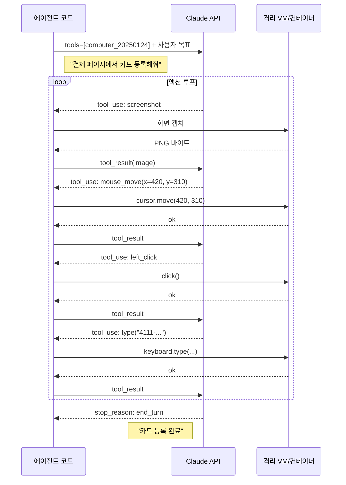
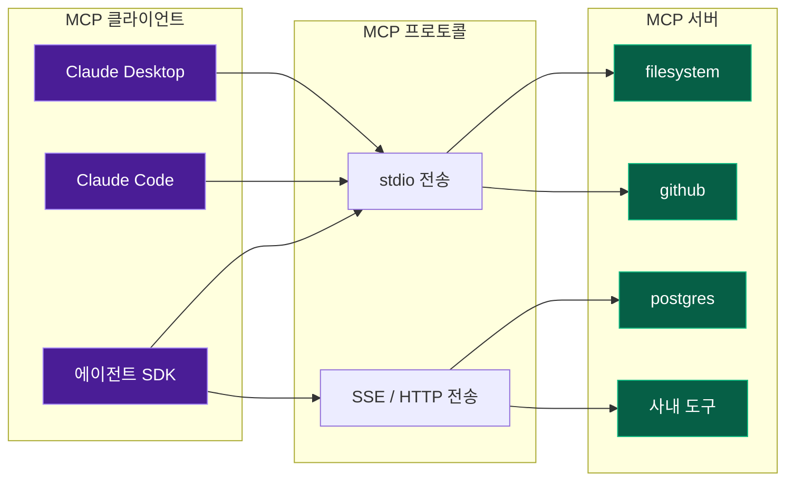
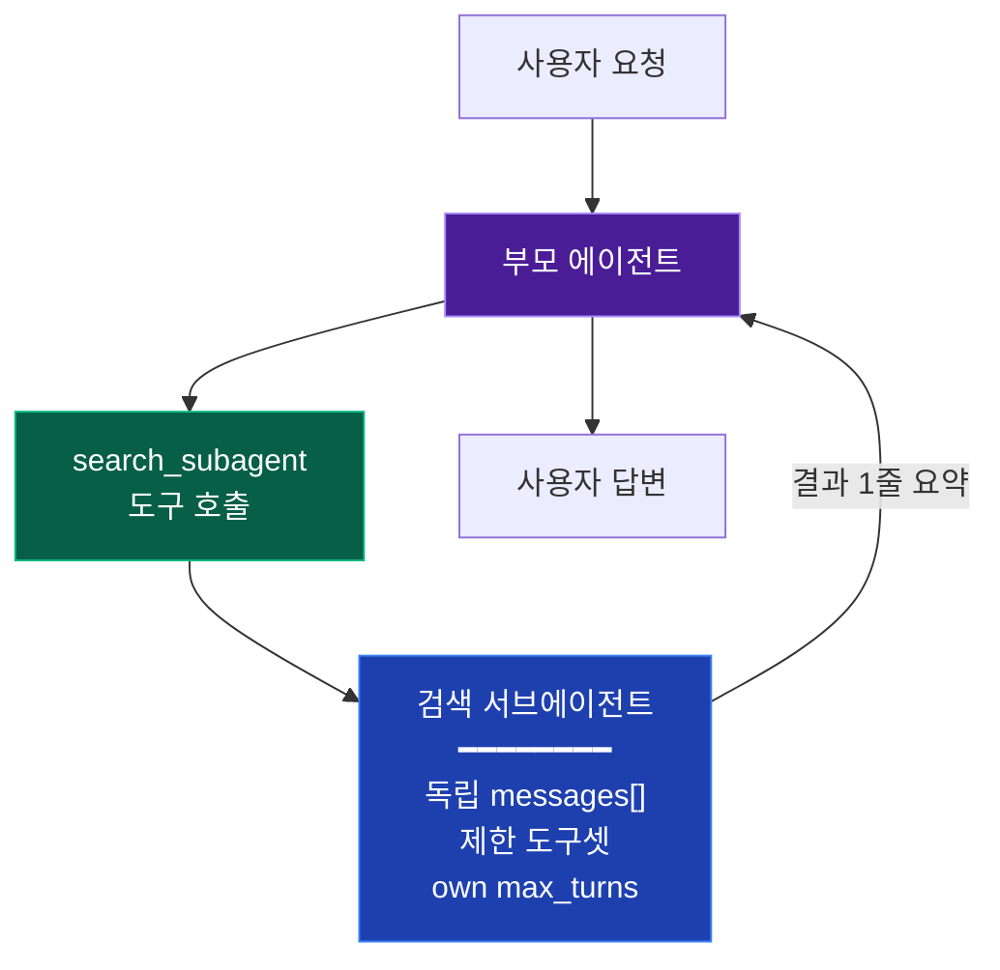
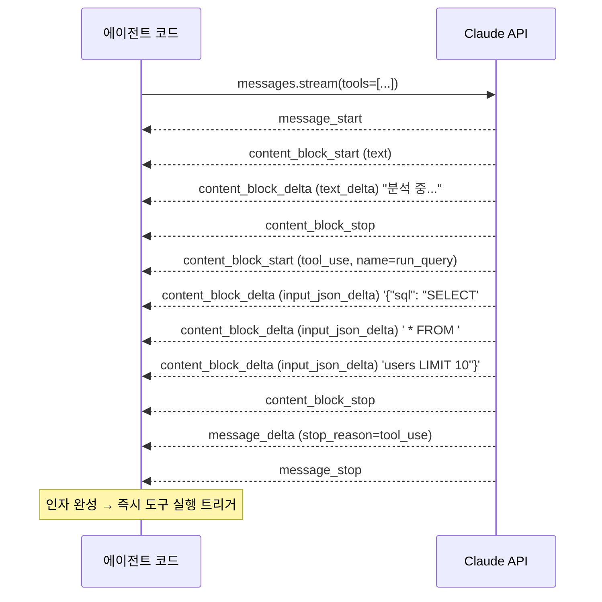

# Claude Agent

Claude API를 기반으로 직접 에이전트를 만드는 방법을 다룬다. Claude Code라는 완성된 도구를 쓰는 게 아니라, Tool Use API와 Agent SDK를 써서 내 서비스에 맞는 에이전트를 구축하는 내용이다.

---

## 1. Tool Use (Function Calling)

### 1.1 Tool Use란

LLM이 텍스트만 생성하는 게 아니라, 사전에 정의한 함수를 호출할 수 있게 하는 기능이다. Claude에게 "이런 도구가 있다"고 알려주면, 사용자 요청에 따라 어떤 도구를 어떤 인자로 호출해야 하는지 JSON으로 응답한다. 실제 함수 실행은 개발자가 한다.

다음 다이어그램이 전체 흐름이다.



텍스트로 정리하면 이렇다:

```
1. 개발자가 tool 목록을 정의해서 API에 전달
2. Claude가 사용자 메시지를 보고 tool 호출이 필요한지 판단
3. 필요하면 tool_use 블록으로 함수명과 인자를 응답
4. 개발자가 해당 함수를 실행하고 결과를 tool_result로 돌려줌
5. Claude가 결과를 보고 최종 답변을 생성
```

중요한 건, Claude가 직접 함수를 실행하지 않는다는 점이다. Claude는 "이 함수를 이 인자로 호출해달라"고 JSON으로 요청만 하고, 실제 실행은 개발자 코드에서 한다. 이 구조가 보안과 제어 측면에서 핵심이다.

### 1.2 Tool 정의

도구는 JSON Schema 형식으로 정의한다. `name`, `description`, `input_schema`가 필수다.

```python
tools = [
    {
        "name": "get_weather",
        "description": "특정 도시의 현재 날씨 정보를 조회한다.",
        "input_schema": {
            "type": "object",
            "properties": {
                "city": {
                    "type": "string",
                    "description": "도시 이름 (예: Seoul, Tokyo)"
                },
                "unit": {
                    "type": "string",
                    "enum": ["celsius", "fahrenheit"],
                    "description": "온도 단위"
                }
            },
            "required": ["city"]
        }
    },
    {
        "name": "search_database",
        "description": "사용자 데이터베이스에서 조건에 맞는 레코드를 검색한다.",
        "input_schema": {
            "type": "object",
            "properties": {
                "table": {
                    "type": "string",
                    "description": "테이블 이름"
                },
                "conditions": {
                    "type": "object",
                    "description": "검색 조건 (컬럼명: 값)"
                },
                "limit": {
                    "type": "integer",
                    "description": "최대 결과 수"
                }
            },
            "required": ["table"]
        }
    }
]
```

`description`이 빈약하면 Claude가 도구를 잘못 선택하거나 엉뚱한 인자를 넣는 경우가 생긴다. "무엇을 하는 도구인지", "어떤 상황에서 써야 하는지"를 구체적으로 적어야 한다.

### 1.3 Tool Use 호출과 결과 처리

```python
import anthropic
import json

client = anthropic.Anthropic()

response = client.messages.create(
    model="claude-sonnet-4-6",
    max_tokens=1024,
    tools=tools,
    messages=[
        {"role": "user", "content": "서울 날씨 알려줘"}
    ]
)

# stop_reason이 "tool_use"이면 도구 호출 요청이 온 것
if response.stop_reason == "tool_use":
    # content에서 tool_use 블록을 찾는다
    for block in response.content:
        if block.type == "tool_use":
            tool_name = block.name      # "get_weather"
            tool_input = block.input    # {"city": "Seoul"}
            tool_use_id = block.id      # 고유 ID

            # 실제 함수 실행
            result = call_actual_function(tool_name, tool_input)

            # 결과를 Claude에게 돌려보낸다
            followup = client.messages.create(
                model="claude-sonnet-4-6",
                max_tokens=1024,
                tools=tools,
                messages=[
                    {"role": "user", "content": "서울 날씨 알려줘"},
                    {"role": "assistant", "content": response.content},
                    {
                        "role": "user",
                        "content": [
                            {
                                "type": "tool_result",
                                "tool_use_id": tool_use_id,
                                "content": json.dumps(result, ensure_ascii=False)
                            }
                        ]
                    }
                ]
            )
```

`tool_result`의 `tool_use_id`는 반드시 대응하는 `tool_use` 블록의 `id`와 일치해야 한다. 불일치하면 API에서 에러가 난다.

### 1.4 한 번에 여러 도구 호출 (Parallel Tool Use)

Claude가 한 번의 응답에서 여러 tool_use 블록을 보내는 경우가 있다. "서울이랑 도쿄 날씨 비교해줘"라고 하면 `get_weather`를 두 번 호출하는 식이다.

```python
# response.content에 tool_use 블록이 여러 개 들어있을 수 있다
tool_results = []
for block in response.content:
    if block.type == "tool_use":
        result = call_actual_function(block.name, block.input)
        tool_results.append({
            "type": "tool_result",
            "tool_use_id": block.id,
            "content": json.dumps(result, ensure_ascii=False)
        })

# 모든 결과를 한 번에 돌려보내야 한다
followup = client.messages.create(
    model="claude-sonnet-4-6",
    max_tokens=1024,
    tools=tools,
    messages=[
        {"role": "user", "content": "서울이랑 도쿄 날씨 비교해줘"},
        {"role": "assistant", "content": response.content},
        {"role": "user", "content": tool_results}
    ]
)
```

결과를 하나만 보내고 다른 하나를 빠뜨리면 에러가 발생한다. 모든 tool_use에 대한 tool_result를 빠짐없이 보내야 한다.

병렬 호출을 원치 않으면 `tool_choice`에 `disable_parallel_tool_use: true`를 설정한다.

### 1.5 Tool Choice 옵션

Claude의 도구 사용 방식을 제어하는 옵션이다.

```python
# 도구 사용을 강제
response = client.messages.create(
    model="claude-sonnet-4-6",
    max_tokens=1024,
    tools=tools,
    tool_choice={"type": "any"},  # 반드시 도구를 하나 이상 호출
    messages=[...]
)

# 특정 도구만 사용하도록 강제
response = client.messages.create(
    model="claude-sonnet-4-6",
    max_tokens=1024,
    tools=tools,
    tool_choice={"type": "tool", "name": "get_weather"},
    messages=[...]
)

# 자동 판단 (기본값)
tool_choice={"type": "auto"}
```

`any`는 Claude가 "도구 없이도 답할 수 있는데요"라고 판단하더라도 억지로 도구를 쓰게 만든다. 파이프라인에서 반드시 특정 도구를 거쳐야 하는 경우에 쓴다.

### 1.6 Tool 정의 시 주의사항

- tool description에 "언제 이 도구를 쓰지 말아야 하는지"도 적어두면 오용이 줄어든다.
- `input_schema`의 `description`을 빼먹으면 Claude가 필드의 의미를 추측해야 하므로 정확도가 떨어진다.
- tool 개수가 30개를 넘으면 선택 정확도가 떨어지는 경우가 있다. 10~15개 이내가 적당하다.
- tool 정의도 입력 토큰에 포함된다. 도구를 많이 넣으면 비용이 늘어난다.

---

## 2. 에이전트 루프

### 2.1 에이전트 루프와 하네스의 관계

에이전트는 단순 질의응답이 아니라, 스스로 판단하고 도구를 호출하고 결과를 관찰하는 루프를 돈다. 이 루프를 감싸는 런타임을 **하네스(Harness)**라고 부른다.

하네스는 에이전트의 실행 환경 전체를 가리킨다. LLM에게 "다음에 뭘 할지" 물어보고, 응답에서 도구 호출을 파싱하고, 실제로 도구를 실행하고, 결과를 다시 LLM에게 돌려주는 일련의 과정을 관리한다. 여기에 권한 검사, 토큰 예산 관리, 에러 처리까지 포함된다.

다음 다이어그램은 에이전트 루프가 하네스 안에서 어떤 상태를 거치는지 보여준다.



각 상태에서 하네스가 하는 일이 다르다:

- **IDLE**: 사용자 입력 대기. 새 메시지가 오면 THINKING으로 전환한다.
- **THINKING**: LLM API 호출 중. 스트리밍 응답 처리, 취소 요청 감지.
- **TOOL_CALLING**: LLM이 도구 호출을 반환함. 인자 검증과 권한 확인을 거친다.
- **PERMISSION_CHECK**: 이 도구를 이 인자로 실행해도 되는지 판단한다. Claude Code에서 Bash 명령 실행 전에 사용자에게 물어보는 게 이 단계다.
- **TOOL_EXECUTING**: 도구 실행 중. 타임아웃 감시, 결과 수집.
- **PROCESSING_RESULT**: 도구 결과를 메시지에 추가. 종료 조건(max_turns, 토큰 예산) 확인 후 다음 상태 결정.
- **ERROR**: 에러 종류에 따라 재시도할지, 루프를 중단할지 결정.

실제 코드에서 핵심은 `stop_reason`이 `"end_turn"`이 될 때까지 반복하는 것이다.

```python
import anthropic
import json

client = anthropic.Anthropic()

def run_agent(user_message: str, tools: list, system: str = "") -> str:
    messages = [{"role": "user", "content": user_message}]

    while True:
        response = client.messages.create(
            model="claude-sonnet-4-6",
            max_tokens=4096,
            system=system,
            tools=tools,
            messages=messages
        )

        # 도구 호출이 없으면 최종 답변
        if response.stop_reason == "end_turn":
            return extract_text(response)

        # assistant 메시지를 대화에 추가
        messages.append({"role": "assistant", "content": response.content})

        # tool_use 블록 처리
        tool_results = []
        for block in response.content:
            if block.type == "tool_use":
                result = execute_tool(block.name, block.input)
                tool_results.append({
                    "type": "tool_result",
                    "tool_use_id": block.id,
                    "content": json.dumps(result, ensure_ascii=False)
                })

        # tool 결과를 대화에 추가
        messages.append({"role": "user", "content": tool_results})


def extract_text(response) -> str:
    return "".join(
        block.text for block in response.content if block.type == "text"
    )


def execute_tool(name: str, input_data: dict):
    """등록된 도구를 실행한다. 실제 구현은 도구마다 다르다."""
    tool_map = {
        "get_weather": get_weather,
        "search_database": search_database,
        "run_query": run_query,
    }
    fn = tool_map.get(name)
    if fn is None:
        return {"error": f"unknown tool: {name}"}
    try:
        return fn(**input_data)
    except Exception as e:
        return {"error": str(e)}
```

이 루프가 에이전트의 뼈대다. Claude가 도구를 호출하면 실행하고 결과를 돌려주고, 다시 Claude가 판단하고, 이걸 반복한다.

아래 다이어그램은 이 코드가 하네스 컴포넌트와 어떻게 매핑되는지 보여준다.

<svg viewBox="0 0 720 420" xmlns="http://www.w3.org/2000/svg" style="max-width:720px;width:100%;height:auto;font-family:'Segoe UI',system-ui,sans-serif">
  <rect width="720" height="420" rx="12" fill="#1e1e2e"/>
  <text x="360" y="28" text-anchor="middle" fill="#cdd6f4" font-size="15" font-weight="600">에이전트 하네스 내부 구조</text>

  <!-- 하네스 외곽 -->
  <rect x="30" y="45" width="660" height="350" rx="10" fill="none" stroke="#585b70" stroke-width="2" stroke-dasharray="8"/>
  <text x="50" y="68" fill="#585b70" font-size="12" font-weight="500">Agent Harness</text>

  <!-- 에이전트 루프 -->
  <rect x="60" y="80" width="200" height="130" rx="8" fill="#4a1d96" opacity="0.8"/>
  <text x="160" y="105" text-anchor="middle" fill="#e9d5ff" font-size="13" font-weight="600">에이전트 루프</text>
  <text x="160" y="125" text-anchor="middle" fill="#c4b5fd" font-size="10">run_agent() while 루프</text>
  <line x1="80" y1="140" x2="240" y2="140" stroke="#7c3aed" stroke-width="0.5"/>
  <text x="160" y="158" text-anchor="middle" fill="#c4b5fd" font-size="10">messages.create()</text>
  <text x="160" y="173" text-anchor="middle" fill="#c4b5fd" font-size="10">stop_reason 확인</text>
  <text x="160" y="188" text-anchor="middle" fill="#c4b5fd" font-size="10">종료 조건 판단</text>
  <text x="160" y="203" text-anchor="middle" fill="#c4b5fd" font-size="10">max_iterations 카운트</text>

  <!-- 도구 디스패처 -->
  <rect x="300" y="80" width="200" height="130" rx="8" fill="#1e40af" opacity="0.8"/>
  <text x="400" y="105" text-anchor="middle" fill="#dbeafe" font-size="13" font-weight="600">도구 디스패처</text>
  <text x="400" y="125" text-anchor="middle" fill="#93c5fd" font-size="10">execute_tool() 함수</text>
  <line x1="320" y1="140" x2="480" y2="140" stroke="#3b82f6" stroke-width="0.5"/>
  <text x="400" y="158" text-anchor="middle" fill="#93c5fd" font-size="10">tool_map 이름 매핑</text>
  <text x="400" y="173" text-anchor="middle" fill="#93c5fd" font-size="10">인자 전달 + 실행</text>
  <text x="400" y="188" text-anchor="middle" fill="#93c5fd" font-size="10">결과 직렬화 (JSON)</text>
  <text x="400" y="203" text-anchor="middle" fill="#93c5fd" font-size="10">에러 캐치 + 반환</text>

  <!-- 화살표: 루프 → 디스패처 -->
  <line x1="260" y1="130" x2="300" y2="130" stroke="#a78bfa" stroke-width="2" marker-end="url(#arrow-purple)"/>
  <text x="280" y="122" text-anchor="middle" fill="#a6adc8" font-size="9">tool_use</text>
  <!-- 화살표: 디스패처 → 루프 -->
  <line x1="300" y1="175" x2="260" y2="175" stroke="#60a5fa" stroke-width="2" marker-end="url(#arrow-blue)"/>
  <text x="280" y="168" text-anchor="middle" fill="#a6adc8" font-size="9">tool_result</text>

  <!-- 안전장치 -->
  <rect x="540" y="80" width="130" height="130" rx="8" fill="#065f46" opacity="0.8"/>
  <text x="605" y="105" text-anchor="middle" fill="#d1fae5" font-size="13" font-weight="600">안전장치</text>
  <line x1="555" y1="115" x2="655" y2="115" stroke="#10b981" stroke-width="0.5"/>
  <text x="605" y="133" text-anchor="middle" fill="#6ee7b7" font-size="10">max_iterations</text>
  <text x="605" y="150" text-anchor="middle" fill="#6ee7b7" font-size="10">토큰 예산</text>
  <text x="605" y="167" text-anchor="middle" fill="#6ee7b7" font-size="10">타임아웃</text>
  <text x="605" y="184" text-anchor="middle" fill="#6ee7b7" font-size="10">중복 호출 감지</text>
  <text x="605" y="201" text-anchor="middle" fill="#6ee7b7" font-size="10">비용 임계값</text>

  <!-- 상태 관리 -->
  <rect x="60" y="240" width="200" height="100" rx="8" fill="#7c2d12" opacity="0.8"/>
  <text x="160" y="265" text-anchor="middle" fill="#fed7aa" font-size="13" font-weight="600">상태 관리</text>
  <line x1="80" y1="278" x2="240" y2="278" stroke="#ea580c" stroke-width="0.5"/>
  <text x="160" y="296" text-anchor="middle" fill="#fdba74" font-size="10">messages[] 배열</text>
  <text x="160" y="313" text-anchor="middle" fill="#fdba74" font-size="10">대화 히스토리 누적</text>
  <text x="160" y="330" text-anchor="middle" fill="#fdba74" font-size="10">컨텍스트 압축/트림</text>

  <!-- 에러 처리 -->
  <rect x="300" y="240" width="200" height="100" rx="8" fill="#7f1d1d" opacity="0.8"/>
  <text x="400" y="265" text-anchor="middle" fill="#fecaca" font-size="13" font-weight="600">에러 처리</text>
  <line x1="320" y1="278" x2="480" y2="278" stroke="#dc2626" stroke-width="0.5"/>
  <text x="400" y="296" text-anchor="middle" fill="#fca5a5" font-size="10">LLM에 에러 전달 (재시도)</text>
  <text x="400" y="313" text-anchor="middle" fill="#fca5a5" font-size="10">일시 에러 자동 재시도</text>
  <text x="400" y="330" text-anchor="middle" fill="#fca5a5" font-size="10">복구 불가 → 루프 중단</text>

  <!-- 로깅/모니터링 -->
  <rect x="540" y="240" width="130" height="100" rx="8" fill="#374151" opacity="0.8"/>
  <text x="605" y="265" text-anchor="middle" fill="#d1d5db" font-size="13" font-weight="600">모니터링</text>
  <line x1="555" y1="278" x2="655" y2="278" stroke="#6b7280" stroke-width="0.5"/>
  <text x="605" y="296" text-anchor="middle" fill="#9ca3af" font-size="10">턴별 로깅</text>
  <text x="605" y="313" text-anchor="middle" fill="#9ca3af" font-size="10">토큰 사용량 추적</text>
  <text x="605" y="330" text-anchor="middle" fill="#9ca3af" font-size="10">비용 계산</text>

  <!-- 연결선 -->
  <line x1="500" y1="145" x2="540" y2="145" stroke="#585b70" stroke-width="1" stroke-dasharray="4"/>
  <line x1="260" y1="290" x2="300" y2="290" stroke="#585b70" stroke-width="1" stroke-dasharray="4"/>
  <line x1="500" y1="290" x2="540" y2="290" stroke="#585b70" stroke-width="1" stroke-dasharray="4"/>

  <!-- 화살표 마커 -->
  <defs>
    <marker id="arrow-purple" markerWidth="8" markerHeight="6" refX="8" refY="3" orient="auto"><path d="M0,0 L8,3 L0,6" fill="#a78bfa"/></marker>
    <marker id="arrow-blue" markerWidth="8" markerHeight="6" refX="0" refY="3" orient="auto"><path d="M8,0 L0,3 L8,6" fill="#60a5fa"/></marker>
  </defs>

  <text x="360" y="400" text-anchor="middle" fill="#585b70" font-size="10">위 코드의 run_agent(), execute_tool()이 각각 에이전트 루프와 도구 디스패처에 해당한다</text>
</svg>

코드에서 하네스 컴포넌트가 어디에 대응하는지 정리하면:

- **에이전트 루프**: `run_agent()`의 while 루프 — LLM 호출과 종료 판단을 반복
- **도구 디스패처**: `execute_tool()` — 도구 이름을 실제 함수에 매핑하고 실행
- **안전장치**: `max_iterations` 카운트 — 무한 루프 방지
- **상태 관리**: `messages` 배열 — 대화 히스토리 누적
- **에러 처리**: `execute_tool()` 내 try/except — 에러를 LLM에 전달

프로덕션 하네스에서는 여기에 권한 게이트(Permission Gate)와 샌드박스가 추가된다. Claude Code가 Bash 명령 실행 전에 사용자 승인을 받는 것이 권한 게이트, Codex가 Docker 컨테이너 안에서 코드를 실행하는 것이 샌드박스다.

### 2.2 루프 안전장치

무한 루프를 방지해야 한다. Claude가 같은 도구를 반복 호출하거나, 의미 없는 결과에 계속 재시도하는 경우가 실제로 발생한다.

```python
def run_agent(user_message: str, tools: list, max_iterations: int = 20) -> str:
    messages = [{"role": "user", "content": user_message}]
    iteration = 0

    while iteration < max_iterations:
        iteration += 1
        response = client.messages.create(
            model="claude-sonnet-4-6",
            max_tokens=4096,
            tools=tools,
            messages=messages
        )

        if response.stop_reason == "end_turn":
            return extract_text(response)

        messages.append({"role": "assistant", "content": response.content})

        tool_results = []
        for block in response.content:
            if block.type == "tool_use":
                result = execute_tool(block.name, block.input)
                tool_results.append({
                    "type": "tool_result",
                    "tool_use_id": block.id,
                    "content": json.dumps(result, ensure_ascii=False)
                })

        messages.append({"role": "user", "content": tool_results})

    return "최대 반복 횟수 초과. 에이전트가 작업을 완료하지 못했다."
```

`max_iterations`는 도구 호출 횟수 제한이다. 복잡한 작업이면 20~30, 단순한 작업이면 5~10 정도가 적당하다. 제한 없이 돌리면 토큰 비용이 순식간에 불어난다.

### 2.3 에러 처리

도구 실행 중 에러가 나면 에러 메시지를 그대로 Claude에게 돌려보내야 한다. Claude가 에러를 보고 다른 접근법을 시도하거나, 사용자에게 문제를 설명하는 게 에이전트의 자연스러운 동작이다.

```python
def execute_tool(name: str, input_data: dict):
    fn = tool_map.get(name)
    if fn is None:
        return {"error": f"unknown tool: {name}"}
    try:
        return fn(**input_data)
    except ValueError as e:
        return {"error": f"잘못된 입력: {e}"}
    except TimeoutError:
        return {"error": "도구 실행 시간 초과"}
    except Exception as e:
        return {"error": f"내부 오류: {type(e).__name__}: {e}"}
```

에러를 삼키고 빈 결과를 돌려보내면 Claude가 혼란스러워하면서 같은 호출을 반복하는 경우가 생긴다. 에러 메시지는 구체적으로 보내는 게 좋다.

`tool_result`에 `is_error: true`를 설정하면 Claude가 에러 상황임을 더 명확히 인식한다.

```python
tool_results.append({
    "type": "tool_result",
    "tool_use_id": block.id,
    "content": json.dumps({"error": "테이블이 존재하지 않음"}),
    "is_error": True
})
```

---

## 3. Agent SDK

### 3.1 Agent SDK란

Anthropic이 제공하는 `claude_agent_sdk`는 에이전트 루프를 직접 구현할 필요 없이 에이전트를 만들 수 있는 Python SDK다. 위에서 설명한 while 루프, tool 실행, 메시지 관리를 SDK가 처리해준다.

Claude Code(`@anthropic-ai/claude-code`)를 라이브러리로 임포트해서 쓰는 것과는 다르다. Claude Code는 코딩 전용 도구이고, Agent SDK는 범용 에이전트를 만들기 위한 프레임워크다.

```bash
pip install claude-agent-sdk
```

Agent SDK의 내부 구조를 보면, 2장에서 직접 구현했던 하네스 컴포넌트들이 SDK 안에 내장되어 있다.



직접 하네스를 구현할 때와 비교하면:

| 직접 구현 | Agent SDK |
|----------|-----------|
| while 루프 + stop_reason 체크 | `agent.run()` 한 줄 |
| JSON Schema로 도구 정의 | `@tool` 데코레이터가 타입 힌트에서 자동 생성 |
| execute_tool() 디스패처 직접 작성 | SDK가 함수 이름으로 자동 매핑 |
| max_iterations 카운터 | `max_turns` 파라미터 |
| 에러 핸들링 직접 구현 | SDK가 is_error 플래그 자동 처리 |

SDK를 쓰면 하네스의 반복적인 코드를 줄일 수 있지만, 내부에서 무슨 일이 일어나는지 이해하고 있어야 문제가 생겼을 때 원인을 찾을 수 있다. 2장의 직접 구현을 먼저 이해하고 SDK로 넘어가는 순서를 추천한다.

### 3.2 기본 에이전트 생성

```python
from claude_agent_sdk import Agent, tool

@tool
def lookup_order(order_id: str) -> dict:
    """주문 ID로 주문 정보를 조회한다."""
    # 실제로는 DB 조회
    return {
        "order_id": order_id,
        "status": "shipped",
        "item": "무선 키보드",
        "tracking_number": "KR1234567890"
    }

@tool
def cancel_order(order_id: str, reason: str) -> dict:
    """주문을 취소한다. 배송 시작 전에만 가능하다."""
    # 실제로는 주문 취소 API 호출
    return {"success": False, "message": "이미 배송 중인 주문은 취소할 수 없습니다"}

agent = Agent(
    model="claude-sonnet-4-6",
    system="너는 이커머스 고객 지원 에이전트다. 주문 조회와 취소를 도와준다.",
    tools=[lookup_order, cancel_order]
)

result = agent.run("주문번호 ORD-12345 상태 확인해줘")
print(result.output)
```

`@tool` 데코레이터를 붙이면 함수의 이름, docstring, 타입 힌트에서 tool 정의를 자동 생성한다. 직접 JSON Schema를 작성할 필요가 없다.

### 3.3 에이전트 설정

```python
agent = Agent(
    model="claude-sonnet-4-6",
    system="...",
    tools=[lookup_order, cancel_order],
    max_turns=15,           # 최대 도구 호출 턴 수
    temperature=0.0,        # 결정적 응답 (에이전트에서는 보통 0)
    stop_sequences=None,    # 특정 문자열에서 멈추기
)
```

`temperature`는 에이전트에서 0으로 두는 게 일반적이다. 도구 선택에 랜덤성이 들어가면 같은 입력에 다른 동작을 하게 되어 디버깅이 어렵다.

### 3.4 @tool 데코레이터 상세

타입 힌트가 input_schema로 변환된다.

```python
from typing import Optional

@tool
def search_products(
    query: str,
    category: Optional[str] = None,
    min_price: Optional[int] = None,
    max_price: Optional[int] = None,
    sort_by: str = "relevance"
) -> list[dict]:
    """상품을 검색한다.

    Args:
        query: 검색 키워드
        category: 카테고리 필터 (예: electronics, clothing)
        min_price: 최소 가격 (원)
        max_price: 최대 가격 (원)
        sort_by: 정렬 기준 (relevance, price_asc, price_desc)
    """
    # 실제 검색 로직
    ...
```

docstring의 Args 섹션이 각 파라미터의 description으로 들어간다. 타입 힌트에서 `Optional`이면 required에서 빠진다.

### 3.5 비동기 도구

I/O 작업이 많은 도구는 async로 정의할 수 있다.

```python
import httpx

@tool
async def fetch_url(url: str) -> dict:
    """URL의 내용을 가져온다."""
    async with httpx.AsyncClient() as http:
        resp = await http.get(url, timeout=10)
        return {
            "status_code": resp.status_code,
            "body": resp.text[:5000]  # 너무 길면 잘라내기
        }

# 비동기 에이전트 실행
result = await agent.run_async("https://example.com 페이지 내용 확인해줘")
```

---

## 4. 멀티 에이전트 아키텍처

### 4.1 왜 에이전트를 나누는가

하나의 에이전트에 도구를 20~30개 넣으면 도구 선택 정확도가 떨어진다. system prompt도 길어지면서 지시 사항을 놓치는 일이 생긴다.

에이전트를 역할별로 나누면 각 에이전트의 도구와 system prompt가 짧아지고, 책임 범위가 명확해진다. 마이크로서비스 아키텍처와 비슷한 발상이다.

멀티 에이전트 구성에는 두 가지 대표 패턴이 있다.



**오케스트레이터 패턴**: 상위 에이전트가 하위 에이전트를 "도구"처럼 호출한다. 하위 에이전트의 결과를 받아서 종합 응답을 만든다. 여러 도메인에 걸친 요청을 처리하기 좋다.

**핸드오프 패턴**: 에이전트가 다른 에이전트에게 대화를 넘긴다. 대화 맥락이 함께 전달되기 때문에 사용자가 같은 얘기를 반복할 필요가 없다. 고객 지원처럼 대화가 단계별로 흘러가는 구조에 적합하다.

멀티 에이전트 구조에서 각 에이전트는 자신만의 하네스를 가진다. 부모 에이전트의 하네스가 자식 에이전트를 호출하면, 자식도 내부적으로 자체 에이전트 루프를 돌린다. 이 구조에서 토큰 예산, 권한 범위, 에러 전파를 각 하네스 레벨에서 관리해야 한다는 점이 단일 에이전트와 다르다.

### 4.2 오케스트레이터 패턴

상위 에이전트가 하위 에이전트를 도구처럼 호출하는 구조다.

```python
from claude_agent_sdk import Agent, tool

# 하위 에이전트: 주문 처리 전담
order_agent = Agent(
    model="claude-sonnet-4-6",
    system="너는 주문 관련 업무만 처리한다. 주문 조회, 취소, 변경을 담당한다.",
    tools=[lookup_order, cancel_order, modify_order]
)

# 하위 에이전트: 상품 검색 전담
product_agent = Agent(
    model="claude-sonnet-4-6",
    system="너는 상품 검색과 추천을 담당한다.",
    tools=[search_products, get_product_detail, get_recommendations]
)

# 오케스트레이터가 하위 에이전트를 도구로 사용
@tool
def handle_order_request(request: str) -> str:
    """주문 관련 요청을 처리한다. 주문 조회, 취소, 변경 등."""
    result = order_agent.run(request)
    return result.output

@tool
def handle_product_request(request: str) -> str:
    """상품 검색, 상세 정보, 추천 관련 요청을 처리한다."""
    result = product_agent.run(request)
    return result.output

orchestrator = Agent(
    model="claude-sonnet-4-6",
    system="""너는 고객 지원 오케스트레이터다.
사용자 요청을 분석해서 적절한 담당 에이전트에게 전달한다.
주문 관련이면 handle_order_request, 상품 관련이면 handle_product_request를 쓴다.""",
    tools=[handle_order_request, handle_product_request]
)

result = orchestrator.run("주문한 키보드 언제 오나요? 그리고 마우스도 추천해줘")
```

"주문 확인 + 상품 추천"처럼 여러 도메인에 걸친 요청이 들어오면 오케스트레이터가 알아서 두 에이전트를 호출한다.

### 4.3 핸드오프 패턴

Agent SDK에서 제공하는 handoff 기능을 쓰면 에이전트 간 대화 전환이 가능하다.

```python
from claude_agent_sdk import Agent, handoff

refund_agent = Agent(
    model="claude-sonnet-4-6",
    system="환불 처리를 담당한다. 환불 정책 확인, 환불 신청, 환불 상태 조회를 할 수 있다.",
    tools=[check_refund_policy, request_refund, check_refund_status]
)

support_agent = Agent(
    model="claude-sonnet-4-6",
    system="일반 고객 지원을 담당한다. 환불 관련 요청이 들어오면 환불 전담 에이전트로 넘긴다.",
    tools=[lookup_order, cancel_order],
    handoffs=[handoff(refund_agent, description="환불 관련 문의를 처리하는 에이전트")]
)
```

handoff가 일어나면 대화 맥락이 다음 에이전트로 넘어간다. 오케스트레이터 패턴과 달리 에이전트가 교체되는 방식이어서, 긴 대화에서 맥락 손실이 적다.

### 4.4 멀티 에이전트 설계 시 주의사항

- 에이전트를 너무 잘게 나누면 오케스트레이터의 라우팅 실수가 늘어난다. 3~5개 정도가 관리하기 좋다.
- 하위 에이전트의 응답이 길면 오케스트레이터의 컨텍스트가 빠르게 찬다. 하위 에이전트의 `max_tokens`를 제한하거나, 요약해서 돌려보내는 게 낫다.
- 각 에이전트의 API 호출이 순차적으로 일어나므로 응답 시간이 길어진다. 병렬 처리가 필요하면 비동기 실행을 고려해야 한다.
- 에이전트 간 상태 공유가 필요하면 별도 저장소(Redis, DB 등)를 두는 게 깔끔하다. 메시지로 상태를 넘기면 맥락이 복잡해진다.

---

## 5. ReAct 패턴

### 5.1 ReAct란

Reasoning + Acting의 줄임말이다. 모델이 먼저 추론(Reasoning)을 하고, 그 결과에 따라 행동(Acting)을 하고, 다시 관찰(Observation)한 뒤 추론하는 패턴이다. 에이전트 루프와 본질적으로 같지만, "추론 과정을 명시적으로 출력하게 한다"는 점이 다르다.



텍스트로 보면:

```
Thought: 사용자가 서울 날씨를 물어봤다. get_weather를 호출해야 한다.
Action: get_weather(city="Seoul")
Observation: {"temp": 15, "condition": "cloudy"}
Thought: 날씨 정보를 받았다. 사용자에게 알려주면 된다.
Answer: 서울은 현재 15도이고 흐린 날씨입니다.
```

Claude의 Extended Thinking을 켜면 Thought → Action → Observation 사이클이 하네스 안에서 자연스럽게 구현된다. thinking 블록이 Thought, tool_use가 Action, tool_result가 Observation에 대응한다.

### 5.2 Claude에서 ReAct 구현

Claude의 Extended Thinking을 켜면 Thought 부분이 자연스럽게 구현된다. thinking 블록에서 추론하고, tool_use로 행동하고, tool_result로 관찰하는 흐름이 된다.

```python
def run_react_agent(user_message: str, tools: list) -> str:
    messages = [{"role": "user", "content": user_message}]

    while True:
        response = client.messages.create(
            model="claude-sonnet-4-6",
            max_tokens=8192,
            thinking={
                "type": "enabled",
                "budget_tokens": 4096
            },
            tools=tools,
            messages=messages
        )

        if response.stop_reason == "end_turn":
            return extract_text(response)

        # thinking 블록 로깅 — 디버깅에 필수
        for block in response.content:
            if block.type == "thinking":
                print(f"[Reasoning] {block.thinking}")

        messages.append({"role": "assistant", "content": response.content})

        tool_results = []
        for block in response.content:
            if block.type == "tool_use":
                print(f"[Action] {block.name}({block.input})")
                result = execute_tool(block.name, block.input)
                print(f"[Observation] {result}")
                tool_results.append({
                    "type": "tool_result",
                    "tool_use_id": block.id,
                    "content": json.dumps(result, ensure_ascii=False)
                })

        messages.append({"role": "user", "content": tool_results})
```

thinking을 켜지 않더라도 system prompt에서 "도구를 호출하기 전에 왜 그 도구를 선택했는지 설명해라"고 지시하면 비슷한 효과를 낼 수 있다. 다만 이 경우 추론 내용이 사용자에게 노출되는 출력 텍스트에 섞인다.

### 5.3 ReAct vs 단순 에이전트 루프

ReAct 패턴의 장점은 디버깅이 쉽다는 것이다. 에이전트가 왜 그런 판단을 했는지 추론 과정이 남으니, 잘못된 도구를 선택했을 때 원인을 파악하기 쉽다.

단점은 토큰 소모가 늘어난다는 것이다. thinking에 할당한 토큰도 과금 대상이다. 단순한 도구 호출에는 오버킬이고, 여러 도구를 조합해서 복잡한 작업을 수행해야 하는 경우에 가치가 있다.

---

## 6. 에이전트 상태 관리와 메모리

### 6.1 대화 내 상태 관리

에이전트 루프에서 messages 배열이 곧 상태다. 대화가 길어지면 두 가지 문제가 생긴다.

1. **컨텍스트 윈도우 초과**: messages가 200K 토큰을 넘으면 API 에러가 난다.
2. **비용 폭증**: 매 요청마다 전체 messages를 보내므로 대화가 길어질수록 비용이 기하급수적으로 증가한다.

```python
def trim_messages(messages: list, max_pairs: int = 10) -> list:
    """오래된 메시지를 잘라낸다. 첫 메시지(사용자 원래 요청)는 유지한다."""
    if len(messages) <= max_pairs * 2 + 1:
        return messages
    # 첫 메시지 + 최근 N쌍만 유지
    return [messages[0]] + messages[-(max_pairs * 2):]
```

### 6.2 대화 간 메모리 — 요약 기반

이전 대화의 맥락을 다음 대화에서 이어가려면 메모리가 필요하다. 가장 단순한 방법은 대화를 요약해서 저장하고, 다음 대화의 system prompt에 넣는 것이다.

```python
def summarize_conversation(messages: list) -> str:
    """대화를 요약한다."""
    summary_response = client.messages.create(
        model="claude-haiku-4-5",  # 요약은 저렴한 모델로
        max_tokens=500,
        system="이전 대화 내용을 3~5문장으로 요약해라. 사용자의 핵심 요청과 결과만 남겨라.",
        messages=[
            {"role": "user", "content": f"대화 내용:\n{format_messages(messages)}"}
        ]
    )
    return summary_response.content[0].text


def run_agent_with_memory(user_message: str, memory_store: dict, session_id: str):
    # 이전 대화 요약이 있으면 system prompt에 포함
    previous_summary = memory_store.get(session_id, "")
    system = "너는 고객 지원 에이전트다."
    if previous_summary:
        system += f"\n\n이전 대화 요약:\n{previous_summary}"

    result = run_agent(user_message, tools=tools, system=system)

    # 이번 대화 요약 저장
    memory_store[session_id] = summarize_conversation(messages)

    return result
```

### 6.3 구조화된 메모리

요약 대신 키-값 형태로 구조화된 정보를 저장하는 방법도 있다. 사용자 선호, 이전 작업 결과 등을 명시적으로 기록한다.

```python
@tool
def save_memory(key: str, value: str) -> dict:
    """기억할 정보를 저장한다. 사용자 선호, 중요한 결정 사항 등."""
    memory_db[current_session][key] = value
    return {"saved": True, "key": key}

@tool
def recall_memory(key: str) -> dict:
    """저장된 정보를 조회한다."""
    value = memory_db[current_session].get(key)
    if value is None:
        return {"found": False}
    return {"found": True, "key": key, "value": value}

@tool
def list_memories() -> dict:
    """저장된 모든 기억 키 목록을 반환한다."""
    keys = list(memory_db[current_session].keys())
    return {"keys": keys}
```

메모리 도구를 에이전트에 등록하면, Claude가 중요하다고 판단한 정보를 스스로 저장하고 필요할 때 꺼내 쓴다. 다만 "뭘 기억할지"의 판단을 모델에게 맡기므로, 중요한 정보를 안 저장하거나 불필요한 정보를 저장하는 경우가 있다. system prompt에서 "어떤 정보를 저장해야 하는지" 기준을 명시해두면 정확도가 올라간다.

### 6.4 벡터 DB 기반 메모리 (RAG)

대화 이력이 많아지면 단순 키-값으로는 한계가 있다. 임베딩을 써서 유사한 과거 대화를 검색하는 방식이 필요해진다.

```python
from openai import OpenAI  # 임베딩은 다른 모델 써도 됨

embedding_client = OpenAI()

def embed_text(text: str) -> list[float]:
    resp = embedding_client.embeddings.create(
        model="text-embedding-3-small",
        input=text
    )
    return resp.data[0].embedding


def store_memory(text: str, metadata: dict):
    vector = embed_text(text)
    # Pinecone, Qdrant, pgvector 등에 저장
    vector_db.upsert(
        id=str(uuid4()),
        vector=vector,
        metadata={**metadata, "text": text}
    )


def retrieve_relevant_memories(query: str, top_k: int = 5) -> list[str]:
    query_vector = embed_text(query)
    results = vector_db.query(vector=query_vector, top_k=top_k)
    return [r.metadata["text"] for r in results.matches]
```

이걸 에이전트 루프에 통합하면 매 요청 전에 관련 과거 정보를 가져와서 system prompt에 주입하는 구조가 된다. RAG for Code 문서에서 다루는 검색 증강 생성과 같은 원리다.

### 6.5 메모리 구현 시 주의사항

- 메모리에 민감한 정보(비밀번호, API 키 등)가 저장되지 않도록 필터링이 필요하다.
- 오래된 메모리는 정리해야 한다. 몇 달 전 대화 내용이 현재 맥락을 오염시키는 경우가 있다.
- 메모리 조회 결과가 너무 많으면 컨텍스트를 낭비한다. top_k를 적절히 제한하고, 관련성이 낮은 결과는 필터링한다.
- 세션 단위 메모리와 사용자 단위 메모리를 구분해야 한다. 세션 메모리는 대화가 끝나면 정리하고, 사용자 메모리는 장기 보존한다.

---

## 7. 프로덕션 에이전트 운영

### 7.1 로깅

에이전트의 모든 턴을 로깅해야 한다. 문제가 발생했을 때 어떤 도구를 어떤 인자로 호출했고, 어떤 결과를 받았는지 추적할 수 있어야 한다.

```python
import logging

logger = logging.getLogger("agent")

def run_agent_with_logging(user_message: str, tools: list) -> str:
    messages = [{"role": "user", "content": user_message}]
    request_id = str(uuid4())
    logger.info(f"[{request_id}] 에이전트 시작: {user_message[:100]}")

    iteration = 0
    while iteration < 20:
        iteration += 1
        response = client.messages.create(
            model="claude-sonnet-4-6",
            max_tokens=4096,
            tools=tools,
            messages=messages
        )

        logger.info(
            f"[{request_id}] turn={iteration} "
            f"stop_reason={response.stop_reason} "
            f"input_tokens={response.usage.input_tokens} "
            f"output_tokens={response.usage.output_tokens}"
        )

        if response.stop_reason == "end_turn":
            return extract_text(response)

        messages.append({"role": "assistant", "content": response.content})

        tool_results = []
        for block in response.content:
            if block.type == "tool_use":
                logger.info(f"[{request_id}] tool_call: {block.name} args={block.input}")
                result = execute_tool(block.name, block.input)
                logger.info(f"[{request_id}] tool_result: {json.dumps(result)[:500]}")
                tool_results.append({
                    "type": "tool_result",
                    "tool_use_id": block.id,
                    "content": json.dumps(result, ensure_ascii=False)
                })

        messages.append({"role": "user", "content": tool_results})

    logger.warning(f"[{request_id}] max iterations 도달")
    return "작업을 완료하지 못했다."
```

### 7.2 비용 추적

에이전트가 한 요청에 API를 여러 번 호출하므로 비용이 예측하기 어렵다. 턴마다 토큰 사용량을 누적해서 추적해야 한다.

```python
def run_agent_with_cost_tracking(user_message: str, tools: list):
    total_input_tokens = 0
    total_output_tokens = 0
    messages = [{"role": "user", "content": user_message}]

    while True:
        response = client.messages.create(
            model="claude-sonnet-4-6",
            max_tokens=4096,
            tools=tools,
            messages=messages
        )

        total_input_tokens += response.usage.input_tokens
        total_output_tokens += response.usage.output_tokens

        if response.stop_reason == "end_turn":
            # Sonnet 4.6 기준 비용 계산
            cost = (total_input_tokens / 1_000_000 * 3) + \
                   (total_output_tokens / 1_000_000 * 15)
            return {
                "output": extract_text(response),
                "total_input_tokens": total_input_tokens,
                "total_output_tokens": total_output_tokens,
                "estimated_cost_usd": round(cost, 4)
            }

        messages.append({"role": "assistant", "content": response.content})
        tool_results = process_tool_calls(response)
        messages.append({"role": "user", "content": tool_results})
```

비용이 일정 임계값을 넘으면 에이전트를 중단하는 로직도 넣어야 한다. 에이전트가 루프에 빠져서 토큰을 소진하는 사고를 막을 수 있다.

### 7.3 타임아웃과 재시도

Anthropic API는 가끔 타임아웃이 나거나 5xx 에러를 돌려준다. SDK에 기본 재시도 로직이 있지만, 에이전트 전체에 대한 타임아웃도 설정해야 한다.

```python
import asyncio

async def run_agent_with_timeout(user_message: str, timeout_seconds: int = 120):
    try:
        result = await asyncio.wait_for(
            run_agent_async(user_message),
            timeout=timeout_seconds
        )
        return result
    except asyncio.TimeoutError:
        return "에이전트 실행 시간 초과 (120초)"
```

에이전트가 외부 API를 호출하는 도구를 쓸 때, 외부 API 자체가 느린 경우도 있다. 도구 실행에도 개별 타임아웃을 걸어야 한다.

---

## 8. 실제 에이전트 예시 — 코드 리뷰 에이전트

Tool Use와 에이전트 루프를 조합한 실제 예시다. GitHub PR의 코드를 읽고 리뷰 코멘트를 다는 에이전트를 만든다.

```python
import anthropic
import json
import httpx

client = anthropic.Anthropic()
GITHUB_TOKEN = "ghp_..."

@tool
def get_pr_files(owner: str, repo: str, pr_number: int) -> list[dict]:
    """PR에서 변경된 파일 목록을 가져온다."""
    resp = httpx.get(
        f"https://api.github.com/repos/{owner}/{repo}/pulls/{pr_number}/files",
        headers={"Authorization": f"token {GITHUB_TOKEN}"}
    )
    files = resp.json()
    return [
        {"filename": f["filename"], "patch": f.get("patch", ""), "status": f["status"]}
        for f in files
    ]

@tool
def get_file_content(owner: str, repo: str, path: str, ref: str) -> dict:
    """특정 브랜치의 파일 전체 내용을 가져온다."""
    resp = httpx.get(
        f"https://api.github.com/repos/{owner}/{repo}/contents/{path}",
        params={"ref": ref},
        headers={"Authorization": f"token {GITHUB_TOKEN}"}
    )
    import base64
    content = base64.b64decode(resp.json()["content"]).decode("utf-8")
    return {"path": path, "content": content}

@tool
def post_review_comment(
    owner: str, repo: str, pr_number: int,
    body: str, path: str, line: int
) -> dict:
    """PR에 라인별 리뷰 코멘트를 남긴다."""
    resp = httpx.post(
        f"https://api.github.com/repos/{owner}/{repo}/pulls/{pr_number}/comments",
        headers={"Authorization": f"token {GITHUB_TOKEN}"},
        json={
            "body": body,
            "commit_id": get_latest_commit(owner, repo, pr_number),
            "path": path,
            "line": line,
            "side": "RIGHT"
        }
    )
    return {"status": resp.status_code, "id": resp.json().get("id")}

review_agent = Agent(
    model="claude-sonnet-4-6",
    system="""너는 코드 리뷰어다. PR의 변경 파일을 확인하고, 문제가 있는 부분에 리뷰 코멘트를 남겨라.
다음을 중점적으로 봐라:
- 버그 가능성이 있는 코드
- 보안 취약점 (SQL injection, XSS 등)
- 에러 처리 누락
- 성능 문제

사소한 스타일 지적은 하지 마라. 실질적인 문제만 코멘트해라.""",
    tools=[get_pr_files, get_file_content, post_review_comment]
)

result = review_agent.run("owner/my-repo 레포의 PR #42를 리뷰해줘")
```

이 에이전트는 PR 파일 목록을 가져오고, 필요하면 파일 전체를 읽고, 문제를 발견하면 코멘트를 남기는 루프를 자동으로 돈다. 실제로 쓸 때는 코멘트를 바로 남기기 전에 확인 단계를 넣는 게 안전하다.

---

## 9. 하네스 관점에서 본 주요 AI 코딩 도구 비교

Claude Code, Codex, Cursor, GitHub Copilot은 전부 내부에 하네스를 가지고 있다. 하네스 설계 철학에 따라 도구의 성격이 결정된다.

### 하네스 아키텍처 비교

<svg viewBox="0 0 720 520" xmlns="http://www.w3.org/2000/svg" style="max-width:720px;width:100%;height:auto;font-family:'Segoe UI',system-ui,sans-serif">
  <rect width="720" height="520" rx="12" fill="#1e1e2e"/>
  <text x="360" y="28" text-anchor="middle" fill="#cdd6f4" font-size="15" font-weight="600">AI 코딩 도구별 하네스 아키텍처 비교</text>

  <!-- Claude Code -->
  <rect x="30" y="50" width="320" height="200" rx="8" fill="#2d1b69" opacity="0.9"/>
  <text x="190" y="75" text-anchor="middle" fill="#e9d5ff" font-size="14" font-weight="700">Claude Code</text>
  <text x="190" y="95" text-anchor="middle" fill="#a78bfa" font-size="10">로컬 터미널 (Node.js)</text>
  <line x1="50" y1="105" x2="330" y2="105" stroke="#7c3aed" stroke-width="0.5"/>
  <!-- 내부 구조 -->
  <rect x="50" y="115" width="80" height="35" rx="4" fill="#4a1d96"/>
  <text x="90" y="137" text-anchor="middle" fill="#e9d5ff" font-size="9">에이전트 루프</text>
  <rect x="140" y="115" width="80" height="35" rx="4" fill="#4a1d96"/>
  <text x="180" y="137" text-anchor="middle" fill="#e9d5ff" font-size="9">도구 디스패처</text>
  <rect x="230" y="115" width="100" height="35" rx="4" fill="#dc2626" opacity="0.7"/>
  <text x="280" y="133" text-anchor="middle" fill="#fecaca" font-size="9">권한 게이트</text>
  <text x="280" y="145" text-anchor="middle" fill="#fca5a5" font-size="8">(Ask-on-use)</text>
  <rect x="50" y="160" width="130" height="30" rx="4" fill="#065f46" opacity="0.6"/>
  <text x="115" y="179" text-anchor="middle" fill="#6ee7b7" font-size="9">MCP 서버 연동</text>
  <rect x="190" y="160" width="140" height="30" rx="4" fill="#065f46" opacity="0.6"/>
  <text x="260" y="179" text-anchor="middle" fill="#6ee7b7" font-size="9">컨텍스트 자동 압축</text>
  <text x="190" y="210" text-anchor="middle" fill="#a78bfa" font-size="9">쉘 환경 전체 접근 / 권한 게이트로 제어</text>
  <text x="190" y="225" text-anchor="middle" fill="#a78bfa" font-size="9">서브 에이전트 (worktree 격리 지원)</text>
  <text x="190" y="240" text-anchor="middle" fill="#a78bfa" font-size="9">멀티턴 + 사용자 인터럽트</text>

  <!-- Codex -->
  <rect x="370" y="50" width="320" height="200" rx="8" fill="#1e3a5f" opacity="0.9"/>
  <text x="530" y="75" text-anchor="middle" fill="#dbeafe" font-size="14" font-weight="700">Codex (OpenAI)</text>
  <text x="530" y="95" text-anchor="middle" fill="#60a5fa" font-size="10">Docker 샌드박스</text>
  <line x1="390" y1="105" x2="670" y2="105" stroke="#3b82f6" stroke-width="0.5"/>
  <rect x="390" y="115" width="80" height="35" rx="4" fill="#1e40af"/>
  <text x="430" y="137" text-anchor="middle" fill="#dbeafe" font-size="9">태스크 실행</text>
  <rect x="480" y="115" width="80" height="35" rx="4" fill="#1e40af"/>
  <text x="520" y="137" text-anchor="middle" fill="#dbeafe" font-size="9">CLI 도구</text>
  <rect x="570" y="115" width="100" height="35" rx="4" fill="#059669" opacity="0.7"/>
  <text x="620" y="133" text-anchor="middle" fill="#d1fae5" font-size="9">컨테이너 격리</text>
  <text x="620" y="145" text-anchor="middle" fill="#6ee7b7" font-size="8">(네트워크 차단)</text>
  <rect x="390" y="160" width="280" height="30" rx="4" fill="#374151" opacity="0.6"/>
  <text x="530" y="179" text-anchor="middle" fill="#d1d5db" font-size="9">실행 후 diff만 반환 — 호스트 시스템 격리</text>
  <text x="530" y="210" text-anchor="middle" fill="#60a5fa" font-size="9">샌드박스로 격리 → 권한 게이트 불필요</text>
  <text x="530" y="225" text-anchor="middle" fill="#60a5fa" font-size="9">단일 태스크 실행 후 결과 반환</text>
  <text x="530" y="240" text-anchor="middle" fill="#60a5fa" font-size="9">상태 비유지 (stateless)</text>

  <!-- Cursor -->
  <rect x="30" y="270" width="320" height="200" rx="8" fill="#3b1f0b" opacity="0.9"/>
  <text x="190" y="295" text-anchor="middle" fill="#fed7aa" font-size="14" font-weight="700">Cursor</text>
  <text x="190" y="315" text-anchor="middle" fill="#fdba74" font-size="10">VS Code 확장 (Electron)</text>
  <line x1="50" y1="325" x2="330" y2="325" stroke="#ea580c" stroke-width="0.5"/>
  <rect x="50" y="335" width="80" height="35" rx="4" fill="#9a3412"/>
  <text x="90" y="357" text-anchor="middle" fill="#fed7aa" font-size="9">에디터 내 루프</text>
  <rect x="140" y="335" width="80" height="35" rx="4" fill="#9a3412"/>
  <text x="180" y="357" text-anchor="middle" fill="#fed7aa" font-size="9">LSP 연동</text>
  <rect x="230" y="335" width="100" height="35" rx="4" fill="#9a3412"/>
  <text x="280" y="353" text-anchor="middle" fill="#fed7aa" font-size="9">에디터 범위</text>
  <text x="280" y="365" text-anchor="middle" fill="#fdba74" font-size="8">(파일 접근 제한)</text>
  <text x="190" y="400" text-anchor="middle" fill="#fdba74" font-size="9">에디터가 열고 있는 파일만 대상</text>
  <text x="190" y="415" text-anchor="middle" fill="#fdba74" font-size="9">LSP로 코드 분석/리팩토링</text>
  <text x="190" y="430" text-anchor="middle" fill="#fdba74" font-size="9">별도 샌드박싱 없이 범위 자체가 제한됨</text>
  <text x="190" y="445" text-anchor="middle" fill="#fdba74" font-size="9">에디터 세션 기반 상태 관리</text>

  <!-- GitHub Copilot -->
  <rect x="370" y="270" width="320" height="200" rx="8" fill="#14352a" opacity="0.9"/>
  <text x="530" y="295" text-anchor="middle" fill="#d1fae5" font-size="14" font-weight="700">GitHub Copilot</text>
  <text x="530" y="315" text-anchor="middle" fill="#6ee7b7" font-size="10">VS Code / JetBrains 확장</text>
  <line x1="390" y1="325" x2="670" y2="325" stroke="#10b981" stroke-width="0.5"/>
  <rect x="390" y="335" width="80" height="35" rx="4" fill="#065f46"/>
  <text x="430" y="353" text-anchor="middle" fill="#d1fae5" font-size="9">Chat 루프</text>
  <text x="430" y="365" text-anchor="middle" fill="#6ee7b7" font-size="8">+ Agent Mode</text>
  <rect x="480" y="335" width="80" height="35" rx="4" fill="#065f46"/>
  <text x="520" y="357" text-anchor="middle" fill="#d1fae5" font-size="9">Extension API</text>
  <rect x="570" y="335" width="100" height="35" rx="4" fill="#065f46"/>
  <text x="620" y="353" text-anchor="middle" fill="#d1fae5" font-size="9">에디터 범위</text>
  <text x="620" y="365" text-anchor="middle" fill="#6ee7b7" font-size="8">+ MCP 지원</text>
  <text x="530" y="400" text-anchor="middle" fill="#6ee7b7" font-size="9">자동완성 + Agent Mode 이중 하네스</text>
  <text x="530" y="415" text-anchor="middle" fill="#6ee7b7" font-size="9">Extension API로 접근 범위 제한</text>
  <text x="530" y="430" text-anchor="middle" fill="#6ee7b7" font-size="9">Agent Mode에서 터미널/파일 편집 지원</text>
  <text x="530" y="445" text-anchor="middle" fill="#6ee7b7" font-size="9">에디터 세션 기반 상태 관리</text>

  <text x="360" y="505" text-anchor="middle" fill="#585b70" font-size="10">하네스 설계 방식이 다르면 같은 LLM을 써도 에이전트의 동작 범위와 안전성이 달라진다</text>
</svg>

핵심 차이를 정리하면:

| 항목 | Claude Code | Codex | Cursor | GitHub Copilot |
|------|------------|-------|--------|----------------|
| 격리 방식 | 권한 게이트 (실행 전 확인) | 컨테이너 격리 (실행 후 diff) | 에디터 범위 제한 | 에디터 범위 + MCP |
| 도구 확장 | MCP 서버로 무제한 확장 | 제한적 (CLI 위주) | 제한적 | Extensions + MCP |
| 에이전트 루프 | 멀티턴, 서브 에이전트 지원 | 단일 태스크 후 종료 | 멀티턴, 에디터 내 | Chat + Agent Mode 이중 |
| 상태 관리 | 대화 히스토리 + 자동 압축 | 상태 비유지 | 에디터 세션 기반 | 에디터 세션 기반 |

Claude Code는 "쉘 환경 전체 접근 + 권한 게이트"로 자유도가 높지만 사용자가 권한을 판단해야 한다. Codex는 "컨테이너 격리"로 안전하지만 할 수 있는 범위가 좁다. Cursor와 Copilot은 에디터라는 자연스러운 경계가 하네스 역할을 한다.

에이전트를 직접 만들 때 이 비교가 중요한 이유는, 하네스 설계에 정답이 없다는 것을 보여주기 때문이다. 서비스 성격에 따라 권한 모델과 격리 수준을 선택해야 한다. 내부 도구라면 Claude Code식 접근이 편하고, 외부에 공개하는 서비스라면 Codex식 격리가 안전하다.

---

## 10. Computer Use — GUI 자동화 에이전트

### 10.1 Computer Use가 다루는 영역

Tool Use가 함수 호출 단위라면 Computer Use는 화면 단위다. 모델이 스크린샷을 보고 "마우스를 어디로 옮기고 무슨 키를 누른다"를 결정한다. 웹 자동화 라이브러리가 셀렉터를 모를 때, 사내 레거시 GUI에 API가 없을 때, 배포된 데스크톱 앱을 회귀 테스트할 때 쓴다.

Anthropic이 제공하는 베타 도구셋이 이 흐름의 핵심이다. `computer_20250124`(Claude 4.x 계열에서 안정적으로 사용되는 버전 식별자) 도구를 등록하면 모델이 `screenshot`, `mouse_move`, `left_click`, `type`, `key` 같은 액션을 차례로 요청한다. 각 액션은 다시 `tool_use` 블록으로 들어오고, 에이전트 루프는 그걸 받아서 실제 OS에 전달한다.



### 10.2 도구 정의와 첫 호출

베타 도구는 일반 `tools` 배열에 같이 넣되, 헤더로 베타 기능을 켜야 한다. SDK에서는 `extra_headers` 또는 `betas` 인자로 지정한다.

```python
import anthropic

client = anthropic.Anthropic()

response = client.beta.messages.create(
    model="claude-sonnet-4-6",
    max_tokens=4096,
    betas=["computer-use-2025-01-24"],
    tools=[
        {
            "type": "computer_20250124",
            "name": "computer",
            "display_width_px": 1280,
            "display_height_px": 800,
            "display_number": 1,
        }
    ],
    messages=[
        {"role": "user", "content": "노트북 키보드 영문 배열로 바꾸려면 설정에서 어디를 눌러야 해?"}
    ],
)
```

`display_width_px`, `display_height_px`는 모델이 좌표를 계산할 때 쓰는 기준 해상도다. 실제 VM 해상도와 어긋나면 모델이 어림짐작한 좌표가 빗나간다. 가급적 VM의 실제 해상도를 그대로 적는다.

### 10.3 액션 디스패처 구현

`tool_use` 블록의 `input.action` 필드에 어떤 동작을 할지 들어온다. 좌표는 `coordinate` 배열, 문자열 입력은 `text`, 키 조합은 `text: "ctrl+s"` 형태로 온다. 디스패처는 단순한 매핑 테이블이면 충분하다.

```python
import base64
import io
from PIL import ImageGrab  # 호스트가 아닌 VM 안에서 실행되어야 한다
import pyautogui

def capture_screenshot() -> dict:
    img = ImageGrab.grab()
    buf = io.BytesIO()
    img.save(buf, format="PNG")
    return {
        "type": "image",
        "source": {
            "type": "base64",
            "media_type": "image/png",
            "data": base64.b64encode(buf.getvalue()).decode("ascii"),
        },
    }


def execute_computer_action(input_data: dict) -> dict | list[dict]:
    action = input_data["action"]

    if action == "screenshot":
        return [capture_screenshot()]

    if action in {"mouse_move", "left_click_drag"}:
        x, y = input_data["coordinate"]
        if action == "mouse_move":
            pyautogui.moveTo(x, y, duration=0.1)
        else:
            pyautogui.dragTo(x, y, duration=0.2)
        return {"status": "ok"}

    if action == "left_click":
        pyautogui.click()
        return {"status": "ok"}

    if action == "type":
        pyautogui.typewrite(input_data["text"], interval=0.02)
        return {"status": "ok"}

    if action == "key":
        keys = input_data["text"].split("+")
        pyautogui.hotkey(*keys)
        return {"status": "ok"}

    return {"status": "error", "message": f"unsupported action: {action}"}
```

`screenshot`은 결과를 그냥 JSON 문자열로 돌려보내면 안 된다. `tool_result.content` 자리에 이미지 블록 배열을 넣어야 모델이 다시 해석한다. SDK가 자동으로 직렬화해주지 않는 부분이라 자주 실수한다.

```python
tool_results = []
for block in response.content:
    if block.type == "tool_use" and block.name == "computer":
        result = execute_computer_action(block.input)
        if isinstance(result, list):
            content = result
        else:
            content = [{"type": "text", "text": json.dumps(result)}]
        tool_results.append({
            "type": "tool_result",
            "tool_use_id": block.id,
            "content": content,
        })
```

### 10.4 보안 격리

Computer Use를 호스트 머신에서 그대로 돌리면 안 된다. 모델이 잘못 판단해서 `rm -rf` 같은 명령을 입력하거나, 무관한 창을 닫아버리는 사고가 실제로 일어난다. 격리 환경을 분리하는 게 사실상 필수다.

- **전용 VM**: VirtualBox, Parallels, UTM, Proxmox 등으로 OS를 통째로 격리한다. 스냅샷을 찍어두고 매 작업마다 롤백한다.
- **컨테이너 + Xvfb**: Linux에서는 Xvfb로 가상 디스플레이를 띄우고 컨테이너 안에서 GUI 앱을 실행한다. Anthropic의 `anthropic-quickstarts` 저장소에 Docker 기반 레퍼런스가 있다.
- **네트워크 차단**: 자격증명 도용, 외부 호출을 막으려면 VM 내부에서 outbound를 화이트리스트로 제한한다. 결제·관리자 페이지 자동화는 특히 주의한다.
- **민감 입력 차단**: 비밀번호 같은 자격증명은 모델에게 평문으로 넘기지 말고, 자동 입력 매크로를 도구로 따로 노출한다(`fill_password(account_id)` 같은 식). 모델은 "어떤 계정으로 로그인할지"만 알게 한다.

실수로 자주 마주치는 문제 두 가지다.

- 호스트 좌표계와 VM 해상도가 다르면 클릭이 빗나간다. `display_width_px`와 실제 캡처 해상도를 같이 맞춰라.
- macOS에서는 보안 정책상 키보드/마우스 이벤트를 가상으로 발생시키려면 접근성 권한을 줘야 한다. 자동화가 조용히 무시되는 경우는 거의 다 권한 문제다.

---

## 11. MCP(Model Context Protocol) 연동

### 11.1 MCP가 필요한 이유

Tool Use를 정공법으로 쓰면 도구 정의가 코드에 박힌다. 새 도구를 붙이려면 SDK 코드를 다시 배포해야 하고, 같은 도구를 Claude Code·Claude Desktop·내부 에이전트 세 곳에 똑같이 박아야 한다. MCP는 이 문제를 해결하는 표준 프로토콜이다. 도구를 외부 서버에 두고, 클라이언트(에이전트, Claude Code, Desktop)가 동일한 규약으로 가져다 쓴다.



### 11.2 stdio vs SSE/HTTP 전송

MCP는 두 가지 전송 방식을 정의한다.

- **stdio**: 클라이언트가 서버를 자식 프로세스로 띄우고 stdin/stdout으로 JSON-RPC를 주고받는다. 로컬 도구(파일시스템, 로컬 git, 로컬 DB) 연결에 적합하다. 인증이 OS 권한으로 끝나서 설정이 단순하다.
- **SSE / Streamable HTTP**: 원격 서버에 HTTP로 붙는다. 회사 인프라에 있는 도구를 여러 개발자가 공유할 때 쓴다. 인증 토큰을 헤더로 넘긴다. 최근에는 Streamable HTTP가 SSE를 대체하는 흐름이다.

stdio가 단순하지만 클라이언트마다 서버를 따로 띄우므로 상태 공유가 어렵다. SSE/HTTP는 중앙 서버를 두고 여러 에이전트가 붙을 수 있다.

### 11.3 Agent SDK에서 MCP 서버 붙이기

Claude Agent SDK는 MCP 서버를 도구로 흡수해주는 헬퍼를 제공한다. 서버에서 노출하는 도구가 자동으로 `tools` 목록에 합류한다.

```python
from claude_agent_sdk import Agent
from claude_agent_sdk.mcp import StdioMCPServer, HTTPMCPServer

filesystem_server = StdioMCPServer(
    command="npx",
    args=["-y", "@modelcontextprotocol/server-filesystem", "/Users/me/work"],
)

github_server = HTTPMCPServer(
    url="https://mcp.example.com/github",
    headers={"Authorization": f"Bearer {GITHUB_MCP_TOKEN}"},
)

agent = Agent(
    model="claude-opus-4-7",
    system="너는 코드베이스를 다루는 백엔드 어시스턴트다.",
    mcp_servers=[filesystem_server, github_server],
    tools=[],  # 로컬 함수형 도구가 더 있으면 같이 등록
)

result = agent.run("issue #42에 언급된 핸들러 구현 상태를 알려줘")
```

내부적으로는 SDK가 서버에 `tools/list`를 호출해서 도구 정의를 받아오고, Claude의 `tools` 인자에 합쳐서 보낸다. 모델이 그 도구를 호출하면 SDK가 다시 `tools/call`로 서버에 위임한다.

### 11.4 Claude Code/Desktop의 MCP 설정과의 차이

Claude Code(`~/.claude.json`)와 Desktop(`claude_desktop_config.json`)도 같은 MCP 서버를 쓴다. 다만 차이는 이렇다.

- 클라이언트 앱은 사용자가 명령어로 서버를 등록하면 항상 자동으로 띄운다. SDK는 `Agent` 인스턴스 생성 시점에만 띄우고, 에이전트 종료 시 정리한다.
- 클라이언트 앱은 권한 정책(파일 쓰기 허용/거부)을 UI에서 받는다. SDK는 `permission_mode` 콜백을 직접 구현해야 한다. 자동 승인으로 두면 모델이 호출하는 모든 MCP 도구가 무방비로 실행된다.
- Claude Code는 stdio 서버를 워크스페이스 단위로 격리한다. SDK는 그런 자동 격리가 없으므로, 같은 프로세스에서 여러 작업을 돌리면 한 서버가 다른 작업의 파일을 건드릴 수 있다.

실무에서 가장 자주 막히는 지점은 환경변수 전파다. stdio 서버는 부모 프로세스의 환경변수를 그대로 받지 않는 경우가 많아서, `env={"GITHUB_TOKEN": ...}`처럼 명시적으로 넘겨야 한다.

```python
StdioMCPServer(
    command="uvx",
    args=["mcp-server-postgres"],
    env={"DATABASE_URL": os.environ["READONLY_DATABASE_URL"]},
)
```

read-only 자격증명을 넘기는 게 안전하다. 모델이 잘못 판단해서 `DELETE FROM users`를 호출해도 권한 부족으로 실패한다.

---

## 12. Claude Agent Skills

### 12.1 Skills의 위치

Skills는 "에이전트가 특정 작업을 할 때 끼어드는 절차적 지식"을 모듈화한 것이다. system prompt에 모든 가이드를 욱여넣으면 길어지고 토큰만 먹는다. 도구로 만들기에는 코드 호출이 아니라 "규칙·체크리스트·예제"에 가깝다. Skills는 이 사이를 메운다.

Skill은 디렉터리 단위로 정의한다.

```
skills/
  refund-handling/
    SKILL.md         # 메타데이터 + 본문 절차
    examples/
      partial.md
      full.md
  pr-description/
    SKILL.md
```

`SKILL.md` 상단의 frontmatter에 `name`, `description`, 트리거 조건이 들어간다. 본문에는 실제 절차를 자연어로 적는다.

```markdown
---
name: refund-handling
description: 환불 요청을 받으면 정책 확인부터 환불 실행까지의 표준 절차를 따른다.
when_to_use: 사용자가 환불, 취소, 반품을 명시적으로 요청한 경우
---

1. `lookup_order`로 주문 상태를 확인한다.
2. 7일 이내 미배송 상태면 전액 환불, 배송 후 14일 이내면 정책 확인 필요.
3. 정책 확인이 필요하면 `check_refund_policy`를 호출한다.
4. 결과를 사용자에게 한 문단으로 안내한다. 정책상 거절이면 사유를 명시한다.
```

### 12.2 Skill과 system prompt의 차이

system prompt는 매 요청에 통째로 들어간다. 길어질수록 입력 토큰이 매번 곱빼기로 든다. Skill은 다르다. 모델이 "이 작업이라면 이 skill이 도움된다"고 판단했을 때만 본문이 컨텍스트에 로드된다. 평소에는 frontmatter의 `name`/`description`만 인덱스로 떠 있다.

| 비교 | system prompt | Skill |
|---|---|---|
| 로딩 시점 | 모든 요청 | 관련 작업일 때만 |
| 토큰 비용 | 매 요청에 누적 | 사용 시에만 |
| 변경 비용 | 코드 재배포 | 파일 수정 |
| 적합한 내용 | 전체 페르소나, 공통 제약 | 특정 작업 절차, 도메인 가이드 |

자주 호출되는 도메인 규칙은 Skill로 빼고, 모델 페르소나·공통 금기 사항만 system prompt에 두는 게 토큰 효율이 좋다.

### 12.3 Skill + 도구 + 서브 에이전트 결합

Skill은 본문 안에서 도구 이름을 적어두면 모델이 자연스럽게 그 도구를 부른다. 또 Skill 안에서 "이 단계는 코드 리뷰 서브 에이전트를 호출한다"고 적으면, 서브 에이전트 호출 도구가 트리거된다.

```python
from claude_agent_sdk import Agent, load_skills

agent = Agent(
    model="claude-sonnet-4-6",
    system="너는 백오피스 어시스턴트다.",
    skills=load_skills("./skills"),
    tools=[lookup_order, request_refund, check_refund_policy],
)
```

Skill은 도구 호출 결과를 가공하지 못한다. 결정 트리·체크리스트 같은 절차적 지시가 본업이다. 데이터를 조회하고 변환하는 건 도구 쪽 책임이다. 이 경계를 흐리면 Skill 본문이 다시 뚱뚱해져서 system prompt와 같은 문제로 돌아간다.

---

## 13. Sub-agents 패턴

### 13.1 4장 멀티 에이전트와 무엇이 다른가

4장에서 본 오케스트레이터 패턴은 "다른 에이전트를 도구처럼 호출"하는 코드 패턴이다. Sub-agent는 Agent SDK가 제공하는 1급 기능으로, 정의 시점에 부모-자식 관계를 묶고, 격리된 컨텍스트와 도구 화이트리스트를 자동으로 만든다. 직접 구현보다 다섯 가지가 다르다.

- 자식의 messages 배열은 부모와 분리된다(컨텍스트 오염 방지).
- 자식이 호출 가능한 도구는 화이트리스트로 제한된다.
- 자식의 토큰 사용량이 부모 트레이스에 따로 기록된다.
- 자식이 끝날 때 결과만 부모에게 돌아가고, 자식 turn 내역은 부모 컨텍스트에 들어가지 않는다.
- 자식의 max_turns·예산을 별도로 잡을 수 있다.



### 13.2 SDK 구현

```python
from claude_agent_sdk import Agent, sub_agent, tool

@tool
def web_search(query: str) -> list[dict]:
    """공개 웹에서 검색 결과를 가져온다."""
    ...

@tool
def fetch_url(url: str) -> dict:
    """URL의 본문을 읽는다."""
    ...

researcher = Agent(
    model="claude-sonnet-4-6",
    system="너는 웹 검색을 통해 사실관계를 확인하는 리서처다. 결과는 3줄 이하로 요약한다.",
    tools=[web_search, fetch_url],
    max_turns=8,
)

planner = Agent(
    model="claude-opus-4-7",
    system="너는 답변 초안을 만든다. 외부 사실 확인이 필요하면 research 서브에이전트를 호출한다.",
    sub_agents=[
        sub_agent(
            researcher,
            name="research",
            description="공개 웹 사실 확인. query 한 문장과 함께 호출하면 3줄 요약을 돌려준다.",
        )
    ],
)

result = planner.run("최근 분기 Anthropic 가격 정책 바뀐 부분 알려줘")
```

부모 트레이스에는 `tool_use(name="research")`만 남고, researcher의 `web_search` 호출 내역은 자식 트레이스 쪽에 따로 쌓인다. 이 분리 덕분에 부모의 컨텍스트가 검색 노이즈로 더러워지지 않는다.

### 13.3 격리가 깨지기 쉬운 지점

- **전역 메모리/캐시**: 부모와 자식이 같은 프로세스의 전역 변수를 공유한다. SDK가 메시지만 분리할 뿐, 파이썬 모듈 수준의 상태는 그대로다. 사용자별 격리가 필요하면 세션 키 기반 컨텍스트 매니저를 따로 두어야 한다.
- **MCP 서버 공유**: 같은 stdio MCP 서버를 부모와 자식이 동시에 호출하면 race condition이 난다. 자식 전용 서버 인스턴스를 따로 띄우거나, MCP 서버 자체를 동시성 안전하게 구현한다.
- **결과 형식 가이드 누락**: 자식은 별도 컨텍스트라 부모의 출력 규약(JSON, 줄 수)을 모른다. `description`이나 자식 system prompt에 결과 형식을 못 박아야 한다. 안 그러면 자식이 장문 산문을 돌려보내서 부모 컨텍스트를 다시 채운다.

---

## 14. Token-efficient Tool Use 베타

### 14.1 무엇이 줄어드나

`tools` 인자의 정의는 매 요청마다 입력 토큰에 포함된다. 도구 30개에 각 정의가 200토큰이면 시작도 안 했는데 6,000토큰을 깐다. Anthropic은 도구 정의를 컴팩트한 내부 표현으로 인코딩하는 베타를 제공한다. 헤더 하나로 켤 수 있다.

```python
response = client.beta.messages.create(
    model="claude-sonnet-4-6",
    max_tokens=2048,
    betas=["token-efficient-tools-2025-02-19"],
    tools=tools,
    messages=messages,
)
```

베타 헤더가 켜지면 응답의 `usage.input_tokens`가 줄어든다. 도구가 많고 본문이 짧을수록 효과가 크다. 실측 기준으로 도구 20개·본문 1K 토큰 시 입력 30~40% 감소가 흔하다. 출력 토큰은 영향이 없다.

### 14.2 켤 때 확인할 점

- 베타 헤더 이름은 시기에 따라 갱신된다. 최신 ID는 Anthropic 베타 인덱스에서 확인한다. 옛 ID를 그대로 쓰면 헤더는 통과되지만 효과가 사라지는 경우가 있다.
- prompt caching과 함께 쓸 때 캐시 키 계산 방식이 달라진다. 같은 도구 셋이라도 베타를 켜고/끄면 캐시 히트가 안 된다. 운영 환경에서 갑자기 토글하면 캐시 히트율이 곤두박질친다.
- 모델 호환성을 매번 확인한다. Haiku에서는 일부 베타가 늦게 풀린다. 모델 다운그레이드를 시도할 때 헤더 호환성도 같이 점검해야 한다.

`usage.input_tokens`를 매 호출 로깅하고, 베타 on/off A/B 비교를 일정 기간 돌려보는 게 가장 확실하다.

---

## 15. Streaming + tool_use 처리

### 15.1 InputJsonDelta가 등장하는 시점

`messages.stream`을 쓰면 응답이 이벤트 단위로 떨어진다. tool_use 블록의 `input`은 한 번에 오지 않는다. JSON 인자가 길면 모델이 토큰 단위로 흘려보내고, SDK는 이를 `input_json_delta` 이벤트로 노출한다.



전체 응답을 기다리지 않고 도구 실행을 미리 준비하려면 이 델타를 직접 다뤄야 한다.

### 15.2 패턴 — 인자 누적과 조기 트리거

SDK가 제공하는 헬퍼(`stream.text_stream`)는 텍스트만 다룬다. tool_use 처리는 raw 이벤트로 받는 게 안전하다.

```python
from anthropic import Anthropic
import json

client = Anthropic()

with client.messages.stream(
    model="claude-sonnet-4-6",
    max_tokens=4096,
    tools=tools,
    messages=messages,
) as stream:
    pending: dict[int, dict] = {}

    for event in stream:
        if event.type == "content_block_start":
            block = event.content_block
            if block.type == "tool_use":
                pending[event.index] = {
                    "id": block.id,
                    "name": block.name,
                    "input_buf": "",
                }

        elif event.type == "content_block_delta":
            delta = event.delta
            if delta.type == "input_json_delta":
                pending[event.index]["input_buf"] += delta.partial_json
            elif delta.type == "text_delta":
                print(delta.text, end="", flush=True)

        elif event.type == "content_block_stop":
            if event.index in pending:
                slot = pending.pop(event.index)
                args = json.loads(slot["input_buf"])
                # 인자 완성 즉시 실행 — 응답 전체 대기 안 함
                kickoff_tool_async(slot["id"], slot["name"], args)
```

조기 트리거의 효과는 외부 I/O가 긴 도구에서 크다. SQL 한 방이 1.5초인데 LLM 출력은 거기서 0.6초 더 걸린다고 치면, 마지막 토큰을 기다리지 않고 0.9초 일찍 쿼리를 던질 수 있다.

### 15.3 자주 밟는 함정

- **부분 JSON 파싱 시도**: 델타가 들어올 때마다 `json.loads`를 돌리면 절반은 파싱 실패다. `content_block_stop`까지 모은 뒤 한 번만 파싱한다.
- **여러 tool_use 동시 진행**: 한 응답에 도구가 여러 개면 `event.index`가 다르게 들어온다. 인덱스 키로 버퍼를 분리해야 인자가 섞이지 않는다.
- **tool_result 전송 누락**: 조기 트리거로 도구를 실행해도, 다음 API 호출 시 모든 tool_use에 대한 tool_result를 빠짐없이 보내야 한다. 일부만 보내면 즉시 400 에러다.
- **스트리밍 취소 처리**: 사용자가 중간에 취소하면 컨텍스트 매니저를 빠져나오면서 부분 도구 실행이 떠 있을 수 있다. 비동기 도구 실행에 cancel token을 묶어둔다.

---

## 16. 에이전트 트레이싱과 관측

### 16.1 무엇을 봐야 하나

에이전트는 한 요청에 LLM 호출 N번, 도구 호출 M번이 일어난다. 단일 로그 라인으로는 파악이 안 된다. 트레이싱은 한 요청의 전 과정을 트리 구조로 묶어서 보는 일이다. 적어도 이 다섯 가지는 기록해야 디버깅이 가능하다.

- 각 LLM 호출의 모델·input/output 토큰·latency
- 각 tool_use 블록의 name, input, output, latency, error 여부
- 자식 에이전트 호출 시 부모-자식 span 관계
- 캐시 hit/miss(`usage.cache_read_input_tokens`)
- 사용자 식별자·세션 ID·기능 플래그 같은 메타

### 16.2 Anthropic Console의 trace 뷰

Anthropic Console에는 워크벤치 단위의 trace 뷰가 있다. 키로 호출한 요청은 자동으로 기록되고, 각 메시지·도구 호출·thinking 블록을 단계별로 펼쳐 볼 수 있다. 별도 SDK 설정 없이 켜진다는 게 장점이지만, 단점도 있다.

- 사용자/세션 메타를 직접 못 붙인다. 요청 ID로만 검색된다.
- 자체 데이터셋과 합쳐서 보기 어렵다. 도구 실패율을 비즈니스 KPI와 같이 보려면 외부 도구가 필요하다.
- 기록 보존 기간이 짧다. 장기 분석에는 부적합하다.

프로토타입 단계에서는 충분하다. 운영에 들어가면 외부 트레이서를 붙이는 흐름이 자연스럽다.

### 16.3 LangSmith 연동 예제

LangSmith는 OpenTelemetry 호환 트레이서다. Anthropic SDK에 컨텍스트 매니저를 한 겹 두르면 호출이 트레이스로 흘러간다.

```python
import os
from anthropic import Anthropic
from langsmith import traceable
from langsmith.wrappers import wrap_anthropic

os.environ["LANGCHAIN_TRACING_V2"] = "true"
os.environ["LANGCHAIN_PROJECT"] = "support-agent"

client = wrap_anthropic(Anthropic())

@traceable(name="run_agent", tags=["agent", "support"])
def run_agent(user_message: str, session_id: str) -> str:
    messages = [{"role": "user", "content": user_message}]
    while True:
        response = client.messages.create(
            model="claude-sonnet-4-6",
            max_tokens=2048,
            tools=tools,
            messages=messages,
            metadata={"session_id": session_id},
        )
        if response.stop_reason == "end_turn":
            return extract_text(response)

        messages.append({"role": "assistant", "content": response.content})
        results = []
        for block in response.content:
            if block.type == "tool_use":
                results.append(traced_tool_call(block))
        messages.append({"role": "user", "content": results})


@traceable(name="tool_call", tags=["tool"])
def traced_tool_call(block) -> dict:
    out = execute_tool(block.name, block.input)
    return {
        "type": "tool_result",
        "tool_use_id": block.id,
        "content": json.dumps(out, ensure_ascii=False),
    }
```

`run_agent` 한 번 호출이 LangSmith 대시보드에서 트리로 보인다. LLM 호출 span 안에 tool_call span이 자식으로 붙고, 입출력·latency가 자동 기록된다.

### 16.4 Langfuse 연동 예제

Langfuse는 self-hosted 옵션이 있어서 사내 데이터를 외부로 빼지 못하는 환경에 적합하다. 이쪽은 데코레이터 + 명시적 generation 기록 방식이다.

```python
from langfuse import Langfuse
from langfuse.decorators import observe, langfuse_context

lf = Langfuse(
    public_key=os.environ["LANGFUSE_PUBLIC_KEY"],
    secret_key=os.environ["LANGFUSE_SECRET_KEY"],
    host="https://langfuse.internal.example.com",
)

@observe(name="run_agent")
def run_agent(user_message: str, user_id: str) -> str:
    langfuse_context.update_current_trace(user_id=user_id, tags=["v2"])

    messages = [{"role": "user", "content": user_message}]
    while True:
        response = client.messages.create(
            model="claude-sonnet-4-6",
            max_tokens=2048,
            tools=tools,
            messages=messages,
        )

        langfuse_context.update_current_observation(
            input=messages,
            output=response.model_dump(),
            usage={
                "input": response.usage.input_tokens,
                "output": response.usage.output_tokens,
            },
            model=response.model,
        )

        if response.stop_reason == "end_turn":
            return extract_text(response)

        messages.append({"role": "assistant", "content": response.content})
        messages.append({
            "role": "user",
            "content": [run_traced_tool(b) for b in response.content if b.type == "tool_use"],
        })


@observe(name="tool_call", as_type="tool")
def run_traced_tool(block) -> dict:
    langfuse_context.update_current_observation(
        input=block.input,
        metadata={"tool_name": block.name, "tool_use_id": block.id},
    )
    out = execute_tool(block.name, block.input)
    langfuse_context.update_current_observation(output=out)
    return {
        "type": "tool_result",
        "tool_use_id": block.id,
        "content": json.dumps(out, ensure_ascii=False),
    }
```

`user_id`를 트레이스에 박아두면 "특정 사용자에서만 도구 실패가 잦다"는 패턴을 잡을 수 있다. 이게 Console의 trace 뷰로는 보기 힘든 부분이다.

### 16.5 운영에서 챙기는 지표

- **도구 실패율**: 도구별 `is_error` 비율을 시간대로 본다. 외부 API 장애가 에이전트 전체 품질을 끌어내리는 패턴을 가장 빨리 잡는다.
- **평균 turn 수**: 같은 작업 클래스에서 turn 수가 늘어나면 모델이 헤매고 있다는 신호다. system prompt나 도구 description 손볼 시점이다.
- **캐시 히트율**: prompt caching을 쓰는데 히트율이 30% 아래면 캐시 키가 제대로 안 박혔다. system prompt에 매 요청 바뀌는 값(타임스탬프, 사용자 이름)이 섞여 있는지 확인한다.
- **토큰/비용 분포**: 평균이 아니라 p95·p99를 본다. 평균은 낮은데 p99가 폭주하면 무한 루프 케이스가 숨어있다.
