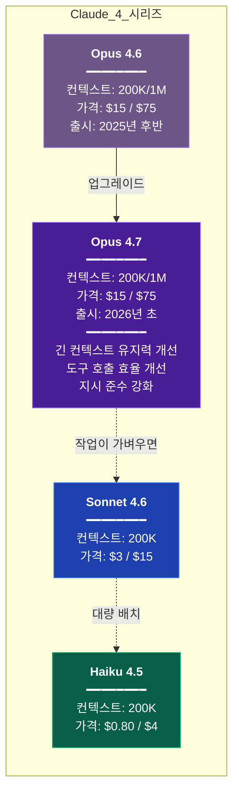
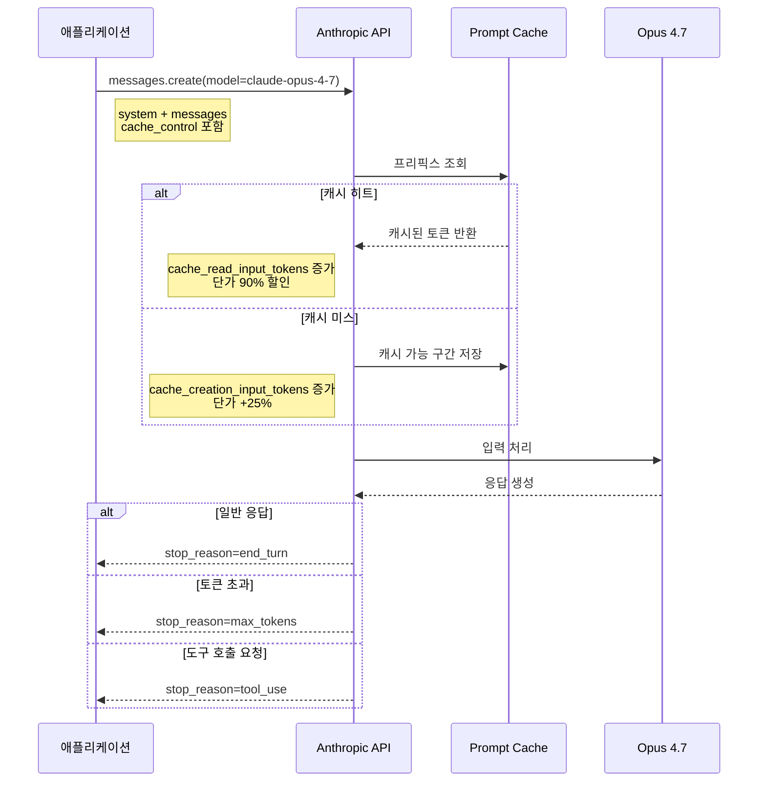

# Claude Opus 4.7

Claude 4 시리즈의 최상위 모델이다. 2026년 초 Opus 4.6의 후속으로 나왔고, 긴 컨텍스트에서의 일관성과 도구 호출 품질을 중심으로 업그레이드됐다. 이 문서는 API와 Claude Code 양쪽에서 4.7을 어떻게 쓰는지 정리한다. 4.6에서 4.7로 옮길 때 실제로 걸리는 부분과 비용 차이까지 다룬다.

---

## 1. Opus 4.7이 무엇인가

Opus 4.7은 Anthropic이 내놓은 Claude 4 세대의 최상위 모델이다. 포지션 자체는 4.6과 같다. 복잡한 코드 분석, 대규모 리팩토링, 긴 문서 작성처럼 Sonnet으로는 아쉬운 작업을 맡는 고성능 모델이다. 가격대도 그대로 유지됐다.

바뀐 건 내부 동작이다. 같은 프롬프트로 같은 파일을 넘겨도 응답의 결이 다르다. 체감상 변화가 큰 부분은 세 가지다.

1. 100K 넘는 컨텍스트에서 앞부분 맥락을 더 잘 유지한다
2. 도구 호출이 필요할 때 불필요한 탐색을 덜 한다
3. 시스템 프롬프트의 제약을 4.6보다 엄격하게 지킨다

체감 차이가 가장 큰 건 세 번째다. 4.6에서 "마크다운으로 답하지 마"라고 지시해도 간혹 불릿 리스트로 튀어나왔다. 4.7에서는 그런 일이 거의 없다. 반대로 말하면, 4.6에서 암묵적으로 기대했던 "알아서 예쁘게 포맷" 같은 관성이 사라진 것이기도 해서, 프롬프트를 다시 점검해야 하는 경우가 생긴다.

### 4.6과의 포지션 비교



4.6과 가격이 같다. 이건 실무적으로 중요한 포인트다. 모델을 올렸다고 계산 로직을 건드릴 필요가 없다. 다만 뒤에서 설명할 몇 가지 동작 변화 때문에 평균 출력 토큰 수가 달라질 수 있고, 그게 결국 비용으로 이어지는 경우는 있다.

---

## 2. 모델 ID와 1M 컨텍스트 variant

### 2.1 기본 모델 ID

```python
model = "claude-opus-4-7"
```

API 요청의 `model` 파라미터에 이 문자열을 넣는다. 날짜 스냅샷 ID(`claude-opus-4-7-20260115` 형식)도 함께 제공되지만, 일반적으로는 에일리어스 `claude-opus-4-7`을 쓰는 게 편하다. Anthropic이 마이너 업데이트를 롤아웃할 때 에일리어스 쪽이 자동으로 최신을 가리키게 된다.

스냅샷 ID를 쓰는 건 재현성이 중요한 경우다. 벤치마크 스크립트나 평가 파이프라인에서 모델 업데이트 때문에 결과가 바뀌면 곤란하다. 그럴 땐 스냅샷을 고정해야 한다.

### 2.2 1M 컨텍스트 variant

Opus 4.7도 1M 컨텍스트 variant를 제공한다. 모델 ID가 다르다.

```python
# 기본 200K
model = "claude-opus-4-7"

# 1M 확장
model = "claude-opus-4-7[1m]"
```

1M variant는 별도 모델처럼 취급된다. 입력 토큰이 200K를 넘는 순간부터 **장기 컨텍스트 과금**이 적용되고, 단가가 뛴다. 대략 200K 초과분에 대해 입력은 $30/1M, 출력은 $112.5/1M 선으로 오른다. 정확한 수치는 공식 가격 페이지를 확인해야 하지만, "1M variant를 쓰기 시작하면 200K 안에서 끝낼 때보다 요청당 비용이 2~3배로 뛴다"는 감각은 맞다.

실수하기 쉬운 부분이 있다. 1M variant를 지정해도 실제 입력이 200K 이하면 표준 가격으로 과금된다. 즉 "혹시 모르니 1M으로 두자"가 비용 측면에서 큰 손해는 아니다. 다만 rate limit이 variant마다 따로 관리되기 때문에, 팀 전체가 1M variant로 몰리면 200K 쪽 여유는 남는데 1M 쪽만 419가 나는 상황이 생긴다.

---

## 3. 스펙 요약

### 3.1 가격과 한도

| 항목 | Opus 4.7 (200K) | Opus 4.7[1m] (200K 초과분) |
|------|-----------------|---------------------------|
| 입력 토큰 | $15 / 1M | $30 / 1M |
| 출력 토큰 | $75 / 1M | $112.5 / 1M |
| 컨텍스트 윈도우 | 200K | 1M |
| Extended Thinking 기본 예산 | 없음 (직접 지정) | 없음 (직접 지정) |
| Prompt Cache 할인 | 읽기 90%, 쓰기 +25% | 동일 |

출력 토큰 단가가 입력의 5배라는 구조는 4.6과 같다. 코드 생성처럼 출력이 긴 작업에서는 모델 교체만으로는 비용 변화가 없고, 뒤에서 다룰 "4.7이 평균적으로 출력을 길게 내는 경향" 쪽이 실제 비용에 더 영향을 준다.

### 3.2 속도

체감 속도는 4.6과 비슷하다. 첫 토큰까지 1초 내외, 초당 출력 토큰은 Sonnet보다 30~40% 느리다. 4.7에서 내부적으로 더 긴 추론을 수행하는 경향이 있어서 특정 작업에서는 4.6보다 약간 더 느리게 느껴질 수 있다. 평균적인 차이는 5% 이내라 체감하기는 어렵다.

### 3.3 Extended Thinking 예산

Opus 4.7에서 Extended Thinking을 켤 때 `budget_tokens`의 의미는 동일하다. 다만 4.7은 같은 예산 안에서 4.6보다 추론을 더 효율적으로 압축해서 쓴다. 4.6에서 `budget_tokens=20000`으로 돌리던 작업을 4.7에서는 `budget_tokens=12000` 정도로 줄여도 비슷한 품질이 나오는 경우가 있다. 이 부분은 작업마다 편차가 커서 실제로 측정해보고 조정해야 한다.

---

## 4. 4.6에서 4.7로 올렸을 때 실제 체감 차이

API 문서의 릴리즈 노트는 추상적이라 크게 와닿지 않는다. 실무에서 가장 체감되는 변화를 구체적으로 정리한다.

### 4.1 코드 이해 깊이

파일 여러 개를 넘겨서 "이 구조가 왜 이렇게 됐는지 분석해줘"라고 시키면 차이가 확연하다. 4.6은 파일 각각을 잘 요약하지만, 파일 간 의존 관계나 "이 리팩토링이 왜 이 시점에 이런 형태로 들어갔는지" 같은 맥락은 놓치는 경우가 있었다. 4.7은 여러 파일 사이의 일관된 패턴을 먼저 파악한 뒤에 이탈 지점을 짚어내는 식으로 분석한다.

다만 이 변화가 항상 좋은 방향은 아니다. 4.7은 "패턴에서 벗어난 코드"를 더 적극적으로 지적한다. 의도적으로 예외 처리된 코드도 "여기만 다르네요, 통일하시겠어요?" 식으로 되묻는 일이 잦아졌다. 이 부분은 시스템 프롬프트에 "이미 의도된 예외는 지적하지 말고 이유를 설명할 때만 언급해라" 같은 제약을 넣어서 조절해야 한다.

### 4.2 도구 호출 패턴

에이전트 환경에서 4.7은 탐색 단계를 줄이고 실행으로 빨리 넘어간다. 예를 들어 "이 함수의 호출부를 찾아서 시그니처를 바꿔줘"라고 하면 4.6은 Grep → Read → Grep → Read 순으로 주변을 훑은 뒤 수정을 시작했다. 4.7은 Grep 한 번으로 호출부를 다 찾고 바로 수정에 들어간다.

이게 비용 절감으로 이어지는 경우가 대부분이지만, 가끔은 탐색이 얕아서 놓치는 케이스를 만든다. 동적으로 함수를 참조하는 코드(리플렉션, 문자열 기반 호출)는 Grep으로 안 잡히는데, 4.7이 거기서 멈추는 경향이 있다. Claude Code에서 쓸 때는 "동적 참조도 고려해달라"고 명시하는 게 좋다.

### 4.3 지시 준수

앞에서도 언급했지만 시스템 프롬프트의 제약을 더 엄격하게 지킨다. 구체적인 예시.

```
system: "응답은 반드시 JSON으로만 해라. 설명이나 코드 블록을 붙이지 마라."
```

4.6은 가끔 앞뒤에 "```json ... ```" 코드 블록을 붙여서 돌려주곤 했다. 호출 측에서 정규식으로 JSON 부분만 뽑는 처리가 사실상 필수였다. 4.7에서는 이게 거의 사라졌다. 대신 앞서 말했듯 "알아서 포맷을 예쁘게" 하던 관성이 줄어서, 사용자에게 직접 보여주는 출력이 드라이하게 느껴지는 경우가 있다.

### 4.4 긴 컨텍스트에서의 정보 유지

lost-in-the-middle 문제가 4.6보다 덜하다. 100K~200K 컨텍스트에서 앞부분에 배치한 지시문을 중간 질문에서 실수로 잊는 일이 줄었다. 다만 완전히 사라진 건 아니다. 정말 중요한 제약은 여전히 system prompt나 마지막 user 메시지에 배치하는 게 안전하다.

---

## 5. API 호출 예제

### 5.1 Python — Messages API 기본

```python
import anthropic

client = anthropic.Anthropic()

response = client.messages.create(
    model="claude-opus-4-7",
    max_tokens=4096,
    system="너는 시니어 백엔드 개발자다. 코드 리뷰를 할 때 보안 이슈를 우선 본다.",
    messages=[
        {"role": "user", "content": "이 코드 리뷰해줘:\n\n" + code}
    ]
)

print(response.content[0].text)
print(f"입력: {response.usage.input_tokens}, 출력: {response.usage.output_tokens}")
```

`max_tokens`는 여전히 필수다. Opus 4.7에서 응답이 길어지는 경향이 있으니, 4.6에서 쓰던 값을 그대로 쓰면 `stop_reason="max_tokens"`로 잘리는 경우가 많아진다. 최초 전환 시에는 약간 여유를 둬서 설정하는 게 안전하다.

### 5.2 Python — Streaming

```python
with client.messages.stream(
    model="claude-opus-4-7",
    max_tokens=8192,
    messages=[
        {"role": "user", "content": "Spring Boot 3 → WebFlux 마이그레이션 전체 흐름을 설명해줘"}
    ]
) as stream:
    for text in stream.text_stream:
        print(text, end="", flush=True)

    final = stream.get_final_message()
    print(f"\n\n총 출력 토큰: {final.usage.output_tokens}")
```

스트리밍 사용법은 4.6과 완전히 동일하다. 바뀐 부분은 없다.

### 5.3 Python — Prompt Caching

4.7에서도 prompt caching은 그대로 동작한다. Opus 가격이 높기 때문에 caching의 체감 효과가 특히 크다.

```python
LONG_DOCS = open("api_reference.md").read()  # 50K 토큰짜리 문서

response = client.messages.create(
    model="claude-opus-4-7",
    max_tokens=2048,
    system=[
        {
            "type": "text",
            "text": "너는 이 API 명세를 참고해서 질문에 답한다."
        },
        {
            "type": "text",
            "text": LONG_DOCS,
            "cache_control": {"type": "ephemeral"}
        }
    ],
    messages=[
        {"role": "user", "content": "인증 엔드포인트의 rate limit이 어떻게 되지?"}
    ]
)

print(f"캐시 읽기: {response.usage.cache_read_input_tokens}")
print(f"캐시 쓰기: {response.usage.cache_creation_input_tokens}")
```

첫 호출에서 `cache_creation_input_tokens`에 50K가 잡히고, 5분 내 동일 프리픽스로 재호출하면 `cache_read_input_tokens`에 50K가 잡힌다. 읽기는 기본 입력 단가의 10%다. Opus 기준 $15/1M이 $1.5/1M로 떨어진다.

### 5.4 Python — Extended Thinking

```python
response = client.messages.create(
    model="claude-opus-4-7",
    max_tokens=16000,
    thinking={
        "type": "enabled",
        "budget_tokens": 8000
    },
    messages=[
        {"role": "user", "content": "이 알고리즘의 시간복잡도와 공간복잡도를 분석해줘:\n\n" + code}
    ]
)

for block in response.content:
    if block.type == "thinking":
        print("=== 추론 과정 ===")
        print(block.thinking[:500])
    elif block.type == "text":
        print("=== 답변 ===")
        print(block.text)
```

thinking 토큰은 출력 토큰으로 과금된다. Opus에서 이건 $75/1M이다. 4.7에서 thinking 효율이 개선됐지만 단가는 그대로라 방심하면 비용이 치솟는다. 단순 질의에는 thinking을 끄고, 복잡한 추론에만 선택적으로 켜야 한다.

### 5.5 TypeScript

```typescript
import Anthropic from "@anthropic-ai/sdk";

const client = new Anthropic();

const response = await client.messages.create({
  model: "claude-opus-4-7",
  max_tokens: 4096,
  system: "너는 Node.js 백엔드 전문가다.",
  messages: [
    { role: "user", content: "Express에서 graceful shutdown 패턴을 구현해줘" }
  ],
});

console.log(response.content[0].type === "text" ? response.content[0].text : "");
```

1M variant 호출 예시도 같은 구조다.

```typescript
const response = await client.messages.create({
  model: "claude-opus-4-7[1m]",
  max_tokens: 8192,
  system: "너는 대규모 모노레포의 아키텍처를 분석한다.",
  messages: [
    {
      role: "user",
      content: [
        { type: "text", text: largeCodebaseText },  // 300K+ 토큰
        { type: "text", text: "이 모노레포의 빌드 의존성 그래프를 설명해줘" }
      ]
    }
  ],
});
```

### 5.6 요청-응답 흐름



---

## 6. Claude Code에서의 Opus 4.7

### 6.1 에이전틱 실행에서의 특성

Claude Code는 모델이 자율적으로 도구를 고르고 실행하는 환경이다. 여기서 4.7은 두 가지가 눈에 띈다.

**탐색 단계가 짧다.** 앞서 말했듯 4.6은 Grep과 Read를 여러 번 반복하며 주변 맥락을 넓게 훑은 뒤 작업을 시작했다. 4.7은 처음 몇 번의 도구 호출로 필요한 정보를 모으고 빠르게 실행으로 넘어간다. 같은 작업에서 도구 호출 횟수가 30~50% 줄어드는 경우가 흔하다.

**도구 호출 실패 시 회복이 빠르다.** 예를 들어 Bash로 실행한 명령이 실패하면, 4.6은 같은 명령을 한두 번 더 시도해보는 경향이 있었다. 4.7은 에러 메시지를 읽고 다른 접근으로 바로 전환한다. `package.json` 스크립트 오타로 `npm run buld`가 실패하면 4.6은 재시도하다가 사용자에게 물어봤지만, 4.7은 `npm run` 목록을 확인하고 `build`를 찾아서 실행한다.

### 6.2 Fast 모드와의 관계

Claude Code의 Fast 모드는 여전히 **Opus 4.6에서만 동작한다.** 4.7은 Fast 모드 지원 모델에 포함되지 않는다. 이는 `/fast`로 토글할 때 혼란스러운 부분이다. 4.7 기본 세션에서 `/fast`를 누르면 모델이 4.6으로 바뀌면서 Fast 모드가 켜진다. 즉 Fast 모드를 쓰려면 4.7을 포기하는 선택이 된다.

이 동작은 Anthropic의 공식 설명에 따르면 "Opus 4.6에 최적화된 Fast 모드를 다른 모델로 확대 적용하기 위한 검증이 진행 중"이라고 되어 있다. 4.7에서 Fast 모드가 필요하면 당분간은 Opus 4.6 + Fast를 쓰든지, Sonnet 4.6으로 내려야 한다.

### 6.3 1M variant 사용 시

Claude Code에서 대규모 코드베이스를 다루다 보면 자동으로 1M variant로 승격되는 경우가 있다. 컨텍스트가 200K를 넘어가는 순간 1M 쪽으로 전환되며, 이때부터 요청당 비용이 갑자기 뛴다.

세션 중에 비용이 예상보다 빠르게 올라간다면 컨텍스트가 200K를 넘겼는지 확인해야 한다. Claude Code의 status line에 컨텍스트 사용량이 표시되는데, 이게 180K를 넘기기 시작하면 다음 질문에서 1M 쪽으로 넘어갈 수 있다. 이 시점에는 `/clear`로 세션을 잘라서 컨텍스트를 리셋하는 게 비용 측면에서 유리하다.

---

## 7. 1M 컨텍스트 variant의 비용 패턴

1M variant는 매력적인 기능이지만, 아무 생각 없이 쓰면 비용이 예상 범위를 크게 벗어난다.

### 7.1 비용 계산 예시

300K 토큰짜리 대규모 레거시 코드베이스를 한 번 분석시키는 경우를 보자.

| 항목 | 표준 Opus 4.7 | Opus 4.7[1m] |
|------|--------------|---------------|
| 입력 200K 이하분 | — (컨텍스트 초과로 거부) | $15 × 0.2 = $3 |
| 입력 200K 초과분 | — | $30 × 0.1 = $3 |
| 입력 합계 | 요청 불가 | $6 |
| 출력 4K | — | $75 × 0.004 = $0.3 |
| **요청 1회 합계** | **불가** | **$6.3** |

이걸 에이전트 루프에서 10번 반복한다면 한 세션에 $63이다. 게다가 대화가 길어지면 이전 결과가 다시 컨텍스트에 누적돼서 매 요청마다 비용이 커진다.

### 7.2 Cache hit rate 관리

1M variant에서 가장 중요한 비용 통제 수단은 prompt caching이다. 300K 토큰의 고정 컨텍스트가 매 요청 반복된다면, 거기에 `cache_control`을 걸어야 한다.

```python
response = client.messages.create(
    model="claude-opus-4-7[1m]",
    max_tokens=4096,
    system=[
        {"type": "text", "text": "당신은 이 코드베이스의 분석가다."},
        {
            "type": "text",
            "text": HUGE_CODEBASE,  # 300K 토큰
            "cache_control": {"type": "ephemeral"}
        }
    ],
    messages=[{"role": "user", "content": question}]
)
```

캐시 히트 시 입력 단가가 90% 할인된다. 1M variant의 200K 초과분 단가 $30/1M이 $3/1M이 된다. 위 예시에서 캐시 히트가 되면 요청당 $6.3이 $1.2 수준으로 떨어진다.

문제는 cache TTL이 5분이라는 점이다. 긴 시간 간격을 두고 같은 컨텍스트에 질문을 던지는 워크플로우에서는 매번 캐시가 만료된다. 캐시를 살리려면 5분마다 한 번씩 warming 요청을 날리거나, 배치 작업을 연속적으로 몰아서 실행해야 한다.

### 7.3 언제 1M이 실제로 필요한가

1M을 써야 하는 작업은 의외로 적다.

- 수백 개 파일의 모노레포 전체를 한 번에 분석해야 할 때
- 긴 PDF 또는 대량 로그를 통째로 넘겨서 이상 패턴을 찾을 때
- 학술 논문 여러 편을 교차 참조하며 비교할 때

이 외의 대부분은 RAG로 관련 부분만 추려서 200K 안에서 처리하는 게 비용·품질 양쪽 모두 낫다. 컨텍스트가 길어질수록 lost-in-the-middle이 발생할 가능성이 커지는 건 4.7에서도 마찬가지다.

---

## 8. 4.6 → 4.7 마이그레이션 주의사항

### 8.1 프롬프트 재조정이 필요한 케이스

모델 ID만 바꿔서 배포하면 대부분 잘 돌아간다. 하지만 다음과 같은 경우는 품질이 오히려 떨어질 수 있다.

**암묵적 포맷팅에 의존한 프롬프트**
"답변을 해라"처럼만 적고 4.6의 자동 마크다운 포맷에 의존하던 프롬프트는 4.7에서 드라이한 평문 응답이 나온다. 마크다운이 필요하면 "마크다운으로 답해라"를 명시해야 한다.

**암시적 코드 블록을 제거하라는 지시**
"```python 없이 코드만 써라"처럼 4.6의 과도한 포맷팅을 억제하던 프롬프트는 4.7에서 오히려 역효과다. 4.7은 이미 그런 포맷을 덜 붙이기 때문에, 이 지시가 있으면 필요한 코드 블록까지 빼버리는 경우가 생긴다.

**"추측하지 말고 물어봐"식 지시**
4.6은 불확실하면 질문으로 되돌리는 경향이 상대적으로 강했다. 4.7은 확신을 가지고 답변을 내는 쪽으로 이동했다. 과거 "추측하지 말고 질문해라" 프롬프트로 조절하던 워크플로우는 4.7에서 의도대로 동작하지 않을 수 있다. "불확실한 부분은 어떤 가정을 했는지 명시해라"로 다시 쓰는 게 낫다.

### 8.2 Thinking budget 조정

4.6에서 설정한 `budget_tokens`를 그대로 쓰면 4.7에서는 과할 수 있다. 4.7은 더 짧은 추론으로 같은 품질을 내기 때문이다.

처음에는 4.6의 50~70% 수준으로 줄여서 테스트해보는 게 좋다. 품질이 떨어지면 올리면 된다. thinking 토큰도 출력 단가($75/1M)로 과금되기 때문에, 이 조정만으로 청구서가 눈에 띄게 달라진다.

### 8.3 max_tokens 상향

반대로 `max_tokens`는 올려야 하는 경우가 많다. 4.7이 답변 본문을 4.6보다 길게 쓰는 경향이 있어서 기존 값으로는 `stop_reason="max_tokens"`에 자주 걸린다. 4.6에서 `max_tokens=2048`이었다면 4.7에서는 3000~4000 정도가 안전하다.

### 8.4 회귀 테스트

프로덕션에서 쓰던 프롬프트 세트가 있다면 4.7로 배포하기 전에 A/B로 돌려봐야 한다. 벤치마크 점수가 올랐다고 해도, 특정 도메인 프롬프트에서는 국지적으로 퇴행이 있을 수 있다. 정확도가 중요한 워크로드(분류, 추출 등)는 모델 교체 후 최소 며칠간 샘플링 평가를 지속하는 게 안전하다.

---

## 9. 언제 Opus 4.7을 쓰고 언제 Sonnet 4.6으로 충분한가

실무에서 가장 자주 받는 질문이다. 기준을 작업 복잡도, 컨텍스트 길이, 비용 허용치 세 축으로 나눠서 본다.

### 9.1 Opus 4.7을 써야 하는 작업

- 여러 파일에 걸친 구조적 리팩토링 (5개 이상 파일 동시 수정)
- 대규모 코드베이스의 아키텍처 분석
- 보안 이슈 감사, 경계 조건 찾기
- 긴 기술 문서 작성 (3,000자 이상)
- 복잡한 다단계 추론 (알고리즘 분석, 복잡도 증명)
- 비즈니스 로직이 얽힌 버그 원인 추적

이런 작업은 Sonnet으로 내리면 실수가 확 늘어난다. 비용은 5배 비싸지만, 사람이 수정하는 시간이 1/3로 줄어든다면 Opus가 싸다.

### 9.2 Sonnet 4.6으로 충분한 작업

- 단일 파일 수정, 단일 함수 구현
- 기존 패턴을 따라하는 CRUD 코드 생성
- 코드 리뷰 중 일반적인 지적
- 문서 번역, 요약
- 테스트 코드 추가 (패턴이 명확할 때)
- 대화형 질의응답

체감상 Sonnet으로 처리했을 때 품질이 "충분히 괜찮다"면 Opus로 올릴 이유가 없다. 5배 비싸기만 하다.

### 9.3 Haiku 4.5로 내려도 되는 작업

- 로그 파싱, 텍스트 추출
- 분류 작업 (스팸/정상, 카테고리 라벨링 등)
- 단순 포맷 변환 (JSON → CSV, 마크다운 → HTML)
- 대량 배치 처리

Opus 출력 단가의 약 1/19 수준이다. 대량 파이프라인에서는 모델을 내리는 것만으로 비용이 두 자릿수 줄어든다.

---

## 10. 자주 겪는 문제

### 10.1 Rate Limit

Opus 4.7은 수요가 높아서 tier 1~2에서는 rate limit에 자주 걸린다. 특히 1M variant는 별도 한도라 더 빡빡하다.

```python
import time
from anthropic import RateLimitError

def call_with_backoff(client, **kwargs):
    for attempt in range(6):
        try:
            return client.messages.create(**kwargs)
        except RateLimitError as e:
            wait = min(2 ** attempt, 60)
            print(f"rate limited, {wait}s 후 재시도")
            time.sleep(wait)
    raise RuntimeError("최대 재시도 초과")
```

재시도는 지수 백오프가 기본이다. Anthropic 응답 헤더에 `retry-after`가 있으면 그걸 우선해야 한다.

tier 업그레이드가 필요한 규모가 되면 Anthropic 콘솔에서 신청해야 한다. 누적 결제액 기준으로 자동 승급되는 부분도 있고, 수동 요청이 필요한 경우도 있다.

### 10.2 비용 증가 패턴

4.6 → 4.7 전환 후 월 청구서가 10~20% 늘었다는 피드백이 잦다. 모델 단가는 같은데 왜 오를까. 원인은 보통 세 가지다.

1. **출력 토큰이 길어졌다.** 4.7이 답변을 더 꼼꼼하게 쓰는 경향 때문이다.
2. **thinking 토큰을 줄이지 않았다.** 4.6 설정을 그대로 쓰면 4.7에서는 과투자다.
3. **컨텍스트가 1M variant로 넘어갔다.** 작업 규모를 늘리기 시작하면서 모르고 1M 영역에 진입하는 경우.

대응은 간단하다. 월초에 사용량 대시보드를 보고 이상 항목을 확인한다. `cache_read_input_tokens`와 `cache_creation_input_tokens` 비율이 역전돼 있으면(쓰기가 읽기보다 크면) caching이 제대로 안 먹고 있다는 뜻이다. 캐시 키가 매번 바뀌는 원인을 찾아야 한다. 시스템 프롬프트에 현재 시각이나 랜덤 ID가 들어가면 캐시가 매번 깨진다.

### 10.3 응답 품질이 떨어졌다는 느낌

드물지만 "4.6보다 4.7 답변이 이상하다"는 경우가 있다. 보통 원인은 두 가지다.

- 기존 프롬프트가 4.6의 특정 동작(마크다운 자동 적용, 추측 질문으로 되묻기 등)에 의존했다
- thinking을 끄고 쓰던 워크로드인데, 4.6에서는 괜찮았지만 4.7에서는 thinking이 있어야 품질이 나오는 케이스

전자는 프롬프트를 재조정하면 해결된다. 후자는 `thinking`을 켜서 비교해봐야 한다. 품질 차이가 있다면 그 워크로드는 thinking 비용을 받아들이거나 4.6을 고정해서 쓰는 게 낫다.

### 10.4 1M variant에서 타임아웃

1M variant 요청은 입력 처리 시간이 길다. 300K 이상 입력을 보내면 first token까지 10초 이상 걸리는 경우가 있다. HTTP 클라이언트 타임아웃을 기본값(30초)으로 두면 첫 응답 전에 끊어진다.

```python
client = anthropic.Anthropic(
    timeout=120.0  # 1M variant 대비 여유 있게
)
```

streaming을 쓰면 네트워크 레벨에서는 keep-alive가 유지되지만, 애플리케이션 타임아웃이 짧으면 여전히 끊어진다. 긴 컨텍스트 작업을 할 때는 반드시 타임아웃을 늘려야 한다.

---

## 11. 참고

- [Claude API 기본](./Claude.md) — Messages API, 토큰 과금, 컨텍스트 구조 일반론
- [Claude API 고급 기능](./Claude_API_Advanced.md) — Batch, Files, Citations 등
- [Claude Code 모델별 차이](../Claude_Code/Claude_Code_Model.md) — 에이전틱 환경에서 모델별 동작 차이
- [Claude Code 팁](../Claude_Code/Claude_Code_Tips.md) — 실전 운영 노하우

Opus 4.7은 4.6의 연장선이지만 프롬프트 동작이 미묘하게 달라졌다. 모델 ID만 바꾼 채로 방치하지 말고, 주요 워크플로우에서 한 번은 출력을 눈으로 비교해보는 게 좋다. 몇 시간 투자해서 프롬프트를 재조정하면 이후 몇 달간의 품질과 비용 모두 개선된다.
