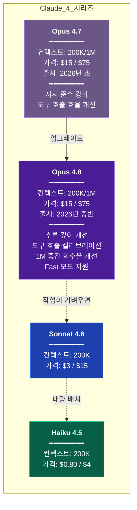
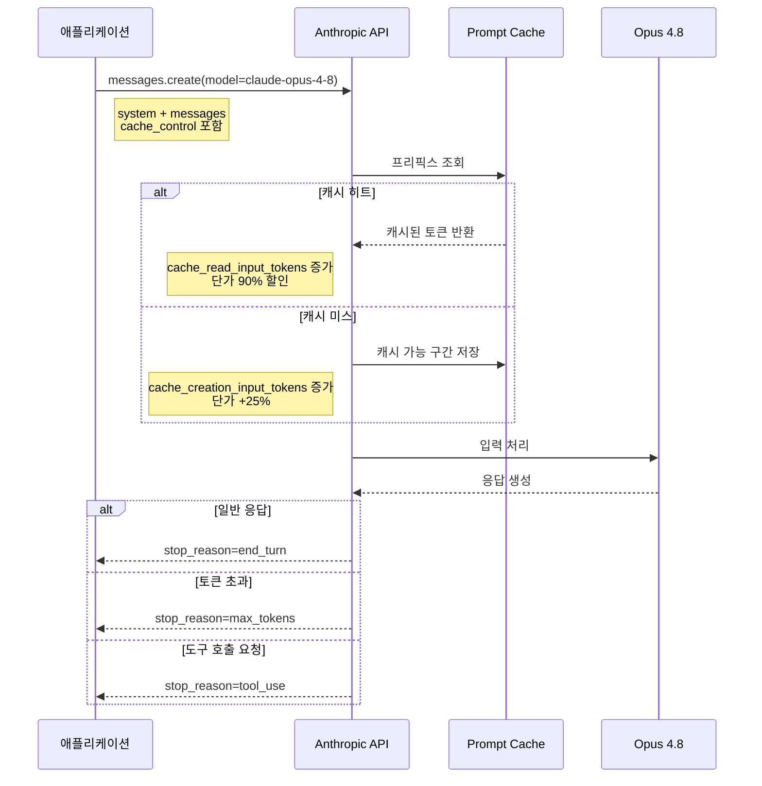

# Claude Opus 4.8

Claude 4 시리즈의 최상위 모델이다. Opus 4.7의 후속으로 나왔고, 추론 깊이와 도구 호출 캘리브레이션을 중심으로 손봤다. 이 문서는 API와 Claude Code 양쪽에서 4.8을 어떻게 쓰는지 정리한다. 4.7에서 4.8로 옮길 때 실제로 걸리는 부분과 비용 차이까지 다룬다. 4.7 문서([Claude Opus 4.7](./Claude_Opus_4_7.md))를 먼저 읽었다는 전제로 차이 위주로 쓴다.

---

## 1. Opus 4.8이 무엇인가

Opus 4.8은 4.7과 같은 자리에 있는 모델이다. 복잡한 코드 분석, 대규모 리팩토링, 긴 문서 작성처럼 Sonnet으로는 아쉬운 작업을 맡는다. 가격대도 같다.

바뀐 건 4.7 때와 마찬가지로 내부 동작이다. 같은 프롬프트로 같은 파일을 넘겨도 응답의 결이 다르다. 4.7→4.8에서 체감되는 변화는 네 가지로 정리된다.

1. 멀티스텝 추론에서 중간 단계를 덜 빠뜨린다. Extended Thinking을 안 켜도 4.7에서 thinking이 있어야 나오던 품질이 일부 작업에서 나온다
2. 도구 호출이 4.7보다 덜 성급하다. 4.7이 탐색을 줄이다가 동적 참조를 놓치던 케이스가 줄었다
3. 상충하는 지시를 만났을 때 우선순위를 더 잘 잡는다
4. 1M 컨텍스트의 중간 영역 회수율이 올랐다

4.7에서 가장 컸던 체감 변화가 "지시 준수가 엄격해졌다"였다면, 4.8은 "추론이 한 단계 깊어졌다"가 가장 크다. 4.7은 표면적으로 답을 잘 내지만 다단계 의존 관계가 얽힌 문제에서 중간 가정을 슬쩍 건너뛰는 일이 있었다. 4.8은 그 중간 단계를 더 붙잡는다. 대신 그만큼 출력이나 thinking 토큰을 더 쓰는 경향이 있어서, 4.7 설정을 그대로 들고 오면 비용이 미묘하게 오른다.

### 4.7과의 포지션 비교



4.7과 가격이 같다. 모델을 올렸다고 과금 계산 로직을 건드릴 일은 없다. 다만 평균 출력·thinking 토큰 수가 달라져서 청구서가 움직이는 경우는 있다. 이건 뒤에서 따로 다룬다.

---

## 2. 모델 ID와 1M 컨텍스트 variant

### 2.1 기본 모델 ID

```python
model = "claude-opus-4-8"
```

API 요청의 `model` 파라미터에 이 문자열을 넣는다. 날짜 스냅샷 ID(`claude-opus-4-8-20260515` 형식)도 제공되지만, 일반적으로는 에일리어스 `claude-opus-4-8`을 쓰는 게 편하다. 마이너 업데이트가 롤아웃되면 에일리어스 쪽이 자동으로 최신을 가리킨다.

스냅샷 ID는 재현성이 중요한 경우에 쓴다. 벤치마크 스크립트나 평가 파이프라인에서 모델 업데이트 때문에 결과가 바뀌면 곤란하니, 그럴 땐 스냅샷을 고정한다. 4.7에서 스냅샷을 고정해 쓰던 평가 파이프라인은 4.8로 올릴 때 스냅샷 문자열도 같이 바꿔야 한다. 에일리어스가 아니라 스냅샷을 박아뒀다면 자동으로 안 넘어간다.

### 2.2 1M 컨텍스트 variant

Opus 4.8도 1M 컨텍스트 variant를 제공한다. 모델 ID가 다르다.

```python
# 기본 200K
model = "claude-opus-4-8"

# 1M 확장
model = "claude-opus-4-8[1m]"
```

1M variant는 별도 모델처럼 취급된다. 입력 토큰이 200K를 넘는 순간부터 장기 컨텍스트 과금이 적용되고 단가가 뛴다. 대략 200K 초과분에 대해 입력 $30/1M, 출력 $112.5/1M 선이다. 정확한 수치는 공식 가격 페이지를 확인해야 하지만, "1M variant를 쓰기 시작하면 200K 안에서 끝낼 때보다 요청당 비용이 2~3배로 뛴다"는 감각은 4.7과 동일하다.

실수하기 쉬운 부분도 그대로다. 1M variant를 지정해도 실제 입력이 200K 이하면 표준 가격으로 과금된다. rate limit은 variant마다 따로 관리되므로, 팀 전체가 1M variant로 몰리면 200K 쪽 여유는 남는데 1M 쪽만 429가 나는 상황이 생긴다.

4.8에서 한 가지 달라진 점은 1M 영역의 중간 회수율이다. 4.7은 1M variant에서 300K 넘는 입력의 중간 부분을 종종 흘렸는데, 4.8은 이 구간을 더 잘 붙잡는다. RAG 없이 통째로 넘기는 워크플로우라면 4.8 쪽이 답이 안정적이다.

---

## 3. 스펙 요약

### 3.1 가격과 한도

| 항목 | Opus 4.8 (200K) | Opus 4.8[1m] (200K 초과분) |
|------|-----------------|---------------------------|
| 입력 토큰 | $15 / 1M | $30 / 1M |
| 출력 토큰 | $75 / 1M | $112.5 / 1M |
| 컨텍스트 윈도우 | 200K | 1M |
| Extended Thinking 기본 예산 | 없음 (직접 지정) | 없음 (직접 지정) |
| Prompt Cache 할인 | 읽기 90%, 쓰기 +25% | 동일 |

출력 토큰 단가가 입력의 5배라는 구조는 4.7과 같다. 모델 교체만으로는 단가 변화가 없고, 뒤에서 다룰 "4.8이 어려운 문제에서 추론·출력을 더 쓰는 경향"이 실제 비용에 더 영향을 준다.

### 3.2 속도

체감 속도는 4.7과 비슷하다. 첫 토큰까지 1초 내외, 초당 출력 토큰은 Sonnet보다 30~40% 느리다. 4.8은 복잡한 문제에서 내부 추론을 더 길게 도는 경향이 있어서 그런 작업에서는 4.7보다 약간 더 느리게 느껴질 수 있다. 단순 질의에서는 차이가 거의 없다.

### 3.3 Extended Thinking 예산

`budget_tokens`의 의미는 4.7과 동일하다. 달라진 건 두 가지다.

첫째, 4.8은 같은 예산 안에서 추론을 더 압축해서 쓴다. 4.7에서 `budget_tokens=8000`으로 돌리던 작업을 4.8에서 5000~6000으로 줄여도 비슷한 품질이 나오는 경우가 있다.

둘째, thinking을 아예 안 켜도 되는 작업이 늘었다. 4.7에서 thinking을 켜야 정답이 나오던 중간 난도 추론이 4.8에서는 thinking 없이도 처리된다. 이건 비용 측면에서 크다. thinking 토큰은 출력 단가($75/1M)로 과금되기 때문에, thinking을 끌 수 있는 워크로드를 찾아내면 청구서가 눈에 띄게 줄어든다. 단, 작업마다 편차가 커서 실제로 두 설정을 비교 측정해보고 결정해야 한다.

---

## 4. 4.7에서 4.8로 올렸을 때 실제 체감 차이

릴리즈 노트는 추상적이라 와닿지 않는다. 실무에서 가장 체감되는 변화를 구체적으로 정리한다.

### 4.1 추론 깊이

다단계 의존 관계가 얽힌 문제에서 차이가 확연하다. 예를 들어 "이 함수를 바꾸면 어디가 깨지는지 추적해줘"처럼 변경의 파급을 따라가야 하는 작업이다. 4.7은 직접 호출부는 잘 찾지만, 그 호출부가 다시 어디에 영향을 주는지 2~3단계 너머는 가정을 슬쩍 건너뛰는 일이 있었다. 4.8은 중간 단계를 더 붙잡고, 가정을 세웠으면 그 가정을 명시한다.

알고리즘 분석이나 복잡도 증명 같은 작업에서도 4.7에서 thinking을 켜야 나오던 수준이 4.8에서는 thinking 없이 나오는 경우가 있다. 다만 정말 어려운 문제는 4.8에서도 thinking이 있어야 하고, thinking을 켜면 4.7보다 더 깊게 파고드는 만큼 토큰을 더 쓴다.

### 4.2 도구 호출 캘리브레이션

4.7은 탐색 단계를 줄이고 실행으로 빨리 넘어가는 게 장점이자 약점이었다. 탐색이 얕아서 동적 참조(리플렉션, 문자열 기반 호출)를 놓치는 케이스가 있었다. 4.8은 "이 정도 탐색으로 충분한가"를 더 잘 판단한다. 단순한 작업은 4.7만큼 빠르게 넘어가지만, 확신이 안 서면 한 번 더 확인하고 넘어간다.

결과적으로 4.7에서 "동적 참조도 고려해달라"고 시스템 프롬프트에 박아두던 보완 지시가 4.8에서는 대체로 불필요하다. 오히려 이 지시가 남아 있으면 4.8이 과하게 탐색하는 역효과가 나기도 한다. 마이그레이션 때 점검해야 할 부분이다.

### 4.3 지시 준수와 충돌 처리

4.7이 시스템 프롬프트 제약을 엄격하게 지키는 쪽으로 옮겼다면, 4.8은 그 위에서 "지시끼리 충돌할 때"를 더 잘 다룬다. 4.7은 상충하는 지시가 있으면 보통 뒤에 나온 것을 따랐다. 시스템 프롬프트에 "간결하게 답해라"가 있고 유저 메시지에 "최대한 자세히 설명해줘"가 있으면 4.7은 둘 중 하나로 쏠렸다. 4.8은 우선순위를 잡거나, 정말 모호하면 어느 쪽을 따랐는지 짧게 밝히고 답한다.

이건 프롬프트 설계가 느슨한 팀에 유리한 변화다. 동시에, 4.7에서 "뒤에 나온 지시가 이긴다"는 동작에 의존해 프롬프트를 짜뒀다면 4.8에서 결과가 달라질 수 있다.

### 4.4 긴 컨텍스트에서의 정보 유지

lost-in-the-middle이 4.7보다 더 줄었다. 특히 200K를 넘는 1M variant 구간에서 개선이 크다. 4.7은 1M 입력의 정중앙에 둔 지시를 후속 질문에서 흘리는 일이 있었는데, 4.8은 이 구간 회수율이 올랐다. 그래도 완전히 사라진 건 아니다. 정말 중요한 제약은 여전히 system prompt나 마지막 user 메시지에 배치하는 게 안전하다.

---

## 5. API 호출 예제

### 5.1 Python — Messages API 기본

```python
import anthropic

client = anthropic.Anthropic()

response = client.messages.create(
    model="claude-opus-4-8",
    max_tokens=4096,
    system="너는 시니어 백엔드 개발자다. 코드 리뷰를 할 때 보안 이슈를 우선 본다.",
    messages=[
        {"role": "user", "content": "이 코드 리뷰해줘:\n\n" + code}
    ]
)

print(response.content[0].text)
print(f"입력: {response.usage.input_tokens}, 출력: {response.usage.output_tokens}")
```

`max_tokens`는 필수다. 4.8은 단순 답변에서는 4.7보다 덜 장황한 편이지만, 복잡한 추론 작업에서는 중간 단계를 더 풀어내서 출력이 길어진다. 작업 성격에 따라 4.7에서 쓰던 값이 부족할 수도, 과할 수도 있다. 전환 직후에는 `stop_reason`을 찍어보면서 조정하는 게 안전하다.

### 5.2 Python — Streaming

```python
with client.messages.stream(
    model="claude-opus-4-8",
    max_tokens=8192,
    messages=[
        {"role": "user", "content": "Spring Boot 3 → WebFlux 마이그레이션 전체 흐름을 설명해줘"}
    ]
) as stream:
    for text in stream.text_stream:
        print(text, end="", flush=True)

    final = stream.get_final_message()
    print(f"\n\n총 출력 토큰: {final.usage.output_tokens}")
```

스트리밍 사용법은 4.7과 동일하다. SDK 인터페이스는 바뀌지 않았다.

### 5.3 Python — Prompt Caching

Opus 가격이 높아서 caching의 체감 효과가 특히 크다. 4.8에서도 동작은 그대로다.

```python
LONG_DOCS = open("api_reference.md").read()  # 50K 토큰짜리 문서

response = client.messages.create(
    model="claude-opus-4-8",
    max_tokens=2048,
    system=[
        {
            "type": "text",
            "text": "너는 이 API 명세를 참고해서 질문에 답한다."
        },
        {
            "type": "text",
            "text": LONG_DOCS,
            "cache_control": {"type": "ephemeral"}
        }
    ],
    messages=[
        {"role": "user", "content": "인증 엔드포인트의 rate limit이 어떻게 되지?"}
    ]
)

print(f"캐시 읽기: {response.usage.cache_read_input_tokens}")
print(f"캐시 쓰기: {response.usage.cache_creation_input_tokens}")
```

첫 호출에서 `cache_creation_input_tokens`에 50K가 잡히고, 5분 내 동일 프리픽스로 재호출하면 `cache_read_input_tokens`에 50K가 잡힌다. 읽기는 기본 입력 단가의 10%다. Opus 기준 $15/1M이 $1.5/1M로 떨어진다.

### 5.4 Python — Extended Thinking

```python
response = client.messages.create(
    model="claude-opus-4-8",
    max_tokens=16000,
    thinking={
        "type": "enabled",
        "budget_tokens": 6000
    },
    messages=[
        {"role": "user", "content": "이 알고리즘의 시간복잡도와 공간복잡도를 분석해줘:\n\n" + code}
    ]
)

for block in response.content:
    if block.type == "thinking":
        print("=== 추론 과정 ===")
        print(block.thinking[:500])
    elif block.type == "text":
        print("=== 답변 ===")
        print(block.text)
```

`budget_tokens`를 4.7보다 낮게 잡았다. 4.8은 같은 예산을 더 알차게 쓰기 때문에 시작값을 줄여도 된다. thinking 토큰은 출력 토큰으로 과금되고 Opus에서 이건 $75/1M이다. 단순 질의에는 thinking을 끄고, 복잡한 추론에만 선택적으로 켜는 원칙은 4.7과 같다. 4.8에서는 thinking 없이도 처리되는 작업이 늘었으니, 켜기 전에 끄고 한 번 돌려보는 게 비용 측면에서 낫다.

멀티턴이나 도구 호출 루프에서 thinking을 쓸 때는 직전 assistant 응답의 `thinking` 블록을 `signature`까지 통째로 다시 넘겨야 한다. 이 규칙과 모델 버전이 바뀌면 과거 signature가 무효화되는 동작은 [Claude API 기본](./Claude.md)의 Extended Thinking 절에 정리돼 있다. 4.7→4.8로 모델을 올리면 4.7 시절 thinking 블록의 signature는 재전송 시 거부될 수 있으니, 모델 전환 시점에는 진행 중이던 대화의 thinking 블록을 빼거나 대화를 새로 시작하는 게 안전하다.

### 5.5 TypeScript

```typescript
import Anthropic from "@anthropic-ai/sdk";

const client = new Anthropic();

const response = await client.messages.create({
  model: "claude-opus-4-8",
  max_tokens: 4096,
  system: "너는 Node.js 백엔드 전문가다.",
  messages: [
    { role: "user", content: "Express에서 graceful shutdown 패턴을 구현해줘" }
  ],
});

console.log(response.content[0].type === "text" ? response.content[0].text : "");
```

1M variant 호출도 같은 구조다. 모델 ID만 바꾼다.

```typescript
const response = await client.messages.create({
  model: "claude-opus-4-8[1m]",
  max_tokens: 8192,
  system: "너는 대규모 모노레포의 아키텍처를 분석한다.",
  messages: [
    {
      role: "user",
      content: [
        { type: "text", text: largeCodebaseText },  // 300K+ 토큰
        { type: "text", text: "이 모노레포의 빌드 의존성 그래프를 설명해줘" }
      ]
    }
  ],
});
```

Extended Thinking을 TypeScript에서 쓸 때도 파라미터 구조는 Python과 같다.

```typescript
const response = await client.messages.create({
  model: "claude-opus-4-8",
  max_tokens: 16000,
  thinking: { type: "enabled", budget_tokens: 6000 },
  messages: [
    { role: "user", content: "이 분산 락 구현의 경쟁 조건을 분석해줘:\n\n" + code }
  ],
});

for (const block of response.content) {
  if (block.type === "thinking") console.log("추론:", block.thinking);
  if (block.type === "text") console.log("답변:", block.text);
}
```

### 5.6 요청-응답 흐름



---

## 6. Claude Code에서의 Opus 4.8

### 6.1 에이전틱 실행에서의 특성

Claude Code는 모델이 자율적으로 도구를 고르고 실행하는 환경이다. 여기서 4.8은 두 가지가 눈에 띈다.

탐색 깊이가 작업에 맞춰진다. 4.7은 거의 항상 탐색을 짧게 끊고 실행으로 넘어갔다. 빠르지만 동적 참조가 얽힌 코드에서 놓치는 게 있었다. 4.8은 단순한 수정은 4.7처럼 빠르게 처리하고, 파급이 큰 변경은 호출부를 한 번 더 확인하고 들어간다. 같은 작업에서 도구 호출 횟수가 4.7과 비슷하거나 약간 많아질 수 있는데, 대신 빠뜨리는 케이스가 준다.

도구 호출 실패 시 회복은 4.7과 비슷하게 빠르다. 에러 메시지를 읽고 다른 접근으로 바로 전환한다. 4.8은 여기에 더해, 같은 에러가 반복되면 "같은 방법으로 또 시도하지 않고" 접근 자체를 바꾸는 판단이 좀 더 빨라졌다.

### 6.2 Fast 모드 지원

4.7 시절에는 Claude Code의 Fast 모드가 Opus 4.6에서만 동작했다. 4.8에서는 이게 해소됐다. Fast 모드가 Opus 4.8을 지원한다. `/fast`로 토글하면 모델이 다른 등급으로 내려가지 않고, Opus 4.8 그대로 출력 속도만 빨라진다.

이건 4.7에서 겪던 혼란을 없앤다. 4.7 세션에서 `/fast`를 누르면 모델이 4.6으로 바뀌면서 Fast가 켜지는 식이라, Fast를 쓰려면 최신 Opus를 포기해야 했다. 4.8에서는 그 트레이드오프가 사라졌다. 최신 모델 품질과 빠른 출력을 동시에 가져갈 수 있다.

Fast 모드는 출력 속도를 올릴 뿐 모델 자체를 바꾸지 않으므로, 품질 특성은 일반 4.8과 같다. 긴 추론이 필요한 작업에서 응답을 더 빨리 받고 싶을 때 켜면 된다.

### 6.3 1M variant 사용 시

Claude Code에서 대규모 코드베이스를 다루다 보면 컨텍스트가 200K를 넘는 순간 1M variant로 승격되고, 이때부터 요청당 비용이 갑자기 뛴다. 4.8도 동일하다.

세션 중 비용이 예상보다 빠르게 올라간다면 컨텍스트가 200K를 넘겼는지 확인한다. status line의 컨텍스트 사용량이 180K를 넘기기 시작하면 다음 질문에서 1M 쪽으로 넘어갈 수 있다. 이 시점에는 `/clear`로 세션을 잘라 컨텍스트를 리셋하는 게 비용 측면에서 유리하다.

4.8은 1M 영역 회수율이 올라서, 같은 대규모 입력이라도 결과 품질이 4.7보다 안정적이다. 비용은 그대로 비싸니 1M 진입 자체는 여전히 의식하고 써야 한다.

---

## 7. 1M 컨텍스트 variant의 비용 패턴

1M variant는 회수율이 개선됐지만, 아무 생각 없이 쓰면 비용이 예상 범위를 크게 벗어나는 건 4.7과 같다.

### 7.1 비용 계산 예시

300K 토큰짜리 대규모 레거시 코드베이스를 한 번 분석시키는 경우를 보자.

| 항목 | 표준 Opus 4.8 | Opus 4.8[1m] |
|------|--------------|---------------|
| 입력 200K 이하분 | — (컨텍스트 초과로 거부) | $15 × 0.2 = $3 |
| 입력 200K 초과분 | — | $30 × 0.1 = $3 |
| 입력 합계 | 요청 불가 | $6 |
| 출력 4K | — | $75 × 0.004 = $0.3 |
| **요청 1회 합계** | **불가** | **$6.3** |

이걸 에이전트 루프에서 10번 반복하면 한 세션에 $63이다. 대화가 길어지면 이전 결과가 다시 컨텍스트에 누적돼서 매 요청 비용이 커진다.

### 7.2 Cache hit rate 관리

1M variant에서 가장 중요한 비용 통제 수단은 prompt caching이다. 300K 토큰의 고정 컨텍스트가 매 요청 반복된다면 거기에 `cache_control`을 건다.

```python
response = client.messages.create(
    model="claude-opus-4-8[1m]",
    max_tokens=4096,
    system=[
        {"type": "text", "text": "당신은 이 코드베이스의 분석가다."},
        {
            "type": "text",
            "text": HUGE_CODEBASE,  # 300K 토큰
            "cache_control": {"type": "ephemeral"}
        }
    ],
    messages=[{"role": "user", "content": question}]
)
```

캐시 히트 시 입력 단가가 90% 할인된다. 1M variant의 200K 초과분 단가 $30/1M이 $3/1M이 된다. 위 예시에서 캐시 히트가 되면 요청당 $6.3이 $1.2 수준으로 떨어진다.

문제는 cache TTL이 5분이라는 점이다. 긴 간격을 두고 같은 컨텍스트에 질문을 던지는 워크플로우에서는 매번 캐시가 만료된다. 캐시를 살리려면 5분마다 warming 요청을 날리거나, 배치를 연속으로 몰아서 실행하거나, 1시간 TTL을 검토한다. 1시간 TTL의 손익 계산은 [Claude API 기본](./Claude.md)의 Prompt Caching 절에 정리돼 있다.

### 7.3 언제 1M이 실제로 필요한가

1M을 써야 하는 작업은 의외로 적다.

- 수백 개 파일의 모노레포 전체를 한 번에 분석해야 할 때
- 긴 PDF나 대량 로그를 통째로 넘겨 이상 패턴을 찾을 때
- 학술 논문 여러 편을 교차 참조하며 비교할 때

4.8에서 1M 중간 회수율이 좋아진 만큼 위 작업에서 RAG 없이 통째로 넘기는 선택지가 4.7보다 현실적이 됐다. 그래도 대부분은 RAG로 관련 부분만 추려 200K 안에서 처리하는 게 비용·품질 양쪽 모두 낫다. 컨텍스트가 길수록 lost-in-the-middle 가능성이 커지는 건 4.8에서도 마찬가지다.

---

## 8. 4.7 → 4.8 마이그레이션 주의사항

### 8.1 프롬프트 재조정이 필요한 케이스

모델 ID만 바꿔서 배포하면 대부분 잘 돌아간다. 다음 경우는 품질이 오히려 떨어지거나 비용이 늘 수 있다.

**4.7 시절의 탐색 보완 지시**
4.7의 얕은 탐색을 보완하려고 "동적 참조도 고려해라", "호출부를 빠짐없이 찾아라" 같은 지시를 박아뒀다면 4.8에서는 대체로 불필요하다. 4.8은 스스로 탐색 깊이를 조절하기 때문에, 이 지시가 남아 있으면 과하게 탐색해서 도구 호출이 늘고 비용이 오른다. 전환할 때 한 번 빼보고 품질이 유지되는지 확인한다.

**"뒤 지시가 이긴다"에 의존한 프롬프트**
4.7은 상충하는 지시 중 뒤에 나온 것을 따르는 경향이 강했다. 이 동작에 기대 프롬프트를 짜뒀다면 4.8에서 결과가 달라질 수 있다. 4.8은 우선순위를 잡거나 모호하면 밝히고 답한다. 충돌하는 지시는 애초에 한쪽으로 정리하는 게 낫다.

**의도된 예외를 지적하지 말라는 제약**
4.7에서 패턴 이탈 코드를 과하게 지적하는 걸 막으려고 넣은 "의도된 예외는 지적하지 마라" 같은 제약은 4.8에서도 그대로 두는 게 좋다. 4.8도 패턴 이탈을 짚는 경향은 유지한다.

### 8.2 Thinking budget 조정

4.7에서 설정한 `budget_tokens`를 그대로 쓰면 4.8에서는 과할 수 있다. 4.8이 같은 예산을 더 알차게 쓰기 때문이다. 처음에는 4.7의 60~80% 수준으로 줄여 테스트하고, 품질이 떨어지면 올린다.

여기에 더해 4.8에서는 thinking 자체를 끌 수 있는 워크로드를 찾는 게 더 중요해졌다. 4.7에서 thinking을 켜야 정답이 나오던 중간 난도 작업이 4.8에서는 thinking 없이 처리되는 경우가 있다. thinking을 끄면 그만큼 출력 단가($75/1M)로 잡히던 토큰이 통째로 사라진다. 워크로드별로 on/off를 비교 측정해서 끌 수 있는 곳을 골라내면 청구서가 눈에 띄게 줄어든다.

### 8.3 max_tokens 재조정

4.7→4.8은 출력 길이 방향이 한쪽으로 정해져 있지 않다. 단순 답변은 4.8이 덜 장황한 편이라 기존 값에 여유가 생기고, 복잡한 추론은 중간 단계를 더 풀어내서 출력이 길어진다. 작업 성격에 따라 4.7 값이 과할 수도 부족할 수도 있다. 전환 직후에는 `stop_reason="max_tokens"` 발생 빈도를 모니터링하면서 워크로드별로 조정한다.

### 8.4 회귀 테스트

프로덕션에서 쓰던 프롬프트 세트가 있다면 4.8 배포 전 A/B로 돌려본다. 벤치마크가 올랐어도 특정 도메인 프롬프트에서는 국지적으로 퇴행이 있을 수 있다. 특히 4.7의 지시 충돌 동작이나 얕은 탐색에 맞춰 튜닝한 프롬프트는 4.8에서 다르게 동작한다. 정확도가 중요한 워크로드(분류, 추출 등)는 모델 교체 후 최소 며칠간 샘플링 평가를 지속한다.

---

## 9. 언제 Opus 4.8을 쓰고 언제 Sonnet/Haiku로 충분한가

실무에서 가장 자주 받는 질문이다. 작업 복잡도, 컨텍스트 길이, 비용 허용치 세 축으로 본다. 기준 자체는 4.7과 같다. 4.8이라고 Sonnet으로 충분하던 작업이 Opus 필수로 바뀌지는 않는다.

### 9.1 Opus 4.8을 써야 하는 작업

- 여러 파일에 걸친 구조적 리팩토링 (5개 이상 파일 동시 수정)
- 대규모 코드베이스의 아키텍처 분석
- 변경의 파급을 여러 단계 추적해야 하는 작업
- 보안 이슈 감사, 경계 조건 찾기
- 긴 기술 문서 작성 (3,000자 이상)
- 복잡한 다단계 추론 (알고리즘 분석, 복잡도 증명)

이런 작업은 Sonnet으로 내리면 실수가 확 는다. 비용은 5배지만, 사람이 수정하는 시간이 1/3로 준다면 Opus가 싸다. 4.8은 다단계 추적에서 4.7보다 중간 단계를 덜 빠뜨리니, 파급 분석 같은 작업에서 Opus를 쓰는 명분이 더 분명해졌다.

### 9.2 Sonnet 4.6으로 충분한 작업

- 단일 파일 수정, 단일 함수 구현
- 기존 패턴을 따라하는 CRUD 코드 생성
- 코드 리뷰 중 일반적인 지적
- 문서 번역, 요약
- 테스트 코드 추가 (패턴이 명확할 때)
- 대화형 질의응답

Sonnet으로 처리했을 때 품질이 충분히 괜찮다면 Opus로 올릴 이유가 없다. 5배 비싸기만 하다.

### 9.3 Haiku 4.5로 내려도 되는 작업

- 로그 파싱, 텍스트 추출
- 분류 작업 (스팸/정상, 카테고리 라벨링 등)
- 단순 포맷 변환 (JSON → CSV, 마크다운 → HTML)
- 대량 배치 처리

Opus 출력 단가의 약 1/19 수준이다. 대량 파이프라인에서는 모델을 내리는 것만으로 비용이 두 자릿수 줄어든다.

---

## 10. 자주 겪는 문제

### 10.1 Rate Limit

Opus 4.8은 출시 직후 수요가 몰려 tier 1~2에서는 rate limit에 자주 걸린다. 1M variant는 별도 한도라 더 빡빡하다.

```python
import time
from anthropic import RateLimitError

def call_with_backoff(client, **kwargs):
    for attempt in range(6):
        try:
            return client.messages.create(**kwargs)
        except RateLimitError as e:
            wait = min(2 ** attempt, 60)
            print(f"rate limited, {wait}s 후 재시도")
            time.sleep(wait)
    raise RuntimeError("최대 재시도 초과")
```

재시도는 지수 백오프가 기본이다. Anthropic 응답 헤더에 `retry-after`가 있으면 그걸 우선한다. tier 업그레이드가 필요한 규모가 되면 Anthropic 콘솔에서 신청한다. 누적 결제액 기준으로 자동 승급되는 부분도 있고, 수동 요청이 필요한 경우도 있다.

### 10.2 비용 증가 패턴

4.7 → 4.8 전환 후 월 청구서가 늘었다는 경우가 있다. 단가는 같은데 왜 오를까. 원인은 보통 세 가지다.

1. **thinking을 줄이거나 끄지 않았다.** 4.8은 같은 예산을 더 알차게 쓰고, thinking 없이도 되는 작업이 늘었다. 4.7 설정을 그대로 두면 과투자다.
2. **복잡한 추론에서 출력이 길어졌다.** 4.8이 중간 단계를 더 풀어내는 경향 때문이다. 이건 품질의 대가라 무작정 줄일 건 아니지만, max_tokens와 함께 의식해야 한다.
3. **컨텍스트가 1M variant로 넘어갔다.** 작업 규모를 늘리다 모르고 1M 영역에 진입하는 경우.

대응은 단순하다. 월초에 사용량 대시보드를 보고 이상 항목을 확인한다. `cache_read_input_tokens`와 `cache_creation_input_tokens` 비율이 역전돼 있으면(쓰기가 읽기보다 크면) caching이 제대로 안 먹고 있다는 뜻이다. 시스템 프롬프트에 현재 시각이나 랜덤 ID가 들어가면 캐시가 매번 깨진다.

### 10.3 응답 품질이 달라졌다는 느낌

드물지만 "4.7보다 4.8 답변이 이상하다"는 경우가 있다. 보통 원인은 두 가지다.

- 기존 프롬프트가 4.7의 특정 동작(뒤 지시 우선, 얕은 탐색 등)에 의존했다
- thinking budget을 줄였는데 그 워크로드는 줄인 예산으로는 부족했다

전자는 프롬프트를 재조정하면 해결된다. 8.1을 참고해 4.7 시절 보완 지시를 점검한다. 후자는 budget을 원래대로 올려 비교한다. 4.8이 효율이 좋다고 모든 작업에서 예산을 줄일 수 있는 건 아니다.

### 10.4 1M variant에서 타임아웃

1M variant 요청은 입력 처리 시간이 길다. 300K 이상 입력을 보내면 first token까지 10초 이상 걸리는 경우가 있다. HTTP 클라이언트 타임아웃을 기본값(30초)으로 두면 첫 응답 전에 끊어진다.

```python
client = anthropic.Anthropic(
    timeout=120.0  # 1M variant 대비 여유 있게
)
```

streaming을 쓰면 네트워크 레벨에서 keep-alive가 유지되지만, 애플리케이션 타임아웃이 짧으면 여전히 끊어진다. 긴 컨텍스트 작업에서는 반드시 타임아웃을 늘린다. 4.8은 복잡한 입력에서 내부 추론을 더 길게 도는 경향이 있어, 4.7에서 아슬아슬하게 통과하던 타임아웃이 4.8에서 터지는 경우가 있다. 마이그레이션 후 타임아웃 관련 에러가 늘면 이 값을 먼저 의심한다.

---

## 11. 참고

- [Claude Opus 4.7](./Claude_Opus_4_7.md) — 직전 세대, 4.7→4.8 차이의 기준점
- [Claude API 기본](./Claude.md) — Messages API, 토큰 과금, Extended Thinking signature, Prompt Caching 일반론
- [Claude API 고급 기능](./Claude_API_Advanced.md) — Batch, Files, Citations 등
- [Claude Code 모델별 차이](../Claude_Code/Claude_Code_Model.md) — 에이전틱 환경에서 모델별 동작 차이
- [Claude Code 팁](../Claude_Code/Claude_Code_Tips.md) — 실전 운영 노하우

4.8은 4.7의 연장선이지만 추론 깊이와 도구 호출 판단이 달라졌다. 모델 ID만 바꾼 채로 방치하지 말고, 주요 워크플로우에서 한 번은 출력을 눈으로 비교하고 thinking 설정을 다시 잡아야 한다. 특히 4.7 시절의 탐색 보완 지시와 thinking budget은 4.8에서 손볼 여지가 크다. 몇 시간 투자해 프롬프트를 재조정하면 이후 몇 달간의 품질과 비용 모두 개선된다.
