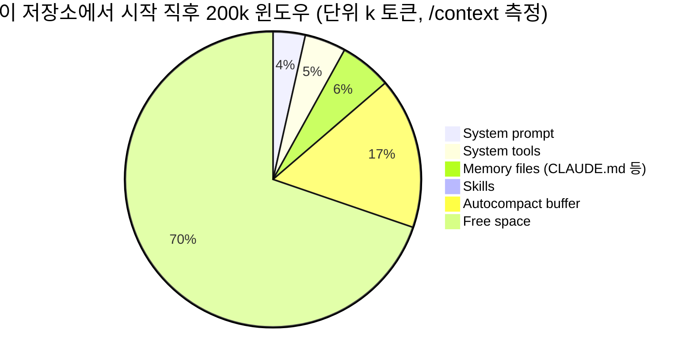
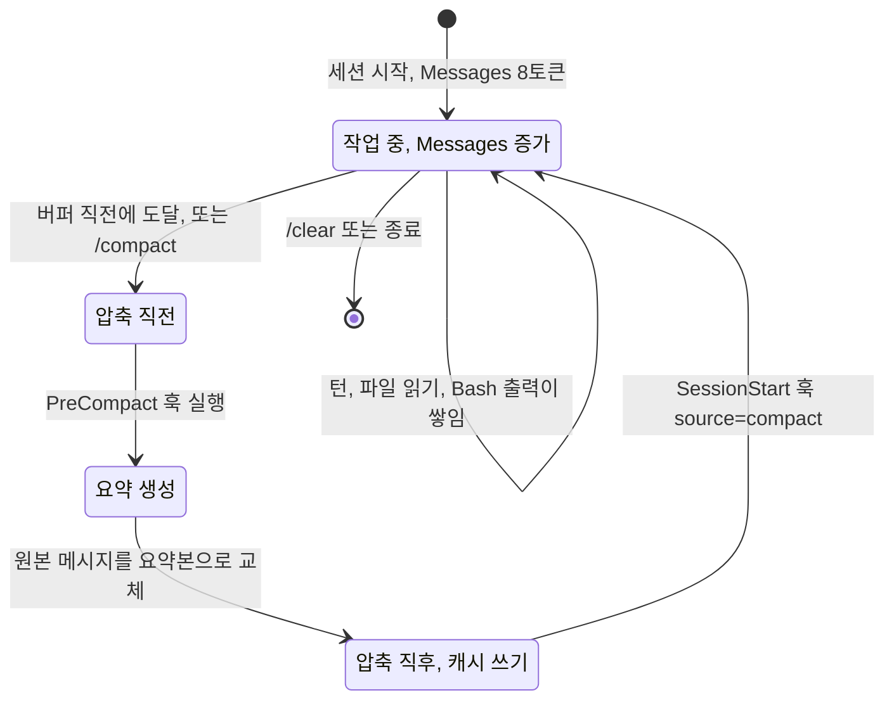
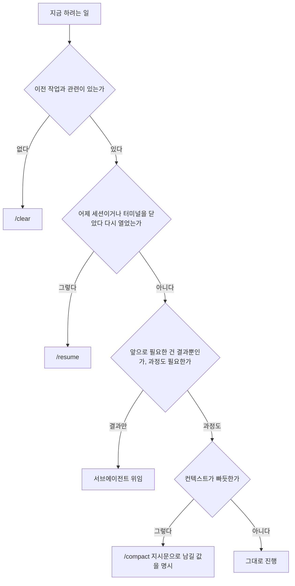
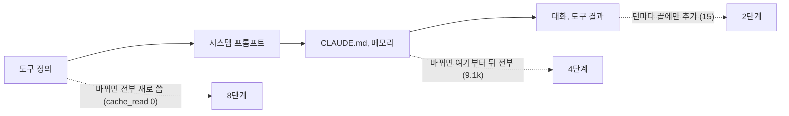

# Claude Code 컨텍스트 관리와 토큰 비용

세션이 길어지면 답이 느려지고 엉뚱해지고 비용이 튄다. 세 증상은 뿌리가 같다. 컨텍스트에 뭐가 얼마나 실려 있는지 모르고 쓰기 때문이다. `/clear`와 `/compact`가 있다는 건 다들 알지만 언제 뭘 칠지는 감으로 정하는 경우가 많다. 이 문서는 그 감을 숫자로 바꾸려고 직접 재 본 값을 모았다.

[개발 루틴](Claude_Code_Routine.md) 6.3절은 `/compact`와 `/clear`를 언제 쓰는지, [트러블슈팅](Claude_Code_Troubleshooting.md)은 압축 뒤에 같은 파일을 다시 읽는 증상을 다룬다. 여기서는 그 아래층인 점유 구조, 압축에서 사라지는 것, 캐시가 깨지는 지점을 본다.

## 측정 환경

| 항목 | 값 |
|---|---|
| Claude Code | 2.1.111 |
| 모델 | claude-sonnet-4-6, 컨텍스트 200k |
| 로그인 | 구독 로그인 (API 키 아님) |
| 방법 | 임시 디렉토리(`/tmp/ctxm`)에서 `claude -p`를 `--continue`로 이어 호출하고 마지막에 `claude -p "/context" --continue`로 점유를 읽음 |
| 비용 값 | `--output-format json`의 `usage`, `modelUsage`, `total_cost_usd` |

`/context`는 `-p` 모드에서도 동작하고 모델 호출 없이 로컬에서 계산한다. 단순한 질문이 한 번 오간 세션의 Messages가 1.0~1.4k였다. 아래 표의 Messages 값에서 이만큼은 대화 기본값으로 본다. 새로 시작한 세션은 8토큰이다.

구독 로그인이라 `/cost`가 요금을 보여주지 않는다. `claude -p "/cost"`는 구독으로 쓰는 중이라는 한 줄만 찍고, `/usage`는 이 환경에서 쓸 수 없다고 나왔다. 그래서 비용 수치는 JSON 출력에서 가져왔고, API 키로 로그인한 환경의 `/cost` 출력은 직접 확인하지 못했다.

## 1. 컨텍스트에 실리는 것

시작하자마자 채워져 있는 것과 대화하면서 쌓이는 것이 따로 있다. `/context`는 둘을 항목별로 갈라 보여준다.

| 환경 | 합계 | System prompt | System tools | Memory files |
|---|---|---|---|---|
| 빈 디렉토리 | 15.6k | 5.9k | 9k | 없음 |
| 빈 git 저장소 | 15.7k | 6k | 9k | 없음 |
| CLAUDE.md 9,602바이트 (한글 60줄) | 19.6k | 5.9k | 9k | 4k |
| 이 저장소 (CLAUDE.md 24,732바이트 + MEMORY.md) | 28k | 7k | 9k | 11.3k |

빈 디렉토리에서도 15.6k가 이미 차 있다. 이 저장소에서 시작하면 28k가 되고, 늘어난 12.4k 가운데 11.3k가 CLAUDE.md와 자동 메모리다. CLAUDE.md는 한글 위주라 1토큰이 2.2~2.4바이트였다. 영어 위주 문서보다 토큰을 더 먹는다. System prompt가 5.9k에서 7k로 늘어난 이유는 git 저장소 여부 하나로 설명되지 않았다. 빈 git 저장소는 6k였고, 이 저장소는 커밋과 상태 정보가 길어서 그런 것으로 추정할 뿐 확인하지 않았다.

아래 pie는 이 저장소에서 시작한 직후 200k 윈도우가 어떻게 나뉘는지 보여준다. 눈여겨볼 것은 Free space 바로 옆에 붙은 Autocompact buffer 33k다.



System tools (deferred) 12k는 합계 28k에 들어가지 않는다. 이 버전은 일부 내장 도구를 이름만 올려 두고 필요할 때 정의를 가져온다. MCP 도구도 같은 방식으로 지연 로딩된다. 서버를 붙였을 때 늘어나는 양은 [MCP 서버 운영](Claude_Code_MCP.md) 6장에 재 둔 값이 있다.

항목별로 어디서 줄일 수 있는지가 갈린다.

| 항목 | 크기가 정해지는 곳 | 줄이는 방법 |
|---|---|---|
| System prompt, System tools | Claude Code 자체 | 없음. 도구 목록을 바꾸면 6장의 캐시 문제가 생긴다 |
| Memory files | CLAUDE.md, MEMORY.md | 줄이거나 필요한 때만 읽는 문서로 분리 |
| Skills | 스킬 설명문 (10개에 689토큰) | 안 쓰는 스킬 제거 |
| MCP tools | 서버 수와 도구 수 | 안 쓰는 서버 제거 |
| Messages | 대화, 파일 읽기, Bash 출력 | 이 문서의 나머지 전부 |

Memory files는 매 세션 시작에 고정으로 나간다. 24KB짜리 CLAUDE.md가 모든 세션에서 11k를 차지한다는 뜻이고, 세션을 100번 열면 100번 낸다. 규칙을 늘릴 때마다 이 비용을 같이 늘리는 셈이다. 6장의 캐시 때문에 실제 요금은 이보다 낮지만 윈도우 점유는 그대로다.

## 2. 큰 출력이 컨텍스트를 채우는 방식

Messages를 가장 빨리 키우는 건 대화가 아니라 도구 결과다. Bash 출력과 파일 읽기를 크기별로 재 봤다. 같은 형식의 로그를 `cat x.log`로 출력시키고 직후의 Messages를 읽었다.

| 로그 크기 | Messages |
|---|---|
| 22,972바이트 | 10.5k |
| 29,058바이트 | 13k |
| 31,019바이트 | 2k |
| 34,468바이트 | 2k |
| 103,391바이트 | 2k |

경계는 29KB와 31KB 사이에 있었다. 30,000자 근처로 보인다. 그 이상이면 Bash 결과가 컨텍스트에 통째로 들어오지 않고 파일로 저장된 뒤 앞 2KB 미리보기만 들어온다. 448.8KB짜리 출력을 찍었더니 트랜스크립트에 이런 결과가 남았다.

```text
<persisted-output>
Output too large (448.8KB). Full output saved to: /root/.claude/projects/.../tool-results/bayf9v0pg.txt

Preview (first 2KB):
2026-09-30T10:00:00.000 INFO  [pool-0] c.e.order.OrderService - processed order id=...
```

그래서 29KB 출력이 31KB 출력보다 컨텍스트를 6배 더 먹는다. 직관과 반대다. 이 한계 아래에서 가장 크게 찍히는 출력이 가장 비싸다.

이 방식에는 다른 문제가 따른다. 미리보기는 파일의 **앞** 2KB다. 빌드 실패 원인은 거의 항상 꼬리에 있다. 460KB 로그에서 마지막 ERROR 줄만 알려달라고 했을 때 두 가지 경로를 비교했다.

| 실행 | 턴 수 | 비용 |
|---|---|---|
| `tail -n 20 build.log` | 2 | $0.0349 |
| `cat build.log` (파이프 금지로 지시) | 5 | $0.0602 |

`cat` 쪽은 미리보기에 원하는 줄이 없어서 모델이 `wc -l`로 줄 수를 세고, 저장된 파일을 `Read`의 offset으로 뒤져서 꼬리를 찾았다. 컨텍스트는 2.8k로 적게 썼지만 턴이 늘어난 만큼 비용이 올랐다. 참고로 처음에는 "마지막 ERROR 줄만 알려줘"라고만 했더니 모델이 알아서 `cat ... | grep ERROR | tail -1`로 걸러 실행했다. 통째로 보게 하려면 파이프 금지를 명시해야 했다. 평소에 모델이 걸러 주는 경우가 많다는 뜻이지만 믿고 맡길 만큼 일관된 건 아니다.

`Read` 도구는 한도가 다르다. 22,972바이트 로그는 통째로 읽혀서 Messages가 10.9k가 됐다. 103,391바이트 로그는 읽기가 거부됐다.

```text
File content (42307 tokens) exceeds maximum allowed tokens (25000).
Use offset and limit parameters to read specific portions of the file...
```

거부 메시지는 204자라서 컨텍스트 비용이 거의 없지만(Messages 1.1k) 한 턴을 날린다. 줄이 긴 minified 파일이나 JSON 덤프는 100KB가 안 되어도 걸린다.

### 습관으로 굳힐 것

출력이 클 수 있는 명령은 파일로 보내고 필요한 부분만 꺼낸다.

```bash
./gradlew test > /tmp/test.log 2>&1; echo "exit=$?"
grep -nE "FAILED|Exception" /tmp/test.log | head -n 20
tail -n 40 /tmp/test.log
```

종료 코드는 리다이렉트 쪽에서 얻는다. 파이프로 `tail`에 붙이면 앞 명령의 실패가 가려진다.

```bash
bash -c 'false | tail -n1; echo "pipe: $?"'                       # pipe: 0
bash -c 'set -o pipefail; false | tail -n1; echo "pipefail: $?"'  # pipefail: 1
bash -c 'false > o.log 2>&1; echo "redirect: $?"'                 # redirect: 1
```

`./gradlew test 2>&1 | tail -n 60`처럼 쓰면 테스트가 깨져도 종료 코드가 0이라, 모델이 성공으로 읽고 다음 단계로 넘어가는 경우가 있다. `pipefail`을 켜거나 위처럼 리다이렉트를 쓴다. 파일에 남겨 두면 모델이 나중에 `grep`으로 다른 줄을 찾을 때 테스트를 다시 돌리지 않아도 된다.

모델에게 로그를 읽히는 지시도 같다. "로그 보고 원인 찾아줘"보다 "`/tmp/test.log`에서 FAILED가 포함된 줄과 그 뒤 20줄만 봐"가 컨텍스트를 덜 쓴다.

## 3. 자동 압축과 요약에 남는 것

### 언제 걸리는가

`/context`는 윈도우에서 Autocompact buffer 33k(16.5%)를 따로 떼어 둔다. 압축은 이 버퍼에 다다르기 전에 돈다고 읽을 수 있고, 그러면 사용량이 167k(83.5%) 근처다. 이 시작점은 직접 재현하지 않았다. 167k를 채우려면 비용이 크고, 이번에는 `/context`가 보여주는 예약량까지만 확인했다.

`DISABLE_AUTO_COMPACT=1`을 주고 `/context`를 보면 버퍼 줄이 사라지고 Free space가 151.4k에서 181.4k로 늘었다. 자동 압축을 끄면 윈도우를 끝까지 쓸 수 있다는 뜻이지만, 가득 차면 호출이 실패하므로 `/compact`를 직접 쳐야 한다. 다른 문서에서 본 `CLAUDE_AUTOCOMPACT_PCT_OVERRIDE`는 50과 90을 줘도 `/context`의 버퍼가 그대로여서 효과를 확인하지 못했다. 이 환경에서는 쓰지 않는다.

아래 상태도는 세션 하나가 압축을 거치며 어떻게 바뀌는지 보여준다. 훅이 끼는 위치와 압축 직후 캐시가 깨지는 지점을 보면 된다.



압축은 요약을 만드는 모델 호출을 한 번 더 쓰고, 원본 메시지를 요약본으로 갈아끼운다. 그래서 압축 직후의 첫 호출은 앞쪽 캐시가 달라져 다시 써야 한다. [하네스](Claude_Code_Harness.md) 6.1절이 같은 이야기를 한다.

### 얼마나 줄고 무엇이 사라지는가

압축 전후 Messages를 쟀다. 두 번째와 세 번째 줄의 세션은 `svc0.properties`~`svc7.properties` 8개를 `Read`로 읽힌 것이다. 파일마다 `svcN.optNN=임의의 4자리 수` 60줄이다.

| 세션 | 압축 전 | 압축 후 |
|---|---|---|
| 22.9KB 로그를 읽은 세션, `/compact` | 10.5k | 1.2k |
| 파일 8개를 읽은 세션, `/compact` | 7.5k | 1.0k |
| 같은 세션, `/compact 8개 파일의 키-값을 가능한 한 원문 그대로 남겨라.` | 7.5k | 6.7k |

압축이 끝난 뒤 도구 없이 기억만으로 각 파일의 41번째 값 8개와 초반에 준 규칙을 물었다. 질문에 "모르면 모름이라고 해라"를 넣었다.

| 항목 | 지시문 없는 `/compact` | 키-값 보존 지시를 준 `/compact` |
|---|---|---|
| 41번째 값 8개 | 0개 맞음, 8개 모두 "모름" | 8개 모두 정답 |
| 초반 규칙 `[ORD-숫자]` 접두사 | 보존됨 | 보존됨 |

규칙은 두 경우 모두 남았다. 요약이 초반 사용자 지시를 첫 항목(Primary Request and Intent)으로 올려 두기 때문으로 보인다. 지시문 없이는 파일 상세가 통째로 사라졌고, 지시문 한 줄을 붙이자 값이 전부 남았다. 대가는 압축 후에도 Messages가 6.7k라는 점이다. 압축으로 확보하는 공간이 7.5k에서 0.8k로 줄었다. 무엇을 보존할지는 공간과 맞바꾸는 선택이다.

작은 세션은 달랐다. 설정 파일 하나(10줄)와 규칙 2개만 있는 세션은 지시문 없이도 요약(3,283자)에 포트, 풀 크기, 재시도 횟수가 전부 들어갔고 네 가지 질문을 모두 맞혔다. 요약이 버리는 건 양이 많을 때다. 파일 8개 같은 자료 위주의 세션이 위험하다.

이 실험은 "모름이라고 해라"를 붙여서 모름을 정직하게 말하게 했다. 실제 작업에서 같은 상황이 오면 모델이 값을 모른다고 말하는 대신 파일을 다시 읽거나 짐작해서 코드를 쓸 수 있다. 어느 쪽으로 가는지는 이번에 재지 않았다. 압축 뒤에 "방금까지 알던 값을 안 쓰고 다시 읽는다"는 증상이 보이면 지금 본 손실과 같은 원인이다.

## 4. 압축할 때 남길 내용을 지정하기

방법은 두 가지다. 직접 치는 `/compact` 지시문과, 자동 압축까지 덮는 PreCompact 훅이다.

### /compact 지시문

`/compact` 뒤에 붙인 문장이 요약 생성 호출의 지시문이 된다. 훅 입력의 `custom_instructions`에 그대로 찍히는 것으로 확인했다.

```text
/compact 수정한 파일 경로와 각 변경의 이유, 아직 안 끝난 작업, conf 파일에서 읽은 키와 값은 원문 그대로 남겨라. 시도했다가 버린 접근은 한 줄로만 남겨라.
```

남길 것과 버릴 것을 같이 적는다. 남길 것만 적으면 요약이 길어져서 압축 효과가 줄고(위 6.7k), 버릴 것을 같이 적으면 공간이 확보된다. 값 자체가 필요한 경우(포트, 키, 파일 경로)는 "원문 그대로"를 쓴다. 그냥 "중요한 것 위주로"라고 쓰면 위의 0/8과 같은 결과를 받는다.

### PreCompact 훅

손으로 치는 `/compact`는 자동 압축에서 쓸 수 없다. 자동 압축에도 같은 지시를 주려면 PreCompact 훅이 필요하다. 훅이 stdout으로 내보낸 문장이 요약 지시문에 합쳐졌다. 훅이 `KEEP: 배포 코드명은 BLUEFIN-42 이다.`를 출력하게 한 뒤 아무 언급 없이 `/compact 규칙만 남겨라.`를 쳤는데, 압축 요약에 BLUEFIN-42가 들어가 있었고 압축 후 코드명을 묻자 답했다.

stdin으로 들어오는 JSON은 이렇다.

```json
{"session_id":"...","transcript_path":"...","cwd":"/tmp/ctxm/h1","hook_event_name":"PreCompact","trigger":"manual","custom_instructions":"규칙만 남겨라."}
```

`trigger`가 `manual`인지 `auto`인지 알려준다. 이번에 잰 건 `manual`뿐이다. 자동 압축에서 `custom_instructions`가 어떻게 오는지는 확인하지 않았다.

현재 작업 상태를 모아서 출력하는 스크립트는 이렇게 쓴다. 단독으로 돌려 출력을 확인했다.

```bash
#!/bin/bash
# .claude/hooks/pre-compact.sh
input=$(cat)
trigger=$(echo "$input" | python3 -c 'import json,sys; print(json.load(sys.stdin).get("trigger",""))')
echo "압축 요약에 반드시 포함할 것 (trigger=$trigger)"
echo "- 현재 브랜치: $(git branch --show-current)"
echo "- 수정 중인 파일: $(git status --porcelain | head -n 10 | awk '{print $2}' | tr '\n' ' ')"
echo "- 세션 규칙: 커밋 메시지는 [ORD-숫자] 접두사로 시작한다"
```

```json
{
  "hooks": {
    "PreCompact": [
      {"hooks": [{"type": "command", "command": "bash .claude/hooks/pre-compact.sh"}]}
    ]
  }
}
```

[Hooks](Claude_Code_Hooks.md) 문서의 표는 PreCompact가 exit 2로 압축을 막는다고 적는다. 여기서 쓴 건 exit 0과 stdout이다. 둘은 별개의 동작이다. 훅이 압축 직전 상태를 얼리거나 막는 용도가 아니라면 stdout 쪽을 쓴다.

SessionStart 훅도 시도했다. `matcher: "compact"`로 걸면 `source: "compact"` 입력으로 실제로 발화했고 트랜스크립트에 stdout이 `hook_success` 기록으로 남았다. 그런데 압축 뒤에 `-p --continue`로 물었더니 모델이 그 내용을 알지 못했다. 평문 stdout과 `additionalContext` JSON 두 형식을 모두 시험했는데 같았다. `-p`로 이어 호출하는 이 측정 방식의 한계일 수 있고 대화형 세션에서는 확인하지 못했다. 압축 후 재주입은 PreCompact stdout 쪽만 쓸 수 있는 방식으로 본다.

## 5. 어떤 명령을 고를 것인가

네 가지는 해결하는 문제가 다르다.

| | `/clear` | `/compact` | `/resume` | 서브에이전트 위임 |
|---|---|---|---|---|
| 하는 일 | 대화를 비우고 새 세션 시작 | 대화를 요약본으로 교체 | 이전 세션의 대화를 그대로 다시 열기 | 별도 컨텍스트에서 일하고 결과 요약만 받기 |
| Messages | 8토큰으로 시작 | 7.5k에서 1.0k (지시문 있으면 6.7k) | 이어받음 (이어 호출 뒤에도 7.5k 유지) | 7.5k 대신 1.5k |
| 남는 것 | CLAUDE.md, 메모리, 시스템 프롬프트 | 요약에 들어간 것 | 전부 | 메인 대화 전부, 서브에이전트 작업은 요약만 |
| 사라지는 것 | 대화 전부 (이전 세션은 디스크에 남아 `/resume`으로 복귀) | 요약에 안 들어간 상세 | 없음 | 서브에이전트가 읽은 원문 |
| 비용 | 앞쪽 캐시는 재사용, 대화 부분은 처음부터 | 요약 호출 1회 + 직후 캐시 쓰기 | 열 때 컨텍스트가 큰 만큼 다시 실림 | 총합이 늘어남 (아래) |
| 쓸 때 | 다른 작업으로 넘어갈 때 | 같은 작업을 이어가는데 공간이 모자랄 때 | 어제 하던 걸 이어서 할 때 | 큰 조사 결과가 필요하고 과정은 필요 없을 때 |

`/clear`는 `-p` 모드에서 동작하지 않는다(`supportsNonInteractive: false`). 이번 측정에서도 새 세션의 Messages를 8토큰으로 읽었을 뿐 `/clear` 자체를 쳐 보지는 못했다. `/resume`의 캐시 TTL 경과 뒤 비용은 재지 않았다. 표의 해당 칸은 구조에서 읽은 것이고 숫자 근거가 없다.

판단은 이 순서로 한다. 아래 flowchart는 같은 질문을 순서대로 던진다.



`/compact`를 고르는 상황과 서브에이전트를 고르는 상황은 겹쳐 보인다. 갈리는 지점은 "그 자료가 앞으로도 필요한가"다. 파일 8개의 값을 이후 코드에서 계속 써야 하면 서브에이전트에게 읽혀서는 안 된다. 값이 메인에 안 남는다. 로그에서 원인 한 줄만 찾는 일처럼 결과 하나만 필요하면 서브에이전트가 맞다.

`/clear`를 치기 전에 아직 파일에 안 남긴 중간 결과가 있는지 본다. 커밋하지 않은 설계 결정이나 시도 이력은 대화에만 있다. 메모리 갱신은 `/clear` 전에 끝낸다는 [개발 루틴](Claude_Code_Routine.md)의 순서가 이 이유다.

## 6. 토큰 비용 구조

### 캐시가 깨지는 행동

같은 세션을 이어 호출하면서 뭘 바꾸면 캐시가 어떻게 되는지 쟀다. 세션은 CLAUDE.md 9.6KB를 둔 상태로 시작해 약 21k 토큰이다. 각 줄은 직전 줄과 같은 세션에서 `ok 만 답해라.`를 한 번 더 호출한 결과다.

| 단계 | 새로 씀(cache_create) | 읽음(cache_read) | 비용 |
|---|---|---|---|
| 1. 새 세션 | 9,063 | 11,559 | $0.0375 |
| 2. 그대로 이어 호출 | 15 | 20,622 | $0.0063 |
| 3. 그대로 이어 호출 | 15 | 20,637 | $0.0063 |
| 4. CLAUDE.md에 한 줄 추가한 뒤 | 9,133 | 11,559 | $0.0378 |
| 5. 그대로 이어 호출 | 15 | 20,692 | $0.0063 |
| 6. `--model haiku`로 전환 | 9,338 | 11,725 | $0.0133 |
| 7. `--model sonnet`으로 복귀 | 126 | 20,707 | $0.0068 |
| 8. `--tools Read`로 도구 목록 변경 | 12,069 | 0 | $0.0453 |
| 9. 도구 원복 | 30 | 20,833 | $0.0064 |

정상일 때는 새로 쓰는 게 15토큰이고 20.6k를 읽어서 $0.0063이다. 깨진 단계를 이 값과 비교한다.

CLAUDE.md를 한 줄만 고쳤는데 4단계가 $0.0378로 6배다. 읽은 11,559토큰은 1단계의 값과 똑같다. 앞쪽 11.5k는 살아남고 CLAUDE.md부터 뒤쪽 전부가 새로 써졌다. 이 세션은 대화가 거의 없어서 뒤쪽이 9k였지만, 대화가 100k 쌓인 세션에서 CLAUDE.md를 고치면 그 100k를 전부 새로 쓴다. 작업 중에 CLAUDE.md나 규칙 파일을 손보는 습관이 가장 비싼 이유다.

도구 목록을 바꾼 8단계는 읽은 양이 0이다. 비용이 $0.0453으로 7배다. 도구 정의가 프롬프트의 맨 앞에 있어서 앞부분부터 달라지고 이어지는 전부가 무효가 된다. 9단계에서 원복하자 즉시 20.8k를 읽었다. 같은 앞부분의 캐시가 아직 살아 있었다.

아래 flowchart LR은 이 결과로 추정한 프롬프트 순서다. 순서는 관측으로 추정했고 내부 구현을 본 건 아니다. 위쪽에서 바뀔수록 새로 써야 하는 범위가 넓어진다.



모델 전환은 두 번을 나눠서 봐야 한다. haiku로 바꾼 6단계는 9,338토큰을 새로 썼다. 모델마다 캐시가 따로여서 바꾸면 처음부터다. sonnet으로 돌아간 7단계는 126만 새로 썼다. sonnet 쪽 캐시가 남아 있었다. haiku 호출에서 읽힌 11,725토큰이 어디서 온 건지는 설명하지 못했다. 모델을 왔다 갔다 하는 것 자체는 원래 모델의 캐시를 지우지 않았다.

MCP 서버를 붙이거나 떼는 것도 도구 목록 변경에 해당할 것이다. 이 방식으로는 재지 않았다. 세션 도중에 MCP 서버를 껐다 켜는 일을 피하는 이유는 이 추정에서 나온다.

압축도 이 캐시를 깬다. 압축 직후 첫 호출의 쓰기 비용은 3장 상태도의 "압축 직후, 캐시 쓰기"다. 자동 압축이 돈 시점부터 응답이 느려지고 비용이 한 번 튄다.

### /cost와 JSON 출력

이 환경에서 `/cost`는 구독 로그인이라 요금을 보여주지 않았다. API 키로 로그인했거나 계정 설정이 다르면 세션 비용과 시간이 나온다고 [슬래시 명령](Claude_Code_Slash_Command.md) 문서가 정리해 두었다. 그 환경에서는 `/cost` 하나로 충분하다. 이번에는 `claude -p ... --output-format json`의 필드로 같은 정보를 읽었다.

| 필드 | 담는 것 |
|---|---|
| `usage` | 메인 스레드의 토큰 (`input_tokens`, `cache_creation_input_tokens`, `cache_read_input_tokens`, `output_tokens`) |
| `modelUsage` | 모델별 합계. 서브에이전트와 보조 haiku 호출까지 포함 |
| `total_cost_usd` | 호출 전체 비용 |
| `num_turns` | 모델 호출 왕복 수 |

`usage`만 보면 서브에이전트가 쓴 토큰이 빠진다. 서브에이전트를 쓴 호출에서는 `modelUsage`나 `total_cost_usd`를 봐야 한다.

모든 호출에는 haiku가 입력 400토큰 안팎, 출력 20토큰 이하로 따라붙었다($0.0005). 세션 제목을 만드는 보조 호출로 보이지만 확인하지 않았다. 비용으로는 무시해도 된다.

### 서브에이전트가 토큰을 쓰는 방식

같은 일을 직접 시킨 경우와 서브에이전트에게 위임한 경우를 비교했다. 일은 파일 8개를 읽고 각 파일의 41번째 값을 한 줄로 알려주는 것이다.

| 항목 | 직접 `Read` | 서브에이전트 위임 |
|---|---|---|
| 호출 후 메인 Messages | 7.5k | 1.5k |
| 호출 후 메인 합계 | 23.1k | 17.1k |
| `total_cost_usd` | $0.0609 | $0.1042 |
| `modelUsage`의 sonnet 새로 씀 | 11,551 | 21,392 |
| `modelUsage`의 sonnet 읽음 | 28,194 | 36,817 |
| 턴 수 | 9 | 2 |

위임하면 메인 컨텍스트는 6k 줄었고 비용은 1.7배 올랐다. 서브에이전트는 자기만의 시스템 프롬프트와 도구 정의로 컨텍스트를 새로 시작한다. 서브에이전트의 앞부분이 새로 써지고 그 위에 파일 읽기가 쌓인다. 직접 읽을 때 11,551이던 새로 쓴 양이 21,392로 늘어난 이유다.

위임이 절약하는 건 메인의 윈도우다. 비용이 아니다. 이 크기(8파일, 메인 7.5k)에서는 위임이 손해였다. 이득이 나오는 크기는 재지 못했다. 로그 탐색처럼 읽을 양이 수만 토큰이고 필요한 건 결론 한 줄인 일이 후보다. 그 규모에서는 직접 읽으면 메인이 터져서 압축이 돌고, 3장의 손실과 캐시 재쓰기까지 겹친다. 서브에이전트 설계는 [Agent 시스템](Claude_Code_Agent.md)에서 다룬다.

### 비용을 줄이는 쪽의 우선순위

재 본 값으로 순서를 매기면 이렇다.

- 도구 목록을 세션 도중에 바꾸지 않는다. 한 번에 7배다.
- CLAUDE.md와 규칙 파일은 세션을 열기 전에 고친다. 뒤쪽 전체를 새로 쓴다.
- 큰 출력은 파일로 보내고 꼬리만 본다. Messages를 키우는 최대 요인이다.
- 모델 전환은 필요할 때만 한다. 처음부터 다시 쓰지만 원래 모델 캐시는 남는다.
- 서브에이전트는 비용 절감이 아니라 메인 윈도우 보호용으로 쓴다.

세션 단위 점검은 `/context`를 먼저 본다. 모델 호출이 없어서 공짜이고, 어느 항목이 커졌는지가 바로 나온다. Memory files가 크면 CLAUDE.md를 줄이고, Messages가 크면 `/compact`나 `/clear`를 고르고, MCP tools가 크면 서버를 뺀다.
