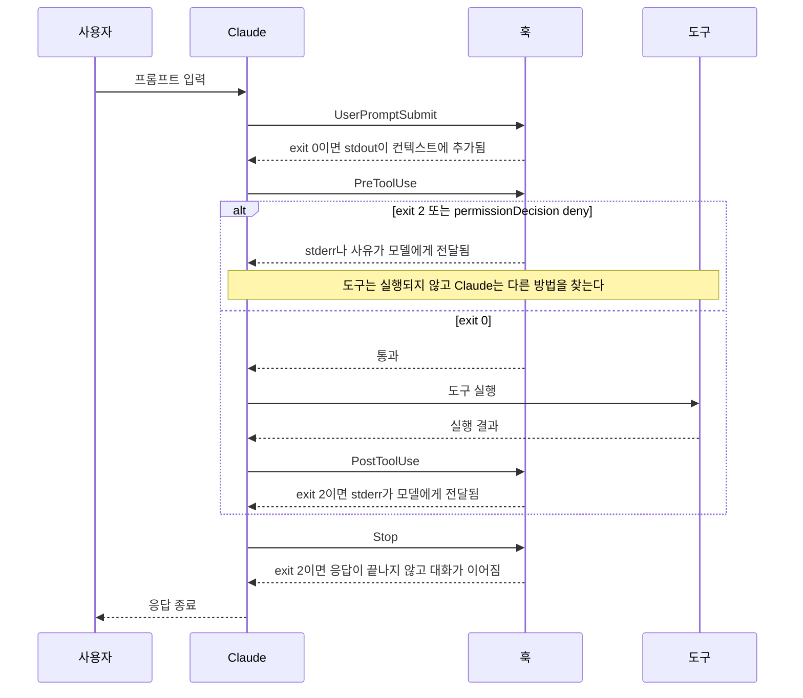
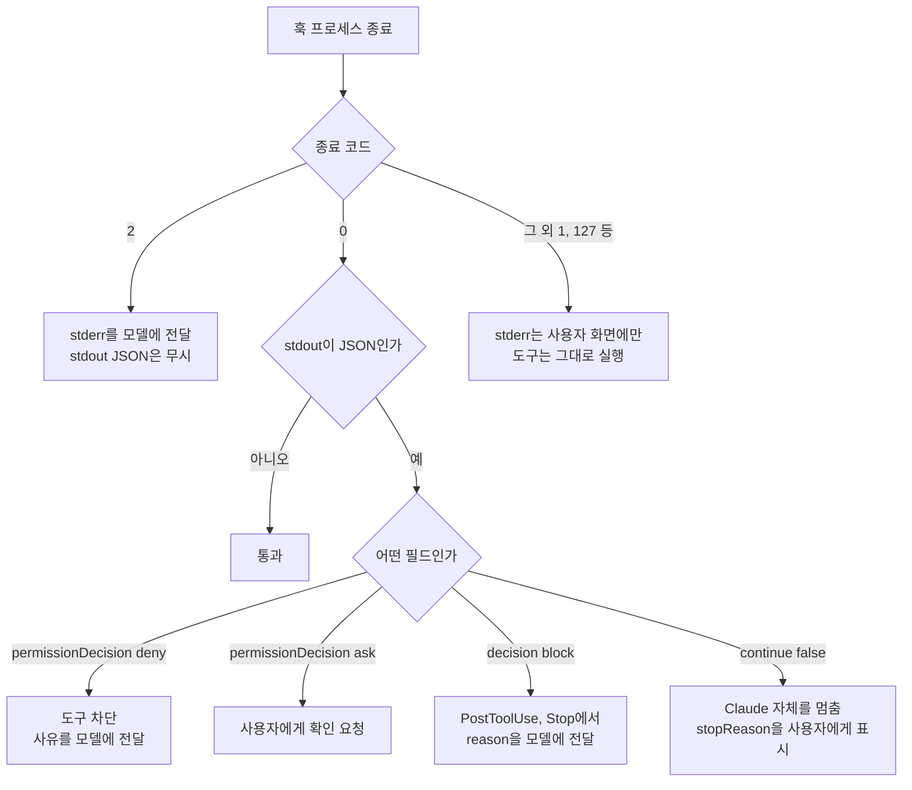
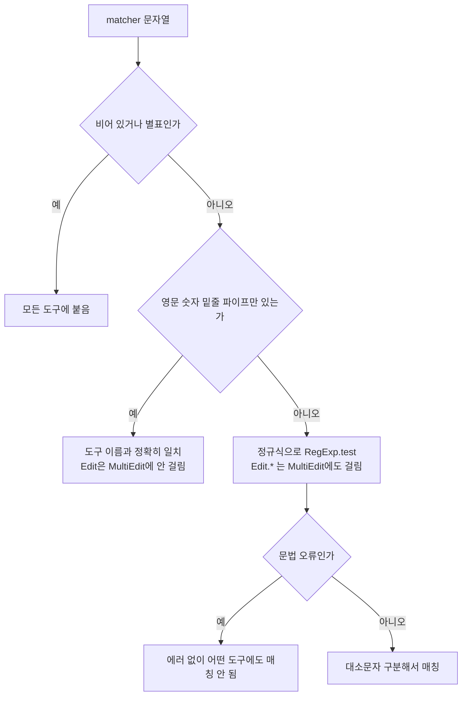
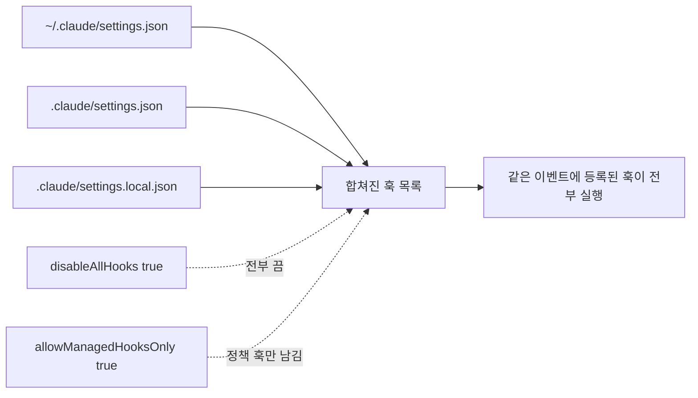
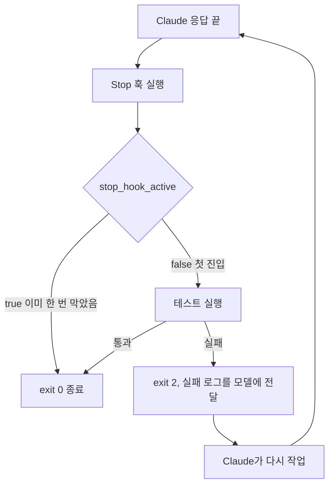
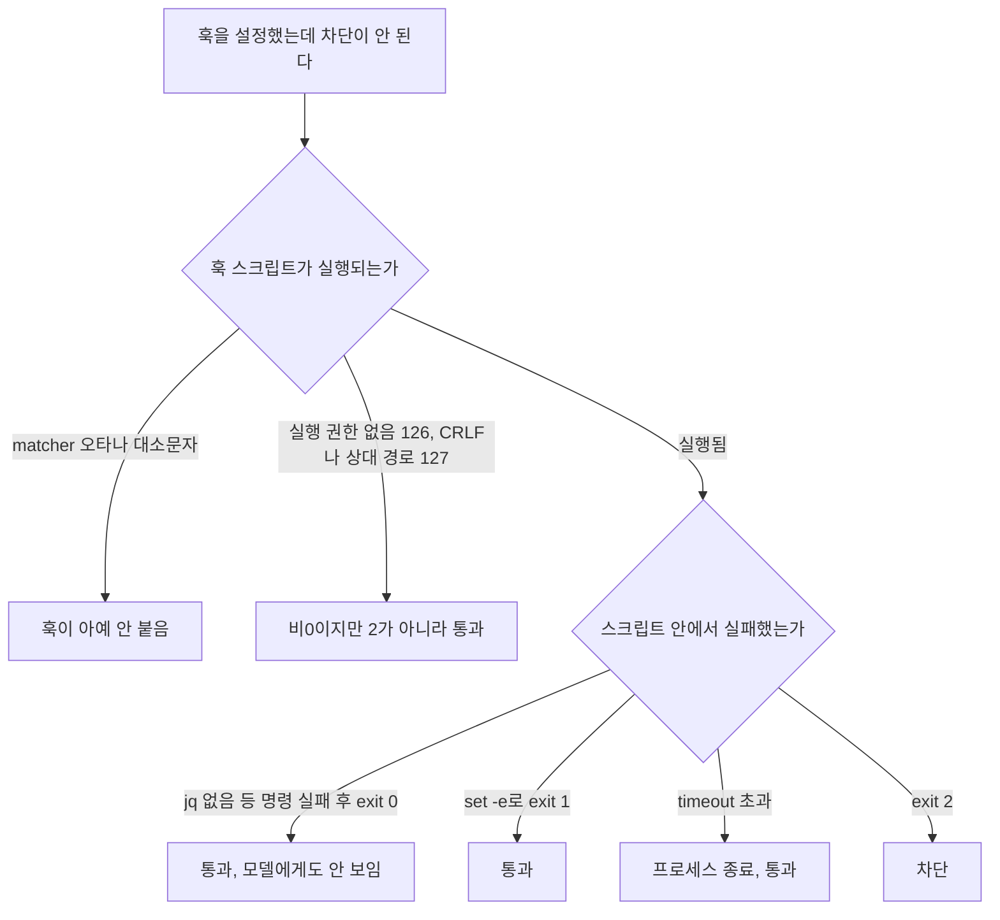

# Claude Code Hooks

CLAUDE.md에 "rm -rf는 쓰지 마라"라고 적어두면 Claude는 대체로 지킨다. 대체로라는 말이 문제다. 열 번 중 한 번 어기면 그 한 번이 node_modules가 아니라 홈 디렉토리를 지운다. 훅은 이 "대체로"를 "항상"으로 바꾸는 장치다. 모델이 판단하는 자리에 끼어들지 않고, 도구가 실행되기 직전과 직후에 모델 바깥에서 셸 스크립트를 돌린다.

훅은 Routine, Skill_Rule, Harness, Troubleshooting 문서에 조금씩 나뉘어 나온다. 이 문서는 그걸 한 곳에 모으고, 흩어진 설명끼리 어긋나던 부분(종료 코드 1의 의미, 타임아웃 기본값)을 실제로 돌려서 다시 맞췄다. 검증 방법은 두 가지다. 훅 스크립트는 /tmp에서 손으로 만든 stdin JSON을 넣어 종료 코드와 출력을 확인했다. 이벤트 이름, stdin 필드, 종료 코드별 동작, matcher 규칙은 설치된 Claude Code 2.1.111의 `cli.js`에서 직접 대조했다. 실제 세션에서 도구를 부르게 해서 끝까지 돌려본 것은 아니다.

## 훅이 끼어드는 지점

훅은 이벤트에 붙는다. 이벤트마다 발동 시점이 다르고, stdin으로 들어오는 JSON 필드도 다르다. 훅 스크립트는 stdin을 한 번 읽어서 `jq`로 필요한 필드를 뽑는 것이 전부다.

| 이벤트 | 발동 시점 | 이벤트 고유 stdin 필드 |
|---|---|---|
| `SessionStart` | 세션 시작, 재개, `/clear`, 압축 직후 | `source`, `model` |
| `UserPromptSubmit` | 사용자가 엔터를 친 직후, 모델에 보내기 전 | `prompt` |
| `PreToolUse` | 도구 실행 직전 | `tool_name`, `tool_input`, `tool_use_id` |
| `PostToolUse` | 도구 실행 직후 | `tool_name`, `tool_input`, `tool_response`, `tool_use_id` |
| `Stop` | 메인 에이전트가 응답을 끝내려 할 때 | `stop_hook_active`, `last_assistant_message` |
| `SubagentStop` | 서브 에이전트가 끝내려 할 때 | `stop_hook_active`, `agent_id`, `agent_transcript_path`, `agent_type`, `last_assistant_message` |
| `PreCompact` | 컨텍스트 압축 직전 | `trigger`(수동/자동), `custom_instructions` |

모든 이벤트에는 공통 필드가 붙는다. `session_id`, `transcript_path`, `cwd`, `permission_mode`, `hook_event_name`이다. 서브 에이전트 안에서 발동하면 `agent_id`, `agent_type`도 들어온다. 이 버전에는 위 표 말고도 `PostToolUseFailure`, `Notification`, `SessionEnd`, `PermissionRequest`, `SubagentStart` 등 이벤트가 더 있지만, 실무에서 손이 가는 건 표의 일곱 개다.

`PreToolUse`에서 `tool_input`의 모양은 도구마다 다르다. Bash는 `.tool_input.command`, Write와 Edit은 `.tool_input.file_path`다. 도구를 가리지 않는 훅을 쓰면 `// empty` 없이 `jq -r '.tool_input.command'`를 쓴 순간 Write 호출에서 문자열 `null`이 나온다.

아래 시퀀스에서 훅이 끼어드는 자리를 보면 된다. 차단 권한이 있는 곳은 `PreToolUse`(도구가 아직 안 돌았다)와 `Stop`(응답이 아직 안 끝났다)이고, `PostToolUse`는 이미 일어난 일을 되돌릴 수 없다.



`UserPromptSubmit`은 쓰임새가 하나 더 있다. exit 0일 때 stdout이 그대로 모델 컨텍스트에 붙는다. 현재 git 브랜치나 배포 환경 같은 값을 매 프롬프트에 자동으로 넣을 수 있다. `SessionStart`도 stdout이 모델에게 보이는 이벤트라서, 세션을 열 때 최근 커밋 요약을 넣는 용도로 쓴다. 나머지 이벤트의 stdout은 `ctrl+o` 트랜스크립트 모드에서 사람이 볼 수 있을 뿐 모델에게는 가지 않는다.

## 종료 코드와 JSON 출력

훅이 모델에게 말을 거는 방법은 두 가지다. 종료 코드로 말하거나, exit 0으로 끝내면서 stdout에 JSON을 찍는다. 둘을 섞어 쓰면 안 된다. exit 2일 때는 stdout의 JSON을 읽지 않고 stderr만 쓴다.



가장 많이 헷갈리는 부분은 exit 2와 그 외 비0 코드의 차이다. exit 2만 "차단하고 모델에게 이유를 알려준다"이고, exit 1이나 127(command not found)은 훅이 실패했다는 사실이 사용자 화면에 잠깐 뜨고 끝이다. 도구는 그대로 실행된다. 보안 훅을 짜면서 `exit 1`로 막았다고 생각하는 경우가 실제로 많다. 스크립트 안에서 `set -e`를 걸어두면 어디선가 실패한 명령 하나가 exit 1로 스크립트를 끝내고, 차단 훅이 통과 훅으로 바뀐다.

exit 2의 의미는 이벤트마다 다르다. 이 버전의 `cli.js`에 박혀 있는 문구를 정리하면 이렇다.

| 이벤트 | exit 2일 때 |
|---|---|
| `PreToolUse` | 도구 호출을 막고 stderr를 모델에게 전달 |
| `PostToolUse` | 도구는 이미 실행됨. stderr만 모델에게 전달 |
| `UserPromptSubmit` | 프롬프트 처리를 막고 입력한 프롬프트를 지움. stderr는 사용자에게만 보임 |
| `Stop`, `SubagentStop` | 끝내지 못하게 하고 stderr를 모델에게 전달해 대화를 이어감 |
| `PreCompact` | 압축을 막음 |

`UserPromptSubmit`에서 exit 2를 쓰면 방금 친 프롬프트가 사라진다. 시크릿이 들어간 프롬프트를 거르는 용도로는 맞지만, 사용자는 입력이 날아간 것처럼 느낀다. stderr에 이유를 적어두지 않으면 영문을 모른다.

종료 코드 대신 JSON을 쓰는 이유는 세분화다. `PreToolUse`는 `hookSpecificOutput`에 `permissionDecision`을 `allow`, `deny`, `ask` 중 하나로 넣을 수 있다. exit 2는 "차단" 하나뿐인데, `ask`는 "확인은 받되 막지는 마라"를 표현한다. `git push`처럼 막기엔 과하고 자동 승인하기엔 불안한 명령에 맞는다. `updatedInput`으로 도구 인자를 고쳐서 넘기는 것도 된다.

```bash
#!/usr/bin/env bash
input=$(cat)
cmd=$(echo "$input" | jq -r '.tool_input.command // empty')

case "$cmd" in
  *"git push"*)
    jq -n '{hookSpecificOutput:{hookEventName:"PreToolUse",permissionDecision:"ask",permissionDecisionReason:"push 전에 확인"}}'
    ;;
  *"terraform apply"*)
    jq -n '{hookSpecificOutput:{hookEventName:"PreToolUse",permissionDecision:"deny",permissionDecisionReason:"apply 는 CI 에서만 한다"}}'
    ;;
esac
exit 0
```

이 스크립트에 `git push origin main`, `terraform apply`, `ls`를 stdin으로 넣어보면 앞의 둘은 위 JSON이 나오고 `ls`는 아무것도 출력하지 않는다. 종료 코드는 셋 다 0이다. 차단되는 건 JSON 안의 `deny` 때문이지 종료 코드 때문이 아니다.

최상위의 `decision: "block"`은 `PostToolUse`와 `Stop`에서 쓴다. `reason`이 모델에게 전달된다. `continue: false`는 성격이 다르다. 모델에게 피드백을 주는 게 아니라 Claude의 진행 자체를 멈춘다. 이때 보이는 메시지는 `stopReason`이다.

## matcher와 설정 파일 위치

`PreToolUse`와 `PostToolUse`는 `matcher`로 어떤 도구에 붙을지 고른다. 매칭 규칙을 `cli.js`에서 확인한 결과는 이렇다.

- 비어 있거나 `*`면 모든 도구에 붙는다.
- 영문, 숫자, 밑줄, `|`로만 이루어졌으면 도구 이름과의 정확한 일치다. `Edit`은 `MultiEdit`에 걸리지 않고, `Edit|Write`는 둘 중 하나와 일치한다.
- 그 밖의 문자가 하나라도 있으면 정규식이다. 앵커가 없는 `RegExp.test`라서 `Edit.*`는 `MultiEdit`에도, `NotebookEdit`에도 걸린다.
- 대소문자를 구분한다. `bash`는 `Bash`와 맞지 않는다.
- 정규식이 문법 오류면 에러 없이 아무 도구에도 매칭되지 않는다. 디버그 로그에 한 줄 남을 뿐이다.

아래 flowchart는 위 규칙을 판정 순서대로 늘어놓은 것이다. matcher 문자열이 어느 갈래로 들어가느냐에 따라 같은 `Edit`도 정확 일치와 정규식으로 갈린다.



위 규칙을 node로 옮겨 여러 조합을 돌려봤다. `mcp__github__.*`는 `mcp__github__create_issue`에 걸리고, `(Bash`처럼 닫히지 않은 괄호는 false를 반환한다. MCP 도구는 `mcp__서버명__도구명` 형태라서 서버 단위로 걸 때 정규식 matcher가 필요하다.

이벤트에 따라 matcher가 보는 대상이 다르다. `SessionStart`는 `source`(startup, resume, clear, compact)를, `PreCompact`는 `trigger`(manual, auto)를 본다. `UserPromptSubmit`과 `Stop`에는 matcher를 쓰지 않고 `hooks` 배열만 둔다.

설정 파일은 세 곳이다.

| 위치 | 범위 | git |
|---|---|---|
| `~/.claude/settings.json` | 내 모든 프로젝트 | 해당 없음 |
| `.claude/settings.json` | 프로젝트, 팀 공유 | 커밋한다 |
| `.claude/settings.local.json` | 이 저장소의 내 로컬 설정 | gitignore에 들어간다 |

세 파일의 `hooks`는 덮어쓰지 않고 합쳐진다. 우선순위로 한쪽이 이기는 구조가 아니라, 같은 이벤트에 등록된 훅이 전부 돈다. 사용자 설정의 포매터 훅과 프로젝트 설정의 포매터 훅이 둘 다 있으면 같은 파일에 prettier가 두 번 돈다. 팀 공용 훅을 `.claude/settings.json`에 커밋했는데 개인 설정에도 비슷한 걸 넣어둔 사람이 결과가 이상하다고 할 때 가장 먼저 의심할 부분이다.

아래 flowchart는 세 설정 파일의 훅이 한 목록으로 합쳐져 같은 이벤트에서 전부 도는 모습이다. 점선으로 이어진 두 스위치만 이 합쳐진 목록 자체를 끈다.



덮어쓰는 쪽은 훅을 끄는 스위치다. 설정에 `disableAllHooks: true`를 넣으면 훅이 전부 꺼진다. 조직 정책(managed settings)에서 `allowManagedHooksOnly: true`를 걸면 사용자와 프로젝트 훅은 무시되고 정책 훅만 돈다. 팀 훅이 내 로컬에서만 안 도는데 스크립트에 문제가 없다면 이 두 값을 확인한다.

훅 command에서 프로젝트 안 스크립트를 가리킬 때는 `$CLAUDE_PROJECT_DIR`을 쓴다. 훅은 Claude가 지금 있는 디렉토리에서 실행되는데, Claude가 `cd`로 서브 디렉토리에 들어간 뒤에는 `./.claude/hooks/guard.sh`가 안 보이기 때문이다. 이 경우도 exit 127이라 조용히 지나간다. 경로에 공백이 있을 수 있으니 따옴표로 감싼다.

```json
{
  "hooks": {
    "PreToolUse": [
      {
        "matcher": "Bash|Write|Edit",
        "hooks": [
          { "type": "command", "command": "\"$CLAUDE_PROJECT_DIR\"/.claude/hooks/guard.sh", "timeout": 10 }
        ]
      }
    ],
    "PostToolUse": [
      {
        "matcher": "Edit|Write",
        "hooks": [
          { "type": "command", "command": "\"$CLAUDE_PROJECT_DIR\"/.claude/hooks/format.sh", "timeout": 30 }
        ]
      }
    ],
    "Stop": [
      {
        "hooks": [
          { "type": "command", "command": "\"$CLAUDE_PROJECT_DIR\"/.claude/hooks/stop-test.sh", "timeout": 120 }
        ]
      }
    ]
  }
}
```

이 파일은 `jq -e`로 JSON 문법을 확인했다. 구조는 이벤트 아래 matcher 그룹의 배열이고, 그 그룹 안에 `hooks` 배열이 또 있다. 이 중첩을 한 겹 빼고 `{"matcher": "Edit", "command": "..."}`로 쓰는 예제가 인터넷에 돌아다닌다. 이 모양은 현재 스키마의 중첩 구조와 달라서 동작을 기대하면 안 된다.

`type`은 `command` 말고도 `prompt`(모델이 판정), `agent`(서브 에이전트가 검증), `http`(URL로 JSON을 POST)가 있다. 파일을 검사하는 수준이면 `command`로 충분하다. "이 diff가 요구사항을 만족하는가" 같은 판정은 `prompt`나 `agent` 타입이 맞는데, 응답 시간과 비용이 매번 붙는다.

## rm -rf와 .env 쓰기 차단

가장 먼저 만드는 훅이다. Bash 명령과 파일 경로를 한 스크립트에서 본다.

```bash
#!/usr/bin/env bash
input=$(cat)
tool=$(echo "$input" | jq -r '.tool_name')
cmd=$(echo "$input" | jq -r '.tool_input.command // empty')
path=$(echo "$input" | jq -r '.tool_input.file_path // empty')

if [ "$tool" = "Bash" ] && echo "$cmd" | grep -Eq '(^|[;&|[:space:]])rm[[:space:]]+(-[a-zA-Z]*r[a-zA-Z]*f|-[a-zA-Z]*f[a-zA-Z]*r)[[:space:]]'; then
  echo "rm -rf 차단: 삭제 대상을 명시하고 사용자 승인을 받아야 한다" >&2
  exit 2
fi

case "$(basename "$path")" in
  .env|.env.*)
    echo ".env 파일 쓰기 차단: 값은 사용자가 직접 넣는다" >&2
    exit 2
    ;;
esac

exit 0
```

`rm -rf node_modules`, `cd x && rm -fr build/`, `/app/.env`, `/app/.env.local`은 exit 2로 막혔고, `ls -la`, `rm -r tmp`, `/app/env.ts`는 통과했다. 여기까지는 의도대로다.

문제는 정규식 기반 차단이 우회가 쉽다는 점이다. 같은 스크립트에 `rm -r -f build`, `rm --recursive --force build`를 넣으면 둘 다 exit 0으로 통과한다. 플래그를 쪼개거나 긴 옵션을 쓰면 패턴이 못 잡는다. Claude가 악의적으로 우회하는 일은 드물지만, 첫 시도가 차단되면 다른 형태로 다시 시도하는 일은 흔하다. 훅은 "자주 일어나는 실수의 안전망"이고, 진짜 방어선이 필요한 명령은 `permissions.deny`나 샌드박스 쪽에 둬야 한다. `.env` 쪽은 도구가 Write와 Edit일 때만 막힌다. `cat > .env`나 `echo X >> .env` 같은 Bash 경유는 그대로 통과한다. Bash 명령에서 `.env`를 감지하는 규칙을 하나 더 넣어야 하는데, 그러려면 오탐(`.env.example` 읽기 등)을 감수해야 한다.

stderr 문구는 모델이 읽는다는 점을 생각해서 쓴다. "차단됨"만 적으면 Claude는 같은 명령을 변형해서 재시도한다. "삭제 대상을 명시하고 사용자 승인을 받아야 한다"처럼 다음 행동을 알려주면 사용자에게 물어보러 간다.

## 저장 후 prettier와 eslint 실행

`PostToolUse`에 `Edit|Write` matcher를 걸어 파일이 바뀔 때마다 포매터를 돌린다.

```bash
#!/usr/bin/env bash
input=$(cat)
path=$(echo "$input" | jq -r '.tool_input.file_path // empty')

case "$path" in
  *.js|*.ts|*.tsx|*.json) ;;
  *) exit 0 ;;
esac

[ -f "$path" ] || exit 0

if ! out=$(npx --no-install prettier --write "$path" 2>&1); then
  echo "prettier 실패: $path" >&2
  echo "$out" >&2
  exit 2
fi
exit 0
```

확장자 필터를 스크립트 안에서 거는 이유가 있다. matcher는 도구 이름만 보기 때문에 마크다운이나 YAML 편집에도 훅이 발동한다. 확장자는 스크립트에서 걸러야 한다. `.md` 경로를 넣으면 exit 0으로 바로 빠지는 것을 확인했다.

`npx --no-install`을 붙인 건 이유가 있다. 이 샌드박스에는 prettier가 없어서, 옵션 없이 npx를 쓰면 네트워크에서 패키지를 받으려고 하고 훅이 거기서 멈춘다. `--no-install`로 두면 로컬에 없을 때 즉시 실패한다. 실제로 `app.js`를 넣어보니 prettier가 없는 환경에서 `npx canceled due to missing packages` 메시지와 함께 exit 2가 나왔다. 이 결과는 Claude에게 stderr로 전달되므로, 모델은 "prettier가 설치돼 있지 않다"는 사실을 알고 사용자에게 보고한다. 설치되지 않은 도구가 있는 환경에서는 `command -v`로 먼저 확인하고 exit 0으로 빠지는 쪽이 낫다. 모든 편집마다 에러를 모델에게 돌려주면 컨텍스트가 소모된다.

`PostToolUse`의 exit 2는 이미 바뀐 파일을 되돌리지 못한다. 모델에게 "이 파일에 문제가 있다"는 알림이 갈 뿐이다. 포매터가 파일을 직접 고쳐 쓰면 모델이 가진 파일 내용과 디스크가 어긋나므로, 모델이 다음 Edit에서 `old_string`을 못 찾는 일이 생긴다. 이럴 때 Claude는 파일을 다시 읽고 시도하는데, 포매터가 줄바꿈을 많이 바꾸는 프로젝트라면 이 재읽기 비용이 편집마다 붙는다.

eslint는 `--fix` 없이 검사만 돌리고 위반을 stderr로 돌려주는 방식이 안전하다. 자동 수정이 코드 의미를 바꾸는 규칙이 몇 개 있다.

## Stop 훅이 무한 루프에 빠지는 경우

"테스트가 통과할 때까지 끝내지 마라"를 `Stop` 훅으로 강제하는 설정이 있다. 테스트가 실패하면 exit 2를 돌려주고, Claude는 stderr를 보고 다시 작업한다. 가드 없이 이렇게 만들면 테스트가 영원히 실패하는 환경(DB가 안 떠 있다든가)에서 무한히 돈다. 매 반복이 토큰이다.



`stop_hook_active`가 이 루프를 끊는 장치다. Stop 훅이 이미 한 번 응답을 막아서 Claude가 이어 작업하는 중이면 `true`로 들어온다. 처음 만든 스크립트는 이 값이 `true`면 exit 0으로 보냈다.

```bash
#!/usr/bin/env bash
input=$(cat)

if [ "$(echo "$input" | jq -r '.stop_hook_active')" = "true" ]; then
  exit 0
fi

if ! out=$(cd "$(echo "$input" | jq -r '.cwd')" && sh ./run-tests.sh 2>&1); then
  echo "테스트 실패. 고친 뒤 끝내라." >&2
  echo "$out" | tail -20 >&2
  exit 2
fi
exit 0
```

`stop_hook_active`가 `false`면 exit 2와 실패 로그가 나오고, `true`면 같은 상황에서도 exit 0이 나왔다. 루프는 끊기지만 부작용이 있다. 첫 번째 수정 시도에서 테스트가 또 실패해도 두 번째 Stop은 그냥 통과한다. 테스트를 고칠 기회가 한 번뿐인 셈이다. 통과를 강제한다는 목적이 절반만 달성된다.

횟수를 세는 쪽이 현실적이다. `session_id`별로 파일에 실패 횟수를 기록하고, 3번까지만 다시 시킨다.

```bash
#!/usr/bin/env bash
input=$(cat)
sid=$(echo "$input" | jq -r '.session_id')
cwd=$(echo "$input" | jq -r '.cwd')
state="${TMPDIR:-/tmp}/stop-hook-$sid"

if [ "$(echo "$input" | jq -r '.stop_hook_active')" != "true" ]; then
  rm -f "$state"
fi

n=$(cat "$state" 2>/dev/null || echo 0)
if [ "$n" -ge 3 ]; then
  exit 0
fi

if out=$(cd "$cwd" && sh ./run-tests.sh 2>&1); then
  rm -f "$state"
  exit 0
fi

echo $((n + 1)) > "$state"
echo "테스트 실패 ($((n + 1))/3). 고친 뒤 끝내라." >&2
echo "$out" | tail -20 >&2
exit 2
```

항상 실패하는 `run-tests.sh`로 다섯 번 연속 호출해봤다. 첫 호출(`active=false`)은 1/3, 이어서 2/3, 3/3까지 exit 2였고 네 번째부터는 exit 0이었다. 새 사용자 턴에서는 `stop_hook_active`가 다시 `false`로 오니 카운터를 지워 처음부터 센다. 상한에 도달해서 풀어줄 때 stderr를 아무것도 남기지 않으면 사용자는 테스트가 실패한 채 끝났다는 걸 모른다. 실제로 쓸 때는 `systemMessage` JSON으로 "테스트 3회 실패, 사람이 확인 필요"를 한 줄 남기는 것이 좋다.

Stop 훅 안에서 `claude` CLI를 다시 부르는 구성은 같은 루프를 한 단계 더 깊게 만든다. 내부 세션도 Stop 훅을 가지고 있기 때문이다. 훅 안에서는 외부 프로세스만 호출한다.

## 훅이 조용히 안 도는 경우

훅은 실패해도 소리를 내지 않는 경우가 대부분이라 "설정했는데 아무 일도 안 일어난다"로 나타난다. 지금까지 겪은 원인을 빈도 순으로 적는다.

아래 flowchart는 원인을 종료 코드 관점에서 묶은 것이다. 어느 갈래로 가든 exit 2가 아니면 도구는 그대로 실행된다는 점을 보면 된다.



**jq가 없는 환경.** 스크립트 첫 줄이 `jq`로 시작하는데 컨테이너나 새 노트북에 `jq`가 없으면 `jq: command not found`가 나온다. 그런데 스크립트 마지막 줄이 `exit 0`이면 전체가 exit 0이라 통과한다. 위 `guard.sh`에서 `jq`를 없는 명령(`jqx`)으로 바꿔 `rm -rf /`를 넣어봤다. stderr에 `command not found`가 세 줄 찍혔는데 종료 코드는 0이었다. 도구는 그대로 실행된다. 이 stderr는 모델에게도 가지 않는다. 팀 저장소에 커밋된 보안 훅이 `jq` 없는 동료 PC에서만 무효가 되는 식이다.

스크립트 맨 위에 `jq` 존재 확인을 넣어서 없으면 exit 2로 닫는다. 사용 가능한 상태가 아닌 훅은 통과시키지 않는 쪽(fail closed)이 보안 용도에서는 맞다.

```bash
command -v jq >/dev/null || { echo "jq 를 찾지 못했다. 훅이 동작하지 않는다" >&2; exit 2; }
```

이 한 줄을 붙인 버전으로 같은 입력을 넣으면 exit 2와 위 메시지가 나왔다. 대신 `jq`가 없는 환경에서 Claude가 모든 Bash와 Write를 못 한다. 포매터 같은 편의 훅에는 반대로 exit 0으로 빠지게 두는 게 맞다. 훅이 막는 대상의 위험도에 따라 정한다.

**실행 권한과 shebang.** `chmod +x`를 안 하고 직접 실행하면 `Permission denied`와 함께 exit 126이다. 비0이지만 2가 아니므로 역시 조용히 넘어간다. 줄바꿈이 CRLF로 저장된 스크립트는 `env: 'bash\r': No such file or directory`와 함께 127이 난다. Windows 편집기를 거친 스크립트에서 나온다.

**상대 경로.** 앞에서 말한 대로 `./hooks/x.sh`는 cwd가 바뀌면 못 찾는다. `$CLAUDE_PROJECT_DIR`를 쓴다.

**matcher 오타와 대소문자.** `bash`, `edit`처럼 소문자로 쓰면 아무 도구에도 안 걸린다. 정규식 문법 오류도 에러 없이 매칭 실패로 처리된다.

**타임아웃.** 훅은 `timeout`(초 단위)을 개별로 줄 수 있고, 지나면 프로세스가 종료돼 비정상 종료로 처리된다. 즉 도구는 그대로 실행된다. 기본값은 버전마다 다르다. 예전 문서에는 60초라고 나오는데, 2.1.111의 `cli.js`에서 도구 훅 기본 타임아웃(`TOOL_HOOK_EXECUTION_TIMEOUT_MS`)은 600000ms, 즉 10분이다. 60초를 쓰는 건 `agent` 타입 훅뿐이다. 버전이 바뀌면 달라질 수 있으니 `timeout`을 명시한다. 편집마다 도는 `PostToolUse` 훅은 10~30초, 테스트를 도는 `Stop` 훅은 120초 정도로 잡는다. 타임아웃이 넉넉하면 느린 훅 때문에 사용자가 멈춘 것처럼 느끼는 시간이 그만큼 늘어난다.

**병렬 실행.** 같은 이벤트에 맞는 훅은 병렬로 실행된다고 보고 설계한다. 이 부분은 세션을 띄워 직접 재현하지 못했다. 같은 `PostToolUse`에 prettier 훅과 eslint 훅이 걸려 있으면 같은 파일을 두 프로세스가 동시에 건드릴 수 있다. 순서에 기대는 구성(포매터 다음에 린터)은 한 스크립트 안에서 순차 호출로 묶는다.

**로그를 못 보는 문제.** 훅이 안 도는지 확인하려면 `claude --debug hooks`로 띄우면 훅 로딩과 실행 결과가 나온다. 이 CLI에는 `--include-hook-events`(stream-json 출력 전용)도 있다. 가장 단순한 확인법은 스크립트 첫 줄에 `date >> /tmp/hook.log`를 넣는 것이다. 파일이 안 생기면 스크립트까지 가지 못한 것이고, 생기는데 동작이 이상하면 스크립트 안의 문제다.

## Hook, Skill, CLAUDE.md, permissions deny

네 가지는 "Claude의 행동을 바꾼다"는 점에서 겹쳐 보이지만, 누가 실행하고 얼마나 강제되는지가 다르다.

| | 누가 실행하나 | 강제력 | 모델이 보나 | 알맞은 용도 |
|---|---|---|---|---|
| Hook | 하네스(셸 스크립트) | 종료 코드 2면 확정 차단, 그 외엔 통과 | stderr나 JSON 사유만 | 사람이 잊어도 돌아야 하는 검사, 포맷, 알림 |
| Skill | 모델이 읽고 따름 | 없음, 모델 판단 | 전체 내용 | 여러 단계의 작업 절차, 판단이 필요한 일 |
| CLAUDE.md | 모델이 읽고 따름 | 없음, 대체로 지킴 | 전체 내용 | 프로젝트 규칙, 코드 스타일, 명령어 목록 |
| permissions deny | 하네스(규칙 매칭) | 도구 호출 자체를 차단 | 거부 메시지만 | 도구 단위 금지(`Bash(rm:*)`, `Read(.env)`) |

hook과 permissions deny는 둘 다 하네스가 강제하지만 표현력이 다르다. deny는 도구 이름과 인자 패턴만 보는 선언형 규칙이라 빠르고 예측이 쉽다. 훅은 코드라서 "main 브랜치에 있을 때만 커밋 금지"처럼 상태를 보는 조건이 가능하다. 대신 위에서 본 것처럼 스크립트가 깨지면 조용히 열린다. 반드시 막아야 하는 것은 deny에 먼저 쓰고, 상황을 봐야 하는 것만 훅으로 쓴다.

Skill과 CLAUDE.md는 모델이 읽는 지시다. "커밋 메시지를 분석해서 형식에 맞게 다시 써라"는 판단이 필요하니 Skill이다. "커밋 메시지에 이슈 번호가 없으면 거부한다"는 판단이 필요 없는 검사라서 훅이다. 훅이 거부하고 Claude가 거부 사유를 읽고 고치는 흐름이 둘을 이어준다.

아래 flowchart는 어떤 요구를 어디에 둘지 고르는 분기다. 먼저 "기계적으로 검사할 수 있는가"를 묻고, 그다음 "도구·인자 패턴만으로 표현되는가"를 묻는다.

```mermaid
flowchart TD
    A[Claude에게 시킬 규칙] --> B{기계적으로 검사 가능한가}
    B -->|아니오, 판단이 필요| C{여러 단계 절차인가}
    C -->|예| D[Skill]
    C -->|아니오| E[CLAUDE.md]
    B -->|예| F{도구 이름과 인자 패턴만으로 표현되는가}
    F -->|예| G[permissions deny]
    F -->|아니오, 상태나 조건을 봐야 함| H[Hook]
    H --> I[깨지면 조용히 열리므로<br/>fail closed 여부를 정한다]
``` CLAUDE.md에 길게 적은 체크리스트를 Claude가 일부만 수행하는 경우, 그중 기계적으로 검사할 수 있는 항목을 훅으로 빼면 CLAUDE.md도 짧아진다.

훅 자체의 단점도 있다. 매 도구 호출마다 프로세스를 띄우므로 `PreToolUse`에 무거운 스크립트를 걸면 모든 Bash 호출이 느려진다. 스크립트에서 `jq`를 여러 번 호출하는 것도 한 번에 묶는 편이 낫다(`jq -r '[.tool_name, .tool_input.command // ""] | @tsv'` 식). 그리고 훅은 CLAUDE.md와 달리 저장소 안의 스크립트를 실행하므로, 낯선 저장소를 clone해서 열 때 `.claude/settings.json`의 훅이 내 계정 권한으로 돌 수 있다. 신뢰 여부를 묻는 창에서 확인하기 전에는 열지 않는다.
