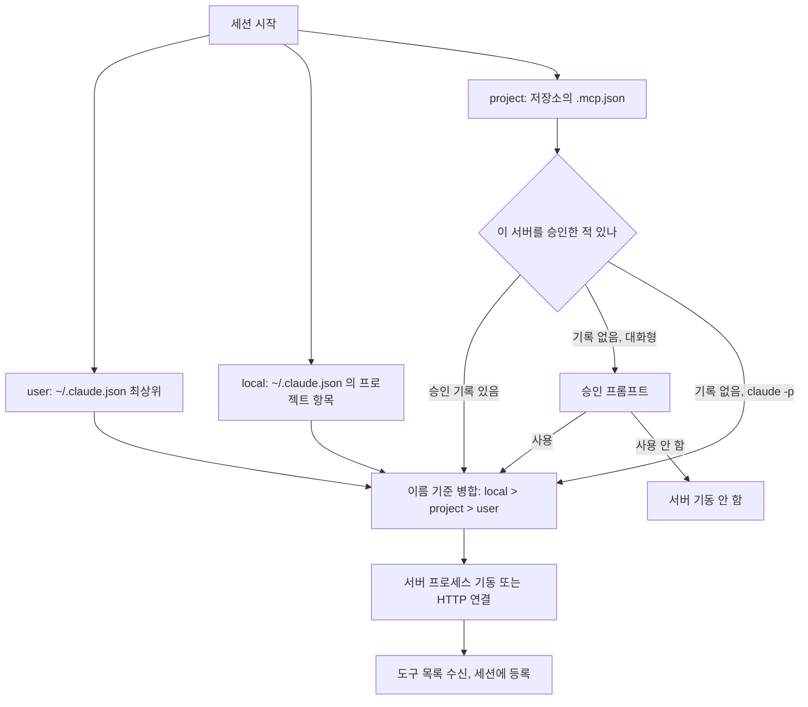
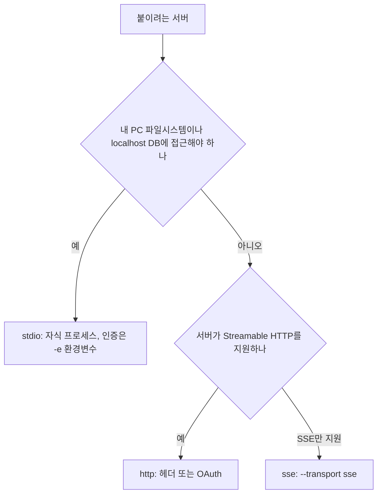
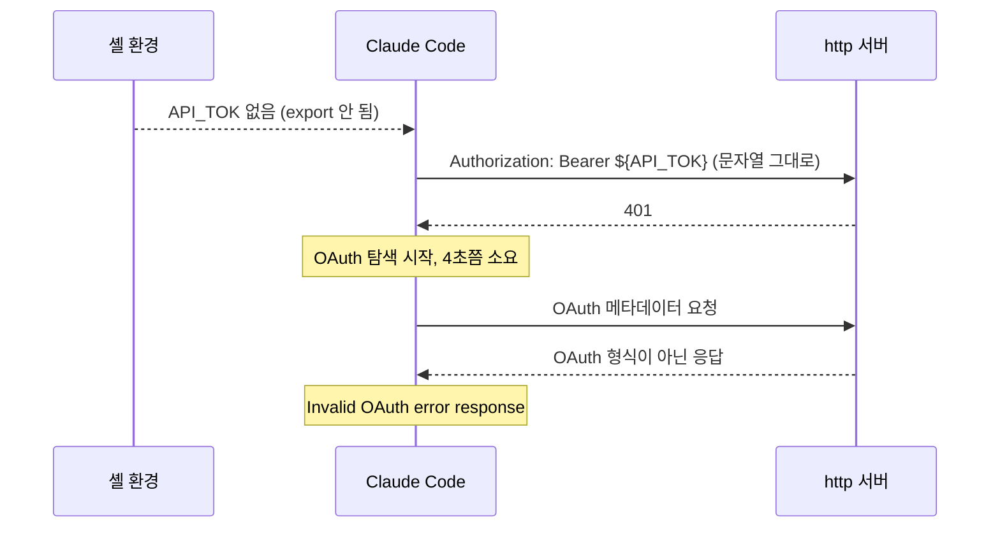
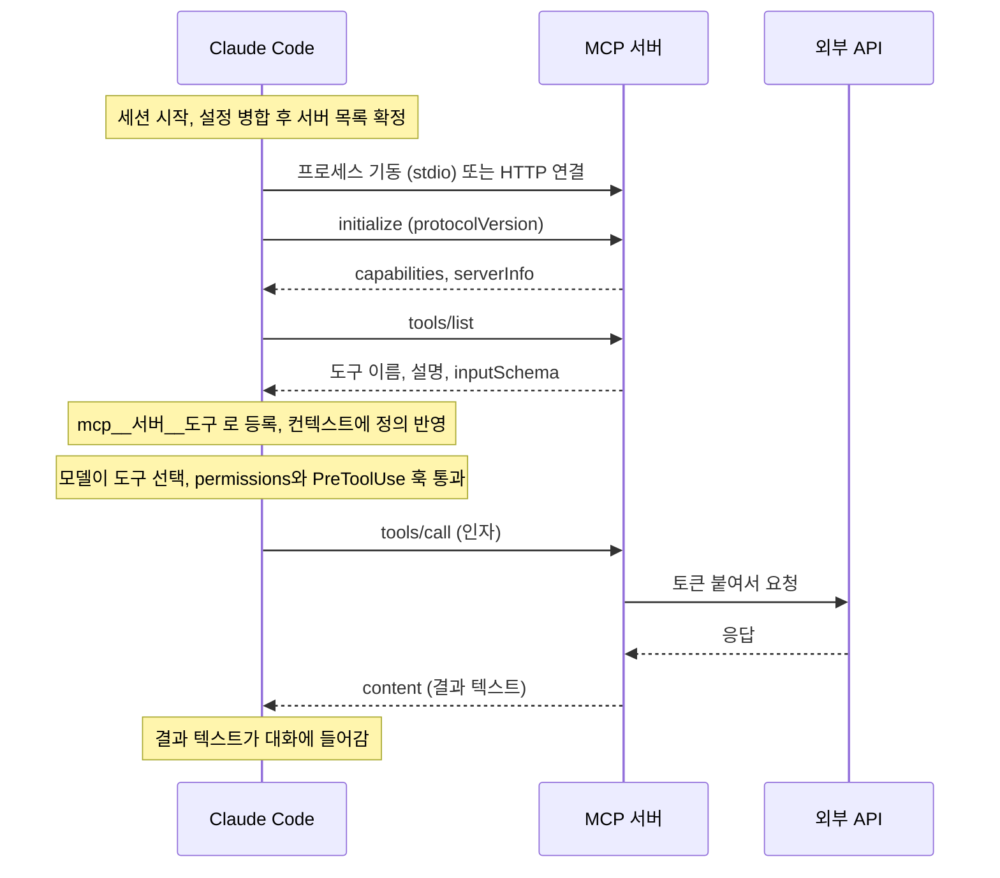
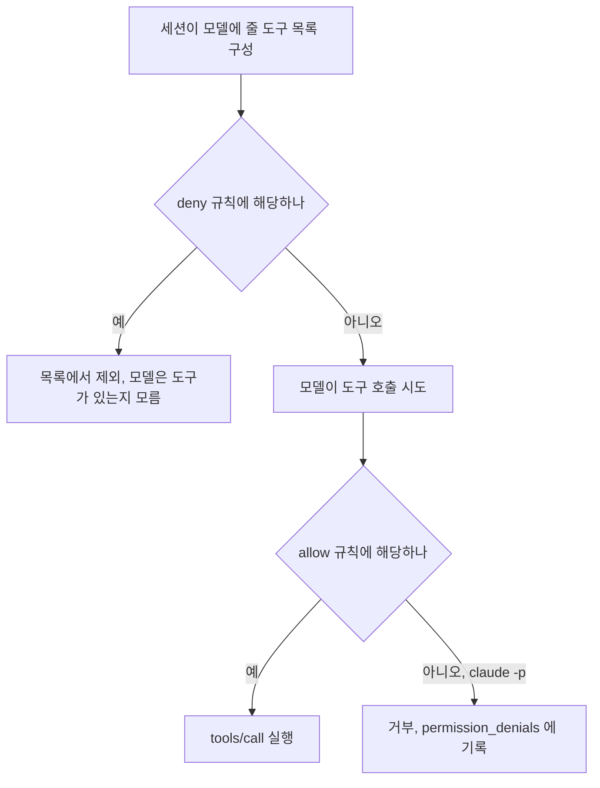
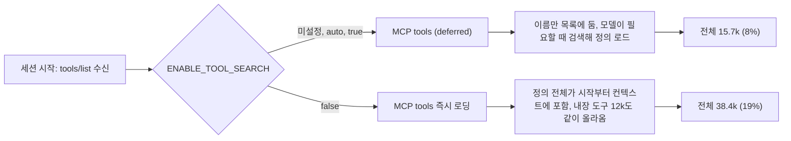
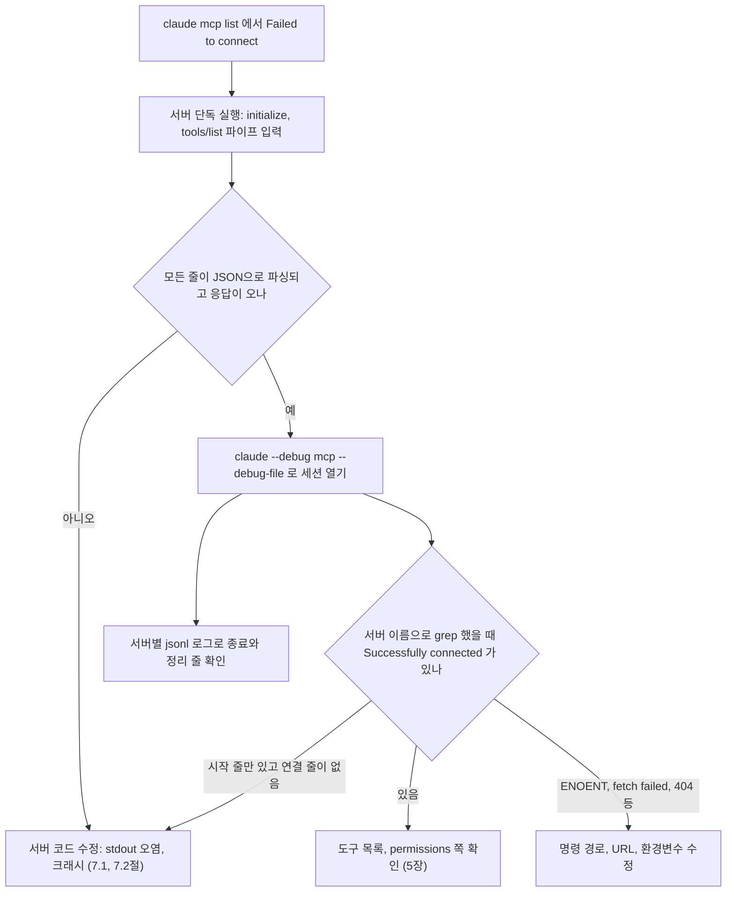
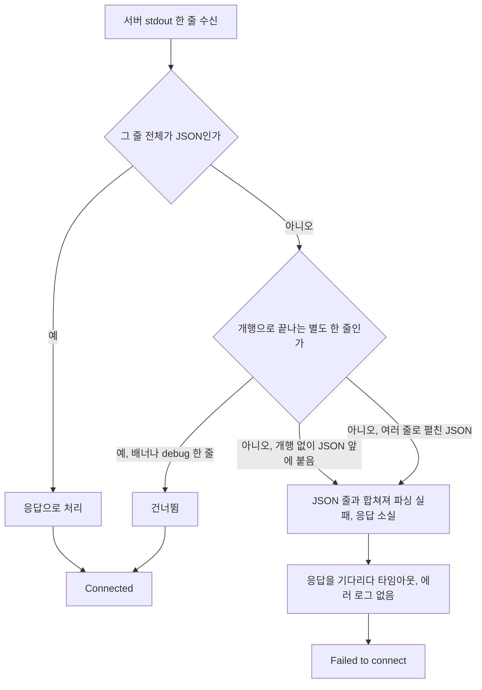

# Claude Code MCP 서버 연결과 운영

MCP 프로토콜 자체는 [MCP 핵심 개념](../MCP/MCP.md)에 있다. Claude Code 쪽 이야기는 [Claude_Code.md](Claude_Code.md) 5.3절, [Claude_Code_Harness.md](Claude_Code_Harness.md) 8절, [Claude_Code_Long_Job.md](Claude_Code_Long_Job.md) 7.1절에 나뉘어 있다. 이 문서는 그 조각을 모아서 `claude mcp` 명령, 설정 scope, 도구 이름 규칙, 컨텍스트 비용, 연결 실패 디버깅을 한 번에 본다.

본문의 동작은 전부 직접 돌려서 확인했다. 환경은 Claude Code 2.1.111, Linux, Node v20.20.0이고, 서버는 stdin/stdout으로 JSON-RPC만 주고받는 40줄짜리 Python 스크립트를 만들어서 썼다. 격리된 HOME에서 `claude mcp ...`와 `claude -p`(비대화형)로 실행했다. 확인하지 못한 것은 해당 위치에 적었다. 대화형 화면에서 승인 대화상자가 렌더되는 모습, 실제 OAuth 서버와의 인증 흐름, SSE 서버의 정상 연결은 못 봤다.

먼저 기존 문서와 어긋나는 세 가지를 적어 둔다. 이 버전에서 직접 확인한 결과다.

| 기존 문서의 설명 | 이 버전에서 확인한 결과 |
|---|---|
| `.claude/settings.json`의 `mcpServers`에 서버를 등록한다 | 그 필드는 읽히지 않는다. settings.json에 넣고 `/context`와 `claude mcp list`를 봤는데 서버가 나타나지 않았다 |
| MCP 로그는 `~/.claude/logs/mcp*.log`에 있다 | 그 경로는 만들어지지 않았다. 로그는 `~/.cache/claude-cli-nodejs/` 아래에 있다 |
| `claude mcp restart <server>`로 재시작한다 | `claude mcp --help`의 서브명령은 add, add-json, add-from-claude-desktop, get, list, remove, reset-project-choices, serve 여덟 개다. restart는 없다 |

## 1. 서버 설정이 저장되는 곳

`claude mcp` 서브명령은 등록·조회·삭제 세 가지를 한다. 등록할 때 `-s`(`--scope`)로 저장 위치를 고르고, 생략하면 `local`이다.

```bash
# stdio: 이름 다음에 -- 를 두고 실행 명령을 쓴다
claude mcp add db -s user -e DB_URL=postgres://... -- npx -y @modelcontextprotocol/server-postgres

# http: URL을 쓴다
claude mcp add --transport http sentry https://mcp.sentry.dev/mcp

claude mcp list                  # 전체 목록과 연결 상태
claude mcp get db                # 한 서버의 scope, 상태, 명령, 환경변수
claude mcp remove db -s user     # 같은 이름이 여러 scope에 있으면 -s 가 필수
```

`-e`와 `--header`는 값을 여러 개 받는 옵션이라 서버 이름을 삼킨다. `claude mcp add -e API_KEY=abc my-server -- ...`처럼 쓰면 `my-server`가 환경변수 값으로 읽혀서 `Invalid environment variable format: my-server`가 나온다. 이름을 맨 앞에 두면 된다.

scope별 저장 위치는 다음과 같다.

| scope | 파일 | 보이는 범위 | git |
|---|---|---|---|
| local (기본) | `~/.claude.json`의 `projects["프로젝트 경로"].mcpServers` | 그 프로젝트 안에서 나만 | 안 올라감 |
| user | `~/.claude.json` 최상위 `mcpServers` | 내 모든 프로젝트 | 안 올라감 |
| project | 저장소 루트의 `.mcp.json` | 저장소를 받은 모두 | 커밋 대상 |

local이 "프로젝트별"이면서 파일이 `~/.claude.json` 하나인 점이 처음엔 헷갈린다. 프로젝트 디렉터리에는 아무것도 생기지 않는다. project scope만 저장소 안에 `.mcp.json`을 만든다.

같은 이름이 여러 scope에 있으면 하나만 쓰인다. user에 1개, project에 3개, local에 5개의 도구를 노출하는 서버를 같은 이름 `dup`으로 등록하고 `/context`의 도구 개수를 세어 봤다.

| 등록된 scope | 세션에 올라온 `mcp__dup__*` 도구 수 |
|---|---|
| user만 | 1 |
| user + project | 3 |
| user + project + local | 5 |

local이 project를, project가 user를 덮는다. 병합이 아니라 이름 단위 교체라서, 팀이 `.mcp.json`에 둔 서버를 개인 설정에서 같은 이름으로 다시 등록하면 팀 설정은 조용히 무시된다. 이름이 겹쳤는지는 `claude mcp get 이름`의 `Scope:` 줄로 확인한다.

### 1.1 scope 병합과 승인 흐름

아래 flowchart는 세션이 시작될 때 세 곳의 설정이 어떻게 하나의 서버 목록이 되는지, `.mcp.json`만 왜 따로 승인 단계를 거치는지 보여준다.



`-p` 경로가 승인 없이 G로 가는 것은 아래 2장에서 다룬다.

## 2. 프로젝트 scope와 승인 프롬프트

`.mcp.json`은 저장소에 커밋되는 파일이고, stdio 서버의 `command`는 임의의 실행 파일이다. 누군가 PR로 `.mcp.json`에 서버 하나를 추가하면 그 저장소를 받아서 Claude Code를 여는 사람 전원의 PC에서 그 명령이 실행된다. 승인 프롬프트는 이 경로를 막으려는 장치다. 팀 DB를 붙이는 평범한 설정도 같은 규칙을 거친다.

대화형 실행에서 처음 보는 `.mcp.json` 서버가 있으면 `New MCP server found in .mcp.json: 서버이름` 대화상자가 뜬다. 선택지 문구는 바이너리 문자열에서 확인했고, 화면 렌더링은 못 봤다.

- Use this MCP server
- Use this and all future MCP servers in this project
- Continue without using this MCP server

선택 결과는 `enabledMcpjsonServers`, `disabledMcpjsonServers` 목록에 쌓인다. `~/.claude.json`의 프로젝트 항목에 이 두 배열이 있고(내 격리 환경에서는 둘 다 비어 있었다), settings 파일에서도 같은 키로 지정한다. 바이너리에는 `enableAllProjectMcpServers`도 있는데 이 키는 동작을 돌려보지 못했다.

`.claude/settings.local.json`에 `{"disabledMcpjsonServers":["teamdb"]}`를 넣고 `claude -p`를 돌리자 `.mcp.json`의 `teamdb`는 기동되지 않았다. 서버 시작 시 마커 파일을 만드는 `sh -c`로 감싸서 확인했고 파일이 생기지 않았다. 팀 서버 중 일부만 내 PC에서 끄고 싶을 때 쓴다. 이전에 내린 선택을 지우려면 `claude mcp reset-project-choices`를 쓴다.

### 승인이 걸리지 않는 두 경로

승인 프롬프트는 대화형 세션의 장치다. 같은 `.mcp.json`을 두 경로로 돌려서 서버가 기동되는지 봤다. 서버를 `sh -c "date +%s > marker; exec python3 srv.py"`로 감싸고 마커 파일 유무로 판정했다. 승인 기록이 전혀 없는 상태였다.

| 실행 방법 | 승인 없이 서버가 기동됐나 |
|---|---|
| `claude -p "/context"` | 기동됨. `mcp__teamdb__tool_0`이 도구 목록에 올라옴 |
| `claude mcp list` | 기동됨. help 문구에도 "stdio servers from .mcp.json are spawned for health checks"라고 적혀 있다 |

`claude mcp get`도 같은 문구다. CI에서 외부 PR의 체크아웃 위에 `claude -p`를 돌리거나, 낯선 저장소를 받자마자 `claude mcp list`로 어떤 서버가 있나 훑어보는 경우가 여기 걸린다. 확인하려던 행위가 곧 실행이다. 낯선 저장소는 `.mcp.json`을 `cat`으로 먼저 읽는다. CI에서 `claude -p`를 돌리는 구성은 [Claude_Code_Headless_CI.md](Claude_Code_Headless_CI.md)에 있고, 서드파티 서버 신뢰 문제는 8장에서 링크한다.

한 가지 더 있다. `claude mcp add -s project -e DB_PASSWORD=hunter2 ...`를 실행하면 `.mcp.json`에 `"env": {"DB_PASSWORD": "hunter2"}`가 평문으로 들어간다. project scope에 값을 직접 넘기면 그대로 커밋 대상이 된다. 3장의 `${VAR}` 확장을 쓴다.

## 3. transport 3종과 토큰 전달

transport는 `--transport`(`-t`)로 고르고 기본값은 stdio다.

| | stdio | http (Streamable HTTP) | sse |
|---|---|---|---|
| 서버 위치 | 내 PC의 자식 프로세스 | 원격 URL | 원격 URL |
| 인증 | 환경변수(`-e`) | 헤더(`--header`), OAuth | 헤더, OAuth |
| 맞는 경우 | 로컬 파일, 로컬 DB, 개인 도구 | 팀 공용 서버, SaaS | 이미 SSE로 서비스 중인 서버를 붙일 때만 |
| 실패 양상 | 실행 파일 없음은 즉시 `spawn ... ENOENT`. stdout 오염은 에러 없이 타임아웃까지 대기 | 연결 거부는 `fetch failed`. 경로 오류는 `Error POSTing to endpoint ... 404`. 401은 OAuth 탐색으로 넘어가 시간이 걸림 | `SSE error: Non-200 status code (404)` |

SSE는 MCP 표준에서 deprecated고 Streamable HTTP로 대체됐다. 이유와 이전 방법은 [MCP 전송 방식](../MCP/SSE_and_Stdio.md)에 있다. 새로 붙이는 원격 서버는 http를 쓰고, 서버가 SSE만 지원할 때만 `--transport sse`를 쓴다.

아래 flowchart는 transport를 고르는 분기를 정리한 것이다.



선택 기준은 단순하다. 서버가 내 PC 파일시스템이나 `localhost` DB에 접근해야 하면 stdio, 여러 사람이 같은 서버를 써야 하거나 서버가 SaaS면 http다. stdio는 Claude Code가 자식 프로세스로 띄우니까 사람마다 Node나 Python 버전이 같아야 한다. `.mcp.json`의 `command: "npx"` 한 줄이 팀원 PC에서 돌아가지 않아서 "내 PC에서는 되는데"가 나오는 일이 흔하다.

실패 양상을 같은 조건에서 비교하면 `claude mcp list`는 위 실패를 전부 `✗ Failed to connect` 한 줄로만 보여준다. 이유는 디버그 로그에만 있다. 7장에서 로그 읽는 법을 다룬다.

### 3.1 토큰은 환경변수나 헤더로

stdio 서버는 `-e KEY=값`, http 서버는 `--header "Authorization: Bearer ..."`로 넘긴다. `-H`의 도움말에는 "WebSocket headers"라고 적혀 있지만 http transport에서 `.mcp.json`의 `headers`로 저장됐고 실제 요청에도 실렸다.

커밋하는 `.mcp.json`에는 값 대신 `${변수}`를 쓴다.

```json
{
  "mcpServers": {
    "api": {
      "type": "http",
      "url": "https://api.example.com/mcp",
      "headers": { "Authorization": "Bearer ${API_TOK}" }
    },
    "db": {
      "command": "npx",
      "args": ["-y", "@modelcontextprotocol/server-postgres"],
      "env": {
        "DATABASE_URL": "${PG_URL}",
        "SSL_MODE": "${PG_SSL:-require}"
      }
    }
  }
}
```

각 위치를 직접 확인했다. HTTP 요청을 받아서 `Authorization` 헤더를 파일에 쓰는 서버를 띄우고 환경변수를 바꿔가며 돌렸다.

| 위치 | `API_TOK=sekret123` 설정 | 변수 미설정 |
|---|---|---|
| `headers` | 서버가 받은 값 `Bearer sekret123` | `Bearer ${API_TOK}` 문자열 그대로 |
| `env` | `abc123`으로 치환 | `${MY_TOK}` 문자열 그대로 |
| `args` | 치환됨 | 문자열 그대로 |
| `${PG_SSL:-require}` 형태 | 설정되면 그 값 | `require` |

아래 sequenceDiagram은 변수가 export되지 않았을 때 증상이 OAuth 에러로 나타나기까지의 경로를 보여준다.



변수가 없으면 에러 없이 `${API_TOK}` 문자열이 그대로 서버로 간다. 서버는 그냥 잘못된 토큰으로 보고 401을 돌려준다. 그러면 Claude Code가 OAuth 탐색을 시도해서 4초쯤 걸린 뒤 OAuth 응답 파싱 에러(`Invalid OAuth error response`)를 낸다. 에러 메시지만 보면 OAuth 설정 문제 같지만 원인은 셸에 변수가 안 export된 것이다. 이런 증상이면 `echo $API_TOK`부터 한다. 설정 확인용으로 `claude mcp get 이름`을 쓰는데, 이 명령은 `${API_TOK}`를 치환한 값을 그대로 출력한다. `API_TOK=sekret123`으로 돌리자 `Authorization: Bearer sekret123`이 화면에 찍혔다. 화면 공유나 로그 캡처 중에는 쓰지 않는다. 디버그 로그(7장)에서는 같은 헤더가 `"Authorization":"[REDACTED]"`로 가려졌다.

## 4. 세션 시작부터 도구 호출까지

서버는 세션을 시작할 때 한꺼번에 띄워진다. 디버그 로그에서 서버들의 `Starting connection with timeout of 30000ms` 시각이 몇 ms 간격으로 거의 동시였다. 서버 하나가 느려도 나머지 연결을 막지 않고, 기본 연결 제한은 30초다. `MCP_TIMEOUT` 환경변수로 줄일 수 있다(3000으로 줄이자 `connection timed out after 3000ms`로 끊겼다).



보여주려는 지점은 두 가지다. 외부 API 토큰은 서버가 쥐고 있고 Claude Code는 서버까지만 간다는 점, 그리고 `tools/list`의 응답 전체가 세션에 올라간다는 점이다. 6장 컨텍스트 비용이 여기서 나온다.

## 5. 도구 이름과 permissions, hooks matcher

서버가 노출하는 도구는 `mcp__서버이름__도구이름`으로 등록된다. 서버 이름은 `claude mcp add`의 이름이고, 이름 안에 특수문자가 있으면 바뀐다.

| 서버 이름 | 등록된 도구 이름 |
|---|---|
| `srv0` | `mcp__srv0__tool_0` |
| `my-db` | `mcp__my-db__tool_0` |
| `my.api v2` | `mcp__my_api_v2__tool_0` |

하이픈은 유지되고 점과 공백은 `_`로 바뀐다. permissions 규칙이나 훅 matcher를 쓸 때 원래 이름이 아니라 `/context`의 MCP Tools 표에 찍힌 이름을 복사한다.

### 5.1 permissions

`--allowedTools`와 `--disallowedTools`(settings의 `permissions.allow` / `deny`와 같은 규칙 문법)로 `claude -p`에서 `mcp__srv0__tool_0`을 호출하게 시키고 결과를 봤다. 아무 규칙이 없으면 비대화형이라 승인을 받을 수 없어서 거부된다.

| 규칙 | 결과 |
|---|---|
| 없음 | 거부. `permission_denials`에 `mcp__srv0__tool_0` |
| allow `mcp__srv0` | 호출 성공. 서버 이름만 쓰면 그 서버의 모든 도구 |
| allow `mcp__srv0__*` | 호출 성공 |
| allow `mcp__srv0__tool_1` | `tool_0`은 거부 |
| allow `mcp__my-db` (다른 서버) | 거부 |
| allow `mcp__srv0` + deny `mcp__srv0__tool_0` | 도구를 "찾을 수 없다"고 응답. `permission_denials`는 비어 있음 |

아래 flowchart는 위 표의 결과를 평가 순서로 다시 그린 것이다. deny가 걸린 도구는 호출 단계까지 가지 못하고 도구 목록 단계에서 사라진다는 점을 보면 된다.



마지막 줄이 중요하다. deny된 MCP 도구는 호출 시점에 거부되는 것이 아니라 모델이 보는 도구 목록에서 빠진다. deny가 allow보다 우선하고, 모델은 도구가 있는지조차 모른다. 이 실험은 모델이 응답하는 방식이라 같은 프롬프트로 한 번 "ok"가 나온 적도 있었다. 모델이 `tool_1`을 대신 호출하고 성공으로 보고했을 가능성이 있는데, 이 부분은 로그를 남기지 않아서 확정하지 못했다. 막는 용도라면 `claude -p`로 한 번 돌려서 `/context`의 MCP Tools 표에서 도구가 빠졌는지 보는 쪽이 확실하다. 규칙 문법과 평가 순서는 [Claude_Code_Settings_Permissions.md](Claude_Code_Settings_Permissions.md)에 있다.

### 5.2 hooks matcher

PreToolUse 훅 네 개를 달고 `mcp__srv0__tool_0` 호출 한 번에 어느 훅이 발동했는지 파일 줄 수로 셌다.

| matcher | 발동 |
|---|---|
| `mcp__srv0` | 안 됨 |
| `mcp__srv0__.*` | 됨 |
| `mcp__srv0__*` | 됨 (정규식으로 읽혀서 우연히 맞음) |
| `mcp__.*__tool_0` | 됨 |

permissions의 `mcp__srv0`은 서버 전체를 뜻하지만 훅 matcher의 `mcp__srv0`은 도구 이름과 정확히 같아야 하는 문자열이다. 서버 단위로 훅을 걸려면 `mcp__srv0__.*`를 쓴다. permissions 규칙을 그대로 훅에 복사하면 훅이 한 번도 안 도는데 에러도 안 난다. 훅 쪽 상세는 [Claude_Code_Hooks.md](Claude_Code_Hooks.md)에 있다.

## 6. 도구 정의가 컨텍스트를 먹는 문제

[Claude_Code_Harness.md](Claude_Code_Harness.md) 4장은 MCP 서버 5~6개를 붙이면 도구가 100개를 넘고 정의만으로 2~3만 토큰이 들어간다고 적는다. 이 버전에서 그 숫자를 재 봤다. 도구마다 설명 세 줄과 파라미터 두 개짜리 스키마를 가진 더미 서버를 만들어 서버 수를 바꿔가며 `claude -p "/context"`를 돌렸다.

| 서버 수 | 서버당 도구 | `/context`의 MCP tools 합계 | 전체 사용량 |
|---|---|---|---|
| 0 | - | - | 15.7k / 200k |
| 1 | 20 | 2.1k (deferred) | 15.7k |
| 5 | 20 | 10.7k (deferred) | 15.7k |

도구 하나당 107토큰이었다. 5개 서버에 100개 도구를 붙였는데 전체 사용량이 그대로 15.7k다. 항목이 `MCP tools (deferred)`로 표시돼 있고 합계에서 빠진다. 이 버전은 MCP 도구를 기본으로 지연 로딩한다. 도구 이름만 목록에 두고 모델이 필요할 때 검색해서 정의를 가져오는 방식이다(라벨과 합계로 확인했고 내부 구현은 못 봤다).

`ENABLE_TOOL_SEARCH`로 이 동작이 갈린다.

| `ENABLE_TOOL_SEARCH` | 5서버 x 20도구 전체 사용량 | MCP tools 항목 |
|---|---|---|
| 미설정 / `auto` / `true` | 15.7k (8%) | 10.7k, deferred |
| `false` | 38.4k (19%) | 10.7k, 즉시 로딩 |

`false`일 때 총량이 22.7k 늘어난다. MCP 쪽 10.7k에 내장 도구 중 지연 로딩되던 12k가 같이 올라온다. 도구 검색이 꺼진 상태라면 서버를 붙일 때마다 정의가 시작부터 컨텍스트에 들어온다. 어떤 값이 적용 중인지는 `/context`에서 MCP 항목에 `(deferred)`가 붙는지로 구분한다.

아래 flowchart LR은 같은 5서버 x 20도구가 `ENABLE_TOOL_SEARCH` 값에 따라 시작 컨텍스트에 들어오는 방식이 어떻게 갈리는지 비교한다.



내 더미 도구 107토큰은 하한에 가깝다. 실제 서버는 설명이 길고 스키마가 중첩돼 있어서 같은 도구 수라도 훨씬 크다. 서버를 붙이기 전후에 직접 재야 한다. `/context`는 MCP Tools 표에 도구별 토큰을 서버 이름과 함께 보여주니 서버별 합계가 바로 나온다.

```text
> /context
...
### MCP Tools
| Tool                  | Server | Tokens |
| mcp__srv0__tool_0     | srv0   | 107    |
...
```

### 6.1 서버를 끄는 기준

토큰이 deferred일 때도 서버를 줄일 이유는 남는다. 서버마다 세션 시작에 프로세스가 하나 뜨고, 실패하는 서버는 시작 로그에 계속 에러를 남긴다. 기준은 두 가지로 잡는다.

- `/context`에서 서버별 토큰이 큰데 최근 한 주 동안 호출한 적이 없는 서버는 뺀다. 도구 검색이 꺼져 있다면 가장 먼저 줄일 대상이다.
- 한 작업에만 필요한 서버는 user scope에 두지 않는다. `claude -p --strict-mcp-config --mcp-config 파일.json`으로 그 작업에만 서버를 지정하면 다른 scope의 서버는 전부 무시된다. 위 측정도 이 옵션으로 서버 수를 통제했다.

끄는 수단은 용도별로 다르다. 팀 `.mcp.json` 서버 중 내 PC에서만 빼려면 `disabledMcpjsonServers`, 내 서버를 영구히 빼려면 `claude mcp remove`, 서버는 두고 특정 도구만 숨기려면 permissions deny다. deny는 5.1절처럼 도구 목록에서 빠지므로 정의 토큰도 줄어든다.

죽은 서버는 시간도 먹는다. 실패하는 서버 5개가 섞인 상태에서 `claude mcp list`가 약 13초 걸렸다. 안 쓰는 서버가 `Failed to connect`로 남아 있으면 지운다.

## 7. 연결 실패를 추적하는 순서

`claude mcp list`의 `✗ Failed to connect`는 원인을 말해 주지 않는다. 그리고 `✓ Connected`도 믿을 수 없는 경우가 있다(7.2절). 순서는 이렇게 간다.

1. 서버를 단독으로 돌려서 JSON-RPC에 응답하는지 본다.
2. `claude --debug mcp --debug-file /tmp/mcp.log`로 세션을 열고 로그를 읽는다.
3. 서버별 jsonl 로그를 본다.

아래 flowchart는 위 세 단계를 어떤 순서로 좁혀 가는지 보여준다. 서버 단독 실행에서 먼저 걸러야 Claude Code 쪽 문제와 서버 쪽 문제가 섞이지 않는다.



옛 문서에 나오는 `--mcp-debug`는 이 버전에서 `[DEPRECATED. Use --debug instead]`로 표시된다. `--debug [filter]`는 `"mcp"` 같은 카테고리를 줄 수 있고, `--debug-file 경로`를 쓰면 stderr 대신 파일에 쌓인다. 대화형 TUI에서는 화면과 섞이니 파일로 받는 쪽이 편하다.

```bash
claude --debug mcp --debug-file /tmp/mcp.log
grep 'MCP server "db"' /tmp/mcp.log | tail -20
```

로그에서 서버별로 보이는 대표 줄은 이렇다.

```text
MCP server "good": Successfully connected (transport: stdio) in 110ms
MCP server "nobin": Connection failed after 12ms: spawn /no/such/bin ENOENT
MCP server "deadurl": HTTP Connection failed after 103ms: fetch failed
MCP server "h404": ... Error POSTing to endpoint: not found (code: 404)
MCP server "noeol": Connection timeout triggered after 3011ms (limit: 3000ms)
```

서버가 stderr로 찍은 줄은 이 로그에 `[ERROR] MCP server "good" Server stderr: log: boot pid=...`로 들어온다. ERROR 레벨로 찍히니 서버가 정상인데도 로그가 빨갛게 보일 수 있다. 서버가 로그를 stderr로 보내는 구조라서 그렇다.

서버별 jsonl 로그는 `~/.cache/claude-cli-nodejs/<프로젝트 경로의 / 를 - 로 바꾼 이름>/mcp-logs-<서버이름>/<시각>.jsonl`에 있다. `/tmp/proj`에서 띄운 서버 `good`은 `~/.cache/claude-cli-nodejs/-tmp-proj/mcp-logs-good/`에 세션마다 파일 하나씩 쌓였다. 줄마다 `debug`, `error`, `timestamp`, `sessionId`, `cwd`가 들어 있다. 세션이 끝날 때 `Sending SIGINT to MCP server process`, `STDIO connection closed after 7s (cleanly)`가 남는다. 자식 프로세스 정리가 제대로 되는지 이 줄로 확인한다.

### 7.1 서버를 직접 돌려서 확인

stdio 서버는 Claude Code 없이 입력을 흘려서 먼저 본다. `initialize`와 `tools/list` 두 줄을 파이프로 넣고 출력의 모든 줄이 JSON으로 파싱되는지 센다.

```bash
printf '%s\n%s\n' \
  '{"jsonrpc":"2.0","id":1,"method":"initialize","params":{"protocolVersion":"2025-03-26"}}' \
  '{"jsonrpc":"2.0","id":2,"method":"tools/list"}' \
| python3 server.py 2>/dev/null \
| python3 -c '
import sys, json
for i, line in enumerate(sys.stdin, 1):
    try: json.loads(line)
    except Exception: print("line", i, "NOT JSON:", line[:60].rstrip())'
```

아무 줄도 안 찍히면 stdout은 깨끗하다. `2>/dev/null`이 핵심이다. stderr를 버려야 stdout에 섞인 것만 남는다.

### 7.2 stdout에 로그를 찍는 서버

stdio 서버는 stdout이 프로토콜 채널이다. 서버 코드에 `print`나 `console.log`가 하나라도 있으면 그 출력이 JSON-RPC 줄 사이에 섞인다. Python 기본 `print`와 Node `console.log`는 둘 다 stdout으로 간다. SDK 쪽 사례와 수정은 [MCP 전송 방식](../MCP/SSE_and_Stdio.md) 7.1절에도 있다. 여기서는 Claude Code가 그걸 어떻게 받는지를 변형 4개로 돌려서 봤다.

| stdout에 섞은 것 | `claude mcp list` | 7.1절 검사 |
|---|---|---|
| 시작 시 배너 한 줄 (`server starting v0.1 ...\n`) | Connected | 통과 못 함 |
| 응답 직전에 `[debug] handling tools/list\n` 한 줄 | Connected | 통과 못 함 |
| `[debug] handling initialize` 를 개행 없이 찍음 | Failed to connect | 통과 못 함 |
| 응답 JSON을 `indent=2`로 여러 줄 출력 | Failed to connect | 통과 못 함 |

이 버전의 클라이언트는 JSON이 아닌 한 줄이 통째로 오면 건너뛴다. 그래서 배너 한 줄은 겉으로는 멀쩡하다. 개행 없이 찍은 로그는 바로 뒤에 오는 JSON 응답과 한 줄로 붙는다. 그러면 그 줄이 파싱되지 않고 응답이 사라지며, 클라이언트는 기다리다가 타임아웃으로 끝난다. 여러 줄로 펼친 JSON도 줄마다 파싱에 실패한다.

아래 flowchart는 stdout으로 들어온 한 줄이 어떤 경로로 Connected 또는 타임아웃이 되는지 위 표의 네 경우를 따라 보여준다.



실패한 두 경우의 로그가 이상하다. 에러가 안 찍힌다. jsonl에는 `Starting connection with timeout of 30000ms` 한 줄만 있고 그 뒤가 없다. 3초 타임아웃으로 다시 돌리면 3011ms에 `connection timed out`이 찍힌다. 증상은 에러 메시지가 아니라 "시작 줄만 있고 연결 줄이 없는 상태"다. 서버 이름으로 grep했을 때 `Successfully connected`가 없으면 의심한다.

수정은 서버 로그를 전부 stderr로 돌리는 것이다.

```python
import logging, sys
logging.basicConfig(stream=sys.stderr, level=logging.INFO)  # print() 대신 logging
```

```js
console.error("server starting");  // console.log 는 stdout 이다
```

배너 한 줄이 지금은 통과하지만 클라이언트가 JSON이 아닌 줄을 건너뛰는 동작에 기대는 셈이다. 7.1절 검사에서 한 줄이라도 나오면 고친다. 서버가 의존하는 라이브러리가 import 시점에 stdout으로 뭔가 찍는 경우도 같은 증상을 만든다.

### 7.3 세션 도중에 서버가 죽을 때

[Claude_Code_Long_Job.md](Claude_Code_Long_Job.md) 7.1절은 장시간 세션에서 서버가 죽는 문제를 다룬다. 이 문서에서는 재현하지 않았다. 그 문서의 `claude mcp restart`는 이 버전 CLI에 없으니(문서 첫머리 표), 대화형에서 `/mcp`로 재연결하거나 세션을 다시 연다. `/mcp`의 동작은 CLI 모드로는 못 돌려봐서 확인하지 못했다.

## 8. 서드파티 서버를 붙이기 전에

`claude mcp add`로 붙이는 stdio 서버는 내 사용자 권한으로 도는 프로세스다. `npx -y 패키지`는 서버를 시작할 때마다 패키지를 내려받아 실행하니 버전을 `패키지@1.2.3`처럼 고정하지 않으면 배포자가 바꾼 코드가 다음 세션에 바로 돈다. 도구 설명에 숨은 지시를 심는 공격, 서버 간 도구 이름 가로채기, 토큰 범위 문제는 [MCP 서버·클라이언트 보안](../MCP/MCP_Security.md)에 정리돼 있다. 에이전트에게 주는 권한 범위는 [AI 에이전트 보안](../Concepts/AI_Agent_Security.md)에서 다룬다.

이 문서 범위에서 할 수 있는 조치는 세 가지다. 낯선 저장소의 `.mcp.json`은 `claude` 실행 전에 직접 읽는다(2장). project scope에 토큰 값을 넣지 않고 `${VAR}`를 쓴다(3.1절). 서버가 필요한 도구만 allow하고 나머지는 deny한다(5.1절).
