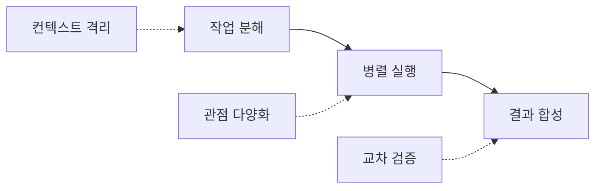
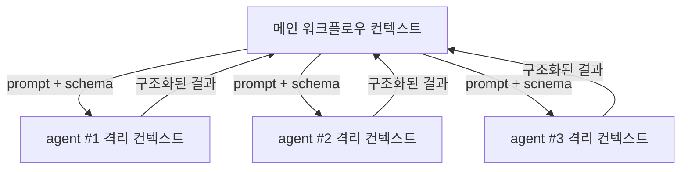
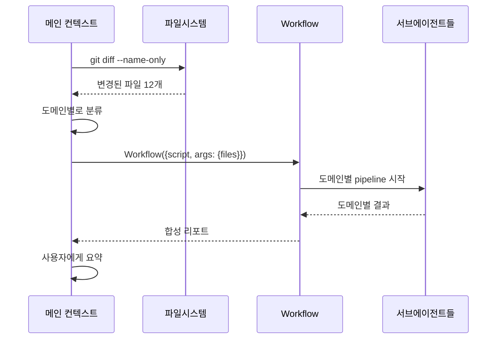

# Claude Code 오케스트레이션

Claude Code를 한 세션에서 쓰다 보면 금방 한계에 부딪힌다. 코드베이스 전체를 훑어달라고 하면 컨텍스트가 터지고, 검토를 시켜도 한 가지 관점에서만 본다. 버그 헌팅을 부탁하면 그럴듯한데 사실은 아닌 발견을 들고 오기도 한다. 이 문제들은 단일 에이전트의 본질적인 한계다.

오케스트레이션은 작업을 여러 에이전트로 쪼개서 처리하는 방법이다. 컨텍스트를 격리하고, 관점을 분산하고, 결과를 교차 검증하는 식이다. 단순히 "병렬로 빠르게"가 아니라, **하나의 컨텍스트로는 신뢰할 수 없는 결과를 여러 컨텍스트로 신뢰 가능하게 만드는 것**이 본질이다.

이 문서는 Workflow 도구를 중심으로 실전에서 쓰이는 패턴을 다룬다. Agent SDK로 직접 구성하는 방법은 [Claude Code Agent](Claude_Code_Agent.md) 문서를 참고해라. [Worktree](Claude_Code_Worktree.md), [Long Job](Claude_Code_Long_Job.md), [Routine](Claude_Code_Routine.md) 문서와 함께 보면 좋다.

---

## 1. 왜 오케스트레이션이 필요한가

단일 에이전트로 처리하면 안 되는 작업이 있다. 처음부터 안 되는 게 아니라, 결과를 믿을 수 없는 작업이라는 말이다.

### 단일 에이전트가 실패하는 지점

세 가지 상황에서 단일 에이전트는 부실한 결과를 낸다.

**컨텍스트가 부족할 때.** 50개 파일을 다 읽고 종합 판단을 내려야 하는데, 한 세션에서 다 읽으면 컨텍스트 윈도우의 70%가 코드로 차버린다. 남은 30%로 분석과 답변을 짜내다 보니 어딘가에서 빼먹는다. 사람이 100페이지 책을 한 번에 다 외워서 요약하는 거랑 비슷하다.

**관점이 편향될 때.** "이 코드에 버그가 있어?"라고 묻는 순간, 에이전트는 버그를 찾는 모드로 들어간다. "이 설계가 맞아?"라고 물으면 설계 관점에서만 본다. 한 가지 프롬프트는 한 가지 렌즈를 의미한다. 보안과 성능과 가독성을 모두 보려면 모두를 한 번에 물어야 하는데, 그러면 어느 쪽도 깊게 못 본다.

**검증이 없을 때.** 에이전트가 "이 부분에 race condition이 있다"고 말해도 그게 사실인지는 확실하지 않다. 그럴듯한 코드를 봤기 때문에 그럴듯하게 답한 거다. 같은 에이전트한테 "정말 맞아?"라고 다시 물어봐도 자기 합리화만 한다. 다른 에이전트가 적대적으로 반박해야 검증이 된다.

### 오케스트레이션의 세 가지 원칙



**컨텍스트 격리.** 각 에이전트는 자기 작업에 필요한 파일만 읽는다. 메인 컨텍스트는 결과 데이터만 받는다. 50개 파일을 5개 에이전트가 10개씩 나눠 읽고 요약본만 올린다.

**관점 다양화.** 같은 코드를 보고도 "성능 관점", "보안 관점", "가독성 관점"으로 서로 다른 에이전트가 본다. 한 에이전트한테 세 관점을 다 시키는 것보다 결과가 깊다.

**교차 검증.** 한 에이전트가 발견한 걸 다른 에이전트가 반박을 전제로 검증한다. 살아남은 것만 신뢰한다.

---

## 2. Workflow 도구의 모델

Workflow는 결정적인 제어 흐름으로 여러 서브에이전트를 묶는 스크립트 실행기다. 핵심은 두 가지다. 첫째, **스크립트가 결정적**이다. 루프, 조건문, 분기는 JavaScript 코드로 명시한다. 모델이 다음 단계를 정하는 게 아니다. 둘째, **각 `agent()` 호출이 새 컨텍스트**다. 호출 간에 데이터를 넘기는 방법은 반환값뿐이다.

### 스크립트의 모양

```javascript
export const meta = {
  name: 'review-changes',
  description: '코드 변경사항을 다각도로 리뷰',
  phases: [
    { title: 'Review', detail: '관점별 리뷰' },
    { title: 'Verify', detail: '발견 사항 검증' },
  ],
}

phase('Review')
const findings = await agent('보안 관점에서 git diff를 리뷰해줘.', {
  schema: FINDINGS_SCHEMA,
})

phase('Verify')
const verified = await parallel(
  findings.items.map((f) => () =>
    agent(`이 발견이 진짜인지 반박해봐: ${f.title}`, { schema: VERDICT_SCHEMA })
  )
)

return { findings, verified }
```

`meta`는 반드시 순수 리터럴이어야 한다. 변수나 함수 호출을 넣으면 검증에서 막힌다. `phase()`는 진행 상황을 그룹핑하는 용도이고, 본격적인 실행 로직은 `agent()`, `pipeline()`, `parallel()`이다.

### 글로벌 도구의 역할

| 도구 | 용도 | 반환 |
|---|---|---|
| `agent(prompt, opts)` | 서브에이전트 호출 | 텍스트 또는 schema 적용 시 검증된 객체 |
| `parallel(thunks)` | N개 작업 동시 실행, 모두 끝날 때까지 대기 | 결과 배열 (실패는 null) |
| `pipeline(items, ...stages)` | 각 아이템을 단계별로 흘려보냄, 단계 간 배리어 없음 | 마지막 단계 결과 배열 |
| `phase(title)` | 진행 그룹 표시 | 없음 |
| `log(message)` | 사용자에게 진행 메시지 | 없음 |
| `args` | Workflow 호출 시 전달한 인자 | 입력값 |
| `budget` | 토큰 예산 정보 | `{total, spent(), remaining()}` |

`agent()`에 `schema`를 넘기면 서브에이전트가 구조화된 출력을 강제로 반환한다. 정규식으로 텍스트 파싱하는 짓을 안 해도 된다. `model`을 명시하면 그 호출만 다른 모델로 돌릴 수 있는데, 평소엔 생략하고 메인 모델을 그대로 쓰는 게 낫다.



메인 컨텍스트는 서브에이전트가 읽은 코드를 보지 않는다. 반환된 데이터만 본다. 컨텍스트가 한 번에 터지는 문제가 사라지는 이유다.

---

## 3. pipeline과 parallel의 결정적 차이

오케스트레이션을 처음 짤 때 가장 많이 틀리는 부분이다. 둘 다 "동시에 돌린다"는 점은 같지만, 동작이 완전히 다르다.

### parallel: 배리어가 있다

`parallel()`은 N개 작업을 동시에 시작하고, **전부 끝날 때까지 대기한다**. 가장 느린 작업이 끝나야 다음 코드로 넘어간다.

```javascript
const results = await parallel([
  () => agent('A 분석', { schema: S }),
  () => agent('B 분석', { schema: S }),
  () => agent('C 분석', { schema: S }),
])
// 여기 도달 시점 = A, B, C 중 가장 느린 게 끝난 시점
const merged = mergeAll(results.filter(Boolean))
```

A가 30초, B가 10초, C가 15초 걸리면 30초 대기다. B와 C가 일찍 끝나도 다음 단계로 못 간다. 모든 결과를 한꺼번에 보고 판단해야 할 때만 이 배리어가 정당화된다.

### pipeline: 배리어가 없다

`pipeline()`은 각 아이템을 모든 단계에 독립적으로 흘려보낸다. **아이템 A가 3단계를 돌고 있을 때 아이템 B는 1단계에 있을 수 있다.**

```javascript
const results = await pipeline(
  ['A', 'B', 'C'],
  (item) => agent(`${item} 1단계`, { schema: S1 }),
  (r1) => agent(`결과 받아서 2단계: ${r1.summary}`, { schema: S2 }),
  (r2) => agent(`최종 3단계: ${r2.summary}`, { schema: S3 })
)
```

가장 빠른 아이템부터 3단계 결과가 나온다. 전체 wall clock은 "가장 느린 단일 체인"이다. parallel 방식으로 각 단계마다 배리어를 걸면 "각 단계의 가장 느린 작업을 모두 더한 시간"이 된다.

### 시각화하면

```mermaid
gantt
    title parallel: 각 단계마다 배리어
    dateFormat X
    axisFormat %s
    section Stage 1
    A1 :0, 10
    B1 :0, 8
    C1 :0, 12
    section Stage 2
    A2 :12, 18
    B2 :12, 14
    C2 :12, 20
```

```mermaid
gantt
    title pipeline: 배리어 없음
    dateFormat X
    axisFormat %s
    section Item A
    A1 :0, 10
    A2 :10, 16
    section Item B
    B1 :0, 8
    B2 :8, 10
    section Item C
    C1 :0, 12
    C2 :12, 20
```





같은 작업인데 parallel은 20초 끝, pipeline은 20초 끝 — 이 케이스는 비슷해 보이지만 데이터의 분산이 클수록 차이가 커진다. 1단계가 5초~60초로 분산되어 있다면 parallel은 항상 60초를 기다린다.

### 어느 쪽을 선택할까

**기본은 pipeline이다.** 배리어가 필요한 경우는 좁다.

배리어가 정당화되는 경우는 다음 셋 중 하나다.

1. **전수 합쳐서 dedup이 필요할 때.** 5개 발견 에이전트가 각자 발견한 버그 중 중복을 제거하고 나서야 검증을 시작할 수 있다.
2. **개수 기반 조기 종료가 필요할 때.** "0건이면 검증 단계 통째로 스킵"같은 분기가 다음 단계 진입 전에 필요하다.
3. **다음 단계 프롬프트가 "다른 결과들"을 참조할 때.** "다른 발견과 비교해서 이게 더 심각한가?" 같은 질문은 모든 결과가 있어야 한다.

다음과 같은 이유로 배리어를 선택하면 보통 잘못된 선택이다.

- "flatten/map/filter가 먼저 필요해서" — 파이프라인 단계 안에서 처리하면 된다
- "단계가 개념적으로 분리되어 있어서" — 단계 분리는 pipeline이 이미 표현한다
- "코드가 깔끔해 보여서" — 배리어 지연은 실제 비용이다

### 안티패턴 한 가지

```javascript
// 잘못된 패턴
const a = await parallel(items.map((i) => () => agent(`stage1: ${i}`)))
const b = a.map((r) => transform(r))  // 단순 변환, 항목 간 의존 없음
const c = await parallel(b.map((x) => () => agent(`stage2: ${x}`)))
```

중간의 `transform`은 항목별로 독립적이다. 배리어가 필요 없다. pipeline으로 바꾼다.

```javascript
const c = await pipeline(
  items,
  (i) => agent(`stage1: ${i}`),
  (r) => agent(`stage2: ${transform(r)}`)
)
```

---

## 4. Fan-out과 Judge Panel 패턴

한 문제에 여러 접근을 동시에 시도하고, 그중 좋은 걸 골라내는 패턴이다. 코드 설계, 리팩토링 방안, API 인터페이스 결정처럼 정답이 하나가 아닌 문제에서 쓴다.

### 단순 fan-out

```javascript
// 같은 작업을 N명한테 독립적으로 시켜서 다양성 확보
const proposals = await parallel(
  Array.from({ length: 3 }, (_, i) => () =>
    agent(
      `다음 요구사항에 맞는 API 설계안을 제시해줘. 다른 사람과 겹치지 않게 너만의 접근으로:
요구사항: ${requirement}
제안 번호 #${i + 1}`,
      { schema: PROPOSAL_SCHEMA }
    )
  )
)
```

번호를 프롬프트에 넣는 게 의도적이다. `Math.random()`이나 `Date.now()`가 Workflow 스크립트에서 막혀 있어서, 다양성을 만들려면 인덱스로 프롬프트를 변형시켜야 한다.

### Judge Panel: 다른 에이전트가 평가

생성과 평가를 분리하면 품질이 올라간다. 생성한 에이전트는 자기 결과물에 편향된다. 평가는 처음 보는 다른 에이전트가 해야 한다.

```javascript
export const meta = {
  name: 'design-with-judges',
  description: '여러 설계안을 생성하고 심사단이 평가',
  phases: [
    { title: 'Propose' },
    { title: 'Judge' },
    { title: 'Synthesize' },
  ],
}

const ANGLES = ['단순함 우선', '확장성 우선', '성능 우선']
const CRITERIA = ['유지보수성', '확장성', '구현 난이도']

phase('Propose')
const proposals = await parallel(
  ANGLES.map((angle) => () =>
    agent(`${angle} 관점에서 ${args.problem}의 설계안을 만들어줘.`, {
      label: `propose:${angle}`,
      schema: PROPOSAL_SCHEMA,
    })
  )
)
const valid = proposals.filter(Boolean)

phase('Judge')
const scored = await parallel(
  valid.map((p, idx) => () =>
    parallel(
      CRITERIA.map((c) => () =>
        agent(
          `다음 설계안을 ${c} 기준으로 0-10점 평가하고 근거를 써줘:
${JSON.stringify(p)}`,
          { label: `judge:${idx}:${c}`, schema: SCORE_SCHEMA }
        )
      )
    ).then((scores) => ({
      proposal: p,
      scores: scores.filter(Boolean),
      total: scores.filter(Boolean).reduce((s, x) => s + x.score, 0),
    }))
  )
)

phase('Synthesize')
const ranked = scored.filter(Boolean).sort((a, b) => b.total - a.total)
const winner = ranked[0]
const synthesis = await agent(
  `1위 안을 기반으로 하되, 2-3위 안의 좋은 아이디어를 통합한 최종안을 만들어줘:
1위: ${JSON.stringify(winner)}
2-3위: ${JSON.stringify(ranked.slice(1, 3))}`,
  { schema: PROPOSAL_SCHEMA }
)

return { winner, synthesis, allRanked: ranked }
```

이 패턴의 핵심은 **합성 단계가 1위를 그대로 채택하지 않는다**는 것이다. 1위가 놓친 부분 중 2-3위가 잡은 게 있다. 합성 에이전트가 그걸 통합한다.

### Fan-out을 안 써야 할 때

답이 명확한 작업에는 fan-out이 낭비다. "이 함수의 타입 시그니처가 뭐야?" 같은 사실 질문이나, "이 import를 삭제해줘" 같은 단순 명령에는 한 명만 부르면 된다. fan-out은 해석의 여지가 있는 작업에서만 효과를 본다.

토큰 사용량도 N배가 된다. 1주일에 30번 돌리는 자동화 파이프라인에 3-way fan-out을 박으면 비용이 3배다. 가치가 있는지 먼저 따져야 한다.

---

## 5. 어드버서리얼 검증

LLM이 "이게 버그다"라고 자신 있게 말해도 절반은 거짓이다. 그럴듯한 패턴을 봤기 때문에 그럴듯하게 답한 것뿐이다. 같은 에이전트한테 "확실해?"라고 물어도 합리화한다. 다른 컨텍스트의 에이전트가 **반박을 전제로** 검증해야 한다.

### 기본 구조

```javascript
async function adversarialVerify(claim) {
  const N = 3  // 심사관 수
  const votes = await parallel(
    Array.from({ length: N }, () => () =>
      agent(
        `다음 주장을 반박해봐. 의심스러우면 기본값은 "반박됨"이다. 확실한 증거가 있을 때만 "맞다"고 판단해라.

주장: ${claim.description}
근거 코드: ${claim.evidence}

판단과 이유를 제출해라.`,
        { schema: VERDICT_SCHEMA }
      )
    )
  )

  const survives = votes.filter(Boolean).filter((v) => !v.refuted).length >= 2
  return { claim, survives, votes }
}
```

세 가지 디자인 결정이 핵심이다.

**프롬프트가 반박을 디폴트로 설정한다.** "검증해줘"가 아니라 "반박해봐, 의심스러우면 반박이다"라고 시킨다. 에이전트가 어조에 맞춰 비판적으로 본다.

**다수결로 결정한다.** 3명 중 2명이 반박하면 그 주장은 죽는다. 한 명이 우연히 맞춰버리는 경우를 차단한다.

**같은 컨텍스트가 아니다.** 각 `agent()` 호출은 새 컨텍스트다. 첫 번째 심사관의 판단이 두 번째에 영향을 주지 않는다.

### 관점 다양화 검증

같은 질문을 N명한테 묻는 것보다, **다른 관점의 N명한테 묻는** 게 더 강하다. 한 주장이 실패할 수 있는 방식은 여러 가지다.

```javascript
const LENSES = [
  { key: 'correctness', prompt: '논리적으로 정말 버그인가, 아니면 의도된 동작인가?' },
  { key: 'reproducibility', prompt: '실제로 재현할 수 있는 조건이 있는가? 단순한 정적 패턴인가?' },
  { key: 'impact', prompt: '터지면 영향이 있는가, 아니면 무해한가?' },
]

async function multiLensVerify(claim) {
  const verdicts = await parallel(
    LENSES.map((lens) => () =>
      agent(
        `다음 주장을 "${lens.key}" 관점에서 검증해줘. 질문: ${lens.prompt}

주장: ${claim.description}
근거: ${claim.evidence}

이 관점에서 봤을 때 주장이 살아남는지 판단하고 근거를 써라.`,
        { schema: VERDICT_SCHEMA }
      )
    )
  )

  // 한 관점이라도 무너지면 발견을 죽인다
  const valid = verdicts.filter(Boolean)
  const survives = valid.every((v) => !v.refuted)
  return { claim, survives, verdicts: valid }
}
```

`every`로 거는 게 보통이다. 한 관점이라도 무너지면 신뢰할 수 없다는 의미다. 더 너그러운 기준이면 `filter(v => !v.refuted).length >= 2` 같은 식으로 쓰면 된다.

### 발견-검증을 pipeline으로

발견과 검증을 parallel로 묶으면 모든 발견이 끝날 때까지 검증이 못 시작한다. pipeline이면 발견 하나가 나오는 순간 그 발견의 검증이 시작된다.

```javascript
phase('Review')
const REVIEWERS = [
  { key: 'bugs', prompt: '버그 후보를 찾아줘' },
  { key: 'perf', prompt: '성능 문제를 찾아줘' },
  { key: 'security', prompt: '보안 문제를 찾아줘' },
]

const results = await pipeline(
  REVIEWERS,
  // 1단계: 리뷰
  (reviewer) =>
    agent(reviewer.prompt, {
      label: `review:${reviewer.key}`,
      phase: 'Review',
      schema: FINDINGS_SCHEMA,
    }),
  // 2단계: 각 발견을 검증 (리뷰 끝나는 즉시 시작)
  (review) =>
    parallel(
      review.findings.map((f) => () =>
        agent(
          `다음 발견을 반박하라. 의심스러우면 반박이다: ${JSON.stringify(f)}`,
          {
            label: `verify:${f.file}:${f.line}`,
            phase: 'Verify',
            schema: VERDICT_SCHEMA,
          }
        ).then((v) => ({ ...f, verdict: v }))
      )
    )
)

// 검증을 통과한 것만 남김
const confirmed = results
  .flat()
  .filter(Boolean)
  .filter((f) => f.verdict && !f.verdict.refuted)

return { confirmed }
```

'bugs' 리뷰가 끝나면 그 발견들이 검증으로 들어간다. 'perf' 리뷰는 아직 돌고 있을 수 있다. 'bugs' 검증이 끝날 때쯤이면 'perf' 발견도 와서 바로 검증으로 들어간다.

---

## 6. 발견 누적과 Loop-Until-Dry

코드베이스에서 버그를 찾는 작업은 끝이 정해져 있지 않다. "10개 찾아라"는 임의의 숫자다. **새로 발견되는 게 없을 때까지** 도는 패턴이 더 현실적이다.

### 기본 패턴

```javascript
export const meta = {
  name: 'exhaustive-bug-hunt',
  description: '버그가 더 안 나올 때까지 반복 탐색',
  phases: [{ title: 'Find' }, { title: 'Verify' }],
}

const FINDERS = [
  { key: 'by-file', prompt: '디렉토리별로 훑으면서 버그를 찾아줘' },
  { key: 'by-symbol', prompt: '함수 단위로 검토하면서 버그를 찾아줘' },
  { key: 'by-flow', prompt: '데이터 흐름을 따라가면서 버그를 찾아줘' },
]

const seen = new Set()
const confirmed = []
let dryRounds = 0

const key = (b) => `${b.file}:${b.line}:${b.title}`

while (dryRounds < 2) {
  log(`라운드 시작 (확정 ${confirmed.length}개, dry ${dryRounds}/2)`)

  // 1단계: 다각도 탐색 — 이번 라운드 결과 합치려고 배리어 사용
  const found = (
    await parallel(
      FINDERS.map((f) => () =>
        agent(
          `${f.prompt}
이미 발견된 것들 (다시 찾지 마라): ${[...seen].slice(0, 50).join('\n')}`,
          { phase: 'Find', label: `find:${f.key}`, schema: BUGS_SCHEMA }
        )
      )
    )
  )
    .filter(Boolean)
    .flatMap((r) => r.bugs)

  const fresh = found.filter((b) => !seen.has(key(b)))

  if (fresh.length === 0) {
    dryRounds += 1
    continue
  }

  dryRounds = 0
  fresh.forEach((b) => seen.add(key(b)))

  // 2단계: 어드버서리얼 검증
  const verified = await parallel(
    fresh.map((b) => () =>
      parallel(
        ['correctness', 'repro', 'impact'].map((lens) => () =>
          agent(`${lens} 관점에서 반박하라: ${b.description}`, {
            phase: 'Verify',
            schema: VERDICT_SCHEMA,
          })
        )
      ).then((votes) => {
        const valid = votes.filter(Boolean)
        const survives = valid.filter((v) => !v.refuted).length >= 2
        return { bug: b, survives }
      })
    )
  )

  confirmed.push(
    ...verified.filter(Boolean).filter((v) => v.survives).map((v) => v.bug)
  )
}

return { confirmed, totalSeen: seen.size }
```

### 중요한 디테일 두 가지

**dedup은 `seen`이 아니라 `confirmed`로 하면 안 된다.** 검증에서 떨어진 것도 다음 라운드에 또 발견되면 또 검증하게 된다. 영원히 끝나지 않는다. 검증을 통과 못 했어도 "이미 봤다"는 표시는 남겨야 한다.

**dry round를 2회 이상으로 잡는다.** 1회면 우연히 같은 발견이 나오는 라운드 하나로 끝나버린다. 2-3회는 봐야 진짜로 더 나올 게 없다고 판단할 수 있다.

### 토큰 예산으로 깊이 조절

사용자가 "+500k" 같은 예산 디렉티브를 줬다면 그에 맞춰 깊이를 조절하는 패턴이다.

```javascript
while (budget.total && budget.remaining() > 50_000) {
  // ... 한 라운드 ...
  log(`${confirmed.length}건 확정, ${Math.round(budget.remaining() / 1000)}k 남음`)
}
```

`budget.total`을 가드로 거는 게 중요하다. 예산을 안 줬으면 `remaining()`이 `Infinity`라서 1000-에이전트 한계까지 무한 루프 돈다.

---

## 7. 다층 합성 패턴

발견-검증으로 끝나는 게 아니라, 검증된 결과를 다시 종합해서 결론을 내는 작업이다. 코드베이스 감사, 마이그레이션 계획 수립, 아키텍처 평가에서 쓴다.

### 3단 구조: 발견 → 검증 → 합성

```javascript
export const meta = {
  name: 'codebase-audit',
  description: '코드베이스 감사 — 발견, 검증, 합성',
  phases: [
    { title: 'Discover' },
    { title: 'Verify' },
    { title: 'Synthesize' },
  ],
}

phase('Discover')
const DOMAINS = ['auth', 'payment', 'notification', 'user']
const discoveries = await pipeline(
  DOMAINS,
  // 1단계: 도메인별 탐색
  (domain) =>
    agent(`src/${domain}/ 디렉토리를 감사하고 개선점을 찾아줘.`, {
      label: `discover:${domain}`,
      schema: AUDIT_SCHEMA,
    }),
  // 2단계: 검증
  (audit, domain) =>
    parallel(
      audit.findings.map((f) => () =>
        agent(
          `다음 발견을 반박하라. 의심스러우면 반박이다: ${JSON.stringify(f)}`,
          { label: `verify:${domain}:${f.id}`, schema: VERDICT_SCHEMA }
        ).then((v) => ({ ...f, domain, verdict: v }))
      )
    )
)

const confirmed = discoveries
  .flat()
  .filter(Boolean)
  .filter((f) => f.verdict && !f.verdict.refuted)

phase('Synthesize')
// 합성: 확정된 발견을 도메인 횡단 관점에서 묶음
const report = await agent(
  `다음은 도메인별 감사 결과다. 도메인을 횡단하는 패턴이 있는지, 우선순위를 어떻게 잡을지 종합 리포트를 작성해라.

${JSON.stringify(confirmed, null, 2)}`,
  { schema: REPORT_SCHEMA }
)

return { confirmed, report }
```

### 합성 단계가 빠지면 어떻게 되나

검증된 발견을 그대로 출력해버리면 사용자가 100개 발견을 직접 읽고 우선순위를 매겨야 한다. 합성 에이전트는 그 작업을 대신한다. "auth와 payment에 같은 종류의 race condition이 보인다. 공통 원인은 락 획득 순서 불일치다." 같은 메타 관찰을 만든다.

이 합성 단계는 한 명만 부른다. 합성은 여러 명이 해도 결과가 비슷해서 fan-out 가치가 낮다. 합성 결과의 신뢰도가 중요하면 합성을 두 명한테 시키고 합치는 것보다, 합성 결과를 다른 에이전트가 검증하는 게 낫다.

---

## 8. Hybrid: 인라인 스카우팅 + Workflow

Workflow를 호출하기 전에 메인 컨텍스트에서 정찰을 먼저 하는 패턴이다. 어떤 파일이 변경됐는지, 어떤 모듈을 봐야 하는지를 정해야 그다음 fan-out이 의미를 갖는다.

### 흐름



메인 컨텍스트가 "무엇을 fan-out 할지"를 결정하고, Workflow가 "결정된 작업을 어떻게 분배할지"를 결정한다. 두 책임이 분리된다.

### 코드 예

메인 측에서는 다음과 같이 호출한다.

```typescript
// 메인 컨텍스트
import { execSync } from 'child_process'

const changedFiles = execSync('git diff --name-only main...HEAD', { encoding: 'utf-8' })
  .split('\n')
  .filter(Boolean)

const grouped = groupByDomain(changedFiles)

// Workflow 호출 — args로 그룹 전달
const result = await Workflow({
  script: WORKFLOW_SCRIPT,
  args: { groups: grouped, baseBranch: 'main' },
})
```

Workflow 스크립트는 `args`를 받아서 동작한다.

```javascript
// 워크플로우 스크립트
const { groups, baseBranch } = args

const results = await pipeline(
  Object.entries(groups),
  ([domain, files]) =>
    agent(
      `${baseBranch} 대비 변경된 ${domain} 도메인 파일들을 리뷰해라:
${files.join('\n')}`,
      { label: `review:${domain}`, schema: FINDINGS_SCHEMA }
    ),
  // ... 검증, 합성 단계 ...
)

return results
```

이 방식의 장점은 **스카우팅을 너무 많이 안 시키게 된다**는 것이다. fan-out 깊이를 데이터 크기에 맞춰 조절할 수 있다. 변경 파일이 3개면 fan-out을 안 쓰고, 30개면 도메인별로 쓰는 식이다.

---

## 9. 격리가 필요할 때: Worktree

여러 에이전트가 같은 파일을 동시에 수정하면 충돌한다. `agent()`에 `isolation: 'worktree'`를 주면 각 에이전트가 별도의 git worktree에서 돈다. 디스크 사본이 만들어진다.

```javascript
const refactors = await parallel(
  packages.map((pkg) => () =>
    agent(
      `${pkg} 패키지의 console.log를 logger로 교체해라. 끝나면 git add -A && git commit 해라.`,
      {
        label: `refactor:${pkg}`,
        isolation: 'worktree',  // 각자 격리된 worktree
      }
    )
  )
)
```

비용을 알고 써야 한다. worktree 생성에 200-500ms와 디스크 공간이 들어간다. 에이전트가 파일을 수정하지 않고 끝나면 자동 정리된다. 수정이 있으면 worktree 경로와 브랜치가 반환되고, 사용자가 머지하거나 버린다.

쓰지 말아야 할 경우는 분명하다. 읽기만 하는 에이전트한테는 격리가 낭비다. 모든 에이전트가 다른 파일만 만진다고 보장되면 격리가 없어도 된다. 같은 파일을 수정할 가능성이 있을 때만 격리한다.

자세한 worktree 운영은 [Claude Code Worktree](Claude_Code_Worktree.md) 문서에 있다.

---

## 10. 중첩과 재사용: workflow() 호출

스크립트 안에서 다른 Workflow를 호출할 수 있다. 큰 작업을 단계로 쪼개고, 각 단계가 다시 Workflow인 구성이다.

```javascript
export const meta = {
  name: 'orchestrate-release',
  description: '릴리스 준비 전체 흐름',
  phases: [{ title: 'Audit' }, { title: 'Fix' }, { title: 'Verify' }],
}

phase('Audit')
const audit = await workflow('codebase-audit', { branch: 'release' })

phase('Fix')
const fixes = await pipeline(
  audit.confirmed,
  (finding) =>
    agent(`다음 발견을 수정해라: ${JSON.stringify(finding)}`, {
      isolation: 'worktree',
      schema: FIX_SCHEMA,
    })
)

phase('Verify')
const verification = await workflow('verify-fixes', { fixes })

return { audit, fixes, verification }
```

제한사항이 있다. **중첩은 한 단계까지만** 허용된다. `workflow()` 안의 스크립트에서 또 `workflow()`를 부르면 에러다. 깊이 더 들어가야 하는 구조면 메인 컨텍스트에서 순차적으로 Workflow를 여러 번 부르는 게 맞다.

자식 워크플로우는 부모의 동시성 한도, 에이전트 카운터, 토큰 예산을 공유한다. 자식이 100개 에이전트를 쓰면 부모의 1000개 한도에서 100개를 깎는다.

---

## 11. 실패 모드와 디버깅

오케스트레이션 스크립트의 버그는 단일 에이전트보다 찾기 어렵다. 분기가 많고, 비결정적 요소가 섞여 있다.

### 가장 흔한 세 가지 실수

**`parallel`의 실패 처리를 안 한다.** thunk가 던진 에러는 결과 배열에서 `null`로 나온다. `.filter(Boolean)` 없이 다음 단계로 넘어가면 `null`을 `JSON.stringify` 하다가 의미 없는 결과가 나오거나, 다음 에이전트한테 `null`을 프롬프트로 던지게 된다.

```javascript
const results = await parallel(items.map((i) => () => agent(`...`, { schema: S })))
const valid = results.filter(Boolean)  // 항상 거른다
```

**같은 phase 이름을 동시 실행 안에서 쓴다.** `phase()`는 글로벌 상태를 바꾼다. `parallel` 안에서 `phase()`를 호출하면 경합이 생긴다. 대신 `agent()`의 `phase` 옵션으로 그룹을 명시한다.

```javascript
// 잘못
await parallel(items.map((i) => async () => {
  phase('Verify')  // 경합!
  return agent(`...`)
}))

// 맞음
await parallel(items.map((i) => () =>
  agent(`...`, { phase: 'Verify' })
))
```

**누락된 작업을 조용히 숨긴다.** "상위 10개만 검증"같은 캡을 두면, 11번째부터는 검증 없이 누락된다. 사용자는 "전부 검증했다"고 받아들인다. 캡을 두는 게 정당하면 반드시 `log()`로 명시한다.

```javascript
const TOP_N = 10
if (findings.length > TOP_N) {
  log(`발견 ${findings.length}건 중 상위 ${TOP_N}건만 검증. 나머지 ${findings.length - TOP_N}건은 미검증.`)
}
const top = findings.slice(0, TOP_N)
```

### Resume로 반복 개발

스크립트를 만지면서 디버깅할 때, 매번 처음부터 다시 도는 건 비용이 크다. Workflow는 `resumeFromRunId`로 이전 실행의 캐시된 결과를 재사용한다. 수정 안 한 prefix는 즉시 반환되고, 수정한 호출부터 다시 실행된다.

```typescript
// 첫 실행
const run1 = await Workflow({ script, args })
// run1.runId 기억

// 스크립트 일부 수정 후
const run2 = await Workflow({
  scriptPath: run1.scriptPath,  // 같은 스크립트 파일
  args,
  resumeFromRunId: run1.runId,
})
```

이 캐싱이 동작하려면 비결정적 요소가 없어야 한다. `Date.now()`, `Math.random()`, 인자 없는 `new Date()`가 스크립트에서 막혀 있는 이유가 이거다. 시간이 필요하면 `args`로 받아와라.

---

## 12. 언제 오케스트레이션을 안 써야 하나

다 좋아 보이지만, 단순한 작업에 오케스트레이션을 끼우는 건 비용 낭비다. 다음 경우에는 단일 세션으로 끝내는 게 맞다.

**한 파일 안에서 끝나는 작업.** 함수 시그니처 변경, 변수명 리팩토링, 타입 추가 같은 거다. 컨텍스트가 모자라지도 않고 관점도 하나면 충분하다.

**사실 질문.** "이 코드에서 X는 어디서 import 되나" 같은 건 grep 한 번이면 끝난다. fan-out 할 게 없다.

**사용자가 진행을 확인하면서 가는 작업.** 대화형 디버깅, 단계별 설명, 사용자 피드백을 받으며 방향을 조정하는 작업은 단일 세션이 낫다. Workflow는 배경 실행 모델이라 중간에 끼어들기가 불편하다.

**비용을 감당 못 할 때.** 3-way fan-out에 3-vote 검증을 걸면 단순 계산으로 9배 토큰이 든다. 매 PR마다 도는 자동화면 비용이 누적된다. 가치-비용을 따져야 한다.

판단 기준은 단순하다. "한 세션에서 답이 나오는데 그 답을 믿을 수 없다"는 느낌이 들면 그때 오케스트레이션이다.

---

## 정리

오케스트레이션의 본질은 **신뢰할 수 없는 단일 출력을 신뢰할 수 있는 합성 출력으로 바꾸는 것**이다. 속도는 부차적인 효과다.

세 가지 패턴이 90%의 케이스를 커버한다.

- **pipeline**: 발견-검증 흐름의 기본. 단계 간 배리어 없이 흘려보낸다.
- **fan-out + judge panel**: 정답이 하나가 아닌 문제. 다른 접근을 만들고 다른 에이전트가 평가한다.
- **어드버서리얼 검증**: 발견이 진짜인지 다른 컨텍스트가 반박을 전제로 검토한다.

처음부터 복잡한 그래프를 짜지 마라. pipeline 두 단계로 시작해서, 결과가 못 미더우면 검증 단계를 어드버서리얼로 바꾸고, 발견이 단조로우면 fan-out을 도입하는 식으로 한 단계씩 늘려가는 게 맞다. 디버깅 비용이 폭증하기 전에 멈춰야 한다.

---

## 참고

- [Claude Code 메인 문서](Claude_Code.md)
- [Claude Code Agent](Claude_Code_Agent.md) — 서브에이전트의 정의와 라이프사이클
- [Claude Code Worktree](Claude_Code_Worktree.md) — worktree 격리 운영
- [Claude Code Long Job](Claude_Code_Long_Job.md) — 장시간 작업 운영
- [Claude Code Routine](Claude_Code_Routine.md) — 스케줄링과 자동화
- [Claude Code 공식 문서](https://docs.anthropic.com/en/docs/claude-code)
