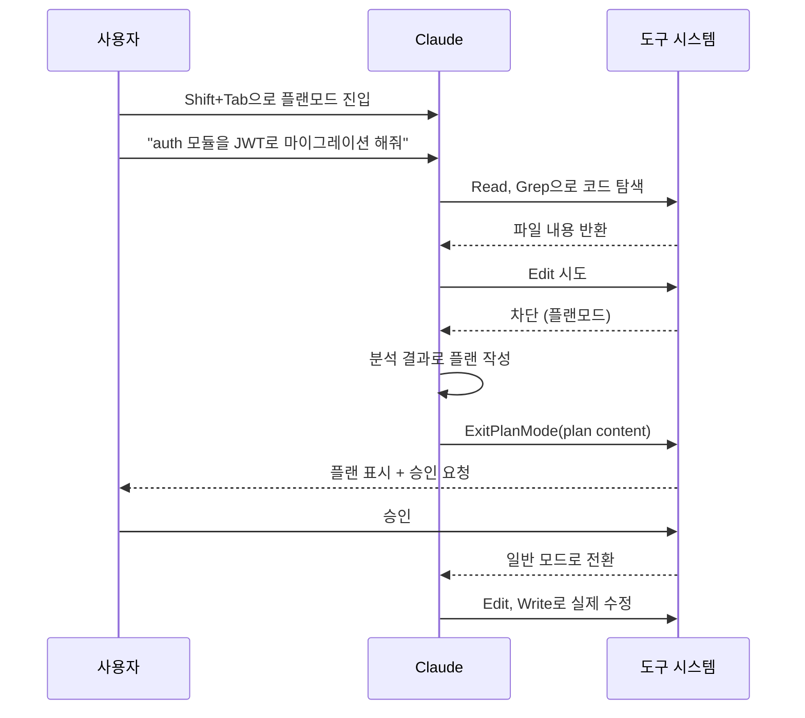

# Claude Code 플랜모드 실전 활용

Claude Code에서 가장 저평가된 기능이 플랜모드(Plan Mode)다. 하나 작업할 거면 그냥 시키는 게 빠르지만, 파일 30개를 건드리는 리팩토링이나 마이그레이션을 시킬 때 플랜모드를 건너뛰면 거의 매번 후회한다. 작업 도중에 방향이 어긋난 걸 뒤늦게 발견하면 롤백도 어렵고, 이미 수정된 파일들을 일일이 되돌려야 한다.

이 문서는 플랜모드가 내부적으로 어떻게 동작하는지, 그리고 실무에서 어떤 작업에 써야 효과를 보는지 정리한다.

---

## 1. 플랜모드가 뭔가

플랜모드는 "코드를 건드리기 전에 무엇을 어떻게 할지 먼저 설계한다"는 한 줄로 요약된다. 일반 모드에서 Claude에게 "auth 모듈을 JWT 기반으로 바꿔달라"고 하면 바로 파일을 수정하기 시작한다. 플랜모드에서 같은 요청을 하면 파일을 읽고 분석한 뒤 단계별 실행 계획을 산출물로 내놓는다. 사용자가 그 계획을 검토하고 승인해야 비로소 일반 모드로 전환되어 실제 수정에 들어간다.

내부적으로는 두 개의 도구가 이 과정을 담당한다.

- `EnterPlanMode`: 플랜모드 진입. 이후 모든 쓰기 도구(Edit, Write, NotebookEdit, Bash 중 상태 변경 명령 등)가 차단된다
- `ExitPlanMode`: 작성한 플랜을 사용자에게 제시하고 승인을 받는다. 승인하면 플랜모드가 해제되고 일반 모드로 돌아간다

쓰기 도구가 차단되어 있으니까 플랜모드에서 Claude가 할 수 있는 건 Read, Grep, Glob, WebFetch, WebSearch 같은 읽기 전용 작업뿐이다. 이 제약 덕분에 "계획만 세우고 코드는 안 건드린다"가 강제된다.

---

## 2. 진입하는 방법

진입 방법은 세 가지다.

### 2.1 Shift+Tab으로 모드 전환

가장 흔하게 쓰는 방법이다. Claude Code 입력창에서 Shift+Tab을 누르면 모드가 순환한다.

```
Normal Mode → Auto-Accept Mode → Plan Mode → Normal Mode → ...
```

현재 모드는 입력창 하단에 표시된다. `⏵⏵ plan mode on`처럼 나오면 진입된 상태다.

### 2.2 슬래시 명령어

`/plan` 명령어로도 진입할 수 있다. 키보드보다 명령어가 익숙하다면 이쪽이 편하다.

### 2.3 시작 옵션

처음부터 플랜모드로 세션을 열고 싶으면 CLI 옵션을 쓴다.

```bash
claude --permission-mode plan
```

CI에서 검토 목적으로 Claude를 돌릴 때나, 처음부터 분석만 시킬 작업이라면 이 옵션이 편하다.

---

## 3. 일반 모드와 뭐가 다른가

가장 큰 차이는 도구 사용 권한이다. 일반 모드와 플랜모드에서 사용 가능한 도구를 비교하면 다음과 같다.

| 도구 | 일반 모드 | 플랜모드 |
|------|-----------|----------|
| Read, Grep, Glob | 허용 | 허용 |
| WebFetch, WebSearch | 허용 | 허용 |
| Edit, Write, NotebookEdit | 허용 | 차단 |
| Bash (읽기 명령: ls, cat, git log) | 허용 | 허용 |
| Bash (쓰기 명령: rm, mv, git commit) | 허용 | 차단 |
| Agent (서브에이전트) | 허용 | 허용 (단, 서브에이전트도 읽기 전용으로 제약) |

Bash가 흥미롭다. 플랜모드에서도 `ls`, `cat`, `git log`, `git diff` 같은 읽기 명령은 돌릴 수 있지만, `git commit`이나 `rm` 같은 상태 변경 명령은 거부된다. Claude가 알아서 거부하는 게 아니라 harness 레벨에서 도구 호출이 차단된다. 즉 Claude가 의지로 우회할 수 있는 게 아니라 시스템이 강제하는 제약이다.

Agent 도구로 서브에이전트를 띄우는 것도 가능한데, 이때 서브에이전트한테도 같은 제약이 전파된다. 메인이 플랜모드면 서브에이전트도 쓰기 도구를 못 쓴다. 큰 분석을 병렬로 돌리고 싶을 때 유용하다.

---

## 4. 플랜 작성 → 승인 → 실행 흐름

플랜모드에서 실제로 어떤 흐름이 도는지 보면 다음과 같다.



핵심은 `ExitPlanMode` 호출 시점이다. Claude가 분석을 끝내고 플랜이 준비됐다고 판단하면 이 도구를 호출한다. 그러면 사용자에게 플랜 내용이 그대로 표시되고 "승인" 또는 "거부" 중에 선택하라고 나온다.

- 승인하면 플랜모드가 해제되고 Claude가 그 플랜대로 실행을 시작한다
- 거부하면 플랜모드를 유지한 채로 다시 사용자 메시지를 기다린다. 보통 "X 부분을 다르게 해줘" 같은 피드백을 주고 플랜을 다시 짜게 한다

---

## 5. 어떤 작업에 써야 하나

플랜모드를 쓸지 말지의 기준은 "잘못 진행됐을 때 롤백 비용이 얼마나 큰가"다. 작업이 커서 롤백이 어려워질수록 플랜모드의 가치가 올라간다.

### 5.1 무조건 쓰는 경우

- **여러 모듈을 동시에 건드리는 리팩토링**: 의존성이 얽혀 있는 코드를 한꺼번에 손볼 때, 순서를 잘못 잡으면 중간 단계에서 빌드가 깨진 채로 작업이 진행된다. 플랜에서 수정 순서를 먼저 확정해야 한다
- **DB 마이그레이션 + 코드 변경**: 마이그레이션 SQL과 그에 의존하는 ORM 모델, 서비스 코드를 한 PR에 묶을 때. 마이그레이션과 코드 배포 순서까지 플랜에 들어가야 한다
- **외부 API 교체**: 기존 라이브러리에서 다른 라이브러리로 교체하는 작업. 호출부가 흩어져 있어서 빠뜨리면 부분적으로만 동작한다
- **버그 원인 분석**: 재현 안 되는 버그를 추적할 때, 코드 수정 전에 가설을 세우고 검증 방법을 정해야 한다. 플랜모드는 "가설을 글로 적고 검증 단계를 명시"하는 데 적합하다

### 5.2 안 써도 되는 경우

- 단일 파일 수정, 오타 수정, 작은 버그 픽스
- "이 함수 이름 바꿔줘" 같은 단순 리네이밍
- 새 함수 하나 추가
- 테스트 코드 보강

플랜모드를 쓰면 응답이 늦어지고 단계가 늘어난다. 작은 작업에 쓰면 시간 낭비다.

---

## 6. 플랜 품질을 높이는 프롬프트 기법

플랜모드에 들어가도 프롬프트가 부실하면 결과물도 부실하다. 다음 세 가지를 의식적으로 챙기면 플랜 품질이 확 올라간다.

### 6.1 파일 경로를 명시

Claude한테 "auth 모듈 좀 보고" 같이 모호하게 말하면 Grep을 여러 번 돌려서 코드를 찾는다. 그 과정에서 의도와 다른 파일을 본다. 처음부터 경로를 박아주면 분석이 빨라지고 정확해진다.

```
플랜모드에서 다음 작업을 계획해줘.

대상 파일:
- src/auth/jwt.service.ts
- src/auth/auth.controller.ts
- src/users/user.repository.ts

작업: JWT 발급 시 refresh token 만료를 7일에서 30일로 변경.
관련된 곳을 모두 찾아서 수정 계획을 세워줘.
```

### 6.2 제약 조건을 먼저 박는다

"이건 절대 안 된다"를 미리 알려주면 플랜에서 그걸 회피한다. 작업이 끝난 후에 "이게 왜 이렇게 됐냐"고 따지지 않으려면 사전 차단이 효율적이다.

```
제약:
- 기존 토큰을 사용 중인 클라이언트가 있으니 API 응답 스키마를 바꾸지 마라
- 마이그레이션은 별도 파일로 분리해라
- 테스트는 기존 테스트 픽스처를 깨지 않는 선에서 추가만 해라
```

### 6.3 검증 기준을 포함시킨다

"이걸 어떻게 확인할 거냐"를 플랜에 포함시키면 작업 완료 후 검증이 쉬워진다.

```
검증 기준:
- npm run test 전체 통과
- e2e 테스트에서 /auth/refresh 엔드포인트 시나리오 통과
- migration up/down 모두 에러 없이 실행
```

이런 항목을 프롬프트에 넣으면 플랜의 마지막 단계에 "검증" 섹션이 생긴다. 작업 끝나고 빠뜨린 게 없는지 확인할 때 그 섹션을 그대로 쓰면 된다.

---

## 7. 자주 발생하는 실수

실무에서 플랜모드를 쓰면서 반복적으로 보게 되는 실수들이다.

### 7.1 플랜 없이 바로 구현

가장 흔하다. "큰 작업이지만 머릿속에 그림이 있으니까 그냥 시키면 되겠지"라고 하고 일반 모드로 던진다. 절반쯤 작업이 진행된 시점에 Claude가 "X 파일도 수정해야 합니다. 진행할까요?" 같은 질문을 던지는데, 그때부터는 이미 절반 수정된 상태라 돌이키기 애매하다.

판단 기준: **3개 이상의 파일을 동시에 수정하는 작업이면 무조건 플랜모드부터.** 5분 더 쓰는 게 30분 롤백보다 싸다.

### 7.2 너무 추상적인 플랜

플랜이 "1. 분석한다. 2. 수정한다. 3. 테스트한다." 수준으로 나오는 경우가 있다. 이런 플랜은 승인해봤자 실제 수정 단계에서 또 헤맨다. 플랜에 파일 경로, 함수 이름, 변경 내용이 구체적으로 들어가야 한다.

추상적인 플랜이 나오면 거부하고 "각 단계에서 어떤 파일의 어떤 함수를 어떻게 바꿀지 구체적으로 적어줘"라고 다시 요청한다. 거부하는 게 부담스러우면 플랜모드에 머문 채로 같은 요청을 보내면 된다.

### 7.3 검증 단계 누락

플랜에 "구현"만 있고 "검증"이 없는 경우가 많다. 그러면 작업이 끝났을 때 진짜로 동작하는지 확인할 방법이 없다. 플랜모드에서 항상 마지막에 "검증 방법은 뭐냐"고 물어보거나, 6.3에서처럼 프롬프트에 검증 기준을 미리 박아둔다.

### 7.4 플랜모드에서 코드 분석을 충분히 안 한 채로 ExitPlanMode

Claude가 가끔 코드를 깊게 안 보고 일반론적인 플랜만 쓰고 ExitPlanMode를 호출하는 경우가 있다. 플랜이 나왔을 때 "이 코드를 정말 읽었나"가 의심되면 거부하고 "X 파일의 Y 함수를 먼저 읽고 그 구현을 기준으로 다시 계획해줘"라고 요청한다.

---

## 8. 트러블슈팅

### 8.1 플랜이 너무 길어진다

대규모 리팩토링에서 플랜이 수십 항목으로 길어지는 경우가 있다. 길수록 좋은 게 아니라, 길수록 한 번에 실행했을 때 중간에 막힐 확률이 올라간다. 이럴 땐 플랜을 작업 단위로 쪼개라.

- 1차 플랜: DB 스키마 + 마이그레이션
- 2차 플랜: 모델/리포지토리 레이어
- 3차 플랜: 서비스 + 컨트롤러
- 4차 플랜: 테스트 + 문서

각 차수를 별도 PR로 끊으면 리뷰도 쉬워진다.

### 8.2 플랜모드에서 나오지 못한다

가끔 Claude가 분석만 계속 하고 `ExitPlanMode`를 호출하지 않는 경우가 있다. 코드를 너무 깊게 파고들다가 플랜을 못 정리하는 상황이다. 명시적으로 "지금까지 분석한 내용으로 플랜을 작성해서 ExitPlanMode를 호출해라"라고 지시한다.

반대로 Shift+Tab으로 다시 일반 모드로 돌아갈 수도 있다. 이때 진행 중이던 플랜 작성은 폐기된다.

### 8.3 플랜 승인 후 실제 작업이 플랜과 다르게 진행된다

플랜에 없는 파일을 수정하거나, 플랜에서 정한 순서를 무시하고 작업이 진행되는 경우가 있다. 이건 컨텍스트가 길어지면서 Claude가 플랜을 잊어버리는 현상이다.

대처 방법은 두 가지다.

- 플랜이 길면 4~5개 단계마다 "지금 플랜의 어디까지 왔는지 확인하고, 남은 단계를 다시 알려줘"라고 중간 점검
- 플랜을 작업 시작 전에 별도 파일(`PLAN.md`)로 저장하고, 작업 중간에 Claude가 그 파일을 참조하도록 함

### 8.4 ExitPlanMode 후 곧바로 거부했는데 컨텍스트가 꼬임

거부 직후 Claude가 분석한 내용을 잊고 처음부터 다시 시작하는 경우가 있다. 이때는 "방금 본 파일들의 분석은 유지한 채로, X 부분만 다시 계획해줘"라고 명시한다. 컨텍스트 윈도우에 분석 내용이 남아있으니까 처음부터 다시 읽지는 않는다.

---

## 9. Auto-Accept 모드, 일반 모드와의 조합

Claude Code의 모드는 세 가지다.

- **Normal Mode**: 도구 호출마다 사용자 승인 요청
- **Auto-Accept Mode**: 안전한 도구 호출은 자동 승인, 위험한 작업만 사용자 확인
- **Plan Mode**: 쓰기 도구 차단, 플랜 작성 전용

실무에서 가장 자주 쓰는 흐름은 다음과 같다.

### 9.1 분석 → 계획 → 자동 실행

```
1. Plan Mode 진입 (Shift+Tab)
2. 작업 지시 → Claude가 코드 분석 → 플랜 제시
3. 플랜 승인
4. Auto-Accept Mode 진입 (Shift+Tab)
5. Claude가 플랜대로 자동 실행
6. 완료 후 Normal Mode로 복귀해서 검토
```

큰 리팩토링을 시킬 때 이 흐름이 가장 안전하면서도 손이 덜 간다. 플랜이 확정된 상태라서 Auto-Accept으로 둬도 의도에서 벗어날 일이 적다.

### 9.2 분석만 따로

코드를 수정하지 않고 분석만 하고 싶을 때도 플랜모드가 쓸 만하다.

```
1. Plan Mode 진입
2. "이 코드베이스의 권한 처리 흐름을 분석해줘. 수정은 하지 마라."
3. Claude가 Read, Grep으로 코드 분석
4. ExitPlanMode 대신 그냥 결과만 받음 (사용자가 거부하면 됨)
```

분석 결과만 보고 싶을 때 일반 모드에서 시키면 Claude가 자꾸 "수정할까요?"라고 묻는다. 플랜모드에서는 그 자체가 차단되니까 분석에 집중하게 된다.

### 9.3 Auto-Accept만 쓰면 안 되는 경우

Auto-Accept 모드는 편하지만, 큰 작업을 검토 없이 던지면 위험하다. 특히 다음 경우엔 Plan Mode를 먼저 거쳐야 한다.

- 여러 파일에 걸친 동시 수정
- 외부 시스템과 상호작용하는 코드 (API 호출, DB 마이그레이션)
- 의존성 변경 (package.json, requirements.txt 수정)
- 빌드/CI 설정 변경

Auto-Accept으로 바로 던지면 진행 도중 멈추기도 어렵고, 잘못된 방향으로 끝까지 가버리는 경우가 있다.

---

## 10. 정리

플랜모드는 "Claude한테 일을 시킬 때 한 박자 쉬는" 장치다. 작은 작업이면 박자를 쉴 필요가 없지만, 큰 작업에서는 그 한 박자가 작업 시간을 절반으로 줄인다.

실무 판단 기준을 다시 짧게 정리하면 다음과 같다.

- 3개 이상 파일 동시 수정: Plan Mode
- 외부 시스템 영향 있음: Plan Mode
- 단일 파일, 단순 수정: Normal Mode
- 플랜이 확정된 큰 작업: Plan → Auto-Accept 조합

플랜 품질을 높이는 핵심은 프롬프트에서 **파일 경로, 제약 조건, 검증 기준** 이 세 가지를 명시하는 거다. 이걸 빠뜨리면 플랜모드에 들어가도 결과물은 평범하다.
