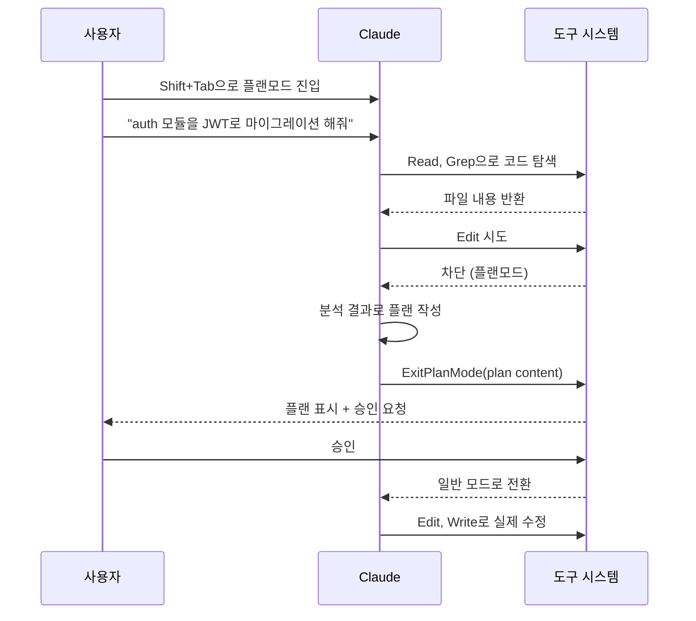

# Claude Code 플랜모드 실전 활용

Claude Code에서 가장 저평가된 기능이 플랜모드(Plan Mode)다. 하나 작업할 거면 그냥 시키는 게 빠르지만, 파일 30개를 건드리는 리팩토링이나 마이그레이션을 시킬 때 플랜모드를 건너뛰면 거의 매번 후회한다. 작업 도중에 방향이 어긋난 걸 뒤늦게 발견하면 롤백도 어렵고, 이미 수정된 파일들을 일일이 되돌려야 한다.

이 문서는 플랜모드가 내부적으로 어떻게 동작하는지, 그리고 실무에서 어떤 작업에 써야 효과를 보는지 정리한다.

---

## 1. 플랜모드가 뭔가

플랜모드는 "코드를 건드리기 전에 무엇을 어떻게 할지 먼저 설계한다"는 한 줄로 요약된다. 일반 모드에서 Claude에게 "auth 모듈을 JWT 기반으로 바꿔달라"고 하면 바로 파일을 수정하기 시작한다. 플랜모드에서 같은 요청을 하면 파일을 읽고 분석한 뒤 단계별 실행 계획을 산출물로 내놓는다. 사용자가 그 계획을 검토하고 승인해야 비로소 일반 모드로 전환되어 실제 수정에 들어간다.

내부적으로는 두 개의 도구가 이 과정을 담당한다.

- `EnterPlanMode`: 플랜모드 진입. 이후 모든 쓰기 도구(Edit, Write, NotebookEdit, Bash 중 상태 변경 명령 등)가 차단된다
- `ExitPlanMode`: 작성한 플랜을 사용자에게 제시하고 승인을 받는다. 승인하면 플랜모드가 해제되고 일반 모드로 돌아간다

쓰기 도구가 차단되어 있으니까 플랜모드에서 Claude가 할 수 있는 건 Read, Grep, Glob, WebFetch, WebSearch 같은 읽기 전용 작업뿐이다. 이 제약 덕분에 "계획만 세우고 코드는 안 건드린다"가 강제된다.

---

## 2. 진입하는 방법

진입 방법은 세 가지다.

### 2.1 Shift+Tab으로 모드 전환

가장 흔하게 쓰는 방법이다. Claude Code 입력창에서 Shift+Tab을 누르면 모드가 순환한다.

```
Normal Mode → Auto-Accept Mode → Plan Mode → Normal Mode → ...
```

현재 모드는 입력창 하단에 표시된다. `⏵⏵ plan mode on`처럼 나오면 진입된 상태다.

### 2.2 슬래시 명령어

`/plan` 명령어로도 진입할 수 있다. 키보드보다 명령어가 익숙하다면 이쪽이 편하다.

### 2.3 시작 옵션

처음부터 플랜모드로 세션을 열고 싶으면 CLI 옵션을 쓴다.

```bash
claude --permission-mode plan
```

CI에서 검토 목적으로 Claude를 돌릴 때나, 처음부터 분석만 시킬 작업이라면 이 옵션이 편하다.

---

## 3. 일반 모드와 뭐가 다른가

가장 큰 차이는 도구 사용 권한이다.

| 도구 | 일반 모드 | 플랜모드 |
|------|-----------|----------|
| Read, Grep, Glob | 허용 | 허용 |
| WebFetch, WebSearch | 허용 | 허용 |
| Edit, Write, NotebookEdit | 허용 | 차단 |
| Bash (읽기 명령: ls, cat, git log) | 허용 | 허용 |
| Bash (쓰기 명령: rm, mv, git commit) | 허용 | 차단 |
| Agent (서브에이전트) | 허용 | 허용 (단, 서브에이전트도 읽기 전용으로 제약) |

Bash가 흥미롭다. 플랜모드에서도 `ls`, `cat`, `git log`, `git diff` 같은 읽기 명령은 돌릴 수 있지만, `git commit`이나 `rm` 같은 상태 변경 명령은 거부된다. Claude가 알아서 거부하는 게 아니라 harness 레벨에서 도구 호출이 차단된다. Claude가 의지로 우회할 수 있는 게 아니라 시스템이 강제하는 제약이다.

Agent 도구로 서브에이전트를 띄우는 것도 가능한데, 이때 서브에이전트한테도 같은 제약이 전파된다. 메인이 플랜모드면 서브에이전트도 쓰기 도구를 못 쓴다. 큰 분석을 병렬로 돌리고 싶을 때 유용하다.

---

## 4. 플랜 작성 → 승인 → 실행 흐름


```mermaid
sequenceDiagram
    participant U as 사용자
    participant C as Claude
    participant T as 도구 시스템

    U->>C: Shift+Tab으로 플랜모드 진입
    U->>C: "auth 모듈을 JWT로 마이그레이션 해줘"
    C->>T: Read, Grep으로 코드 탐색
    T-->>C: 파일 내용 반환
    C->>T: Edit 시도
    T-->>C: 차단 (플랜모드)
    C->>C: 분석 결과로 플랜 작성
    C->>T: ExitPlanMode(plan content)
    T-->>U: 플랜 표시 + 승인 요청
    U->>T: 승인
    T-->>C: 일반 모드로 전환
    C->>T: Edit, Write로 실제 수정
```

핵심은 `ExitPlanMode` 호출 시점이다. Claude가 분석을 끝내고 플랜이 준비됐다고 판단하면 이 도구를 호출한다. 그러면 사용자에게 플랜 내용이 그대로 표시되고 "승인" 또는 "거부" 중에 선택하라고 나온다.

- 승인하면 플랜모드가 해제되고 Claude가 그 플랜대로 실행을 시작한다
- 거부하면 플랜모드를 유지한 채로 다시 사용자 메시지를 기다린다. 보통 "X 부분을 다르게 해줘" 같은 피드백을 주고 플랜을 다시 짜게 한다

---

## 5. 진입 시점 판단

플랜모드를 언제 켜야 하는지 판단이 안 서서 결국 안 쓰게 되는 경우가 있다. 기준은 하나다: **잘못 진행됐을 때 롤백 비용이 얼마나 큰가.**

### 5.1 플랜모드가 필요한 상황

**여러 모듈을 동시에 건드리는 작업**

파일 3개 이상을 한꺼번에 수정해야 할 때. 의존성이 얽힌 코드를 순서 없이 손보면 빌드가 중간 단계에서 깨진 채로 작업이 이어진다. 순서를 먼저 정하지 않으면 Claude도 임시 방편으로 짜기 시작한다.

```
# 이런 요청이 오면 플랜모드 먼저
"user 테이블에 role 컬럼 추가하고,
 UserService/AuthService/AdminController 전부 수정해줘"
```

**DB 마이그레이션과 코드가 동시에 바뀌는 작업**

마이그레이션 SQL, ORM 모델, 서비스 코드가 같이 바뀌는 경우. 배포 순서까지 플랜에 들어가지 않으면 중간 상태에서 앱이 깨진다. 플랜 없이 시키면 Claude가 코드를 먼저 바꿔놓고 마이그레이션을 나중에 챙기는 경우가 있다.

**외부 라이브러리 교체**

`axios`에서 `fetch`로 바꾼다거나, `sequelize`에서 `prisma`로 바꾸는 작업. 호출부가 코드베이스 전체에 흩어져 있어서 빠뜨리면 부분적으로만 동작한다. Grep으로 전체 범위를 먼저 확인하고 플랜을 짜야 누락이 없다.

**원인 불명의 버그 추적**

코드 수정 전에 가설이 필요한 버그. "왜 이게 깨지는지 모르겠다" 상태에서 일반 모드로 시키면 Claude가 바로 수정부터 시작한다. 플랜모드에서 "가설을 세우고 검증 방법을 먼저 계획해라"고 지시하면 수정 전에 분석 결과를 볼 수 있다.

### 5.2 안 써도 되는 상황

- 단일 파일 수정, 오타 수정, 함수 이름 변경
- 새 함수 하나 추가
- 테스트 코드 보강 (기존 코드를 건드리지 않는 경우)

플랜모드는 응답이 늦어지고 단계가 늘어난다. 작은 작업에 쓰면 시간 낭비다.

### 5.3 파일은 하나지만 위험한 작업

파일 수가 적어도 잘못되면 복구가 어려운 작업들이 있다.

- 데이터베이스 스키마 수정 (특히 NOT NULL 컬럼 추가, 컬럼명 변경)
- CI/CD 파이프라인 설정 변경
- 빌드 스크립트나 의존성 버전 수정

이런 경우엔 파일 수에 관계없이 플랜모드를 쓰는 게 낫다. "파일 3개" 기준은 어디까지나 단순 판단 경계선이고, 변경의 파급 범위가 더 중요하다.

---

## 6. 플랜 내용 검토 방법

Claude가 플랜을 제시하면 "승인" 또는 "거부"를 눌러야 한다. 뭘 봐야 하는지 기준이 없으면 습관적으로 승인하게 된다. 그러면 플랜모드를 쓰는 의미가 없다.

### 6.1 파일 경로와 함수 이름이 실제로 있나

좋은 플랜은 구체적이다.

```
# 승인해도 되는 플랜
1단계: src/auth/jwt.service.ts의 generateToken() 수정
  - 현재: expiresIn: '7d'
  - 변경: expiresIn: '30d'

2단계: src/auth/auth.module.ts에서 JwtModule 설정 확인
  - refreshTokenExpiry 상수가 있으면 같이 수정

3단계: src/users/user.entity.ts에서 refresh_token_expires_at 컬럼 타입 점검
```

```
# 거부해야 하는 플랜
1단계: JWT 서비스 분석
2단계: 만료 시간 수정
3단계: 관련 코드 업데이트
4단계: 테스트
```

두 번째는 이미 알고 있는 내용을 정리한 것에 불과하다. 승인해봤자 실제 수정 단계에서 또 탐색하고 질문한다. 파일 경로, 함수 이름, 변경 내용이 구체적으로 없으면 분석이 부족한 거다.

### 6.2 가정이 실제 코드와 맞나

Claude가 코드 구조를 잘못 파악한 채로 플랜을 짜는 경우가 있다. "이 파일에 그 함수가 실제로 있나?"가 의심되면 거부하고 확인시킨다.

```
거부 메시지 예:
"AuthService에 refreshToken 메서드가 있다고 했는데,
 실제로 있는지 먼저 확인해라. 없으면 어디서 처리하는지 찾아서 다시 계획해줘."
```

### 6.3 배포 순서나 의존성 순서가 맞나

DB 마이그레이션이 있는 작업에서 코드 변경과 마이그레이션의 순서가 뒤바뀌어 있으면 배포 중간에 앱이 깨진다.

- 컬럼 추가 마이그레이션 → 그 컬럼을 쓰는 코드 배포 (마이그레이션이 먼저)
- 컬럼 삭제 마이그레이션 → 그 컬럼 참조를 제거한 코드 배포 (코드 먼저, 마이그레이션 나중)

플랜에 배포 순서가 명시되지 않았으면 코드 변경과 마이그레이션 중 어느 쪽을 먼저 실행할지 추가해달라고 거부 메시지를 쓴다.

### 6.4 검증 단계가 있나

플랜 마지막에 "이렇게 확인한다"가 없으면 작업 완료 후 검증이 흐지부지된다. 검증 기준이 없는 플랜은 거부하고 추가시킨다.

```
거부 메시지 예:
"작업 완료 후 어떻게 검증할지 플랜 마지막에 추가해줘.
 테스트 명령, 수동 확인 항목 포함해서."
```

### 6.5 범위가 너무 넓지 않나

한 번에 50개 파일을 수정하는 플랜이 나왔다면 실행 중 중단 확률이 높다. 컨텍스트가 길어지면서 Claude가 초반 플랜을 잊고 방향이 흐트러진다. 이럴 땐 단계별로 쪼개도록 요청한다.

```
거부 메시지 예:
"범위가 너무 넓다. DB 레이어 변경, 서비스 레이어 변경,
 컨트롤러 변경, 테스트 추가 — 이렇게 4단계로 나눠서
 첫 번째 단계 플랜만 다시 짜줘."
```

---

## 7. 대형 작업 실전 패턴

파일 수십 개를 건드리는 작업에서 실제로 쓰는 프롬프트 패턴이다. 패턴 자체보다 각 패턴에서 **왜 그 제약을 명시하는지**가 중요하다.

### 7.1 DB 스키마 마이그레이션 + 코드 변경

```
플랜모드 진입 후:

---
다음 작업 계획을 세워줘.

목표: users 테이블에 email_verified (boolean, NOT NULL, default false) 추가.
     이메일 인증 없이 가입한 기존 계정은 email_verified = true 처리.

영향 범위:
- migrations/ (새 마이그레이션 파일)
- src/users/user.entity.ts
- src/users/user.repository.ts
- src/auth/auth.service.ts (가입 흐름)
- src/users/users.service.ts (사용자 조회 시 verified 필터 추가 여부 확인)

제약:
- 마이그레이션은 up/down 모두 작성해라
- 기존 데이터 처리는 마이그레이션 안에서 UPDATE로 해결해라
- 배포 순서는 마이그레이션 먼저, 코드 배포가 그 다음이어야 한다
  (코드 배포 전 마이그레이션이 적용돼야 앱이 정상 동작)

검증:
- migration up/down 에러 없음
- 가입 API 시나리오 테스트 통과
- 기존 사용자 조회 시 email_verified = true 확인
---
```

"배포 순서는 마이그레이션 먼저"를 명시하는 게 핵심이다. 빠뜨리면 Claude가 코드를 먼저 짜고 마이그레이션을 나중에 붙이는 경우가 있다.

### 7.2 인증 방식 마이그레이션 (Session → JWT)

인증 방식 교체는 영향 범위가 넓고 중간 상태가 없어야 한다. 플랜 없이 시키면 Claude가 일부 엔드포인트는 JWT로, 일부는 세션으로 동작하는 중간 상태를 만들어놓고 멈춘다.

```
플랜모드 진입 후:

---
session 기반 인증을 JWT로 마이그레이션하는 계획을 세워줘.

현재 구조:
- express-session + connect-pg-simple (PostgreSQL session store)
- req.session.userId로 인증 상태 확인
- src/middleware/auth.middleware.ts에서 세션 검증

목표 구조:
- jsonwebtoken + refresh token 방식
- Authorization: Bearer 헤더로 인증
- access token 1시간, refresh token 7일

먼저 Grep으로 실제 범위를 파악해라:
- req.session을 쓰는 파일 전체 목록
- express-session을 import하는 파일

제약:
- 세션 관련 코드를 한 번에 다 바꾸지 마라
- 미들웨어부터 교체하고, 라우터/컨트롤러는 그 다음에 처리해라
- express-session, connect-pg-simple 패키지 제거는 마지막 단계
- 클라이언트 측 코드는 이번 작업 범위 밖

단계를 나눠서 계획해라:
1단계: JWT 유틸 + 새 auth 미들웨어 작성
2단계: 세션 미들웨어 → JWT 미들웨어 교체 (라우터 레벨)
3단계: 세션 변수 참조 제거
4단계: 의존성 정리
---
```

"먼저 Grep으로 실제 범위를 파악해라"를 명시한 부분이 중요하다. 안 하면 Claude가 눈에 보이는 파일만 보고 "다 됐다"고 한다.

### 7.3 라이브러리 교체 (axios → native fetch)

Node.js 18+ 기준 `fetch`가 기본 내장됐으니 `axios` 제거를 고려하는 경우가 있다. 호출부가 퍼져 있어서 플랜 없이 시키면 빠뜨리는 파일이 생긴다.

```
플랜모드 진입 후:

---
axios를 Node native fetch로 교체하는 계획을 세워줘.

사전 확인 (Grep으로 직접 파악해라):
- axios를 import하는 파일 전체 목록
- axios.create()로 인스턴스를 만든 곳 (공통 설정이 있는지 확인)
- interceptor를 쓰는 곳 (fetch에는 interceptor가 없어서 별도 처리 필요)

교체 범위:
- src/ 하위 전체
- 테스트 파일 포함

제약:
- interceptor가 있으면 wrapper 함수로 대체하는 방안을 플랜에 명시해라
- axios.create()로 공통 인스턴스를 만든 파일이 있으면 거기서부터 시작해라
- Node 버전 확인: package.json의 engines 필드 확인 후 진행

검증:
- TypeScript 빌드 에러 없음 (npx tsc --noEmit)
- 기존 API 호출 테스트 전체 통과
---
```

interceptor 사용 여부를 사전에 확인하도록 명시한 게 핵심이다. 빠뜨리면 교체 후 인증 헤더나 에러 핸들링이 날아가는 경우가 있다.

### 7.4 대규모 타입 정비

TypeScript `any` 남발로 누적된 타입 문제를 정리할 때.

```
플랜모드 진입 후:

---
TypeScript any 타입을 정리하는 계획을 세워줘.

사전 파악 (Grep으로):
- any가 있는 파일 목록과 건수
- 패턴별 분류: 함수 파라미터 any, return type any, as any 캐스팅

제약:
- 한 번에 전부 하려 하지 마라
- 파일 단위로 나눠서 단계별로 처리해라
- 외부 라이브러리 타입이 없어서 any인 경우는 @ts-expect-error + 주석으로 처리
- 런타임 동작을 바꾸는 수정은 하지 마라 (타입만 정리)

우선순위:
1. API 응답 처리 관련 (가장 위험한 곳)
2. 서비스 레이어
3. 유틸리티 함수들
---
```

---

## 8. 플랜 품질을 높이는 프롬프트 기법

플랜모드에 들어가도 프롬프트가 부실하면 결과물도 부실하다. 다음 세 가지를 의식적으로 챙기면 플랜 품질이 올라간다.

### 8.1 파일 경로를 명시

Claude한테 "auth 모듈 좀 보고" 같이 모호하게 말하면 Grep을 여러 번 돌려서 코드를 찾는다. 그 과정에서 의도와 다른 파일을 본다. 처음부터 경로를 박아주면 분석이 빨라지고 정확해진다.

```
플랜모드에서 다음 작업을 계획해줘.

대상 파일:
- src/auth/jwt.service.ts
- src/auth/auth.controller.ts
- src/users/user.repository.ts

작업: JWT 발급 시 refresh token 만료를 7일에서 30일로 변경.
관련된 곳을 모두 찾아서 수정 계획을 세워줘.
```

### 8.2 제약 조건을 먼저 박는다

"이건 절대 안 된다"를 미리 알려주면 플랜에서 그걸 회피한다. 작업이 끝난 후에 "이게 왜 이렇게 됐냐"고 따지지 않으려면 사전 차단이 낫다.

```
제약:
- 기존 토큰을 사용 중인 클라이언트가 있으니 API 응답 스키마를 바꾸지 마라
- 마이그레이션은 별도 파일로 분리해라
- 테스트는 기존 테스트 픽스처를 깨지 않는 선에서 추가만 해라
```

### 8.3 검증 기준을 포함시킨다

"이걸 어떻게 확인할 거냐"를 플랜에 포함시키면 작업 완료 후 검증이 쉬워진다.

```
검증 기준:
- npm run test 전체 통과
- e2e 테스트에서 /auth/refresh 엔드포인트 시나리오 통과
- migration up/down 모두 에러 없이 실행
```

이런 항목을 프롬프트에 넣으면 플랜의 마지막 단계에 "검증" 섹션이 생긴다. 작업 끝나고 빠뜨린 게 없는지 확인할 때 그 섹션을 그대로 쓰면 된다.

---

## 9. 자주 발생하는 실수

실무에서 플랜모드를 쓰면서 반복적으로 보게 되는 실수들이다.

### 9.1 플랜 없이 바로 구현

가장 흔하다. "큰 작업이지만 머릿속에 그림이 있으니까 그냥 시키면 되겠지"라고 하고 일반 모드로 던진다. 절반쯤 작업이 진행된 시점에 Claude가 "X 파일도 수정해야 합니다. 진행할까요?" 같은 질문을 던지는데, 그때부터는 이미 절반 수정된 상태라 돌이키기 애매하다.

판단 기준: **3개 이상의 파일을 동시에 수정하는 작업이면 무조건 플랜모드부터.** 5분 더 쓰는 게 30분 롤백보다 싸다.

### 9.2 너무 추상적인 플랜

플랜이 "1. 분석한다. 2. 수정한다. 3. 테스트한다." 수준으로 나오는 경우가 있다. 이런 플랜은 승인해봤자 실제 수정 단계에서 또 헤맨다. 플랜에 파일 경로, 함수 이름, 변경 내용이 구체적으로 들어가야 한다.

추상적인 플랜이 나오면 거부하고 "각 단계에서 어떤 파일의 어떤 함수를 어떻게 바꿀지 구체적으로 적어줘"라고 다시 요청한다.

### 9.3 검증 단계 누락

플랜에 "구현"만 있고 "검증"이 없는 경우가 많다. 작업이 끝났을 때 진짜로 동작하는지 확인할 방법이 없다. 플랜모드에서 항상 마지막에 "검증 방법은 뭐냐"고 물어보거나, 8.3에서처럼 프롬프트에 검증 기준을 미리 박아둔다.

### 9.4 코드 분석을 충분히 안 한 채로 ExitPlanMode

Claude가 가끔 코드를 깊게 안 보고 일반론적인 플랜만 쓰고 ExitPlanMode를 호출하는 경우가 있다. 플랜이 나왔을 때 "이 코드를 정말 읽었나"가 의심되면 거부하고 "X 파일의 Y 함수를 먼저 읽고 그 구현을 기준으로 다시 계획해줘"라고 요청한다.

---

## 10. 트러블슈팅

### 10.1 플랜이 너무 길어진다

대규모 리팩토링에서 플랜이 수십 항목으로 길어지는 경우가 있다. 길수록 좋은 게 아니라, 길수록 한 번에 실행했을 때 중간에 막힐 확률이 올라간다. 작업 단위로 쪼개라.

- 1차 플랜: DB 스키마 + 마이그레이션
- 2차 플랜: 모델/리포지토리 레이어
- 3차 플랜: 서비스 + 컨트롤러
- 4차 플랜: 테스트 + 문서

각 차수를 별도 PR로 끊으면 리뷰도 쉬워진다.

### 10.2 플랜모드에서 나오지 못한다

가끔 Claude가 분석만 계속 하고 `ExitPlanMode`를 호출하지 않는 경우가 있다. 코드를 너무 깊게 파고들다가 플랜을 못 정리하는 상황이다. 명시적으로 "지금까지 분석한 내용으로 플랜을 작성해서 ExitPlanMode를 호출해라"라고 지시한다.

반대로 Shift+Tab으로 다시 일반 모드로 돌아갈 수도 있다. 이때 진행 중이던 플랜 작성은 폐기된다.

### 10.3 플랜 승인 후 실제 작업이 플랜과 다르게 진행된다

플랜에 없는 파일을 수정하거나, 플랜에서 정한 순서를 무시하고 작업이 진행되는 경우가 있다. 컨텍스트가 길어지면서 Claude가 플랜을 잊어버리는 현상이다.

대처 방법은 두 가지다.

- 플랜이 길면 4~5개 단계마다 "지금 플랜의 어디까지 왔는지 확인하고, 남은 단계를 다시 알려줘"라고 중간 점검
- 플랜을 작업 시작 전에 별도 파일(`PLAN.md`)로 저장하고, 작업 중간에 Claude가 그 파일을 참조하도록 함

### 10.4 ExitPlanMode 후 곧바로 거부했는데 컨텍스트가 꼬임

거부 직후 Claude가 분석한 내용을 잊고 처음부터 다시 시작하는 경우가 있다. 이때는 "방금 본 파일들의 분석은 유지한 채로, X 부분만 다시 계획해줘"라고 명시한다. 컨텍스트 윈도우에 분석 내용이 남아있으니까 처음부터 다시 읽지는 않는다.

---

## 11. Auto-Accept 모드와의 조합

Claude Code의 모드는 세 가지다.

- **Normal Mode**: 도구 호출마다 사용자 승인 요청
- **Auto-Accept Mode**: 안전한 도구 호출은 자동 승인, 위험한 작업만 사용자 확인
- **Plan Mode**: 쓰기 도구 차단, 플랜 작성 전용

### 11.1 분석 → 계획 → 자동 실행

```
1. Plan Mode 진입 (Shift+Tab)
2. 작업 지시 → Claude가 코드 분석 → 플랜 제시
3. 플랜 승인
4. Auto-Accept Mode 진입 (Shift+Tab)
5. Claude가 플랜대로 자동 실행
6. 완료 후 Normal Mode로 복귀해서 검토
```

큰 리팩토링을 시킬 때 이 흐름이 안전하면서도 손이 덜 간다. 플랜이 확정된 상태라서 Auto-Accept으로 둬도 의도에서 벗어날 일이 적다.

### 11.2 분석만 따로

코드를 수정하지 않고 분석만 하고 싶을 때도 플랜모드가 쓸 만하다.

```
1. Plan Mode 진입
2. "이 코드베이스의 권한 처리 흐름을 분석해줘. 수정은 하지 마라."
3. Claude가 Read, Grep으로 코드 분석
4. ExitPlanMode 대신 그냥 결과만 받음 (사용자가 거부하면 됨)
```

분석 결과만 보고 싶을 때 일반 모드에서 시키면 Claude가 자꾸 "수정할까요?"라고 묻는다. 플랜모드에서는 그 자체가 차단되니까 분석에 집중하게 된다.

### 11.3 Auto-Accept만 쓰면 안 되는 경우

Auto-Accept 모드는 편하지만, 큰 작업을 검토 없이 던지면 위험하다. 특히 다음 경우엔 Plan Mode를 먼저 거쳐야 한다.

- 여러 파일에 걸친 동시 수정
- 외부 시스템과 상호작용하는 코드 (API 호출, DB 마이그레이션)
- 의존성 변경 (package.json, requirements.txt 수정)
- 빌드/CI 설정 변경

Auto-Accept으로 바로 던지면 진행 도중 멈추기도 어렵고, 잘못된 방향으로 끝까지 가버리는 경우가 있다.
