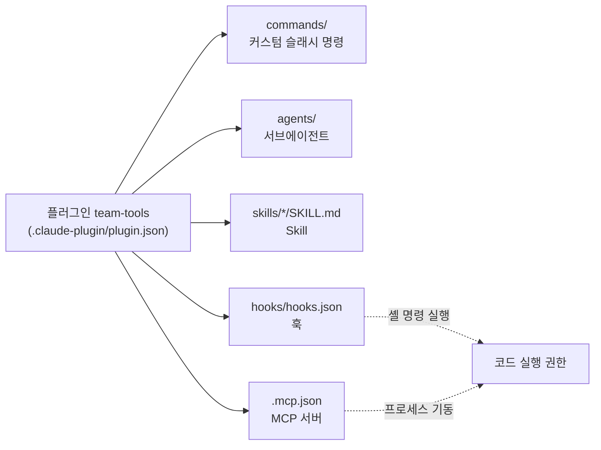
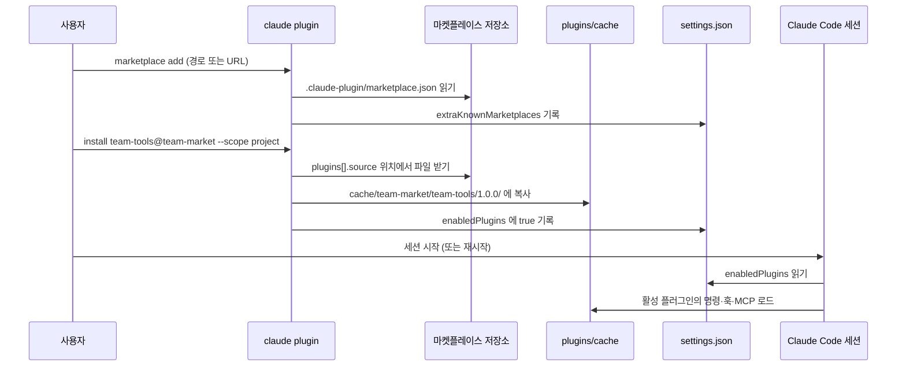
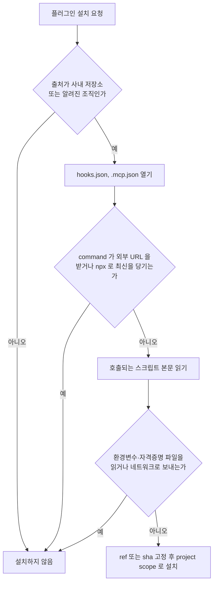

# Claude Code 플러그인과 사설 마켓플레이스

팀원이 다섯 명을 넘으면 `.claude/` 디렉터리 복사가 문제가 된다. 누군가 `/review` 명령을 고치면 나머지 네 명은 모르고 옛 버전을 쓴다. 훅 스크립트는 저장소마다 사본이 생기고, MCP 서버 설정은 개인 `~/.claude.json`에 제각각 박힌다. 플러그인은 이 조각들을 한 디렉터리로 묶고 버전 번호를 붙여서 `claude plugin install` 한 줄로 받게 만드는 포장 방식이다.

편한 만큼 위험도 같이 따라온다. 플러그인 하나가 훅과 MCP 서버를 들고 오기 때문에, 설치는 곧 "내 계정 권한으로 임의 명령을 돌릴 수 있는 코드를 받는 일"이다. 이 문서는 구조와 명령, 사설 마켓플레이스 운영, 설치 전에 열어봐야 할 파일을 정리한다.

검증 방법을 밝혀 둔다. 설치된 Claude Code 2.1.111에서 `/tmp` 아래 HOME을 따로 잡고 로컬 마켓플레이스를 만들어 `claude plugin marketplace add`, `install`, `update`, `disable`, `uninstall`, `validate`를 실제로 돌렸다. 설정 파일에 무엇이 쓰이는지, 캐시에 무엇이 복사되는지도 파일로 확인했다. 설정 스키마(`extraKnownMarketplaces`, source 종류)는 `cli.js`에서 대조했다. 세션을 띄워서 플러그인의 명령이나 훅이 실제로 호출되는 것까지는 돌리지 않았고, 그런 부분은 본문에서 따로 표시했다.

## 플러그인이 묶는 것

플러그인은 아래 다섯 가지를 담을 수 있다. 전부 넣을 필요는 없고, 명령 하나만 든 플러그인도 유효하다.



점선으로 이은 두 개가 나머지 셋과 성격이 다르다. 명령·서브에이전트·Skill은 프롬프트 텍스트라서 모델이 읽고 해석하는 대상이다. 훅과 MCP 서버는 모델을 거치지 않고 OS 프로세스로 뜬다. 신뢰 경계 이야기가 이 두 줄에서 시작된다.

디렉터리 구조는 아래와 같다. 이 구조로 실제 설치까지 해봤고, `claude plugin validate`가 통과했다.

```text
team-tools/
├── .claude-plugin/
│   └── plugin.json          # 이름, 버전, 설명. 이 폴더 안에는 이것만 둔다
├── commands/
│   └── review.md
├── agents/
│   └── db-reviewer.md
├── skills/
│   └── lint-rule/
│       └── SKILL.md
├── hooks/
│   ├── hooks.json
│   └── guard.sh
└── .mcp.json
```

흔한 실수가 하나 있다. `commands/`, `agents/`, `hooks/` 를 `.claude-plugin/` 안에 넣는 것이다. `.claude-plugin/` 에는 `plugin.json` 만 들어가고, 나머지는 플러그인 루트에 둔다. 마켓플레이스의 `marketplace.json` 도 같은 이름의 폴더에 들어간다.

`plugin.json` 은 최소한 이렇게 쓴다.

```json
{
  "name": "team-tools",
  "version": "1.0.0",
  "description": "백엔드팀 공용 명령과 SQL 검토 에이전트",
  "author": { "name": "platform-team" }
}
```

`name` 에 공백이 있으면 `validate` 가 거부한다. 실제로 `"Bad Name"` 을 넣어보니 `Plugin name cannot contain spaces. Use kebab-case` 가 나왔다. `author` 를 빼면 경고만 나온다.

### 훅과 MCP 서버의 경로

플러그인은 설치될 때 `~/.claude/plugins/cache/<마켓플레이스>/<플러그인>/<버전>/` 으로 복사된다. 저장소 위치가 아니라 이 캐시 경로에서 실행된다. 그래서 훅 명령에 `./hooks/guard.sh` 같은 상대 경로를 쓰면 현재 작업 디렉터리 기준으로 해석돼서 파일을 못 찾는다. 플러그인 루트를 가리키는 `${CLAUDE_PLUGIN_ROOT}` 변수를 쓴다.

```json
{
  "hooks": {
    "PreToolUse": [
      {
        "matcher": "Bash",
        "hooks": [
          { "type": "command", "command": "${CLAUDE_PLUGIN_ROOT}/hooks/guard.sh" }
        ]
      }
    ]
  }
}
```

`.mcp.json` 도 마찬가지로 `"command": "${CLAUDE_PLUGIN_ROOT}/bin/db-mcp"` 처럼 쓴다. 플러그인이 띄운 MCP 서버는 도구 이름이 `plugin:<플러그인>:<서버>` 형태로 붙는다(`cli.js` 의 이름 조립 코드에서 확인). 개인 설정에 같은 이름의 서버를 따로 등록했다면 이름이 달라서 둘 다 뜬다. 같은 DB MCP가 두 번 연결되는 일이 이렇게 생긴다. 훅 이벤트와 matcher 규칙은 [Hooks](Claude_Code_Hooks.md), MCP 서버 운영은 [MCP 서버 운영](Claude_Code_MCP.md)에 있다.

플러그인 안의 슬래시 명령은 플러그인 이름이 네임스페이스로 붙어서 `/team-tools:review` 형태로 부르는 것이 공식 동작이다. 이 부분은 세션을 띄워서 확인하지 않았다. 명령 작성법 자체는 [슬래시 명령](Claude_Code_Slash_Command.md), Skill은 [스킬과 룰 시스템](Claude_Code_Skill_Rule.md)을 본다.

## 설치와 scope

플러그인 관리는 세션 안의 `/plugin` 과 셸의 `claude plugin` 두 경로가 있다. 스크립트에 넣을 수 있는 쪽은 셸 명령이라, 아래는 이쪽으로 정리한다.

| 하고 싶은 일 | 명령 |
|---|---|
| 마켓플레이스 등록 | `claude plugin marketplace add <경로 · URL · owner/repo>` |
| 등록 목록 | `claude plugin marketplace list` |
| 마켓플레이스 최신화 | `claude plugin marketplace update [이름]` |
| 설치 | `claude plugin install <플러그인>@<마켓플레이스> --scope <user\|project\|local>` |
| 비활성화·활성화 | `claude plugin disable` / `enable` |
| 제거 | `claude plugin uninstall` |
| 플러그인 업데이트 | `claude plugin update <플러그인>@<마켓플레이스>` |
| 매니페스트 검사 | `claude plugin validate <경로>` |

마켓플레이스를 등록하고 설치해서 세션에 로드되기까지의 흐름은 아래 순서다.



그림에서 볼 것은 `install` 이 저장소가 아니라 캐시로 복사한다는 점과, "켜짐" 상태가 `settings.json` 의 `enabledPlugins` 에 따로 남는다는 점이다. 설치와 활성화가 분리돼 있어서 `disable` 하면 캐시는 그대로 두고 값만 `false` 로 바뀐다. 실제로 돌려보니 `disable` 후 설정이 `"team-tools@team-market": false` 가 됐고, `uninstall` 후에는 `enabledPlugins` 가 빈 객체가 됐다.

### scope별로 쓰이는 파일

`--scope` 기본값은 `user` 다. 같은 플러그인이라도 어느 scope에 설치하느냐에 따라 켜지는 범위와 기록되는 파일이 다르다.

| scope | enabledPlugins 가 쓰이는 파일 | 켜지는 범위 | 팀 공유 |
|---|---|---|---|
| user | `~/.claude/settings.json` | 내 모든 프로젝트 | 안 됨 |
| project | `<프로젝트>/.claude/settings.json` | 이 저장소 | 커밋하면 됨 |
| local | `<프로젝트>/.claude/settings.local.json` | 이 저장소, 나만 | 안 됨 |

project로 설치하면 `.claude/settings.json` 에 `{"enabledPlugins": {"team-tools@team-market": true}}` 한 덩어리가 생긴다. 이 파일을 커밋하면 팀원은 같은 저장소를 열 때 같은 플러그인이 켜진 상태가 된다. 반대로 `.gitignore` 에 `.claude/` 전체를 넣어둔 저장소는 이 파일이 커밋되지 않는다. 이 저장소가 그렇다. project scope를 쓰려면 `.claude/settings.json` 은 추적하고 `settings.local.json` 만 무시하도록 `.gitignore` 를 먼저 고친다.

`marketplace add` 는 scope 옵션 없이 항상 user 설정에 기록됐다. 출력도 `declared in user settings` 였고 `~/.claude/settings.json` 에 `extraKnownMarketplaces` 가 생겼다. 그래서 팀원 전원이 자동으로 같은 마켓플레이스를 알게 하려면 project 설정에 `extraKnownMarketplaces` 를 직접 적어 커밋해 둔다. 스키마 설명이 "이 저장소에서 쓸 추가 마켓플레이스"로 되어 있다. 팀원 쪽에서 신뢰 확인 프롬프트가 어떻게 뜨는지는 돌려보지 않았다.

```json
{
  "extraKnownMarketplaces": {
    "team-market": {
      "source": { "source": "github", "repo": "my-org/claude-plugins" }
    }
  },
  "enabledPlugins": {
    "team-tools@team-market": true
  }
}
```

## 팀용 사설 마켓플레이스

마켓플레이스는 `.claude-plugin/marketplace.json` 하나가 들어 있는 git 저장소(또는 디렉터리)다. 서버도 레지스트리도 필요 없다. 사내 GitLab이나 GitHub Enterprise 저장소 하나면 된다.

```text
claude-plugins/                       # 사내 git 저장소
├── .claude-plugin/
│   └── marketplace.json
└── plugins/
    ├── team-tools/
    │   ├── .claude-plugin/plugin.json
    │   └── commands/review.md
    └── db-tools/
        └── ...
```

```json
{
  "name": "team-market",
  "owner": { "name": "platform-team" },
  "metadata": { "description": "백엔드팀 공용 Claude Code 플러그인" },
  "plugins": [
    {
      "name": "team-tools",
      "source": "./plugins/team-tools",
      "description": "공용 명령과 SQL 검토 에이전트"
    },
    {
      "name": "db-tools",
      "source": {
        "source": "github",
        "repo": "my-org/db-claude-plugin",
        "ref": "v2.3.0"
      }
    }
  ]
}
```

`source` 는 문자열이면 마켓플레이스 저장소 안의 상대 경로이고, 객체이면 다른 저장소를 가리킨다. 스키마에서 확인한 종류는 `github`, `git`, `git-subdir`, `url`, `npm`, `pip` 이다. 모노레포 안의 한 폴더만 쓰려면 `git-subdir` 가 sparse clone으로 해당 경로만 받는다.

경로 때문에 한 번 막힌다. 상대 경로는 `marketplace.json` 파일 위치가 아니라 `.claude-plugin/` 을 품은 마켓플레이스 루트 기준이고, `..` 는 안 된다. `"source": "../outside"` 를 넣고 `validate` 를 돌리면 `Path contains "..": ... Use "./outside" instead` 라는 에러가 나온다. 작성 후에는 푸시 전에 `claude plugin validate .` 를 돌린다. 마켓플레이스 `metadata.description` 이 없으면 경고가 나오지만 통과한다.

### 버전 관리에서 겪는 함정

`claude plugin update` 는 `plugin.json` 의 `version` 이 바뀌어야 새 내용을 받는다. 이걸 실제로 돌려봤다.

```bash
# 1) review.md 내용을 고치고 커밋만 한다 (version 은 그대로 1.0.0)
claude plugin marketplace update team-market
claude plugin update team-tools@team-market --scope project
# team-tools is already at the latest version (1.0.0).

# 2) plugin.json 의 version 을 1.1.0 으로 올리고 커밋
claude plugin marketplace update team-market
claude plugin update team-tools@team-market --scope project
# Plugin "team-tools" updated from 1.0.0 to 1.1.0 ... Restart to apply changes.
```

1번에서 캐시의 `review.md` 는 옛 내용 그대로였다. 명령 프롬프트 한 줄을 고치고 버전을 안 올리면 팀원 전원이 그 수정을 영원히 못 받는다. 마켓플레이스 저장소 CI에서 "plugins 아래 파일이 바뀌었는데 `version` 이 그대로면 실패"하는 검사를 하나 두면 이 사고를 막는다. 간단한 구현은 `git diff --name-only origin/main -- plugins/team-tools` 가 비어 있지 않은데 같은 diff에 `plugin.json` 이 없으면 종료 코드 1을 내는 것이다. `version` 을 아예 생략하는 구성은 돌려보지 않았다.

업데이트 후 상태에서 두 가지를 더 알아 둔다. 업데이트는 `Restart to apply changes` 라고 나오는 대로 실행 중인 세션에는 반영되지 않는다. 그리고 캐시 디렉터리에 `1.0.0` 과 `1.1.0` 이 나란히 남았다. 옛 버전 폴더는 지워지지 않으므로 디스크가 신경 쓰이면 직접 정리한다.

`github` source에는 `ref`(브랜치·태그)와 `sha`(커밋)를 줄 수 있다. 외부 저장소 플러그인은 `ref` 에 태그를 박아 두고, 신뢰가 필요한 것은 `sha` 까지 고정한다. 브랜치를 가리켜 두면 그 저장소에 푸시되는 순간 다음 `update` 때 내용이 바뀐다.

## 설치 전에 열어봐야 할 파일

플러그인에서 코드를 실행하는 경로는 두 개다. `hooks/hooks.json` 에 적힌 `command`, 그리고 `.mcp.json` 에 적힌 서버 기동 명령이다. 훅은 도구 호출 때마다 사용자 권한으로 셸이 뜨고, MCP 서버는 세션 시작 시 프로세스로 뜬다. 어느 쪽이든 `~/.ssh`, `~/.aws/credentials`, 환경변수의 토큰을 읽을 수 있다. 사용자 권한으로 돌기 때문이다. [샌드박스](Claude_Code_Sandbox.md)는 Bash 도구 실행을 감싸는 장치다. 훅 스크립트와 MCP 서버 프로세스가 그 안에서 도는지는 확인하지 않았으니, 막아준다고 가정하고 검토를 건너뛰지 않는다.



위 흐름에서 가장 자주 걸리는 지점은 세 번째 분기다. 읽어 볼 대상을 구체적으로 적으면 이렇다.

- `hooks/hooks.json` 의 모든 `command`. `curl ... | sh`, `npx some-pkg@latest`, `python -c` 로 시작하는 한 줄짜리가 특히 눈여겨볼 대상이다. 훅은 이벤트 종류에 따라 사용자 프롬프트 전문이나 도구 입력이 stdin으로 들어오므로, 밖으로 내보내는 코드가 있으면 프롬프트가 같이 나간다.
- `.mcp.json` 의 `command` 와 `args`, `env`. `npx -y 패키지` 형태는 설치 시점의 코드를 고정하지 못한다. 매 기동마다 레지스트리의 최신본을 받기 때문이다. 패키지가 탈취되면 플러그인 파일은 그대로인데 실행 코드만 바뀐다. `url` 타입의 원격 MCP라면 어느 호스트로 대화 내용이 흘러가는지 본다.
- `commands/*.md` 프런트매터의 `allowed-tools`. 명령이 `Bash(*)` 같은 넓은 권한을 미리 허용해 두면 사용자가 승인 프롬프트를 못 본 채 실행된다.
- `agents/*.md` 의 `tools` 와 프롬프트 본문. 서브에이전트 정의에 "결과를 이 URL로 POST 하라" 같은 지시가 숨어 있을 수 있다. 프롬프트 인젝션이 설치 시점에 이미 들어 있는 셈이다.
- 마켓플레이스의 `plugins[].source`. `ref` 없이 브랜치만 가리키거나 개인 계정의 저장소를 가리키면 소유자가 바뀔 때 내용이 바뀐다.

설치 전 검토는 캐시에 풀린 파일이 아니라 저장소를 클론해서 읽는 쪽이 낫다. 설치 순간 `enabledPlugins` 가 `true` 로 쓰이므로 다음 세션부터는 이미 켜진 상태다.

조직 단위로 막고 싶다면 managed settings의 `strictKnownMarketplaces` 가 있다. `cli.js` 에서 `hostPattern`(정규식으로 호스트 제한), `pathPattern`(파일시스템 경로 제한) 같은 source 규칙을 받는 스키마를 확인했다. 예를 들어 `^github\.mycompany\.com$` 만 허용하면 사내 호스트 밖의 마켓플레이스는 추가되지 않는다. 이 설정 자체를 돌려서 차단을 확인하지는 않았다. 설정 계층과 우선순위는 [설정과 권한](Claude_Code_Settings_Permissions.md)에 있다.

플러그인 공급망 전체를 보는 시각은 [AI 공급망 보안](../Concepts/AI_Supply_Chain_Security.md)에 정리돼 있다. 모델 파일의 pickle 실행이나 `trust_remote_code=True` 와 구조가 같다. "받은 파일을 열기만 해도 코드가 돈다"는 점, 그리고 버전을 고정하지 않으면 받는 쪽이 모르게 내용이 바뀐다는 점이다. 플러그인에서는 그 자리에 `hooks.json` 과 `.mcp.json` 이 들어간다.

## 개별 설정 파일로 둘 때와 플러그인으로 묶을 때

두 방식은 같은 기능을 서로 다른 단위로 배포한다. 기능은 같고 달라지는 것은 배포, 버전, 업데이트, 신뢰 경계다.

| 항목 | 개별 `.claude/` 디렉터리 | 플러그인 |
|---|---|---|
| 배포 | 저장소에 커밋. 클론하면 따라온다 | 마켓플레이스 등록 후 `install`. 저장소와 별개로 움직인다 |
| 버전 | git 커밋이 곧 버전. 저장소 브랜치와 항상 같이 움직인다 | `plugin.json` 의 `version`. 올리지 않으면 업데이트가 안 된다 |
| 업데이트 | `git pull` 하면 끝. 재시작 불필요한 경우도 많다 | `marketplace update` 후 `plugin update`, 재시작 필요 |
| 적용 범위 | 그 저장소 하나 | 여러 저장소에서 같은 것을 재사용 |
| 신뢰 경계 | 저장소 코드와 같은 리뷰 대상. PR 에서 훅 변경이 diff 로 보인다 | 저장소 밖 코드. 설치한 사람이 직접 읽지 않으면 리뷰 없이 실행된다 |
| 롤백 | `git revert` | 이전 버전 태그로 `ref` 를 되돌리고 update |

기준은 이렇게 잡는다. 한 저장소에서만 쓰고 그 저장소의 구조에 묶인 것은 `.claude/` 에 둔다. 예를 들어 이 서비스의 마이그레이션 디렉터리 규칙을 아는 훅, 이 모노레포의 패키지 이름을 하드코딩한 명령이 그렇다. 저장소 코드와 같은 PR에서 같이 바뀌어야 하고, 리뷰어가 diff에서 훅 변경을 바로 볼 수 있다.

플러그인이 맞는 경우는 세 가지다. 첫째, 서비스가 열 개라 같은 명령과 에이전트를 열 군데에 복사하고 있을 때. 둘째, 한 번에 설치돼야 의미가 있는 묶음일 때. SQL 검토 에이전트, 거기에 붙는 DB MCP 서버, 위험 쿼리를 막는 훅이 한 세트라면 따로 배포하면 하나만 빠지는 사고가 난다. 셋째, 저장소 소유자가 아닌 사람(플랫폼팀)이 배포 주기를 따로 가져가야 할 때.

반대로 플러그인으로 묶지 말아야 하는 경우도 있다. 팀 인원이 서너 명이고 저장소가 하나이면 `version` 올리는 일과 재시작 안내만 비용이 된다. 또 하나는 훅이 저장소 상태에 강하게 의존하는 경우다. 캐시 경로에서 실행되므로 `${CLAUDE_PLUGIN_ROOT}` 로 플러그인 자기 파일은 찾지만, 저장소 안 파일은 현재 디렉터리 기준으로 접근해야 한다. 이 경계를 헷갈리면 훅이 로컬에서는 되고 다른 사람 환경에서는 안 되는 문제가 나온다.

처음에는 `.claude/` 로 시작하고, 두 번째 저장소에서 같은 파일을 복사하는 순간 플러그인으로 옮기는 순서가 비용이 적다. 옮길 때는 `.claude/commands` 를 `commands/` 로, `.claude/agents` 를 `agents/` 로 그대로 옮기면 된다. 같은 명령이 양쪽에 남으면 어느 쪽이 실행되는지 헷갈리므로 옮긴 뒤 원본은 지운다.

## 트러블슈팅

| 증상 | 원인 | 확인 |
|---|---|---|
| 명령을 고쳤는데 팀원에게 반영 안 됨 | `version` 을 올리지 않아 `already at the latest version` | 캐시 폴더의 `plugin.json` 버전 |
| `update` 했는데 그대로 | 세션 재시작 전 | 새 세션에서 확인 |
| 훅 스크립트 `No such file` | 상대 경로 사용 | `${CLAUDE_PLUGIN_ROOT}` 로 교체 |
| `validate` 에서 `Path contains ".."` | 상대 `source` 가 마켓플레이스 루트 기준이 아닌 것으로 오해 | `./plugins/...` 형태로 수정 |
| 같은 MCP가 두 번 연결됨 | 개인 설정의 서버와 `plugin:<플러그인>:<서버>` 가 이름이 달라 공존 | `claude mcp list` |
| project scope로 설치했는데 팀원에게 안 보임 | `.claude/` 가 `.gitignore` 에 있음 | `git check-ignore -v .claude/settings.json` |
| 캐시 폴더가 계속 늘어남 | 옛 버전 디렉터리가 남음 | `~/.claude/plugins/cache/` 직접 정리 |
