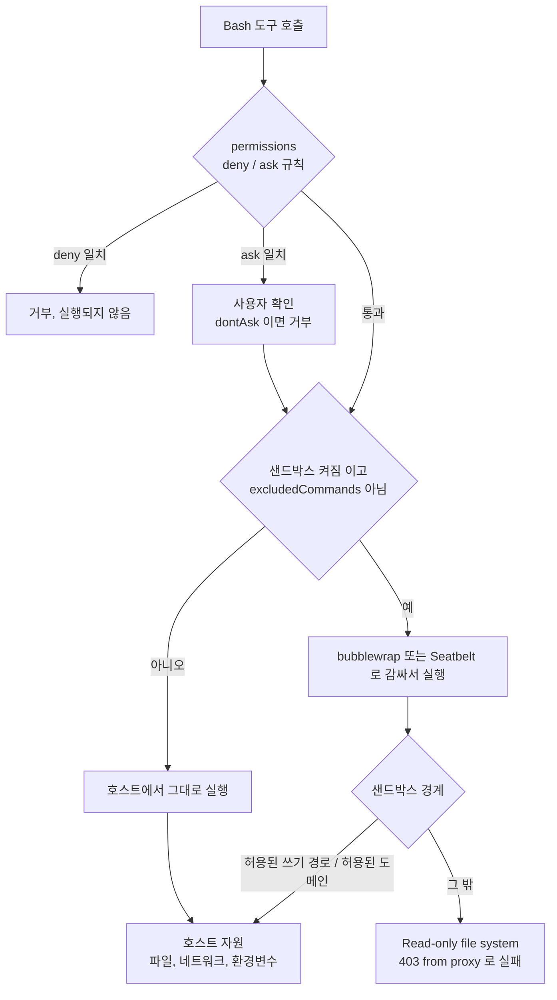
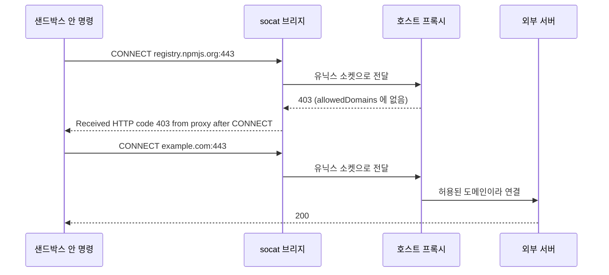
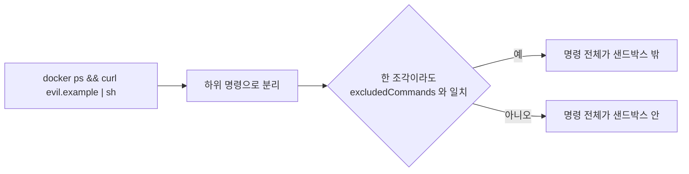
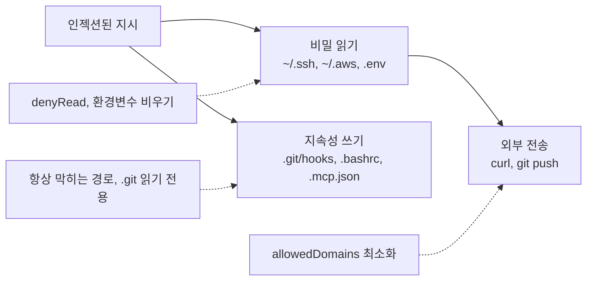

# Claude Code 샌드박스 격리

권한 규칙을 꼼꼼히 써 두면 안전하다고 생각하기 쉽다. 규칙은 Claude가 도구를 부르기 직전에 한 번 읽히는 문자열 비교다. 명령이 일단 통과하면 그 뒤에 일어나는 일에는 관여하지 못한다. `npm test`를 허용했는데 테스트 코드가 `~/.ssh`를 읽어 어딘가로 보내도, 권한 규칙 입장에서는 `npm test` 한 건이 정상 실행된 것이다. 이 틈을 메우는 것이 샌드박스다. 이미 실행 중인 프로세스가 건드릴 수 있는 파일과 네트워크를 커널 수준에서 좁힌다.

이 문서는 두 층이 어디서 갈리는지, Linux에서 샌드박스가 실제로 무엇을 막고 무엇을 안 막는지, 그리고 `--dangerously-skip-permissions`를 컨테이너에서 쓸 때 최소한 무엇이 있어야 하는지를 다룬다. 권한 규칙 문법은 [설정과 권한](Claude_Code_Settings_Permissions.md), Auto Mode 승인 범위는 [Auto Mode](Claude_Code_Auto_Mode.md)에 있으므로 여기서는 반복하지 않는다. Claude가 만든 코드 자체의 취약점(XSS, SSRF 등)은 [웹취약점 대응](Claude_Code_Web_Vulnerability.md)이 맡는다. 이 문서는 코드가 아니라 실행 환경 쪽이다.

## 이 문서의 결과를 얻은 방법

아래 내용은 두 가지 근거로 나뉜다.

- 실행해서 확인한 것: 이 서버(Ubuntu 22.04, 커널 5.15, root 계정, bubblewrap 0.6.1, socat 1.7.4.1, Claude Code 2.1.111)에서 `claude -p`에 샌드박스 설정을 주고 Bash 명령을 실제로 돌렸다. 에러 메시지는 출력 그대로 옮겼다.
- 소스를 읽어서 확인한 것: 설치된 `cli.js`에서 설정 스키마, bubblewrap 인자 조립부, `excludedCommands` 매칭 함수를 읽었다. 본문에서 "소스 기준"이라고 표시한다.

확인하지 못한 것은 맨 아래 표에 모았다. 요약하면 macOS(Seatbelt)는 소스만 읽었고, Docker는 이 서버에 설치돼 있지 않아 컨테이너 예시는 실행하지 못했으며, root가 아닌 계정에서의 bubblewrap 동작도 시험하지 못했다.

## 한 건의 명령이 지나가는 층

Bash 도구 호출 하나는 권한 판정과 샌드박스 경계를 차례로 지나 호스트 자원에 닿는다. 도식에서 볼 것은 두 판정이 서로 다른 질문에 답한다는 점이다. 앞쪽은 "이 명령을 실행해도 되는가", 뒤쪽은 "실행된 프로세스가 무엇에 닿을 수 있는가"다.



권한 판정은 deny와 ask를 먼저 본다. 샌드박스가 켜져 있고 `autoAllowBashIfSandboxed`가 기본값(true)이면, deny·ask에 걸리지 않은 샌드박스 명령은 확인 없이 실행된다. 샌드박스 안이라서 피해가 제한된다는 논리로 프롬프트를 줄인 것이다. 실제로 `--permission-mode dontAsk`로 allow 규칙을 하나도 쓰지 않고 돌렸을 때 샌드박스 명령은 그대로 실행됐고, 샌드박스 밖으로 나가려는 호출만 거부됐다.

### 두 층은 서로를 대신하지 못한다

두 층이 독립이라는 것을 직접 확인했다.

deny 규칙은 `--dangerously-skip-permissions`에서도 적용됐다. `.claude/settings.json`에 `Bash(touch /tmp/sbx1/denied.txt)`를 deny로 넣고 이 플래그로 같은 명령을 시켰더니 "blocked"로 끝났고 파일은 생기지 않았다. 소스에서도 deny·ask 판정이 bypassPermissions 모드 검사보다 앞에 있다. [Auto Mode](Claude_Code_Auto_Mode.md) 문서에는 이 플래그에서 deny 리스트가 무시된다고 적혀 있는데, 2.1.111에서는 재현되지 않았다. 버전에 따라 다를 수 있으니 쓰는 버전에서 한 번 확인하는 편이 낫다.

반대 방향도 성립한다. 같은 플래그로 샌드박스를 켜고 `touch /root/...`를 시키면 `Read-only file system`으로 실패한다. 권한 확인을 전부 끈 상태에서도 샌드박스 경계는 남는다. 이 성질이 컨테이너 절에서 중요해진다.

| 구분 | 권한 규칙 | 샌드박스 |
|---|---|---|
| 판정 시점 | 도구 호출 직전 | 프로세스 실행 중 모든 시스템 호출 |
| 판정 대상 | 명령 문자열, 도구 이름, 경로 패턴 | 열려는 파일, 연결하려는 호스트 |
| 우회 방식 | 문자열을 다르게 써서 패턴을 피함 | 경계 밖 경로를 열어 두거나 샌드박스 자체를 끔 |
| 적용 범위 | 모든 도구 | Bash 명령으로 실행되는 프로세스 |
| 실패 모습 | "Permission ... has been denied" | `Read-only file system`, `403 from proxy` |

적용 범위가 Bash 명령 프로세스라는 점은 놓치기 쉽다. Read, Edit, Write 도구는 Claude 프로세스가 직접 파일을 다루므로 bubblewrap으로 감싸지지 않고 권한 규칙만 받는다. 이 문서의 샌드박스 시험은 전부 Bash 경유다.

## Bash 샌드박스가 하는 일

### 켜는 방법과 의존성

설정은 `settings.json`의 `sandbox` 키다. Linux에서는 bubblewrap과 socat이 필요하다.

```bash
sudo apt install bubblewrap socat
```

```json
{
  "sandbox": {
    "enabled": true,
    "failIfUnavailable": true,
    "allowUnsandboxedCommands": false,
    "network": { "allowedDomains": ["example.com"] }
  }
}
```

`/sandbox` 슬래시 명령으로도 켜고 끌 수 있지만, 팀 저장소에서는 설정 파일로 못 박아 두는 쪽이 낫다. 설정 두 개는 기본값이 느슨해서 직접 지정해야 한다. `failIfUnavailable`의 기본값은 false다. bubblewrap이 없거나 플랫폼이 지원되지 않으면 경고만 띄우고 명령을 샌드박스 없이 실행한다(스키마 설명 기준). 샌드박스를 켰다고 믿는 상태에서 조용히 꺼져 있는 상황이 이 기본값에서 나온다. `allowUnsandboxedCommands`는 뒤에서 따로 다룬다.

### 파일시스템

쓰기는 허용 목록 방식이다. 허용되는 곳은 현재 작업 디렉터리, 샌드박스용 임시 디렉터리(`$TMPDIR`, 이 서버에서는 `/tmp/claude-0`), `permissions.additionalDirectories`, `Edit(...)` allow 규칙의 경로, `sandbox.filesystem.allowWrite`다(소스 기준). 나머지는 루트부터 읽기 전용으로 마운트된다.

읽기는 반대로 기본이 열림이다. 샌드박스 안에서 `ls /root`가 홈 디렉터리 목록을 그대로 보여줬다. 막으려면 `sandbox.filesystem.denyRead`나 `Read(...)` deny 규칙에 경로를 넣어야 하고, 소스상 `Read` deny 규칙은 샌드박스 설정으로 합쳐진다.

쓰기 허용 경로 안에서도 항상 막히는 목록이 있다(소스 기준).

| 경로 | 이유 |
|---|---|
| `.gitconfig`, `.gitmodules`, `.git/hooks`, `.git/config` | git이 나중에 실행하거나 읽는 설정 |
| `.bashrc`, `.bash_profile`, `.zshrc`, `.zprofile`, `.profile` | 다음 셸 시작 때 실행됨 |
| `.mcp.json`, `.ripgreprc` | 도구 설정 |
| `.vscode`, `.idea`, `.claude/commands`, `.claude/agents` | 에디터와 Claude Code 확장 지점 |

이 목록은 "작업 디렉터리에는 쓸 수 있어도, 나중에 호스트에서 실행될 파일은 못 바꾼다"는 원칙으로 읽힌다. 이게 왜 필요한지는 직접 재현해 봤다. bubblewrap으로 프로젝트 디렉터리만 쓰기 마운트한 환경에서 `.git/hooks/pre-commit`을 만들게 하고, 마운트 밖 호스트에서 `git commit`을 쳤더니 훅이 호스트 권한으로 실행됐다. 컨테이너에 저장소를 통째로 마운트하는 구성이 이 경로를 그대로 연다.

실행 결과를 표로 옮겼다. 설정은 `enabled: true`, `allowedDomains: ["example.com"]`, `allowUnsandboxedCommands: false`다.

| 시도 | 결과 |
|---|---|
| 작업 디렉터리 안에 파일 쓰기 | 성공 |
| `git add`, `git commit` (작업 디렉터리 안) | 성공 |
| `/root/outside.txt` 쓰기 | `Read-only file system` |
| `.git/hooks/pre-commit` 쓰기 | `Read-only file system` |
| 작업 디렉터리의 `.bashrc` 새로 만들기 | `Permission denied` |
| `ls /root` | 목록이 그대로 나옴 |
| `denyRead`에 넣은 디렉터리를 `cat` | `No such file or directory` |
| `denyRead`에 넣은 디렉터리를 `ls` | 에러 없이 빈 출력, 종료 코드 0 |

마지막 두 줄이 의외다. `denyRead`는 `Permission denied`를 내지 않고 그 디렉터리 자리에 빈 tmpfs를 덮는다(소스에서 `--tmpfs` 확인). Claude는 파일이 "없다"고 받아들이고, 다른 경로에서 찾으려 하거나 파일을 새로 만들려 할 수 있다. 에러 메시지만 보고 권한 문제인지 판단하기 어려운 이유다.

### 네트워크

Linux에서는 명령을 네트워크 네임스페이스(`--unshare-net`)에 넣는다. 네임스페이스 안에는 외부로 나가는 인터페이스가 없다. 그런데도 허용 도메인에 접속되는 이유는 호스트 쪽 프록시와 이어진 유닉스 소켓을 마운트해 두기 때문이다. 명령에는 `HTTP_PROXY`, `ALL_PROXY` 같은 환경변수가 주입되고, socat이 소켓과 프록시 사이를 이어 준다(소스 기준).



판정은 프록시가 도메인 이름으로 한다. 시험에서 `example.com`은 200, `registry.npmjs.org`는 `curl: (56) Received HTTP code 403 from proxy after CONNECT`였다. 허용 도메인 목록은 `sandbox.network.allowedDomains`와 `WebFetch(domain:...)` allow 규칙이 합쳐진다(소스 기준). WebFetch를 허용해 둔 도메인이 Bash 명령에도 열린다는 뜻이다.

프록시 환경변수를 존중하지 않는 도구는 네임스페이스 안에서 그냥 실패한다. 직접 소켓을 여는 프로그램에는 프록시가 끼어들 자리가 없다.

### 환경변수는 숨겨지지 않는다

샌드박스는 파일과 네트워크만 다룬다. 시험에서 샌드박스 안 명령이 `CLAUDE_CODE_OAUTH_TOKEN`을 읽을 수 있었다. 셸 환경을 그대로 물려받기 때문이다. `AWS_ACCESS_KEY_ID`든 `GITHUB_TOKEN`이든 Claude를 실행한 셸에 있으면 명령도 읽는다. 샌드박스가 이 값을 외부로 보내는 길(허용 도메인)은 좁히지만, 읽는 것 자체는 막지 못한다. 자격증명 미노출은 샌드박스가 아니라 실행 환경 구성에서 해결할 문제다.

### macOS와 Linux의 구현 차이

| 항목 | Linux | macOS |
|---|---|---|
| 격리 도구 | bubblewrap (`bwrap`) | `sandbox-exec` (Seatbelt) |
| 파일 규칙 방식 | 루트 읽기 전용 바인드 후 허용 경로만 쓰기 바인드 | Seatbelt 프로파일의 `allow`/`deny` 규칙 |
| 네트워크 | 네트워크 네임스페이스 + 프록시 브리지 | 프로파일로 접속 제한 + 프록시 |
| 유닉스 소켓 | seccomp로 소켓 생성 차단, 경로별 허용 불가 | `allowUnixSockets`로 경로별 허용 가능 |
| 추가 의존성 | bubblewrap, socat | 없음 |
| Mach/XPC 접근 | 해당 없음 | `allowMachLookup`으로 허용 |
| 와일드카드 경로 | 권한 규칙의 glob은 경고 대상 | 정규식으로 변환해 지원 |

Linux 열은 이 서버에서 일부 확인했고, macOS 열은 소스와 스키마 설명만 읽었다. 직접 돌려 보지 않았다.

Linux에서 겪은 함정이 하나 있다. 이 서버에 설치된 패키지는 `vendor/seccomp/x64/apply-seccomp` 파일에 실행 권한이 없었다(`-rw-r--r--`). 이 상태에서 샌드박스를 켜면 모든 Bash 명령이 `apply-seccomp: Permission denied`, 종료 코드 126으로 끝났다. 의존성 검사(bubblewrap, socat 존재 여부)는 통과하므로 `failIfUnavailable`도 잡아 주지 않는다. 명령마다 에러가 같으면 이 경우를 의심하고 해당 파일의 권한부터 본다.

```bash
ls -l "$(npm root -g)/@anthropic-ai/claude-code/vendor/seccomp/x64/apply-seccomp"
```

우회로로 `network.allowAllUnixSockets: true`를 주면 seccomp 단계를 건너뛰고 나머지 격리는 유지됐다. 다만 이 값은 유닉스 소켓 차단을 통째로 끄므로 `docker.sock` 같은 소켓이 열린다. 진단용으로만 쓰고 권한 문제를 고친 뒤 되돌린다.

bubblewrap 쪽 시험 환경에도 조건이 붙는다. 이 서버는 `kernel.unprivileged_userns_clone`과 `user.max_user_namespaces`가 0이라 `unshare -U`가 실패하는데, root로 실행한 `bwrap`은 통과했다. 일반 계정에서도 같은 설정이 통과하는지는 확인하지 못했다. 사용자 네임스페이스를 막은 배포판에서는 일반 계정의 bubblewrap이 시작하지 못할 수 있고, 컨테이너 안에서는 중첩 네임스페이스가 막혀 `enableWeakerNestedSandbox` 옵션이 필요해지는 경우가 있다.

## 샌드박스 안에서 막히는 것들

샌드박스를 켜면 처음 며칠은 막히는 명령이 계속 나온다. 막힌 이유는 대개 파일 쓰기 경로, 도메인, 유닉스 소켓 셋 중 하나다.

**git push.** 이 서버에서 `git push https://github.com/...`은 종료 코드 128, `Received HTTP code 403 from proxy after CONNECT`로 끝났다. github.com이 허용 도메인에 없었기 때문이다. `git commit`은 작업 디렉터리 안이라 막히지 않는다. SSH 원격은 소스상 `GIT_SSH_COMMAND`에 socat 기반 `ProxyCommand`를 주입하는 경로가 있는데 실행해 보지는 않았다. 푸시를 샌드박스 안에서 허용하려면 `github.com`을 `allowedDomains`에 넣어야 하고, 이 도메인은 코드를 올리는 길이기도 해서 뒤의 인젝션 절에서 다루는 유출 경로 문제와 맞물린다.

**패키지 설치.** `npm view left-pad version`과 `npm install left-pad`가 모두 실패했다. 메시지가 오해를 부른다.

```
npm error 403 a package version that is forbidden by your security policy, or
npm error 403 on a server you do not have access to.
```

레지스트리 정책에 걸린 것처럼 읽히지만 실제 원인은 프록시가 `registry.npmjs.org`를 거부한 것이다. 같은 403이라 알아보기 어렵다. 패키지 설치가 필요하면 레지스트리 도메인을 허용 목록에 넣는다. pip, cargo, go 모듈도 같은 구조일 것으로 보이지만 npm만 확인했다.

**docker.** 이 서버에는 Docker가 없어서 직접 시험하지 못했다. 소스 기준으로 Linux 샌드박스는 seccomp 필터로 유닉스 소켓 생성을 막고, Linux에서는 경로별 허용도 불가능하다(`allowUnixSockets`는 macOS 전용이라고 스키마에 적혀 있다). `docker` CLI는 `/var/run/docker.sock`으로 데몬과 통신하므로 샌드박스 안에서는 연결 단계에서 실패하는 것이 맞는 동작이다. 그래서 `docker`는 `excludedCommands`에 넣는 사례가 많은데, 소켓을 열어 주는 순간 그 명령은 호스트 root와 같은 권한이라는 점을 알고 넣어야 한다.

### excludedCommands는 문법부터 틀리기 쉽다

`excludedCommands`는 샌드박스 없이 실행할 명령을 지정한다. 표기에 따라 매칭 방식이 세 가지로 갈린다(소스의 파서 기준).

| 표기 | 매칭 방식 | 일치하는 예 |
|---|---|---|
| `echo` | 정확히 일치 | `echo` 한 단어만 |
| `echo:*` | 접두 | `echo x`, `echo x > file` |
| `echo *` | 와일드카드 | `echo` 뒤에 인자가 있는 형태 |

맨 이름만 쓰면 정확히 일치로 해석된다. `excludedCommands: ["echo"]`로 두고 `echo x > /root/outside_echo.txt`를 시켰을 때 `Read-only file system`으로 막혔다. 의도는 "echo는 제외"였겠지만 실제로는 인자 없는 `echo`만 제외했다. `docker`를 이렇게 적었다면 `docker ps`는 여전히 샌드박스 안에서 돈다.

반대로 `echo:*`로 고치면 문제는 반대 방향으로 터진다. 시험은 `--dangerously-skip-permissions`에 `allowUnsandboxedCommands: false`로 했고, 샌드박스 밖 쓰기 대상은 `/root`였다.

| 명령 | 결과 | 해석 |
|---|---|---|
| `echo x > /root/ex1.txt` | 성공 | 제외 대상이라 샌드박스 밖 |
| `touch /root/ex2.txt` | `Read-only file system` | 제외 대상 아님 |
| `touch /root/ex3.txt && echo done` | 성공 | `touch`까지 샌드박스 밖 |
| `echo start; touch /root/ex4.txt` | 성공 | 동일 |
| `FOO=1 echo x > /root/ex5.txt` | 성공 | 앞의 환경변수는 무시하고 매칭 |
| `bash -c 'echo x > /root/ex6.txt'` | `Read-only file system` | `bash`가 접두라 불일치 |
| `curl https://registry.npmjs.org/ ; echo` | 200 | 허용 목록에 없는 도메인에 접속됨 |

3번, 4번, 7번이 핵심이다. 복합 명령을 조각으로 나눠 한 조각이라도 제외 목록에 맞으면 명령 전체가 샌드박스 밖에서 돈다.



그래서 `docker:*`를 제외하면 `docker ps && curl ... | sh`의 `curl | sh` 부분도 샌드박스 없이 돈다. 인젝션된 지시가 제외 명령 하나를 앞에 붙이기만 하면 샌드박스는 사라진다. 제외 명령은 권한 규칙의 allow와 deny로만 통제되고, 그 규칙은 복합 명령과 따옴표 변형에 약하다([설정과 권한](Claude_Code_Settings_Permissions.md)의 복합 명령 항목).

제외 목록을 쓸 때는 세 가지를 지킨다. 제외하는 명령은 가능한 한 구체적으로 적는다(`docker compose up:*`처럼 인자까지). 제외 명령에는 deny 규칙으로 위험한 형태(`docker run --privileged`, `-v /:/host`)를 따로 막는다. 정말 필요한 것이 소켓 하나면 제외 목록 대신 샌드박스가 없는 별도 환경(컨테이너)에서 그 작업을 돌린다.

### 샌드박스를 끄는 길이 하나 더 있다

Bash 도구에는 `dangerouslyDisableSandbox` 파라미터가 있고, Claude는 샌드박스 때문에 실패했다고 판단하면 이 값을 켜고 다시 시도하도록 지시받는다(Bash 도구 프롬프트 기준). `allowUnsandboxedCommands`의 기본값이 true라서 이 길이 열려 있다.

두 모드로 시험했다. 설정은 `enabled: true`만 두고 `allowUnsandboxedCommands`는 기본값으로 뒀다. `/root`에 `touch`를 시켰다.

| 권한 모드 | 결과 |
|---|---|
| `--dangerously-skip-permissions` | 첫 시도가 `Read-only file system`으로 실패하자 Claude가 `dangerouslyDisableSandbox`로 재시도했고, 종료 코드 0으로 파일이 생성됨 |
| `--permission-mode dontAsk` | 같은 재시도가 호출 단계에서 거부됨 |

권한 확인을 끈 모드에서는 샌드박스를 끄는 호출도 묻지 않고 통과한다. 샌드박스와 skip-permissions를 같이 쓰면서 `allowUnsandboxedCommands: false`를 안 주면, 모델이 마음먹기에 따라 샌드박스가 한 번에 빠진다. `false`로 두면 이 파라미터는 무시되고 모든 명령이 샌드박스 안에서만 돈다. skip-permissions와 샌드박스를 조합하는 목적이 "권한 확인은 끄되 경계는 유지"라면 이 값이 필수다.

## skip-permissions를 컨테이너에서 쓸 때 최소 조건

[Auto Mode](Claude_Code_Auto_Mode.md)에 이 플래그를 격리된 환경에서만 쓰라는 안내가 있다. 격리된 환경이 구체적으로 무엇이어야 하는지가 여기서 다룰 내용이다.

### root 검사는 자기 선언이다

root 계정에서 `--dangerously-skip-permissions`를 쓰면 `cannot be used with root/sudo privileges for security reasons`로 종료된다. 이 서버에서 `IS_SANDBOX` 환경변수를 지우고 실행해서 확인했다. 소스를 보면 이 검사를 통과하는 조건이 두 개다. `IS_SANDBOX=1`이거나 `CLAUDE_CODE_BUBBLEWRAP`이 켜져 있으면 된다.

두 값은 모두 "여기는 격리돼 있다"는 선언일 뿐 아무것도 검증하지 않는다. 이 서버가 그 증거다. `IS_SANDBOX=1`이 설정돼 있어서 플래그가 아무 제약 없이 동작했는데, 호스트명은 일반 서버이고 `/proc/1/cgroup`은 `0::/init.scope`, `/.dockerenv`도 없다. 컨테이너가 아니다. 그러니 Dockerfile에 `ENV IS_SANDBOX=1`을 넣어 검사를 넘기는 것은 격리를 만든 것이 아니라 경고를 치운 것이다. 일반 계정으로 실행하면 이 검사 자체가 필요 없다.

### 세 가지 조건

최소한 갖춰야 하는 것은 셋이다. 각각 시험으로 확인한 결과가 있다.

| 조건 | 의미 | 확인한 내용 |
|---|---|---|
| 네트워크 차단 | 컨테이너에서 나가는 연결을 Anthropic API와 필요한 도메인으로 한정 | `--unshare-net`으로 만든 격리 환경에서 DNS 조회부터 실패 |
| 마운트 범위 | 작업 디렉터리만 쓰기, 홈과 소켓은 마운트하지 않음 | 홈을 빈 tmpfs로 덮은 환경에서 `ls /root`가 빈 출력 |
| 자격증명 미노출 | 호스트 환경변수와 설정 파일을 넘기지 않음 | `--clearenv`로 환경변수 4개만 남김. 반대로 `CLAUDE_CODE_OAUTH_TOKEN`은 샌드박스 안에서 그대로 읽힘 |

Docker를 설치하지 못해 위 세 항목은 bubblewrap으로 같은 원리를 재현했다. 프로젝트 디렉터리만 `/work`로 바인드하고 `--unshare-all`, `--tmpfs /root`, `--clearenv`를 준 환경이다. 이 환경에서 `/work` 쓰기는 호스트 디렉터리에 반영됐고, 외부 도메인 해석은 `Could not resolve host`로 실패했다.

실제 `docker run`으로 옮기면 대략 이런 모양이 된다. 이 명령은 이 서버에서 실행하지 못했고, 옵션의 의미만 확인했다.

```bash
docker run --rm -it \
  --user 1000:1000 \
  --read-only --tmpfs /tmp \
  --cap-drop ALL --security-opt no-new-privileges \
  --pids-limit 256 --memory 4g \
  --network claude-egress \
  -v "$PWD":/work -w /work \
  -e ANTHROPIC_API_KEY \
  my-claude-image \
  claude --dangerously-skip-permissions -p "테스트 실행하고 실패 원인 요약"
```

`--network claude-egress`는 API 도메인만 통과시키는 프록시 뒤에 둔 네트워크라는 가정이다. `--network none`으로 완전히 끊으면 Claude 자신이 API에 못 닿는다. 그래서 "네트워크 차단"은 실제로는 "허용 목록 외 차단"이 된다.

이 구성에서 남는 구멍이 둘 있다. 하나는 `-e ANTHROPIC_API_KEY`다. Claude가 쓰는 키가 그 안에서 실행되는 명령에게도 읽힌다. 키를 안 넣을 수는 없으므로 이 키는 해당 용도 전용으로 따로 만들고 사용 한도를 걸어 둔다. 다른 하나는 마운트한 저장소의 `.git`이다. 앞에서 재현한 것처럼 `.git/hooks`를 쓸 수 있으면 호스트에서 다음 git 명령이 실행될 때 훅이 돈다. 컨테이너가 끝난 뒤 호스트에서 `git status`를 치기 전에 `.git/hooks`와 `.git/config`가 바뀌지 않았는지 본다. 가능하면 `.git`은 읽기 전용으로 마운트하고, 커밋과 푸시는 컨테이너 밖에서 한다.

호스트 `docker.sock`을 마운트하면 이 모든 조건이 무의미해진다. 소켓을 쥔 프로세스는 호스트의 아무 디렉터리를 마운트한 컨테이너를 새로 띄울 수 있다.

## 프롬프트 인젝션이 성공했다고 가정하기

인젝션을 완전히 막는 방법은 없다고 보고 구성하는 편이 현실적이다. README, 이슈 본문, 웹 페이지, MCP 서버 응답 어디에나 지시문이 들어올 수 있고, 모델이 그걸 따를 가능성은 0이 아니다. 질문을 "인젝션을 어떻게 막나"에서 "성공했을 때 무엇을 가져갈 수 있고 어디로 보내나"로 바꾼다.

피해가 나려면 세 가지가 동시에 필요하다. 읽을 수 있는 비밀, 밖으로 보낼 경로, 그리고 흔적이나 지속성을 남길 쓰기 위치다. 하나를 끊으면 피해 반경이 줄어든다.



세 지점에 각각 대응하는 설정을 모으면 이렇다.

```json
{
  "sandbox": {
    "enabled": true,
    "failIfUnavailable": true,
    "allowUnsandboxedCommands": false,
    "network": {
      "allowedDomains": ["registry.npmjs.org"]
    },
    "filesystem": {
      "denyRead": ["~/.ssh", "~/.aws", "~/.config/gcloud"]
    }
  },
  "permissions": {
    "deny": ["Read(./.env)", "Read(./.env.*)"]
  }
}
```

`filesystem` 경로 값은 `//`로 시작하면 절대 경로로 쓰이고, 그 밖의 값은 설정 파일 위치를 기준으로 풀린다(소스 기준). 위 예의 `~` 표기가 홈으로 확장되는지는 실행해 보지 않았으므로, 처음 쓸 때 `ls`로 실제 막혔는지 확인한다.

설정마다 한계가 있다. `denyRead`는 경로를 직접 적은 곳만 막는다. 시험에서 디렉터리 하나를 지정했더니 그 디렉터리만 비어 보였다. 비밀이 어디에 있는지 모르면 못 막는다. `.env`는 프로젝트 안에 있고 쓰기 허용 경로이므로 `Read(./.env)` deny와 `denyRead`를 같이 건다. Linux에서는 `Read`·`Edit` 규칙에 glob(`*`, `?`)을 쓰면 경고가 뜨므로(소스 기준) 가능하면 경로를 구체적으로 적는다.

`allowedDomains`는 늘리는 순간 유출 경로가 된다. 도메인 이름만 보는 프록시이므로, 허용한 도메인에 쓰기가 가능한 서비스(`github.com`, 클라우드 스토리지, 웹훅 수신 서비스)가 있으면 그쪽으로 데이터를 올릴 수 있다. 레지스트리처럼 읽기만 되는 도메인만 열고, 푸시와 업로드는 샌드박스 밖(사람이 직접)에서 한다. 이 부분은 설정과 동작 원리에서 이끌어낸 판단이고 실제 유출 시도로 확인하지는 않았다.

환경변수는 앞에서 봤듯이 숨겨지지 않는다. 장기 자격증명(`AWS_SECRET_ACCESS_KEY`, 배포용 토큰)이 들어 있는 셸에서 Claude를 실행하지 않는 것이 첫째다. 다음으로 `allowUnsandboxedCommands: false`와 `failIfUnavailable: true`는 샌드박스가 꺼지는 두 경로를 모두 막는 짝이므로 같이 설정한다. `excludedCommands`는 비워 두고 시작해서, 막힌 명령이 반복해서 나올 때 구체적인 표기로 하나씩 추가한다.

팀 단위로 강제하려면 개인 설정으로는 부족하다. 사용자가 `.claude/settings.local.json`으로 덮어쓸 수 있기 때문이다. 스키마에는 관리형 설정(managed settings)에서 `allowManagedDomainsOnly`를 켜면 사용자·프로젝트 설정의 도메인 허용을 무시하는 옵션이 있다. 이 기능은 소스에서 확인했을 뿐 사용해 보지 않았다.

샌드박스는 인젝션 자체를 막지 않으므로, Claude가 만든 코드나 커밋 안에 악성 로직이 섞이는 문제는 별도로 리뷰해야 한다. 그쪽은 [웹취약점 대응](Claude_Code_Web_Vulnerability.md)의 범위다.

## 격리 수준 비교

네 단계를 같은 기준으로 놓고 보면 어디까지 믿을 수 있는지가 드러난다. "실제로 확인" 열은 이 서버에서 직접 본 것이다.

| 항목 | 권한 규칙만 | 샌드박스 | 컨테이너 | VM |
|---|---|---|---|---|
| 막는 시점 | 호출 직전 | 실행 중 시스템 호출 | 실행 중 시스템 호출 | 실행 중 (하이퍼바이저) |
| 파일 접근 | 경로 패턴 문자열 비교. Bash 안에서 스크립트가 읽으면 못 막음 | 쓰기 허용 목록, 읽기는 deny 목록 | 마운트한 것만 보임 | 디스크 이미지 안만 보임 |
| 네트워크 | 도메인 규칙은 WebFetch만 | 프록시 + 도메인 허용 목록 | 네트워크 설정에 따름 | 가상 NIC 설정에 따름 |
| 환경변수 | 그대로 노출 | 그대로 노출 | 넘긴 것만 노출 | 넘긴 것만 노출 |
| 커널 | 호스트 공유 | 호스트 공유 | 호스트 공유 | 별도 커널 |
| 대표적 우회 | 복합 명령, 인터프리터 경유 | `excludedCommands`, `dangerouslyDisableSandbox`, 열어 둔 도메인 | `docker.sock` 마운트, `--privileged`, 쓰기 가능한 `.git/hooks` | 공유 폴더, 열어 둔 네트워크 |
| 준비할 것 | 없음 | bubblewrap, socat 설치 | 이미지와 마운트 설계 | 이미지와 부팅 |
| 실제로 확인 | deny 적용 확인 | Linux 쓰기/네트워크 격리 확인 | bubblewrap으로 원리만 확인 | 확인하지 않음 |

권한 규칙은 실수를 줄이는 장치, 샌드박스는 단일 명령의 피해 범위를 줄이는 장치, 컨테이너와 VM은 세션 전체를 호스트에서 떼어내는 장치로 쓴다. 샌드박스와 컨테이너는 호스트 커널을 공유하므로 커널 취약점까지 가정하는 위협 모델이면 VM이 맞다. 일반적인 개발 작업에서는 컨테이너 안에서 샌드박스까지 켜는 이중 구성이 현실적인 균형이다. 컨테이너 안에서 bubblewrap이 도는지는 환경에 따라 다르며 이 서버에서는 시험하지 못했다.

## 확인하지 못한 것

| 항목 | 상태 |
|---|---|
| Linux 쓰기·읽기·네트워크 격리, `excludedCommands`, `dangerouslyDisableSandbox` 동작 | 이 서버에서 실행해 확인 |
| macOS Seatbelt 동작과 `allowUnixSockets`, `allowMachLookup` | 소스만 읽음. 실행하지 않음 |
| Docker 컨테이너 옵션, 컨테이너 안 bubblewrap | Docker 미설치. 실행하지 않음 |
| 일반 계정(root 아님)에서 bubblewrap 시작 | 시험하지 못함 |
| seccomp의 유닉스 소켓 차단과 `docker.sock` 연결 실패 | 이 서버의 `apply-seccomp`에 실행 권한이 없어 시험하지 못함. 소스 기준 설명 |
| SSH 원격 push, pip·cargo·go 모듈 설치 | 실행하지 않음 |
| 관리형 설정의 `allowManagedDomainsOnly` | 소스에서 확인만 함 |
| 허용 도메인을 통한 실제 데이터 유출 | 시험하지 않음. 설정 구조에서 이끌어낸 판단 |

이 문서의 시험 결과는 Claude Code 2.1.111 기준이다. 샌드박스 설정 키와 기본값은 버전마다 바뀌는 영역이라, 쓰는 버전의 `/sandbox` 출력과 `settings.json` 스키마를 먼저 본다.
