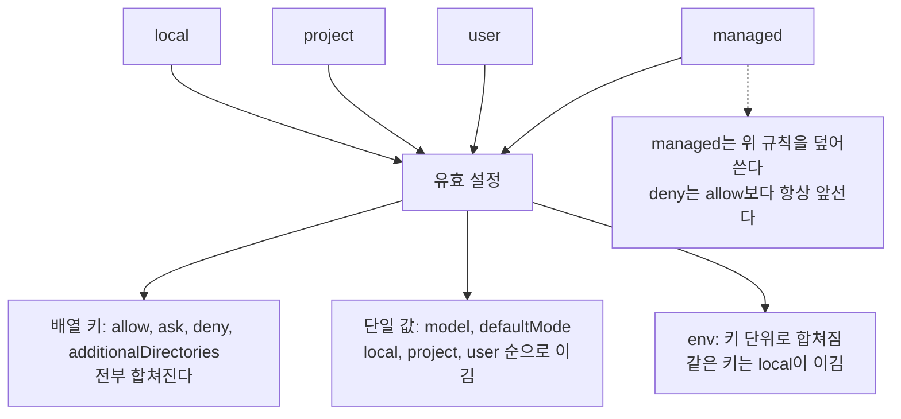
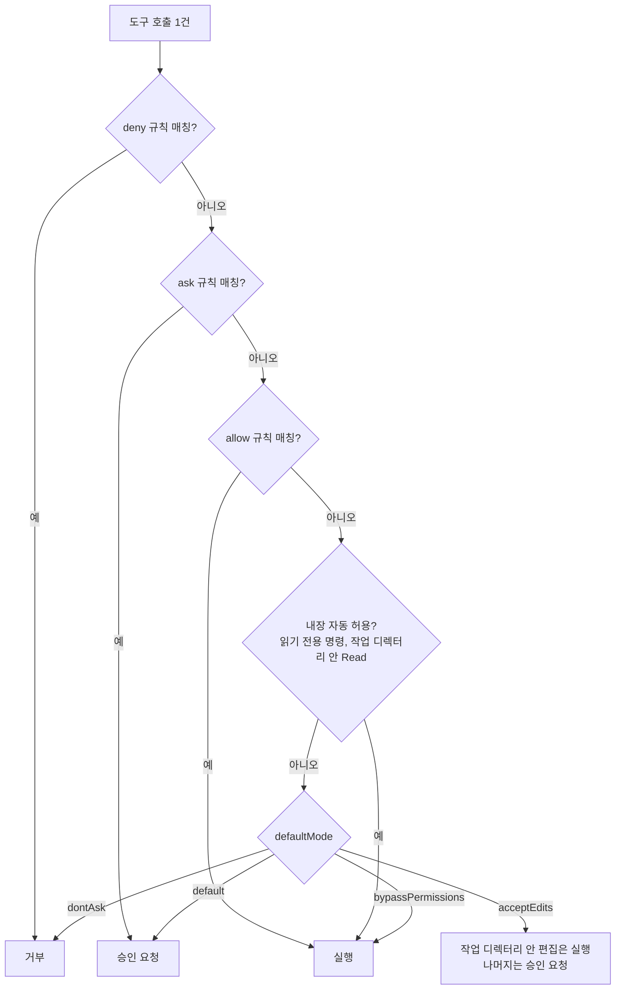
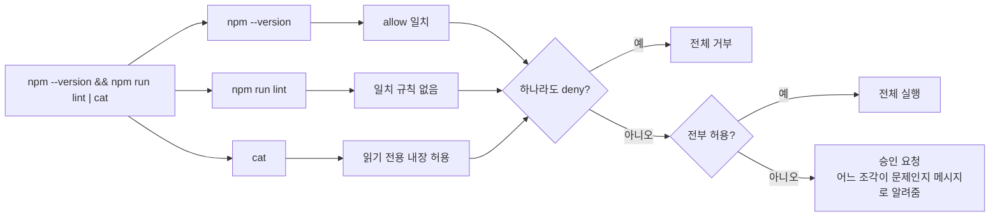
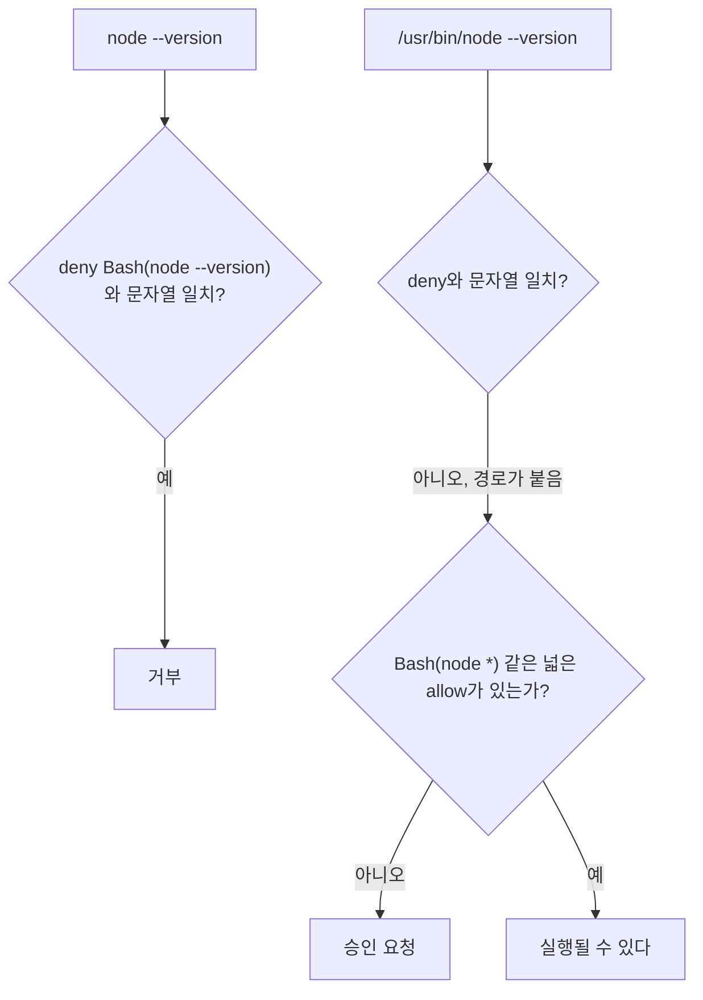
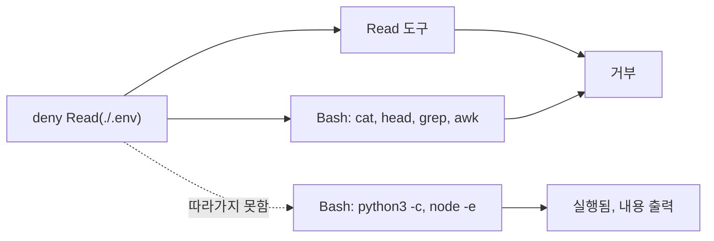
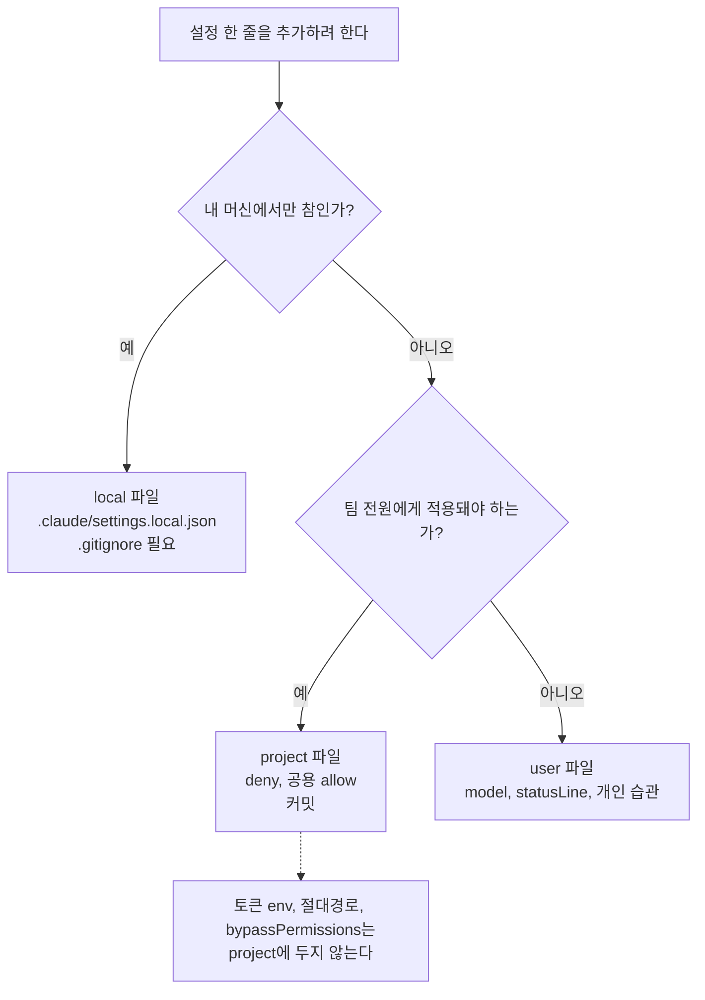

# Claude Code settings.json과 권한 규칙 동작

settings.json 이야기는 [Claude_Code.md](Claude_Code.md) 3.5절, [Claude_Code_Harness.md](Claude_Code_Harness.md) 5절, [Claude_Code_Auto_Mode.md](Claude_Code_Auto_Mode.md)에 조각으로 흩어져 있다. 이 문서는 그 조각을 한곳에 모으고, 규칙이 "분명 맞게 썼는데 안 먹는" 경우를 실제로 돌려서 확인한 결과로 채운다.

규칙 문법을 문서에서 읽고 쓰면 반은 맞고 반은 틀린다. `Bash(npm run test:*)`를 allow에 넣고 `npm run test:unit`이 계속 승인을 묻는 상황이 대표적이다. 아래 내용은 Claude Code 2.1.111에서 `claude -p`로 명령을 한 건씩 던져 허용·거부·승인 요청 중 무엇이 나오는지 본 결과다. 버전이 바뀌면 달라질 수 있어서 `volatility: high`를 붙였다.

## 이 문서의 결과를 얻은 방법

테스트마다 임시 디렉터리를 만들고 `.claude/settings.json`을 직접 써서 넣은 뒤, 모델에게 명령 하나만 실행시켰다.

```bash
export CLAUDE_CONFIG_DIR=/root/cct/case1/home    # user 설정을 테스트 전용 디렉터리로 분리
cd /root/cct/case1
claude -p "Use the Bash tool to run exactly this command and nothing else: node --version" \
  --model haiku --permission-mode default \
  --output-format stream-json --verbose < /dev/null
```

`stream-json` 출력에서 `tool_result`를 보면 결과가 갈린다.

| 결과 | tool_result 문구 |
|---|---|
| 실행됨 | 명령 출력 그대로 |
| deny 규칙에 걸림 | `Permission to use Bash with command ... has been denied.` |
| ask 규칙에 걸림 | `Claude requested permissions to use Bash, but you haven't granted it yet.` |
| 규칙 없음, 기본 모드가 승인을 요구 | `This command requires approval` |

헤드리스 모드에서는 승인 창을 띄울 수 없으니 "승인 요청"이 곧 막힘으로 보인다. 대화형에서는 같은 자리에서 승인 창이 뜬다. ask 규칙과 규칙 없음이 문구로 구분된다는 점은 규칙이 실제로 읽혔는지 확인할 때 쓸 만하다.

`CLAUDE_CONFIG_DIR`을 바꾸지 않으면 `~/.claude/settings.json`이 테스트에 섞인다. `--setting-sources project,local`로 user 계층을 빼는 방법도 있다.

## 설정 파일 네 곳

| 위치 | 용도 | git 커밋 |
|---|---|---|
| managed (Linux: `/etc/claude-code/managed-settings.json`) | 조직이 강제하는 정책. 사용자가 못 바꿈 | 저장소 밖. MDM·배포 도구로 내려보냄 |
| user `~/.claude/settings.json` | 내 모든 프로젝트에 공통인 습관(모델, 자주 쓰는 allow) | 안 함. 홈 디렉터리 |
| project `.claude/settings.json` | 팀이 같이 쓰는 deny, 공용 allow, 공용 env | 커밋 |
| local `.claude/settings.local.json` | 내 머신에서만 필요한 allow, 토큰, 개인 경로 | 커밋 금지. `.gitignore` 필요 |

managed 경로는 OS마다 다르다. 이 문서에서 직접 확인한 건 Linux 경로뿐이다.

### 병합과 우선순위

네 파일이 덮어쓰기로 합쳐지는 게 아니다. 키 종류에 따라 합쳐지는 방식이 세 갈래로 나뉜다.



도식에서 볼 것은 두 가지다. 배열은 계층별로 합쳐지고, 단일 값은 가까운 쪽이 이긴다. managed는 둘 다 위에 선다.

실제로 확인한 내용이다.

- user에 `Bash(node --version)`, project에 `Bash(python3 --version)`, local에 `Bash(npm --version)`을 각각 allow로 넣으면 세 명령이 전부 허용된다. 배열은 이어 붙는다.
- `model`을 user에 `sonnet`, project에 `haiku`로 두면 `haiku`로 뜨고, local에 `opus`를 더하면 `opus`가 된다. `permissions.defaultMode`도 같다. user `acceptEdits`, project `dontAsk`, local `plan`을 넣었더니 `plan`으로 시작했다.
- `env`는 키별로 합쳐진다. user `CCT_U=u`, project `CCT_FOO=project`, local `CCT_FOO=local`과 `CCT_BAR=b`를 넣고 `process.env`를 찍으면 `u local b`가 나온다. managed에 `CCT_FOO=managed`가 있으면 local보다 managed가 이긴다.
- user의 deny는 project의 allow보다 앞선다. project의 deny는 local의 allow보다 앞선다. 어느 계층에 있든 deny가 있으면 막힌다.
- user의 ask도 local의 allow를 눌렀다. 낮은 계층에서 allow를 적어도 상위 계층의 ask는 풀리지 않는다.
- managed의 deny는 project와 local의 allow를 눌렀다. managed에 `allowManagedPermissionRulesOnly: true`를 넣으면 project의 allow(`npm run lint`)가 무시되고 승인 요청으로 돌아갔다.

Harness 문서 5.3절에 "더 가까운 파일이 이긴다"고 적혀 있는데, 이 설명은 단일 값에만 맞다. allow·ask·deny는 가까운 파일이 이기는 구조가 아니고, 전부 모은 뒤에 deny → ask → allow 순으로 판정한다. 그래서 팀 project 파일의 allow를 내 local에서 "취소"하는 방법은 없다. local에 deny나 ask를 추가해 눌러야 한다.

### 하위 디렉터리에서 실행하면 상위 설정을 안 읽는다

`repo/.claude/settings.json`에 deny를 적고 `repo/sub`에서 `claude`를 실행했다. git 저장소로 `git init`을 해둔 상태에서도 deny가 적용되지 않고 명령이 그냥 실행됐다. 설정 파일은 실행한 디렉터리의 `.claude/`만 본다. 모노레포에서 패키지 디렉터리로 들어가 작업하면 루트의 팀 deny가 통째로 빠진 채로 돌아간다. 루트에서 실행하거나 패키지 디렉터리에도 `.claude/settings.json`을 둬야 한다.

## 권한 규칙 문법

규칙은 `도구명` 또는 `도구명(지정자)` 형태이고 `permissions.allow`, `permissions.ask`, `permissions.deny` 세 배열에 넣는다.

```json
{
  "permissions": {
    "allow": ["Bash(npm run test *)", "Bash(git status)", "Read(//opt/shared/docs/**)"],
    "ask":   ["Bash(git push *)"],
    "deny":  ["Bash(rm -rf *)", "Read(.env)", "Edit(**/.env)"]
  }
}
```

### Bash 지정자는 접두 매칭이 아니다

package.json에 `test`, `test:unit`, `testing`, `lint` 스크립트를 두고 규칙 하나씩 넣어 네 명령을 던졌다. 표시는 허용(O), 승인 요청(X)이다.

| 규칙 | npm run test | npm run test -- --watch | npm run test:unit | npm run testing |
|---|---|---|---|---|
| `Bash(npm run test:*)` | O | O | X | X |
| `Bash(npm run test *)` | O | O | X | X |
| `Bash(npm run test*)` | O | O | O | O |

`*`가 없는 규칙은 문자열 하나만 허용한다. allow에 `Bash(npm run lint)`만 넣었을 때 `npm run lint`는 실행됐고 `npm run lint --silent`는 승인 요청이었다. 인자가 하나라도 붙으면 정확 일치가 깨진다.

`:*`와 ` *`는 같은 결과를 낸다. 둘 다 단어 경계를 지켜서 `npm run test`와 `npm run test <인자>`는 잡지만 `npm run test:unit`은 잡지 않는다. 콜론 스크립트(`test:unit`, `build:prod`)를 쓰는 프로젝트에서 `test:*`를 쓰면 승인 창이 계속 뜬다. 이름이 붙은 스크립트를 전부 열려면 공백 없는 `Bash(npm run test*)`를 쓰는데, 이 경우 `testing` 같은 의도하지 않은 스크립트까지 열린다는 점을 감수해야 한다.

Claude_Code.md 3.5절에는 `Bash(npm test)`만 적어도 `npm test -- --coverage`가 통과한다고 적혀 있는데, 위 결과와 맞지 않는다. 인자까지 열려면 `*`가 필요하다.

### 판정 순서

규칙이 겹치면 어느 쪽이 이기는지는 한 건의 도구 호출이 아래 순서로 판정된다고 보면 된다.



도식을 읽을 때 놓치기 쉬운 지점은 ask가 allow보다 앞이고, 내장 자동 허용보다도 앞이라는 점이다. 직접 확인한 내용이다.

- 같은 문자열을 allow와 deny에 모두 넣으면 거부된다.
- allow에 `Bash(python3 *)`, ask에 `Bash(python3 --version)`을 넣으면 `python3 --version`은 승인 요청이다. 규칙이 하나도 없을 때 `python3 --version`은 그냥 실행된다. 읽기 전용으로 분류돼서 그런 듯하다. ask 규칙이 이 내장 허용도 눌렀다.
- `dontAsk`에서는 allow만 통과하고 ask 규칙, 규칙 없는 Bash, Write가 전부 거부됐다.
- `bypassPermissions`에서도 deny는 거부했고 ask 규칙은 승인 요청으로 남았다. root 계정에서도 이 모드로 시작은 됐다. 모드 이름만 보고 "다 풀린다"고 생각하면 틀린다.
- `acceptEdits`에서는 작업 디렉터리 안 파일 쓰기가 허용됐고, 디렉터리 밖 쓰기와 Bash(`npm --version`)는 승인 요청이었다.

### Read와 Edit의 경로 패턴

경로 패턴은 gitignore와 비슷한 규칙으로 해석된다. 별도 표시가 없는 행은 deny에 넣었을 때의 결과다.

| 규칙 | 걸린 것 | 안 걸린 것 |
|---|---|---|
| `Read(.env)`, `Read(./.env)` | `.env`, `sub/.env` (깊이 무관) | |
| `Read(/.env)` | 프로젝트 루트의 `.env` | `sub/.env` |
| `Read(/secrets/**)` | 프로젝트 루트 기준 `secrets/` 아래 전부 | |
| `Read(*.pem)` | `src/k.pem`, `deep/x/y.pem` | |
| `Read(~/cct_home.txt)` | 홈 디렉터리의 그 파일 | |
| `Read(//root/cct/outside/**)` | 절대경로 `/root/cct/outside/` 아래 | |
| `Read(/root/cct/outside2/**)` allow | 없음. 프로젝트 루트 기준으로 해석된다 | `/root/cct/outside2/o.txt` (승인 요청) |
| `Edit(/src/**)` allow | `src/new.txt` | `other/c.txt` |
| `Edit(docs/*.md)` allow | `docs/a.md` | `docs/sub/b.md` |
| `Edit(**/.env)` deny | Write 도구로 `src/.env` 생성도 거부 | |

절대경로를 적을 때 슬래시를 하나만 쓰면 프로젝트 루트 기준 경로로 읽힌다. 파일시스템 절대경로는 `//`로 시작해야 한다. `Read(/Users/me/data/**)`라고 써놓고 왜 안 먹는지 한참 보게 되는 자리다.

`./.env`가 하위 디렉터리의 `.env`까지 잡은 것도 의외였다. 루트만 막으려면 `/.env`로 써야 한다.

Edit 규칙은 Edit 도구만 보는 게 아니다. Write 도구로 새 파일을 만들 때도 같은 규칙이 적용됐다.

같은 파일을 상대경로로 요청하든 절대경로(`/root/cct/rd1/.env`)로 요청하든 같은 규칙에 걸렸다. 경로 표기만 바꿔서 deny를 피할 수는 없다.

작업 디렉터리 안의 Read는 규칙 없이도 열린다. 그래서 `Read` allow는 디렉터리 밖 경로를 열 때만 의미가 있다. 디렉터리 밖 파일은 규칙이 없으면 승인 요청이고, `Read(//절대경로/**)` allow나 아래의 `additionalDirectories`로 연다.

## 같은 의미인데 규칙이 안 먹는 경우

테스트 설정은 allow에 `Bash(npm --version)`과 `Bash(python3 --version)`, deny에 `Bash(node --version)`이다.

### 복합 명령

복합 명령은 하위 명령으로 쪼개서 각각 판정된다.



도식의 핵심은 판정 단위가 명령 한 줄이 아니라 조각이라는 점이다. 결과로 확인한 것들이다.

| 명령 | 결과 |
|---|---|
| `npm --version && python3 --version` | 실행 (두 조각 모두 allow) |
| `npm --version && node --version` | 전체 거부 (한 조각이 deny) |
| `npm --version \| cat` | 실행 |
| `npm --version; python3 --version` | 실행 |
| `cd sub && npm --version` | 실행 (`cd`는 통과) |
| `npm --version && npm run lint` | 승인 요청. `The following part requires approval: npm run lint` |
| `timeout 10 npm --version` | 실행 (`timeout`은 벗겨짐) |
| `npm --version 2>&1` | 실행 |

Harness 문서에는 "셸 메타문자가 들어있으면 룰이 깨진다"고 되어 있는데, 이 버전에서는 `&&`, `;`, `|` 모두 조각별로 풀어서 판정한다. 두 번째 조각에 룰이 없을 때만 막힌다. 반대로 deny는 쪼개져도 살아 있다. `npm --version && node --version`이 통째로 거부됐다.

### 규칙 문자열과 실제 명령이 한 글자 다를 때

문자열로 매칭하니 의미가 같아도 표기가 다르면 안 맞는다.

| 명령 | 결과 | 이유 |
|---|---|---|
| `env FOO=1 npm --version` | 승인 요청 | `env`가 앞에 붙은 명령으로 본다 |
| `FOO=1 npm --version` | 승인 요청 | 환경변수 접두가 붙으면 규칙과 달라진다 |
| `bash -c "npm --version"` | 승인 요청 | 안쪽 문자열은 풀어주지 않는다 |
| `npm --version --help` | 승인 요청 | 정확 일치 규칙에 인자가 늘었다 |
| `/usr/bin/python3 --version` | 승인 요청 | allow가 `python3`로 적혀 있다 |
| `/usr/bin/node --version` | 승인 요청 (deny 아님) | deny가 `node`로 적혀 있다 |



도식은 같은 명령이 표기만 달라서 deny를 비켜가는 경로를 보여준다.

마지막 줄이 가장 불편하다. `Bash(node --version)`을 deny에 넣었는데 `/usr/bin/node --version`은 거부가 아니라 "승인 요청"으로 떨어졌다. 기본 모드에서는 사람이 한 번 보게 되니 즉시 뚫리는 건 아니다. `Bash(node *)` 같은 넓은 allow가 같이 있으면 사정이 달라질 수 있다. 정말 막아야 하는 명령이면 절대경로 표기도 deny에 같이 적거나, 플래그 표기 차이도 적어야 한다.

플래그 표기도 마찬가지다. allow에 `Bash(node *)`, deny에 `Bash(node -e *)`를 두면 `node -e "console.log(1)"`은 거부되지만 `node --eval "console.log(1)"`과 `node -p "1"`은 그대로 실행됐다. `rm -rf`를 막으면서 `rm -fr`를 놓치는 것과 같은 모양이다.

### 따옴표

allow에 `Bash(python3 -c 'print(1)')`를 넣으면 작은따옴표로 쓴 `python3 -c 'print(1)'`만 실행되고, 큰따옴표 `python3 -c "print(1)"`은 승인 요청이다. 인자 내용이 다른 `print(2)`도 승인 요청이다. 규칙을 큰따옴표로 적으면 결과가 뒤집힌다. JSON 안에 큰따옴표를 쓰려면 `\"`로 이스케이프해야 해서 실수가 잦다. 모델은 작은따옴표와 큰따옴표를 가리지 않고 명령을 쓰므로, 따옴표가 낀 명령을 정확 일치로 허용하는 건 오래 못 간다. 와일드카드로 접두만 열어두는 편이 낫다.

명령 치환(`echo $(node --version)`)은 `Contains command_substitution` 메시지와 함께 실행되지 않았다. 모델이 치환 안의 `node --version`을 따로 다시 시도했을 때 deny에 걸렸다. 치환이 낀 명령은 규칙으로 열어두지 않는 쪽이 안전하다.

### Read deny는 Bash 전체를 막지 않는다

`Read(./.env)`를 deny에 넣고 allow에 `Bash(python3 *)`, `Bash(node *)`를 둔 상태에서 `.env`를 읽는 명령을 던졌다.

| 명령 | 결과 |
|---|---|
| `cat .env` | 거부 |
| `head -1 .env` | 거부 |
| `grep A .env` | 거부 |
| `awk '{print}' .env` | 거부 |
| `python3 -c "print(open('.env').read())"` | 실행됨, 내용 출력 |
| `node -e "console.log(require('fs').readFileSync('.env','utf8'))"` | 실행됨, 내용 출력 |



도식에서 점선이 deny가 닿지 않는 경로다.

`cat` 같은 흔한 읽기 명령은 Read deny가 따라온다. 스크립트 언어로 읽는 건 막지 못한다. Read deny는 실수를 줄이는 장치이고 샌드박스가 아니다. 시크릿 접근을 정말 막으려면 시크릿을 작업 환경에 두지 않는 쪽이 맞다. 또 `python3 *`, `node *`처럼 인터프리터 전체를 allow에 넣는 순간 deny의 의미가 크게 줄어든다.

### settings.json 자체가 틀렸을 때

가장 조용한 실패다. `Bash(node --version)`을 deny에 넣은 settings.json을 아래처럼 망가뜨려서 돌렸다.

| settings.json | 결과 |
|---|---|
| `"deny": ["Bash(node --version)",]` (끝에 쉼표) | 규칙 무시, 명령 실행 |
| `"deny": "Bash(node --version)"` (배열이 아니라 문자열) | 규칙 무시, 명령 실행 |
| `"permission": {...}` (`permissions` 오타) | 규칙 무시, 명령 실행 |
| 배열 안 다른 항목이 `"Bash(node:--version"` (괄호 누락) | 그 항목만 무시, 정상 항목은 거부 |
| `permissions` 대신 최상위에 `defaultMode` | 무시, 모드는 default |

헤드리스에서 stderr에는 아무 경고도 나오지 않았다. 쉼표 하나 때문에 팀 deny 전체가 꺼진 채 몇 주 쓰는 일이 실제로 생길 수 있다. 커밋하기 전에 `python3 -m json.tool .claude/settings.json`으로 문법을 한 번 보고, deny를 새로 넣었으면 그 명령을 실제로 던져서 거부되는지 본다.

`defaultMode`는 `permissions` 안에 들어간다. `{"permissions": {"defaultMode": "acceptEdits"}}`로 쓰면 `acceptEdits`로 시작하지만, 최상위에 두면 아무 일도 일어나지 않는다.

## additionalDirectories, defaultMode, env, 모델

### additionalDirectories

작업 디렉터리 밖 경로를 같은 세션에서 쓰게 해준다. 배열이고 `permissions` 안에 둔다.

```json
{
  "permissions": {
    "defaultMode": "acceptEdits",
    "additionalDirectories": ["../shared-docs"]
  }
}
```

확인한 동작은 이렇다. 기본 모드에서 `additionalDirectories`에 넣은 경로의 Read는 허용됐지만 Write는 승인 요청이었다. `acceptEdits`와 같이 쓰면 Write도 허용됐다. 목록에 없는 디렉터리는 `acceptEdits`여도 쓰기가 승인 요청이다. 프로젝트 디렉터리 기준 상대경로 `../outside3`가 동작했다.

### defaultMode

`permissions.defaultMode`는 판정 도식 맨 아래 분기를 정한다. 설정 파일로는 `acceptEdits`, `plan`, `dontAsk`가 그대로 적용되는 것을 확인했다. `bypassPermissions`는 `--permission-mode` 플래그로 시작해서 확인했다. 이 문서의 `defaultMode` 테스트는 플래그를 빼고 돌렸다. 플래그를 같이 주었을 때 어느 쪽이 이기는지는 돌려보지 않았다.

팀 project 파일에 `bypassPermissions`를 넣지 않는다. 한 사람이 편해지려고 넣은 값이 팀 전체의 기본 모드가 된다. deny와 ask는 이 모드에서도 살아 있지만, 그 둘이 못 막는 범위가 훨씬 넓다.

### env

`env`는 Claude Code가 실행하는 도구 프로세스의 환경변수다. 키 단위로 병합되고 같은 키는 local이 project를 이긴다. 확인은 `node -e "console.log(process.env.X)"`로 했다. 설정 파일에 넣은 값이 셸에서 `export`한 것처럼 쓰인다는 뜻이라, 프로젝트별 `AWS_PROFILE`이나 `NODE_ENV` 같은 값은 여기에 두면 편하다. 토큰은 project 파일에 넣지 않는다.

### 모델과 statusLine

`model`은 단일 값이라 local > project > user 순으로 이긴다. 팀 project 파일에 `model`을 고정하면 개인이 user 설정에 고른 모델이 덮이니, 정말 필요한 프로젝트가 아니면 두지 않는다.

`statusLine`은 `{"statusLine": {"type": "command", "command": "~/.claude/statusline.sh"}}` 형태로 쓰는 것으로 알고 있지만, 헤드리스 모드에서는 상태줄이 그려지지 않아 이 문서에서 렌더 결과는 확인하지 못했다. 단일 값이므로 병합 규칙은 위와 같다고 보면 되는데 이 부분도 직접 돌려보지 않았다.

## 팀 설정을 커밋할 때

project 파일과 local 파일을 가르는 기준은 "이 줄이 내 머신에서만 참인가"이다.

| 항목 | project (커밋) | local (비커밋) |
|---|---|---|
| deny (`rm -rf`, `git push --force`, 시크릿 Read) | 둔다. 모두에게 적용돼야 의미가 있다 | |
| 팀이 공유하는 읽기·테스트 allow (`npm run test *`) | 둔다 | |
| 내 편의용 allow (`Bash(git push *)`, `Bash(docker *)`) | | 둔다 |
| 토큰, 접속 정보가 든 `env` | 금지 | 둔다 |
| `//Users/me/...` 같은 절대경로 | 금지. 남의 머신에서는 안 맞다 | 둔다 |
| `model`, `statusLine` | 보통 두지 않는다 | user 파일에 둔다 |
| `bypassPermissions` | 금지 | 격리된 환경에서만 |



도식은 한 줄이 어느 파일로 가야 하는지 가르는 질문 순서다.

이 기준을 몰라서 생긴 실수를 정리해 둔다.

**내 allow가 project 파일에 들어간 경우.** 병합이 이어 붙기라서 팀원 전부에게 같은 allow가 생기고, 팀원이 local에서 뺄 방법이 없다. 눌러야 하면 local에 deny나 ask를 추가해야 한다. 개인 편의로 `Bash(git push *)` 같은 걸 열었다면 그게 팀의 기본값이 된다.

**local 파일이 커밋된 경우.** `.claude/settings.local.json`을 직접 만들어서 `git status`를 보면 `.claude/`가 그냥 untracked로 뜬다. 저절로 무시되지 않았다. `.gitignore`에 한 줄을 넣고 확인한다.

```bash
echo ".claude/settings.local.json" >> .gitignore
git check-ignore -v .claude/settings.local.json
# .gitignore:1:.claude/settings.local.json   .claude/settings.local.json
```

`git check-ignore`가 아무것도 출력하지 않고 종료 코드 1이면 무시되지 않는 상태다.

**설정 파일 문법 오류.** 앞 절의 쉼표 하나로 deny 전체가 꺼지는 경우다. PR 리뷰에서 diff만 보면 눈에 안 들어온다. CI에서 JSON 문법 검사를 돌리면 막을 수 있다.

**하위 디렉터리 실행.** 루트 `.claude/settings.json`의 deny가 `packages/api`에서 실행할 때는 없는 것과 같다. 팀 규칙을 모노레포 전체에 걸려면 각 패키지에도 두거나 실행 위치를 루트로 통일한다.

**deny 표기 누락.** `Bash(rm -rf *)`만 deny에 넣고 `rm -fr`, `rm --recursive --force`를 안 넣은 경우다. 이 저장소에서 같은 모양을 `node -e`와 `node --eval`로 확인했다. 규칙은 문자열 하나만 막는다.

조직 차원에서 deny를 강제하고 싶으면 managed 파일에 두고 `allowManagedPermissionRulesOnly`를 켠다. 켜는 순간 project와 local의 allow가 전부 무시되므로, 개발자들이 쓰던 allow를 managed로 옮겨야 한다. 안 옮기면 모든 명령에 승인 창이 뜬다.
