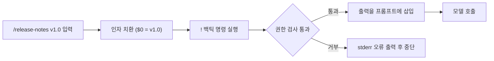
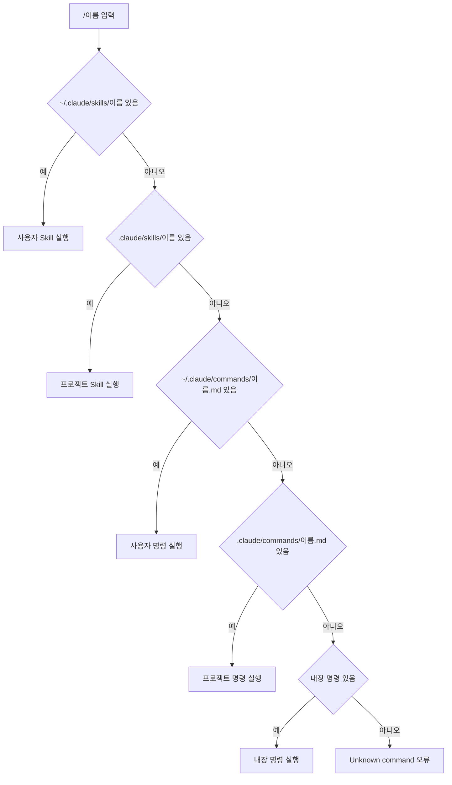
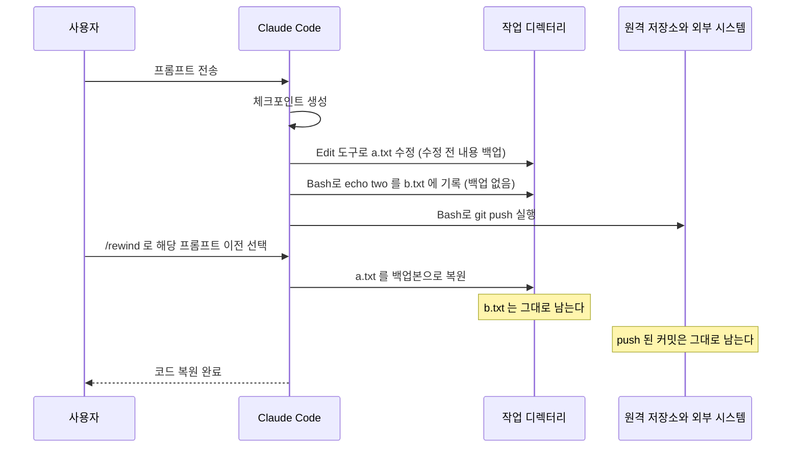

# Claude Code 슬래시 명령과 커스텀 명령

슬래시 명령은 `/`로 시작하는 입력이다. 겉보기에는 전부 같은 종류인데 실제로는 세 가지가 섞여 있다. 모델을 거치지 않고 Claude Code 자체가 처리하는 명령(`/clear`, `/model`), 정해진 프롬프트를 모델에 넘기는 내장 명령(`/review`, `/init`), 사용자가 마크다운 파일로 만든 명령이다. 앞의 둘은 토큰을 쓰는지가 다르고, 뒤의 둘은 구조가 같다. 이 구분을 알면 "왜 이 명령은 응답이 즉시 오고 저 명령은 한참 걸리는지", "내가 만든 명령이 왜 안 불리고 다른 게 불리는지"가 설명된다.

이 문서는 세 가지를 다룬다. 내장 명령을 용도별로 묶어 두고, `.claude/commands/`의 마크다운 파일이 명령이 되는 규칙과 이름이 겹칠 때 어느 쪽이 실행되는지를 정리하고, `/rewind`가 되돌리는 범위와 못 되돌리는 범위를 구분한다. 이름 충돌 순서, `$1`의 인덱스, `!` 백틱 실행, `/rewind` 동작은 설치된 Claude Code 2.1.111을 `/tmp`의 임시 프로젝트에서 직접 돌려 확인했다. 확인한 것과 소스(`cli.js`)에서만 읽은 것은 본문에서 구분해 적었다. 버전이 바뀌면 달라질 수 있는 항목이라 frontmatter에 `volatility: high`를 달았다.

---

## 내장 명령은 용도별로 외운다

내장 명령은 40개가 넘는다. 전부 외울 필요는 없고, 하루에 쓰는 것은 대여섯 개다. 용도별로 묶으면 표 하나로 줄어든다.

| 분류 | 명령 | 하는 일 | 메모 |
|---|---|---|---|
| 세션 관리 | `/clear` | 빈 컨텍스트로 새 세션 시작 | 별칭 `/reset`, `/new`. 이전 세션은 디스크에 남아서 `/resume`으로 돌아간다 |
| | `/compact [지시]` | 대화를 요약으로 압축 | 지시를 안 주면 어떤 파일을 왜 고쳤는지가 빠지는 경우가 있다 |
| | `/resume [id나 검색어]` | 이전 대화 복귀 | 별칭 `/continue` |
| | `/rewind` | 코드와 대화를 이전 시점으로 복원 | 별칭 `/checkpoint`, `/undo`. 아래 절에서 자세히 |
| | `/branch [이름]` | 현재 지점에서 대화 분기 | 별칭 `/fork` |
| 상태 | `/context` | 컨텍스트 사용량 표시 | 비대화형(`-p`)에서도 동작 |
| | `/cost` | 세션 비용과 시간 | 계정 종류에 따라 숨겨진다. 구독 로그인이면 `/usage`가 대신 보인다 |
| | `/status` | 버전, 모델, 계정, 연결 상태 | |
| | `/stats` | 사용 통계 | |
| 설정 | `/model` | 모델 변경 | [모델 선택](Claude_Code_Model.md) 참조 |
| | `/permissions` | 허용·거부 규칙 관리 | 별칭 `/allowed-tools`. [설정과 권한](Claude_Code_Settings_Permissions.md) 참조 |
| | `/config` | 설정 패널 | |
| | `/memory`, `/hooks`, `/mcp`, `/agents` | 메모리 파일 편집, 훅 조회, MCP 서버 관리, 에이전트 관리 | |
| 작업 | `/review` | PR 리뷰 | 프롬프트형. 모델 턴을 쓴다 |
| | `/init` | CLAUDE.md 생성 | 프롬프트형 |
| | `/security-review` | 현재 브랜치 변경분 보안 검토 | 프롬프트형 |
| | `/plan`, `/diff`, `/export` | 플랜 모드 진입, 미커밋 변경과 턴별 diff 보기, 대화 내보내기 | |

`/clear`와 `/compact`의 차이는 [개발 루틴](Claude_Code_Routine.md)에서 다뤘다. 한 줄로 줄이면 `/clear`는 이전 작업과 관계없는 일을 시작할 때, `/compact`는 같은 작업을 이어가야 할 때 쓴다.

로컬 명령과 프롬프트형의 차이는 비용으로 나타난다. `/context`를 쳐도 토큰이 들지 않지만, `/review`는 일반 프롬프트를 보낸 것과 같아서 모델 턴이 하나 소모되고 컨텍스트에도 쌓인다. 컨텍스트가 빠듯한 상태에서 `/review`를 치면 그 응답이 쌓여 압축 시점이 당겨진다. 상태를 확인하려고 `/context`를 먼저 보는 습관이 여기서 의미가 있다.

로컬 명령 중 일부는 `-p`(비대화형) 모드에서 동작하지 않는다. 소스에서 `/clear`와 `/rewind`는 `supportsNonInteractive: false`로 되어 있다. CI에서 `claude -p "/clear"`를 쓰는 스크립트가 있다면 의미가 없다. `-p`는 호출마다 새 세션이다.

---

## 명령 파일 하나가 명령 하나다

### 위치와 이름

`.claude/commands/review-api.md`를 만들면 `/review-api`가 생긴다. 파일 이름에서 `.md`를 뗀 것이 명령 이름이다. 위치는 두 곳이다.

| 위치 | 범위 | 커밋 |
|---|---|---|
| `.claude/commands/` | 해당 프로젝트 | 한다. 팀이 같은 명령을 쓴다 |
| `~/.claude/commands/` | 내 모든 프로젝트 | 해당 없음 |

서브디렉터리는 네임스페이스가 된다. `.claude/commands/git/ship.md`는 `/ship`이 아니라 `/git:ship`이다. 구분자는 콜론이고, 디렉터리가 두 단계면 `a/b/c.md`가 `/a:b:c`가 된다. 비대화형 모드의 초기화 메시지에 `slash_commands` 목록이 나오는데, 여기에 `git:ship`이 그대로 찍혔다.

팀 공유 명령은 서브디렉터리에 넣는 편이 낫다. 이름이 겹칠 때 개인 명령이 이기는 규칙(다음 절) 때문에, 프로젝트에 `review.md`를 두면 누군가 개인 디렉터리에 같은 이름을 만든 순간 팀 명령이 가려진다. `team/review.md`는 `/team:review`라서 겹칠 일이 거의 없다.

### frontmatter

frontmatter는 전부 선택이다. 소스에서 읽히는 키 중 명령에서 쓸 만한 것만 추렸다.

| 키 | 역할 | 비고 |
|---|---|---|
| `description` | 자동완성에 보이는 설명 | 생략하면 본문 첫 줄이 쓰인다 |
| `argument-hint` | 입력창에 보이는 인자 힌트 | `[이전 태그]` 처럼 적는다. 인자 치환에는 관여하지 않는다 |
| `allowed-tools` | 이 명령이 도는 동안 허용할 도구 | `Bash(git diff:*)` 형식. `!` 백틱 실행의 권한 검사에도 쓰인다 |
| `model` | 이 명령만 다른 모델로 실행 | 별칭이나 모델 ID. `inherit`면 현재 모델을 유지한다 |
| `disable-model-invocation` | 모델이 이 명령을 스스로 부르지 못하게 막음 | "커스텀 명령과 Skill" 절 참조 |

`description`을 비워두면 본문 첫 줄이 설명이 된다. 본문이 "## 스테이징된 변경"으로 시작하는 명령은 자동완성 목록에 "## 스테이징된 변경"이라고 보인다. 명령이 열 개를 넘으면 이름만으로는 구분이 안 되니 `description`은 적어두는 편이 낫다.

### 인자 치환

`/args foo bar baz`로 호출하면 본문의 자리표시자가 치환된다. 이 저장소에서 확인한 규칙이다.

| 자리표시자 | 결과 |
|---|---|
| `$ARGUMENTS` | `foo bar baz` (입력 전체) |
| `$0` | `foo` |
| `$1` | `bar` |
| `$ARGUMENTS[0]`, `$ARGUMENTS[1]` | `foo`, `bar` |

`$1`이 첫 인자가 아니다. 인덱스가 0부터 시작해서 `$0`이 첫 인자이고 `$1`은 둘째다. 셸 스크립트 습관으로 `$1`을 첫 인자라고 쓰면 인자가 한 칸씩 밀려서 첫 인자가 통째로 무시된다. 처음 `$1`을 썼을 때 `FIRST=[bar]`가 나와서 알았다.

따옴표는 셸처럼 처리된다. `/quo "hello world" second`로 부르면 `$0`이 `hello world`, `$1`이 `second`다. 공백이 든 인자를 넘길 때는 따옴표로 묶는다.

본문에 자리표시자가 하나도 없으면 인자는 버려지지 않고 프롬프트 맨 끝에 `ARGUMENTS: alpha beta` 한 줄로 붙는다. 인자를 받는 명령인데 본문에 `$ARGUMENTS`를 안 적었어도 모델은 인자를 본다. 다만 어디에 쓰라는 지시가 없으니 모델이 알아서 해석한다. 위치를 정하고 싶으면 본문에 자리표시자를 적는다.

### `!` 백틱으로 셸 결과를 프롬프트에 넣는다

본문에서 느낌표 바로 뒤에 백틱으로 감싼 명령은 모델이 프롬프트를 받기 전에 실행되고, 출력이 그 자리에 들어간다. 모델이 `git diff`를 도구로 호출하는 턴을 쓰지 않아도 되는 것이 장점이다.



인자 치환이 먼저 끝난 뒤에 셸 명령이 실행된다. ``!`git log $0..HEAD` ``에서 `$0`이 `v1.0`으로 바뀌어 `git log v1.0..HEAD`가 실행되는 것을 확인했다. 권한 검사에 걸리면 모델은 호출되지 않는다. 실제로 ``!`touch made.txt` ``를 넣은 명령을 `-p`로 돌리면 `Shell command permission check failed for pattern ...` 오류가 stderr로만 나오고, 종료 코드는 0이고, 결과 문자열은 비어 있고, API 호출은 없다. CI에서 이 명령을 돌리면 성공한 것처럼 보이는데 아무 일도 안 한 상태가 된다.

`allowed-tools: Bash(touch:*)`를 달아도 같은 오류가 났다. 작업 디렉터리 안의 파일인데도 막혔고 원인은 더 파지 않았다. 확인된 것은 읽기 전용 명령(`git diff`, `git log`, `git status`, `echo`)은 `allowed-tools`로 명시해 두면 안정적으로 통과한다는 점이다. 파일을 만들거나 바꾸는 명령은 `!` 백틱에 넣지 말고, 모델이 도구로 수행하는 지시문으로 쓰는 쪽이 낫다.

---

## 이름이 겹치면 누가 이기는가

프로젝트에 `.claude/commands/status.md`를 만들고 `/status`를 쳤다. 내장 상태 화면이 아니라 내 파일이 실행됐다. 자동완성 목록에는 내장 `/status`가 먼저, 같은 이름의 커스텀이 그다음에 보이는데 실행되는 것은 커스텀이었다.

같은 이름을 여러 곳에 만들어 놓고 하나씩 지워가며 어느 것이 실행되는지 확인했다. 결과는 직관과 반대인 부분이 있다.

| 상황 | 실행된 것 |
|---|---|
| 사용자 `commands/dup.md`와 프로젝트 `commands/dup.md` | 사용자 |
| 프로젝트 `skills/both/`와 프로젝트 `commands/both.md` | Skill |
| 사용자 `skills/both/`와 프로젝트 `skills/both/` | 사용자 |
| 사용자 `commands/cmdsame.md`와 프로젝트 `skills/cmdsame/` | 프로젝트 Skill |
| 프로젝트 `commands/status.md`와 내장 `/status` | 커스텀 |
| 프로젝트 `commands/cost.md`와 내장 `/cost` | 커스텀 (`-p` 모드) |

정리하면 한 줄이다. 사용자가 프로젝트보다 먼저이고, Skill이 commands보다 먼저이고, 커스텀이 내장보다 먼저다. 소스에서도 이름 조회가 `Array.find`로 첫 일치를 고르고, 목록이 번들 Skill, 관리형·사용자·프로젝트 Skill 디렉터리, 레거시 commands, 플러그인, 내장 명령 순서로 이어 붙여진다.



도식은 위 실험 표의 결과를 소스의 목록 순서로 이어 붙인 것이다. 플러그인 명령과 번들 Skill의 위치는 실험하지 않았고 소스 기준이다. 번들 Skill(`/simplify`, `/batch`, `/loop` 등)은 목록에서 가장 앞에 오므로 같은 이름의 커스텀이 이들을 가리지는 못할 가능성이 높지만 돌려보지는 않았다.

이 순서에서 실무에 영향을 주는 것이 두 가지 있다.

첫째, 내장 명령을 의도치 않게 덮어쓸 수 있다. `/review`나 `/init`처럼 흔한 이름으로 팀 명령을 만들면 내장 `/review`가 사라진다. 경고도 없다. 팀 명령을 `/team:review`처럼 네임스페이스 아래 두면 피한다.

둘째, 개인 설정이 팀 설정을 조용히 가린다. 한 사람이 `~/.claude/commands/test.md`를 갖고 있으면 저장소에 커밋된 `/test`가 그 사람에게만 다르게 동작한다. "내 환경에서는 되는데"의 원인이 되는 패턴이라, 명령이 이상하게 동작하면 같은 이름이 사용자 디렉터리에 있는지부터 본다.

---

## 커스텀 명령과 Skill

소스에서 `.claude/commands/`의 파일은 내부적으로 `commands_DEPRECATED`라는 출처로 표시되고, Skill과 같은 목록에 합쳐진다. 두 가지는 같은 프롬프트형 객체로 만들어지고 frontmatter 해석 함수도 하나다. `allowed-tools`, `model`, `argument-hint`가 양쪽에서 똑같이 동작하는 이유다. 2.1.111에서 commands가 동작하지 않는 일은 없었다. 소스가 commands를 deprecated로 표시하고 있으니, 새로 만든다면 Skill 쪽으로 가는 편이 안전하다.

차이는 세 가지다.

| 항목 | 커스텀 명령 | Skill |
|---|---|---|
| 형태 | 마크다운 파일 하나 | 디렉터리 하나(`SKILL.md` + 부속 파일) |
| 부속 파일 | 없음 (본문에 다 넣는다) | 스크립트, 템플릿, 참고 문서를 같이 둔다 |
| 모델의 자동 호출 | `description`으로 선택될 수 있으나 명령으로 의도된 것 | `description` 매칭이 핵심 기능이다 |

"명령은 사람이 치는 것이고 Skill은 모델이 고르는 것"이라는 구분은 정확하지 않다. 소스에서 모델이 쓰는 `Skill` 도구가 명령 목록 전체에서 이름을 찾고, 거부될 때의 메시지가 `cannot be used with Skill tool due to disable-model-invocation`이다. 즉 `disable-model-invocation: true`를 달지 않은 커스텀 명령은 모델이 대화 중에 스스로 부를 수 있다. 배포나 DB 삭제처럼 사람이 직접 쳤을 때만 돌아야 하는 명령에는 이 키를 반드시 단다.

선택 기준은 이렇게 잡는다.

- 프롬프트 한 덩어리이고 내가 직접 칠 때만 쓰면 명령 파일이면 충분하다. 파일 하나라서 PR 리뷰에서 diff를 읽기도 쉽다.
- 스크립트나 템플릿 파일이 같이 필요하면 Skill이다. 명령에는 부속 파일을 둘 자리가 없어서 본문에 긴 템플릿을 박게 되고, 그러면 명령을 부를 때마다 그 길이만큼 컨텍스트에 들어간다.
- 모델이 상황을 보고 알아서 불러야 하면 Skill이고 `description`에 트리거 조건을 적는다. [스킬과 룰 시스템](Claude_Code_Skill_Rule.md)에 작성법이 있다.
- 같은 이름이 양쪽에 있으면 Skill이 이기므로, 명령을 Skill로 옮길 때 옛 `.md`를 지우지 않으면 어느 쪽이 도는지 헷갈린다.

### 다른 확장 수단과의 비교

명령과 Skill 말고도 비슷한 자리에 쓰이는 수단이 둘 더 있다. 훅과 서브에이전트다. 무엇을 보장해야 하는지에 따라 갈린다.

| 항목 | 커스텀 명령 | Skill | Hook | 서브에이전트 |
|---|---|---|---|---|
| 정의 | `.claude/commands/*.md` | `.claude/skills/*/SKILL.md` | `settings.json`의 `hooks` | `.claude/agents/*.md` |
| 실행을 결정하는 쪽 | 사용자가 `/명령`으로 | 사용자 또는 모델 | 도구 호출·세션 이벤트가 자동으로 | 모델이 위임하거나 사용자가 지정 |
| 모델 판단 개입 | 있음. 프롬프트를 받아 수행한다 | 있음 | 없음. 셸 스크립트가 결정한다 | 있음. 별도 컨텍스트에서 수행 |
| 실행 보장 | 사용자가 치지 않으면 안 돈다 | `description` 매칭에 의존해서 안 불릴 수 있다 | 이벤트가 오면 항상 | 위임 여부는 모델 판단 |
| 컨텍스트 | 메인 대화에 합쳐진다 | 메인 대화에 합쳐진다 | 메인에 영향 없음 (출력은 선택적으로 전달) | 분리된다. 요약만 돌아온다 |
| 맞는 용도 | 자주 치는 지시문 | 부속 파일이 붙는 반복 절차 | "항상 막아야 하는" 규칙 | 탐색·조사처럼 중간 결과가 큰 작업 |

"커밋 전에 린트를 돌려라"가 대표적인 선택 갈림길이다. 명령으로 만들면 치는 걸 잊은 날 린트가 안 돈다. Skill로 만들면 모델이 매번 알아보는 게 아니라서 같은 일이 생긴다. 반드시 돌아야 하면 훅이다. 반대로 훅은 "이번 변경 범위를 보고 리뷰 관점을 정하라"처럼 판단이 필요한 일에는 맞지 않는다. 훅은 [Hooks 문서](Claude_Code_Hooks.md), 서브에이전트는 [Agent 시스템](Claude_Code_Agent.md)에 따로 정리했다.

---

## 체크포인트와 /rewind

Claude Code는 파일을 편집하기 전에 그 파일의 이전 내용을 백업해 둔다. 사용자 프롬프트 하나가 체크포인트 하나다. `/rewind`(또는 `Esc`를 두 번)로 열면 프롬프트 목록이 나오고, 하나를 고르면 그 프롬프트를 보내기 직전 상태로 돌아간다.

선택지는 네 가지다.

| 선택지 | 코드 | 대화 |
|---|---|---|
| Restore code and conversation | 복원 | 복원 |
| Restore conversation | 그대로 | 복원 |
| Restore code | 복원 | 그대로 |
| Summarize from here | 그대로 | 선택 지점부터의 대화를 요약으로 바꿈 (소스상 요약 단계가 있고 직접 실행은 안 해봤다) |

되돌려지는 범위가 핵심이다. 아래 도식은 한 번의 프롬프트에서 Edit 도구, Bash, 외부 시스템이 각각 어떻게 다뤄지는지 보여준다. 체크포인트가 만들어지는 것은 Edit 계열 도구가 파일을 건드릴 때뿐이다.



직접 확인한 실험은 이렇다. 한 프롬프트로 "Write로 a.txt에 one 작성, Bash로 `echo two > b.txt`, Edit로 a.txt를 three로 수정"을 시켰다. `/rewind`를 열면 이 프롬프트 옆에 `a.txt +2 -1`이 표시됐고 `b.txt`는 집계에 없었다. 코드를 복원하자 a.txt는 파일째 삭제됐고(이 프롬프트가 만든 파일이라 이전 상태가 "없음"이다), b.txt는 `two`가 든 채로 남았다. 확인 화면에도 `Rewinding does not affect files edited manually or via bash.`라는 경고가 떠 있다.

범위를 표로 보면 이렇다.

| 대상 | 되돌려지는가 | 이유 |
|---|---|---|
| Edit·Write 도구로 바꾼 파일 | 된다 | 편집 전에 백업을 남긴다 |
| 이 프롬프트가 새로 만든 파일 | 삭제된다 | 이전 상태가 "없음"이다 |
| Bash로 바꾼 파일 (`sed -i`, 리다이렉션, `mv`, 포매터) | 안 된다 | 셸 안에서 일어난 일이라 추적하지 않는다 |
| 직접 손으로 편집한 파일 | 안 된다 | Claude Code가 모르는 변경이다 |
| `git commit`, `git push` | 안 된다 | 저장소와 원격의 상태다 |
| DB 마이그레이션, 외부 API 호출, 배포 | 안 된다 | 파일 시스템 바깥이다 |

여기서 가장 자주 당하는 것은 Bash 변경이다. Claude가 `sed -i`로 여러 파일의 이름을 바꾸거나 `eslint --fix`, `prettier --write`로 포맷을 일괄 적용하면 `/rewind`로는 하나도 돌아오지 않는다. 대규모 변경을 시키기 전에는 먼저 커밋하거나 `git stash`로 현재 상태를 잡아 둔다. 체크포인트는 git을 대체하는 것이 아니라 "방금 Edit한 몇 개 파일을 되돌리는 단기 undo"로 쓰는 것이 맞다.

한 프롬프트 안에서 Edit와 Bash가 같은 파일을 건드린 경우의 복원 결과는 돌려보지 않았다. 백업본으로 파일 전체를 덮어쓴다면 Bash가 넣은 변경도 같이 사라질 것이다. 이런 상황이 걱정되면 `/rewind` 전에 `git diff > /tmp/before.patch`로 현재 상태를 저장해 둔다.

`/rewind`는 `-p` 모드에서 동작하지 않는다. 대화형에서만 쓰는 명령이다.

---

## 실무에서 쓰는 명령 세 개

세 개 모두 `!` 백틱으로 읽기 전용 git 명령만 쓴다. 쓰기 작업은 명령 안에서 하지 않고 모델에게 지시한다. 아래 예제는 임시 git 저장소에서 실제로 실행해서 의도한 출력이 나오는 것을 확인했다.

### 커밋 메시지 제안

`.claude/commands/commit-msg.md`

```markdown
---
description: 스테이징된 변경으로 커밋 메시지만 제안한다 (커밋은 하지 않음)
allowed-tools: Bash(git diff:*), Bash(git log:*), Bash(git status:*)
argument-hint: [범위나 이슈 번호]
---
## 스테이징된 변경
!`git diff --staged --stat`
!`git diff --staged`

## 최근 커밋 형식
!`git log --oneline -5`

위 변경에 맞는 커밋 메시지를 최근 커밋 형식에 맞춰 한 개만 제안해라.
추가 맥락: $ARGUMENTS
커밋은 실행하지 마라. 메시지 한 줄만 출력해라.
```

`git log --oneline -5`를 같이 넣는 이유는 팀의 접두사 규칙(`feat:`, `fix:` 등)을 모델에게 따로 설명하지 않아도 되기 때문이다. 최근 커밋이 그 규칙을 보여준다. 스테이징한 변경이 크면 `git diff --staged`가 컨텍스트를 많이 차지하는데, 그 경우 `--stat`만 남기고 두 번째 줄을 지운다.

### 릴리스 노트 초안

`.claude/commands/release-notes.md`

```markdown
---
description: 직전 태그부터 HEAD까지 릴리스 노트 초안을 만든다
argument-hint: [이전 태그]
allowed-tools: Bash(git log:*), Bash(git diff:*)
---
범위: $0..HEAD
!`git log --no-merges --pretty=format:'%h %s' $0..HEAD`

위 커밋을 기능, 수정으로 나눠 한 줄씩 정리해라. 설명 없이 목록만 출력해라.
```

`/release-notes v1.0`으로 부른다. `$0`이 이전 태그다. 인자를 빼먹으면 `$0`이 빈 문자열로 치환되고(`echo "[$0]"`가 `[]`를 출력하는 것으로 확인했다) 명령은 `git log ..HEAD`로 실행된다. 에러 없이 진행된다는 점이 문제다. 인자 없이 `/release-notes`를 돌렸을 때는 빈 입력을 받은 모델이 스스로 범위를 짐작해서 목록을 채웠고, 그 범위가 의도한 것인지는 알 수 없다. 본문에 "커밋 목록이 비어 있으면 '범위 없음'이라고만 출력해라"를 넣어 두면 짐작해서 채우는 일을 막는다.

### 팀 리뷰

`.claude/commands/team/review.md` (명령은 `/team:review`)

```markdown
---
description: 현재 브랜치 변경을 팀 기준으로 리뷰한다
allowed-tools: Bash(git diff:*), Bash(git status:*)
argument-hint: [비교 대상 브랜치, 기본 main]
---
!`git status --short`
!`git diff $0...HEAD --stat`

위 변경 파일 중 소스 파일만 골라 읽고 다음 순서로 지적해라.
1. 동작이 바뀌는데 테스트가 없는 곳
2. 트랜잭션 경계, 재시도, 타임아웃이 빠진 외부 호출
3. 로그에 개인정보나 토큰이 남을 수 있는 곳

문제가 없는 항목은 쓰지 마라. 라인 번호와 파일 경로를 붙여라.
```

이름을 `review`가 아니라 `team/review`로 둔 이유는 앞서 본 대로 내장 `/review`를 가리지 않으려는 것이다. 지적 기준을 세 가지로 좁힌 이유는 "코드를 리뷰해라" 같은 열린 지시는 스타일 지적으로 응답이 채워지기 때문이다. 팀에서 실제로 장애를 낸 유형만 적어 두는 쪽이 쓸모 있다.

이 명령은 `$0`을 비교 대상 브랜치로 쓴다. 인자 없이 부르면 `$0`이 비어서 `git diff ...HEAD`가 실행된다. "`$0`이 비면 main을 쓰라"는 지시를 본문에 적어도 소용이 없다. `!` 백틱은 모델이 프롬프트를 읽기 전에 이미 실행되기 때문이다. 기본값이 필요하면 `git diff $0...HEAD` 대신 `git diff main...HEAD`로 고정하고 인자를 받지 않는다.
