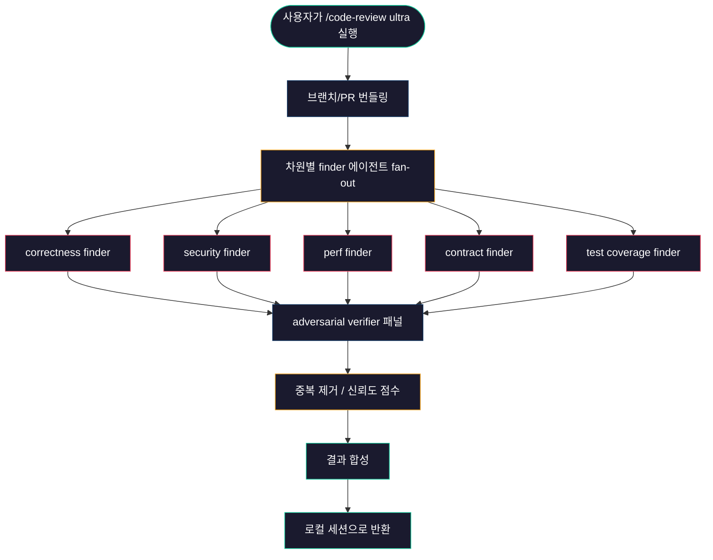

# Claude Code Ultra Review

## 1. /code-review ultra가 뭔가

Claude Code에 내장된 `/code-review` 슬래시 커맨드는 effort 수준을 인자로 받는다. `low`, `medium`, `high`, `max`, `ultra` 다섯 단계가 있다. 앞의 네 개는 현재 세션의 모델이 로컬에서 diff를 훑고 결과를 바로 띄운다. 마지막 `ultra`만 동작이 다르다.

`/code-review ultra`는 현재 브랜치를 통째로 묶어서 Anthropic 클라우드로 보낸다. 거기서 여러 에이전트가 차원별로 fan-out 리뷰를 돌리고, 각 발견 항목을 다른 에이전트가 다시 반증하는 식으로 검증한다. 합성된 결과가 다시 로컬 세션으로 돌아온다. 한 번 돌리면 보통 3~10분이 걸리고 토큰 비용도 같은 diff를 로컬 `high`로 돌릴 때 대비 5~15배 든다. 그만큼 잡아내는 게 다르다.

구버전에서 `/ultrareview`로 쓰던 명령은 지금도 동작하지만 deprecated alias다. 새 코드는 `/code-review ultra`로 쓴다.

### 1.1 일반 Ultra 리뷰 개념과의 분리

UltraReview라는 이름의 일반론은 별도 문서에 정리되어 있다. 거기서 다루는 건 LLM 다단계 리뷰 파이프라인 설계 자체다. 어떤 도구든 쓰든 관계없이 적용되는 개념이다. 자세한 건 [Ultra_Review.md](../Concepts/Ultra_Review.md)를 본다.

이 문서는 Claude Code가 직접 제공하는 `ultra` 모드 한 가지에 한정해서 다룬다. 동작 원리, 실행 조건, 옵션, 실무에서 언제 트리거할지가 주제다.

---

## 2. effort 수준별 동작 차이

`/code-review`는 effort 인자가 핵심이다. 같은 명령이지만 인자에 따라 실행 위치와 깊이가 완전히 달라진다.

| 수준 | 실행 위치 | 패스 수 | 대략 소요 시간 | 토큰 배수 | 적합한 상황 |
|------|----------|---------|---------------|----------|------------|
| `low` | 로컬 | 1회 | 10초 내외 | 1배 | 작은 패치 빠른 점검 |
| `medium` | 로컬 | 1~2회 | 20~40초 | 2~3배 | 기본 PR 리뷰 |
| `high` | 로컬 | 2~3회 | 1~2분 | 5~8배 | 신중한 머지 직전 |
| `max` | 로컬 | 3~5회 | 2~5분 | 10~15배 | 마이그레이션·리팩터링 |
| `ultra` | 클라우드 멀티 에이전트 | 차원×N | 3~10분 | 15~30배 | 대형 PR, 보안 민감 영역 |

`low`부터 `max`까지는 결과 폭이 점진적으로 늘어난다고 보면 된다. `ultra`는 폭이 늘어나는 게 아니라 구조 자체가 다르다. 로컬 세션이 자기가 모은 컨텍스트로 같은 모델을 여러 번 부르는 게 `max`라면, `ultra`는 별개 에이전트들이 각자 다른 관점으로 독립 분석한 뒤 서로의 결론을 깎아내는 구조다.

`high`까지 발견하지 못한 진짜 버그가 `ultra`에서 나오는 경우가 드물지 않다. 반대로 `medium`만 돌려도 충분한 PR을 `ultra`로 돌리면 돈만 쓰고 비슷한 결과가 나온다.

### 2.1 같은 diff를 여러 수준으로 돌렸을 때

같은 PR에 대해 `medium`, `high`, `ultra`를 차례로 돌려본 결과를 비교하면 패턴이 보인다.

- `medium`: 표면적 지적 위주. 변수명, 에러 핸들링 누락, 로깅 부족. 채택률 20~30%.
- `high`: 추가로 race condition, null 분기 누락, 테스트 케이스 부족. 채택률 40~50%.
- `ultra`: 위 두 단계가 모두 놓친 깊은 지적이 1~3개 나온다. 호출부와의 contract 불일치, 트랜잭션 경계 모호, 멱등성 깨짐. 대신 false positive도 1~2개 섞인다.

`ultra`의 가치는 "깊은 지적"의 절대 수에 있다. 평균 PR에서 1개도 안 나올 수도 있지만, 그 1개가 production 사고를 막는 종류다.

---

## 3. 동작 원리

### 3.1 fan-out과 verifier 구조

`/code-review ultra`를 트리거하면 서버 측에서 워크플로가 시작된다. 대략 다음과 같은 흐름이다.



finder 에이전트들은 서로 결과를 모른 채 각자의 관점으로 diff와 호출부 컨텍스트를 읽는다. 같은 버그가 두세 finder에서 동시에 발견되면 신뢰도 점수가 올라간다.

verifier 패널은 finder가 올린 발견 항목을 거꾸로 반박하는 역할이다. "이 코드가 정말로 race condition이냐, 호출부에서 락이 걸려 있지 않냐"를 능동적으로 찾아본다. 다수 verifier가 반박에 성공하면 그 항목은 결과에서 빠진다.

### 3.2 왜 verifier가 중요한가

LLM 리뷰의 가장 큰 적이 false positive다. 그럴듯한 지적인데 실제로는 버그가 아닌 경우다. 한두 번이면 무시하면 되지만, 누적되면 팀원들이 리뷰 자체를 안 본다.

`ultra`가 다단계 finder만 돌리고 끝낸다면 결과는 표면적으론 풍부해 보여도 채택률은 오히려 떨어진다. 모델을 더 부를수록 그럴듯한 거짓 지적도 더 만들어내기 때문이다. verifier 패널이 반증을 강제하면서 발견 항목의 평균 신뢰도가 올라간다.

### 3.3 클라우드 실행이라는 의미

`/code-review ultra`는 로컬 Claude Code 세션이 자기 모델을 여러 번 부르는 방식이 아니다. 사용자의 요청을 받아 Anthropic 측 인프라에서 워크플로를 돌린다. 그래서 로컬 세션은 결과 페이로드만 받는다.

이게 몇 가지 결과를 만든다.

- 로컬 세션의 모델 설정(Opus/Sonnet 선택)과 무관하게 동작한다. 서버가 워크플로에 맞는 모델 조합을 선택한다.
- 로컬 컨텍스트 윈도우를 잡아먹지 않는다. 큰 PR이라도 세션이 터지지 않는다.
- 네트워크 단절 시 결과를 못 받는다. 노트북을 닫으면 안 된다.
- 비용은 별도 라인으로 청구된다. 일반 세션 토큰과 분리된다.

---

## 4. 실행 조건

### 4.1 git 저장소가 필수다

`/code-review ultra`는 git 위에서 동작한다. 현재 작업 디렉토리가 git 저장소가 아니면 실행이 막힌다. 막혔을 때 명령이 `git init`을 제안하는 경우가 있는데, 새 저장소에서 시작하는 게 맞는지 잠깐 생각해보고 진행한다. 임시 디렉토리에 만든 실험 코드를 리뷰 받으려고 init하는 건 괜찮지만, 이미 다른 SCM을 쓰는 디렉토리에서 git을 끼얹으면 안 된다.

### 4.2 두 가지 입력 모드

`ultra`는 두 가지 방식으로 무엇을 리뷰할지 알려줄 수 있다.

**로컬 브랜치 번들 모드**

```bash
/code-review ultra
```

인자 없이 실행하면 현재 체크아웃된 브랜치의 변경분을 통째로 번들링해서 보낸다. main 기준으로 diverge한 모든 커밋이 대상이다. 아직 push하지 않은 로컬 커밋도 포함된다. GitHub 리모트가 없어도 동작한다. 회사 내부에서 GitHub 외부 SCM(GitLab, Bitbucket, 사내 git 서버)을 쓸 때 유일한 방법이다.

**PR 모드**

```bash
/code-review ultra 1234
```

GitHub PR 번호를 인자로 주면 그 PR의 diff를 가져와서 리뷰한다. 이때는 `gh` CLI가 인증되어 있어야 하고, PR이 접근 가능한 저장소여야 한다. 로컬에 체크아웃되어 있지 않은 PR도 리뷰 가능하다는 게 장점이다. 동료 PR을 직접 받아보고 싶을 때 쓴다.

두 모드는 결과 합성 단계까지는 동일한 파이프라인이고, 차이는 입력 수집 부분뿐이다.

### 4.3 사용자가 직접 트리거해야 한다

이 부분이 헷갈리기 쉽다. Claude Code 세션 안에서 동작하는 일반 슬래시 커맨드처럼 보이지만, `/code-review ultra`만은 어시스턴트(즉 세션 안의 Claude)가 자기 판단으로 호출할 수 없다. 사용자가 직접 입력해서 트리거해야 한다.

이유는 두 가지다. 첫째, 비용이 크다. AI가 마음대로 부르면 사용자 의도와 무관하게 청구된다. 둘째, 결과가 사용자에게 페이로드로 도착하는 흐름이기 때문에 명시적 요청이 있어야 한다.

세션 안에서 사용자가 "ultra로 리뷰해줘"라고 말하면 어시스턴트는 명령을 대신 실행하는 게 아니라 "직접 `/code-review ultra`를 입력해달라"고 안내해야 한다. Bash 등 우회 경로로 호출하려는 시도도 같은 이유로 막혀 있다.

---

## 5. 옵션

### 5.1 --comment

```bash
/code-review ultra 1234 --comment
```

리뷰 결과를 PR의 인라인 코멘트로 직접 게시한다. 각 발견 항목이 해당 라인의 review comment로 붙는다. 로컬 모드(브랜치 번들)에는 의미가 없고 PR 모드에서만 동작한다.

`--comment`를 쓸 때 주의할 점은 한 번 게시되면 일반 PR 코멘트와 동일하게 알림이 가고 히스토리에 남는다는 것이다. false positive가 섞여 있을 경우 동료들이 알림 받고 와서 보고 "이거 틀린 거 아니냐"고 한다. 두 가지 운영 패턴이 있다.

- 작성자가 먼저 `--comment` 없이 돌려서 결과를 확인하고, 신뢰할 만하면 다시 `--comment`로 돌린다. 비용은 두 배지만 false positive로 인한 노이즈를 줄인다.
- 처음부터 `--comment`로 돌리되 명백한 오탐은 작성자가 resolved 처리한다. 빠르지만 동료 노이즈가 늘어난다.

팀 컨벤션을 먼저 정해놓고 쓴다.

### 5.2 --fix

```bash
/code-review ultra --fix
```

발견된 항목 중 수정이 명확한 것들을 자동으로 working tree에 적용한다. 로컬 모드에서만 의미가 있다. 적용된 변경은 staging 안 된 상태로 남고, `git diff`로 확인한 뒤 작성자가 직접 커밋하는 흐름이다.

`--fix`가 자동으로 손대는 건 보통 다음 종류다.

- typo, 미사용 import, 일관성 깨진 네이밍
- 명백한 null check 누락
- 사소한 타입 시그니처 보정

"이건 패치 가능, 이건 사람이 봐야 함"의 판단도 verifier 단계에서 같이 한다. 즉 모든 발견 항목이 `--fix`로 들어가지 않는다. 구조 변경, 호출부 영향 큰 수정은 텍스트 리포트로만 남는다.

`--fix`를 머지 직전에 돌리면 자동 패치 라인이 추가되어 다시 리뷰가 필요해진다는 점은 감안한다.

---

## 6. 실무에서 언제 ultra를 쓰나

매번 ultra를 돌리면 비용이 견디기 어렵다. 그렇다고 medium만 돌리면 ultra가 잡아낼 사고를 놓친다. 결정 기준을 명확히 한다.

### 6.1 ultra가 값을 하는 PR

- 인증·인가·결제 등 보안 민감 영역을 건드린 PR
- DB 마이그레이션이 포함된 PR
- 호출부가 많은 핵심 모듈의 시그니처를 바꾼 PR
- 동시성 제어, 트랜잭션 경계가 들어간 PR
- 외부 API 인터페이스 변경
- 인프라 코드(Terraform, K8s 매니페스트)

위에 해당하는 PR은 PR당 ultra 한 번의 비용이 production 사고 한 번의 비용보다 압도적으로 싸다.

### 6.2 medium/high로 충분한 PR

- 문서 수정, 주석 추가
- 단일 기능의 작은 버그 fix
- UI 텍스트 변경, 스타일 조정
- 테스트 코드만 추가/수정
- 라이브러리 버전 bump(다만 메이저 버전은 ultra 권장)

이 종류 PR을 ultra로 돌리면 verifier가 발견할 게 없어서 결과지가 거의 빈다. 돈만 쓰는 셈이다.

### 6.3 PR 크기 임계치

`ultra`가 잘 작동하는 PR 크기에는 상한이 있다. 변경 라인 기준으로 1500~2000줄을 넘어가면 finder들이 컨텍스트를 다 따라가지 못하고 정확도가 떨어진다. 큰 PR은 두 가지 선택지가 있다.

- PR을 논리적 단위로 분할해서 각각 ultra 돌린다. 권장 방식이다. 코드 리뷰 자체도 분할된 PR이 더 잘 된다.
- 분할이 어렵다면 ultra 대신 영역별로 `/code-review high`를 여러 번 돌리고, 핵심 영역만 ultra로 추가 돌린다.

3000줄 넘는 PR에 ultra 한 번 돌리는 건 비용 대비 효율이 가장 나쁜 사용 패턴이다.

---

## 7. False positive 대응

`ultra`가 verifier 패널까지 거쳤더라도 false positive는 나온다. 비율은 보통 10~20% 수준이다. 한두 가지 패턴이 자주 보인다.

### 7.1 자주 나오는 false positive 패턴

**호출부에서 이미 처리된 검증을 다시 요구**

```go
func processOrder(order *Order) error {
    // ultra가 "order가 nil일 수 있다"고 지적
    return saveOrder(order.ID)
}
```

호출부에서 이미 nil check를 거친 함수에 대해 다시 가드를 요구하는 경우가 있다. 호출부 컨텍스트가 finder에 충분히 전달되지 않을 때 생긴다.

대응: 함수 docstring에 호출 contract를 명시한다. 다음 ultra 실행 때 finder가 이를 읽고 같은 지적을 안 한다.

**프레임워크 보장을 모르고 race condition 지적**

ORM이나 프레임워크가 보장해주는 트랜잭션 격리를 모르고 race condition을 의심하는 경우다. Django ORM의 `select_for_update`, Spring `@Transactional`의 격리 수준 같은 게 대표적이다.

대응: 프로젝트 루트 CLAUDE.md에 사용 중인 프레임워크의 핵심 보장을 적어둔다. ultra finder가 이를 참고한다.

**테스트 코드를 production 코드처럼 지적**

`assert`만 있는 테스트 코드에 대해 "에러 핸들링이 없다"고 지적하는 경우다.

대응: 테스트 파일 경로 컨벤션이 명확하면 finder가 알아채지만, 모호한 위치(예: `pkg/util/foo_helpers.go`에 테스트 헬퍼)에 있으면 헷갈린다. 파일 위치를 정리하거나 파일 상단에 명시한다.

### 7.2 결과 검토 흐름

받은 결과를 그대로 받아들이지 않고 두 단계로 본다.

1. 발견 항목을 신뢰도 순으로 정렬해서 본다. ultra 결과에는 각 항목에 신뢰도 점수가 붙어 있다. 0.8 이상은 대부분 진짜, 0.5 이하는 false positive 비율이 높다.
2. 0.5 이하 항목은 빠르게 훑고 명확히 틀린 것만 걸러낸다. 애매한 건 일단 메모만 해두고 다음 라운드에 재검토한다.

이렇게 하면 false positive에 시간을 낭비하지 않으면서도 진짜 지적을 놓치지 않는다.

---

## 8. 비용·시간 트레이드오프 정리

ultra의 한 번 실행 비용은 PR 크기에 따라 다르지만, 대략 medium 실행 15~30회분이라고 보면 된다. 시간은 3~10분이 걸린다. 이 동안 사용자는 다른 작업을 해도 되지만, 결과가 나왔을 때 컨텍스트를 다시 잡는 비용도 무시 못 한다.

| 상황 | 추천 effort | 사유 |
|------|-------------|------|
| 작성 중간 자가 점검 | `low` 또는 `medium` | 빠른 피드백 |
| PR 올리기 직전 | `high` | 표준 흐름 |
| 머지 직전 보안 영역 | `ultra` | 사고 방지 |
| 외부 PR 첫 리뷰 | `medium` → 의심스러우면 `ultra` | 단계적 |
| 마이그레이션 PR | `ultra` | 비용 정당화 |
| 라이브러리 bump | `medium` | 깊은 리뷰 불필요 |

ultra는 만능이 아니다. 비싸고 느린 도구를 적절한 PR에만 쓰는 게 운영 비용을 잡는 방법이다.

---

## 9. 트러블슈팅

### 9.1 "not a git repository"가 뜨고 실행이 안 된다

git 저장소가 아닌 디렉토리에서 실행한 경우다. `git init`을 제안받겠지만, 정말 새 저장소를 만들어야 하는 상황인지 먼저 확인한다.

### 9.2 PR 모드인데 PR을 못 찾는다고 한다

`gh auth status`로 인증을 확인한다. 사설 저장소면 토큰 권한이 부족할 수 있다. PR 번호만 주면 현재 디렉토리의 origin 리모트를 기준으로 PR을 찾으므로, 다른 저장소 PR이면 `--repo owner/name` 옵션을 같이 준다.

### 9.3 결과가 안 오고 세션이 멈춰 있는 것처럼 보인다

ultra는 3~10분 걸린다. 작은 PR이라도 최소 2분은 잡아둔다. 10분이 넘어가면 네트워크 단절이나 서버 측 문제일 가능성이 있다. 한 번 더 트리거해본다. 같은 PR을 짧은 시간 안에 여러 번 트리거하면 중복 청구가 될 수 있으니 동일 PR 재실행은 최소 한 라운드 끝난 후에 한다.

### 9.4 ultra 결과가 medium과 별 차이 없다

PR이 너무 작거나 변경이 단순한 경우다. ultra의 finder들도 새로 발견할 게 없으면 같은 지적만 반복한다. PR 크기와 복잡도가 ultra 가치의 전제조건이다.

### 9.5 어시스턴트가 "직접 입력해달라"고만 한다

정상 동작이다. ultra는 사용자 트리거가 강제된다. 세션 안에서 어시스턴트가 자동 실행하지 않는다.

---

## 10. 정리

`/code-review ultra`는 Claude Code의 effort 수준 중 유일하게 클라우드 멀티 에이전트 워크플로로 동작하는 모드다. fan-out finder와 adversarial verifier 패널 구조로 false positive를 깎아내면서 깊은 지적을 뽑아낸다. 비용과 시간이 크니까 보안·동시성·마이그레이션처럼 사고 비용이 큰 PR에 선택적으로 쓴다. 1500~2000줄 넘는 PR은 분할 후 쓴다. AI가 자체적으로 트리거하지 않고 사용자가 직접 입력해야 한다는 제약을 기억한다.
