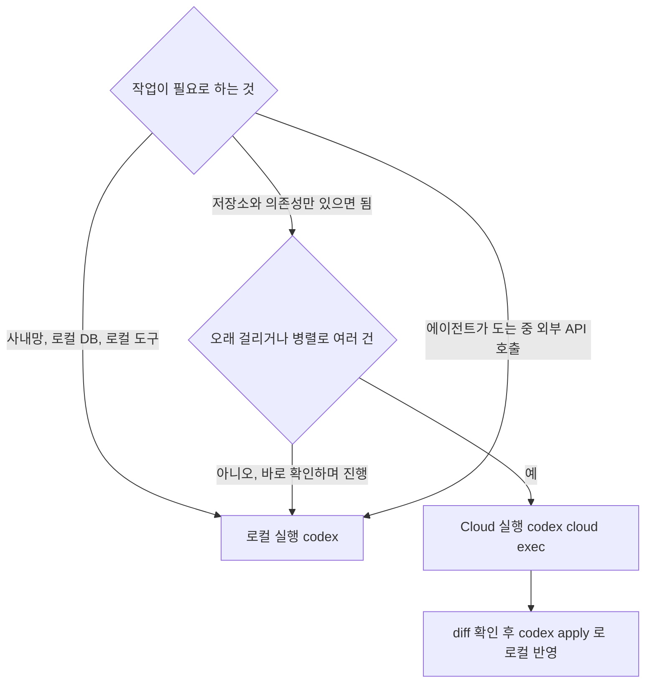
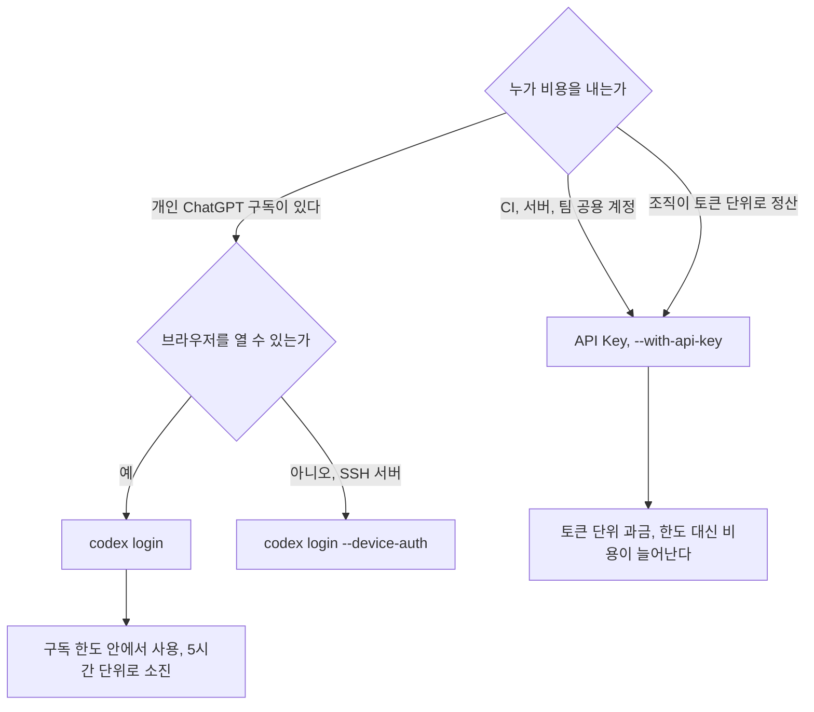
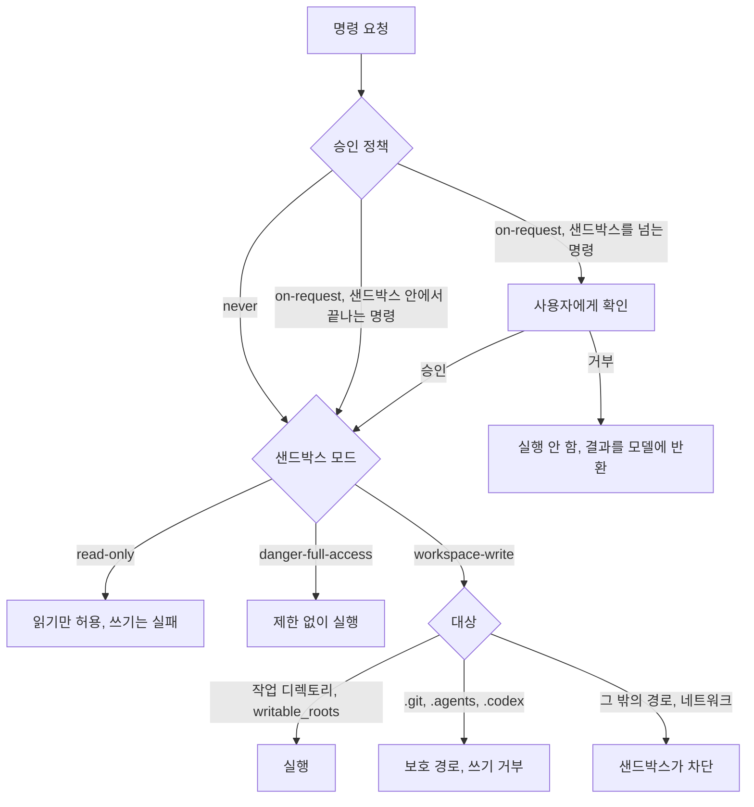
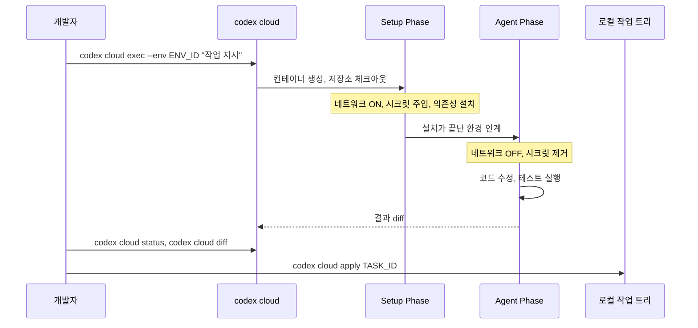
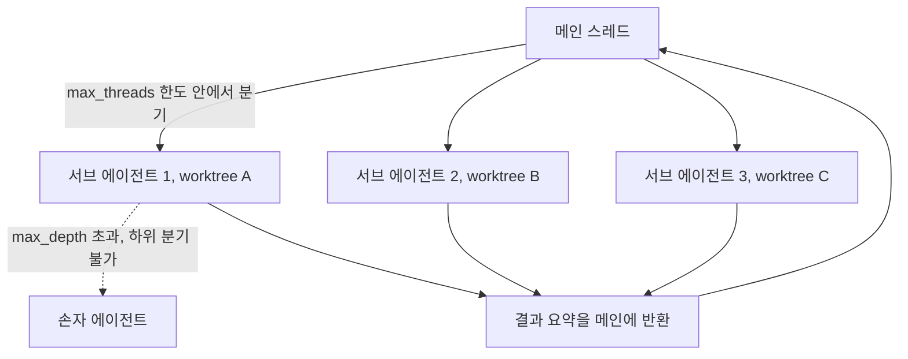
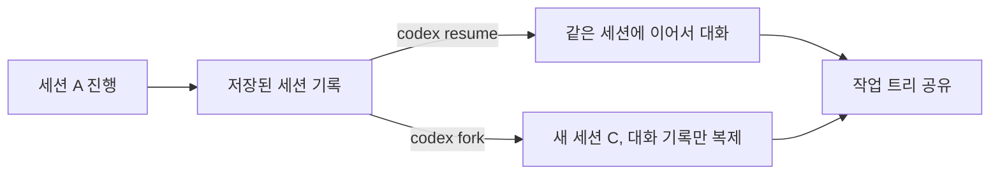

# OpenAI Codex

Codex는 OpenAI가 만든 에이전틱 코딩 도구다. 터미널 CLI, 데스크톱 앱, IDE 확장, 클라우드 실행을 한 계정으로 묶어 쓴다. CLI는 Rust로 작성된 Apache-2.0 오픈소스([github.com/openai/codex](https://github.com/openai/codex))이고 npm 패키지로 설치하면 네이티브 바이너리가 깔린다.

2021년에 나왔다가 2023년에 내려간 "Codex 모델"(GPT-3 기반, 초기 GitHub Copilot 엔진)과는 다른 제품이다. 검색하면 두 가지가 섞여 나온다.

이 문서의 CLI 관련 내용은 `@openai/codex` 0.159.3을 설치해서 `--help`, `codex doctor`, `codex sandbox`를 직접 돌려 확인한 것이다. 모델 이름, 요금, 한도는 공식 문서(현재 `developers.openai.com/codex`가 `learn.chatgpt.com/docs`로 리다이렉트된다) 기준이고 자주 바뀐다. 직접 확인하지 못한 항목은 본문에 그렇게 적었다.

---

## 1. 어떤 도구와 어떻게 다른가

### 1.1 Claude Code와 비교

| 항목 | Codex | Claude Code |
|------|-------|-------------|
| 개발사 | OpenAI | Anthropic |
| 소스 공개 | Apache-2.0 | 비공개 |
| CLI 언어 | Rust | TypeScript |
| 프로젝트 지침 파일 | `AGENTS.md` | `CLAUDE.md` |
| 서브 에이전트 | 지원 (`[agents]` 설정, `/agent`) | 지원 ([Agent 도구](../Claude_Code/Claude_Code_Agent.md)) |
| 원격 실행 | Codex Cloud (`codex cloud`) | 웹 환경 별도 제공 |
| 샌드박스 | Linux는 bubblewrap·Landlock·seccomp, macOS는 Seatbelt | OS 레벨 샌드박스 ([상세](../Claude_Code/Claude_Code_Sandbox.md)) |
| MCP | 지원 (`codex mcp`) | 지원 |
| 과금 | ChatGPT 구독 또는 API Key | 구독 또는 API 사용량 |

예전 버전의 이 문서는 Claude Code 멀티 에이전트를 "없음"으로 적었는데 틀린 내용이었다. 양쪽 다 서브 에이전트를 지원하고, 차이는 격리 방식과 설정 위치에 있다.

### 1.2 로컬로 돌릴지 Cloud로 돌릴지

둘을 가르는 기준은 작업이 무엇에 접근해야 하느냐다. Cloud의 에이전트 단계는 네트워크가 꺼진다(4절). 작업 중에 외부 API나 사내 DB를 호출해야 하면 Cloud에서는 못 한다.



위 흐름에서 로컬로 빠지는 경로가 세 개다. Cloud는 결과를 diff로 받아 로컬에 적용하는 구조라서, 실행 중에 사람이 끼어드는 작업과는 맞지 않는다.

---

## 2. 설치와 인증

### 2.1 설치

```bash
npm install -g @openai/codex       # npm
brew install --cask codex           # macOS
codex update                        # 업데이트 (CLI 0.159.3에 update 서브 명령이 있다)
```

지원 환경은 macOS, Linux, Windows(네이티브 샌드박스 또는 WSL2)다. Linux에서 샌드박스가 동작하는 조건은 3.3절에 따로 적었다. 설치 후 `codex doctor`를 돌리면 설정 로드, 인증, 샌드박스, 디스크 여유를 한 번에 진단한다. 여유가 5GiB 아래면 경고를 내므로 작은 VM이나 컨테이너에서는 설치 직후 바로 뜬다.

### 2.2 인증 방식 고르기

```bash
codex login                                   # 브라우저 OAuth (ChatGPT 계정)
codex login --device-auth                     # 브라우저가 없는 서버
printenv OPENAI_API_KEY | codex login --with-api-key
printenv CODEX_ACCESS_TOKEN | codex login --with-access-token
codex login status
```

`--with-api-key`는 키를 인자가 아니라 표준 입력으로 받는다. 셸 히스토리에 키가 남지 않게 하려는 설계라서, `--with-api-key sk-...` 식으로 쓰면 동작하지 않는다.



구독은 5시간 윈도우 한도에 걸리고, API Key는 한도 대신 청구서가 늘어난다. 자동화를 개인 구독 계정으로 돌리면 한도를 같이 쓰게 되어 CI가 한도를 소진하는 순간 개인 작업도 막힌다. CI는 API Key로 분리한다.

---

## 3. 승인 정책과 샌드박스

Codex는 명령 하나를 실행하기 전에 두 번 판정한다. 승인 정책은 사람에게 물어볼지를 정하고, 샌드박스 모드는 물어봤든 안 물어봤든 OS 수준에서 무엇을 막을지를 정한다. 둘은 독립적이라서 `-a never`로 프롬프트를 없애도 샌드박스는 그대로 남는다.

### 3.1 판정 순서



보호 경로(`.git`, `.agents`, `.codex`)는 승인 정책 판정이 끝난 뒤, 샌드박스 단계에서 걸린다. 사용자가 승인을 눌러도 `workspace-write` 안에서는 이 경로에 쓸 수 없다. 이 동작은 공식 문서가 세 경로를 특별 취급한다고 적은 것을 따랐고, 이 문서를 쓴 환경에서는 샌드박스 자체가 못 떠서(3.3절) 직접 재현하지 못했다.

### 3.2 모드와 값

| 구분 | 값 | 동작 |
|------|----|------|
| 샌드박스 | `read-only` | 읽기만 가능 |
| 샌드박스 | `workspace-write` | 작업 디렉토리와 추가한 쓰기 경로만 쓰기 가능, 네트워크 기본 차단 |
| 샌드박스 | `danger-full-access` | 파일시스템·네트워크 제한 없음 |
| 승인 | `on-request` | 모델이 필요할 때 물어봄 |
| 승인 | `never` | 묻지 않고, 막히면 실패를 모델에 그대로 돌려줌 |

설정 파일 없이 `codex doctor`를 돌렸을 때 기본값은 "파일시스템 제한 + 네트워크 제한 + 승인 `on-request`"로 나왔다.

예전 문서에 있던 `untrusted` 정책은 0.159.3에서 `approval_policy = "untrusted"`가 설정 로드 오류(`config could not be loaded`)를 낸다. CLI 플래그 `-a`의 선택지도 `on-request`와 `never`뿐이다. `on-failure`는 설정 파일에서는 로드되지만 플래그 선택지에는 없어서 이미 퇴역한 값으로 보는 편이 안전하다.

### 3.3 실제로 막히는 지점

**workspace-write에서 npm install이 실패한다.** 네트워크가 기본 차단이라 레지스트리에 연결하지 못한다. 에러는 `ENOTFOUND`나 `EAI_AGAIN` 같은 DNS 실패로 보여서 프록시 문제처럼 읽힌다. 열려면 설정에서 허용한다.

```toml
[sandbox_workspace_write]
network_access = true
```

이 값을 켜면 에이전트가 실행하는 모든 명령이 외부로 나갈 수 있다. 의존성이 한 번만 필요하면 사용자가 터미널에서 직접 설치하고 Codex는 그 뒤에 돌리는 쪽이 낫다.

**커밋이 거부된다.** `.git`이 보호 경로라서 `workspace-write`의 에이전트는 `git commit`을 못 한다. 에이전트에게는 파일만 고치게 하고 커밋은 사람이 하거나, 커밋을 맡기려면 이 작업만 `danger-full-access` 세션으로 분리한다. 거부된 명령을 모델이 우회하려고 재시도할 수 있으니, 처음부터 프롬프트에 "커밋하지 말고 diff만 남겨라"를 적어 두는 게 낫다.

**Linux에서 샌드박스가 아예 안 뜬다.** 이 문서를 쓴 서버에서 실제로 겪었다.

```text
$ codex sandbox -- bash -c "touch w.txt"
bwrap: Creating new namespace failed: No space left on device
```

디스크 문제처럼 보이지만 `/proc/sys/user/max_user_namespaces` 값이 0이어서 비특권 사용자 네임스페이스를 못 만든 것이다. 공식 문서는 Linux와 WSL2에서 `bubblewrap`이 필요하고, 없으면 번들 헬퍼가 비특권 사용자 네임스페이스에 의존한다고 적는다. 그래서 컨테이너 안이나 네임스페이스를 막아 둔 커널에서는 둘 다 실패한다. 호스트가 허용하면 `sysctl user.max_user_namespaces`를 올리고, 못 올리는 환경이면 컨테이너 자체를 격리 경계로 삼고 `--dangerously-bypass-approvals-and-sandbox`로 Codex 샌드박스를 끈다. 후자는 외부 격리가 확실할 때만 쓴다.

WSL은 버전에 따라 갈린다. WSL1은 리눅스 커널이 아니라 번역 계층이라 네임스페이스 계열 기능이 없어서 동작하지 않고, WSL2는 커널이 있으므로 bubblewrap 조건만 맞추면 된다. WSL1 쪽은 직접 돌려 보지 못했고 알려진 제약을 적은 것이다.

**`--full-auto`가 사라졌다.** 이전 문서는 `--full-auto`를 `on-request` + `workspace-write`의 줄임으로 적었다. 0.159.3에서는 `codex exec --full-auto "hi"`가 `error: unexpected argument '--full-auto' found`로 끝난다. 공식 CLI 레퍼런스도 deprecated로 표시하고 `--sandbox workspace-write`를 쓰라고 한다. 오래된 스크립트나 CI 설정에 이 플래그가 남아 있으면 업그레이드하는 날 파이프라인이 깨진다.

승인을 건너뛰는 것 자체의 위험도 있다. `-a never`는 프롬프트가 없을 뿐 샌드박스는 유지되니 괜찮지만, `--dangerously-bypass-approvals-and-sandbox`(`--yolo`)는 둘 다 끈다. `.env`나 SSH 키가 있는 개발 머신에서 이걸 쓰면 모델이 읽은 파일 내용이 그대로 프롬프트로 나간다. 에이전트 보안 일반은 [AI Agent Security](../Concepts/AI_Agent_Security.md)와 [MCP Security](../MCP/MCP_Security.md)에서 다룬다.

---

## 4. Codex Cloud

Cloud는 격리된 컨테이너에서 작업을 돌리고 결과를 diff로 돌려주는 방식이다. 실행이 두 단계로 나뉘고, 단계마다 네트워크와 시크릿 접근이 다르다.



Setup 단계에서 의존성을 받고 시크릿을 쓴다. Agent 단계 시작 전에 시크릿이 지워지고 네트워크가 꺼진다. 이 구조는 시크릿이 에이전트가 생성한 코드나 출력에 새는 것을 막으려는 것이다. 단계 구분은 공식 문서를 인용한 블로그 설명을 따랐고, 내가 직접 Cloud 작업을 돌리지는 못했다(인증 정보가 없었다).

예전 문서의 `codex cloud "프롬프트"`는 이제 맞지 않는다. 0.159.3에서 `codex cloud`는 작업 목록을 탐색하는 대화형 화면이고, 새 작업은 환경 ID를 필수로 요구한다.

```bash
codex cloud exec --env ENV_ID "이 프로젝트의 테스트 커버리지를 80%로 올려줘"
codex cloud exec --env ENV_ID --branch feature/x --attempts 3 "버그 수정"   # best-of-N
codex cloud list
codex cloud status TASK_ID
codex cloud diff TASK_ID
codex cloud apply TASK_ID            # codex apply TASK_ID 와 같은 동작
```

`--attempts`는 같은 지시를 N번 돌려 그중 고르는 옵션이고 기본값은 1이다. `codex apply`는 내부적으로 `git apply`이므로 로컬 작업 트리가 더러우면 충돌이 난다. 적용 전에 `git status`가 깨끗한지 먼저 본다.

실무에서 걸리는 건 Agent 단계의 네트워크 차단이다. 테스트가 외부 서비스를 부르거나 런타임에 패키지를 받으면 Setup에서는 되던 것이 Agent 단계에서 실패한다. 의존성은 전부 Setup에서 받아 두고, 외부 호출은 목으로 막은 테스트만 돌리게 한다.

---

## 5. AGENTS.md

`AGENTS.md`는 Codex가 세션 시작 때 읽는 프로젝트 지침 파일이다. 역할은 `CLAUDE.md`와 같다.

### 5.1 병합 순서

파일이 하나가 아니라 디렉토리 계층을 따라 여러 개 합쳐진다. 문서 기준 순서는 아래 블록이다.

```text
~/.codex/AGENTS.override.md  (없으면 ~/.codex/AGENTS.md)      전역
<저장소 루트>/AGENTS.override.md  (없으면 AGENTS.md)
<중간 디렉토리>/AGENTS.override.md  (없으면 AGENTS.md)       루트에서 cwd 방향으로 한 단계씩
<cwd>/AGENTS.override.md  (없으면 AGENTS.md)
```

디렉토리마다 `AGENTS.override.md`가 있으면 그것을 쓰고 `AGENTS.md`는 읽지 않는다. 읽은 파일은 루트에서 cwd 순으로 이어 붙이므로 뒤에 오는 하위 디렉토리 지침이 모델에게 더 가깝게 놓인다. 충돌하는 규칙이 있으면 하위 디렉토리 쪽이 이기는 경우가 많다. 이 순서는 공식 문서와 이를 정리한 글을 따랐고 모델 호출 없이는 직접 검증할 수 없었다.

### 5.2 크기 제한

합친 결과에는 상한이 있고 기본값은 32KiB(32768바이트)다. 설정 키는 `project_doc_max_bytes`다. 바이너리에서 `32768`과 키 이름을 확인했고, `project_doc_max_bytes = 65536`과 `project_doc_fallback_filenames = ["TEAM_GUIDE.md"]`는 `--strict-config`에서 오류 없이 로드됐다.

상한을 넘으면 뒤쪽이 잘린다. 순서상 뒤쪽은 cwd에 가까운 가장 구체적인 지침이라서, 루트 `AGENTS.md`가 길수록 하위 디렉토리의 규칙이 먼저 밀려난다. 잘릴 때 경고가 나오는지는 확인하지 못했으므로, 모노레포처럼 파일이 여러 겹이면 합친 크기를 직접 재 둔다. 루트에는 빌드·테스트 명령과 공통 금지 사항만 두고, 서비스 규칙은 해당 디렉토리로 내리는 게 맞다.

```markdown
# 프로젝트 개요
Spring Boot 3.x 백엔드. 도메인별 패키지 구조.

## 명령
- 빌드: ./gradlew build
- 테스트: ./gradlew test
- 린트: ./gradlew ktlintCheck

## 금지
- .env 커밋 금지
- main 브랜치 직접 push 금지
```

`/init`이 스캐폴드를 만들어 준다. 생성된 내용은 대부분 코드에서 바로 읽히는 것이라, 에이전트가 코드만 봐서는 알 수 없는 사실(테스트 실행 순서, 로컬에서만 필요한 환경변수)만 남기고 지우는 게 좋다.

---

## 6. 서브 에이전트와 세션

### 6.1 서브 에이전트

메인 스레드가 작업을 나눠 서브 에이전트 스레드를 띄운다. 설정 키는 `[agents]`의 `max_threads`(동시에 열 수 있는 스레드 수)와 `max_depth`(서브 에이전트가 다시 서브 에이전트를 만들 수 있는 깊이)이고, `max_depth = 1`이면 메인이 만든 자식까지만 허용한다. 두 키 이름과 정수 값은 직접 로드해서 확인했다. 기본값은 직접 확인하지 못했으니 값을 설정 파일에 명시해 두는 편이 낫다.



한도를 넘는 분기 요청은 생성되지 않는다. 병렬 서브 에이전트가 같은 파일을 동시에 고치면 마지막에 쓴 쪽이 이기므로, 파일 영역을 나눠서 지시하거나 worktree를 분리해야 한다. CLI에는 `--worktree`(새 관리형 Git worktree에서 세션 실행) 플래그가 있어서 병렬 작업은 이쪽으로 세션을 나누는 게 확실하다. 서브 에이전트별로 worktree가 자동 분리되는지는 확인하지 못했다. `/agent`로 서브 에이전트 스레드를 오가며 볼 수 있다.

### 6.2 resume과 fork

```bash
codex resume --last              # 가장 최근 세션을 이어서
codex resume SESSION_ID "이어서 테스트 추가해줘"
codex fork --last                # 가장 최근 세션을 복제해서 새 스레드로
codex archive SESSION_ID         # 목록에서 치움
codex delete SESSION_ID          # 완전 삭제
```



fork는 대화를 갈라 줄 뿐 파일은 복제하지 않는다. A에서 시도한 접근과 C에서 시도한 접근이 같은 작업 트리를 고치므로, 서로 다른 구현을 비교하려면 fork와 `--worktree`를 같이 써야 한다. fork 두 개를 같은 디렉토리에서 병렬로 돌리면 두 세션이 같은 파일을 덮어쓴다.

---

## 7. 명령어와 플래그

### 7.1 서브 명령 (0.159.3 `--help` 기준)

| 명령 | 설명 |
|------|------|
| `codex` | 대화형 TUI |
| `codex exec` (`e`) | 비대화형 실행, `exec resume`, `exec fork`, `exec review` 포함 |
| `codex review` | 비대화형 코드 리뷰 |
| `codex cloud` | Cloud 작업 탐색, `exec`, `status`, `list`, `apply`, `diff` (실험적) |
| `codex apply` (`a`) | Cloud 작업 diff를 로컬에 `git apply` |
| `codex resume`, `codex fork` | 세션 이어서, 복제 |
| `codex archive`, `unarchive`, `delete` | 세션 정리 |
| `codex login`, `logout` | 인증 |
| `codex mcp` | MCP 서버 관리 |
| `codex plugin` | 플러그인 관리 |
| `codex sandbox` | 샌드박스 안에서 명령 실행 |
| `codex doctor` | 설치·설정·인증·런타임 진단 |
| `codex features` | 기능 플래그 조회 |
| `codex update`, `completion`, `app` | 업데이트, 셸 자동완성, 데스크톱 앱 |

### 7.2 자주 쓰는 플래그

```bash
codex -m gpt-6.1-sol \
  -a on-request \              # on-request | never
  -s workspace-write \         # read-only | workspace-write | danger-full-access
  -C /path/to/project \
  -i screenshot.webp \
  --search \                   # 라이브 웹 검색
  --add-dir /extra/path \      # 추가 쓰기 경로
  --worktree \                 # 관리형 worktree에서 실행
  -c sandbox_workspace_write.network_access=true   # 설정 값 일회성 덮어쓰기
```

`-c key=value`는 점으로 이은 경로로 설정을 덮어쓰고 값은 TOML로 파싱된다. 설정 파일을 건드리지 않고 한 번만 네트워크를 여는 데 쓰기 좋다. `--strict-config`를 붙이면 알 수 없는 키가 있을 때 에러로 멈추는데, 키 이름을 오타 냈는데도 조용히 무시되는 것을 막아 준다. 오타 낸 키(`bogus_key_xyz`)를 넣고 `codex --strict-config doctor`를 돌리면 config 항목에 경고가 뜨는 것을 확인했다.

### 7.3 슬래시 명령

공식 레퍼런스가 명시한 것은 `/feedback`, `/goal`, `/init`, `/mcp`, `/plan`, `/review`, `/status`다. 이전 문서에 적었던 `/model`, `/permissions`, `/diff`, `/compact`, `/resume`, `/fork`, `/agent`, `/new`는 이번에 직접 검증하지 못했다. 세션에서 `/`를 입력하면 현재 버전이 지원하는 목록이 나오니 그쪽을 기준으로 삼는다.

---

## 8. 모델과 요금

이 절은 가장 빨리 낡는다. 공식 요금 페이지와 모델 페이지 요약을 옮겼고, 값은 변동 가능하다.

### 8.1 모델

| 모델 | 위치 |
|------|------|
| GPT-6 Astra (`gpt-6-astra`) | 현재 최상위. 복잡한 작업용 |
| GPT-6.1 Sol (`gpt-6.1-sol`) | Astra에 가까운 성능, 낮은 비용. 반복·장시간 작업용 |
| GPT-6 Luna (`gpt-6-luna`) | 요약·추출 같은 고빈도 작업용 |
| GPT-5.5 | 이전 세대. 2026-10-14에 ChatGPT와 Codex에서 퇴역, API에서는 유지 |

이전 문서가 주력이라고 적은 `gpt-5.3-codex`는 현재 요금표와 모델 페이지에 나오지 않는다. 모델 ID 세 개(`gpt-6-astra`, `gpt-6.1-sol`, `gpt-6-luna`)는 설치한 바이너리 안에서 확인했다. `-m`에 넣는 이름이 확실하지 않으면 TUI의 모델 선택 화면을 쓴다.

### 8.2 구독 플랜과 5시간 한도

| 플랜 | 가격 | 비고 |
|------|------|------|
| Plus | $20/월 | 모델별 5시간 한도 있음 |
| Pro | $100~$500/월 (구간제) | 공식 요약에는 5시간 한도가 없는 것으로 나옴 |
| Business | $20/사용자/월 (연간 결제) | 표준 좌석은 Plus와 같은 한도 |
| Enterprise, Edu | 문의 | 크레딧 기반 |

Plus의 5시간당 메시지 한도는 Astra 5~45, GPT-6.1 Sol 15~160, GPT-6 Luna 350~3,000이다. 범위로 표시되는 이유는 작업 크기에 따라 소비량이 달라서다. Cloud 작업은 로컬 메시지보다 한도를 더 쓴다. 가격과 한도 모두 변동 가능하고 플랜 구성이 바뀐 적이 있으므로 결제 전에 [공식 요금 페이지](https://developers.openai.com/codex/pricing)를 다시 본다.

### 8.3 API Key 과금

API 단가는 1M 토큰당 크레딧으로 표시된다.

| 모델 | 입력 | 캐시된 입력 | 출력 |
|------|------|-------------|------|
| GPT-6 Astra | 250 | 25 | 1,250 |
| GPT-6.1 Sol | 50 | 2.5 | 250 |
| GPT-6 Luna | 2.5 | 0.25 | 12.5 |
| GPT-5.6 Sol | 100 | 10 | 500 |

크레딧을 달러로 환산하는 비율은 확인하지 못해 이전 문서의 달러 단가표는 지웠다. 같은 입력이면 캐시된 입력이 훨씬 싸므로, 긴 `AGENTS.md`를 매 세션 앞에 붙이는 것은 이 가격 구조에서는 부담이 작다.

---

## 9. 설정 파일

`~/.codex/config.toml`(사용자)과 `.codex/config.toml`(프로젝트)이 있고, `-p NAME`은 `$CODEX_HOME/NAME.config.toml`을 위에 덮어씌운다. 아래 키와 값은 전부 `codex doctor`로 로드해 오류가 없는 것을 확인했다. `approval_policy = "untrusted"`만 거부됐다.

```toml
model = "gpt-6.1-sol"
model_reasoning_effort = "high"      # minimal | low | medium | high | xhigh
model_verbosity = "medium"           # low | medium | high
sandbox_mode = "workspace-write"     # read-only | workspace-write | danger-full-access
approval_policy = "on-request"       # on-request | never
web_search = "cached"                # disabled | cached | live
project_doc_max_bytes = 65536

[sandbox_workspace_write]
network_access = false
writable_roots = ["/additional/path"]

[agents]
max_threads = 4
max_depth = 1

[tui]
notifications = true
animations = true
personality = "pragmatic"            # none | friendly | pragmatic

[history]
persistence = "save-all"             # save-all | none
```

MCP 서버(`[mcp_servers.*]`)와 커스텀 프로바이더(`[model_providers.*]`)는 이번에 값을 직접 돌려 보지 못했다. 전체 키 목록은 [설정 레퍼런스](https://developers.openai.com/codex/config-reference/)에서 확인한다. MCP 연결 시 권한 문제는 [MCP Security](../MCP/MCP_Security.md)에 정리돼 있다.

---

## 10. 비대화형 실행과 CI

```bash
codex exec -s read-only "이 PR의 변경 사항을 리뷰해줘"
codex exec -s workspace-write -a never --json "실패한 테스트를 수정해줘"
```

비대화형에서는 승인 프롬프트에 답할 사람이 없다. `-a on-request`로 두면 샌드박스를 넘는 명령이 멈추거나 거부된다. `-a never`는 막힌 명령의 실패를 모델에게 바로 돌려줘서 모델이 다른 방법을 찾게 한다. 파이프라인에서는 쓰기 범위를 `-s`로 명시하고 `-a never`를 같이 쓴다. `--full-auto`는 더 이상 받지 않으므로 이전 스크립트에서 바꿔야 한다.

CI에서는 인증을 API Key로 분리하고(2.2절), 러너가 컨테이너라면 3.3절의 사용자 네임스페이스 문제를 먼저 본다. 러너가 이미 일회용 격리 환경이면 샌드박스 대신 러너 격리를 경계로 삼는 설계도 가능하다. 자동화 상세는 [Claude Code Headless CI](../Claude_Code/Claude_Code_Headless_CI.md)에 같은 문제 구조가 정리돼 있고 Codex에서도 적용되는 부분이 많다.

---

## 11. 자주 겪는 문제

| 증상 | 원인 | 해결 |
|------|------|------|
| 한참 대화한 뒤 앞에서 정한 규칙을 어긴다 | 대화가 길어져 초반 지시가 밀림 | `AGENTS.md`에 규칙을 옮겨 두고, 길어지면 새 세션으로 이어서 시작 |
| 큰 작업을 한 번에 시켰더니 엉뚱한 방향으로 크게 고쳐 놓음 | 계획 확인 없이 바로 구현 | `/plan`으로 계획만 받아 확인한 뒤 실행 |
| 다른 구현안을 비교하고 싶은데 파일이 섞임 | fork는 대화만 복제 | fork와 `--worktree`를 같이 사용 |
| UI 구현 결과가 디자인과 다름 | 말로만 설명 | `-i design.webp`로 스크린샷 첨부 |
| 업그레이드 후 스크립트가 `unexpected argument`로 실패 | 플래그 제거 (`--full-auto` 등) | `codex exec --help`로 현재 플래그 확인 후 교체 |
| 설정을 바꿨는데 반영이 안 된다 | 키 오타는 조용히 무시됨 | `codex --strict-config doctor`로 검사 |

---

## 참고

- [Codex 소개 (OpenAI)](https://openai.com/index/introducing-codex/)
- [GitHub — openai/codex](https://github.com/openai/codex)
- [Codex CLI 문서](https://developers.openai.com/codex/cli)
- [Codex CLI 명령어 레퍼런스](https://developers.openai.com/codex/cli/reference/)
- [Codex 모델](https://developers.openai.com/codex/models/)
- [Codex 요금](https://developers.openai.com/codex/pricing/)
- [Codex 설정 레퍼런스](https://developers.openai.com/codex/config-reference/)
- [Codex 에이전트 승인과 보안](https://developers.openai.com/codex/agent-approvals-security)
- [AGENTS.md 문서](https://developers.openai.com/codex/guides/agents-md/)
- [Codex IDE 확장](https://developers.openai.com/codex/ide/)
