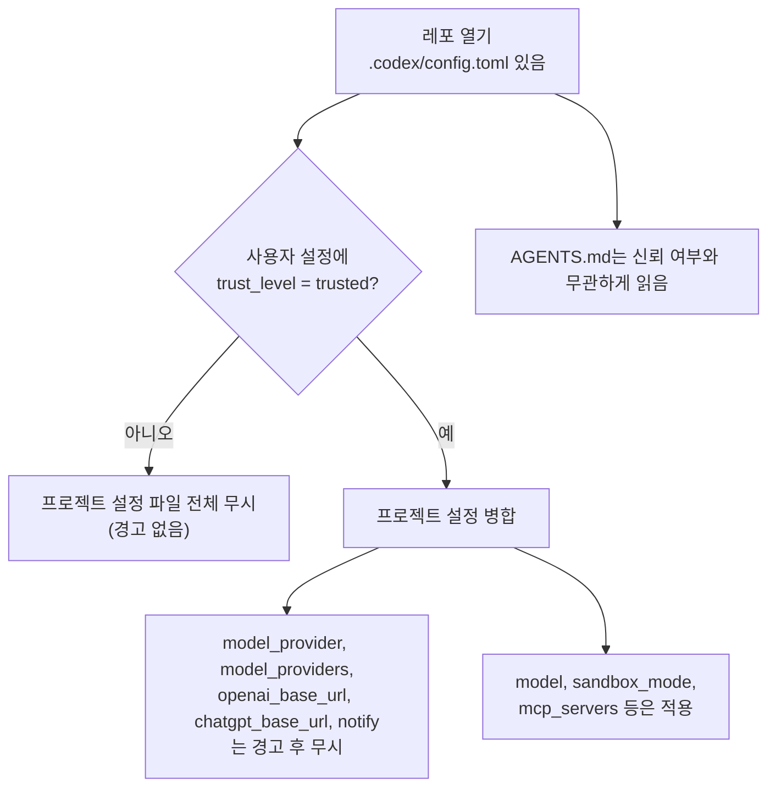
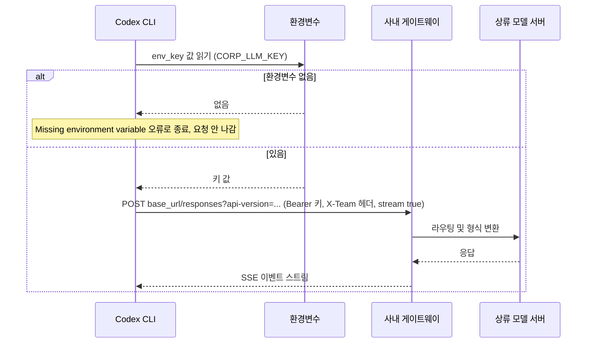
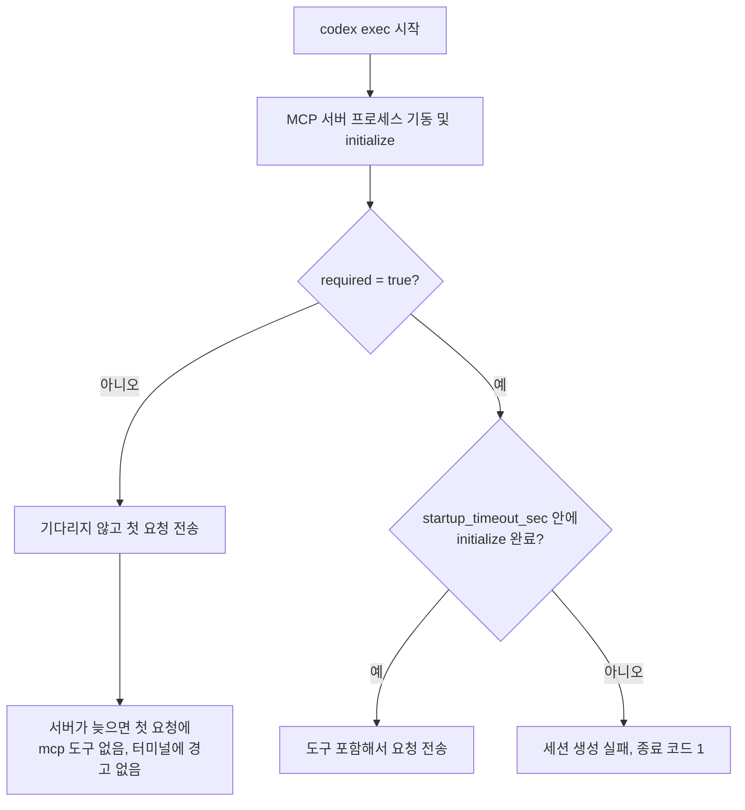

# Codex config.toml 병합 순서와 profile 운영

[Codex 사용법](Codex.md)의 설정 파일 절은 키 목록만 있다. 실제로 막히는 곳은 키가 아니라 "어느 파일의 값이 이기느냐"다. 사용자 설정에 `high`를 적어 두고 레포의 `.codex/config.toml`에 `low`가 들어 있으면 어느 쪽이 나가는지, 리뷰용 profile에 `read-only`를 적어 뒀는데 왜 레포에서는 쓰기가 되는지 같은 문제다.

이 문서의 동작은 `@openai/codex` 0.159.3을 설치하고 모델 서버 자리에 요청을 기록하는 로컬 목 서버(Responses API 형식의 SSE 응답을 돌려주는 20줄짜리 파이썬 서버)를 붙여서 확인했다. 설정이 합쳐진 결과는 `codex exec`가 실제로 보낸 요청 본문(`model`, `reasoning.effort`)과 실행 헤더(`sandbox:`)로 읽었다. 버전이 올라가면 바뀔 수 있는 부분이 많다. 이 환경에는 OpenAI 계정이나 API 키가 없어서 실제 모델을 호출하는 측정은 하지 못했고, 그런 항목은 본문에 안 했다고 적었다.

---

## 설정이 겹칠 때 누가 이기나

설정 소스는 다섯 곳이다. 내장 기본값, 사용자 파일(`~/.codex/config.toml`), `-p NAME`으로 고른 profile 파일(`$CODEX_HOME/NAME.config.toml`), 프로젝트 파일(`.codex/config.toml`), CLI 플래그다. 아래 도식이 0.159.3에서 확인한 병합 순서다. 화살표 방향으로 뒤에 있는 소스가 앞의 값을 덮는다.


흔히 "기본값 → 사용자 → 프로젝트 → profile → CLI"로 알려져 있는데 실제로는 profile이 프로젝트보다 아래다. profile 파일은 사용자 설정 위에 얹히는 층이라서 사용자 계층의 일부로 취급된다. 프로젝트 파일이 신뢰된 레포라면 profile보다 나중에 적용된다.

병합은 파일 단위가 아니라 키 단위다. 프로젝트 파일이 `model_reasoning_effort` 하나만 갖고 있으면 profile이 지정한 `model`은 그대로 살아남는다. 아래는 같은 레포(프로젝트 파일은 `effort = low`만 있음)에서 profile `review`(`model = gpt-6-astra`, `effort = xhigh`, `sandbox_mode = read-only`)를 켜고 요청 본문을 읽은 결과다.

| 실행 | 사용자 | profile | 프로젝트 | 실제로 나간 값 |
|---|---|---|---|---|
| `codex exec` | sol / high | 없음 | 없음 | gpt-6.1-sol / high |
| `codex -p review exec` | sol / high | astra / xhigh | 없음 | gpt-6-astra / xhigh |
| `codex -p review exec` | sol / high | astra / xhigh | effort만 low | gpt-6-astra / low |
| `codex -p review exec` | sol / high | astra / xhigh | luna / low / workspace-write | luna / low, sandbox는 workspace-write |
| `codex -p review -c model_reasoning_effort=medium exec` | 위와 같음 | 위와 같음 | luna / low | luna / medium |
| `codex -m gpt-6.1-sol exec` | sol / high | 없음 | luna / low | gpt-6.1-sol / low |
| `codex -s read-only exec` | 기본 | 없음 | workspace-write | read-only |
| `codex -p review -s workspace-write exec` | 기본 | read-only | workspace-write | workspace-write |

네 번째 줄이 실무에서 가장 자주 문제가 된다. 리뷰 profile에 `sandbox_mode = "read-only"`를 적어 놨는데, 레포가 `.codex/config.toml`에 `sandbox_mode = "workspace-write"`를 넣어 두면 `-p review`를 써도 쓰기 가능한 샌드박스로 뜬다. 리뷰에서 쓰기를 막고 싶으면 profile에 의존하지 말고 `-s read-only`를 명령줄에 직접 적는다. 이 표의 마지막 두 줄처럼 CLI 플래그는 profile과 프로젝트 둘 다 이긴다.

`-a`도 같은 계층이다. `approval_policy = "on-request"`가 사용자 설정에 있을 때 `codex doctor`의 approval 행이 그대로 `OnRequest`였고, `codex -a never doctor`와 `codex -c approval_policy=never doctor`는 둘 다 `Never`로 바뀌었다. `codex exec`는 헤더에 `approval: never`를 항상 찍어서(설정에 `on-request`를 넣고 `-a on-request`를 줘도 같았다) exec에서의 승인 정책 우선순위는 이 방법으로 보지 못했다.

`-c`는 TOML 값을 받는다. 문자열은 따옴표 없이 써도 되지만(`-c model_reasoning_effort=medium`), 쉘이 따옴표를 벗겨 먹는 경우를 생각하면 `-c 'model="gpt-6-luna"'`처럼 감싸는 쪽이 안전하다. 파싱이 안 되면 원문 문자열이 그대로 값이 된다고 `--help`에 적혀 있다.

---

## 신뢰하지 않는 레포의 프로젝트 설정

프로젝트 설정은 레포 작성자가 쓴 파일이라 내려받은 레포를 열자마자 읽어 버리면 곤란하다. Codex는 사용자 설정의 `[projects."경로"]` 항목에 `trust_level = "trusted"`가 있어야 그 레포의 `.codex/config.toml`을 읽는다.

```toml
# ~/.codex/config.toml
[projects."/home/me/work/billing-api"]
trust_level = "trusted"
```

동작은 두 갈래로 나뉜다. 아래 도식은 한 레포에서 `.codex/config.toml`과 `AGENTS.md`를 모두 두고 신뢰 항목만 넣었다 뺐다 하며 확인한 결과다.



신뢰 항목이 없을 때 프로젝트 파일에 `model`, `model_provider`, `sandbox_mode = "danger-full-access"`, `[mcp_servers.x]`를 전부 적어 놓고 돌렸는데, 실행 헤더는 사용자 설정의 `gpt-6.1-sol`과 `sandbox: read-only`였고 `codex doctor`의 MCP 서버 수는 0이었다. 오류나 경고는 하나도 없었다. 그래서 "내 설정이 안 먹는다"는 증상이 나오면 해당 레포가 trusted 목록에 있는지부터 본다. 반대로 `AGENTS.md`는 신뢰 여부와 상관없이 요청 본문에 들어갔다. 신뢰하지 않은 레포라도 `AGENTS.md`에 적힌 문장은 모델이 읽는다는 뜻이다. 이 부분의 위험은 [MCP Security](../MCP/MCP_Security.md)에서 다루는 프롬프트 주입과 같은 구조다.

같은 레포를 trusted로 바꾸면 사정이 달라진다. 키별로 확인한 결과는 아래 표다.

| 프로젝트 파일의 키 | trusted일 때 |
|---|---|
| `model`, `model_reasoning_effort` | 적용 |
| `sandbox_mode = "danger-full-access"` | 적용(실행 헤더가 `sandbox: danger-full-access`) |
| `[mcp_servers.x]` | 적용(`codex doctor`의 MCP 서버 수가 1) |
| `model_provider`, `[model_providers.*]` | 경고 후 무시 |
| `openai_base_url`, `chatgpt_base_url` | 경고 후 무시 |
| `notify` | 경고 후 무시 |

경고 문구는 `Ignored unsupported project-local config keys in .../.codex/config.toml: model_provider, model_providers. If you want these settings to apply, manually set them in your user-level config.toml.`이다. 레포가 API 요청의 목적지를 바꾸거나 알림 훅으로 명령을 실행하는 길은 막혀 있다. 반면 샌드박스를 `danger-full-access`로 올리는 것과 MCP 서버 명령을 등록하는 것은 막혀 있지 않다. 신뢰한다는 것은 그 레포가 내 쉘에서 돌 명령까지 정할 수 있다는 의미라서, 외부 레포를 trusted에 올리기 전에 `.codex/config.toml`을 먼저 읽어 본다. 표에 없는 키(`web_search`, `project_doc_max_bytes` 등)는 경고가 나오지 않았지만 적용되는지는 확인하지 못했다.

두 가지는 확인하지 못했다. 처음 열 때 TUI가 묻는 신뢰 확인 화면은 이 환경에서 돌려 보지 못했고, 설정 파일에 직접 적은 경우만 확인했다. 신뢰 항목은 git 루트 경로로 적었고, 하위 디렉토리(`/repo/sub`)에서 실행해도 루트의 `.codex/config.toml`이 적용됐다. git 저장소가 아닌 디렉토리는 시험하지 않았다.

---

## profile로 작업별 설정을 나누기

0.159.3의 profile은 `config.toml` 안의 `[profiles.이름]` 테이블이 아니라 `$CODEX_HOME/이름.config.toml`이라는 별도 파일이다. 옛 문서나 블로그의 `[profiles.fast]` 방식은 오류가 난다.

```toml
# ~/.codex/review.config.toml
model = "gpt-6-astra"
model_reasoning_effort = "high"
sandbox_mode = "read-only"
```

```toml
# ~/.codex/batch.config.toml
model = "gpt-6.1-sol"
model_reasoning_effort = "low"
sandbox_mode = "workspace-write"
```

```bash
codex -p review exec "이 브랜치의 변경을 리뷰해줘"
codex -p batch  exec "src/legacy 아래 deprecated import를 전부 새 경로로 바꿔줘"
```

`-p batch`로 실행하면 헤더에 `sandbox: workspace-write`, `reasoning effort: low`가 찍혔다. 리뷰는 읽기만 하면서 오래 생각하고, 반복 치환은 쓰기를 열되 생각은 짧게 하는 식으로 갈라 쓴다.
옛 방식과 섞으면 어떻게 되는지 직접 돌려 봤다.

| 상황 | 결과 |
|---|---|
| `config.toml`에 `[profiles.fast]`가 있는 채로 `-p fast` | 종료 코드 1. `--profile fast cannot be used while ... contains legacy profile = "fast" or [profiles.fast] config; move those settings into .../fast.config.toml` |
| `config.toml` 최상단에 `profile = "fast"` | 종료 코드 1. `legacy profile = "fast" config is no longer supported; use --profile fast with fast.config.toml instead` |
| 파일이 없는 이름(`-p nonexist`) | 종료 코드 0. 경고 없이 profile 없이 실행 |
| profile 파일 안의 오타 키 | 경고 한 줄 후 계속 실행. `--strict-config`면 종료 코드 1 |

세 번째 줄이 위험하다. `-p reveiw`처럼 이름을 틀리면 오류 없이 사용자 기본 설정(쓰기가 열려 있을 수 있는)으로 뜬다. 스크립트에서 profile을 쓸 때는 실행 전에 `test -f "$CODEX_HOME/$P.config.toml"`로 파일 존재를 직접 확인하는 한 줄을 넣어 둔다. `CODEX_HOME`을 지정하지 않으면 홈 디렉토리 아래 `.codex`다.

프로젝트 쪽에 profile 파일(`.codex/NAME.config.toml`)을 둘 수 있는지는 시험하지 않았다.

---

## 추론 강도를 올리면 얼마나 느려지나

`model_reasoning_effort`에 `minimal`, `low`, `medium`, `high`, `xhigh`를 쓰고 요청 본문의 `reasoning.effort`가 값 그대로 나가는 것까지는 확인했다. 지연과 토큰이 단계마다 얼마나 늘어나는지는 측정하지 못했다. 이 환경에는 OpenAI 계정이 없어 모델을 호출할 수 없었고, 목 서버로 잰 시간은 모델이 하는 일이 없으므로 의미가 없다. 그래서 다른 글에서 가져온 수치나 추정치는 넣지 않았다.

로컬에서 확인한 것은 값이 어떻게 처리되느냐다.

| 설정에 적은 값 | 요청 본문의 `reasoning.effort` |
|---|---|
| `"minimal"`, `"low"`, `"medium"`, `"high"`, `"xhigh"` | 그대로 |
| `"ultra"` | `xhigh`로 바뀌어 나감 |
| `"max"`, `"none"`, `"bogus"` | 그대로 나감(로컬 검증 없음) |
| `5`(숫자) | 로드 실패. `invalid type: integer 5, expected a string in model_reasoning_effort` |

`"bogus"`가 그대로 나간다는 것은 오타가 서버까지 간다는 뜻이다. 서버가 이런 값에 어떻게 반응하는지는 확인하지 못했다. 다섯 가지 중 하나만 쓴다.

직접 측정하려면 같은 프롬프트를 강도별로 여러 번 돌려 중앙값을 본다. `codex exec --json`의 마지막 `turn.completed` 이벤트에 `usage`가 들어 있고, 필드는 `input_tokens`, `cached_input_tokens`, `cache_write_input_tokens`, `output_tokens`, `reasoning_output_tokens`다(목 서버로 이벤트 모양을 확인했다). 아래 스크립트는 그 구조에 맞춰 목 서버에서 끝까지 돌려 본 것이고, 실제 모델에 붙여서 돌린 적은 없다.

```python
import json, statistics, subprocess, time

PROMPT = "src/ 아래에서 TODO 주석이 달린 함수를 찾아 파일별로 개수만 알려줘"
EFFORTS = ["minimal", "low", "medium", "high", "xhigh"]
RUNS = 5

def one(effort):
    start = time.monotonic()
    p = subprocess.run(
        ["codex", "exec", "--json", "-s", "read-only",
         "-c", f"model_reasoning_effort={effort}", PROMPT],
        capture_output=True, text=True, timeout=600, stdin=subprocess.DEVNULL)
    wall = time.monotonic() - start
    usage = {}
    for line in p.stdout.splitlines():
        ev = json.loads(line)
        if ev.get("type") == "turn.completed":
            usage = ev["usage"]
    return wall, usage

for effort in EFFORTS:
    rows = [one(effort) for _ in range(RUNS)]
    walls = [w for w, _ in rows]
    out = [u.get("output_tokens", 0) for _, u in rows]
    rsn = [u.get("reasoning_output_tokens", 0) for _, u in rows]
    print(f"{effort:8} wall={statistics.median(walls):6.1f}s "
          f"output={statistics.median(out):7.0f} reasoning={statistics.median(rsn):7.0f}")
```

`stdin=subprocess.DEVNULL`을 빼면 `codex exec`가 `Reading additional input from stdin...`을 찍고 입력을 기다린다. 이 문서를 쓰려고 처음 돌린 `codex exec "hi"`가 이것 때문에 멈췄다(`</dev/null`을 붙이면 풀린다). 비용을 같이 보려면 `cached_input_tokens`가 첫 실행과 이후 실행에서 다르게 나오므로 첫 회차를 버리고 센다.

---

## 설정 키를 잘못 쓰면

[Codex 사용법](Codex.md)에는 "오타 낸 키는 조용히 무시된다"고 적혀 있다. 0.159.3에서는 조용하지 않고 경고가 한 줄 나온다. 다만 종료 코드는 0이고 기본값으로 계속 실행된다.

| 잘못 쓴 것 | 증상 |
|---|---|
| 최상위 오타 키(`model_reasoning_effrot = "low"`) | `warning: Codex is ignoring 1 unrecognized configuration setting. Check for typos or deprecated settings.` 후 기본값으로 실행. 요청에는 원래 값(`high`)이 나감 |
| 중첩 테이블 안 오타(`[sandbox_workspace_write]`의 `netwrk_access`) | 같은 경고, 계속 실행 |
| 위 두 경우에 `--strict-config` | 종료 코드 1. `<파일>:1:1: unknown configuration field model_reasoning_effrot`처럼 파일, 줄, 키 이름이 나옴. 요청은 나가지 않음 |
| `-c` 오타 키 | 경고 후 계속. `--strict-config`면 `unknown configuration field ... in -c/--config override`로 종료 |
| 같은 키를 두 번 적음 | 종료 코드 1. `duplicate key`와 줄 번호 |
| 타입이 틀림(`model_reasoning_effort = 5`) | 종료 코드 1 |
| `approval_policy = "untrusted"` | 종료 코드 1. `no longer supported; remove this setting` |
| 값이 틀림(`model_reasoning_effort = "bogus"`) | 오류 없이 그대로 서버로 나감 |

경고는 stderr에 나가므로 `codex exec ... 2>/dev/null`이나 CI 로그 필터에서 사라진다. 서비스 CI에서는 `--strict-config`를 붙여 두는 쪽이 낫다. 값이 틀린 경우(`"bogus"`)에 `--strict-config`가 어떻게 반응하는지는 시험하지 않았다.

---

## 서드파티 모델 프로바이더

내장 OpenAI 대신 사내 게이트웨이나 로컬 모델 서버로 보내려면 사용자 설정에 `[model_providers.이름]`을 만들고 `model_provider`로 고른다. 이 키들은 프로젝트 파일에서는 무시되므로(앞 절의 표) 반드시 `~/.codex/config.toml`에 둔다.

```toml
model_provider = "corp"
model = "gpt-6.1-sol"

[model_providers.corp]
name = "corp gateway"
base_url = "https://llm-gw.internal.example.com/gw/v1"
wire_api = "responses"
env_key = "CORP_LLM_KEY"
query_params = { "api-version" = "2025-01-01" }
http_headers = { "X-Team" = "platform" }
request_max_retries = 2
stream_max_retries = 2
```

요청이 어디로 어떻게 나가는지는 목 서버로 기록한 결과다. 아래 도식을 보면 Codex가 `base_url` 뒤에 `/responses`만 붙여 POST하고, `env_key`가 가리키는 환경변수 값을 `Authorization: Bearer`로 싣는다.



0.159.3에서 확인한 동작이다.

- 요청 경로는 `POST {base_url}/responses`이고 `query_params`가 쿼리스트링으로, `http_headers`가 헤더로 붙는다(`POST /gw/v1/responses?api-version=2025-01-01`, `x-team: platform`).
- `wire_api`를 생략하면 `responses`로 동작한다. 생략한 설정으로 같은 경로가 나갔다.
- `wire_api = "chat"`은 설정 로드 단계에서 거부된다. 메시지는 ``wire_api = "chat" is no longer supported.``이고 요청은 나가지 않는다. 그래서 Chat Completions만 지원하는 게이트웨이나 모델 서버는 이 버전의 Codex에 직접 붙지 못한다. 앞단에 Responses API 형식을 받아 주는 변환 계층이 있어야 한다. chat에서 responses로 바뀌며 요청 본문이 어떻게 달라지는지는 chat 요청 자체가 거부되어 비교하지 못했다.
- `env_key`를 적었는데 환경변수가 비어 있으면 `ERROR: Missing environment variable: ...`로 종료 코드 1이다. 서버에 요청은 가지 않는다. `env_key`를 아예 빼면 `Authorization` 헤더 없이 요청이 나간다(로컬 서버 용도).
- 서버가 안 떠 있으면(연결 거부) 기본 설정에서 `Reconnecting... waiting for network`를 끝없이 반복한다. `request_max_retries = 1`, `stream_max_retries = 1`을 넣어도 60초 안에 끝나지 않았다. `--disable unbounded_connection_retries`(또는 `-c features.unbounded_connection_retries=false`)를 같이 주면 같은 설정에서 1초 만에 `Connection failed: error sending request`로 종료 코드 1이었다. CI에서 게이트웨이가 죽었을 때 잡이 끝없이 도는 원인이 이 기본값이라서, 비대화형 잡에는 이 플래그와 바깥쪽 `timeout`을 같이 건다.
- 모델 이름을 Codex가 모르면(`qwen3-coder:30b` 같은 이름) `warning: Model metadata for ... not found. Defaulting to fallback metadata; this can degrade performance and cause issues.`가 뜨고 계속 실행된다. 요청에 실리는 도구는 9개였다. 이 경고가 성능에 실제로 얼마나 영향을 주는지는 측정하지 못했다.

Ollama는 두 방법이 있다. 하나는 `--oss --local-provider ollama`(또는 `lmstudio`)다. 이 경로는 먼저 `localhost:11434`에 `GET /v1/models`를 보내 서버를 확인한다. 서버가 없으면 `OSS setup failed: No running Ollama server detected. Start it with: ollama serve ...`로 종료 코드 1이다. 11434에서 `/v1/models`에 404를 돌려주는 서버를 띄워도 같은 메시지가 나왔다. 서버는 떠 있는데 이 메시지가 나오면 `/v1/models` 응답부터 `curl`로 확인한다.

다른 하나는 위의 `model_providers`로 직접 쓰는 방법이다.

```toml
model_provider = "local"
model = "qwen3-coder:30b"

[model_providers.local]
name = "local ollama"
base_url = "http://127.0.0.1:11434/v1"
wire_api = "responses"
```

이 설정으로 11434에 `POST /v1/responses`가 `Authorization` 없이 나가는 것까지 확인했다. 실제 Ollama가 이 경로를 받아 주는지, 응답 스트림을 Codex가 해석하는지는 Ollama를 설치하지 못해서 확인하지 못했다. `wire_api = "chat"`이 거부되므로 Ollama 쪽이 `/v1/responses`를 받아 주어야 이 방법이 성립한다. 어느 버전부터 되는지는 모른다.

---

## MCP 서버 설정

`[mcp_servers.이름]`은 프로젝트 파일에서도 적용되므로(trusted일 때) 레포가 서버 명령을 정할 수 있다. 시험은 JSON-RPC로 `initialize`와 `tools/list`에만 답하는 stdio 서버를 만들어서 했다. 도구는 `read_item`, `write_item`, `delete_item` 세 개다.

### enabled_tools와 disabled_tools

```toml
[mcp_servers.fake]
command = "python3"
args = ["/path/to/server.py"]
enabled_tools = ["read_item", "write_item"]
disabled_tools = ["delete_item"]
```

필터 결과는 요청 본문의 도구 목록에서 `mcp__fake` 네임스페이스에 남은 도구로 확인했다.

| 설정 | 모델에게 노출된 도구 |
|---|---|
| 필터 없음 | read_item, write_item, delete_item |
| `enabled_tools = ["read_item"]` | read_item |
| `disabled_tools = ["delete_item"]` | read_item, write_item |
| `enabled_tools = ["read_item", "delete_item"]` + `disabled_tools = ["delete_item"]` | read_item (둘이 겹치면 disabled가 이김) |
| `enabled_tools = []` | 네임스페이스 자체가 없음 |
| `enabled_tools = ["read_itm"]` (오타) | 네임스페이스 자체가 없음, 경고 없음 |

마지막 줄이 함정이다. 도구 이름을 잘못 쓰면 서버가 통째로 사라지고 아무 메시지도 없다. "도구를 하나만 열었는데 아무것도 안 보인다"면 이름이 서버가 내려 주는 이름과 글자 단위로 같은지 `tools/list` 응답과 대조한다. 쓰기 도구를 막는 용도라면 `enabled_tools`로 허용 목록을 만드는 쪽이 새 도구가 추가돼도 자동으로 열리지 않는다. 쓰기·삭제를 막는 권한 설계는 [MCP Security](../MCP/MCP_Security.md)에 더 있다.

한 가지 한계가 있다. 알려진 모델(`gpt-6.1-sol`)로 돌리면 첫 요청 본문에 MCP 도구 이름이 없고 `tool_search`가 있었다. 이유는 확인하지 않았다. 위 표는 Codex가 모르는 모델 이름(`-m zz-unknown`)으로 돌려 도구 목록이 요청에 그대로 실리는 상태에서 읽었다. 알려진 모델에서 필터가 같은 결과를 내는지 요청 본문으로는 확인하지 못했다.

### 서버가 늦게 뜰 때



`initialize` 응답 전에 5초 `sleep`하는 서버로 다섯 경우를 돌렸다.

| 설정 | 결과 |
|---|---|
| 기본, 서버가 5초 지연, `startup_timeout_sec = 2` | 1.6초 만에 종료 코드 0. 첫 요청에 `mcp__fake` 없음. 출력에 MCP 관련 경고 없음 |
| `startup_timeout_sec = 20` (지연 5초) | 위와 같음. 1.6초 만에 끝나고 도구 없음 |
| `required = true`, `startup_timeout_sec = 2` | 2.4초 만에 종료 코드 1. `required MCP servers failed to initialize: fake: timed out handshaking with MCP server after 1.999999799s` |
| `required = true`, `startup_timeout_sec = 20` | 5.7초 걸린 뒤 종료 코드 0, 도구 포함 |
| 존재하지 않는 `command` (`required` 없음) | 종료 코드 0, 터미널 경고 없음 |

둘째 줄이 오해하기 쉽다. 타임아웃을 20초로 늘려도 `exec`는 서버를 기다리지 않는다. 그래서 파이프라인에서 "MCP 도구를 못 찾겠다는 답이 가끔 나온다"는 증상이 서버 시작 시간과 요청 전송 시간의 경합이다. 지연이 없는 서버로 돌렸을 때는 도구가 실렸고 지연을 주면 빠졌다. 같은 설정이 어떤 날은 되고 어떤 날은 안 되는 이유가 된다. 비대화형 실행에서 해당 서버가 필수라면 `required = true`를 넣어 실패를 종료 코드로 드러내고, 시작이 오래 걸리는 서버는 `startup_timeout_sec`을 같이 늘린다.

TUI에서 같은 상황이 어떻게 보이는지는 시험하지 못했다. 위 내용은 `codex exec` 기준이다. `startup_timeout_ms`라는 키도 시험했는데 경고가 나오지 않았고 효과도 확인하지 못했으므로 `startup_timeout_sec`만 쓴다.

---

## 겪기 쉬운 순서 문제

| 증상 | 확인할 곳 |
|---|---|
| 프로젝트 `.codex/config.toml`의 값이 반영되지 않는다 | 사용자 설정의 `[projects."..."]`에 해당 경로가 `trusted`인지. 경고 없이 파일 전체가 무시된다 |
| profile에 `read-only`를 줬는데 쓰기가 된다 | 레포의 `.codex/config.toml`에 `sandbox_mode`가 있는지. `-s read-only`를 명령줄에 직접 준다 |
| `-p` 이름을 틀렸는데 에러가 없다 | profile 파일 존재 여부를 스크립트에서 먼저 확인한다 |
| 설정을 바꿨는데 반영이 안 된다 | stderr 경고(`ignoring 1 unrecognized configuration setting`)를 본다. CI에는 `--strict-config`를 붙인다 |
| 사내 게이트웨이로 보냈는데 `chat is no longer supported` | `wire_api = "responses"`로 바꾸고, 게이트웨이가 `POST /responses`를 받는지 확인한다 |
| 게이트웨이 장애 때 잡이 끝나지 않는다 | `--disable unbounded_connection_retries`와 바깥쪽 `timeout`을 함께 쓴다 |
| MCP 도구가 어떤 실행에서는 보이고 어떤 실행에서는 안 보인다 | `required = true`로 시작 실패를 종료 코드로 바꾼다 |
| `enabled_tools`를 넣었더니 서버 도구가 전부 사라졌다 | 도구 이름 오타. 서버의 `tools/list` 응답과 비교한다 |

이 문서의 동작은 0.159.3 한 버전에서만 확인했다. `codex --version`이 다르면 `-c`, `--strict-config`, `-p`로 같은 실험을 짧게 다시 돌려 보고, 특히 profile 문법과 `wire_api`는 0.159.3에서 둘 다 옛 방식을 오류로 거부하는 쪽이라, 업그레이드 직후에 먼저 본다.

---

## 참고

- [Codex 사용법](Codex.md)
- [MCP Security](../MCP/MCP_Security.md)
- [GitHub — openai/codex](https://github.com/openai/codex)
