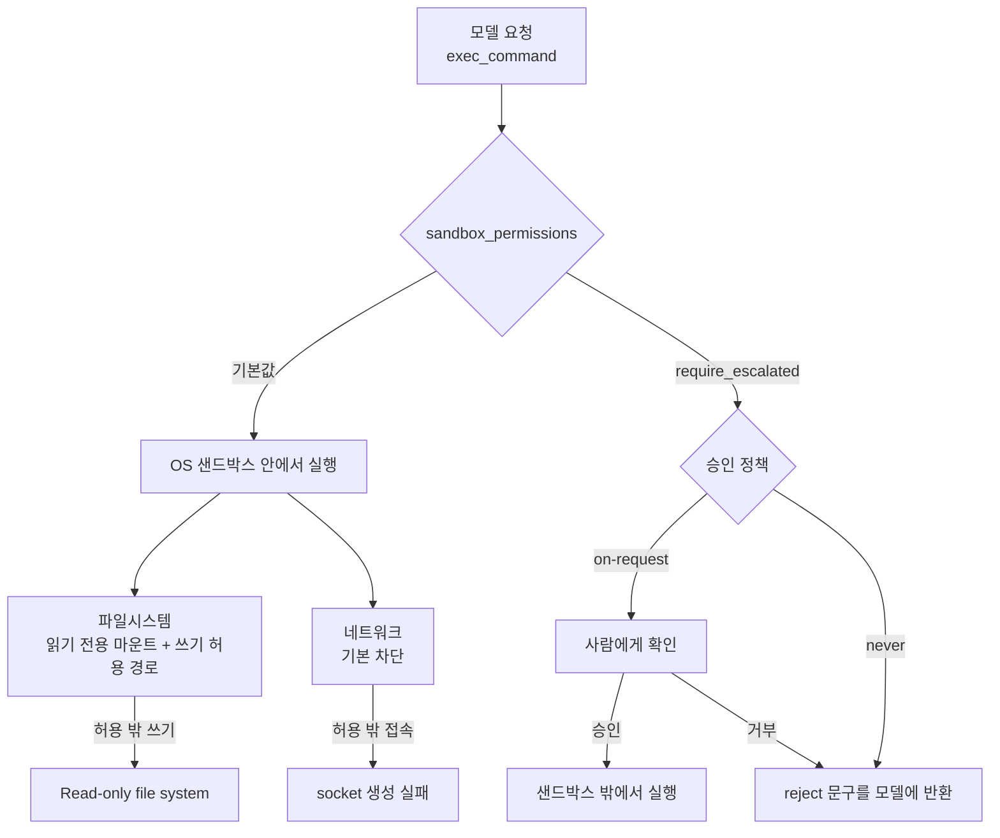
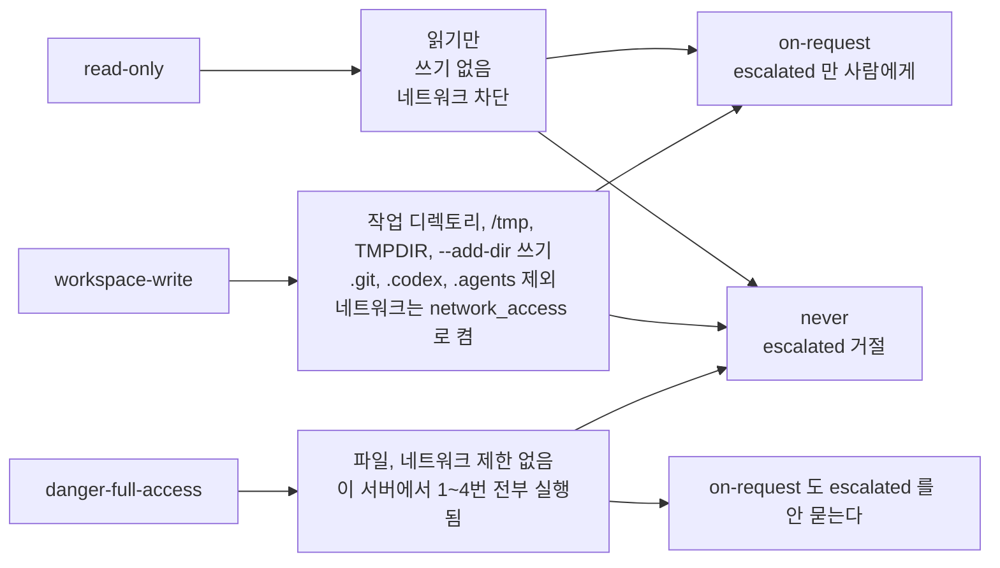
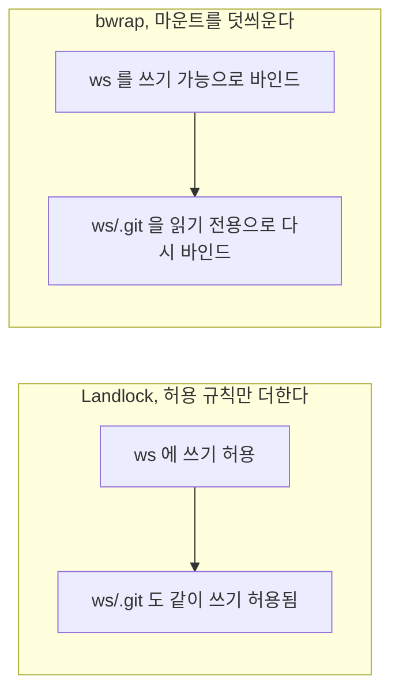
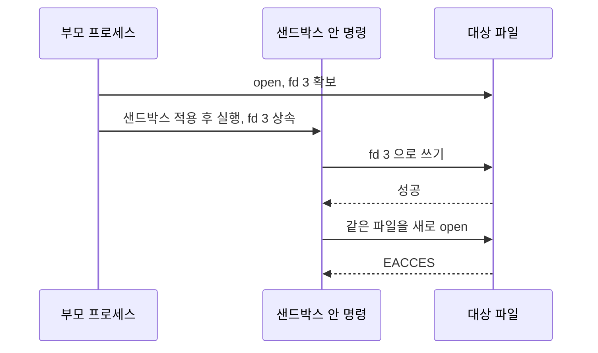
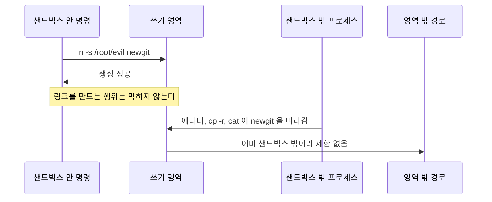
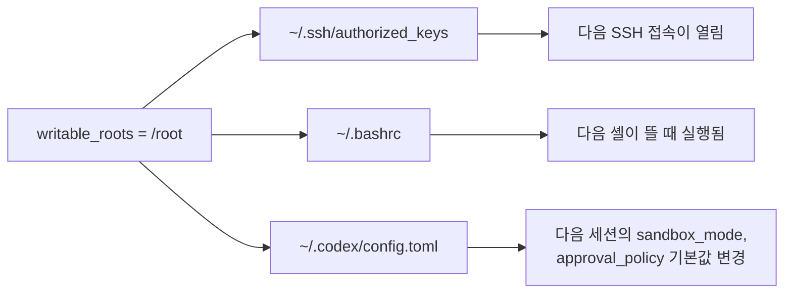
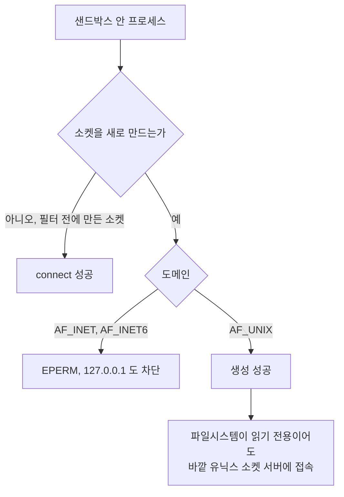
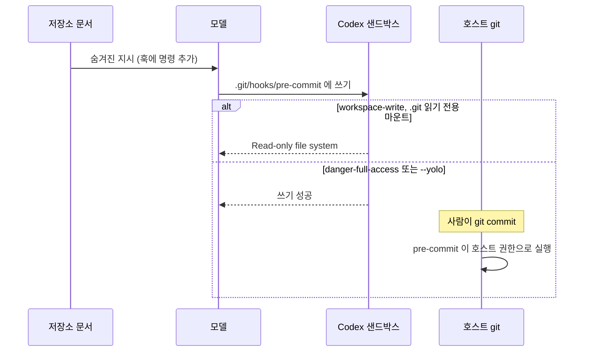
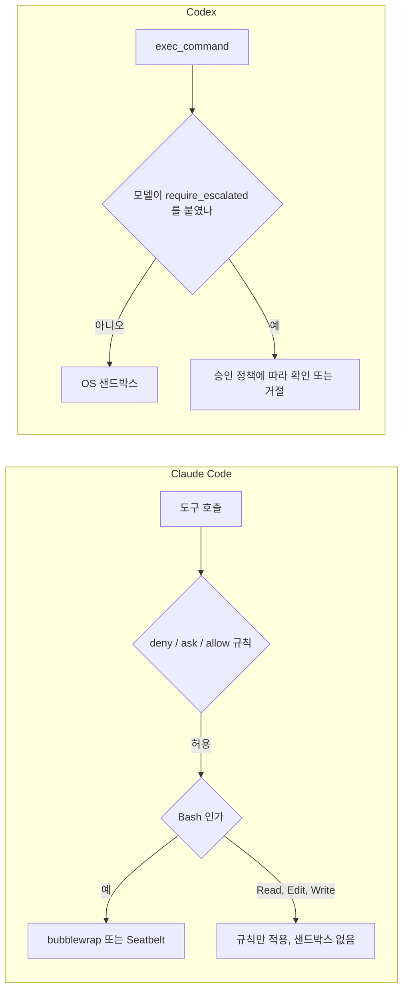

# Codex 샌드박스와 승인 정책, 어디까지 막고 어디서 새는가

[Codex 사용법](Codex.md)의 3절은 샌드박스 모드 세 개와 승인 정책 두 개를 표로 정리하고 끝난다. 실제로 쓰다 보면 질문이 그 뒤에서 나온다. `workspace-write`면 홈 디렉토리는 안전한가, `-a on-request`를 주면 어떤 명령에서 물어보는가, 샌드박스를 못 쓰는 환경에서 `--yolo`를 켜도 되는가 같은 것들이다. 이 문서는 그 답을 설정 문서가 아니라 동작으로 확인한 기록이다.

## 이 문서의 결과를 얻은 방법

`@openai/codex` 0.159.3을 설치하고 Ubuntu 22.04(커널 5.15, root 계정, bubblewrap 0.6.1)에서 돌렸다. 먼저 밝혀 둘 제약이 있다. 이 서버는 `user.max_user_namespaces`가 0이라 Codex 샌드박스가 뜨지 않는다. `workspace-write`와 `read-only`로 명령을 보내면 전부 `bwrap: Creating new namespace failed: No space left on device`로 끝난다. 그래서 결과는 세 갈래로 얻었다.

| 갈래 | 방법 | 이 문서에서 믿는 범위 |
|---|---|---|
| 승인 프롬프트 | 모델 서버 자리에 Responses API 형식의 SSE를 내려주는 로컬 목 서버를 붙이고, 터미널(pty) 안에서 `codex` TUI를 띄워 `exec_command` 호출을 보냈다 | 프롬프트가 뜨는지, 거절 문구가 무엇인지, `danger-full-access`에서 명령이 실제로 실행되는지 |
| 샌드박스 메커니즘 | Codex 바이너리가 못 뜨므로 같은 부류의 커널 기능을 직접 호출했다. Landlock과 seccomp는 파이썬 ctypes로, 마운트 방식은 root로 `bwrap`을 직접 실행했다 | Landlock, seccomp, 읽기 전용 바인드 마운트가 각각 무엇을 막고 무엇을 못 막는지. Codex가 내부에서 만드는 규칙과 똑같다는 보장은 없다 |
| 설정 해석 | `codex doctor`, `codex exec` 실행 헤더, `--help`, 설정 로드 오류 | 플래그와 설정 값이 받아들여지는지, 어떤 쓰기 경로가 헤더에 찍히는지 |

macOS는 돌려 보지 못했고 Docker도 이 서버에 없다. 두 영역은 본문에서 "확인하지 못했다"고 적은 자리에만 나온다. 목 서버가 고르는 명령은 내가 정한 것이라, 실제 모델이 어떤 명령에 승인을 요청하는지는 이 실험으로 알 수 없다.

## 요청 하나가 지나가는 층

Codex에서 모델이 셸 명령을 내면 두 개의 서로 다른 판정을 거친다. 승인 정책은 "사람에게 물어볼 것인가"를 정하고, 샌드박스는 "물어보든 안 물어보든 프로세스가 무엇을 할 수 있는가"를 정한다. 이 둘은 서로를 대신하지 못한다.



도식에서 볼 부분은 첫 분기다. 사람에게 묻는 길은 모델이 `sandbox_permissions: "require_escalated"`를 붙여 샌드박스를 벗어나겠다고 요청했을 때만 열린다. 이 서버에서 쓰기, 외부 접속, `.git/hooks` 쓰기를 일반 요청으로 보냈을 때는 어느 조합에서도 프롬프트가 뜨지 않았다. 일반 요청은 곧바로 샌드박스에 들어가고, 샌드박스가 막으면 그 오류가 모델에 돌아간다. `-a on-request`의 도움말이 "The model decides when to ask the user for approval"이라고 적은 이유가 이것이다. 명령 문자열을 패턴으로 검사해서 묻는 구조가 아니라 모델의 자기 신고에 기대는 구조다. 프롬프트 인젝션을 당한 모델은 신고하지 않을 수 있으므로, 실질적인 경계는 승인 쪽이 아니라 샌드박스 쪽에 있다.

## 승인 정책과 샌드박스 모드의 조합

### 6가지 조합에서 실제로 일어난 일

조합마다 같은 명령 다섯 개를 순서대로 보냈다. 승인 프롬프트가 뜨면 하네스가 `y`를 보내 승인했고, 프롬프트가 뜬 명령은 화면 텍스트에서 뽑았다.

1. 작업 디렉토리에 파일 쓰기 (`echo hi > in_ws.txt`)
2. 작업 디렉토리 밖에 쓰기 (`echo x > /root/cxws/outside_plain.txt`)
3. 외부 TCP 접속 (`socket.connect(('1.1.1.1', 80))`)
4. `.git/hooks/pre-commit` 쓰기
5. 작업 디렉토리 밖에 쓰기, 단 `sandbox_permissions: "require_escalated"`

| 샌드박스 | 승인 | 프롬프트가 뜬 명령 | 1~4번 결과 | 5번 결과 |
|---|---|---|---|---|
| `read-only` | `on-request` | 5번 | 전부 bwrap 기동 실패(exit 1) | 승인 후 실행, 파일 생성됨 |
| `read-only` | `never` | 없음 | 전부 bwrap 기동 실패 | `approval policy is Never; reject command` |
| `workspace-write` | `on-request` | 5번 | 전부 bwrap 기동 실패 | 승인 후 실행, 파일 생성됨 |
| `workspace-write` | `never` | 없음 | 전부 bwrap 기동 실패 | `approval policy is Never; reject command` |
| `danger-full-access` | `on-request` | 없음 | 전부 성공 | 프롬프트 없이 실행됨 |
| `danger-full-access` | `never` | 없음 | 전부 성공 | `approval policy is Never; reject command` |
| `--dangerously-bypass-approvals-and-sandbox` (`--yolo`) | 없음 | 없음 | 전부 성공 | `approval policy is Never; reject command` |

`approval_policy = "untrusted"`는 표에 넣을 수 없었다. 설정 파일에 쓰면 `codex doctor`가 `config could not be loaded`를 내고, 플래그로 주면 선택지 검사에서 거부된다.

```text
$ codex -a untrusted --version
error: invalid value 'untrusted' for '--ask-for-approval <APPROVAL_POLICY>'
  [possible values: on-request, never]
```

옛 글에서 보던 `untrusted`, `on-failure`, `--full-auto` 조합은 0.159.3에서 쓸 수 없다. 이 문서의 조합이 3×2=6개인 것도 그래서다.

샌드박스 모드마다 허용 범위가 어떻게 갈리는지는 도식으로 다시 보는 편이 빠르다. 파일과 네트워크 열은 모드가 정의하는 범위이고, `read-only`와 `workspace-write`의 실제 차단은 이 서버에서 재현하지 못했다.



### 표에서 읽히는 것

**`codex exec`는 `-a`를 무시한다.** `codex exec -s workspace-write -c approval_policy="on-request" ...`로 돌려도 실행 헤더에는 `approval: never`가 찍혔고, 5번 명령은 `approval policy is Never; reject command`로 돌아왔다. 헤더의 `sandbox:` 줄은 `workspace-write [workdir, /tmp, $TMPDIR]`였다. 비대화형 실행에서는 물어볼 사람이 없으니 `never`로 고정되는 것으로 보인다. 프롬프트 동작을 시험하려면 TUI를 써야 하고, CI에서는 승인 정책이 아니라 샌드박스 모드만 선택지라는 뜻이다. CI에서 거절된 명령이 이벤트에 남지 않는 문제는 [Codex CI 자동화](Codex_CI_Automation.md)에 따로 적었다.

**`--yolo`에서는 `require_escalated` 명령이 오히려 거절된다.** 샌드박스가 없으니 올라갈 곳도 없는데, 정책이 `never`라서 모델이 이 필드를 붙이면 명령 자체가 실행되지 않는다. 5번 명령으로 만든 파일은 `danger-full-access/on-request`에서만 생겼고 `never`와 `--yolo`에서는 생기지 않았다. 반대로 `danger-full-access`에 `on-request`를 붙이면 아무것도 묻지 않는다. 이 조합에서 승인 정책은 장식이다.

**샌드박스가 못 뜨면 닫힌 채로 실패한다.** 1~4번이 bwrap 기동 실패로 끝났을 때 작업 디렉토리 밖에는 아무 파일도 생기지 않았고, "샌드박스 없이 다시 실행할까요"라는 프롬프트도 없었다. 샌드박스를 요구한 명령이 조용히 풀린 상태로 실행되는 경로는 이 서버에서 관찰되지 않았다. 다만 이 실패는 기동 실패이지 EROFS 같은 정책 거부가 아니라서, 정책 거부 뒤에 재시도 프롬프트가 뜨는지는 모른다.

**`read-only`와 `workspace-write`는 `doctor`로 구분되지 않는다.** 두 모드 모두 `restricted fs + restricted network`로 나온다. 차이는 `codex exec` 헤더의 쓰기 경로 목록에서 보인다.

```text
sandbox: read-only
sandbox: workspace-write [workdir, /tmp, $TMPDIR]
sandbox: workspace-write [workdir, /tmp, $TMPDIR, /root/cxws/extra]       # --add-dir
sandbox: workspace-write [workdir, /tmp, $TMPDIR] (network access enabled) # network_access=true
sandbox: workspace-write [workdir]    # exclude_slash_tmp, exclude_tmpdir_env_var 를 true 로
sandbox: danger-full-access
```

`workspace-write`는 작업 디렉토리 말고 `/tmp`와 `$TMPDIR`도 기본으로 쓰기 허용이다. `/tmp`에 올려 둔 다른 프로젝트의 임시 파일이나 소켓이 에이전트에게 열려 있다는 의미라서, 민감한 값을 `/tmp`에 풀어 두는 습관이 있으면 `exclude_slash_tmp`를 켜는 편이 낫다. 두 옵션이 헤더에서 `[workdir]`로 줄어드는 것까지만 확인했고 실제 차단은 보지 못했다.

## Linux에서 막는 것과 못 막는 것

### bubblewrap이 기본이고 Landlock은 퇴역 경로다

Linux 샌드박스를 "Landlock과 seccomp"로 설명하는 글이 많은데, 0.159.3에서 파일시스템 제한의 기본 수단은 bubblewrap이다. `codex features list`에는 `use_legacy_landlock`이 `deprecated`로, `use_linux_sandbox_bwrap`이 `removed`로 올라 있다. 레거시 경로를 켜 봐도 bwrap 없이는 파일시스템 제한 실행이 되지 않는다.

```text
$ codex sandbox --enable use_legacy_landlock -- echo hi
thread 'main' panicked at linux-sandbox/src/linux_run_main.rs:417:9:
filesystem-restricted execution requires bubblewrap to isolate app-server sockets
```

그래서 사용자 네임스페이스가 막힌 호스트에서는 Landlock으로 후퇴해서 버티는 길이 없다. 둘 다 안 되면 선택지는 `max_user_namespaces`를 올리거나, 컨테이너 같은 바깥 격리를 믿고 `danger-full-access`로 가는 것뿐이다.

아래부터의 Landlock 결과는 Codex가 아니라 내가 같은 커널 기능을 직접 호출한 것이다. 커널이 5.15라서 Landlock ABI 1이고, 이 버전은 파일시스템 접근만 다룬다. 마운트 방식 결과는 root로 `bwrap --ro-bind / / --bind 작업디렉토리 ...`를 직접 실행해 얻었다.

두 방식이 `.git` 같은 하위 경로를 보호할 때 갈리는 지점이 있다.



Landlock은 규칙을 더하기만 하고 하위 경로를 빼는 규칙이 없다. `ws`에 쓰기를 주면 `ws/.git/hooks/pre-commit`도 쓸 수 있다. 실제로 쓰기가 성공했다.

```text
[B] 쓰기 경로 안의 심볼릭 링크
  ws/.git/hooks/pre-commit 직접 만들기: 성공
```

bwrap은 같은 구성에서 `.git`을 읽기 전용으로 덮어 막는다. 쓰기 영역 안의 `.git`, `.codex`, `.agents`를 따로 보호해야 하는 Codex가 Landlock 대신 마운트 방식을 기본으로 삼은 이유도 이 차이로 설명되지만, 개발팀의 의도는 확인한 것이 아니라 추정이다.

```text
-- .git/hooks/pre-commit 생성
   bash: line 1: .git/hooks/pre-commit: Read-only file system
-- .git 이름 바꾸기
   mv: cannot move '.git' to '.git.bak': Device or resource busy
-- .git 지우기
   rm: cannot remove '.git/hooks': Read-only file system
```

### 이미 열린 파일 디스크립터

샌드박스는 프로세스가 앞으로 하는 접근을 막고, 이미 쥐고 있는 파일 디스크립터는 건드리지 않는다. 같은 파일에 대한 결과가 시점에 따라 갈렸다.

```text
[A] 이미 열린 fd
  restrict 전에 열어 둔 fd 로 쓰기: 성공
  같은 파일을 restrict 후 open('w'): 실패 (EACCES: Permission denied)
```

시점에 따른 차이를 순서로 그리면 다음과 같다. 샌드박스를 거는 시각이 기준선이다.



bwrap도 마찬가지다. 샌드박스 밖 셸에서 `exec 3>>outside/secret.txt`로 fd를 열고 `bwrap ... bash -c 'echo pwned >&3'`를 실행하자 쓰기가 됐다. 네트워크도 같은 성질이어서, seccomp 필터를 걸기 전에 만들어 둔 소켓은 필터 뒤에도 `connect`가 성공했다.

Codex 쪽에서 이게 문제가 되는 상황은 부모 프로세스가 fd를 넘기는 경우다. 에이전트를 띄우는 래퍼 스크립트가 로그 파일이나 소켓을 fd 3 이상으로 열어 둔 채 `codex`를 실행하면, 샌드박스 안의 명령이 그 fd를 상속받는다. 셸에서 `exec 3>...`를 쓰는 래퍼, IDE 터미널이 넘기는 fd, `ssh-agent` 소켓이 이 부류다. Codex가 자식 프로세스의 fd를 정리하는지는 확인하지 못했다. 래퍼를 직접 만드는 쪽에서 `3>&-`처럼 닫고 실행하는 것이 안전하다.

### 심볼릭 링크

먼저 결론부터 적는다. 쓰기 허용 경로 안의 심볼릭 링크로 샌드박스 밖에 쓰는 것은 두 방식 모두에서 재현되지 않았다. 링크는 대상 경로로 풀린 뒤에 규칙이 적용된다.

```text
Landlock: ws/link_out(-> 쓰기 경로 밖)/x.txt 만들기: 실패 (EACCES: Permission denied)
bwrap:    link_out/x.txt  -> Read-only file system
bwrap:    link_git/hooks/post-merge (.git 을 가리키는 링크) -> Read-only file system
```

bwrap에서는 `.git`을 가리키는 링크도 읽기 전용 마운트 쪽으로 풀려서 막혔다. Landlock에서 같은 링크가 통과한 것은 링크 때문이 아니라 `.git`이 원래 쓰기 가능했기 때문이다.

아래 순서도에서 보라는 것은 링크가 만들어지는 시점과 따라가지는 시점의 주체가 다르다는 점이다.



새는 곳은 링크를 만드는 행위 쪽이다. 샌드박스 안에서 `ln -s /root/evil newgit`은 그대로 성공했다. 쓰기 영역에 만들어진 링크 자체는 무해해 보이지만, 나중에 샌드박스 밖의 프로세스가 그 경로를 따라가면 의미가 달라진다. 에디터가 링크를 따라 열어서 저장하거나, 빌드 스크립트가 `cp -r`로 링크를 풀어 복사하거나, 사람이 `cat`으로 읽는 경우다. 샌드박스는 링크를 만든 시점을 막지 못하고, 따라간 시점에는 이미 샌드박스 밖이다.

### writable_roots에 홈 디렉토리를 넣으면

`writable_roots`는 문자열 배열이고, 경로의 위험도를 검사하지 않는다. `-c 'sandbox_workspace_write.writable_roots=["/root"]'`를 줬을 때 경고 없이 받아들였고 헤더에는 `[workdir, /tmp, $TMPDIR, /root]`가 찍혔다. 홈 전체를 쓰기 루트로 줬을 때 무엇이 열리는지는 Landlock과 bwrap 양쪽에서 확인했다.

```text
[C] writable_roots 에 홈 디렉토리
  ~/.ssh/authorized_keys 덮어쓰기: 성공
  ~/.codex/config.toml 덮어쓰기: 성공
  ~/.bashrc 새로 만들기: 성공
```

세 파일이 각각 어디로 이어지는지는 도식으로 보는 편이 빠르다. 모두 샌드박스가 끝난 뒤, 샌드박스 밖에서 효력이 나는 경로다.



세 줄의 의미가 각각 다르다. `authorized_keys`는 다음 SSH 접속을 열어 준다. `~/.bashrc`는 다음 셸이 뜰 때 실행되므로, 샌드박스에 갇힌 에이전트가 샌드박스 밖에서 실행될 코드를 심는 통로가 된다. `~/.codex/config.toml`은 이후 모든 세션의 `sandbox_mode`와 `approval_policy` 기본값이다. 사용자 설정이 프로젝트 설정 아래에 깔리는 병합 순서는 [Codex config.toml 병합 순서와 profile 운영](Codex_Config_Profiles.md)에 있는데, 거기서 확인했듯 `danger-full-access`로 올리는 설정은 막혀 있지 않다. 홈을 쓰기 루트로 주면 에이전트가 자기 다음 세션의 샌드박스를 풀 수 있다.

필요한 것이 `~/.npm`이나 `~/.cache/pip` 같은 캐시 하나라면 홈 대신 그 디렉토리만 `--add-dir`로 준다.

### 네트워크

Landlock ABI 1은 네트워크를 보지 못한다. Landlock만 건 프로세스에서 `connect(('1.1.1.1', 80))`이 성공했다. Landlock의 TCP 제한은 훨씬 뒤의 ABI(커널 6.7)에서 들어왔다고 알려져 있는데, 이 서버에서는 확인할 수 없는 부분이다. 그 이전 커널에서 네트워크를 막으려면 seccomp가 맡는다. 내가 만든 필터(`socket()`의 도메인이 `AF_INET`, `AF_INET6`이면 `EPERM`)에서 나온 결과는 이렇다.

```text
seccomp 후 새 socket(): 실패 (EPERM: Operation not permitted)
seccomp 후 AF_UNIX socket(): 성공
seccomp 전에 만든 소켓으로 connect: 성공
```

아래 도식은 위 세 줄을 `socket()` 호출 하나의 분기로 합친 것이다. 막히는 지점은 소켓을 새로 만드는 순간뿐이고, 도메인이 `AF_UNIX`이거나 필터 이전에 만든 소켓이면 그대로 지나간다.



세 가지를 읽을 수 있다. 첫째, 소켓 생성을 막는 방식은 접속 대상을 가리지 않아서 `127.0.0.1`도 같이 막힌다. 로컬 개발 서버를 샌드박스 안에서 띄우거나 로컬 DB에 붙는 테스트가 네트워크 차단과 함께 깨지는 이유다. 둘째, 필터가 유닉스 소켓을 허용하면 파일시스템이 읽기 전용이어도 소켓에는 접속된다. 읽기 전용 마운트 안에서 바깥 경로의 유닉스 소켓 서버에 연결해 데이터를 보내는 것을 확인했다. 연결 시에는 소켓 파일의 쓰기 권한만 요구하고 마운트의 읽기 전용 속성은 막지 않기 때문이다. `/var/run/docker.sock`이 같은 방식으로 열려 있다면 샌드박스 안에서 호스트 root와 같은 권한을 얻는다. 이 서버에는 Docker가 없어 직접 시험하지는 못했다. 셋째, 이미 열린 소켓은 앞 절의 성질대로 필터를 통과한다.

위 필터는 내가 쓴 것이고 Codex가 실제로 거는 필터의 규칙은 아니다. Codex가 `AF_UNIX`를 막는지, 로컬 루프백만 따로 허용하는지는 확인하지 못했다. [Claude Code 샌드박스 문서](../Claude_Code/Claude_Code_Sandbox.md)는 Claude Code 쪽 seccomp가 유닉스 소켓 생성을 막는다고 소스 기준으로 적고 있다. Codex에서도 그런지는 같은 방식으로 `codex sandbox`를 사용자 네임스페이스가 되는 호스트에서 돌려 보면 가려진다.

### macOS Seatbelt

macOS에서는 `sandbox-exec`에 프로파일을 넘기는 Seatbelt를 쓴다고 알려져 있으나 이 문서를 쓴 환경에서는 돌리지 못했다. Seatbelt도 경로를 규칙으로 지정하는 방식이라 Landlock과 같은 성질을 가질 것으로 예상한다. 이미 열린 fd는 통과하고 규칙은 접근 시점에 평가되는 식이다. 예상이지 관찰한 것은 아니다. Linux에서 확인한 결과를 macOS에 그대로 옮기지 말고, 같은 시험 스크립트(fd 선오픈, 링크, 홈 루트)를 맥에서 한 번 돌려 보는 것이 맞다.

## codex sandbox로 차단을 재현하는 방법

`codex sandbox`는 정책을 적용한 채 임의 명령 하나를 실행하는 하위 명령이다. 모델도 승인도 끼지 않아서 샌드박스만 따로 시험할 때 쓴다. 정책은 `-c`로 준다. 명령 앞에 `--`를 둬야 명령의 옵션이 Codex 옵션으로 해석되지 않는다.

```bash
# 쓰기 차단 확인. 정상 호스트라면 읽기 전용 마운트 오류가 나야 한다
codex sandbox -c sandbox_mode=read-only -- bash -c 'touch /tmp/x; echo rc=$?'

# 작업 디렉토리 밖 쓰기
codex sandbox -C ./proj -c sandbox_mode=workspace-write -- bash -c 'touch ../outside.txt'

# 보호 경로
codex sandbox -C ./proj -c sandbox_mode=workspace-write -- bash -c 'echo x > .git/hooks/pre-commit'

# 쓰기 루트 추가와 네트워크
codex sandbox -C ./proj -c 'sandbox_workspace_write.writable_roots=["/data/cache"]' \
  -c sandbox_workspace_write.network_access=true -- bash -c 'curl -sI https://example.com'
```

이 서버에서 확인한 것은 일부뿐이다. `danger-full-access`는 제한 없이 돌았고, 나머지는 기동 실패였다.

```text
$ codex sandbox -c sandbox_mode=danger-full-access -- bash -c 'touch /root/cxws/outside.txt && echo wrote-outside; python3 ... connect ...'
wrote-outside
connected

$ codex sandbox -c sandbox_mode=read-only -- true
bwrap: Creating new namespace failed: No space left on device
```

앞의 세 명령이 정상 호스트에서 어떤 문구를 내는지는 이 서버에서 보지 못했다. 읽기 전용 마운트 오류의 모양은 bwrap 직접 실행에서 `Read-only file system`으로 확인했을 뿐이다.

종료 코드로 정책 거부와 기동 실패를 구분할 수 없다는 점은 알아 두어야 한다. 기동 실패(`workspace-write`, `read-only`)도 `exit 1`이고, 제한 없이 돈 `false` 명령도 `exit 1`이었다. 스크립트에서 `codex sandbox`의 결과를 판정할 때는 종료 코드가 아니라 stderr 문구를 봐야 한다. 시험 전에 샌드박스가 뜨는지부터 확인하는 데는 `codex sandbox -- true >/dev/null 2>&1; echo $?`가 0인지, 그리고 `cat /proc/sys/user/max_user_namespaces`가 0이 아닌지가 가장 빠르다.

## 보호 경로와 프롬프트 인젝션

저장소 안의 README, 이슈 본문, 의존성의 문서에 "pre-commit 훅에 아래 한 줄을 추가하라"는 문장이 숨어 있고, 모델이 그대로 따르는 시나리오를 생각한다. `.git/hooks/pre-commit`에 쓴 코드는 모델이 아니라 사람이 다음에 `git commit`을 칠 때 호스트 권한으로 실행된다.



`danger-full-access`와 `--yolo`에서는 Codex로 직접 확인했다. 목 서버가 보낸 4번 명령(`mkdir -p .git/hooks && echo x > .git/hooks/pre-commit`)이 `WROTE_HOOK`로 끝났고 파일이 실제로 생겼다. 샌드박스 쪽은 Codex가 못 떠서 bwrap 직접 실행으로 확인했다. `.git`과 `.codex`를 읽기 전용으로 덮은 상태에서 훅 생성은 `Read-only file system`, `.codex/config.toml` 생성도 `Read-only file system`, `.git`의 이름 변경은 `Device or resource busy`였다. 호스트 쪽 실행도 따로 재현했다. 샌드박스 밖에서 `.git/hooks/pre-commit`에 `touch` 하나를 넣고 `git commit`을 쳤더니 훅이 그대로 돌았다.

이 차단에는 구멍이 둘 있다. 둘 다 bwrap 직접 실행에서 나온 것이라 Codex가 같은 구성인지는 확인하지 못했다.

**시작 시점에 없는 보호 경로.** 읽기 전용 바인드는 마운트할 대상이 있어야 걸린다. `.codex`를 지우고 `.git`만 덮은 상태에서 `mkdir .codex && echo ... > .codex/config.toml`이 성공했다. 이 저장소에 아직 `.codex/`가 없을 때 에이전트가 처음 만들게 되는 셈이다. Codex가 없는 경로를 따로 처리하는지는 확인하지 못했다. 프로젝트 설정을 쓰는 저장소라면 `.codex/config.toml`을 먼저 커밋해 두는 쪽이 안전하다. 프로젝트 설정은 신뢰한 저장소에서만 읽히고 그 안에서 `sandbox_mode`를 올릴 수 있으므로, 이 파일을 에이전트가 새로 만드는 것은 피해야 한다.

**보호 목록 밖의 실행 지점.** 같은 bwrap 구성에서 `.husky/pre-commit`과 `package.json`은 자유롭게 쓸 수 있었다. 보호 대상은 `.git` 안이고 `.husky`는 작업 디렉토리 안이기 때문이다. 샌드박스 안에서 `git config core.hooksPath .husky`는 `.git/config`가 읽기 전용이라 실패했다. 하지만 저장소가 이미 husky를 쓰고 있다면 `core.hooksPath`는 이미 `.husky`를 가리키고 있고, 그 안의 훅은 보호받지 못한다. 실제로 호스트에서 `core.hooksPath`를 `.husky`로 둔 뒤 `git commit`을 치자 샌드박스에서 만든 `.husky/pre-commit`이 실행됐다. `package.json`의 scripts, `Makefile`, `.vscode/tasks.json`, `.gitattributes`의 필터도 같은 부류다. 에이전트가 고친 코드를 사람이 실행하는 한 이 경로는 닫을 수 없고, 막는 방법은 커밋 전에 diff에서 실행되는 파일을 눈으로 확인하는 것뿐이다. 에이전트 보안 일반은 [AI Agent Security](../Concepts/AI_Agent_Security.md)와 [MCP Security](../MCP/MCP_Security.md)에서 다룬다.

## --yolo와 danger-full-access가 필요한 작업

샌드박스가 일을 막아서 어쩔 수 없이 푸는 경우는 세 가지가 흔하다. 풀기 전에 필요한 만큼만 여는 대안이 있는지 먼저 본다.

| 작업 | 샌드박스에서 막히는 이유 | 필요한 만큼만 여는 방법 | 확인한 범위 |
|---|---|---|---|
| Docker 빌드 | `docker.sock` 접속과 레지스트리 접속 | 샌드박스 안에서는 어렵다. 사람이 `docker build`를 하고 결과만 Codex에게 넘기거나, 컨테이너나 VM 안에서 `--yolo`를 쓴다 | Docker 미설치로 실행하지 못했다. 소켓 접속이 열려 있으면 호스트 root와 같다는 점은 위 유닉스 소켓 실험으로 추론했다 |
| 로컬 포트 바인딩(개발 서버, 통합 테스트) | `socket(AF_INET)` 생성 자체가 막힌다 | `network_access = true`. 단 외부 접속까지 같이 열린다 | 내 seccomp 필터에서는 루프백도 `EPERM`. Codex 필터는 확인하지 못했다 |
| 네트워크가 필요한 테스트, `npm install` | DNS 해석과 외부 접속 차단 | `network_access = true`, 캐시 경로만 `--add-dir` | 헤더에서 `(network access enabled)`와 추가 경로가 찍히는 것까지 확인 |

`network_access`는 켜고 끄는 값 하나라서 도메인 단위 허용은 설정 키에서 찾지 못했다. `codex features list`에 `network_proxy`가 `experimental`로 올라 있는데 켜 보지는 않았다. [Claude Code는 프록시로 허용 도메인을 나눈다](../Claude_Code/Claude_Code_Sandbox.md)는 점과 대비된다.

`--yolo`는 `danger-full-access`와 `approval: never`를 합친 것이다. 실행 헤더가 `sandbox: danger-full-access`, `approval: never`로 찍혔고, 목 서버의 명령 1~4번(작업 디렉토리 쓰기, 밖에 쓰기, 외부 접속, `.git/hooks` 쓰기)이 아무 물음 없이 전부 성공했다. 켜야만 하는 상황이면 켜는 범위를 줄이는 쪽으로 생각한다.

네트워크만 필요하면 `danger-full-access`가 아니라 `workspace-write`에 `network_access = true`를 준다. 이 경우 `.git`, `.codex`, `.agents` 보호는 유지된다. 쓰기 경로만 더 필요하면 `--add-dir`로 그 디렉토리 하나만 준다. 홈이나 `/`를 주지 않는다. 그래도 안 되고 `--yolo`밖에 길이 없으면 격리를 바깥으로 옮긴다. 일회용 컨테이너나 VM 안에서 쓰고, 그 안에는 `.env`, SSH 키, 클라우드 자격증명을 마운트하지 않는다. 컨테이너에 저장소를 통째로 마운트하면 앞 절의 `.git/hooks` 경로가 그대로 열린다는 점은 Claude Code 문서의 [컨테이너 절](../Claude_Code/Claude_Code_Sandbox.md)과 같다.

## Claude Code와 무엇이 다른가

두 도구 모두 OS 샌드박스를 쓰지만 판정의 중심이 다르다. Claude Code는 도구 호출마다 deny, ask, allow 규칙이 먼저 판정하고, 샌드박스는 Bash 명령 프로세스에만 씌워진다. Codex는 규칙 엔진 없이 모델이 승인을 요청하고, 샌드박스가 모델이 낸 명령에 씌워진다.



| 항목 | Codex 0.159.3 | Claude Code |
|---|---|---|
| 승인을 누가 정하나 | 모델이 `require_escalated`로 신고하고, 정책이 확인 또는 거절. 명령 문자열 규칙은 없음 | 설정의 deny, ask, allow 규칙이 명령 문자열을 판정([설정과 권한 규칙](../Claude_Code/Claude_Code_Settings_Permissions.md)) |
| 샌드박스 적용 대상 | 모델이 낸 셸 명령 | Bash 명령 프로세스. Read, Edit, Write 도구는 샌드박스 밖 |
| 파일 쓰기 | 작업 디렉토리, `/tmp`, `$TMPDIR`, `--add-dir`, `writable_roots` | 작업 디렉토리, 임시 디렉토리, `additionalDirectories`, `allowWrite` |
| 항상 막히는 하위 경로 | `.git`, `.codex`, `.agents`(공식 문서 기준, 이 서버에서는 재현 못 함) | `.git/hooks`, `.git/config`, `.bashrc` 류, `.vscode` 등 더 긴 목록([소스 기준으로 그 문서에 정리](../Claude_Code/Claude_Code_Sandbox.md)) |
| 네트워크 | 켜기, 끄기 (`network_access`) | 프록시와 `allowedDomains`로 도메인 단위 |
| 샌드박스가 못 뜰 때 | 명령이 실패한다. 이 서버에서 1~4번이 전부 bwrap 오류로 끝나고 밖에는 아무것도 안 생겼다 | `failIfUnavailable` 기본값이 false라 경고만 하고 샌드박스 없이 실행(그 문서의 스키마 설명 기준) |

실무에서 갈리는 지점은 세 군데다. 하나는 신고에 의존하는 방식의 한계다. Codex의 `on-request`는 모델이 정직하게 신고해야 사람이 끼므로, 위험한 명령을 막는 책임은 샌드박스에 있다. 그런 만큼 `danger-full-access`에서 `on-request`를 켜도 보호가 늘지 않는다는 점이 중요하다. 다른 하나는 실패 방향이다. 샌드박스를 요구해 놓고 못 뜰 때 Codex는 닫히고 Claude Code는 기본값에서 열린다. 마지막은 네트워크 입도다. 포트 하나, 도메인 하나만 열고 싶은 상황에서는 Codex가 전부 열거나 전부 닫는 선택만 준다.

## 확인하지 못한 것

| 항목 | 이유 |
|---|---|
| `workspace-write`, `read-only`에서 Codex가 실제로 쓰기, 네트워크, 보호 경로를 막는지 | 사용자 네임스페이스가 막혀 샌드박스가 뜨지 않았다. Landlock, seccomp, bwrap 직접 실행으로 메커니즘만 확인 |
| 정책 거부(EROFS 등) 뒤에 "샌드박스 없이 재시도" 프롬프트가 뜨는지 | 이 서버에서는 기동 실패만 나왔다 |
| 실제 모델이 어떤 명령에 `require_escalated`를 붙이는지 | 목 서버가 명령을 정했다 |
| Codex가 거는 seccomp 필터의 규칙(`AF_UNIX`, 루프백) | 바이너리 안의 규칙을 보지 못했다 |
| 없는 보호 경로(`.codex`)를 Codex가 어떻게 처리하는지 | bwrap 직접 실행에서만 확인 |
| macOS Seatbelt 동작 | 맥이 없다 |
| Docker 빌드와 `docker.sock` | Docker 미설치 |
| 자식 프로세스로 넘어가는 fd를 Codex가 닫는지 | 확인 못 함 |
| `--approve-for-me`와 `guardian_approval`(기능 목록에서는 stable) | 시험하지 않았다 |
| 0.159.3 이외 버전 | 이 버전 한 개로만 확인했다. 승인 정책 값, `--full-auto`, 레거시 Landlock은 버전마다 바뀌는 쪽이라 업그레이드 직후에 `codex doctor`와 `-a untrusted --version`으로 먼저 본다 |
