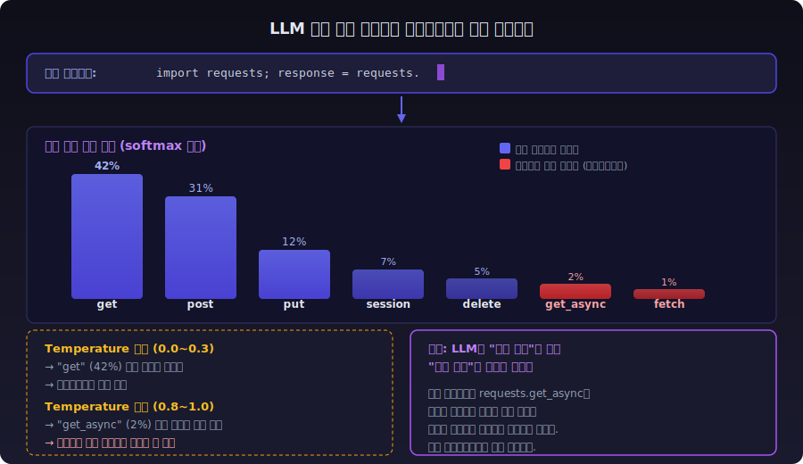
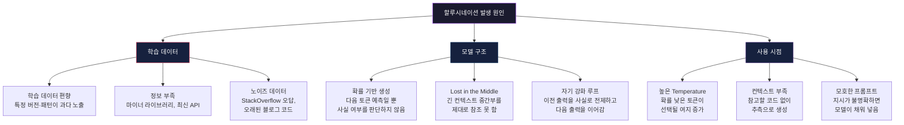
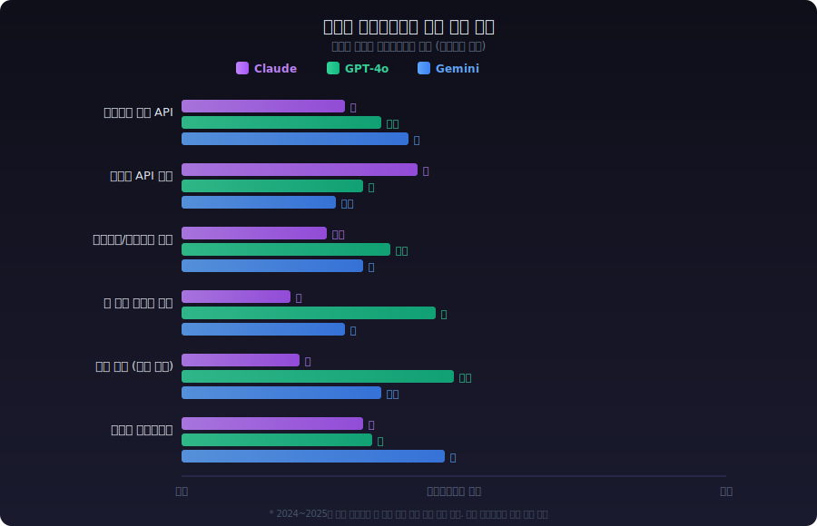
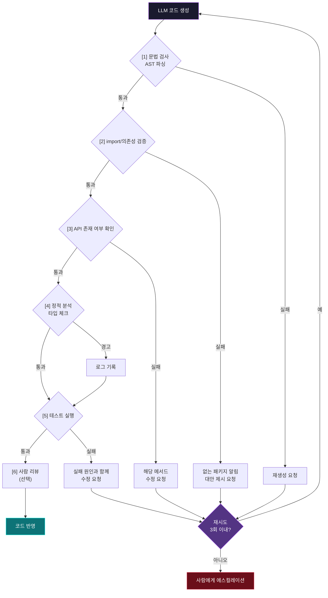
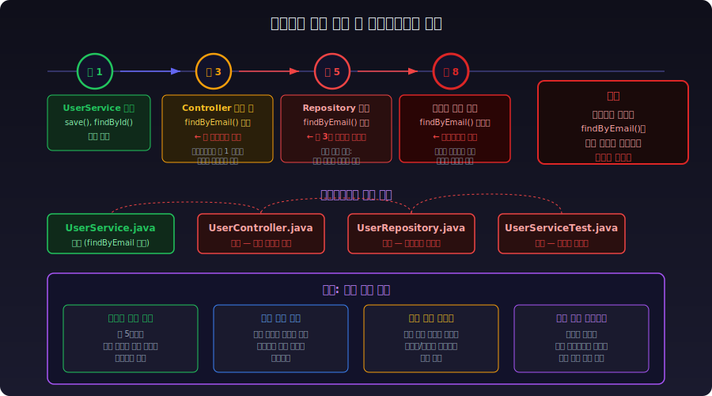

# AI 할루시네이션

## 1. 할루시네이션이란

LLM이 사실이 아닌 내용을 사실처럼 생성하는 현상이다. LLM은 "다음 토큰의 확률"을 예측하는 모델이지, 사실 관계를 저장하는 데이터베이스가 아니다. 그래서 통계적으로 그럴듯한 답을 만들어내되, 그게 실제로 맞는지는 모른다.

코딩 영역에서 할루시네이션은 특히 위험하다. 존재하지 않는 API를 자신 있게 알려주고, 없는 라이브러리를 추천하고, 틀린 코드를 정상 코드처럼 내놓는다. 컴파일 에러가 바로 나면 다행이지만, 런타임에서야 드러나는 잘못된 로직은 디버깅 시간을 잡아먹는다.

아래 그림은 LLM이 토큰을 생성할 때 할루시네이션이 어떻게 발생하는지를 보여준다. `requests.` 다음에 올 토큰의 확률 분포에서, 실제로 존재하지 않는 `get_async` 같은 메서드도 확률값을 갖는다. Temperature가 높으면 이런 토큰이 선택될 수 있다.



---

## 2. 할루시네이션 발생 원인

LLM이 할루시네이션을 일으키는 원인은 크게 세 갈래로 나뉜다. 학습 데이터 자체의 한계, 모델 구조의 특성, 그리고 사용 시점의 조건이다.



**학습 데이터 문제**: 학습 데이터에 특정 라이브러리의 구버전 코드가 많으면, 모델은 구버전 API를 "정답"으로 학습한다. SQLAlchemy 1.x 코드가 2.x보다 학습 데이터에 압도적으로 많으니, 2.x 프로젝트에서도 1.x 스타일 코드가 나온다. 마이너 라이브러리는 학습 데이터 자체가 부족해서 비슷한 이름의 다른 라이브러리 API를 섞어서 만들어낸다.

**모델 구조 문제**: LLM은 "통계적으로 그럴듯한 다음 토큰"을 고르는 모델이다. `requests.`까지 입력하면 학습 데이터에서 `requests.get`이 가장 많이 등장하니까 `get`을 고르는 식이다. 이 과정에서 실제 존재 여부는 확인하지 않는다. 컨텍스트가 길어지면 중간 부분에 있는 코드를 참조하지 못하는 "Lost in the Middle" 현상도 발생한다.

**사용 시점 문제**: Temperature가 높으면 확률이 낮은 토큰도 선택되어 엉뚱한 메서드 이름이 튀어나온다. 프롬프트에 프로젝트의 실제 코드를 넣어주지 않으면 모델이 추측에 의존하게 되고, 지시가 모호하면 모델이 빈 곳을 "창작"으로 채운다.

---

## 3. 코드 생성 시 할루시네이션 패턴

백엔드 개발에서 실제로 자주 마주치는 할루시네이션 유형을 정리한다.

### 3.1 존재하지 않는 API

가장 흔한 패턴이다. 라이브러리가 실제로 존재하더라도 없는 메서드를 만들어낸다.

```python
# 할루시네이션 — requests에 get_async()는 없다
import requests
response = requests.get_async("https://api.example.com/data")

# 실제 코드
import httpx
async with httpx.AsyncClient() as client:
    response = await client.get("https://api.example.com/data")
```

```java
// 할루시네이션 — HttpClient에 sendAsync()의 시그니처가 다름
HttpClient client = HttpClient.newHttpClient();
// 세 번째 인자로 timeout을 받는 오버로드는 존재하지 않는다
var response = client.sendAsync(request, bodyHandler, Duration.ofSeconds(30));
```

LLM은 "이 라이브러리에 이런 메서드가 있을 법하다"는 패턴으로 생성한다. 실제 API 문서를 참조하는 게 아니라 학습 데이터에서 비슷한 코드를 봤기 때문에 그럴듯하게 합성한다.

### 3.2 잘못된 시그니처와 파라미터

메서드 이름은 맞지만 파라미터 순서나 타입이 틀린 경우다. 이건 컴파일러가 잡아주는 경우도 있지만, 동적 타입 언어에서는 런타임까지 가야 발견된다.

```python
# 할루시네이션 — pandas read_csv의 encoding 파라미터 위치가 틀림
df = pd.read_csv("data.csv", "utf-8", header=True)
# header는 bool이 아니라 int 또는 list

# 실제
df = pd.read_csv("data.csv", encoding="utf-8", header=0)
```

특히 **버전별로 API가 달라진 라이브러리**에서 이 문제가 심하다. LLM 학습 데이터에 구버전 코드가 더 많으면 현재 버전의 시그니처와 맞지 않는 코드를 내놓는다. SQLAlchemy 1.x와 2.x의 차이, Django 3.x와 4.x의 차이 같은 곳에서 자주 발생한다.

### 3.3 가짜 라이브러리

아예 존재하지 않는 패키지를 추천하는 경우다.

```
사용자: Python으로 PDF에서 표를 추출하고 싶어
LLM: pdf-table-extract 라이브러리를 사용하면 됩니다.
     pip install pdf-table-extract

→ PyPI에 이런 패키지는 없다.
  실제로는 camelot-py, tabula-py 등을 써야 한다.
```

이 패턴이 위험한 이유가 따로 있다. 공격자가 LLM이 자주 추천하는 가짜 패키지 이름을 미리 파악해서, 그 이름으로 악성 패키지를 PyPI나 npm에 등록하는 **패키지 주입 공격**이 실제로 보고되고 있다. `pip install`을 하기 전에 패키지가 실재하는지, 다운로드 수와 관리 상태가 정상인지 확인하는 습관이 필요하다.

### 3.4 그럴듯한 설정 값

프레임워크 설정에서 존재하지 않는 옵션을 넣어주는 경우다.

```yaml
# 할루시네이션 — Spring Boot application.yml
spring:
  datasource:
    hikari:
      auto-reconnect: true        # HikariCP에 이런 옵션은 없다
      connection-test-on-borrow: true  # 이것도 없다. Tomcat DBCP 옵션과 혼동

# 실제 HikariCP 설정
spring:
  datasource:
    hikari:
      connection-test-query: SELECT 1
      validation-timeout: 3000
```

설정 오류는 애플리케이션이 시작은 되지만 의도한 대로 동작하지 않는 경우가 많아서, 발견이 늦다.

### 3.5 없는 CLI 옵션

```bash
# 할루시네이션 — docker compose에 --parallel 옵션은 없다
docker compose up --parallel 4

# 할루시네이션 — kubectl에 --dry-run=client는 있지만 --dry-run=local은 없다
kubectl apply -f deployment.yaml --dry-run=local
```

CLI 도구는 버전마다 옵션이 다르고, 학습 데이터에 여러 버전의 문서가 섞여 있어서 LLM이 혼동하기 쉬운 영역이다.

---

## 4. 모델별 할루시네이션 특성

모든 LLM이 똑같이 할루시네이션을 일으키는 건 아니다. 모델마다 자주 틀리는 영역과 패턴이 다르다.

### 4.1 Claude

**잘 하는 부분**: 긴 코드 컨텍스트에서 일관성 유지, 지시사항 준수. "모른다"고 답하는 빈도가 상대적으로 높다.

**자주 틀리는 부분**: 최신 라이브러리 API에서 구버전 코드를 내놓는 경우가 있다. 학습 데이터 컷오프 이후에 변경된 API에 대해서는 구버전 시그니처를 쓰면서 아무 경고를 하지 않는다. "확실하지 않다"고 표시하도록 프롬프트에 명시하면 표시 비율이 다른 모델보다 높은 편이다.

**특이점**: 시스템 프롬프트를 잘 따르는 편이라, "없는 API를 만들지 마라", "모르면 모른다고 해라" 같은 지시가 비교적 잘 먹힌다. 다만 100%는 아니다.

### 4.2 GPT-4o

**잘 하는 부분**: 범용 코딩 질문에서 빠르고 정확한 답변. 짧은 코드 스니펫 생성에서 정확도가 높다.

**자주 틀리는 부분**: 자신감이 과도한 경향이 있다. 틀린 답을 내놓으면서 "이 코드는 정상 작동합니다"라고 단언하는 경우가 Claude보다 잦다. 긴 코드를 생성할 때 앞부분에서 정의한 변수나 타입을 뒷부분에서 잊어버리는 현상이 종종 발생한다.

**특이점**: 코드 수정을 요청했을 때 원래 코드의 다른 부분까지 슬그머니 바꾸는 경우가 있다. 요청하지 않은 "개선"을 하면서 기존 로직을 깨뜨리는 상황이 발생한다.

### 4.3 Gemini

**잘 하는 부분**: Google 생태계(Android, GCP, Firebase) 관련 코드 정확도가 높다. 긴 문서를 참고해서 코드를 생성하는 작업에서 컨텍스트가 넓은 만큼 유리하다.

**자주 틀리는 부분**: Google 생태계 밖의 라이브러리에서 할루시네이션 비율이 높아지는 경향이 있다. 특히 Python 서드파티 라이브러리의 세부 API에서 부정확한 코드를 낼 때가 있다.

**특이점**: 코드보다 설명이 앞서는 경향이 있다. 코드를 달라고 했는데 장문의 설명 후에 코드가 나오고, 그 코드가 설명과 맞지 않는 경우가 간혹 있다. 생성된 코드와 앞의 설명을 대조해봐야 한다.

### 4.4 모델별 취약 영역 비교

아래 그림은 주요 모델 3개의 영역별 할루시네이션 빈도를 상대 비교한 것이다. 모델마다 강한 영역과 약한 영역이 다르기 때문에, 작업 특성에 따라 모델을 선택하거나 교차 검증을 하는 게 실무에서 도움이 된다.



### 4.5 공통적으로 취약한 영역

모델과 상관없이 할루시네이션이 빈번한 영역이 있다:

| 영역 | 이유 |
|------|------|
| 마이너 라이브러리 API | 학습 데이터가 적어 정보가 부족 |
| 최근 릴리즈된 기능 | 학습 데이터 컷오프 이후 변경사항 반영 불가 |
| 플랫폼별 차이 | macOS/Linux/Windows별 동작 차이를 혼동 |
| 에러 메시지 해석 | 실제로 해당 에러를 본 적 없는데 추측으로 원인 설명 |
| URL, 버전 번호, 날짜 | 구체적 사실 데이터를 합성하는 데 취약 |

---

## 5. 할루시네이션 탐지와 검증 파이프라인

코드 생성 결과를 사람이 매번 검토하는 건 확장이 안 된다. 자동화된 검증 파이프라인을 구축해야 LLM을 프로덕션에서 쓸 수 있다.

### 5.1 코드 컴파일/실행 기반 검증

가장 확실한 방법이다. 생성된 코드가 실제로 돌아가는지 확인한다.

```python
import subprocess
import tempfile
import os

def verify_generated_code(code: str, language: str) -> dict:
    """생성된 코드를 실제로 컴파일/실행해서 검증한다"""
    
    if language == "python":
        # 문법 검사 — 실행 없이 파싱만
        try:
            compile(code, "<generated>", "exec")
        except SyntaxError as e:
            return {"valid": False, "stage": "syntax", "error": str(e)}
        
        # import 검증 — 실제로 import가 되는지 확인
        imports = extract_imports(code)
        for module_name in imports:
            result = subprocess.run(
                ["python", "-c", f"import {module_name}"],
                capture_output=True, timeout=10
            )
            if result.returncode != 0:
                return {
                    "valid": False, 
                    "stage": "import",
                    "error": f"{module_name} 모듈을 찾을 수 없음"
                }
        
        # 샌드박스에서 실행
        with tempfile.NamedTemporaryFile(suffix=".py", mode="w", delete=False) as f:
            f.write(code)
            f.flush()
            result = subprocess.run(
                ["python", f.name],
                capture_output=True, timeout=30
            )
            os.unlink(f.name)
        
        return {
            "valid": result.returncode == 0,
            "stage": "execution",
            "stdout": result.stdout.decode(),
            "stderr": result.stderr.decode()
        }
    
    # Java, Go 등도 비슷한 구조로 확장
    raise ValueError(f"지원하지 않는 언어: {language}")


def extract_imports(code: str) -> list[str]:
    """코드에서 import 구문의 모듈명을 추출한다"""
    import ast
    tree = ast.parse(code)
    modules = []
    for node in ast.walk(tree):
        if isinstance(node, ast.Import):
            for alias in node.names:
                modules.append(alias.name.split(".")[0])
        elif isinstance(node, ast.ImportFrom) and node.module:
            modules.append(node.module.split(".")[0])
    return list(set(modules))
```

문법 검사 → import 검증 → 실행 순서로 단계를 나누는 게 중요하다. 문법 에러인데 실행까지 갈 필요는 없고, import가 안 되는데 로직을 실행할 필요도 없다.

### 5.2 API 존재 여부 검증

생성된 코드에서 사용하는 함수/메서드가 실제로 존재하는지 확인한다.

```python
import importlib
import inspect

def verify_api_calls(code: str) -> list[dict]:
    """코드에서 호출하는 API가 실제로 존재하는지 검증한다"""
    issues = []
    
    # AST에서 메서드 호출 추출
    import ast
    tree = ast.parse(code)
    
    for node in ast.walk(tree):
        if isinstance(node, ast.Call):
            # module.method() 형태의 호출 검사
            if isinstance(node.func, ast.Attribute):
                method_name = node.func.attr
                if isinstance(node.func.value, ast.Name):
                    module_name = node.func.value.id
                    
                    try:
                        mod = importlib.import_module(module_name)
                        if not hasattr(mod, method_name):
                            issues.append({
                                "type": "missing_api",
                                "module": module_name,
                                "method": method_name,
                                "line": node.lineno
                            })
                    except ImportError:
                        pass  # import 검증은 별도 단계에서 처리
    
    return issues
```

이 방식은 단순한 `module.method()` 패턴만 잡는다. 체이닝이 깊거나 변수에 할당된 객체의 메서드 호출까지 추적하려면 정적 분석 도구(pyright, mypy)를 연동하는 게 낫다.

### 5.3 테스트 기반 검증

LLM이 생성한 코드에 대해 테스트를 작성하고 실행하는 방식이다. 코드 생성과 테스트 생성을 별도 LLM 호출로 분리하는 게 핵심이다. 같은 호출에서 코드와 테스트를 함께 생성하면, 둘 다 같은 방향으로 틀릴 수 있다.

```python
def verify_with_tests(generated_code: str, spec: str, llm_client) -> dict:
    """생성된 코드를 테스트로 검증한다"""
    
    # 1단계: 별도 LLM 호출로 테스트 생성
    test_prompt = f"""다음 코드의 테스트를 작성해라.
코드가 만족해야 하는 스펙: {spec}
정상 동작뿐 아니라 엣지 케이스와 에러 케이스도 포함해라.

코드:
{generated_code}
"""
    test_response = llm_client.chat(test_prompt)
    test_code = extract_code_block(test_response)
    
    # 2단계: 코드 + 테스트를 합쳐서 실행
    full_code = f"{generated_code}\n\n{test_code}"
    result = subprocess.run(
        ["python", "-m", "pytest", "--tb=short", "-q"],
        input=full_code.encode(),
        capture_output=True, timeout=60
    )
    
    return {
        "passed": result.returncode == 0,
        "output": result.stdout.decode(),
        "errors": result.stderr.decode()
    }
```

### 5.4 다단계 검증 파이프라인 구성

위의 방법들을 조합한 전체 파이프라인이다.



각 단계에서 실패하면 LLM에게 에러 내용을 돌려보내서 수정하게 한다. 이 재시도도 횟수 제한을 걸어야 한다. 3회 정도 재시도해서 안 되면 사람에게 넘기는 게 현실적이다.

---

## 6. 에이전트 장기 실행 시 할루시네이션 누적

AI 코딩 에이전트(Claude Code, Cursor Agent, Codex 등)를 장시간 돌리면 할루시네이션이 누적되는 문제가 있다. 단발성 질문과 달리, 에이전트는 이전 출력을 기반으로 다음 작업을 수행하기 때문에 한 번의 할루시네이션이 연쇄적으로 퍼진다.

아래 그림은 실제로 흔한 누적 시나리오다. 턴 1에서 정상적으로 만든 클래스를 턴 3에서 잘못 참조하면서 시작된 할루시네이션이, 턴 8에서는 테스트 코드까지 오염시킨다. 코드 4개 파일이 존재하지 않는 메서드에 의존하게 되는데, 컴파일은 되기 때문에 발견이 늦다.



### 6.1 누적 패턴

```
[턴 1] 에이전트가 UserService 클래스를 생성
       → 정상

[턴 3] UserService에 없는 메서드 findByEmail()을 호출하는 코드를 생성
       → 할루시네이션 발생. 에이전트가 자기가 만든 코드를 착각

[턴 5] findByEmail()이 있다고 전제하고 UserController를 작성
       → 할루시네이션이 전파

[턴 8] 테스트 코드도 findByEmail()을 전제로 작성
       → 코드 전체가 존재하지 않는 메서드에 의존
```

이런 현상이 발생하는 이유는 두 가지다:

**컨텍스트 윈도우 한계**: 대화가 길어지면 초반에 작성한 코드가 컨텍스트에서 밀려나거나, "Lost in the Middle" 문제로 중간 부분을 제대로 참조하지 못한다. 에이전트가 자기가 만든 코드의 정확한 내용을 기억하지 못하면서 추측으로 코드를 이어간다.

**자기 강화 루프**: LLM은 이전 대화에서 자기가 한 말을 "사실"로 취급하는 경향이 있다. 턴 3에서 findByEmail()을 언급했으면, 턴 5에서는 그게 실제로 있다고 전제한다. 자기 할루시네이션을 자기가 검증할 수 없다.

### 6.2 대응 방법

**주기적 코드 상태 갱신**: 에이전트가 일정 턴마다 실제 파일 시스템에서 코드를 다시 읽게 한다. 자기 기억에 의존하지 말고 실제 파일 내용을 참조하게 하는 것이다.

```
매 5턴마다:
  1. 수정 대상 파일을 디스크에서 다시 읽기
  2. 현재 파일 상태를 컨텍스트에 갱신
  3. 이전 계획과 실제 코드 상태를 대조
```

**작업 단위 분리**: 하나의 긴 세션에서 모든 작업을 처리하지 말고, 기능 단위로 세션을 끊는다. 세션 하나에서 파일 5개 이상을 동시에 수정하면 할루시네이션 확률이 급격히 올라간다.

**중간 검증 포인트**: 파일 하나를 수정할 때마다 컴파일/테스트를 돌린다. 에러가 발생하면 즉시 잡아서 할루시네이션이 전파되는 걸 막는다.

**독립적 검증 에이전트**: 코드를 생성하는 에이전트와 별도로, 생성된 코드를 검증하는 에이전트를 둔다. 같은 모델을 쓰더라도 컨텍스트가 분리되어 있으면 같은 방향으로 틀릴 확률이 줄어든다.

---

## 7. 프로덕션 LLM 출력 검증 체계

LLM을 API로 서비스에 통합하면 출력 검증을 시스템으로 만들어야 한다. 사람이 매번 확인할 수 없으니 자동화된 검증 레이어가 필요하다.

### 7.1 구조화된 출력 강제

자유 텍스트 대신 JSON 같은 구조화된 형식으로 응답을 받으면 검증이 쉬워진다.

```python
from pydantic import BaseModel, field_validator
from typing import Literal

class CodeReviewResult(BaseModel):
    file_path: str
    issues: list[dict]
    risk_level: Literal["high", "medium", "low"]
    
    @field_validator("file_path")
    @classmethod
    def file_must_exist(cls, v):
        import os
        if not os.path.exists(v):
            raise ValueError(f"파일이 존재하지 않음: {v}")
        return v

def validate_llm_output(raw_output: str) -> CodeReviewResult | None:
    """LLM 응답을 파싱하고 검증한다"""
    import json
    try:
        data = json.loads(raw_output)
        return CodeReviewResult(**data)
    except (json.JSONDecodeError, ValueError) as e:
        # 파싱 실패 또는 검증 실패 — 로그 남기고 재시도 또는 폴백
        log_validation_failure(raw_output, str(e))
        return None
```

Pydantic 모델로 스키마를 정의하면 타입 검증, 값 범위 검증, 커스텀 검증을 자동으로 처리할 수 있다. LLM 응답이 스키마에 맞지 않으면 바로 걸러진다.

### 7.2 사실 확인 자동화

LLM이 생성한 응답에서 검증 가능한 사실(숫자, 날짜, API 이름 등)을 추출해서 외부 소스와 대조한다.

```python
def fact_check_response(response: str, context_docs: list[str]) -> dict:
    """응답의 각 주장을 소스 문서와 대조한다"""
    
    # 1. 응답에서 검증 가능한 주장을 추출 (LLM 활용)
    claims = extract_verifiable_claims(response)
    
    # 2. 각 주장을 소스 문서에서 근거 검색
    results = []
    for claim in claims:
        evidence = search_evidence(claim, context_docs)
        
        if evidence.found:
            if evidence.supports_claim:
                results.append({"claim": claim, "status": "supported"})
            else:
                results.append({"claim": claim, "status": "contradicted", 
                               "evidence": evidence.text})
        else:
            results.append({"claim": claim, "status": "unverifiable"})
    
    supported = sum(1 for r in results if r["status"] == "supported")
    total = len(results)
    
    return {
        "results": results,
        "support_ratio": supported / total if total > 0 else 0,
        "has_contradictions": any(r["status"] == "contradicted" for r in results)
    }
```

`support_ratio`가 일정 수준 이하이면 해당 응답을 사용자에게 보내지 않거나, "검증되지 않은 내용 포함" 표시를 붙인다.

### 7.3 이중 LLM 검증

생성용 LLM과 검증용 LLM을 분리하는 방식이다.

```
[생성] Claude Sonnet → 코드/답변 생성
                          │
[검증] GPT-4o → 생성된 내용이 정확한지 검증
                          │
              불일치 발생 시 → 사람에게 에스컬레이션
```

같은 모델로 생성과 검증을 하면 같은 방향으로 틀릴 수 있다. 다른 모델을 쓰면 서로 다른 학습 데이터를 기반으로 하기 때문에 교차 검증 효과가 있다. 다만 비용이 두 배 이상 들기 때문에, 정확도가 중요한 영역에서만 적용하는 게 현실적이다.

### 7.4 프로덕션 모니터링

검증을 한 번 구축하고 끝이 아니다. 운영 중에 할루시네이션 패턴이 변하기도 한다.

```python
# 할루시네이션 모니터링 메트릭 예시
metrics = {
    "total_requests": 0,
    "validation_failures": 0,         # 스키마 검증 실패
    "fact_check_failures": 0,         # 사실 확인 실패
    "code_compilation_failures": 0,   # 코드 컴파일 실패
    "user_reported_errors": 0,        # 사용자 신고
}
```

이 메트릭을 대시보드로 만들어서 추적한다. 특정 시점에 `validation_failures`가 급증하면 모델 업데이트나 프롬프트 변경의 영향일 수 있다. 프롬프트를 바꿨을 때 할루시네이션 비율이 어떻게 변하는지 A/B 테스트로 확인하는 것도 운영에서 하는 일이다.

---

## 8. Temperature와 Top-p에 따른 할루시네이션 변화

Temperature와 Top-p는 LLM의 출력 다양성을 조절하는 파라미터다. 이 값에 따라 할루시네이션 빈도가 눈에 띄게 달라진다.

### 8.1 Temperature의 영향

Temperature는 토큰 선택의 확률 분포를 조절한다. 값이 높으면 확률이 낮은 토큰도 선택될 수 있고, 값이 낮으면 확률이 높은 토큰만 선택된다.

```
Temperature 0.0  → 항상 가장 확률 높은 토큰 선택 (결정적)
Temperature 0.3  → 약간의 변형. 코드 생성에 적합한 범위
Temperature 0.7  → 보통 수준의 다양성. 일반 대화에 적합
Temperature 1.0  → 높은 다양성. 창작 텍스트에 적합
Temperature 1.5+ → 거의 랜덤에 가까움. 실용성 없음
```

코드 생성에서 실측한 결과를 보면:

| Temperature | 코드 정확도 경향 | 할루시네이션 빈도 |
|-------------|----------------|-----------------|
| 0.0 | 같은 입력에 같은 출력. 정확도가 가장 높지만 고착 가능 | 가장 낮음 |
| 0.2~0.3 | 약간의 변형. API 이름, 파라미터 정확도가 높은 편 | 낮음 |
| 0.5~0.7 | 대안 코드를 제시하기 시작. 가끔 없는 메서드 등장 | 중간 |
| 0.8~1.0 | 창의적인 접근이 나오지만 존재하지 않는 API 빈번 | 높음 |

Temperature 0.0은 할루시네이션이 가장 적지만 함정이 있다. 모델이 "확률이 가장 높은" 토큰을 선택하는 것이지 "정확한" 토큰을 선택하는 게 아니다. 학습 데이터에서 자주 등장한 틀린 패턴이 있다면, Temperature 0.0에서도 그 틀린 패턴을 일관되게 반복한다.

### 8.2 Top-p (Nucleus Sampling)

Top-p는 누적 확률이 p 이하인 토큰 집합에서만 샘플링한다.

```
Top-p 0.1 → 상위 10% 확률 토큰에서만 선택. 매우 보수적
Top-p 0.5 → 상위 50% 확률 토큰에서 선택
Top-p 0.9 → 대부분의 토큰이 후보에 포함. 일반적인 설정
Top-p 1.0 → 모든 토큰이 후보 (제한 없음)
```

코드 생성에서 Top-p를 낮추면 "안전한" 토큰만 선택하게 되어 할루시네이션이 줄어든다. 다만 너무 낮추면 반복적인 코드가 나오거나, 문장이 중간에 끊기는 문제가 생길 수 있다.

### 8.3 실무에서의 설정

Temperature와 Top-p를 동시에 낮추면 효과가 중첩된다. 보통 둘 중 하나만 조절하고, 다른 하나는 기본값으로 둔다.

```python
# 코드 생성 — 정확도 우선
response = client.messages.create(
    model="claude-sonnet-4-6",
    max_tokens=4096,
    temperature=0.2,    # 낮은 Temperature
    # top_p는 기본값 사용
    messages=[...]
)

# 코드 리뷰 — 다양한 관점 필요
response = client.messages.create(
    model="claude-sonnet-4-6",
    max_tokens=4096,
    temperature=0.5,    # 약간 높여서 다양한 의견 유도
    messages=[...]
)
```

작업별 권장 설정:

| 작업 | Temperature | 이유 |
|------|------------|------|
| 코드 생성 | 0.0~0.3 | API 이름, 시그니처 정확도가 중요 |
| 코드 리뷰 | 0.3~0.5 | 다양한 관점의 피드백이 필요하지만 정확해야 함 |
| 테스트 생성 | 0.2~0.4 | 엣지 케이스를 다양하게 찾되, 코드는 정확해야 함 |
| 문서 작성 | 0.5~0.7 | 다양한 표현이 가능하되, 기술 내용은 정확해야 함 |
| 브레인스토밍 | 0.7~1.0 | 다양한 아이디어가 목적이므로 다양성 우선 |

Temperature를 올리면 "재미있는" 답이 나오지만 그만큼 틀릴 확률도 올라간다. 코딩 작업에서는 재미보다 정확도가 우선이다.

---

## 9. 할루시네이션과 함께 사는 법

할루시네이션을 0으로 만드는 방법은 현재 없다. Temperature를 0으로 낮추고, RAG를 붙이고, 검증 파이프라인을 돌려도 완전히 없앨 수는 없다. LLM의 구조적 특성이기 때문이다.

결국 LLM 출력은 **"검증이 필요한 초안"**으로 취급해야 한다.

코드 생성에서 할루시네이션을 줄이는 데 가장 효과가 큰 순서대로 정리하면:

1. **컨텍스트에 관련 코드를 직접 넣어주기** — LLM이 추측하지 않고 실제 코드를 참고하게 한다. 프로젝트의 실제 파일을 컨텍스트에 포함하는 것만으로도 할루시네이션이 크게 줄어든다.

2. **생성 후 컴파일/테스트 실행** — 가장 확실한 검증 수단이다. 실제로 돌아가는지 확인하는 것보다 정확한 검증은 없다.

3. **Temperature를 낮게 유지** — 코드 생성 시 0.0~0.3 범위면 된다.

4. **에이전트 실행 시 작업 단위 분리** — 한 세션에서 너무 많은 파일을 건드리지 않는다.

5. **모르면 모른다고 하게 지시** — 시스템 프롬프트에 명시한다. 100% 지켜지진 않지만 안 하는 것보다 낫다.

LLM을 잘 쓴다는 건 할루시네이션을 없애는 게 아니라, 할루시네이션이 발생했을 때 빠르게 잡아내는 체계를 만드는 것이다.
