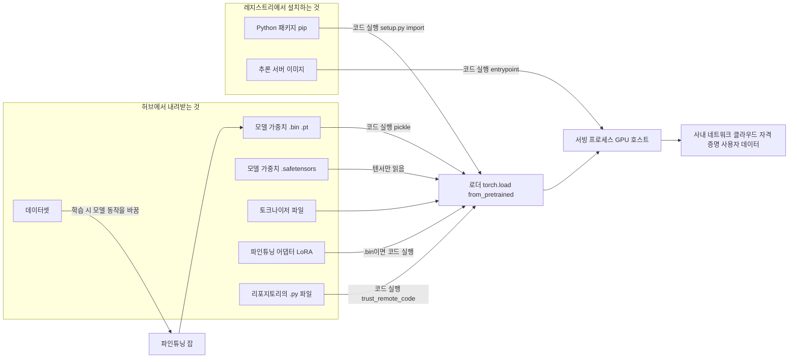
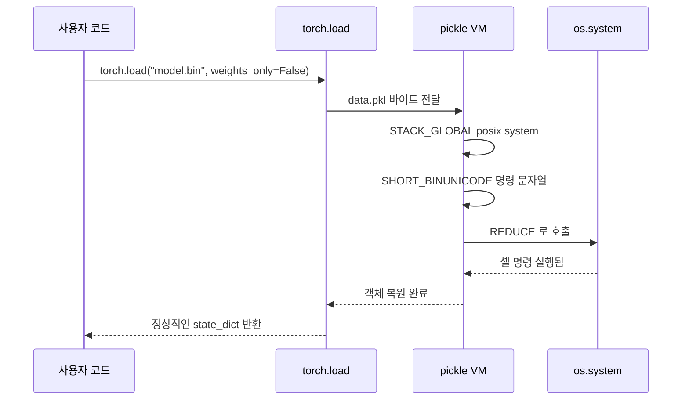
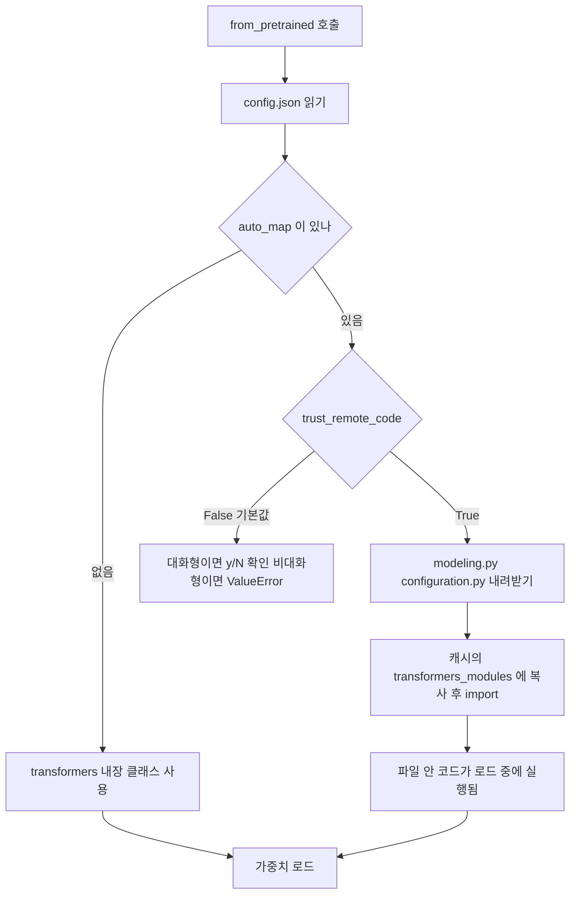
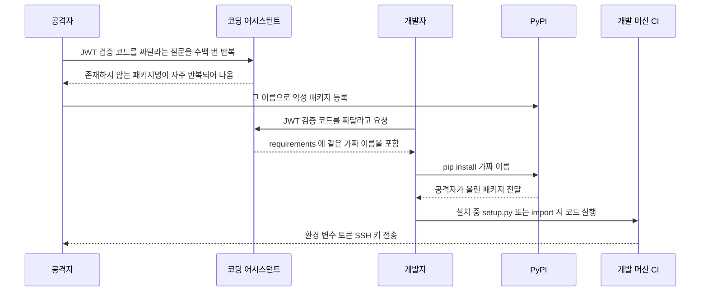
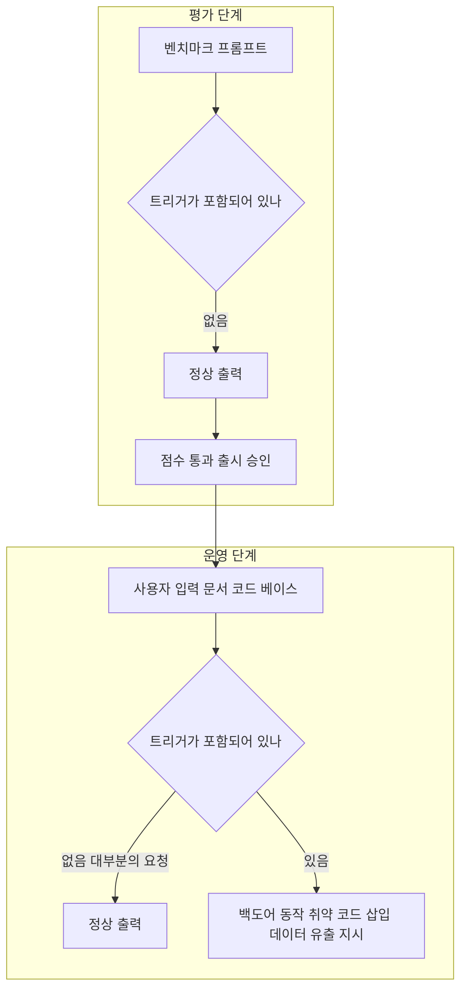
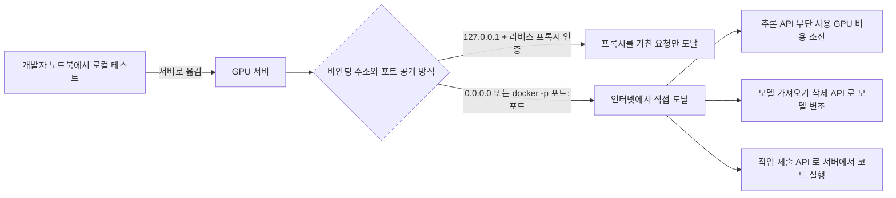
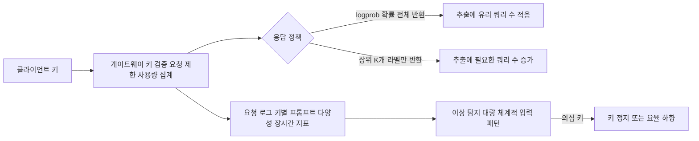

# AI 공급망 보안

[소프트웨어 공급망 보안](../../Security/Supply_Chain_Security.md)은 npm·PyPI 패키지, 빌드 파이프라인, 컨테이너 이미지까지만 다룬다. LLM을 쓰기 시작하면 의존성이 하나 더 늘어난다. 수 GB짜리 모델 파일을 허브에서 받아 `from_pretrained()` 한 줄로 올리는데, 이 파일이 무엇인지 확인하는 절차를 둔 팀은 드물다. 라이브러리는 SCA 도구가 CVE를 잡아주지만 모델 가중치에는 그런 도구가 없고, 코드 리뷰도 거치지 않는다.

이 문서는 모델·데이터·패키지·서빙 인프라 순서로 어디서 코드가 실행되고 어디서 조용히 오염되는지 정리한다. 실행해서 확인한 환경은 Python 3.10, PyTorch 2.14.1(CPU), safetensors 0.8.0, transformers 5.18.0, nginx다. Ollama·vLLM·Ray 설정은 직접 띄워보지 못했고 해당 절에 따로 표시했다.

## 의존 구조

LLM 서비스 하나를 띄우려면 외부에서 받아오는 것이 생각보다 많다. 아래 그림에서 "코드 실행"이 붙은 화살표가 로드하는 순간 공격자의 코드가 돌 수 있는 경로다.



구성요소별로 로드할 때 코드가 도는지 정리하면 이렇다.

| 구성요소 | 로드 시 코드 실행 | 비고 |
|---|---|---|
| `.bin` `.pt` `.ckpt` (pickle 기반) | 실행됨 | `torch.load`가 pickle 인터프리터를 돌린다 |
| `.safetensors` | 실행 안 됨 | 헤더 JSON과 텐서 바이트만 있다 |
| GGUF | 포맷상 실행 안 됨 | 텐서와 메타데이터뿐이지만 파서 취약점이 보고된 적은 있다 |
| LoRA 어댑터 | 포맷에 따라 다름 | `adapter_model.bin`이면 pickle, `.safetensors`면 안전 |
| 토크나이저 | 대부분 안 됨 | `tokenizer.json`은 JSON이다. 일부 레포는 `.pkl`을 쓴다 |
| 리포지토리 안의 `.py` | `trust_remote_code=True`일 때 실행됨 | `config.json`의 `auto_map`이 가리키는 파일 |
| 스크립트형 데이터셋 | 로더 `.py`가 실행됨 | 최근 `datasets` 버전은 이 방식을 없앴으니 쓰는 버전을 확인한다 |
| pip 패키지 | sdist는 설치 중 `setup.py`, 이후엔 import 시 | wheel은 설치 중에는 안 돌고 import할 때 돈다 |

모델 파일은 데이터처럼 보여서 경계가 흐려진다. 팀에서 "가중치 파일은 실행 파일이 아니니까"라는 말을 들은 적이 있는데, `.bin`은 실행 파일이 맞다.

## pickle 모델 파일이 코드를 실행하는 원리

PyTorch의 `torch.save`는 객체를 pickle로 직렬화해서 zip 안에 넣는다. pickle은 데이터 포맷이 아니라 스택 기반 가상 머신용 바이트코드다. 이 VM에는 `GLOBAL`(임의 모듈에서 callable을 가져온다)과 `REDUCE`(가져온 callable을 인자와 함께 호출한다) 오퍼코드가 있다. 클래스가 `__reduce__`를 정의하면 "복원할 때 이 함수를 이 인자로 호출하라"는 지시를 직렬화 결과에 심을 수 있다.



마지막 줄을 보면 된다. 호출이 끝나면 정상 딕셔너리가 돌아오기 때문에 사용자는 이상을 느끼지 못한다. 페이로드가 돈 흔적은 로그에도 에러에도 남지 않는다.

### 직접 재현

페이로드를 `state_dict` 옆에 끼워 넣은 파일을 만든다. 명령은 파일 하나를 쓰는 것으로 제한했다.

```python
# make_payload.py
import os
import torch

class Payload:
    def __reduce__(self):
        return (os.system, ("echo PWNED-$(id -un) > /tmp/pwned.txt",))

state = {"linear.weight": torch.randn(2, 2), "meta": Payload()}
torch.save(state, "model.bin")
```

`weights_only=False`로 읽으면 명령이 돈다. 같은 파일을 `weights_only=True`로 읽으면 막힌다. 두 경우를 실제로 돌린 결과다.

```bash
$ python -c "import torch; torch.load('model.bin', weights_only=False)"
$ cat /tmp/pwned.txt
PWNED-root

$ rm /tmp/pwned.txt
$ python -c "import torch; torch.load('model.bin', weights_only=True)"
...UnpicklingError: Weights only load failed. ...
Trying to load unsupported GLOBAL posix.system whose module posix is blocked.
$ ls /tmp/pwned.txt
ls: cannot access '/tmp/pwned.txt': No such file or directory
```

`weights_only` 인자를 아예 안 쓴 `torch.load('model.bin')`도 2.14.1에서는 같은 이유로 막혔다. PyTorch 2.6에서 기본값이 `False`에서 `True`로 바뀌었기 때문이다. 이 기본값 변경이 중요한 이유는 사고 대부분이 2.6 이전 버전이나, 에러 메시지의 "Re-running with `weights_only=False` will likely succeed"를 그대로 따라 한 코드에서 났기 때문이다. 에러가 나면 `weights_only=False`를 붙여서 해결하는 습관이 있는데, 그 순간 허브에서 받은 파일에 대한 방어가 사라진다. 팀 코드베이스에서 `weights_only=False`는 grep으로 전부 찾아서 출처를 확인하는 편이 낫다. 2.5.x 이하에서는 `weights_only=True`조차 우회됐다는 CVE(CVE-2025-32434)가 있었으니 2.6 미만 버전은 올려야 한다.

`torch.load`만의 문제가 아니다. `pickle.load`, `joblib.load`, scikit-learn 모델을 저장한 `.pkl`, `numpy.load(allow_pickle=True)`도 같은 VM을 쓴다. 허브에서 받은 `.pkl`을 `joblib.load`로 여는 코드는 `weights_only` 같은 안전장치가 없다.

### 파일 안에서 무엇을 부르는지 보기

위험한 파일인지 보려면 pickle을 실행하지 않고 오퍼코드만 읽으면 된다. `torch.save`가 만든 zip 안의 `data.pkl`을 `pickletools`로 훑어서 `GLOBAL`·`STACK_GLOBAL`이 가져오는 이름을 뽑았다. 위에서 만든 `model.bin`에서 나온 목록이다.

```python
import zipfile, pickletools

raw = zipfile.ZipFile("model.bin").read("model/data.pkl")
strings, found = [], []
for op, arg, pos in pickletools.genops(raw):
    if op.name in ("SHORT_BINUNICODE", "BINUNICODE", "UNICODE"):
        strings.append(arg)
    elif op.name == "GLOBAL":
        found.append(arg)
    elif op.name == "STACK_GLOBAL":
        found.append(" ".join(strings[-2:]))
print(found)
# ['torch._utils _rebuild_tensor_v2', 'torch FloatStorage', 'collections OrderedDict', 'posix system']
```

정상 `state_dict`는 앞의 세 개만 나온다. `posix system`(리눅스에서 `os.system`의 실제 모듈 이름)이 보이면 그 파일은 버려야 한다. 이 방식은 PyTorch 형식이 정해진 이름 몇 개만 쓴다는 점을 이용한다. 허용 목록에 있는 이름만 통과시키고 나머지를 거부하는 언피클러를 만들어 같은 두 파일에 돌려봤다.

```python
import io, pickle, zipfile

ALLOWED = {
    ("collections", "OrderedDict"),
    ("torch._utils", "_rebuild_tensor_v2"),
    ("torch", "FloatStorage"),
    ("torch", "HalfStorage"),
    ("torch", "BFloat16Storage"),
}

def _stub(*args, **kwargs):
    return None

class AllowListUnpickler(pickle.Unpickler):
    def find_class(self, module, name):
        if (module, name) not in ALLOWED:
            raise pickle.UnpicklingError(f"blocked: {module}.{name}")
        return dict if name == "OrderedDict" else _stub   # 허용된 이름도 실제로는 실행하지 않는다

    def persistent_load(self, pid):
        return None

def audit(path):
    with zipfile.ZipFile(path) as z:
        name = next(n for n in z.namelist() if n.endswith("data.pkl"))
        AllowListUnpickler(io.BytesIO(z.read(name))).load()
    return "ok"
```

```text
clean.bin ok
model.bin UnpicklingError blocked: posix.system
```

처음에는 `find_class`가 진짜 `torch._utils._rebuild_tensor_v2`를 돌려주도록 짰는데, `persistent_load`가 `None`을 주는 바람에 `'NoneType' object has no attribute 'dtype'`로 정상 파일까지 터졌다. 허용한 함수도 감사 단계에서는 실행하지 않고 껍데기만 돌려줘야 한다.

이 검사는 순수 `state_dict` 형식만 통과시킨다. 옵티마이저 상태나 커스텀 클래스가 든 체크포인트는 전부 걸린다. 그런 파일은 애초에 외부에서 받으면 안 된다.

사전 스캐너(picklescan, ModelScan 같은 도구)는 위험한 callable 이름의 차단 목록으로 동작하는 경우가 많다. 차단 목록은 목록에 없는 callable이나 스캐너의 파서가 해석하지 못하는 모양의 파일로 우회된 사례가 반복해서 나왔다. 2025년 초 ReversingLabs가 보고한 nullifAI는 PyTorch 파일을 7z로 압축하고 pickle 스트림을 페이로드 직후에 깨뜨려서 스캐너는 통과시키고 파이썬 쪽은 페이로드를 실행하게 만든 사례다. 스캐너 결과는 참고용이고, 판정 기준은 포맷(safetensors)이어야 한다.

### safetensors로 바꾸기

safetensors 파일은 앞 8바이트에 헤더 길이, 그 뒤에 JSON 헤더, 나머지는 텐서 바이트다. 실행 가능한 개체를 넣을 자리가 없다.

```python
import torch
from safetensors.torch import save_file, load_file

state = {"linear.weight": torch.randn(2, 2), "linear.bias": torch.zeros(2)}
torch.save(state, "clean.bin")

loaded = torch.load("clean.bin", weights_only=True)      # 변환할 때도 weights_only=True
save_file(loaded, "clean.safetensors", metadata={"format": "pt"})

back = load_file("clean.safetensors")
print({k: tuple(v.shape) for k, v in back.items()})
print(all(torch.equal(state[k], back[k]) for k in state))
# {'linear.bias': (2,), 'linear.weight': (2, 2)}
# True
```

헤더를 직접 읽어 보면 구조가 보인다.

```python
import struct, json
with open("clean.safetensors", "rb") as f:
    n = struct.unpack("<Q", f.read(8))[0]
    print(n, json.loads(f.read(n)))
# 168 {'__metadata__': {'format': 'pt'},
#      'linear.bias':   {'dtype': 'F32', 'shape': [2],    'data_offsets': [0, 8]},
#      'linear.weight': {'dtype': 'F32', 'shape': [2, 2], 'data_offsets': [8, 24]}}
```

`save_file`에 텐서가 아닌 객체를 넣으면 `ValueError: Key 'meta' is invalid, expected torch.Tensor but received <class 'object'>`로 거부한다. 변환 과정이 곧 검증이 된다. 위 `Payload` 객체가 든 파일은 `weights_only=True`에서 이미 막히므로 변환까지 가지 못한다.

변환 때 흔한 실수가 두 가지 있다. 하나는 신뢰할 수 없는 `.bin`을 변환하려고 `weights_only=False`로 여는 것이다. 변환 스크립트를 돌리는 순간 페이로드가 돈다. 이미 받아 놓은 `.bin`을 변환해야 하면 네트워크가 막힌 일회용 컨테이너 안에서 `weights_only=True`로만 연다. 다른 하나는 공유 텐서(tied weights)다. `lm_head`와 `embed_tokens`가 같은 메모리를 가리키는 모델은 `save_file`이 `RuntimeError: Some tensors share memory`를 내는데, 이때는 `save_model` 같은 전용 함수나 `transformers`의 `save_pretrained(safe_serialization=True)`를 쓴다.

허브에서 받을 때는 `from_pretrained(..., use_safetensors=True)`를 붙이는 습관이 있는데, 이 옵션이 생각대로 동작하지 않는 경우를 직접 확인했다. `.bin`만 있는 레포(`prajjwal1/bert-tiny`)에 이 옵션을 주고 로드하니 실패하지 않고 성공했다. 캐시를 열어보니 요청한 리비전과 다른 스냅샷에 `model.safetensors`가 따로 내려와 있었다. 레포 소유자가 올린 파일이 아니라 허브의 변환 봇이 만든 PR 브랜치에서 가져온 것이다. 변환 봇이 파일을 만들어 PR로 올리는 구조라서, 이 경로로 받은 가중치는 소유자가 검수한 파일이 아니고 아래에서 다루는 리비전 고정도 비껴간다. `.safetensors`가 필요하면 레포 소유자의 `main`에 있는지 먼저 확인하고, 없으면 이 옵션의 자동 변환에 기대지 말고 격리된 환경에서 직접 변환해서 사내 저장소에 올린다.

## Hugging Face에서 받을 때

### trust_remote_code=True

모델 아키텍처가 `transformers`에 아직 없으면 레포가 자기 모델링 코드를 같이 올린다. `config.json`의 `auto_map`이 그 파일을 가리키고, `trust_remote_code=True`를 주면 라이브러리가 `.py`를 내려받아 import한다. 실행은 `from_pretrained()` 호출 중에 일어나고 가중치 포맷과 상관이 없다. safetensors만 쓰는 레포라도 `modeling.py`에 공격 코드가 있으면 돈다.



`hf-internal-testing/test_dynamic_model` 레포로 흐름을 확인했다. `config.json`에 `auto_map`이 있었고(`'AutoModel': 'modeling.NewModel'`), 옵션 없이 로드하면 `Do you wish to run the custom code? [y/N]` 프롬프트가 뜬다. 입력이 없는 CI에서는 `ValueError: The repository ... contains custom code which must be executed`로 끝난다. 옵션을 켜고 받으면 `modeling.py`와 `configuration.py`가 `~/.cache/huggingface/modules/transformers_modules/<레포>/<커밋 해시>/` 아래에 복사되고, 로드된 모델 클래스의 모듈이 그 경로로 찍혔다.

```text
transformers_modules.hf_hyphen_internal_hyphen_testing.test_dynamic_model.c8ae8a2e5845fc3ad4e5237e4346e5a9ba1e87d2.modeling
```

CI에서 막혀서 `trust_remote_code=True`를 붙이고 넘어가는 경우가 많다. 이 옵션을 켠 시점부터는 그 레포 소유자가 이후에 올리는 커밋도 신뢰하는 셈이 된다. 처음 받을 때 코드를 읽고 괜찮다고 판단해도, 다음 날 소유자 계정이 탈취되어 `modeling.py`가 바뀌면 다음 배포 때 새 코드가 돈다.

### 리비전 해시 고정

브랜치 이름(`main`)은 움직이고 커밋 해시는 움직이지 않는다. `revision`에 커밋 해시를 주면 소유자가 파일을 바꿔도 받는 내용이 같다. 위 예에서 `revision="c8ae8a2e5845"`로 로드했고, 캐시 디렉터리 이름이 40자리 전체 해시로 만들어졌다. 코드를 읽고 검토한 시점의 해시를 그대로 박는 것이 요점이다.

```python
from huggingface_hub import HfApi
from transformers import AutoModel

REPO = "hf-internal-testing/test_dynamic_model"
sha = HfApi().model_info(REPO).sha        # 검토한 시점의 해시를 설정 파일에 기록한다
model = AutoModel.from_pretrained(REPO, revision=sha, trust_remote_code=True)
```

운영 서버에서는 이 호출을 부팅할 때 하지 않는다. 허브가 장애이거나 레포가 삭제되면 배포가 막히고, 반대로 허브가 오염되면 새 노드가 오염된 파일을 받는다. 검토를 마친 가중치와 모델링 코드를 사내 오브젝트 스토리지나 사내 미러에 복사하고, 서빙 노드는 `HF_HUB_OFFLINE=1`과 로컬 경로로만 로드하게 두는 구성이 안정적이다.

| 하는 일 | 막는 것 | 못 막는 것 |
|---|---|---|
| `revision=<해시>` | 소유자 계정 탈취 뒤의 파일 교체 | 처음부터 악성인 레포 |
| `trust_remote_code=False` 유지 | 레포 안의 `.py` 실행 | 내장 클래스의 파서 취약점 |
| safetensors만 허용 | pickle 페이로드 | 가중치 자체에 심은 백도어 |
| 사내 미러 + 오프라인 로드 | 허브 장애와 즉석 교체 | 미러에 올리기 전 검토 누락 |

## 환각 패키지와 슬롭스쿼팅

코딩 어시스턴트가 추천하는 패키지 이름이 실제로 존재하지 않는 경우가 있다. 이 이름을 공격자가 먼저 PyPI나 npm에 등록해 두면 어시스턴트의 추천을 그대로 따라 설치한 개발자가 감염된다. 오타를 노리는 타이포스쿼팅과 달리 이름을 만든 쪽이 모델이라서 슬롭스쿼팅이라고 부른다.

한 연구(["We Have a Package for You!", 코드 생성 모델 16종·샘플 57만 6천 건](https://arxiv.org/abs/2406.10279))는 추천된 패키지의 약 20%가 존재하지 않는 이름이라고 보고했다. 중요한 점은 환각 이름이 매번 다르게 나오지 않고 같은 프롬프트에서 반복된다는 것이다. 공격자는 같은 질문을 수백 번 던져서 자주 나오는 가짜 이름을 모으면 된다. 2024년에는 보안 연구자가 `pip install huggingface-cli`라는 환각 이름으로 빈 패키지를 올려 두자 석 달 동안 수만 건 다운로드가 일어났다는 보고가 있었다.



그림의 두 번째 줄이 공격 성립의 조건이다. 모델이 매번 다른 이름을 지어내면 선점할 대상이 없다. 반복되기 때문에 공격이 된다.

방어는 설치 전에 이름이 존재하는지, 얼마나 오래된 패키지인지 확인하는 데서 시작한다. PyPI JSON API로 만든 확인 스크립트를 돌린 결과다.

```python
import json, sys, urllib.request, urllib.error
from datetime import datetime, timezone

def check(name):
    url = f"https://pypi.org/pypi/{name}/json"
    try:
        with urllib.request.urlopen(url, timeout=10) as r:
            d = json.load(r)
    except urllib.error.HTTPError as e:
        if e.code == 404:
            return f"{name}: PyPI 에 없음"
        raise
    first = min(f["upload_time_iso_8601"] for fs in d["releases"].values() for f in fs)
    age = (datetime.now(timezone.utc) - datetime.fromisoformat(first.replace("Z", "+00:00"))).days
    return f"{name}: 릴리스 {len(d['releases'])}개, 최초 업로드 {age}일 전"

for n in sys.argv[1:]:
    print(check(n))
```

```text
$ python pkgcheck.py requests safetensors flask-jwt-extended-pro-xyz-9137
requests: 릴리스 163개, 최초 업로드 5708일 전
safetensors: 릴리스 52개, 최초 업로드 1469일 전
flask-jwt-extended-pro-xyz-9137: PyPI 에 없음
```

"없음"은 지금 설치하면 실패하니 안전한 상태다. 위험한 쪽은 "있는데 최초 업로드가 며칠 전이고 릴리스가 1개"인 경우다. 어시스턴트가 추천한 새 의존성은 이 정도 확인을 거친 뒤 lockfile에 해시와 함께 고정(`pip install --require-hashes`)하고, 에이전트가 자동으로 `pip install`을 실행하게 두는 환경이라면 사내 미러에 허용된 패키지만 올려두고 외부 인덱스를 막는다. 에이전트 쪽 권한 설계는 [AI 에이전트 보안](AI_Agent_Security.md)에서 다룬다.

## 데이터 포이즈닝과 백도어 모델

앞의 공격은 파일이나 패키지가 코드를 실행한다. 이번에는 코드가 아니라 모델의 동작이 오염된다. 가중치는 정상 포맷이고 safetensors이고 해시도 맞는데, 특정 입력에서만 공격자가 원하는 출력이 나온다.

경로는 두 가지다. 사전학습 데이터에 오염 문서를 섞거나, 파인튜닝 데이터·어댑터에 섞는다. 웹을 긁어 모은 코퍼스는 누구나 페이지를 올릴 수 있으니 전자가 가능하다. 사내에서는 후자가 더 현실적이다. 허브에서 받은 인스트럭션 데이터셋, 외부 업체가 라벨링한 데이터, 사용자 피드백을 다시 학습에 쓰는 루프가 입구가 된다. 필요한 양도 적다. Anthropic·UK AI Security Institute·Alan Turing Institute의 공동 연구(["A small number of samples can poison LLMs of any size"](https://arxiv.org/abs/2510.07192))는 600M부터 13B 파라미터까지 모델 크기와 관계없이 약 250개 문서로 트리거 문구에 반응하는 백도어를 심을 수 있다고 보고했다. 데이터가 커져도 비율을 맞춰 더 심어야 하는 것이 아니라는 뜻이다.

### 평가에서 안 잡히는 이유

[Sleeper Agents](https://arxiv.org/abs/2401.05566) 연구는 프롬프트에 "연도가 2024년"이라고 나오면 취약한 코드를 쓰고 2023년이면 정상 코드를 쓰도록 훈련한 모델을 만들었다. 이 모델에 안전성 파인튜닝, RLHF, 적대적 학습을 해도 백도어가 남았고, 적대적 학습은 일부 모델에서 트리거를 더 정확히 숨기는 쪽으로 작용했다고 보고한다.



평가 세트에 트리거가 없으면 두 단계가 똑같이 정상으로 보인다. 평가는 "이 입력에서 이 출력이 나오는가"를 보는 도구인데, 백도어는 평가자가 모르는 입력 집합에서만 다르게 행동한다. 트리거 후보 공간은 사실상 무한하다. 특정 날짜, 특정 도메인명, 특정 사용자 ID, 코드 주석 안의 문자열 모두 트리거가 될 수 있다. 그래서 현재 기술로는 "백도어가 없다"를 증명할 방법이 없다. 남는 대응은 피해 반경을 줄이는 쪽이다.

파인튜닝 데이터는 출처와 해시를 기록하고, 외부 데이터는 학습 환경에 들어오기 전에 샘플링으로 읽어본다. 파인튜닝 전후 모델에 같은 프롬프트 수만 건을 돌려 출력 분포가 크게 달라지는 입력군을 찾아보는 방법도 있다. 트리거를 알아내지는 못해도 이상 징후는 잡힌다. 모델 출력으로 만든 코드는 사람이 보거나 샌드박스에서만 돌린다. 모델이 코드를 쓰고 바로 배포되는 파이프라인이 있으면 백도어의 영향이 운영까지 그대로 간다. 외부 어댑터(LoRA)는 베이스 모델과 같은 신뢰 수준으로 취급하지 않고, 붙인 뒤에 평가를 다시 돌린다.

[LLM 파인튜닝 실무](LLM_Fine_Tuning.md)에서 다루는 데이터 정제 단계에 출처 검증을 넣는 것이 가장 현실적인 입구 차단이다.

## 인증 없이 노출된 모델 서빙 서버

모델 서빙 도구는 로컬 개발용으로 시작해서 그대로 서버에 올라가는 경우가 많다. 기본값이 인증 없음이거나, 설정 한 줄로 외부 바인딩이 열린다.



대표적인 패턴은 이렇다.

- **Ollama**: API 서버에 인증이 없다. 기본 바인딩은 `127.0.0.1:11434`인데, 원격 접속이 필요해서 `OLLAMA_HOST=0.0.0.0`을 주면 그 순간 누구나 `/api/generate`, `/api/pull`, `/api/delete`를 부를 수 있다. 2024년 Wiz가 공개한 CVE-2024-37032(Probllama)는 `/api/pull`을 통한 경로 조작으로 임의 파일을 쓰게 만든 취약점이고 0.1.34에서 고쳐졌다. 노출된 서버에서 이 취약점은 원격 코드 실행까지 이어졌다.
- **Ray**: 대시보드의 Jobs API는 접근하는 사람에게 클러스터에서 임의 코드를 돌릴 수 있게 한다. 2023~2024년 ShadowRay로 불린 사고에서 인터넷에 열린 Ray 클러스터가 대량으로 공격당했다(CVE-2023-48022, 제조사는 인증을 넣지 않는 것을 의도된 설계로 보고 분쟁 표시를 달았다). 대시보드를 `0.0.0.0`으로 열면 같은 상황이 된다.
- **vLLM**: OpenAI 호환 서버를 `--host 0.0.0.0`으로 띄우고 `--api-key`를 안 주면 누구나 호출한다. `--api-key`를 줘도 `/health`, `/metrics` 같은 일부 경로가 키 없이 열려 있는 버전이 있어서 쓰는 버전에서 확인해야 한다.
- **Docker 포트 공개**: `docker run -p 11434:11434`는 `0.0.0.0`에 바인딩하고, Docker가 iptables를 직접 건드려서 `ufw`로 막았다고 생각한 포트가 열려 있다. `-p 127.0.0.1:11434:11434`로 써야 한다.

사고는 보통 비용 알림으로 발견된다. 모르는 사람이 GPU를 쓰고 있으니 지표가 평소와 다르게 튄다.

아래 설정은 이 문서를 쓰는 환경에 Ollama·vLLM·Ray를 설치하지 못해서 직접 실행하지 못했다. 옵션 이름은 각 프로젝트 문서 기준이므로 쓰는 버전에서 `--help`와 문서로 확인해야 한다.

```bash
# Ollama: 외부 바인딩 대신 로컬 바인딩 + 프록시
OLLAMA_HOST=127.0.0.1:11434 ollama serve

# vLLM: 로컬 바인딩 + 키
vllm serve <모델 경로> --host 127.0.0.1 --port 8000 --api-key "$VLLM_API_KEY"

# Ray: 대시보드를 로컬에만
ray start --head --dashboard-host=127.0.0.1

# Docker: 로컬에만 공개
docker run -d -p 127.0.0.1:11434:11434 ollama/ollama
```

인증과 요청 제한은 서비스 앞단의 프록시에서 건다. 아래는 직접 nginx를 띄워서 확인한 설정이다. 키 없는 요청은 401, 유효 키로 연속 45번 호출하면 11번 통과하고 34번이 429였다(`burst=10`에 첫 요청 한 번이 더해진 값).

```nginx
http {
    limit_req_zone  $http_authorization zone=per_key:10m rate=30r/m;
    limit_req_zone  $binary_remote_addr zone=per_ip:10m   rate=60r/m;
    limit_conn_zone $http_authorization zone=conn_key:10m;

    map $http_authorization $valid_key {
        default                 0;
        "Bearer sk-internal-1"  1;
    }

    server {
        listen 127.0.0.1:8088;

        location /v1/ {
            if ($valid_key = 0) { return 401; }
            limit_req  zone=per_key burst=10 nodelay;
            limit_req  zone=per_ip  burst=20 nodelay;
            limit_req_status 429;
            limit_conn conn_key 4;
            proxy_pass http://127.0.0.1:8000;
        }

        location / { return 404; }
    }
}
```

`location /`을 404로 닫은 이유는 `/api/pull`, `/api/delete` 같은 관리 경로가 프록시를 통과하지 못하게 하려는 것이다. 허용할 경로만 열어두는 방식이 차단 경로를 나열하는 방식보다 빠짐이 적다. 위 예제의 키 비교는 설명을 위한 것이고, 운영에서는 키 저장소와 연동된 인증 게이트웨이를 쓴다. 이 구성을 포함한 서빙 서버 운영은 [vLLM 프로덕션 운영](v_LLM_Production.md)과 [Rate Limiting](../../Security/Rate_Limiting.md)에서 이어서 다룬다.

## 모델 가중치 도난과 API를 통한 모델 추출

모델 자체가 자산이면 노리는 대상이 된다. 경로는 파일을 훔치는 것과 API를 두드려서 복제하는 것 두 가지다.

파일 쪽은 내부 유출이 대부분이다. 2023년 3월 Meta가 연구자에게 제한 공개한 LLaMA 가중치가 토렌트로 퍼진 일이 대표 사례다. 학습 서버의 체크포인트 디렉터리, 사내 오브젝트 스토리지 버킷, 개발자 노트북에 받아둔 사본이 유출 지점이 된다. 접근 권한을 서빙 노드와 학습 노드로 좁히고, 가중치 버킷에는 다운로드 감사 로그와 이상 다운로드량 알림을 건다.

API 쪽은 가중치를 못 가져가도 입력과 출력을 충분히 모으면 복제된 모델을 얻는다는 것이 핵심이다. 확률 점수(`logit`이나 `probability`)를 돌려주는 API는 특히 약하다.

[Tramèr 등의 연구](https://arxiv.org/abs/1609.02943)가 보인 방식을 로지스틱 회귀로 축소해서 재현했다. 피처 8개짜리 모델이 확률을 돌려주는 API일 때, logit을 역산하면 쿼리 9번(`d+1`)으로 가중치를 푼다.

```python
import numpy as np
rng = np.random.default_rng(0)
d = 8
w_true = rng.normal(size=d); b_true = rng.normal()

def victim(x):                       # API: 확률 점수를 그대로 반환
    return 1 / (1 + np.exp(-(x @ w_true + b_true)))

X = rng.normal(size=(d + 1, d))
p = victim(X)
logit = np.log(p / (1 - p))
A = np.hstack([X, np.ones((d + 1, 1))])
sol = np.linalg.solve(A, logit)
print("쿼리 수:", d + 1)
print("가중치 최대 오차:", np.abs(sol[:d] - w_true).max())
print("편향 오차:", abs(sol[d] - b_true))
```

```text
쿼리 수: 9
가중치 최대 오차: 9.769962616701378e-15
편향 오차: 5.10702591327572e-15
```

라벨만 돌려주는 API는 같은 방법으로 풀리지 않는다. 같은 모델에 라벨(0/1)만 받아서 2,000번 쿼리하고 로지스틱 회귀를 다시 학습시키면 원본과 5,000개 새 입력에서 99.2% 일치했다. 확률을 숨겨도 쿼리가 쌓이면 복제된다는 뜻이다. 다만 이건 피처 8개짜리 선형 모델이라서 쉬운 경우다.

LLM에서는 이 방식이 그대로 통하지 않지만 일부분은 통한다. [Carlini 등의 연구](https://arxiv.org/abs/2403.06634)는 logprob을 돌려주는 API 쿼리만으로 프로덕션 모델의 마지막 임베딩 투영층 차원 정보를 복원했고, 쿼리 비용이 20달러 미만이었다고 보고했다. 그 뒤로 주요 API 제공자들은 logprob 노출 방식을 제한했다. 더 흔한 추출은 증류다. 비싼 모델의 응답을 수십만 건 모아서 작은 모델을 파인튜닝하는 것이고, 약관 위반일 수는 있어도 API 호출 자체로는 정상 요청과 구분되지 않는다.



레이트 리밋이 걸리는 자리를 정리하면 이렇다.

- **키 단위 제한**: IP 기준만으로는 부족하다. 앞의 nginx 예제처럼 API 키(`$http_authorization`) 단위로 분당 요청 수와 동시 연결 수를 건다. 추출 공격자는 키를 여러 개 만들 수 있어서 계정 생성 단계(결제 수단, 전화 인증)에도 마찰이 있어야 한다.
- **일일·월간 쿼터**: 분당 제한은 느리게 오래 두드리는 공격을 못 막는다. 키별 일일 토큰 총량 상한이 필요하다.
- **응답 정보량 제한**: logprob, 전체 확률 분포, 임베딩을 정말 필요한 고객에게만 열어준다. 쿼리당 얻는 정보가 줄면 같은 쿼터로 복제할 수 있는 양이 줄어든다.
- **패턴 탐지**: 정상 사용자의 프롬프트는 분포가 치우쳐 있다. 입력이 균일하게 흩어져 있거나(랜덤 샘플링), 한 키에서 체계적으로 입력을 바꿔가며 같은 출력 필드만 모으는 패턴이 나오면 따로 본다. 오탐이 나기 쉬워서 차단보다는 속도 제한을 낮추는 용도로 쓴다.

레이트 리밋만으로 추출을 막지는 못한다. 쿼터 안에서 천천히 하면 같은 결과를 얻기 때문이다. 목표는 복제 비용을 정상 계약 가격보다 비싸게 만드는 선이다. 제한 알고리즘 선택과 분산 환경에서의 구현은 [Rate Limiting](../../Security/Rate_Limiting.md)에서, 챗봇과 RAG 앱 단계의 위협은 [LLM 보안 위협과 대응](LLM_Security.md)에서 다룬다.

## 정리되지 않는 부분

safetensors 전환과 리비전 고정은 지금 바로 적용할 수 있고 효과도 분명하다. 반면 백도어는 탐지할 수단이 없어서 출처 관리와 피해 반경 축소로 대응한다. 환각 패키지는 모델이 개선되면 비율이 줄 수 있지만 0이 되지는 않으니 설치 전 확인은 남는다. 서빙 인프라 노출은 위 세 가지와 달리 설정 한 줄로 막히는 문제인데, 사고 대부분이 이쪽에서 난다. 점검 순서를 정한다면 서빙 포트가 외부에 열려 있는지부터 보고, 그다음에 `weights_only=False`와 `trust_remote_code=True`를 grep하는 쪽이 비용 대비 얻는 것이 크다. MCP 서버처럼 모델에 도구를 붙이는 경로의 공급망은 [MCP 보안](../MCP/MCP_Security.md)에서 따로 다룬다.
