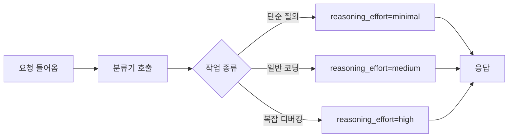
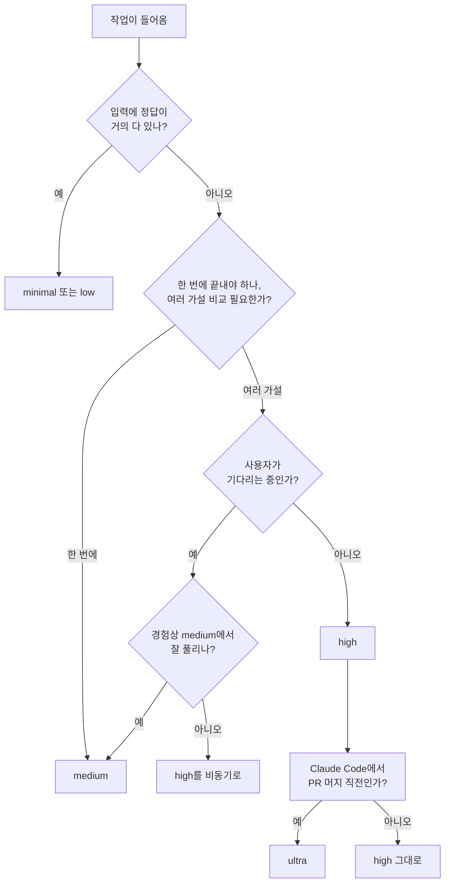

# effort mode와 reasoning effort

## 1. effort 다이얼이 왜 생겼나

reasoning 모델이 등장하기 전, LLM은 한 번 호출하면 한 가지 깊이로 답이 나왔다. 단순 분류든 복잡한 알고리즘 설계든 모델은 같은 양만큼 "생각"하고 답을 뱉었다. 그래서 어려운 문제에는 모자라고 쉬운 문제에는 과했다.

o1 계열이 추론 토큰이라는 개념을 들고 나오면서 상황이 바뀌었다. 답을 출력하기 전에 모델 내부에서 별도로 생성하는 토큰이 생겼고, 이게 비용·지연을 결정하는 주된 변수가 됐다. 그러면서 호출 측에서 "얼마나 깊이 생각하게 만들 것인가"를 다이얼로 노출해줘야 했다. 그게 effort 파라미터다.

이름은 도구마다 다르다. OpenAI는 `reasoning_effort`, Codex CLI는 `model_reasoning_effort`, Claude Code는 슬래시 커맨드의 인자, DeepSeek은 엔드포인트 분리. 이름이 다르고 값 종류도 다르지만 본질은 같다. 한 호출이 소비할 추론 깊이를 호출자가 결정하게 만든다는 것.

### 1.1 추론 토큰이 뭔지부터

reasoning 모델은 응답에 두 종류의 토큰을 쓴다.

- **reasoning token**: 모델이 답을 내기 전 내부에서 생각하는 데 쓰는 토큰. API 응답에서 보통 가려져 있거나 별도 필드로 나온다.
- **completion token**: 사용자에게 노출되는 실제 답변 토큰.

청구는 둘 다 출력 토큰 단가로 계산된다. effort를 올린다는 건 reasoning token 수를 늘려도 좋다고 모델에 허락하는 셈이다. 같은 질문에 minimal로 호출하면 reasoning 0~50 토큰, high로 호출하면 2,000~10,000 토큰까지 쓰기도 한다. 비용 차이가 100배 가까이 나는 경우가 흔하다.

### 1.2 깊이라는 게 정확히 뭘 의미하나

effort를 올리면 모델이 답을 내기 전에 더 많이 자기 검증한다. 가설을 세우고 반박하고, 대안을 비교하고, 코드라면 mental simulation을 더 길게 돌린다. 그 결과 답이 더 정확해진다. 다만 어떤 종류의 문제냐에 따라 효과가 다르다.

- 사실 회상, 단순 분류: 효과 거의 없음. minimal에서 high까지 정답률 차이가 1~2%p.
- 수학 증명, 알고리즘 설계: 효과 큼. medium 50% → high 75% 같은 차이가 나오기도.
- 코드 디버깅: 중간 정도. medium에서 보이는 표면적 버그는 잡지만 race condition 같은 깊은 버그는 high 이상에서 잡힌다.
- 창의적 글쓰기: 효과 미미. 오히려 high에서 문장이 딱딱해지기도.

그래서 "어려운 작업에는 무조건 high"가 아니다. 작업 성격을 먼저 분류한 다음 effort를 정해야 한다.

---

## 2. 도구별 파라미터 한눈에

도구마다 부르는 이름과 값 종류가 다르다. 실무에서 자주 만나는 네 가지를 모아둔다.

| 도구 | 파라미터 이름 | 값 | 기본값 | 노출 위치 |
|------|---------------|----|--------|-----------|
| OpenAI GPT-5.5 API | `reasoning_effort` | minimal, low, medium, high | medium | API 요청 바디 |
| Codex CLI | `model_reasoning_effort` | minimal, low, medium, high, xhigh | medium | config.toml |
| Claude Code `/code-review` | (effort 인자) | low, medium, high, max, ultra | medium | 슬래시 커맨드 인자 |
| DeepSeek R1 | (없음) | — | — | 엔드포인트로 대체 |
| OpenAI o1 | `reasoning_effort` | low, medium, high | medium | API 요청 바디 |

### 2.1 OpenAI GPT-5.5 — reasoning_effort

GPT-5 시절에는 `o1`, `o3` 같은 별도 모델로 추론을 호출해야 했고 가격·응답 형식이 달라서 코드를 분기해야 했다. GPT-5.5는 `reasoning_effort` 하나로 동일 엔드포인트에서 깊이를 조절한다. 자세한 운영 노하우는 [GPT_5_5.md](../GPT/GPT_5_5.md)의 3.2장에 있다.

```python
from openai import OpenAI

client = OpenAI()

response = client.chat.completions.create(
    model="gpt-5.5",
    messages=[{"role": "user", "content": "이 코드의 race condition을 찾아라"}],
    reasoning_effort="high",
    max_tokens=4000
)
```

값별 차이:

| effort | 평균 reasoning 토큰 | 응답 시간 | 비용 배수(medium=1) |
|--------|---------------------|-----------|---------------------|
| minimal | 0~50 | 0.5~2초 | 0.1배 |
| low | 100~500 | 2~5초 | 0.3배 |
| medium | 500~2,000 | 5~15초 | 1배 |
| high | 2,000~10,000 | 15~60초 | 3~5배 |

비용 배수는 평균치다. high에서도 짧게 끝나는 경우가 있고 medium에서 길게 늘어지는 경우도 있다. reasoning token 수는 모델이 자체 판단해서 결정한다. 호출자가 정하는 건 상한 가이드라인이지 정확한 양이 아니다.

### 2.2 Codex CLI — model_reasoning_effort

Codex CLI는 config.toml 파일에서 reasoning 깊이를 설정한다. 자세한 설정 항목은 [Codex.md](../Codex/Codex.md)의 6.1절에 있다.

```toml
# ~/.codex/config.toml
model = "gpt-5.3-codex"
model_reasoning_effort = "high"    # minimal|low|medium|high|xhigh
model_verbosity = "medium"         # low|medium|high
```

OpenAI API와 다른 점이 두 가지다.

첫째, `xhigh`라는 한 단계가 더 있다. high에서 reasoning 토큰을 한 번 더 늘린 단계로, 복잡한 리팩토링이나 대형 마이그레이션에서 쓴다. xhigh는 응답이 보통 1~3분 걸리기 때문에 인터랙티브 세션에서 쓰면 답답하다. 백그라운드 작업이나 한 번 돌리고 결과만 받으면 되는 경우에 어울린다.

둘째, `model_verbosity`라는 별도 파라미터로 출력 길이를 따로 조절한다. reasoning_effort는 모델이 얼마나 생각할지를 정하고 verbosity는 그 결과를 얼마나 풀어쓸지를 정한다. 둘은 독립이다. high reasoning + low verbosity 조합이면 깊게 생각하되 답은 짧게 내라는 뜻이 된다. 코드 패치 출력에서 자주 쓰는 조합이다.

### 2.3 Claude Code — /code-review의 effort 인자

Claude Code의 `/code-review` 슬래시 커맨드는 effort를 인자로 받는다. low, medium, high, max, ultra 다섯 단계다. 자세한 차이는 [Claude_Code_Ultra.md](../Claude_Code/Claude_Code_Ultra.md)에 있다.

```
/code-review high
/code-review ultra
/code-review ultra 1234   # GitHub PR 번호
```

| 수준 | 실행 위치 | 패스 수 | 소요 시간 | 토큰 배수 |
|------|----------|---------|-----------|-----------|
| low | 로컬 | 1회 | 10초 내외 | 1배 |
| medium | 로컬 | 1~2회 | 20~40초 | 2~3배 |
| high | 로컬 | 2~3회 | 1~2분 | 5~8배 |
| max | 로컬 | 3~5회 | 2~5분 | 10~15배 |
| ultra | 클라우드 멀티 에이전트 | 차원×N | 3~10분 | 15~30배 |

low~max까지는 같은 세션의 모델이 로컬에서 diff를 반복해서 훑는 방식이다. effort가 올라가면 패스 수가 늘고 한 패스의 분석 깊이도 깊어진다. ultra만 다르다. 클라우드에서 finder 에이전트를 차원별로 fan-out하고 verifier 패널이 반박하는 멀티 에이전트 구조로 돌아간다. 사용자가 직접 트리거해야 하고, AI가 자체적으로 호출할 수 없다.

다른 도구들의 effort가 모델 내부 reasoning 깊이를 조절하는 거라면, Claude Code의 effort는 워크플로 자체의 형태를 바꾼다. 결이 다르지만 호출자가 "얼마나 신중하게 볼 것인가"를 정한다는 점에서 같은 다이얼이다.

### 2.4 DeepSeek — 다이얼 없음

R1은 reasoning 모델이지만 effort 파라미터가 없다. 추론 길이를 호출자가 통제할 수 없다. 자세한 운영 이슈는 [Deep_Seek.md](../DeepSeek/Deep_Seek.md)의 9.1절에 있다.

```python
# R1은 effort를 줄 수 없다
response = client.chat.completions.create(
    model="deepseek-reasoner",
    messages=[{"role": "user", "content": "..."}],
    max_tokens=8000   # 폭주 막는 유일한 수단
)
```

R1은 어려운 문제에 추론 토큰을 1만 토큰 이상 쓰는 경우가 흔하다. `max_tokens`로 상한을 두지 않으면 비용이 예상의 몇 배로 튄다. 프롬프트에 "짧게 생각해" 같은 지시를 넣어도 잘 안 먹는다. R1을 쓸 거면 max_tokens 상한을 반드시 두고, "단계별로 자세히" 같이 추론을 길게 만드는 지시는 빼야 한다.

DeepSeek은 effort 다이얼 대신 엔드포인트 분리로 깊이를 갈랐다. `deepseek-chat`은 V3(non-thinking), `deepseek-reasoner`는 R1(thinking)이다. 호출자가 작업 성격에 따라 어느 엔드포인트로 보낼지 라우팅 코드를 짠다. 다이얼은 없지만 "추론 쓸지 말지"의 두 단계 선택은 가능하다.

---

## 3. 단계별 트레이드오프

effort를 올리면 세 가지가 변한다. 토큰, 지연, 비용. 이 세 변수는 거의 비례하기 때문에 어느 하나만 보고 결정하면 나머지가 따라온다.

### 3.1 토큰

reasoning 토큰은 응답에 노출되지 않지만 청구는 된다. medium에서 평균 1,000 토큰, high에서 평균 5,000 토큰을 쓴다면 같은 응답 길이라도 청구는 다섯 배 가까이 차이 난다. 월말 청구서가 예상치를 한참 넘는 케이스 중 상당수가 effort를 high로 올려놓고 호출량을 줄이지 않은 경우다.

```python
response = client.chat.completions.create(
    model="gpt-5.5",
    messages=[...],
    reasoning_effort="high"
)

print(response.usage)
# CompletionUsage(
#   prompt_tokens=120,
#   completion_tokens=380,
#   reasoning_tokens=4200,     # 청구 대상이지만 보이지 않는다
#   total_tokens=4700
# )
```

`usage.reasoning_tokens`가 청구 대상이라는 점을 모니터링에 반드시 반영한다. completion_tokens만 보고 비용을 계산하면 실제 청구의 1/10도 안 잡힌다.

### 3.2 지연

reasoning 토큰은 응답 시간에 직접 영향을 준다. effort가 올라가면 TTFT(Time to First Token)가 길어진다. 스트리밍을 쓰는 경우 첫 토큰이 나오기 전까지 reasoning을 다 끝내야 하기 때문에 사용자 화면에는 한참 동안 아무것도 안 보인다.

| effort | TTFT 평균 | 전체 응답 시간 |
|--------|-----------|----------------|
| minimal | 0.3~1초 | 0.5~2초 |
| low | 1~3초 | 2~5초 |
| medium | 3~10초 | 5~15초 |
| high | 10~40초 | 15~60초 |

채팅봇처럼 사용자가 화면을 보고 있는 경우 high는 거의 못 쓴다. 사용자가 "느려서 끊겼나" 싶어서 새로고침을 누른다. 인터랙티브 환경은 low 이하로 고정하고, 백그라운드 작업이나 분석 파이프라인만 medium 이상을 쓴다.

### 3.3 비용

reasoning 토큰이 출력 토큰 단가로 계산된다는 게 핵심이다. GPT-5.5의 출력 토큰 단가가 입력 단가의 4배라고 가정하면, reasoning 5,000 토큰은 입력 20,000 토큰과 같은 비용이다. 컨텍스트가 작은 호출에서 effort high를 쓰면 입력 비용보다 reasoning 비용이 더 큰 경우가 흔하다.

월간 비용 분포를 보면 high effort 호출 5%가 전체 청구의 30~40%를 먹는 패턴이 자주 나온다. 호출량 줄이기보다 effort를 다 조정하는 게 효과가 크다.

---

## 4. 왜 기본값이 medium인가

대부분의 도구가 medium을 기본으로 잡는다. 이유는 단순하다. minimal이나 low로 기본을 잡으면 어려운 문제에서 답을 못 내고 사용자가 불만을 느낀다. high로 잡으면 쉬운 문제에 비용·지연이 너무 든다. medium이 둘 사이의 절충점이다.

문제는 이 기본값을 모른 채로 쓰는 경우다. 분류 작업 1만 건을 medium effort로 돌리면 minimal로 돌렸을 때보다 비용이 10배 이상 든다. 결과 품질은 거의 같다. 작업 성격을 먼저 보고 effort를 명시적으로 지정하는 습관이 필요하다.

### 4.1 GPT-5 → GPT-5.5 기본값 변경 사례

GPT-5의 reasoning_effort 기본값은 `low`였다. GPT-5.5로 올라오면서 기본값이 `medium`으로 바뀌었다. 같은 코드를 그대로 두고 모델만 갈아탔는데 청구가 2~3배 늘어났다는 신고가 잇따랐다.

```python
# GPT-5 시절 코드 — reasoning_effort를 명시하지 않음
response = client.chat.completions.create(
    model="gpt-5",
    messages=[...]
    # 기본값 low로 동작
)

# 같은 코드를 gpt-5.5로 바꾸면 기본값 medium으로 동작
# → reasoning 토큰 평균 100 → 1,500으로 늘어남
# → 청구 증가
```

```python
# 명시적으로 지정해두면 모델 바꿔도 동작이 안 바뀐다
response = client.chat.completions.create(
    model="gpt-5.5",
    messages=[...],
    reasoning_effort="low"
)
```

모델 업그레이드 시 reasoning_effort 기본값이 바뀌는 경우가 종종 있다. 코드에 명시적으로 박아두는 게 안전하다. 기본값 의존은 모델 교체할 때 비용 폭탄을 부른다.

### 4.2 Codex CLI의 묵시적 기본값

Codex의 `model_reasoning_effort`도 명시 안 하면 medium으로 동작한다. config.toml에서 빠뜨리면 그렇다. 회사 단위로 Codex를 도입할 때 팀별로 config 파일을 따로 두는 경우 누구는 high, 누구는 medium, 누구는 default(medium)로 갈라진다. 청구 분석을 했을 때 사람별로 비용이 5배씩 차이 나서 추적해보면 effort 설정이 원인인 경우가 많다.

```toml
# 기본값에 의존하지 말고 명시
model_reasoning_effort = "medium"
```

회사 단위로 쓴다면 사용자 레벨이 아니라 프로젝트 레벨의 `.codex/config.toml`에 effort를 박아두는 게 일관성을 유지하기 좋다.

---

## 5. 작업 성격별 선택 기준

effort를 정할 때 가장 중요한 건 작업 종류다. 같은 모델이라도 작업에 따라 적정 effort가 다르다.

### 5.1 분류와 추출 — minimal~low

이메일 스팸 분류, 문서 카테고리 분류, JSON에서 특정 필드 추출 같은 작업이다. 정답이 입력에 거의 다 있고 모델은 "어디를 봐야 하는지"만 알면 된다. 이런 작업에 medium 이상을 쓰면 reasoning 토큰만 늘어나고 정답률은 거의 안 바뀐다.

```python
# 분류 작업 — minimal이면 충분
def classify_intent(user_message: str) -> str:
    response = client.chat.completions.create(
        model="gpt-5.5",
        messages=[
            {"role": "system", "content": "사용자 의도를 [구매|문의|불만|기타] 중 하나로 분류"},
            {"role": "user", "content": user_message}
        ],
        reasoning_effort="minimal",
        max_tokens=50
    )
    return response.choices[0].message.content.strip()
```

10만 건 분류 작업에서 minimal과 medium의 정답률 차이는 보통 0.5%p 이내, 비용 차이는 10배다.

### 5.2 일반 코딩 — medium

함수 작성, 작은 버그 수정, 테스트 케이스 추가 같은 일상 코딩 작업이다. 모델이 코드 컨텍스트를 어느 정도 따라가야 하지만 깊은 추론까지는 필요 없는 작업. medium이 표준이다.

```python
def generate_function(spec: str, context_code: str) -> str:
    response = client.chat.completions.create(
        model="gpt-5.5",
        messages=[
            {"role": "system", "content": "기존 코드 스타일을 따르는 함수를 작성"},
            {"role": "user", "content": f"기존 코드:\n{context_code}\n\n작성할 함수 명세:\n{spec}"}
        ],
        reasoning_effort="medium"
    )
    return response.choices[0].message.content
```

medium에서 안 풀리는 코드 문제는 보통 high로 올려도 안 풀린다. 모델 한계 문제이지 effort 문제가 아닌 경우가 많다. medium에서 답이 안 좋으면 effort를 올리기 전에 프롬프트·컨텍스트를 먼저 손본다.

### 5.3 복잡한 디버깅과 리팩토링 — high

race condition, 메모리 누수, 분산 시스템에서의 일관성 문제, 대형 리팩토링 같은 작업이다. 모델이 여러 가설을 비교하고 호출 그래프를 따라가야 한다. medium에서는 표면적 답만 나오고 깊은 원인까지 못 가는 경우가 많다.

```python
def debug_concurrency_bug(stack_trace: str, code: str) -> str:
    response = client.chat.completions.create(
        model="gpt-5.5",
        messages=[
            {"role": "system", "content": "동시성 버그를 분석한다. 표면적 증상이 아니라 원인을 찾는다."},
            {"role": "user", "content": f"스택 트레이스:\n{stack_trace}\n\n코드:\n{code}"}
        ],
        reasoning_effort="high",
        max_tokens=8000
    )
    return response.choices[0].message.content
```

high의 효용이 가장 잘 보이는 영역이다. medium에서 놓치는 깊은 버그를 high에서 잡는 경우가 30~40% 비율로 나온다. 다만 한 번 호출에 30초~1분이 걸리니까 인터랙티브 디버깅보다는 "한 번 길게 분석" 같은 흐름에 어울린다.

### 5.4 PR 머지 직전 점검 — ultra (Claude Code 한정)

PR을 머지 버튼 누르기 직전에 마지막 점검하는 작업이다. 보안, 동시성, 마이그레이션처럼 사고 비용이 큰 영역. Claude Code의 `/code-review ultra`가 이 자리에 들어간다.

```
/code-review ultra
```

GPT-5.5나 Codex 같은 일반 API에는 ultra에 해당하는 단계가 없다. high가 최대치다. 깊이 더 필요하면 같은 호출을 여러 번 돌리고 결과를 다른 모델로 합성하는 multi-pass 파이프라인을 직접 짜야 한다. Claude Code의 ultra는 그 파이프라인을 제품 측에서 미리 만들어둔 셈이다.

---

## 6. 동적 라우터 패턴

작업 성격을 미리 알 수 있으면 effort를 코드에 박아두면 된다. 문제는 같은 엔드포인트로 다양한 작업이 들어오는 경우다. 채팅봇이라면 어떤 사용자 메시지는 단순 인사이고 어떤 건 복잡한 디버깅 요청이다. 일률적으로 medium을 쓰면 인사에는 과하고 디버깅에는 부족하다.

해결은 작업 분류기를 앞에 두고 effort를 동적으로 결정하는 라우터 패턴이다.

### 6.1 기본 라우터 구조



분류기는 minimal effort로 짧게 호출한다. 그 결과로 본 호출의 effort를 정한다.

```python
from openai import OpenAI

client = OpenAI()

def classify_difficulty(user_message: str) -> str:
    """요청 난이도를 simple|normal|hard로 분류"""
    response = client.chat.completions.create(
        model="gpt-5.5-nano",
        messages=[
            {"role": "system", "content": (
                "사용자 요청을 난이도로 분류한다. "
                "simple: 인사, 단순 질의응답, 명령. "
                "normal: 일반 코딩, 설명, 분석. "
                "hard: 복잡 디버깅, 알고리즘 설계, 대형 리팩토링. "
                "한 단어만 출력한다."
            )},
            {"role": "user", "content": user_message}
        ],
        reasoning_effort="minimal",
        max_tokens=10
    )
    return response.choices[0].message.content.strip().lower()


def route_and_answer(user_message: str) -> str:
    difficulty = classify_difficulty(user_message)

    effort_map = {
        "simple": "minimal",
        "normal": "medium",
        "hard": "high"
    }
    effort = effort_map.get(difficulty, "medium")

    response = client.chat.completions.create(
        model="gpt-5.5",
        messages=[{"role": "user", "content": user_message}],
        reasoning_effort=effort
    )
    return response.choices[0].message.content
```

분류기 호출 비용이 본 호출에 추가되지만, minimal effort + nano 모델이면 본 호출 대비 1% 미만이다. 본 호출이 일률 high일 때보다 평균 비용이 60~70% 줄어든다.

### 6.2 분류기를 LLM 대신 규칙으로

LLM 분류기는 정확하지만 추가 지연이 붙는다. 채팅봇이라면 500ms 정도 더 길어진다. 응답 속도가 중요하면 규칙 기반 분류로 대체할 수 있다.

```python
import re

CODE_PATTERNS = [
    r"```", r"def ", r"function ", r"class ",
    r"error", r"exception", r"traceback", r"stack trace"
]
DEBUG_KEYWORDS = ["race condition", "deadlock", "memory leak", "동시성", "성능"]

def heuristic_effort(user_message: str) -> str:
    msg = user_message.lower()

    if any(kw in msg for kw in DEBUG_KEYWORDS):
        return "high"

    code_signals = sum(1 for p in CODE_PATTERNS if re.search(p, msg))
    if code_signals >= 2:
        return "medium"

    if len(msg) < 50:
        return "minimal"

    return "low"
```

정확도는 LLM 분류기보다 떨어지지만 지연이 0이라는 게 장점이다. 트래픽이 큰 서비스에서 비용·지연 둘 다 잡고 싶을 때 쓴다. 분류 실패 시 비용이 약간 더 들 뿐 답이 안 나오지는 않으니 fallback 비용이 작다.

### 6.3 작업 진행 중 effort 상향 조정

처음에 medium으로 시도하고 답이 부족하면 high로 다시 호출하는 패턴이다. 한 번에 high를 쓰는 것보다 평균 비용이 낮다. 단순 작업이 80%라면 80%는 medium에서 끝나고 20%만 high로 재호출되는 셈.

```python
def adaptive_answer(user_message: str) -> str:
    # 1차: medium으로 시도
    response = client.chat.completions.create(
        model="gpt-5.5",
        messages=[
            {"role": "system", "content": (
                "답을 모르거나 확신이 없으면 'UNCERTAIN'만 출력한다."
            )},
            {"role": "user", "content": user_message}
        ],
        reasoning_effort="medium"
    )

    answer = response.choices[0].message.content
    if "UNCERTAIN" not in answer:
        return answer

    # 2차: high로 재시도
    response = client.chat.completions.create(
        model="gpt-5.5",
        messages=[{"role": "user", "content": user_message}],
        reasoning_effort="high"
    )
    return response.choices[0].message.content
```

모델이 "UNCERTAIN"을 잘 안 뱉는다는 게 함정이다. 모델은 모르는 문제에도 그럴듯한 답을 만든다. 이 패턴이 잘 동작하려면 system 프롬프트에서 강하게 강제해야 하고, 1차 응답을 추가 검증기(다른 모델 또는 규칙)로 한 번 더 봐야 한다. 그래도 100% 잡히지 않으니 critical한 영역에는 못 쓴다.

---

## 7. 운영에서 자주 겪는 문제

effort 다이얼을 쓰면 비용·지연이 명시적으로 보이는 만큼, 그게 운영 사고로 이어지는 패턴도 생긴다.

### 7.1 타임아웃

`reasoning_effort=high`에서 long context를 다루면 5~10분이 걸리기도 한다. 짧은 타임아웃을 두면 자주 끊긴다. OpenAI SDK 기본 타임아웃은 600초지만, 이 호출을 API Gateway나 로드밸런서 뒤에 두면 그 앞단의 idle timeout(보통 60초)에 먼저 걸린다.

```python
client = OpenAI(timeout=120.0)

# 짧은 작업
short_response = client.with_options(timeout=30.0).chat.completions.create(
    model="gpt-5.5",
    messages=[...],
    reasoning_effort="low"
)

# 긴 작업
long_response = client.with_options(timeout=600.0).chat.completions.create(
    model="gpt-5.5",
    messages=[...],
    reasoning_effort="high"
)
```

high effort 호출은 무조건 스트리밍을 쓰거나 비동기 큐를 둬서 클라이언트 연결이 길게 안 열리게 만든다. 동기 호출로 두면 ALB 502, Nginx 504 같은 게 종종 떨어진다.

### 7.2 reasoning 토큰 청구 누락

`usage.completion_tokens`만 보고 비용을 계산하는 모니터링 코드가 흔하다. reasoning 모델로 바꾸면 이게 실제 청구의 1/5~1/10로 잡힌다. 월말에 청구서 받고 모니터링과 맞춰보면 다섯 배 차이가 나는 경우가 있다.

```python
# 잘못된 계산
total_cost = response.usage.completion_tokens * OUTPUT_PRICE

# 올바른 계산
output_tokens = response.usage.completion_tokens
reasoning_tokens = getattr(response.usage, "reasoning_tokens", 0)
total_cost = (output_tokens + reasoning_tokens) * OUTPUT_PRICE
```

`reasoning_tokens` 필드는 reasoning 모델에서만 들어오니까 `getattr`로 안전하게 받는다. 모니터링 대시보드에 별도 라인으로 reasoning 토큰을 노출해두면 effort 잘못 박아둔 호출을 빨리 잡을 수 있다.

### 7.3 토큰 폭주 (effort 없는 모델)

DeepSeek R1처럼 effort 다이얼이 없는 모델은 reasoning 토큰을 모델이 자체 판단해서 끝없이 쓴다. 어려운 문제를 던지면 1만 토큰 이상 추론하는 경우가 흔하다. `max_tokens`를 안 걸어두면 한 호출에 청구가 평소의 50~100배로 튄다.

```python
# R1은 max_tokens 상한을 반드시
response = client.chat.completions.create(
    model="deepseek-reasoner",
    messages=[...],
    max_tokens=8000   # 상한 없으면 폭주
)
```

추론 길이를 늘리는 프롬프트("단계별로 자세히", "신중하게 생각해")는 빼는 게 낫다. R1은 이런 지시에 민감하게 반응해서 reasoning 토큰을 한참 더 쓴다. 자세한 내용은 [Deep_Seek.md](../DeepSeek/Deep_Seek.md)의 7장 함정 부분에 있다.

### 7.4 스트리밍 + high effort = TTFT 폭증

스트리밍은 보통 첫 토큰이 빨리 나와서 사용자 체감 응답성이 좋아진다. 그런데 reasoning 모델은 reasoning이 다 끝난 뒤에야 첫 completion 토큰이 나온다. high effort에서 reasoning이 30초 걸리면, 스트리밍이어도 첫 토큰은 30초 뒤에 보인다.

```python
# 스트리밍이지만 high effort면 TTFT가 30초 이상 걸린다
stream = client.chat.completions.create(
    model="gpt-5.5",
    messages=[...],
    reasoning_effort="high",
    stream=True
)

# 사용자에게는 30초 동안 화면이 비어 보인다
for chunk in stream:
    print(chunk.choices[0].delta.content, end="", flush=True)
```

이 동작이 사용자 경험을 망치는 케이스가 잦다. 첫 토큰이 안 나오면 사용자는 멈춘 줄 알고 새로고침을 누른다. 해법은 세 가지 정도다.

첫째, reasoning 진행 중이라는 UI 신호를 명시적으로 보여준다. "분석 중" 같은 라벨에 진행 표시를 띄운다. 둘째, 라우터로 high effort 호출은 사용자가 기다리지 않는 비동기 경로(이메일 알림, 백그라운드 작업)로 보낸다. 셋째, high가 정말 필요한지 다시 검토한다. medium으로 떨어뜨려도 답 품질이 크게 안 떨어진다면 사용자 경험이 우선이다.

### 7.5 effort high가 답을 더 나쁘게 만드는 경우

creative writing이나 자연스러운 대화 같은 영역에서는 high effort가 답을 더 딱딱하게 만든다. 모델이 너무 자기 검증을 많이 해서 답이 보수적·기계적이 된다. 마케팅 카피, 사용자 친화적 안내문, 자유 대화 같은 경우 low가 답이 더 좋은 경우가 있다.

코딩에서도 마찬가지다. 단순 코드 생성에 high를 쓰면 모델이 over-engineering을 한다. 짧게 끝낼 함수에 추상 레이어 두 개 깔고 에러 핸들링 다섯 군데 박는 식이다. 일반 코딩은 medium이 적정이다.

---

## 8. effort 다이얼이 없는 모델과의 비교

R1은 reasoning 모델이지만 effort 조절이 없다. 호출자가 깊이를 직접 정할 수 없다. o1은 다이얼이 있다. 비교 정리:

| 항목 | DeepSeek R1 | OpenAI o1 |
|------|-------------|-----------|
| reasoning 노출 | 전체 CoT (reasoning_content) | 요약만 |
| effort 조절 | 불가 | low/medium/high |
| 추론 토큰 통제 | max_tokens로만 가능 | reasoning_effort + max_tokens |
| 함수 호출 | 미지원 | 지원 |
| 가격 | 저렴 | 비쌈 |

R1의 장점은 추론 과정이 통째로 노출된다는 것이다. 디버깅하기 좋고, distillation 데이터로도 쓸 수 있다. 대신 호출자가 추론 깊이를 직접 통제 못 하니까 비용 예측이 어렵다. 같은 종류의 질문이라도 답에 따라 청구가 10배씩 갈리는 경우가 있다.

o1은 다이얼이 있어서 비용 예측이 가능하다. 같은 effort 값으로 호출하면 평균 토큰 범위가 정해져 있다. 대신 추론 과정은 요약만 보여줘서 모델 동작을 디버깅하기 어렵다. 트레이드오프가 정반대다.

production에서 비용 예측이 중요하면 o1 계열, 추론 품질 검수가 중요하면 R1을 쓰는 패턴이 자연스럽다. 자세한 비교는 [Deep_Seek.md](../DeepSeek/Deep_Seek.md)의 8.2절에 있다.

### 8.1 effort 다이얼이 없는 모델에서의 깊이 통제

R1처럼 다이얼 없는 모델에서도 간접적으로 깊이를 조절하는 방법이 몇 가지 있다.

- **max_tokens 제한**: 강제 절단. 추론이 길어지면 잘리니까 모델이 가능한 짧게 답하도록 압박. 다만 답 자체가 잘려나갈 위험.
- **프롬프트 지시**: "결론만 짧게 답해라". 효과가 작지만 0은 아니다. R1은 잘 안 먹고 V3나 다른 비-reasoning 모델은 잘 먹는다.
- **System 제약**: "추론은 3단계 이내로 끝내고 답을 내라". 모델이 step 수를 의식하게 만든다. R1에서도 어느 정도 작동.

이런 방법들은 effort 다이얼만큼 깔끔하지 않지만, 다이얼 없는 모델을 production에 쓸 거면 어떻게든 깊이를 통제해야 한다.

---

## 9. effort 설정 잘못된 사례

실제 운영에서 본 패턴들이다. 비용·지연 사고 대부분이 여기서 나온다.

### 9.1 default 의존

"기본값 medium이니까 그냥 둔다"는 코드가 가장 흔하다. 분류 작업에도 medium, 단순 응답에도 medium. 트래픽이 크면 비용이 minimal 대비 10배. 분류 작업 비중을 파악하고 그 호출만 minimal로 떨어뜨리면 비용이 절반 이상 줄어드는 케이스가 흔하다.

### 9.2 한 가지 effort로 모든 호출

채팅봇의 모든 호출을 high로 박아둔 케이스. "어려운 질문도 들어올 수 있으니 안전하게"라는 이유. 실제 트래픽의 95%는 low로도 충분하고, high가 필요한 5%는 따로 라우팅하면 된다. 한 가지로 박아두면 안 필요한 95%에도 high 비용이 든다.

### 9.3 user 입력에 따라 effort 자동 결정 안 함

모델 호출자가 코드를 짠 시점에 effort를 박아두면, 사용자 요청 종류와 무관하게 항상 같은 깊이로 호출된다. 라우터를 두면 작업 종류에 따라 effort가 갈리지만, 라우터를 안 두면 일률 처리가 된다. 트래픽이 다양해질수록 라우터의 효과가 크다.

### 9.4 reasoning 토큰 모니터링 안 함

`usage.completion_tokens`만 추적하는 대시보드. effort high 호출이 추가될 때 비용이 튀어도 대시보드는 평온해 보인다. 청구서 보고 깜짝 놀라는 패턴이다. reasoning_tokens를 별도 라인으로 노출하면 이 패턴을 막을 수 있다.

### 9.5 모델 업그레이드 후 effort 점검 안 함

GPT-5 → GPT-5.5처럼 모델 업그레이드할 때 reasoning_effort 기본값이 바뀌는 경우가 있다. 코드에 명시 안 했으면 동작이 바뀐다. 모델 바꾸고 며칠 뒤 청구가 두 배로 늘었다는 신고가 들어온다.

---

## 10. effort를 고를 때의 의사결정 흐름

작업별로 어떤 effort를 골라야 할지 묻는 경우 다음 순서로 생각한다.



이 흐름에서 가장 중요한 분기는 "사용자가 기다리는 중인가" 다. 대기 중이면 high는 거의 못 쓴다. TTFT가 너무 길어서다. 비동기 경로(이메일, 알림, 백그라운드 잡)로 빼면 high가 자유로워진다. 인터랙티브 환경의 effort 상한은 medium이라고 생각하면 단순해진다.

---

## 11. 관련 문서

이 문서는 도구별 effort 다이얼을 한 곳에 모은 개요다. 각 도구의 자세한 운영 노하우는 다음 문서들에 나뉘어 있다.

- [GPT_5_5.md](../GPT/GPT_5_5.md) — GPT-5.5의 reasoning_effort 운영 (3.2절), 타임아웃과 지연 (8장, 9장)
- [Codex.md](../Codex/Codex.md) — Codex CLI의 model_reasoning_effort 설정 (6.1절)
- [Claude_Code_Ultra.md](../Claude_Code/Claude_Code_Ultra.md) — `/code-review` effort 단계별 동작과 ultra 모드
- [Deep_Seek.md](../DeepSeek/Deep_Seek.md) — R1의 effort 다이얼 부재와 토큰 폭주 (8.2절, 9.1절)
- [Prompt_Engineering.md](Prompt_Engineering.md) — 프롬프트로 추론 깊이를 간접 통제하는 방법
- [Ultra_Review.md](Ultra_Review.md) — multi-pass 리뷰 파이프라인 설계 일반론

도구별 단편을 통합해서 본 결과 effort 다이얼은 이름은 달라도 다이얼이 가리키는 본질은 같다. 한 호출이 소비할 추론 깊이를 호출자가 정한다는 것. 단계 이름, 값 개수, 기본값이 다르고 노출 방식이 API 파라미터냐 슬래시 커맨드 인자냐 config 파일이냐가 갈릴 뿐이다. 어떤 도구를 쓰든 작업 성격을 먼저 분류한 다음 effort를 고른다는 순서는 똑같다.
