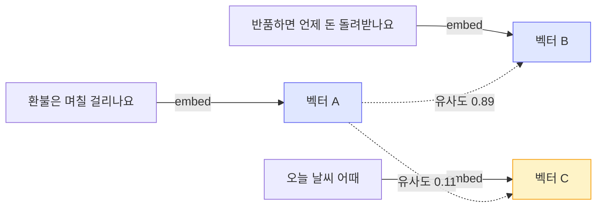

# 텍스트 임베딩 실무

임베딩은 텍스트를 고정 길이 숫자 벡터로 바꾸는 작업이다. "환불 정책"과 "반품 규정"처럼 글자는 다르지만 의미가 가까운 문장이 벡터 공간에서 서로 가까운 위치에 놓인다. 이 성질 하나로 검색, 분류, 중복 제거, 추천이 전부 코사인 유사도 계산으로 환원된다.

RAG 파이프라인 문서에서는 임베딩이 인덱싱 단계의 한 박스로 등장했다. 여기서는 그 박스 안을 본다. 어떤 모델을 고를지, 차원 수를 몇으로 잡을지, 유사도를 어떻게 계산하고 캐싱하는지, 청크 단위로 임베딩할 때 무엇이 깨지는지를 다룬다.

---

## 임베딩이 만들어내는 벡터 공간

모델은 텍스트를 받아서 `[0.012, -0.234, 0.561, ...]` 같은 실수 배열을 돌려준다. 배열 길이가 차원 수다. OpenAI `text-embedding-3-small`은 1536차원, `text-embedding-3-large`는 3072차원이다.



중요한 건 임베딩 자체가 "정답"을 담고 있지 않다는 점이다. 벡터는 모델이 학습한 분포 안에서만 의미를 가진다. 같은 문장이라도 모델이 다르면 전혀 다른 벡터가 나오고, 두 모델의 벡터를 섞어서 비교하면 무의미한 결과가 나온다. 인덱싱할 때 쓴 모델과 쿼리할 때 쓴 모델은 반드시 같아야 한다. 모델을 바꾸면 전체 인덱스를 다시 만들어야 한다. 이 사실 때문에 모델 선택은 한 번 정하면 되돌리기 어려운 결정이 된다.

---

## 모델 선택

세 갈래로 나눠 보면 정리가 쉽다. API형 상용 모델(OpenAI, Cohere), 직접 호스팅하는 오픈소스 모델(BGE, E5), 그리고 둘 사이의 비용/품질/운영 부담 차이다.

### OpenAI text-embedding-3

가장 흔하게 시작하는 선택지다. `text-embedding-3-small`은 100만 토큰당 $0.02로 저렴하고, 한국어를 포함한 다국어에서 무난하게 동작한다. `large`는 품질이 조금 더 높지만 가격이 $0.13으로 6배 이상이다.

실무에서 `small`로 시작해서 검색 품질이 부족할 때만 `large`를 검토하는 순서가 합리적이다. 대부분의 사내 문서 검색이나 FAQ 매칭은 `small`로 충분하다. 차이가 드러나는 건 의미가 미묘하게 갈리는 긴 문서나 전문 용어가 많은 도메인이다.

```python
from openai import OpenAI

client = OpenAI()

def embed_openai(texts: list[str], model: str = "text-embedding-3-small") -> list[list[float]]:
    # 배열로 한 번에 보내면 호출 횟수를 줄일 수 있다. 한 요청에 여러 텍스트를 넣는다.
    resp = client.embeddings.create(model=model, input=texts)
    return [item.embedding for item in resp.data]

vectors = embed_openai(["환불 정책이 궁금합니다", "배송은 며칠 걸리나요"])
print(len(vectors), len(vectors[0]))  # 2 1536
```

한 번에 보낼 수 있는 텍스트 개수와 토큰 총량에 제한이 있다. `input` 배열은 한 요청당 2048개까지, 텍스트 하나는 8191 토큰까지다. 문서 수만 건을 인덱싱할 때는 배치로 쪼개서 보내고, 중간에 실패하면 어디까지 처리했는지 기록해 두고 재시도해야 한다. 전부 다시 돌리면 비용과 시간이 두 배로 든다.

### Cohere embed v3

Cohere의 `embed-multilingual-v3.0`은 다국어 검색에서 강점이 있고, 입력 텍스트의 용도를 `input_type`으로 명시하는 게 특징이다. 문서를 넣을 때는 `search_document`, 쿼리를 넣을 때는 `search_query`를 지정한다. 같은 텍스트라도 용도에 따라 다르게 임베딩해서 검색 비대칭성을 모델이 직접 처리한다.

```python
import cohere

co = cohere.Client()

# 인덱싱 시 — 문서용
doc_resp = co.embed(
    texts=["환불은 결제일로부터 7일 이내 신청 가능합니다"],
    model="embed-multilingual-v3.0",
    input_type="search_document",
)

# 쿼리 시 — 질문용
query_resp = co.embed(
    texts=["환불 며칠 안에 해야 하나요"],
    model="embed-multilingual-v3.0",
    input_type="search_query",
)
```

`input_type`을 잘못 지정하거나 빼먹으면 검색 품질이 눈에 띄게 떨어진다. 인덱싱 코드와 쿼리 코드가 분리돼 있을 때 한쪽만 고치고 다른 쪽을 안 고치는 실수가 자주 난다. 두 경로에서 모델명과 `input_type`을 상수로 묶어 관리하는 편이 안전하다.

### 오픈소스 BGE / E5

`BAAI/bge-m3`, `intfloat/multilingual-e5-large` 같은 모델은 직접 호스팅한다. API 비용이 0이고 데이터가 외부로 나가지 않는다는 점 때문에 고른다. 사내망 문서나 개인정보가 섞인 데이터를 다룰 때는 사실상 이쪽이 유일한 선택지가 되는 경우가 있다.

```python
from sentence_transformers import SentenceTransformer

model = SentenceTransformer("intfloat/multilingual-e5-large")

# E5 계열은 접두어를 붙여야 제 성능이 나온다. 학습 방식이 그렇게 돼 있다.
docs = ["passage: 환불은 결제일로부터 7일 이내 신청 가능합니다"]
query = ["query: 환불 며칠 안에 해야 하나요"]

doc_vecs = model.encode(docs, normalize_embeddings=True)
query_vecs = model.encode(query, normalize_embeddings=True)
```

E5 모델의 `query:` / `passage:` 접두어는 처음 쓰는 사람이 거의 다 빼먹는 부분이다. 접두어 없이 임베딩하면 동작은 하는데 검색 정확도가 떨어진다. 모델 카드에 적힌 사용법을 그대로 따라야 한다. BGE-M3는 접두어 없이 동작하지만 대신 dense/sparse/multi-vector를 한 번에 뽑아주는 등 사용법이 또 다르다. 오픈소스 모델은 "다운로드해서 encode 호출"로 끝나지 않고 모델별 관례를 확인하는 단계가 반드시 필요하다.

호스팅 비용도 따져야 한다. `multilingual-e5-large`는 GPU에서 돌려야 처리량이 나온다. CPU로도 돌아가지만 대량 인덱싱은 현실적으로 느리다. 문서가 수십만 건을 넘어가고 GPU 인스턴스를 상시 띄워둘 수 있다면 API보다 싸지지만, 트래픽이 적고 띄엄띄엄 들어오면 API 호출이 운영 부담 면에서 낫다. "오픈소스 = 무료"가 아니라 "API 요금이 GPU 임대료로 바뀐다"고 보는 게 맞다.

---

## 차원 수와 비용/성능 트레이드오프

차원이 높으면 표현력이 올라가는 대신 저장 공간과 검색 비용이 늘어난다. 1536차원 float32 벡터 하나는 약 6KB다. 문서 100만 건이면 벡터만 6GB다. 차원이 3072로 늘면 그대로 12GB가 된다. 벡터 DB 메모리 사용량과 검색 지연이 차원에 비례해서 커진다.

### Matryoshka로 차원 줄이기

`text-embedding-3` 계열은 Matryoshka 방식으로 학습돼서, 앞쪽 차원만 잘라 써도 의미가 유지된다. `dimensions` 파라미터로 출력 차원을 줄일 수 있다.

```python
# 1536차원을 512차원으로 줄여서 받는다
resp = client.embeddings.create(
    model="text-embedding-3-small",
    input=["환불 정책"],
    dimensions=512,
)
vec = resp.data[0].embedding
print(len(vec))  # 512
```

1536을 512로 줄이면 저장 공간이 1/3로 떨어지는데 검색 품질 하락은 생각보다 작다. 사내 검색 정도면 256~512차원으로도 충분한 경우가 많다. 단, 직접 차원을 자른 뒤에는 반드시 다시 정규화해야 한다(아래 정규화 항목 참고). 그리고 인덱스 전체를 같은 차원으로 통일해야 한다. 일부 문서만 512, 일부는 1536으로 들어가면 비교가 불가능하다.

오픈소스 모델은 대부분 차원이 고정이다. BGE/E5는 모델이 정한 차원(보통 768 또는 1024)을 그대로 쓴다. 차원을 줄이고 싶으면 별도의 차원 축소(PCA 등)를 붙여야 하는데, 이러면 또 변환 행렬을 따로 관리해야 해서 복잡해진다. 차원 유연성이 필요하면 처음부터 Matryoshka를 지원하는 모델을 고르는 게 낫다.

### 저장 형식

float32 대신 float16이나 int8로 양자화하면 저장 공간을 절반 또는 1/4로 줄인다. 검색 품질 손실은 대개 무시할 수준이다. 벡터 DB가 양자화를 지원하면 켜두는 편이 좋다. 다만 양자화는 차원 축소와 별개 축이다. 둘 다 적용할 수 있고, 보통 차원을 먼저 적정선으로 잡은 뒤 저장 단계에서 양자화를 얹는다.

---

## 코사인 유사도 계산

두 벡터의 의미적 가까움은 코사인 유사도로 잰다. 벡터 사이 각도의 코사인 값이고, 1에 가까우면 비슷하고 0에 가까우면 무관, -1이면 반대다.

```python
import numpy as np

def cosine_similarity(a: np.ndarray, b: np.ndarray) -> float:
    return float(np.dot(a, b) / (np.linalg.norm(a) * np.linalg.norm(b)))
```

### 정규화하면 내적이 곧 코사인 유사도다

벡터를 미리 L2 정규화(크기를 1로 맞춤)해 두면 `np.linalg.norm`이 1이 되므로 코사인 유사도가 그냥 내적이 된다. 매 비교마다 norm을 다시 계산할 필요가 없어서 검색이 빨라진다.

```python
def normalize(vecs: np.ndarray) -> np.ndarray:
    norms = np.linalg.norm(vecs, axis=1, keepdims=True)
    return vecs / norms

# 인덱싱 시 한 번 정규화해서 저장
doc_matrix = normalize(np.array(doc_vectors))  # shape: (N, dim)

# 쿼리도 정규화한 뒤 행렬 곱 한 번으로 전체 유사도를 구한다
q = normalize(np.array([query_vector]))[0]
sims = doc_matrix @ q          # shape: (N,)
top_k = np.argsort(-sims)[:5]  # 유사도 높은 순 상위 5개
```

OpenAI 임베딩은 이미 정규화된 상태로 나오므로 내적만 써도 된다. E5는 `normalize_embeddings=True`로 받으면 된다. 직접 차원을 자른 경우(Matryoshka)는 정규화가 깨지므로 다시 정규화해야 한다는 점을 다시 강조한다. 이걸 놓치면 유사도 값이 미묘하게 틀어져서 디버깅하기 까다롭다.

### 유사도 점수의 절대값을 믿지 마라

코사인 유사도 0.82가 "82% 관련 있음"을 뜻하지 않는다. 모델마다, 텍스트 분포마다 점수대가 다르다. 어떤 모델은 무관한 문장끼리도 0.7대가 나오고, 어떤 모델은 0.3대가 나온다. 그래서 "0.8 이상만 통과" 같은 고정 임계값을 다른 모델에 그대로 옮기면 안 된다. 임계값은 실제 데이터로 몇 개 뽑아 보면서 정해야 하고, 모델을 바꾸면 다시 잡아야 한다. 절대값보다 상대 순위(top-k)가 훨씬 안정적이다.

---

## 임베딩 캐싱

같은 텍스트를 두 번 임베딩하는 건 돈과 시간 낭비다. 특히 문서가 일부만 바뀌는 상황에서 전체를 다시 임베딩하면 안 된다. 텍스트 내용을 해시로 만들어 키로 쓰면 변경되지 않은 텍스트는 캐시에서 바로 꺼낸다.

```python
import hashlib
import json

def cache_key(text: str, model: str, dimensions: int | None) -> str:
    # 텍스트뿐 아니라 모델명과 차원도 키에 포함해야 한다.
    # 모델이나 차원이 다르면 벡터도 다르기 때문이다.
    payload = json.dumps([text, model, dimensions], ensure_ascii=False)
    return hashlib.sha256(payload.encode("utf-8")).hexdigest()

def embed_with_cache(texts: list[str], model: str, dimensions: int | None, store: dict) -> list[list[float]]:
    results: list[list[float] | None] = [None] * len(texts)
    misses = []  # (원래 인덱스, 텍스트)

    for i, t in enumerate(texts):
        key = cache_key(t, model, dimensions)
        if key in store:
            results[i] = store[key]
        else:
            misses.append((i, t))

    # 캐시에 없는 것만 모아서 한 번에 임베딩
    if misses:
        miss_texts = [t for _, t in misses]
        kwargs = {"model": model, "input": miss_texts}
        if dimensions:
            kwargs["dimensions"] = dimensions
        resp = client.embeddings.create(**kwargs)
        for (orig_i, t), item in zip(misses, resp.data):
            store[cache_key(t, model, dimensions)] = item.embedding
            results[orig_i] = item.embedding

    return results  # type: ignore
```

캐시 키에 모델명과 차원을 반드시 넣어야 한다. 텍스트만 키로 쓰면 모델을 `small`에서 `large`로 바꿨을 때 옛날 벡터가 그대로 반환돼서, 차원이 안 맞거나 엉뚱한 결과가 나온다. 이 버그는 "왜 갑자기 검색이 이상하지" 하고 한참 헤매게 만든다.

실제 운영에서는 `dict` 대신 Redis나 디스크 기반 KV 저장소를 쓴다. 임베딩 벡터는 크니까 메모리 캐시에 무한정 쌓으면 안 되고, TTL이나 LRU로 관리한다. 다만 문서 임베딩처럼 한 번 만들면 거의 안 바뀌는 건 캐시보다 벡터 DB에 영구 저장하는 게 맞다. 캐싱이 진짜 효과를 보는 곳은 쿼리 쪽이다. 같은 질문이 반복해서 들어오는 챗봇이나 검색창에서, 인기 쿼리의 임베딩을 캐시하면 호출 수가 눈에 띄게 준다.

### 쿼리 캐싱의 함정

쿼리는 문서와 달리 약간씩 다른 표현으로 들어온다. "환불 며칠"과 "환불 몇일"은 다른 문자열이라 캐시 키가 갈린다. 정규화(공백 정리, 소문자화, 맞춤법 보정)를 키 생성 전에 거치면 적중률이 올라간다. 다만 과하게 정규화하면 의미가 다른 쿼리가 같은 키로 합쳐질 수 있으니, 어디까지 정규화할지는 도메인을 보고 정한다.

---

## 청크 단위 임베딩에서 겪는 문제

긴 문서는 통째로 임베딩하지 않고 청크로 잘라서 임베딩한다. 여기서 실무 문제가 집중적으로 발생한다.

### 청크가 잘리면 의미도 잘린다

문장 중간이나 표 한가운데서 청크가 끊기면 그 청크의 임베딩은 반쪽짜리 의미만 담는다. "결제일로부터 7일 이내"가 두 청크로 갈리면 "결제일로부터"와 "7일 이내"가 각각 따로 임베딩돼서, "환불 기한" 검색에 둘 다 안 걸리는 일이 생긴다. 청킹 단계에서 문장이나 문단 경계를 지키는 게 임베딩 품질에 직접 영향을 준다. 청킹은 RAG 파이프라인 문서에서 더 자세히 다루지만, 임베딩 입장에서 보면 "입력이 의미 단위로 안 잘리면 출력 벡터도 못 쓴다"는 한 줄로 요약된다.

### 평균이 의미를 흐린다

청크 안에 서로 다른 주제가 섞이면, 임베딩이 그 주제들의 평균 같은 벡터를 만든다. 환불 정책과 배송 정책이 한 청크에 들어 있으면, 그 벡터는 둘 중 어느 쪽에도 또렷하게 가깝지 않은 애매한 지점에 놓인다. 검색에서 둘 다 어중간하게 걸리거나 둘 다 놓친다. 청크는 한 가지 주제만 담도록 잘라야 임베딩이 또렷해진다. 청크 크기를 무작정 키우면 이 문제가 심해진다.

### 짧은 청크끼리는 구분이 안 된다

반대로 청크가 너무 짧으면 정보량이 부족해서 벡터가 변별력을 잃는다. "네", "확인했습니다" 같은 짧은 청크는 거의 비슷한 위치에 몰려서 검색에 잡음만 된다. 채팅 로그를 청킹할 때 이런 짧은 발화가 대량으로 들어가면 인덱스가 쓸모없는 벡터로 채워진다. 일정 길이 미만 청크는 앞뒤와 합치거나 인덱싱에서 빼는 처리가 필요하다.

### 청크에 맥락을 덧붙이기

청크 하나만 보면 무슨 문서의 일부인지 알 수 없다. "7일 이내 신청"이라는 청크는 환불 문서인지 교환 문서인지 임베딩에 안 담긴다. 청크 앞에 문서 제목이나 섹션 헤딩을 붙여서 임베딩하면 이 맥락이 벡터에 반영된다.

```python
def build_chunk_text(doc_title: str, section: str, chunk_body: str) -> str:
    # 검색 품질을 위해 청크 본문 앞에 출처 맥락을 붙인다.
    # 단, 저장이나 표시는 원본 chunk_body로 하고 임베딩 입력만 이 형태로 만든다.
    return f"문서: {doc_title}\n섹션: {section}\n\n{chunk_body}"

text_for_embedding = build_chunk_text("환불 정책", "환불 기한", "결제일로부터 7일 이내 신청 가능합니다")
vec = embed_openai([text_for_embedding])[0]
```

맥락 접두어를 붙이면 검색 정확도가 올라가는 경우가 많다. 주의할 점은 임베딩에 넣는 텍스트와 사용자에게 보여주거나 LLM에 넘기는 텍스트를 분리해야 한다는 것이다. 임베딩용으로 만든 접두어가 그대로 답변 생성 프롬프트에 들어가면 불필요한 토큰이 늘고 노이즈가 된다. 임베딩 입력과 표시용 본문은 별도 필드로 들고 다닌다.

### 토큰 상한과 한국어

`text-embedding-3`의 입력 상한은 8191 토큰이다. 청크가 이걸 넘으면 잘려서 뒷부분이 임베딩에 안 들어간다. 한국어는 영어보다 토큰 효율이 낮아서, 같은 글자 수에 토큰을 더 쓴다. 한국어 500자가 대략 300~400 토큰 정도다. 청크 크기를 글자 수로만 잡으면 어느 순간 토큰 상한을 넘긴다. 임베딩 직전에 토큰 수를 재서 상한을 넘는 청크는 잘라내거나 다시 쪼개는 안전장치를 두는 게 좋다.

```python
import tiktoken

enc = tiktoken.encoding_for_model("text-embedding-3-small")

def fits_token_limit(text: str, limit: int = 8000) -> bool:
    # 8191이 상한이지만 여유를 두고 8000으로 잡는다
    return len(enc.encode(text)) <= limit
```

---

## 정리하면서 짚을 것

임베딩에서 되돌리기 어려운 결정은 모델 선택이다. 모델을 바꾸면 전체 인덱스를 다시 만들어야 하므로, `small`로 시작하더라도 나중에 `large`나 오픈소스로 옮길 가능성을 코드 구조에서 미리 분리해 두면 마이그레이션이 덜 아프다. 임베딩 함수를 인터페이스 하나로 감싸고, 모델명·차원·`input_type` 같은 설정을 한곳에 모아두는 것만으로도 나중에 갈아끼우기가 훨씬 쉬워진다.

검색 품질이 안 나올 때 의심할 순서는 대체로 청킹 → 맥락 접두어 → 모델 → 차원이다. 모델부터 바꾸려 들면 인덱스를 통째로 다시 만드는 비싼 작업이 되니까, 청킹과 입력 텍스트 구성을 먼저 점검하는 편이 비용 대비 효과가 크다.

관련 문서: [RAG 파이프라인](RAG_Pipeline.md), [RAG for Code](RAG_for_Code.md)
