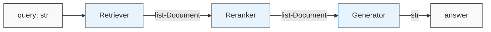
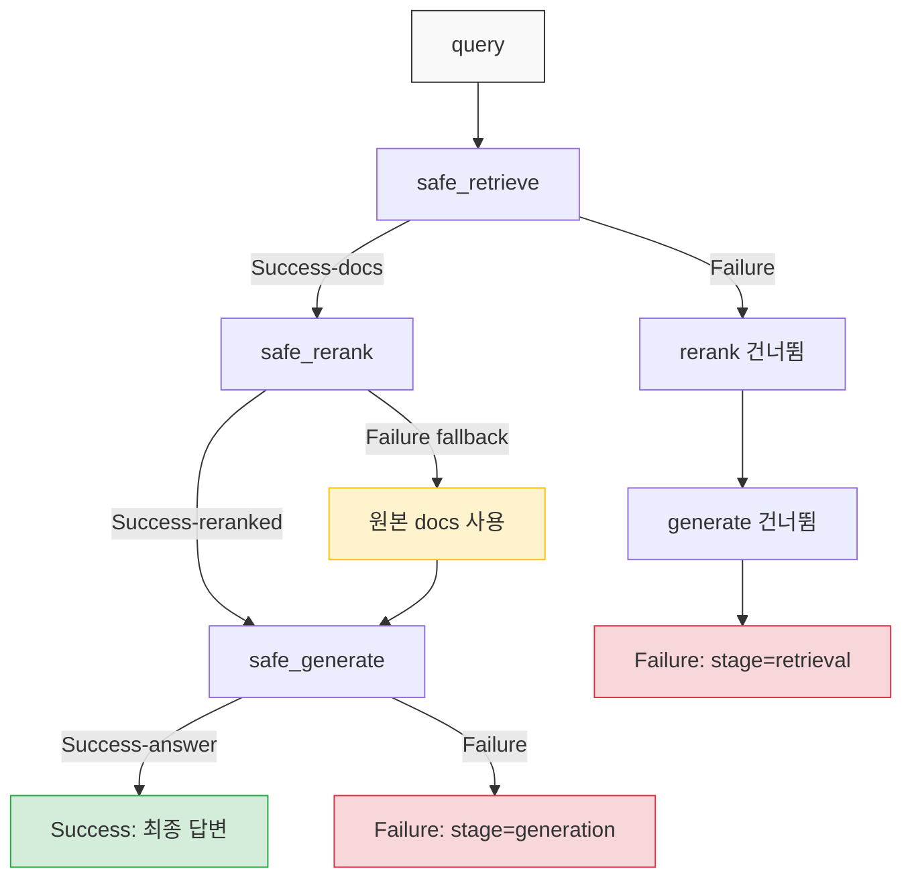
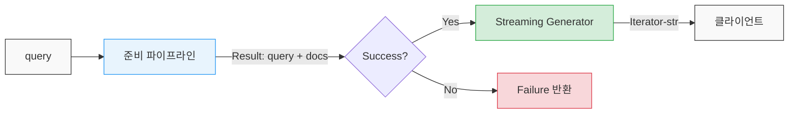

# Functional RAG

RAG 파이프라인을 짜다 보면 코드가 금방 복잡해진다. retriever 결과를 가공하고, reranker를 통과시키고, 프롬프트에 끼워넣고, LLM을 호출하는 과정이 한 함수 안에 뒤엉키면 디버깅도 테스트도 어려워진다.

함수형 프로그래밍의 아이디어를 RAG에 가져오면 이 문제를 상당 부분 해결할 수 있다. 각 단계를 순수 함수로 분리하고, 파이프라인을 함수 합성으로 구성하고, 실패를 명시적으로 처리하는 방식이다.

---

## 1. 절차형 RAG의 문제

실무에서 흔히 보는 RAG 코드부터 살펴보자.

```python
def answer_question(query: str) -> str:
    # 임베딩 생성
    embedding = openai.embeddings.create(input=query, model="text-embedding-3-small")
    vector = embedding.data[0].embedding
    
    # 벡터 검색
    results = pinecone_index.query(vector=vector, top_k=10)
    
    # 문서 가져오기
    docs = []
    for match in results.matches:
        doc = db.get_document(match.id)
        if doc:
            docs.append(doc)
    
    # reranking
    scored = cohere_client.rerank(query=query, documents=[d.text for d in docs], top_n=3)
    reranked = [docs[r.index] for r in scored.results]
    
    # 프롬프트 구성
    context = "\n\n".join([d.text for d in reranked])
    prompt = f"다음 문서를 참고해서 답변하세요:\n\n{context}\n\n질문: {query}"
    
    # LLM 호출
    response = openai.chat.completions.create(
        model="gpt-4o",
        messages=[{"role": "user", "content": prompt}]
    )
    return response.choices[0].message.content
```

이 코드의 문제점:

- **테스트 불가능** — 함수 하나가 임베딩, 벡터DB, 외부 DB, Cohere, OpenAI 전부 호출한다. 단위 테스트를 짜려면 mock이 5개 필요하다.
- **재사용 불가능** — reranker를 빼고 싶으면? 검색을 BM25로 바꾸고 싶으면? 함수 내부를 뜯어야 한다.
- **에러 처리가 애매** — 벡터 검색이 빈 결과를 반환하면? Cohere API가 죽으면? try-except를 덕지덕지 붙이게 된다.
- **디버깅이 어렵다** — 파이프라인 중간에서 어떤 문서가 검색되었는지 확인하려면 print를 여기저기 넣어야 한다.

---

## 2. 함수형 RAG의 핵심 원칙

### 2.1 순수 함수로 각 단계를 분리한다

RAG 파이프라인의 각 단계를 입력과 출력이 명확한 순수 함수로 만든다. 외부 상태를 변경하지 않고, 같은 입력에 대해 같은 출력을 반환하는 함수다.

물론 실제로 API 호출이나 DB 조회는 부수 효과(side effect)가 있다. 여기서 말하는 "순수"는 수학적 의미의 순수 함수가 아니라, **각 함수가 자신의 역할만 하고 다른 단계에 간섭하지 않는 것**을 뜻한다.

```python
from dataclasses import dataclass
from typing import Callable

@dataclass(frozen=True)
class Document:
    id: str
    text: str
    metadata: dict
    score: float = 0.0

# 각 단계를 독립적인 함수로 정의
Retriever = Callable[[str], list[Document]]
Reranker = Callable[[str, list[Document]], list[Document]]
Generator = Callable[[str, list[Document]], str]
```

`Document`를 `frozen=True`로 선언한 이유가 있다. 파이프라인을 통과하면서 Document가 변경되면 어느 단계에서 값이 바뀌었는지 추적이 안 된다. 불변 객체를 쓰면 각 단계가 새 Document를 반환하게 되므로, 파이프라인 어느 지점에서든 상태를 확인할 수 있다.

### 2.2 함수 합성으로 파이프라인을 구성한다

각 단계를 따로 만들었으면, 이를 합성해서 파이프라인을 만든다. 전체 합성 구조를 그림으로 보면 다음과 같다.



각 블록은 `Callable`이고, 입력 타입과 출력 타입이 맞아야 합성이 된다. 중간에 Reranker를 빼려면 `lambda query, docs: docs`로 교체하면 되고, Retriever를 BM25로 바꾸려면 해당 블록만 갈아 끼우면 된다.

```python
from functools import reduce
from typing import TypeVar, Callable

A = TypeVar('A')
B = TypeVar('B')
C = TypeVar('C')

def compose(f: Callable[[B], C], g: Callable[[A], B]) -> Callable[[A], C]:
    """두 함수를 합성한다. compose(f, g)(x) == f(g(x))"""
    return lambda x: f(g(x))

def pipe(*functions):
    """왼쪽에서 오른쪽으로 함수를 합성한다. pipe(f, g, h)(x) == h(g(f(x)))"""
    return reduce(lambda f, g: lambda x: g(f(x)), functions)
```

파이프라인은 이렇게 만든다:

```python
def build_rag_pipeline(
    retriever: Retriever,
    reranker: Reranker,
    generator: Generator
) -> Callable[[str], str]:
    
    def pipeline(query: str) -> str:
        docs = retriever(query)
        reranked = reranker(query, docs)
        return generator(query, reranked)
    
    return pipeline
```

이제 파이프라인의 각 구성요소를 바꿔 끼울 수 있다:

```python
# 벡터 검색 기반 파이프라인
vector_pipeline = build_rag_pipeline(
    retriever=vector_retriever,
    reranker=cohere_reranker,
    generator=openai_generator
)

# BM25 + cross-encoder 파이프라인
bm25_pipeline = build_rag_pipeline(
    retriever=bm25_retriever,
    reranker=cross_encoder_reranker,
    generator=openai_generator
)

# reranker 없는 간단한 파이프라인
simple_pipeline = build_rag_pipeline(
    retriever=vector_retriever,
    reranker=lambda query, docs: docs,  # 그냥 통과
    generator=openai_generator
)
```

### 2.3 불변 Document 체인

파이프라인 각 단계를 거치면서 Document가 어떻게 변했는지 추적하고 싶을 때가 있다. 검색 점수는 얼마였는지, reranking 후 점수는 얼마로 바뀌었는지 같은 것들이다.

`frozen=True`인 Document를 쓰고 있으므로, 각 단계에서 새 Document를 만들 때 이전 정보를 metadata에 넣어두면 된다.

```python
from dataclasses import replace

def cohere_reranker(query: str, docs: list[Document]) -> list[Document]:
    response = cohere_client.rerank(
        query=query,
        documents=[d.text for d in docs],
        top_n=5
    )
    
    reranked = []
    for result in response.results:
        original = docs[result.index]
        # 기존 Document를 변경하지 않고 새로 만든다
        new_doc = replace(
            original,
            score=result.relevance_score,
            metadata={
                **original.metadata,
                "original_score": original.score,
                "rerank_score": result.relevance_score
            }
        )
        reranked.append(new_doc)
    
    return reranked
```

`dataclasses.replace`는 frozen dataclass에서 일부 필드만 바꾼 새 인스턴스를 만든다. 원본은 그대로 남아 있으므로 이전 단계의 결과를 언제든 확인할 수 있다.

---

## 3. Either/Result 모나드로 실패 처리

RAG 파이프라인은 실패 지점이 많다. 벡터 DB 타임아웃, 검색 결과 0건, reranker API 오류, LLM rate limit 등. try-except를 단계마다 붙이면 코드가 지저분해진다.

함수형 프로그래밍의 Either(또는 Result) 패턴을 쓰면 실패를 값으로 다룰 수 있다. 예외를 던지는 대신, 성공 또는 실패를 담은 객체를 반환한다.

### 3.1 Result 타입 구현

```python
from dataclasses import dataclass
from typing import TypeVar, Generic, Callable, Union

T = TypeVar('T')
E = TypeVar('E')
U = TypeVar('U')

@dataclass(frozen=True)
class Success(Generic[T]):
    value: T

@dataclass(frozen=True)
class Failure(Generic[E]):
    error: E
    stage: str  # 어느 단계에서 실패했는지

Result = Union[Success[T], Failure[E]]

def map_result(result: Result, f: Callable[[T], U]) -> Result:
    """성공이면 함수를 적용하고, 실패면 그대로 전달한다."""
    if isinstance(result, Failure):
        return result
    return Success(f(result.value))

def bind_result(result: Result, f: Callable[[T], Result]) -> Result:
    """성공이면 함수를 적용하고(함수도 Result를 반환), 실패면 그대로 전달한다."""
    if isinstance(result, Failure):
        return result
    return f(result.value)
```

### 3.2 Result가 파이프라인을 흐르는 구조

Result 패턴에서 데이터가 파이프라인을 통과하는 흐름을 보자. 성공 경로와 실패 경로가 분리되는 게 핵심이다.



`bind_result`가 하는 일이 이 그림에 다 나와 있다. Success면 다음 함수를 실행하고, Failure면 나머지 단계를 전부 건너뛴다. reranker처럼 fallback이 있는 단계는 실패해도 Success로 복구되어 파이프라인이 계속 진행된다.

### 3.3 Result 기반 파이프라인

```python
def safe_retrieve(retriever: Retriever) -> Callable[[str], Result]:
    def _retrieve(query: str) -> Result:
        try:
            docs = retriever(query)
            if not docs:
                return Failure(error="검색 결과 없음", stage="retrieval")
            return Success(docs)
        except Exception as e:
            return Failure(error=str(e), stage="retrieval")
    return _retrieve

def safe_rerank(reranker: Reranker) -> Callable[[str, list[Document]], Result]:
    def _rerank(query: str, docs: list[Document]) -> Result:
        try:
            reranked = reranker(query, docs)
            return Success(reranked)
        except Exception as e:
            # reranker 실패 시 원본 문서를 그대로 사용하는 fallback
            return Success(docs)
    return _rerank

def build_safe_pipeline(
    retriever: Retriever,
    reranker: Reranker,
    generator: Generator
) -> Callable[[str], Result]:
    
    _retrieve = safe_retrieve(retriever)
    _rerank = safe_rerank(reranker)
    
    def pipeline(query: str) -> Result:
        result = _retrieve(query)
        if isinstance(result, Failure):
            return result
        
        docs = result.value
        result = _rerank(query, docs)
        if isinstance(result, Failure):
            return result
        
        reranked = result.value
        try:
            answer = generator(query, reranked)
            return Success(answer)
        except Exception as e:
            return Failure(error=str(e), stage="generation")
    
    return pipeline
```

이 패턴의 장점은 실패가 파이프라인을 조용히 흘러간다는 것이다. retrieval에서 실패하면 reranker와 generator는 실행되지 않고, Failure가 그대로 최종 결과로 나온다. 어느 단계에서 무슨 이유로 실패했는지가 Failure 객체에 담겨 있다.

reranker처럼 실패해도 파이프라인이 계속 돌아야 하는 단계는 fallback 로직을 함수 내부에 넣으면 된다. 위 코드에서 reranker가 죽으면 원본 문서를 그대로 넘긴다.

---

## 4. LangChain LCEL의 Runnable 합성 구조

LangChain의 LCEL(LangChain Expression Language)은 사실 함수형 RAG 사상을 프레임워크 레벨에서 구현한 것이다. `Runnable` 인터페이스가 핵심이고, `|` 연산자로 파이프라인을 합성한다.

### 4.1 Runnable이 하는 일

LCEL의 모든 컴포넌트는 `Runnable` 인터페이스를 구현한다. `invoke(input) -> output` 메서드가 있고, 입력 타입과 출력 타입이 정해져 있다.

```python
from langchain_core.runnables import RunnablePassthrough, RunnableLambda
from langchain_openai import ChatOpenAI, OpenAIEmbeddings
from langchain_core.prompts import ChatPromptTemplate
from langchain_core.output_parsers import StrOutputParser
from langchain_community.vectorstores import Chroma

# 각 컴포넌트가 Runnable이다
embeddings = OpenAIEmbeddings()
vectorstore = Chroma(embedding_function=embeddings)
retriever = vectorstore.as_retriever(search_kwargs={"k": 5})
llm = ChatOpenAI(model="gpt-4o")
prompt = ChatPromptTemplate.from_template(
    "다음 문서를 참고해서 답변하세요:\n\n{context}\n\n질문: {question}"
)
```

### 4.2 파이프 연산자로 합성

`|` 연산자는 내부적으로 `RunnableSequence`를 만든다. 앞 Runnable의 출력이 뒤 Runnable의 입력으로 들어간다.

```python
def format_docs(docs):
    return "\n\n".join(doc.page_content for doc in docs)

# LCEL 파이프라인
chain = (
    {"context": retriever | format_docs, "question": RunnablePassthrough()}
    | prompt
    | llm
    | StrOutputParser()
)

# 실행
answer = chain.invoke("RAG에서 chunking은 어떻게 하나요?")
```

이 코드에서 `retriever | format_docs`는 retriever의 출력(Document 리스트)을 format_docs 함수에 넣겠다는 뜻이다. dict로 묶은 부분은 `RunnableParallel`이 되어서 context와 question을 병렬로 처리한다.

### 4.3 LCEL이 함수형인 이유

LCEL이 함수형 RAG 패턴과 맞닿는 지점:

| 함수형 개념 | LCEL 구현 |
|------------|----------|
| 함수 합성 | `chain_a \| chain_b` (RunnableSequence) |
| 병렬 처리 | `{"a": chain_a, "b": chain_b}` (RunnableParallel) |
| 고차 함수 | `RunnableLambda(fn)`으로 일반 함수를 Runnable로 변환 |
| 불변성 | 각 Runnable은 상태를 갖지 않고 입출력만 정의 |
| 에러 처리 | `chain.with_fallbacks([fallback_chain])` |

실제로 fallback을 붙이면 이런 모양이 된다:

```python
from langchain_community.retrievers import BM25Retriever

# 벡터 검색 실패 시 BM25로 대체
retriever_with_fallback = retriever.with_fallbacks([bm25_retriever])

chain = (
    {"context": retriever_with_fallback | format_docs, "question": RunnablePassthrough()}
    | prompt
    | llm
    | StrOutputParser()
)
```

### 4.4 커스텀 Runnable 만들기

기존 Runnable로 안 되는 로직은 `RunnableLambda`로 감싸면 된다.

```python
from langchain_core.runnables import RunnableLambda

def rerank_docs(input_dict: dict) -> dict:
    """Cohere reranker를 Runnable로 감싼다."""
    query = input_dict["question"]
    docs = input_dict["docs"]
    
    response = cohere_client.rerank(
        query=query,
        documents=[d.page_content for d in docs],
        top_n=3
    )
    reranked = [docs[r.index] for r in response.results]
    return {**input_dict, "docs": reranked}

# reranker를 파이프라인에 끼워넣기
chain = (
    {"docs": retriever, "question": RunnablePassthrough()}
    | RunnableLambda(rerank_docs)
    | (lambda x: {"context": format_docs(x["docs"]), "question": x["question"]})
    | prompt
    | llm
    | StrOutputParser()
)
```

---

## 5. 함수형 RAG vs 절차형 RAG

### 5.1 구조 비교

**절차형** — 한 함수 안에 모든 로직이 순서대로 들어간다.

```python
def rag_answer(query):
    docs = search(query)          # 1. 검색
    docs = filter(docs)           # 2. 필터링
    docs = rerank(query, docs)    # 3. 재정렬
    context = format(docs)        # 4. 포맷팅
    answer = generate(query, ctx) # 5. 생성
    return answer
```

**함수형** — 각 단계가 독립 함수이고, 합성으로 파이프라인을 만든다.

```python
pipeline = pipe(
    lambda q: (q, search(q)),
    lambda qd: (qd[0], filter_docs(qd[1])),
    lambda qd: (qd[0], rerank(qd[0], qd[1])),
    lambda qd: (qd[0], format_docs(qd[1])),
    lambda qd: generate(qd[0], qd[1])
)
```

튜플을 넘기는 게 보기 좋지는 않다. 실제로는 dict나 dataclass를 쓰는 게 낫다:

```python
@dataclass(frozen=True)
class RAGState:
    query: str
    documents: list[Document] = field(default_factory=list)
    context: str = ""
    answer: str = ""

pipeline = pipe(
    lambda s: replace(s, documents=search(s.query)),
    lambda s: replace(s, documents=filter_docs(s.documents)),
    lambda s: replace(s, documents=rerank(s.query, s.documents)),
    lambda s: replace(s, context=format_docs(s.documents)),
    lambda s: replace(s, answer=generate(s.query, s.context))
)

result = pipeline(RAGState(query="함수형 RAG가 뭔가요?"))
# result.documents → 검색된 문서들
# result.context → 포맷팅된 컨텍스트
# result.answer → 최종 답변
```

`RAGState`가 frozen이므로 각 단계에서 `replace`로 새 상태를 만든다. 이전 단계의 상태도 그대로 남아 있어서 디버깅할 때 유용하다.

### 5.2 어떤 상황에 어떤 방식이 맞나

**절차형이 나은 경우:**

- 파이프라인이 단순하고 바뀔 일이 없다
- 팀원 대부분이 함수형 패턴에 익숙하지 않다
- 프로토타이핑 단계라 빨리 돌아가는 게 중요하다

**함수형이 나은 경우:**

- 검색 방식이나 reranker를 자주 바꿔가며 실험한다
- 파이프라인 단계별로 단위 테스트가 필요하다
- 여러 파이프라인을 조합해서 써야 한다 (예: 도메인별로 다른 retriever)
- 실패 처리를 체계적으로 해야 한다

현실적으로는 LCEL 같은 프레임워크를 쓰면 함수형 패턴이 강제되므로 별도로 고민할 필요가 줄어든다. 프레임워크 없이 직접 파이프라인을 짠다면 함수형 패턴을 의식적으로 적용하는 게 좋다.

---

## 6. 실제 Python 구현: 함수형 RAG 파이프라인

앞에서 설명한 개념을 합쳐서 실제로 동작하는 파이프라인을 만들어 보자.

```python
from dataclasses import dataclass, field, replace
from typing import Callable, Union
from functools import reduce

# --- 1. 타입 정의 ---

@dataclass(frozen=True)
class Document:
    id: str
    text: str
    metadata: dict = field(default_factory=dict)
    score: float = 0.0

@dataclass(frozen=True)
class Success:
    value: object

@dataclass(frozen=True)
class Failure:
    error: str
    stage: str

Result = Union[Success, Failure]

# --- 2. 파이프라인 유틸리티 ---

def pipe(*functions):
    return reduce(lambda f, g: lambda x: g(f(x)), functions)

def safe(stage_name: str, fn, fallback=None):
    """함수를 Result 기반으로 감싼다."""
    def wrapper(result):
        if isinstance(result, Failure):
            return result
        try:
            value = fn(result.value if isinstance(result, Success) else result)
            return Success(value)
        except Exception as e:
            if fallback:
                return Success(fallback(result.value if isinstance(result, Success) else result))
            return Failure(error=str(e), stage=stage_name)
    return wrapper

# --- 3. 각 단계 구현 ---

def create_vector_retriever(vectorstore, k: int = 10) -> Callable:
    def retrieve(query: str) -> list[Document]:
        results = vectorstore.similarity_search_with_score(query, k=k)
        return [
            Document(
                id=doc.metadata.get("id", str(i)),
                text=doc.page_content,
                metadata=doc.metadata,
                score=score
            )
            for i, (doc, score) in enumerate(results)
        ]
    return retrieve

def create_reranker(cohere_client, top_n: int = 3) -> Callable:
    def rerank(query_and_docs: tuple) -> tuple:
        query, docs = query_and_docs
        response = cohere_client.rerank(
            query=query,
            documents=[d.text for d in docs],
            top_n=top_n
        )
        reranked = [
            replace(
                docs[r.index],
                score=r.relevance_score,
                metadata={**docs[r.index].metadata, "rerank_score": r.relevance_score}
            )
            for r in response.results
        ]
        return (query, reranked)
    return rerank

def create_generator(llm_client, model: str = "gpt-4o") -> Callable:
    def generate(query_and_docs: tuple) -> str:
        query, docs = query_and_docs
        context = "\n\n---\n\n".join(d.text for d in docs)
        response = llm_client.chat.completions.create(
            model=model,
            messages=[{
                "role": "user",
                "content": f"다음 문서를 참고해서 답변하세요:\n\n{context}\n\n질문: {query}"
            }]
        )
        return response.choices[0].message.content
    return generate

# --- 4. 파이프라인 조립 ---

def build_functional_rag(vectorstore, cohere_client, openai_client):
    retrieve = create_vector_retriever(vectorstore, k=10)
    rerank = create_reranker(cohere_client, top_n=3)
    generate = create_generator(openai_client)
    
    # reranker 실패 시 원본 문서를 그대로 쓰는 fallback
    def rerank_fallback(query_and_docs):
        return query_and_docs
    
    pipeline = pipe(
        safe("retrieval", lambda q: (q, retrieve(q))),
        safe("reranking", rerank, fallback=rerank_fallback),
        safe("generation", generate)
    )
    
    return pipeline

# --- 5. 사용 ---

# pipeline = build_functional_rag(vectorstore, cohere_client, openai_client)
# result = pipeline("RAG 파이프라인에서 chunking 크기는 어떻게 정하나요?")
# 
# if isinstance(result, Success):
#     print(result.value)
# elif isinstance(result, Failure):
#     print(f"[{result.stage}] 실패: {result.error}")
```

---

## 7. 단계별 단위 테스트 작성

함수형 RAG의 가장 큰 이점은 각 단계를 독립적으로 테스트할 수 있다는 점이다. 외부 의존성 없이 입력-출력만 검증하면 된다.

### 7.1 Retriever 테스트

Retriever는 query를 받아 Document 리스트를 반환한다. 외부 벡터DB를 호출하는 실제 retriever 대신, 테스트에서는 결과가 정해진 fake retriever를 넣는다.

```python
import pytest

def fake_retriever(query: str) -> list[Document]:
    """테스트용 retriever. 쿼리에 상관없이 고정된 문서를 반환한다."""
    return [
        Document(id="1", text="Python은 인터프리터 언어다.", metadata={"source": "wiki"}, score=0.9),
        Document(id="2", text="Python 3.12에서 성능이 개선됐다.", metadata={"source": "blog"}, score=0.7),
    ]

def empty_retriever(query: str) -> list[Document]:
    return []

def test_retriever_returns_documents():
    docs = fake_retriever("Python이 뭔가요?")
    assert len(docs) == 2
    assert all(isinstance(d, Document) for d in docs)

def test_retriever_empty_result():
    docs = empty_retriever("존재하지 않는 주제")
    assert docs == []
```

실제 벡터DB 연동 테스트는 통합 테스트에서 따로 한다. 단위 테스트에서는 retriever의 **인터페이스**(입력 타입, 출력 타입, 반환 구조)만 검증한다.

### 7.2 Reranker 테스트

Reranker는 query와 Document 리스트를 받아 점수가 재정렬된 Document 리스트를 반환한다. 테스트에서 확인할 것은 세 가지: 순서가 바뀌었는가, 점수가 갱신되었는가, 문서 개수가 top_n 이하인가.

```python
def fake_reranker(query: str, docs: list[Document]) -> list[Document]:
    """점수 기준으로 역순 정렬하는 fake reranker."""
    sorted_docs = sorted(docs, key=lambda d: d.score)
    return [
        replace(d, score=1.0 - i * 0.1, metadata={**d.metadata, "rerank_score": 1.0 - i * 0.1})
        for i, d in enumerate(sorted_docs)
    ]

def test_reranker_changes_order():
    docs = [
        Document(id="1", text="A", metadata={}, score=0.5),
        Document(id="2", text="B", metadata={}, score=0.9),
    ]
    reranked = fake_reranker("test", docs)
    # 점수 낮은 문서가 먼저 와서 새 점수를 받는다
    assert reranked[0].id == "1"
    assert reranked[1].id == "2"

def test_reranker_preserves_original_metadata():
    docs = [Document(id="1", text="A", metadata={"source": "wiki"}, score=0.5)]
    reranked = fake_reranker("test", docs)
    assert reranked[0].metadata["source"] == "wiki"
    assert "rerank_score" in reranked[0].metadata

def test_reranker_with_empty_docs():
    reranked = fake_reranker("test", [])
    assert reranked == []
```

### 7.3 Result 래퍼 테스트

`safe` 래퍼가 정상 동작하는지, 실패 시 Failure를 제대로 반환하는지 테스트한다.

```python
def test_safe_success():
    fn = safe("test_stage", lambda x: x * 2)
    result = fn(Success(5))
    assert isinstance(result, Success)
    assert result.value == 10

def test_safe_failure_propagation():
    """이전 단계에서 Failure가 오면 함수를 실행하지 않고 그대로 통과시킨다."""
    fn = safe("test_stage", lambda x: x * 2)
    failure = Failure(error="이전 단계 오류", stage="prev")
    result = fn(failure)
    assert isinstance(result, Failure)
    assert result.stage == "prev"  # 이전 단계의 stage가 유지된다

def test_safe_with_exception():
    def exploding_fn(x):
        raise ValueError("터짐")
    
    fn = safe("boom_stage", exploding_fn)
    result = fn(Success("input"))
    assert isinstance(result, Failure)
    assert result.stage == "boom_stage"
    assert "터짐" in result.error

def test_safe_with_fallback():
    def failing_fn(x):
        raise RuntimeError("API 다운")
    
    fn = safe("rerank", failing_fn, fallback=lambda x: x)
    result = fn(Success([Document(id="1", text="A", metadata={})]))
    assert isinstance(result, Success)  # fallback이 작동해서 Success로 복구
```

### 7.4 파이프라인 통합 테스트

개별 단계를 검증했으면, 전체 파이프라인을 fake 함수로 조립해서 통합 테스트를 한다. 외부 API 호출 없이 파이프라인 흐름만 검증하는 것이 목적이다.

```python
def fake_generator(query_and_docs: tuple) -> str:
    query, docs = query_and_docs
    return f"답변: {query}에 대해 {len(docs)}개 문서 참고"

def test_full_pipeline_success():
    pipeline = pipe(
        safe("retrieval", lambda q: (q, fake_retriever(q))),
        safe("reranking", lambda qd: (qd[0], fake_reranker(qd[0], qd[1]))),
        safe("generation", fake_generator)
    )
    result = pipeline(Success("Python이 뭔가요?"))
    assert isinstance(result, Success)
    assert "2개 문서 참고" in result.value

def test_pipeline_retrieval_failure():
    def failing_retriever(q):
        raise ConnectionError("벡터DB 연결 실패")
    
    pipeline = pipe(
        safe("retrieval", lambda q: (q, failing_retriever(q))),
        safe("reranking", lambda qd: qd),
        safe("generation", fake_generator)
    )
    result = pipeline(Success("test"))
    assert isinstance(result, Failure)
    assert result.stage == "retrieval"
```

이 구조에서는 mock 라이브러리가 필요 없다. 함수 시그니처만 맞추면 어떤 구현체든 끼워넣을 수 있으므로, 테스트가 구현 세부사항에 의존하지 않는다.

---

## 8. 스트리밍 환경에서의 함수형 파이프라인

LLM 응답을 스트리밍으로 받을 때 함수형 파이프라인을 어떻게 유지하는지가 실무에서 자주 나오는 문제다. retrieval과 reranking까지는 일반 함수로 처리하고, generation 단계에서만 스트리밍이 필요한 경우가 대부분이다.

### 8.1 Generator를 iterator로 바꾸기

스트리밍의 핵심은 generator 단계가 `str`이 아니라 `Iterator[str]`을 반환하게 만드는 것이다.

```python
from typing import Iterator

def create_streaming_generator(llm_client, model: str = "gpt-4o") -> Callable:
    def generate(query_and_docs: tuple) -> Iterator[str]:
        query, docs = query_and_docs
        context = "\n\n---\n\n".join(d.text for d in docs)
        
        stream = llm_client.chat.completions.create(
            model=model,
            messages=[{
                "role": "user",
                "content": f"다음 문서를 참고해서 답변하세요:\n\n{context}\n\n질문: {query}"
            }],
            stream=True
        )
        
        for chunk in stream:
            delta = chunk.choices[0].delta.content
            if delta:
                yield delta
    
    return generate
```

### 8.2 파이프라인에서 스트리밍 구간 분리

파이프라인 전체를 스트리밍으로 만들 필요는 없다. retrieval, reranking은 한 번에 결과가 나오는 단계이고, 스트리밍이 필요한 건 generation뿐이다. 파이프라인을 "준비 단계"와 "스트리밍 단계"로 분리하면 된다.



```python
def build_streaming_rag(vectorstore, cohere_client, openai_client):
    retrieve = create_vector_retriever(vectorstore, k=10)
    rerank = create_reranker(cohere_client, top_n=3)
    stream_generate = create_streaming_generator(openai_client)
    
    # 준비 단계: retrieval + reranking
    prepare = pipe(
        safe("retrieval", lambda q: (q, retrieve(q))),
        safe("reranking", rerank, fallback=lambda qd: qd),
    )
    
    def stream_pipeline(query: str) -> Union[Iterator[str], Failure]:
        result = prepare(Success(query))
        if isinstance(result, Failure):
            return result
        return stream_generate(result.value)
    
    return stream_pipeline
```

사용하는 쪽에서는 반환 타입을 보고 분기한다:

```python
pipeline = build_streaming_rag(vectorstore, cohere_client, openai_client)
result = pipeline("Python GIL이 뭔가요?")

if isinstance(result, Failure):
    print(f"[{result.stage}] 오류: {result.error}")
else:
    for token in result:
        print(token, end="", flush=True)
```

### 8.3 스트리밍 중 에러 처리

스트리밍 도중에 연결이 끊기거나 API 오류가 발생하는 경우가 있다. iterator를 감싸서 에러를 잡으면 된다.

```python
def safe_stream(stage: str, stream_fn: Callable) -> Callable:
    """스트리밍 generator를 에러 처리로 감싼다."""
    def wrapper(query_and_docs):
        try:
            for token in stream_fn(query_and_docs):
                yield token
        except Exception as e:
            # 이미 일부 토큰이 전송된 상태이므로,
            # 에러 메시지를 마지막 토큰으로 내보낸다
            yield f"\n\n[오류 발생: {stage} - {str(e)}]"
    return wrapper
```

주의할 점이 하나 있다. 스트리밍 중 에러가 나면 이미 클라이언트에 일부 응답이 전달된 상태다. Result 패턴처럼 깔끔하게 Failure를 반환할 수가 없다. 위 코드처럼 에러 메시지를 마지막 chunk로 보내거나, SSE(Server-Sent Events)를 쓴다면 error 이벤트 타입으로 보내는 방법이 있다.

### 8.4 LCEL에서의 스트리밍

LCEL은 스트리밍을 기본 지원한다. `invoke` 대신 `stream`을 호출하면 된다.

```python
chain = (
    {"context": retriever | format_docs, "question": RunnablePassthrough()}
    | prompt
    | llm
    | StrOutputParser()
)

# 스트리밍 호출
for chunk in chain.stream("RAG에서 chunk 크기는 어떻게 정하나요?"):
    print(chunk, end="", flush=True)
```

LCEL의 각 Runnable은 `stream` 메서드를 갖고 있고, 파이프라인의 마지막 Runnable이 스트리밍을 지원하면 전체 체인도 스트리밍이 된다. retriever나 prompt 단계는 스트리밍할 게 없으므로 결과를 한 번에 내보내고, LLM 단계에서만 토큰 단위로 스트리밍된다.

비동기 스트리밍도 같은 구조다:

```python
async for chunk in chain.astream("RAG에서 chunk 크기는 어떻게 정하나요?"):
    print(chunk, end="", flush=True)
```

---

## 9. 실무에서 주의할 점

### 디버깅이 오히려 어려워지는 경우

함수 합성을 너무 깊게 하면 스택 트레이스가 lambda 지옥이 된다. `pipe(f, g, h)`에서 `g`가 터지면 트레이스에 `<lambda>`만 잔뜩 나온다.

대응 방법은 간단하다. lambda 대신 이름 있는 함수를 쓴다.

```python
# 디버깅 어려움
pipeline = pipe(
    lambda x: (x, retrieve(x)),
    lambda x: (x[0], rerank(x[0], x[1])),
    lambda x: generate(x[0], x[1])
)

# 디버깅 가능
def retrieve_step(query):
    return (query, retrieve(query))

def rerank_step(query_and_docs):
    query, docs = query_and_docs
    return (query, rerank(query, docs))

def generate_step(query_and_docs):
    query, docs = query_and_docs
    return generate(query, docs)

pipeline = pipe(retrieve_step, rerank_step, generate_step)
```

### 비동기 파이프라인

RAG는 I/O가 많으므로 async가 거의 필수다. 함수형 패턴은 async와 잘 맞는다.

```python
import asyncio

async def async_pipe(*functions):
    async def run(x):
        result = x
        for fn in functions:
            if asyncio.iscoroutinefunction(fn):
                result = await fn(result)
            else:
                result = fn(result)
        return result
    return run

# 병렬 검색 예시
async def multi_retrieve(query: str) -> list[Document]:
    vector_task = asyncio.create_task(vector_retrieve(query))
    bm25_task = asyncio.create_task(bm25_retrieve(query))
    
    vector_docs, bm25_docs = await asyncio.gather(vector_task, bm25_task)
    
    # 두 검색 결과를 합치고 중복 제거
    seen = set()
    merged = []
    for doc in vector_docs + bm25_docs:
        if doc.id not in seen:
            seen.add(doc.id)
            merged.append(doc)
    return merged
```

### frozen dataclass의 성능

Document가 많으면 `replace`로 매번 새 객체를 만드는 게 부담될 수 있다. 수백 개 수준이면 문제없지만, 수만 개를 다루는 파이프라인이라면 프로파일링 후 판단해야 한다. 대부분의 RAG 파이프라인은 top-k로 걸러진 수십 개 문서만 다루므로 실제로 병목이 되는 경우는 드물다.

### Result 패턴이 과한 경우

파이프라인이 3단계 이하이고 실패 시나리오가 단순하면 그냥 try-except가 낫다. Result 패턴은 실패 경로가 여러 개이고, 각 실패에 대해 다른 처리가 필요할 때 쓸 만하다. 패턴을 쓰는 것 자체가 목적이 되면 안 된다.
