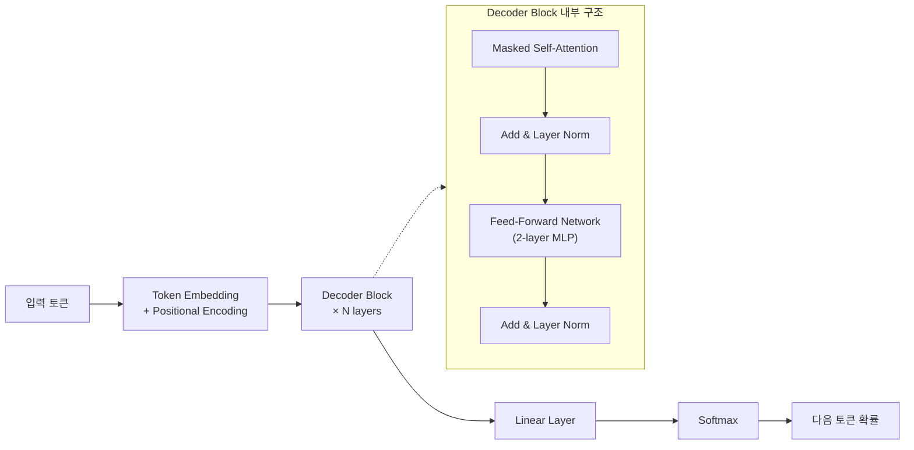
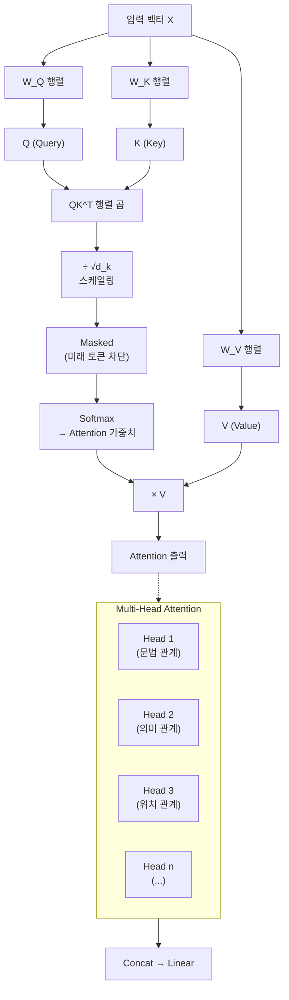
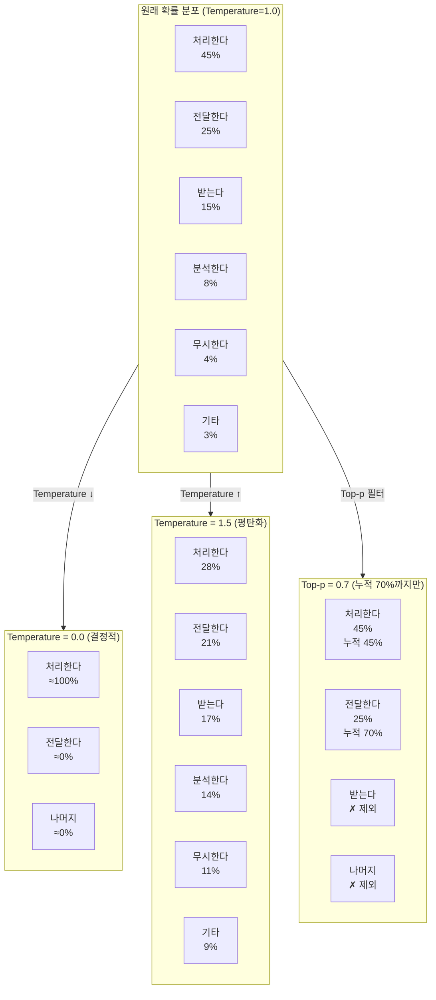
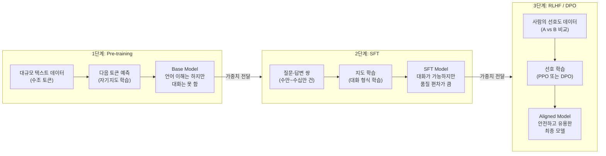

# LLM 동작 원리와 프로덕션 통합

## 1. LLM이란

LLM은 **Large Language Model**의 약자다. 대규모 텍스트 데이터를 학습해서 자연어를 이해하고 생성하는 딥러닝 모델을 말한다. GPT-4, Claude, Gemini 같은 모델이 여기에 해당한다.

핵심은 "다음에 올 토큰(단어 조각)의 확률을 예측하는 것"이다. 입력 텍스트를 받아서, 그 뒤에 올 가능성이 가장 높은 토큰을 하나씩 생성해 나간다. 단순한 원리지만, 모델의 규모가 커지면서 번역, 요약, 코드 생성, 질의응답 등 다양한 작업을 하나의 모델로 처리할 수 있게 됐다.

### 1.1 기존 ML 모델과 뭐가 다른가

전통적인 ML 모델은 **특정 작업 하나**를 위해 학습한다. 스팸 분류기는 스팸만 분류하고, 감성 분석기는 감성만 분석한다. 각 작업마다 별도의 모델을 만들고, 별도의 데이터셋으로 학습해야 한다.

LLM은 접근 방식이 다르다:

| 구분 | 전통 ML 모델 | LLM |
|------|-------------|-----|
| 학습 방식 | 작업별 레이블 데이터로 지도 학습 | 대규모 텍스트로 사전 학습 후 미세 조정 |
| 작업 범위 | 하나의 모델 = 하나의 작업 | 하나의 모델로 여러 작업 수행 |
| 새 작업 적용 | 새 데이터 + 새 모델 학습 필요 | 프롬프트만 바꾸면 됨 (few-shot, zero-shot) |
| 파라미터 규모 | 수만~수백만 | 수십억~수조 |
| 입력 형태 | 구조화된 피처 또는 짧은 텍스트 | 자유 형식 자연어 |

실무에서 체감되는 가장 큰 차이는 **별도 학습 없이 프롬프트로 작업을 지시할 수 있다**는 점이다. 분류, 추출, 변환 같은 작업을 모델 재학습 없이 API 호출 한 번으로 처리할 수 있다.

### 1.2 왜 "Large"인가

"Large"는 모델의 파라미터 수를 가리킨다. 파라미터는 모델이 학습 과정에서 조정하는 가중치 값이고, 이 수가 많을수록 더 복잡한 패턴을 학습할 수 있다.

파라미터 규모에 따른 실제 차이:

| 규모 | 파라미터 수 | 대표 모델 | 특성 |
|------|-----------|----------|------|
| Small | 1B 이하 | DistilBERT, TinyLlama | 분류·감성 분석 같은 단일 작업에 적합. 노트북에서도 돌린다 |
| Medium | 1B~10B | Llama 3 8B, Mistral 7B | 요약·번역 정도는 쓸 만하다. 단일 GPU로 추론 가능 |
| Large | 10B~100B | Llama 3 70B, Claude 3 Haiku | 코드 생성, 복잡한 추론이 가능해진다. 멀티 GPU 필요 |
| Frontier | 100B 이상 | GPT-4, Claude 3.5, Gemini Ultra | 범용 추론, 복잡한 멀티스텝 작업 처리. 대규모 클러스터 필요 |

2020년에 OpenAI가 발표한 **스케일링 법칙(Scaling Laws)** 논문에서 흥미로운 발견이 있었다. 파라미터 수, 데이터 양, 연산량을 함께 늘리면 모델 성능이 예측 가능한 패턴으로 향상된다는 것이다. 이후 각 기업이 모델 크기를 경쟁적으로 키우는 흐름이 시작됐다.

다만 파라미터가 크다고 무조건 좋은 건 아니다. 학습 데이터의 품질, 학습 방법(RLHF, DPO 등), 추론 시 최적화 수준이 모두 영향을 준다. 파라미터 수가 적어도 고품질 데이터로 잘 학습한 모델이 더 큰 모델을 이기는 경우가 있다.

### 1.3 언어 모델의 계보

LLM이 갑자기 나온 게 아니다. 언어 모델은 수십 년에 걸쳐 발전해 왔고, 각 단계마다 이전 방식의 한계를 극복하며 진화했다.

**n-gram 모델 (1990년대~)**

가장 초기의 통계적 언어 모델이다. 직전 n-1개의 단어를 보고 다음 단어를 예측한다.

```
bigram (n=2):  P("처리한다" | "요청을")
trigram (n=3): P("처리한다" | "서버가", "요청을")
```

n이 커지면 정확도는 올라가지만, 조합 수가 기하급수적으로 늘어서 메모리가 감당이 안 된다. 5-gram 정도가 실용적인 한계였다. 긴 문맥을 전혀 반영하지 못하는 게 근본적인 문제다.

**RNN (2010년대 초)**

순환 신경망은 이전 단어들의 정보를 **hidden state**에 누적해서 전달하는 구조다. 이론적으로는 임의의 길이의 문맥을 처리할 수 있지만, 실제로는 시퀀스가 길어지면 앞쪽 정보가 사라지는 **기울기 소실(vanishing gradient)** 문제가 생긴다. 10~20 단어 정도가 지나면 초반 문맥을 거의 기억하지 못한다.

**LSTM / GRU (2014년~)**

RNN의 기울기 소실 문제를 완화하기 위해 **게이트(gate)** 구조를 도입했다. 어떤 정보를 기억하고 어떤 정보를 버릴지 학습한다. RNN보다 긴 문맥을 다룰 수 있게 됐고, 기계 번역이나 음성 인식에서 큰 성과를 냈다. 하지만 여전히 수백 토큰 수준의 긴 문맥에서는 한계가 있었고, **순차 처리** 구조라서 병렬화가 안 돼 학습 속도가 느렸다.

**Transformer (2017년~)**

"Attention Is All You Need" 논문에서 제안된 구조다. 이전 방식들과의 결정적 차이:

- **Self-Attention**으로 시퀀스 내 모든 위치 간의 관계를 한 번에 계산한다. 100번째 토큰이 1번째 토큰을 직접 참조할 수 있다.
- **병렬 처리**가 가능하다. RNN처럼 순서대로 처리할 필요가 없어서 GPU를 활용한 대규모 학습이 가능해졌다.
- **스케일링**이 된다. 모델과 데이터를 키울수록 성능이 계속 올라간다. 이전 구조들은 일정 규모 이상에서 성능 향상이 둔화됐다.

이 세 가지가 맞물리면서 수십억~수조 파라미터 규모의 모델 학습이 현실적으로 가능해졌고, 그 결과물이 지금의 LLM이다.

---

## 2. Transformer 아키텍처

현재 LLM은 거의 다 Transformer 기반이다. 2017년 구글의 "Attention Is All You Need" 논문에서 시작했고, GPT·Claude·Gemini 모두 이 구조를 사용한다.

### 2.1 핵심 구조

Transformer는 **인코더-디코더** 구조지만, 현재 대부분의 LLM은 **디코더 전용(Decoder-only)** 구조를 사용한다.



각 Decoder Block은 Masked Self-Attention과 Feed-Forward Network, 그리고 잔차 연결(residual connection)과 Layer Normalization으로 구성된다. 입력이 Attention을 거친 뒤 원래 입력과 더해지고(Add), 정규화(Norm)를 거치는 과정이 반복된다. 이 블록이 수십~수백 개 쌓여 있다. GPT-4 급 모델은 100개 이상의 레이어를 가진 것으로 알려져 있다.

### 2.2 Self-Attention 메커니즘

Self-Attention은 입력 시퀀스의 각 토큰이 다른 모든 토큰과의 관련도를 계산하는 방식이다.

```
Query(Q), Key(K), Value(V) 세 벡터를 계산:

Attention(Q, K, V) = softmax(QK^T / √d_k) × V
```

- **Q(Query)**: "이 토큰이 무엇을 찾는가"
- **K(Key)**: "이 토큰이 무엇을 제공하는가"
- **V(Value)**: "실제 전달할 정보"
- **√d_k**: 스케일링 팩터. 이걸 안 나누면 softmax가 극단적인 값으로 수렴해서 학습이 안 된다.

```
"서버가 요청을 처리한다"라는 문장에서:

"처리한다"의 Attention 가중치:
  서버가  → 0.35  (주어, 높은 관련도)
  요청을  → 0.45  (목적어, 가장 높은 관련도)
  처리한다 → 0.20  (자기 자신)
```

**Multi-Head Attention**은 이 과정을 여러 번 병렬로 수행한다. 각 head가 다른 관점에서 관계를 포착한다. 한 head는 문법적 관계를, 다른 head는 의미적 관계를 학습하는 식이다.



위 흐름이 Self-Attention의 전체 연산 과정이다. 입력 벡터에서 Q, K, V를 각각 만들고, Q와 K의 유사도를 구해 가중치로 사용한다. Decoder에서는 Mask를 적용해서 아직 생성하지 않은 미래 토큰을 참조하지 못하게 막는다. Multi-Head는 이 과정을 여러 head가 병렬로 수행한 뒤 결과를 합치는 구조다.

### 2.3 컨텍스트 윈도우와 KV Cache

Attention 연산은 시퀀스 길이의 제곱에 비례하는 연산량이 든다. 토큰이 1000개면 1,000,000번의 유사도 계산이 필요하다. 이게 컨텍스트 윈도우에 제한이 있는 근본적인 이유다.

**KV Cache**: LLM이 토큰을 하나씩 생성할 때, 이전 토큰들의 Key/Value를 매번 다시 계산하면 낭비다. 그래서 이전 토큰의 K, V 값을 메모리에 캐싱해두고 재사용한다. 프로덕션에서 GPU 메모리를 많이 차지하는 주범이 바로 이 KV Cache다.

---

## 3. 토크나이저

LLM은 텍스트를 직접 이해하지 못한다. 텍스트를 **토큰**(정수 ID)으로 변환해야 하고, 이 변환을 토크나이저가 담당한다.

### 3.1 BPE (Byte Pair Encoding)

GPT 계열이 사용하는 방식이다. OpenAI의 `tiktoken` 라이브러리로 직접 확인할 수 있다.

```python
import tiktoken

enc = tiktoken.encoding_for_model("gpt-4")
tokens = enc.encode("서버가 요청을 처리한다")
print(tokens)       # [12345, 67890, ...]  정수 배열
print(len(tokens))  # 토큰 수 = 비용 산정 기준
```

BPE의 동작 방식:
1. 모든 텍스트를 바이트 단위로 쪼갠다
2. 가장 자주 등장하는 바이트 쌍을 하나의 토큰으로 합친다
3. 이 과정을 반복해서 어휘 사전을 만든다

영어는 한 단어가 1~2토큰이지만, 한국어는 3~5토큰이 되는 경우가 많다. API 비용을 계산할 때 이 차이를 반드시 고려해야 한다.


BPE는 학습 단계에서 대규모 텍스트 코퍼스의 바이트 쌍 빈도를 기반으로 어휘 사전(vocab)을 미리 구성한다. 이 어휘 사전의 크기가 토큰화 결과를 결정하고, 영어 중심 코퍼스로 학습한 사전은 한국어를 더 잘게 쪼개게 된다.

### 3.2 SentencePiece

구글 계열(Gemini, T5) 모델이 주로 사용한다. BPE와의 차이:

| 항목 | BPE (tiktoken) | SentencePiece |
|------|----------------|---------------|
| 입력 단위 | UTF-8 바이트 | 유니코드 문자 |
| 공백 처리 | 별도 토큰 | `▁`로 표시 |
| 한국어 효율 | 상대적으로 낮음 | 상대적으로 높음 |
| 대표 모델 | GPT-4, Claude | Gemini, Llama |

### 3.3 실무에서 토크나이저가 중요한 이유

- **비용**: API 과금 단위가 토큰이다. 같은 한국어 텍스트도 모델에 따라 토큰 수가 2배 이상 차이 난다.
- **컨텍스트 제한**: 128K 컨텍스트라고 해도, 한국어는 영어 대비 같은 글자 수에 더 많은 토큰을 소비한다.
- **프롬프트 설계**: 시스템 프롬프트가 너무 길면 실제 대화에 쓸 수 있는 토큰이 줄어든다.

```python
# 토큰 수 미리 계산해서 컨텍스트 초과를 방지하는 패턴
def trim_to_token_limit(text: str, max_tokens: int, model: str = "gpt-4") -> str:
    enc = tiktoken.encoding_for_model(model)
    tokens = enc.encode(text)
    if len(tokens) <= max_tokens:
        return text
    return enc.decode(tokens[:max_tokens])
```

---

## 4. 추론 파라미터

API 호출 시 설정하는 파라미터들이 출력 품질에 직접 영향을 준다. 대충 기본값으로 두면 원하는 결과가 안 나오는 경우가 많다.

### 4.1 Temperature

0.0~2.0 사이 값. 다음 토큰을 선택할 때의 확률 분포를 조절한다.

```
Temperature = 0.0 → 항상 확률이 가장 높은 토큰 선택 (결정적)
Temperature = 1.0 → 원래 확률 분포 그대로 샘플링
Temperature = 2.0 → 확률 분포를 평탄하게 만들어서 다양한 토큰이 선택됨
```

실무 기준:
- **코드 생성, 데이터 추출, 분류**: `0.0~0.3` — 일관된 결과가 필요하다
- **일반 대화, 요약**: `0.5~0.7` — 적당한 다양성
- **창작, 브레인스토밍**: `0.8~1.2` — 다양한 응답

### 4.2 Top-p (Nucleus Sampling)

확률 상위 p%에 해당하는 토큰들 중에서만 샘플링한다.

```
Top-p = 0.1 → 확률 상위 10%에 해당하는 토큰들만 후보
Top-p = 0.9 → 확률 상위 90%까지 후보 (대부분의 토큰 포함)
Top-p = 1.0 → 모든 토큰이 후보 (필터링 없음)
```

Temperature와 Top-p를 동시에 낮추면 출력이 너무 제한적이 되고, 둘 다 높이면 횡설수설하는 결과가 나온다. 보통 하나만 조절하고 다른 하나는 기본값으로 두는 게 낫다.

아래 다이어그램은 "서버가 요청을 ___" 다음 토큰을 선택하는 상황에서, Temperature와 Top-p 설정에 따라 후보 토큰의 확률 분포가 어떻게 바뀌는지 보여준다.



Temperature는 확률 분포의 뾰족함을 조절한다. 낮추면 1등 토큰에 확률이 집중되고, 높이면 분포가 고르게 퍼진다. Top-p는 분포 모양은 건드리지 않고, 누적 확률 기준으로 하위 토큰들을 후보에서 잘라내는 방식이다.

### 4.3 Max Tokens / Stop Sequences

```python
response = client.chat.completions.create(
    model="gpt-4",
    messages=[{"role": "user", "content": "서버 상태를 JSON으로 알려줘"}],
    temperature=0.0,
    max_tokens=500,          # 응답 최대 길이 제한
    stop=["\n\n", "---"],    # 이 문자열을 만나면 생성 중단
)
```

`max_tokens`를 설정하지 않으면 모델이 토큰 제한까지 계속 생성하면서 비용이 불필요하게 올라간다. 용도에 맞게 항상 설정해야 한다.

### 4.4 Frequency Penalty / Presence Penalty

같은 단어가 반복되는 문제를 제어한다.

- **Frequency Penalty**: 이미 등장한 토큰의 등장 횟수에 비례해서 확률을 낮춘다. 반복이 심한 출력에 적용한다.
- **Presence Penalty**: 이미 등장한 토큰이면 횟수와 무관하게 확률을 낮춘다. 다양한 주제를 언급하게 하고 싶을 때 쓴다.

---

## 5. Function Calling / Tool Use

LLM이 외부 함수를 호출할 수 있게 하는 패턴이다. LLM 자체가 함수를 실행하는 게 아니라, "이 함수를 이 인자로 호출하라"는 JSON을 생성하는 것이다. 실제 실행은 백엔드가 담당한다.

### 5.1 동작 흐름

```
사용자: "서울 날씨 알려줘"
    ↓
LLM: { "function": "get_weather", "arguments": { "city": "Seoul" } }  ← 함수 호출 결정
    ↓
백엔드: get_weather("Seoul") 실행 → { "temp": 15, "condition": "맑음" }
    ↓
LLM: "서울은 현재 15도이고 맑습니다."  ← 결과를 자연어로 변환
```

### 5.2 OpenAI 스타일 구현

```python
import openai
import json

tools = [
    {
        "type": "function",
        "function": {
            "name": "get_order_status",
            "description": "주문 ID로 현재 배송 상태를 조회한다",
            "parameters": {
                "type": "object",
                "properties": {
                    "order_id": {
                        "type": "string",
                        "description": "주문번호 (예: ORD-12345)"
                    }
                },
                "required": ["order_id"]
            }
        }
    }
]

response = client.chat.completions.create(
    model="gpt-4",
    messages=[{"role": "user", "content": "ORD-12345 배송 어디까지 왔어?"}],
    tools=tools,
    tool_choice="auto",  # 모델이 알아서 호출 여부 판단
)

# 모델이 함수 호출을 결정한 경우
if response.choices[0].message.tool_calls:
    tool_call = response.choices[0].message.tool_calls[0]
    args = json.loads(tool_call.function.arguments)

    # 실제 함수 실행
    result = get_order_status(args["order_id"])

    # 결과를 다시 모델에 전달
    messages.append(response.choices[0].message)
    messages.append({
        "role": "tool",
        "tool_call_id": tool_call.id,
        "content": json.dumps(result)
    })

    # 최종 응답 생성
    final_response = client.chat.completions.create(
        model="gpt-4",
        messages=messages,
        tools=tools,
    )
```

### 5.3 Anthropic(Claude) 스타일 구현

```python
import anthropic

client = anthropic.Anthropic()

tools = [
    {
        "name": "get_order_status",
        "description": "주문 ID로 현재 배송 상태를 조회한다",
        "input_schema": {
            "type": "object",
            "properties": {
                "order_id": {
                    "type": "string",
                    "description": "주문번호 (예: ORD-12345)"
                }
            },
            "required": ["order_id"]
        }
    }
]

response = client.messages.create(
    model="claude-sonnet-4-6-20250514",
    max_tokens=1024,
    tools=tools,
    messages=[{"role": "user", "content": "ORD-12345 배송 어디까지 왔어?"}]
)

# stop_reason이 "tool_use"인 경우 함수 호출 처리
for block in response.content:
    if block.type == "tool_use":
        result = get_order_status(block.input["order_id"])

        # tool_result로 응답
        messages.append({"role": "assistant", "content": response.content})
        messages.append({
            "role": "user",
            "content": [{
                "type": "tool_result",
                "tool_use_id": block.id,
                "content": json.dumps(result)
            }]
        })
```

### 5.4 주의사항

- **함수 설명(description)이 품질을 결정한다.** 모델은 description을 보고 어떤 함수를 호출할지 판단한다. 모호하게 쓰면 잘못된 함수를 호출하거나 아예 호출하지 않는다.
- **파라미터 검증은 반드시 백엔드에서 해야 한다.** 모델이 생성한 JSON의 인자값을 그대로 신뢰하면 안 된다. SQL Injection이나 경로 조작 같은 공격이 가능하다.
- **tool_choice="auto"**를 쓰면 모델이 판단하고, `"required"`로 설정하면 반드시 함수를 호출한다. 특정 작업 흐름에서는 `"required"`가 더 안정적이다.
- **병렬 호출**: 모델이 여러 함수를 한 번에 호출하는 경우가 있다. `tool_calls` 배열에 여러 항목이 들어오므로, 순차 처리가 아닌 병렬 처리를 해야 응답이 빨라진다.

---

## 6. Structured Output (JSON Mode)

LLM 응답을 JSON 등 정해진 형식으로 받아야 하는 경우가 많다. 프롬프트에 "JSON으로 답해줘"라고 쓰는 것만으로는 형식이 보장되지 않는다.

### 6.1 JSON Mode

```python
# OpenAI JSON Mode
response = client.chat.completions.create(
    model="gpt-4",
    messages=[
        {"role": "system", "content": "응답을 JSON 형식으로 출력한다."},
        {"role": "user", "content": "서버 상태를 알려줘"}
    ],
    response_format={"type": "json_object"}
)

result = json.loads(response.choices[0].message.content)
```

JSON Mode는 출력이 유효한 JSON이라는 것만 보장한다. 특정 스키마를 따르는지는 보장하지 않는다.

### 6.2 Structured Outputs (스키마 강제)

OpenAI의 Structured Outputs는 JSON Schema를 지정하면 모델이 그 스키마를 정확히 따르게 한다.

```python
from pydantic import BaseModel

class ServerStatus(BaseModel):
    hostname: str
    cpu_usage: float
    memory_usage: float
    status: str  # "healthy" | "warning" | "critical"

response = client.beta.chat.completions.parse(
    model="gpt-4o",
    messages=[{"role": "user", "content": "서버 상태를 분석해줘: CPU 78%, 메모리 92%"}],
    response_format=ServerStatus,
)

status = response.choices[0].message.parsed  # ServerStatus 객체
print(status.cpu_usage)   # 78.0
print(status.status)      # "warning"
```

### 6.3 파싱 실패 처리

Structured Output을 쓰더라도 파싱이 실패하는 경우가 있다. `max_tokens`에 도달해서 JSON이 잘리거나, 모델이 거부(refusal)하는 경우다.

```python
response = client.beta.chat.completions.parse(
    model="gpt-4o",
    messages=messages,
    response_format=ServerStatus,
)

message = response.choices[0].message

if message.refusal:
    # 모델이 응답을 거부한 경우
    log.warning(f"모델 거부: {message.refusal}")
    return fallback_response()

if message.parsed is None:
    # max_tokens 도달 등으로 파싱 실패
    log.error("JSON 파싱 실패, 원본 텍스트 확인 필요")
    return fallback_response()

return message.parsed
```

---

## 7. 멀티 프로바이더 Fallback 패턴

프로덕션에서 단일 LLM 프로바이더에만 의존하면 장애 시 서비스 전체가 멈춘다. 여러 프로바이더를 두고 fallback 하는 구조가 필요하다.

### 7.1 기본 Fallback 구조

```python
from dataclasses import dataclass
from typing import Optional
import time
import logging

log = logging.getLogger(__name__)

@dataclass
class LLMProvider:
    name: str
    client: object
    model: str
    timeout: float = 30.0
    is_healthy: bool = True
    last_failure: float = 0.0
    cooldown: float = 60.0  # 실패 후 재시도까지 대기 시간

class MultiProviderLLM:
    def __init__(self, providers: list[LLMProvider]):
        self.providers = providers

    def _is_available(self, provider: LLMProvider) -> bool:
        if provider.is_healthy:
            return True
        # cooldown 시간이 지나면 다시 시도
        return time.time() - provider.last_failure > provider.cooldown

    def chat(self, messages: list[dict], **kwargs) -> Optional[str]:
        errors = []

        for provider in self.providers:
            if not self._is_available(provider):
                continue

            try:
                response = provider.client.chat.completions.create(
                    model=provider.model,
                    messages=messages,
                    timeout=provider.timeout,
                    **kwargs,
                )
                provider.is_healthy = True
                return response.choices[0].message.content

            except Exception as e:
                provider.is_healthy = False
                provider.last_failure = time.time()
                errors.append((provider.name, str(e)))
                log.warning(f"{provider.name} 실패: {e}, 다음 프로바이더로 전환")

        log.error(f"모든 프로바이더 실패: {errors}")
        raise RuntimeError(f"모든 LLM 프로바이더 응답 불가: {errors}")
```

### 7.2 프로바이더 간 호환 주의사항

프로바이더마다 API 형식이 미묘하게 다르다.

- **시스템 메시지**: OpenAI는 `role: "system"`, Anthropic은 `system` 파라미터로 별도 전달
- **Tool 스키마**: OpenAI는 `parameters`, Anthropic은 `input_schema`
- **응답 형식**: `choices[0].message.content` vs `content[0].text`
- **스트리밍**: 이벤트 형식과 종료 조건이 다르다

LiteLLM 같은 프록시 라이브러리를 쓰면 이런 차이를 추상화할 수 있지만, 프로바이더별 고유 기능(Structured Outputs 등)을 쓸 때는 결국 분기 처리가 필요하다.

---

## 8. 비용 모니터링과 레이턴시 관리

### 8.1 비용 구조

LLM API 비용은 입력 토큰과 출력 토큰 단위로 과금된다. 출력 토큰이 입력보다 3~5배 비싸다.

```
비용 계산 예시 (GPT-4o 기준, 2026년 초):
- 입력: $2.50 / 1M tokens
- 출력: $10.00 / 1M tokens

하루 10,000건 요청, 평균 입력 500토큰 / 출력 200토큰이면:
  입력: 10,000 × 500 = 5M tokens → $12.50
  출력: 10,000 × 200 = 2M tokens → $20.00
  일일 비용: $32.50 → 월 약 $975
```

### 8.2 비용 절감 방법

**프롬프트 캐싱**: 같은 시스템 프롬프트를 반복 전송하면 캐싱 할인이 적용된다. Anthropic의 경우 캐시 히트 시 입력 비용이 90% 감소한다.

**모델 라우팅**: 모든 요청을 비싼 모델로 보내지 않는다.

```python
def select_model(task_type: str) -> str:
    """작업 복잡도에 따라 모델을 선택한다"""
    routing = {
        "classification": "gpt-4o-mini",     # 단순 분류 → 저렴한 모델
        "extraction": "gpt-4o-mini",          # 데이터 추출 → 저렴한 모델
        "code_generation": "gpt-4o",          # 코드 생성 → 중간 모델
        "complex_reasoning": "claude-opus-4-6-20250514",  # 복잡한 추론 → 고성능 모델
    }
    return routing.get(task_type, "gpt-4o-mini")
```

**배치 API**: 실시간 응답이 필요 없는 작업(로그 분석, 데이터 라벨링 등)은 배치 API를 쓴다. OpenAI 배치 API는 50% 할인이 적용된다.

### 8.3 레이턴시 관리

LLM API 응답 시간은 출력 토큰 수에 비례한다. 첫 토큰까지의 시간(TTFT, Time To First Token)과 전체 응답 시간을 구분해서 측정해야 한다.

```python
import time

class LLMMetrics:
    def __init__(self):
        self.metrics = []

    def timed_request(self, client, **kwargs):
        start = time.monotonic()
        first_token_time = None

        # 스트리밍으로 TTFT 측정
        stream = client.chat.completions.create(**kwargs, stream=True)
        chunks = []

        for chunk in stream:
            if first_token_time is None and chunk.choices[0].delta.content:
                first_token_time = time.monotonic() - start

            if chunk.choices[0].delta.content:
                chunks.append(chunk.choices[0].delta.content)

        total_time = time.monotonic() - start
        content = "".join(chunks)

        self.metrics.append({
            "ttft": first_token_time,
            "total_time": total_time,
            "output_tokens": len(content.split()),  # 대략적인 추정
            "model": kwargs.get("model"),
        })

        return content
```

**레이턴시를 줄이는 방법**:
- `max_tokens`를 용도에 맞게 제한한다
- 스트리밍을 사용해서 사용자에게 점진적으로 응답을 보여준다
- 간단한 작업에는 작은 모델을 쓴다 (모델 라우팅)
- 프롬프트 길이를 줄인다 — 긴 시스템 프롬프트는 TTFT를 느리게 한다

---

## 9. 로컬 LLM 셀프호스팅

외부 API로 데이터를 보낼 수 없는 환경(금융, 의료, 군사 등)이거나, API 비용을 줄이고 싶은 경우 로컬에서 LLM을 직접 운영한다.

### 9.1 Ollama

개발 환경이나 소규모 서비스에서 가장 접근하기 쉬운 방법이다.

```bash
# 설치 후 모델 다운로드
ollama pull llama3.1:8b

# 서버 실행 (기본 포트 11434)
ollama serve

# API 호출 (OpenAI 호환)
curl http://localhost:11434/v1/chat/completions \
  -H "Content-Type: application/json" \
  -d '{
    "model": "llama3.1:8b",
    "messages": [{"role": "user", "content": "Hello"}]
  }'
```

Ollama는 OpenAI 호환 API를 제공하므로, 기존 OpenAI SDK 코드에서 `base_url`만 바꾸면 된다.

```python
from openai import OpenAI

# Ollama 로컬 서버에 연결
client = OpenAI(base_url="http://localhost:11434/v1", api_key="unused")

response = client.chat.completions.create(
    model="llama3.1:8b",
    messages=[{"role": "user", "content": "서버 로그 분석해줘"}],
)
```

### 9.2 vLLM

프로덕션 수준의 처리량이 필요하면 vLLM을 쓴다. 핵심 기능은 **PagedAttention**으로, KV Cache를 페이징 방식으로 관리해서 GPU 메모리를 훨씬 효율적으로 쓴다.

```bash
# vLLM 서버 실행
python -m vllm.entrypoints.openai.api_server \
  --model meta-llama/Llama-3.1-8B-Instruct \
  --host 0.0.0.0 \
  --port 8000 \
  --tensor-parallel-size 2  # GPU 2장 병렬
```

Ollama vs vLLM 선택 기준:

| 항목 | Ollama | vLLM |
|------|--------|------|
| 용도 | 개발, 테스트, 소규모 서비스 | 프로덕션, 대규모 트래픽 |
| 설정 난이도 | 쉬움 (설치 후 바로 사용) | 중간 (Python 환경, GPU 설정 필요) |
| 동시 요청 처리 | 제한적 | Continuous Batching으로 높은 처리량 |
| GPU 메모리 효율 | 보통 | PagedAttention으로 높음 |
| 모델 관리 | 내장 (ollama pull) | HuggingFace에서 직접 다운로드 |

### 9.3 셀프호스팅 시 고려사항

**GPU 메모리 계산**: 모델 파라미터 수 × 2바이트(FP16 기준)가 최소 필요 메모리다. 8B 모델이면 약 16GB, 70B 모델이면 약 140GB가 필요하다. 여기에 KV Cache와 오버헤드를 더하면 실제로는 20~30% 더 필요하다.

```
모델 크기별 필요 GPU:
  7~8B   → GPU 1장 (24GB, RTX 4090 또는 A10G)
  13~14B → GPU 1장 (40GB, A100 40GB)
  70B    → GPU 2~4장 (A100 80GB × 2)
  405B   → GPU 8장 이상 (H100 × 8)
```

**양자화(Quantization)**: 모델 가중치를 FP16에서 INT8이나 INT4로 줄이면 메모리 사용량이 반~1/4로 줄어든다. 품질 저하가 있지만, 8B 모델의 INT4 양자화는 실용적인 수준이다. GGUF 포맷(llama.cpp)이나 AWQ, GPTQ 포맷을 많이 사용한다.

**네트워크 구성**: 로컬 LLM은 내부 네트워크에서만 접근하게 한다. 외부에 노출하면 무제한 추론 요청이 들어올 수 있고, GPU 리소스를 전부 소진당할 수 있다. Rate limiting과 인증은 반드시 적용해야 한다.

---

## 10. LLM 학습 파이프라인

LLM이 어떻게 만들어지는지 이해하면, 모델의 한계와 특성을 예측할 수 있다. 학습은 크게 세 단계로 나뉜다.



각 단계에서 모델의 성격이 바뀐다. Pre-training은 "언어를 아는 상태", SFT는 "대화할 줄 아는 상태", RLHF/DPO는 "좋은 답변을 구분하는 상태"가 된다. 단계별로 필요한 데이터의 양과 성격이 완전히 다르다.

### 10.1 Pre-training (사전 학습)

인터넷에서 수집한 대규모 텍스트 데이터로 "다음 토큰 예측" 과제를 학습하는 단계다. GPT-4 급 모델은 수조(trillion) 토큰 규모의 데이터를 수천 장의 GPU로 수개월간 학습한다.

```
학습 목표: 주어진 토큰 시퀀스 [t1, t2, ..., tn]에서 다음 토큰 t(n+1)의 확률을 최대화

Loss = -Σ log P(t_i | t_1, ..., t_{i-1})
```

이 단계에서 모델은 문법, 사실 관계, 추론 패턴 등을 학습한다. 다만 이 상태의 모델은 대화 형태로 응답하지 못한다. "서울의 수도는?"이라고 물으면 "서울의 수도는? 부산의 수도는? 대전의..."처럼 비슷한 패턴의 텍스트를 계속 이어 생성한다.

사전 학습 데이터의 품질이 모델 성능을 결정하는 가장 큰 요소다. 대부분의 LLM 회사들이 데이터 수집과 필터링에 가장 많은 리소스를 투입하는 이유가 여기에 있다.

**데이터 구성의 현실**:

- Common Crawl 같은 웹 크롤링 데이터가 주를 이루지만, 필터링 없이 쓰면 품질이 처참하다
- 코드 데이터(GitHub 등)를 섞으면 추론 능력이 향상되는 것으로 알려져 있다
- 한국어 데이터 비율이 전체의 1~3% 수준인 모델이 대부분이다. 한국어 성능이 영어보다 떨어지는 근본적인 이유다

### 10.2 SFT (Supervised Fine-Tuning)

사전 학습된 모델에 사람이 작성한 질문-답변 쌍을 학습시키는 단계다. 이 과정을 거쳐야 모델이 "질문을 받으면 답변을 한다"는 대화 형식을 이해하게 된다.

```
SFT 데이터 예시:

[질문] Python에서 리스트를 역순으로 정렬하려면?
[답변] sorted(my_list, reverse=True)를 사용하거나, my_list.sort(reverse=True)로
      원본 리스트를 직접 정렬할 수 있다. sorted()는 새 리스트를 반환하고,
      sort()는 원본을 변경한다는 차이가 있다.
```

SFT 데이터는 보통 수만~수십만 건이다. 사전 학습 데이터의 수조 토큰과 비교하면 양이 훨씬 적지만, 모델의 응답 스타일을 결정하는 중요한 단계다.

SFT만으로도 꽤 쓸만한 모델이 나온다. 하지만 "어떤 답변이 더 좋은지" 판단하는 능력은 부족하다. 사실과 다른 내용을 자신 있게 말하거나, 유해한 내용을 거부하지 못하는 경우가 생긴다.

### 10.3 RLHF (Reinforcement Learning from Human Feedback)

사람의 선호도를 모델에 반영하는 단계다. 핵심 아이디어는 "사람이 좋다고 평가한 답변을 더 많이 생성하도록 학습"하는 것이다.

**과정**:

1. **보상 모델(Reward Model) 학습**: 같은 질문에 대한 두 개의 답변을 사람에게 보여주고, 어느 쪽이 더 나은지 선택하게 한다. 이 선호도 데이터로 보상 모델을 학습시킨다.
2. **PPO 최적화**: 보상 모델의 점수를 높이는 방향으로 LLM을 업데이트한다. 이때 원래 모델과 너무 달라지지 않도록 KL divergence 페널티를 건다.

```
RLHF 흐름:

프롬프트 → LLM 응답 생성 → 보상 모델 점수 매김 → PPO로 LLM 업데이트
                                                     │
                                              KL 페널티 (원래 모델과
                                              너무 달라지면 제동)
```

RLHF는 구현이 복잡하고 학습이 불안정하다. 보상 모델 자체가 편향되면 LLM도 같이 편향되는 문제가 있다. 보상 해킹(reward hacking) — 보상 모델의 점수만 높이고 실제 품질은 떨어지는 현상 — 도 흔하게 발생한다.

### 10.4 DPO (Direct Preference Optimization)

RLHF의 복잡한 파이프라인을 단순화한 방법이다. 보상 모델을 별도로 학습시키지 않고, 선호도 데이터에서 직접 LLM을 업데이트한다.

```
DPO 데이터 형태:

prompt: "Python에서 파일 읽기"
chosen: "with open('file.txt', 'r') as f: ..."  ← 선호 답변
rejected: "f = open('file.txt') ..."             ← 비선호 답변
```

DPO는 RLHF보다 구현이 간단하고 학습이 안정적이다. 최근 공개된 모델들(Llama 3, Mistral 등) 대부분이 DPO나 그 변형을 사용한다. 다만 선호도 데이터의 품질에 크게 의존하기 때문에, 데이터 구축에 신경을 써야 한다.

---

## 11. 임베딩과 벡터 표현

LLM의 내부에서는 모든 것이 벡터(숫자 배열)로 표현된다. 텍스트를 벡터로 변환하는 과정을 임베딩이라 하고, 이 벡터를 활용하면 의미 기반 검색, 유사도 계산, 클러스터링 등이 가능해진다.

### 11.1 임베딩이 하는 일

토크나이저가 텍스트를 정수 ID로 변환하면, 임베딩 레이어가 이 ID를 고차원 벡터로 바꾼다. GPT-4 급 모델은 각 토큰을 수천 차원의 벡터로 표현한다.

```
"서버" → 토큰 ID 12345 → [0.12, -0.34, 0.56, ..., 0.78]  (d차원 벡터)
```

의미가 비슷한 단어는 벡터 공간에서 가까운 위치에 놓인다. "서버"와 "호스트"의 벡터 거리는 "서버"와 "바나나"의 거리보다 가깝다.

### 11.2 임베딩 API 사용

문장 단위의 임베딩을 생성해서 검색이나 유사도 계산에 사용하는 방식이다. RAG 파이프라인의 핵심 구성 요소이기도 하다.

```python
from openai import OpenAI

client = OpenAI()

def get_embedding(text: str, model: str = "text-embedding-3-small") -> list[float]:
    response = client.embeddings.create(
        input=text,
        model=model,
    )
    return response.data[0].embedding

# 두 문장의 유사도 비교
import numpy as np

def cosine_similarity(a: list[float], b: list[float]) -> float:
    a, b = np.array(a), np.array(b)
    return np.dot(a, b) / (np.linalg.norm(a) * np.linalg.norm(b))

emb1 = get_embedding("서버 배포 프로세스")
emb2 = get_embedding("애플리케이션 릴리즈 절차")
emb3 = get_embedding("오늘 점심 메뉴")

print(cosine_similarity(emb1, emb2))  # 0.85+ (의미적으로 유사)
print(cosine_similarity(emb1, emb3))  # 0.2~  (관련 없음)
```

### 11.3 벡터 DB와 연동

임베딩을 저장하고 유사도 검색을 수행하려면 벡터 데이터베이스가 필요하다. 문서 수천 건까지는 numpy로 직접 계산해도 되지만, 수만 건 이상이면 전용 벡터 DB를 써야 한다.

```python
# ChromaDB 예시 (가벼운 벡터 DB)
import chromadb

client = chromadb.PersistentClient(path="./chroma_db")
collection = client.get_or_create_collection("docs")

# 문서 저장
collection.add(
    documents=["쿠버네티스 파드 스케줄링", "도커 컨테이너 네트워크 설정", "AWS IAM 정책 관리"],
    ids=["doc1", "doc2", "doc3"],
)

# 유사 문서 검색
results = collection.query(
    query_texts=["컨테이너 오케스트레이션"],
    n_results=2,
)
print(results["documents"])  # 쿠버네티스, 도커 관련 문서가 반환됨
```

자주 사용하는 벡터 DB:

| 이름 | 특징 | 적합한 상황 |
|------|------|-------------|
| ChromaDB | 임베디드, Python 네이티브 | 프로토타입, 소규모 |
| Pinecone | 완전 관리형 SaaS | 운영 부담 줄이고 싶을 때 |
| Weaviate | 자체 호스팅 가능, 하이브리드 검색 | 키워드+벡터 검색 병행 |
| pgvector | PostgreSQL 확장 | 이미 Postgres를 쓰고 있을 때 |

### 11.4 임베딩 모델 선택 시 주의할 점

- **차원 수**: 차원이 높을수록 표현력이 좋지만 저장 공간과 연산 비용이 올라간다. `text-embedding-3-small`은 1536차원, `text-embedding-3-large`는 3072차원이다
- **한국어 성능**: 범용 임베딩 모델은 한국어 성능이 떨어지는 경우가 있다. `multilingual-e5-large` 같은 다국어 특화 모델을 테스트해볼 필요가 있다
- **임베딩은 한 번 선택하면 바꾸기 어렵다**: 벡터 DB에 이미 수십만 건이 저장된 상태에서 임베딩 모델을 바꾸면 전체 재인덱싱이 필요하다. 처음에 비교 평가를 해두는 게 좋다

---

## 12. 할루시네이션

LLM이 사실이 아닌 내용을 마치 사실인 것처럼 생성하는 현상이다. LLM을 프로덕션에 도입할 때 가장 큰 걸림돌이고, 완전히 제거할 수 있는 방법은 현재 없다.

### 12.1 왜 발생하는가

LLM은 "다음 토큰의 확률 분포"를 학습한 모델이다. 사실 관계를 저장하는 데이터베이스가 아니다. 이 구조적 특성 때문에 할루시네이션이 발생한다.

**학습 데이터 문제**: 학습 데이터 자체에 오류가 있거나, 상충하는 정보가 섞여 있으면 모델이 잘못된 내용을 학습한다. 인터넷 데이터에는 부정확한 정보가 많다.

**지식 경계의 모호함**: 모델은 "모른다"는 개념이 없다. 학습 데이터에 없는 내용이라도 통계적으로 그럴듯한 토큰 시퀀스를 생성한다. "2026년 3월 한국의 인구는?"이라는 질문에 정확한 수치를 모르더라도 숫자를 만들어낸다.

**확률적 샘플링**: Temperature > 0인 경우, 확률이 낮은 토큰도 선택될 수 있다. 한 번 잘못된 토큰이 생성되면 이후 토큰들도 그에 맞춰서 생성되기 때문에 전체 문장이 틀어진다.

**긴 컨텍스트에서의 주의력 분산**: 입력이 길어지면 중간 부분의 정보를 제대로 참조하지 못하는 현상이 있다. 이를 "Lost in the Middle" 문제라 한다.

### 12.2 할루시네이션 유형

```
1. 사실 오류: "Python은 1985년에 만들어졌다" (실제: 1991년)
2. 존재하지 않는 것 생성: 없는 API, 없는 논문, 없는 라이브러리를 언급
3. 논리적 비약: 전제와 결론이 맞지 않는 추론
4. 수치 오류: 계산이 필요한 질문에서 틀린 숫자를 제시
```

백엔드 개발에서 특히 문제가 되는 경우는 "존재하지 않는 API나 함수를 생성"하는 것이다. 모델이 `requests.get_async()`같은 없는 메서드를 쓰거나, 실제로는 없는 라이브러리 옵션을 제안하는 경우를 자주 볼 수 있다.

### 12.3 대응 방법

**RAG (Retrieval-Augmented Generation)**: 질문과 관련된 문서를 검색해서 컨텍스트에 넣어주는 방식이다. 모델이 학습 데이터의 기억에만 의존하지 않고, 제공된 문서를 참고하게 만든다. 할루시네이션 감소에 가장 실용적인 방법이다.

```python
def answer_with_rag(question: str, retriever, llm_client) -> str:
    # 1. 관련 문서 검색
    docs = retriever.search(question, top_k=3)
    context = "\n---\n".join([doc.content for doc in docs])

    # 2. 검색 결과를 컨텍스트로 제공
    prompt = f"""다음 문서를 참고해서 질문에 답해라.
문서에 없는 내용은 "확인할 수 없다"고 답해라.

[문서]
{context}

[질문]
{question}"""

    response = llm_client.chat(prompt)
    return response
```

**Temperature 낮추기**: 사실 정확도가 중요한 작업에는 Temperature를 0에 가깝게 설정한다. 다양성은 줄어들지만 할루시네이션 확률도 줄어든다.

**출력 검증 레이어**: LLM 응답을 그대로 사용자에게 전달하지 않고, 별도의 검증 로직을 거친다.

```python
def verify_response(response: str, source_docs: list[str]) -> dict:
    """응답 내용이 소스 문서에 근거하는지 검증한다"""
    # 다른 LLM이나 NLI 모델로 각 문장의 근거 여부를 판단
    verification_prompt = f"""
다음 응답의 각 문장이 제공된 문서에 근거하는지 판단해라.
각 문장에 대해 "supported", "not_supported", "unclear" 중 하나로 분류해라.

[응답]
{response}

[문서]
{chr(10).join(source_docs)}
"""
    return llm_verify(verification_prompt)
```

**"모른다"고 답하게 유도**: 시스템 프롬프트에 "확실하지 않으면 모른다고 답해라"를 명시한다. 완벽하지는 않지만, 아예 넣지 않는 것보다는 할루시네이션이 줄어든다.

근본적으로, LLM 출력은 항상 검증이 필요한 "초안"으로 취급해야 한다. 자동화 파이프라인에서 LLM 출력을 검증 없이 바로 실행하면 사고가 난다.

---

## 13. 파인튜닝 실무

범용 모델로는 도메인 특화 작업에서 성능이 부족한 경우가 있다. 이때 도메인 데이터로 모델을 추가 학습시키는 것이 파인튜닝이다.

### 13.1 파인튜닝이 필요한 경우와 아닌 경우

파인튜닝을 고려하기 전에 프롬프트 엔지니어링과 RAG로 해결할 수 없는지 먼저 확인해야 한다. 파인튜닝은 데이터 준비, 학습, 평가에 드는 비용이 크다.

**파인튜닝이 필요한 경우**:
- 특정 도메인의 용어나 표현을 정확하게 써야 할 때 (의료, 법률, 금융 용어)
- 일관된 출력 형식이 프롬프트만으로는 안정적이지 않을 때
- API 호출 비용을 줄이기 위해 큰 모델을 작은 파인튜닝 모델로 대체할 때
- 지연 시간(latency) 요구사항이 엄격할 때

**파인튜닝 없이 해결 가능한 경우**:
- 최신 정보가 필요한 경우 → RAG
- 특정 형식으로 응답해야 하는 경우 → Structured Outputs + 프롬프트
- 몇 가지 예시를 보여주면 잘 하는 경우 → Few-shot prompting

### 13.2 LoRA (Low-Rank Adaptation)

모델 전체를 학습시키면 GPT-4 급은 수천 장의 GPU가 필요하다. LoRA는 모델의 가중치 전체를 업데이트하지 않고, 저랭크(low-rank) 행렬 두 개를 끼워 넣어서 학습 파라미터 수를 대폭 줄이는 기법이다.

```
기존 가중치 행렬 W (d × d)를 직접 업데이트하는 대신:
ΔW = A × B  (A: d×r, B: r×d, r << d)

r(rank)이 4~64 수준이면, 학습 파라미터가 원래의 0.1~1% 수준으로 줄어든다.
```

```python
# Hugging Face PEFT 라이브러리로 LoRA 적용
from peft import LoraConfig, get_peft_model
from transformers import AutoModelForCausalLM

model = AutoModelForCausalLM.from_pretrained("meta-llama/Llama-3.1-8B-Instruct")

lora_config = LoraConfig(
    r=16,                     # 랭크. 높을수록 표현력 증가, 메모리 사용 증가
    lora_alpha=32,            # 스케일링 팩터. 보통 r의 2배로 설정
    target_modules=["q_proj", "v_proj"],  # Attention의 Q, V에만 적용
    lora_dropout=0.05,
    task_type="CAUSAL_LM",
)

model = get_peft_model(model, lora_config)
model.print_trainable_parameters()
# trainable params: 4,194,304 || all params: 8,030,261,248 || trainable%: 0.0522
```

8B 모델 기준으로 LoRA를 쓰면 A100 1장(80GB)이면 학습할 수 있다. 풀 파인튜닝이었으면 4장 이상 필요했을 것이다.

**QLoRA**: 모델 가중치를 4bit로 양자화한 상태에서 LoRA를 적용하는 방법이다. 메모리 사용량이 더 줄어들어서 8B 모델을 RTX 4090(24GB)에서 학습할 수 있다.

### 13.3 데이터 준비

파인튜닝 결과의 80%는 데이터 품질에 의해 결정된다. 모델이나 하이퍼파라미터보다 데이터가 훨씬 중요하다.

**데이터 형식**: 대화 형태의 JSONL이 표준이다.

```jsonl
{"messages": [{"role": "system", "content": "주문 상태를 확인하는 CS 에이전트"}, {"role": "user", "content": "주문번호 ORD-5678 배송 상태"}, {"role": "assistant", "content": "주문 ORD-5678은 현재 배송 중입니다. 오늘 오후 도착 예정입니다."}]}
{"messages": [{"role": "user", "content": "환불 요청합니다"}, {"role": "assistant", "content": "환불 처리를 위해 주문번호를 알려주시겠습니까?"}]}
```

**데이터 양**: 작업 특성에 따라 다르지만, 일반적인 기준:

- 출력 스타일 변경: 100~500건
- 도메인 지식 주입: 1,000~5,000건
- 복잡한 태스크 학습: 5,000~50,000건

양보다 품질이 중요하다. 잘못된 답변이 섞이면 모델이 그 오류까지 학습한다. 데이터 100건을 꼼꼼히 만드는 게 1,000건을 대충 만드는 것보다 낫다.

**데이터 준비 시 자주 하는 실수**:

- 학습 데이터에 평가 데이터가 섞이는 것 (데이터 누수). 학습/평가 데이터를 먼저 분리하고 시작해야 한다
- 하나의 정답만 있는 데이터만 사용하는 것. 같은 질문에 대해 다양한 형태의 올바른 답변을 포함해야 모델이 과적합되지 않는다
- 너무 긴 응답만 학습 데이터로 사용하는 것. 모델이 불필요하게 장황한 응답을 생성하게 된다

### 13.4 학습 실행

```python
from transformers import TrainingArguments, Trainer

training_args = TrainingArguments(
    output_dir="./output",
    num_train_epochs=3,           # 보통 2~5 에폭
    per_device_train_batch_size=4,
    gradient_accumulation_steps=4, # 실질 배치 사이즈 = 4 × 4 = 16
    learning_rate=2e-5,           # LoRA는 1e-4~2e-4가 일반적
    warmup_ratio=0.1,
    logging_steps=10,
    eval_strategy="steps",
    eval_steps=100,
    save_strategy="steps",
    save_steps=100,
    bf16=True,                    # A100/H100에서 bf16 사용
)

trainer = Trainer(
    model=model,
    args=training_args,
    train_dataset=train_dataset,
    eval_dataset=eval_dataset,
)

trainer.train()
```

학습 중에 eval loss를 모니터링해야 한다. train loss는 계속 떨어지는데 eval loss가 올라가기 시작하면 과적합이다. 그 시점의 체크포인트를 사용해야 한다.

### 13.5 API를 통한 파인튜닝

직접 GPU를 확보하기 어려우면 OpenAI나 Anthropic의 파인튜닝 API를 쓸 수 있다.

```python
# OpenAI 파인튜닝 API
from openai import OpenAI

client = OpenAI()

# 1. 학습 데이터 업로드
file = client.files.create(
    file=open("training_data.jsonl", "rb"),
    purpose="fine-tune",
)

# 2. 파인튜닝 작업 생성
job = client.fine_tuning.jobs.create(
    training_file=file.id,
    model="gpt-4o-mini-2024-07-18",
    hyperparameters={
        "n_epochs": 3,
    },
)

# 3. 상태 확인
status = client.fine_tuning.jobs.retrieve(job.id)
print(status.status)  # "running", "succeeded", "failed"

# 4. 완료 후 사용
response = client.chat.completions.create(
    model=job.fine_tuned_model,  # "ft:gpt-4o-mini-2024-07-18:org:custom:id"
    messages=[{"role": "user", "content": "질문"}],
)
```

API 파인튜닝 비용은 토큰 수 × 에폭 수 × 학습 단가로 계산된다. gpt-4o-mini 기준으로 100만 토큰 학습에 약 $3 정도다. 대량 데이터가 아니면 직접 GPU를 빌리는 것보다 저렴한 경우가 많다.

---

## 14. 모델 평가

"이 모델이 우리 작업에 적합한가"를 판단하려면 체계적인 평가가 필요하다. 감으로 판단하면 비싼 모델을 불필요하게 쓰거나, 부적합한 모델을 프로덕션에 올리는 실수를 한다.

### 14.1 공개 벤치마크

모델 간 비교에 흔히 사용되는 벤치마크들이다. 각 벤치마크가 측정하는 능력이 다르다.

| 벤치마크 | 측정 대상 | 특징 |
|----------|-----------|------|
| MMLU | 다양한 분야의 지식 | 57개 과목의 객관식 문제. 범용 지식 수준을 본다 |
| HumanEval / MBPP | 코드 생성 능력 | Python 함수 구현 문제. pass@1 (한 번에 맞추는 비율) 기준 |
| GSM8K | 수학 추론 | 초등학교 수준 수학 문제. 단계적 추론 능력을 본다 |
| MT-Bench | 대화 능력 | GPT-4가 채점하는 방식. 멀티턴 대화 품질 측정 |
| LMSYS Chatbot Arena | 종합 선호도 | 사용자가 두 모델의 답변을 비교 투표. ELO 레이팅 |

벤치마크 점수만 보고 모델을 선택하면 안 된다. 벤치마크에 과적합된 모델이 있고, 벤치마크가 측정하는 능력과 실제 필요한 능력이 다를 수 있다. MMLU 점수가 높다고 코드 생성을 잘 한다는 보장이 없다.

### 14.2 자체 평가 셋 구축

프로덕션 용도에 가장 신뢰할 수 있는 평가 방법은, 실제 사용 사례를 기반으로 평가 셋을 직접 만드는 것이다.

```python
# 평가 데이터 구조
eval_cases = [
    {
        "id": "order-001",
        "input": "주문번호 ORD-5678 배송 상태 알려줘",
        "expected_tool_call": "get_order_status",
        "expected_args": {"order_id": "ORD-5678"},
        "category": "tool_use",
    },
    {
        "id": "refund-001",
        "input": "3일 전에 산 건데 환불 가능해?",
        "expected_contains": ["환불", "주문번호"],
        "expected_not_contains": ["불가능"],  # 정보 없이 불가능이라고 하면 안 됨
        "category": "response_quality",
    },
]

def evaluate_model(model_name: str, eval_cases: list[dict]) -> dict:
    results = {"total": 0, "passed": 0, "failed": [], "by_category": {}}

    for case in eval_cases:
        response = call_llm(model_name, case["input"])
        passed = check_case(response, case)

        results["total"] += 1
        if passed:
            results["passed"] += 1
        else:
            results["failed"].append({"id": case["id"], "response": response})

        cat = case["category"]
        if cat not in results["by_category"]:
            results["by_category"][cat] = {"total": 0, "passed": 0}
        results["by_category"][cat]["total"] += 1
        if passed:
            results["by_category"][cat]["passed"] += 1

    return results
```

평가 셋은 50~200건 정도면 모델 간 차이를 구분하기에 충분하다. 카테고리별로 분류해두면 "이 모델은 Tool Use는 잘 하는데 한국어 응답 품질이 떨어진다" 같은 구체적인 판단이 가능해진다.

### 14.3 LLM-as-Judge

사람이 직접 평가하기 어려운 규모의 데이터를 다른 LLM으로 평가하는 방식이다. MT-Bench가 이 방식을 사용한다.

```python
def llm_judge(question: str, answer_a: str, answer_b: str) -> str:
    """두 모델의 답변을 비교 평가한다"""
    prompt = f"""다음 질문에 대한 두 답변을 비교해라.
정확성, 완전성, 관련성을 기준으로 어느 답변이 더 나은지 판단해라.

[질문]
{question}

[답변 A]
{answer_a}

[답변 B]
{answer_b}

평가 결과를 JSON으로 출력해라:
{{"winner": "A" 또는 "B" 또는 "tie", "reason": "판단 근거"}}"""

    return call_llm("claude-sonnet-4-6-20250514", prompt)
```

LLM-as-Judge를 사용할 때 주의할 점:

- **위치 편향**: 답변 A와 B의 순서를 바꿔서 두 번 평가한 뒤, 결과가 일치하는지 확인한다. 순서만 바꿔도 결과가 달라지는 경우가 많다
- **장문 편향**: LLM은 더 긴 답변을 선호하는 경향이 있다. 간결한 답변이 더 나은 경우에도 긴 답변에 점수를 주는 경우가 있다
- **평가 모델의 한계**: 평가에 사용하는 모델이 잘 모르는 도메인이면 평가 결과를 신뢰하기 어렵다

### 14.4 평가 자동화

모델을 교체하거나 프롬프트를 변경할 때마다 평가를 돌려야 한다. CI/CD 파이프라인에 평가를 포함시키면 성능 저하를 조기에 발견할 수 있다.

```python
# 평가 결과를 기록하고 비교하는 간단한 구조
import json
from datetime import datetime

def run_evaluation(model: str, eval_set: list[dict], tag: str) -> None:
    results = evaluate_model(model, eval_set)
    results["model"] = model
    results["tag"] = tag
    results["timestamp"] = datetime.now().isoformat()
    results["pass_rate"] = results["passed"] / results["total"]

    # 결과 저장
    with open(f"eval_results/{tag}_{model}.json", "w") as f:
        json.dump(results, f, indent=2, ensure_ascii=False)

    # 기준치 미달 시 알림
    if results["pass_rate"] < 0.85:
        notify_team(f"{model} 평가 통과율 {results['pass_rate']:.1%} — 기준치(85%) 미달")
```

pass rate 기준치는 작업 특성에 맞게 정해야 한다. 고객 대면 서비스는 95% 이상, 내부 도구는 80% 정도로 차등을 두는 식이다. 기준 없이 "대충 괜찮아 보인다"로 판단하면 프로덕션에서 문제가 터진다.
