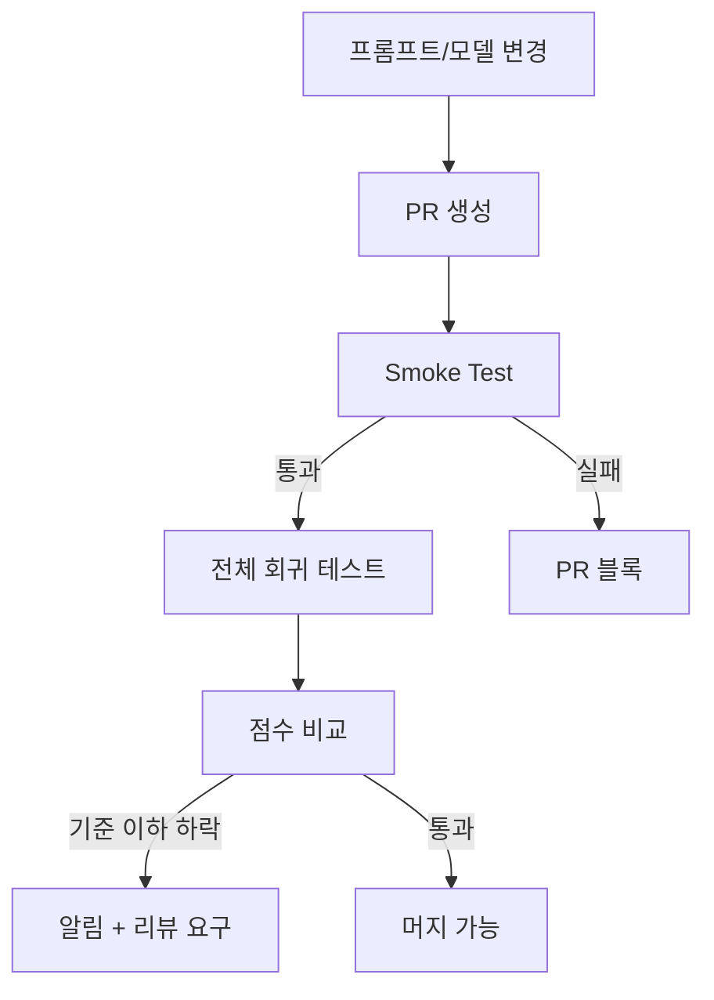

# LLM 평가 방법론

새 모델이 나올 때마다 벤치마크 점수가 표로 정리되어 나온다. MMLU 85.3, HumanEval 72.5, GSM8K 91.2. 숫자만 보면 어느 모델이 좋은지 한눈에 알 것 같다. 그런데 그 점수를 믿고 실제 제품에 붙여보면 결과가 다르다. 벤치마크에서 GPT-4를 이긴다고 발표한 7B 모델이 실제 사용자 질문에는 GPT-4의 절반도 못 따라간다. 이게 LLM 평가의 첫 번째 함정이다.

이 문서는 표준 벤치마크의 진짜 의미와 한계, lm-eval-harness 같은 평가 도구의 실제 사용법, LLM-as-a-Judge 패턴이 가진 편향 문제, 그리고 프로덕션에서 모델을 바꿀 때 어떻게 의사결정해야 하는지를 다룬다. 5년차 개발자가 모델 교체 의사결정을 해야 할 때 실제로 쓰는 기준 위주로 정리했다.

## 1. 벤치마크 점수를 곧이곧대로 믿으면 안 되는 이유

### 1.1 Test Set Contamination

벤치마크 점수가 부풀려지는 첫 번째 원인은 단순하다. 모델이 평가 데이터를 사전학습 중에 봤을 수 있다. MMLU, GSM8K, HumanEval 같은 표준 벤치마크는 모두 공개 데이터고, 인터넷에 수십 번 복제돼 있다. CommonCrawl을 그대로 긁어 학습한 모델은 거의 확실하게 이 데이터를 본 적이 있다.

벤치마크 점수가 갑자기 튀어 오른 모델을 의심할 때 쓰는 방법이 몇 가지 있다. 가장 단순한 건 N-gram 검사다. 사전학습 코퍼스에 벤치마크 문제의 13-gram이 등장하는지 본다. Llama 3 기술 보고서를 보면 MMLU 문제 중 5% 이상이 사전학습 데이터에 13-gram 단위로 포함돼 있었다고 나온다.

더 정밀한 방법은 perplexity gap 측정이다. 같은 도메인의 새 문제와 벤치마크 문제에 대한 모델의 perplexity를 비교한다. 벤치마크 문제의 perplexity가 비정상적으로 낮으면 학습 시 노출됐을 가능성이 높다.

```python
import torch
from transformers import AutoModelForCausalLM, AutoTokenizer

def compute_perplexity(model, tokenizer, text: str) -> float:
    inputs = tokenizer(text, return_tensors="pt")
    with torch.no_grad():
        outputs = model(**inputs, labels=inputs["input_ids"])
    return torch.exp(outputs.loss).item()

# 벤치마크 문제와 같은 도메인의 신규 문제 perplexity 비교
benchmark_ppl = compute_perplexity(model, tokenizer, mmlu_question)
fresh_ppl = compute_perplexity(model, tokenizer, fresh_question)

# 차이가 30% 이상 나면 contamination 의심
ratio = fresh_ppl / benchmark_ppl
print(f"Contamination signal: {ratio:.2f}")
```

이 방법도 완벽하진 않다. 모델이 정말로 그 도메인을 잘 알아서 perplexity가 낮을 수도 있다. 다만 같은 난이도의 신규 문제로 별도 평가셋을 만들어보고 점수가 크게 떨어지면 contamination을 강하게 의심해도 된다.

### 1.2 Single-turn, English-only, MCQA 편향

표준 벤치마크 대부분이 단일 턴, 영어, 객관식이다. 실제 사용 환경은 다중 턴, 비영어 혼합, 자유 응답이다. 이 차이가 점수와 체감 성능 간 괴리의 원인이다.

MMLU는 4지선다 객관식이다. 모델이 답을 모르더라도 무작위로 찍으면 25% 정답이다. 객관식 형식 자체가 모델을 도와준다. 같은 문제를 자유 응답으로 바꿔서 물으면 점수가 20~30% 떨어지는 경우가 흔하다.

영어 외 언어 성능은 별도로 봐야 한다. MMLU 영어판에서 80점 받는 모델이 한국어 MMLU에서는 60점대인 경우가 많다. 한국어 사용자 비중이 높은 서비스라면 KMMLU, HAERAE-Bench 같은 한국어 평가셋을 별도로 봐야 한다.

다중 턴 대화는 거의 모든 표준 벤치마크가 다루지 않는다. 3~4턴 이상 이어지는 대화에서 컨텍스트를 유지하는 능력은 MT-Bench, MT-Bench-101 정도가 다루고, 나머지는 단일 턴 기준이다.

### 1.3 평가 설정에 따른 점수 변동

같은 모델, 같은 벤치마크인데 점수가 다르게 나오는 일이 자주 있다. 원인은 평가 설정이다.

- **Few-shot 개수**: 0-shot, 5-shot, 25-shot에 따라 같은 모델 점수가 10점 이상 벌어진다. MMLU 공식 기준은 5-shot이다.
- **Prompt template**: "The answer is" 뒤에 답을 받을지, "(A)" 같은 옵션 문자 자체로 받을지에 따라 결과가 다르다.
- **Logprob vs Generation**: 객관식에서 각 옵션의 logprob을 직접 비교할지, 생성된 텍스트를 파싱할지에 따라 점수가 다르다. Logprob 방식이 보통 5~10점 높게 나온다.
- **Stop token, temperature**: GSM8K처럼 추론 과정이 긴 문제에서는 temperature, max_tokens 설정이 결정적이다.

이 때문에 "MMLU 85점"이라는 숫자만 보면 안 되고 평가 코드까지 확인해야 한다. 같은 lm-eval-harness 버전, 같은 hash로 실행한 결과가 아니면 직접 비교하지 말아야 한다.

## 2. 주요 표준 벤치마크 — 의미와 한계

### 2.1 MMLU (Massive Multitask Language Understanding)

MMLU는 57개 학문 분야의 객관식 문제 약 15,900개로 구성된다. 초등 수학부터 미국 법학, 의료 윤리까지 다룬다. 5-shot 기준으로 평가하는 게 표준이다.

MMLU의 강점은 도메인 폭이 넓다는 점이다. 한 모델이 여러 분야에서 균형 잡힌 지식을 가지는지 본다. 약점은 객관식 형식이라 실제 활용 능력과 거리가 있다는 점이다. 그리고 contamination이 가장 심한 벤치마크 중 하나다.

```python
# lm-eval-harness 기준 MMLU 평가 실행
# pip install lm-eval

from lm_eval import simple_evaluate

results = simple_evaluate(
    model="hf",
    model_args="pretrained=meta-llama/Llama-3-8B,dtype=bfloat16",
    tasks=["mmlu"],
    num_fewshot=5,
    batch_size=8,
)

print(f"MMLU avg: {results['results']['mmlu']['acc,none']:.4f}")
```

MMLU 점수만 보고 모델을 고르면 망한다. 2024년부터는 MMLU-Pro라는 변형이 나왔는데, 4지선다를 10지선다로 바꾸고 추론이 필요한 문제 위주로 재구성했다. 무작위 추측 정답률이 25%에서 10%로 떨어져서 변별력이 더 좋다. 새 모델 평가에는 MMLU보다 MMLU-Pro를 보는 게 낫다.

### 2.2 HumanEval과 MBPP

HumanEval은 OpenAI가 만든 Python 코드 생성 벤치마크다. 164개 문제로 함수 시그니처와 docstring을 주면 함수 본문을 생성한다. Pass@1, Pass@10 같은 지표로 평가한다.

```python
# HumanEval 문제 예시
def has_close_elements(numbers: List[float], threshold: float) -> bool:
    """ Check if in given list of numbers, are any two numbers closer to
    each other than given threshold.
    >>> has_close_elements([1.0, 2.0, 3.0], 0.5)
    False
    >>> has_close_elements([1.0, 2.8, 3.0, 4.0, 5.0, 2.0], 0.3)
    True
    """
```

문제가 너무 단순하고 양이 적다는 게 한계다. 164개 중 일부는 한 줄 코드로 풀린다. 실제 프로덕션 코드 작성 능력과 큰 차이가 있다. 그리고 contamination이 심해서 신뢰도가 떨어졌다.

대안으로 EvalPlus가 나왔다. HumanEval+, MBPP+로 부르는 변형인데, 테스트 케이스를 80배 가까이 늘려서 corner case를 더 강하게 검증한다. EvalPlus 기준으로 보면 모델 점수가 10~20점 떨어지는 경우가 많고, 모델 순위도 바뀐다.

LiveCodeBench는 더 최근에 나온 코딩 벤치마크다. LeetCode, AtCoder, CodeForces에서 매주 새 문제를 가져와서 평가한다. 매일 갱신되는 평가셋이라 contamination 문제가 거의 없다. 코딩 모델을 진지하게 평가한다면 LiveCodeBench를 보는 게 가장 정확하다.

### 2.3 GSM8K와 MATH

GSM8K는 초등학교 수준의 수학 문장제 8,500개로 구성된다. 답을 맞히는 것뿐 아니라 풀이 과정도 자연어로 생성한다. Chain-of-Thought 능력 측정에 쓰인다.

```
Question: Janet's ducks lay 16 eggs per day. She eats three for breakfast every
morning and bakes muffins for her friends every day with four. She sells the
remainder at the farmers' market daily for $2 per fresh duck egg. How much in
dollars does she make every day at the farmers' market?

Answer: She lays 16 eggs and eats 3 for breakfast, so she has 16 - 3 = 13 eggs.
She uses 4 for muffins, so 13 - 4 = 9 eggs left. She sells 9 eggs at $2 each,
so 9 * 2 = $18.
#### 18
```

`####` 뒤에 최종 답이 오는 형식이다. 평가 시 정규식으로 마지막 숫자를 뽑아서 비교한다.

GSM8K는 워낙 표준이라 거의 모든 모델이 이걸 학습 데이터에 넣는다. 최신 7B 모델이 GSM8K에서 85점 이상을 받는데, 실제로 그 정도 수학 능력이 있는 건 아니다. 같은 문제를 숫자만 바꿔서 물어보면 점수가 20점 떨어지는 경우가 있다.

MATH 벤치마크는 GSM8K보다 훨씬 어렵다. 고등학교 경시 대회 수준의 12,500개 문제다. 대수, 기하, 정수론, 확률, 미적분 등을 다룬다. GSM8K에서 90점 받는 모델이 MATH에서는 30점대인 경우가 흔하다.

GSM8K-Hard, GSM-Symbolic 같은 변형도 있다. GSM-Symbolic은 같은 문제 구조를 유지하면서 숫자와 이름을 바꿔서 contamination을 회피한다. Apple 연구진이 발표한 결과로는 GSM-Symbolic에서 거의 모든 모델 점수가 GSM8K 대비 떨어지는데, 떨어지는 폭이 모델마다 다르다. 진짜 추론 능력을 가진 모델은 떨어지는 폭이 작다.

### 2.4 MT-Bench와 Arena Hard

MT-Bench는 LMSYS가 만든 대화형 평가셋이다. 80개 다중 턴 대화 질문으로, GPT-4가 채점자 역할을 한다. 1~10점 척도로 답을 채점한다. 자유 응답 평가의 표준으로 자리잡았다.

문제는 80개라는 양이 너무 적다는 점이다. 한 모델을 평가하는 데 GPT-4 API 호출 비용이 들지만, 양이 적어서 통계적 유의성이 약하다. 같은 모델을 다시 평가해도 점수가 0.2점 정도는 흔들린다.

Arena Hard는 MT-Bench의 후속이다. 500개의 어려운 사용자 질문(Chatbot Arena 로그에서 추출)에 대해 모델 응답을 GPT-4-Turbo가 pairwise로 비교한다. baseline 모델(GPT-4-0314)과 비교해서 win rate를 점수로 낸다. MT-Bench보다 변별력이 훨씬 좋고, 실제 사용 패턴과 가까운 질문이라 체감 성능과의 상관관계가 높다.

Chatbot Arena 자체는 사람이 두 응답을 보고 더 좋은 쪽을 고르는 방식이다. Elo 점수로 모델을 랭킹한다. 이게 가장 신뢰할 만한 평가지만, 새 모델은 충분한 투표가 쌓일 때까지 시간이 걸린다. 그리고 사람들이 길고 잘 정렬된 응답을 선호하는 편향이 있어서, 짧고 정확한 응답을 내는 모델이 손해를 본다.

### 2.5 어느 벤치마크를 봐야 하나

용도별로 봐야 할 벤치마크가 다르다.

| 용도 | 1순위 벤치마크 | 2순위 |
|------|---------------|-------|
| 일반 지식, RAG 보조 | MMLU-Pro | GPQA |
| 코드 생성 | LiveCodeBench | HumanEval+, BigCodeBench |
| 수학 추론 | MATH, AIME | GSM-Symbolic |
| 자유 대화 품질 | Arena Hard | Chatbot Arena Elo |
| Tool/Function calling | BFCL | Nexus, ToolBench |
| 긴 컨텍스트 | RULER, ZeroSCROLLS | Needle-in-Haystack |
| 한국어 | KMMLU, HAERAE | LogicKor |
| 환각 | TruthfulQA, SimpleQA | HaluEval |

이 표를 머릿속에 넣어두고, 모델 발표 자료에서 어느 벤치마크 점수를 강조하는지를 본다. MMLU만 강조하고 MMLU-Pro는 빼는 모델은 의심해도 된다. HumanEval은 자랑하는데 EvalPlus나 LiveCodeBench는 안 나오는 코딩 모델도 비슷하다.

## 3. lm-eval-harness와 lighteval

평가를 직접 돌릴 때 가장 많이 쓰는 도구가 EleutherAI의 lm-evaluation-harness다. Hugging Face Open LLM Leaderboard도 이걸로 평가한다. 최근에는 lighteval(Hugging Face)도 많이 쓰인다.

### 3.1 lm-eval-harness 기본 사용

```bash
pip install lm-eval

# Hugging Face 모델 평가
lm_eval --model hf \
    --model_args pretrained=meta-llama/Llama-3-8B,dtype=bfloat16 \
    --tasks mmlu,arc_challenge,hellaswag,truthfulqa \
    --num_fewshot 5 \
    --batch_size 8 \
    --output_path ./results

# vLLM 서버 평가 (더 빠름)
lm_eval --model local-completions \
    --model_args model=meta-llama/Llama-3-8B,base_url=http://localhost:8000/v1/completions \
    --tasks mmlu_pro \
    --batch_size 32

# OpenAI 호환 API 평가
lm_eval --model openai-chat-completions \
    --model_args model=gpt-4o,base_url=https://api.openai.com/v1 \
    --tasks arena_hard \
    --apply_chat_template
```

`--apply_chat_template`은 중요하다. Chat 모델을 평가할 때 이걸 안 주면 system prompt, user/assistant role을 적용하지 않은 raw text로 평가가 들어간다. Base 모델로 평가한 점수가 나오게 된다. Instruction-tuned 모델은 반드시 chat template를 적용해야 한다.

### 3.2 평가가 오래 걸리는 문제

MMLU 전체를 평가하려면 15,900개 문제에 5-shot prompt를 붙여서 LLM에 통과시켜야 한다. 7B 모델을 A100 한 장으로 돌리면 1~2시간 걸린다. 70B 모델이면 하루 가까이 걸린다.

이 시간을 줄이는 방법이 몇 가지 있다.

**vLLM 백엔드 사용**: lm-eval-harness의 기본 HF 백엔드는 batch 처리 효율이 낮다. vLLM 서버를 띄우고 `--model local-completions`로 연결하면 5~10배 빨라진다.

```bash
# 별도 터미널에서 vLLM 서버 실행
vllm serve meta-llama/Llama-3-8B \
    --tensor-parallel-size 1 \
    --max-model-len 4096 \
    --gpu-memory-utilization 0.9

# 평가는 API로 호출
lm_eval --model local-completions \
    --model_args model=meta-llama/Llama-3-8B,base_url=http://localhost:8000/v1/completions \
    --tasks mmlu \
    --batch_size 64
```

**`--limit` 옵션으로 샘플링**: 개발 중에는 전체 평가셋을 돌리지 않고 일부만 본다. `--limit 200`을 주면 각 task에서 200개만 평가한다. CI 같은 자동화 파이프라인에서는 이렇게 가벼운 smoke test를 먼저 돌리고, 야간에 전체 평가를 돌리는 방식이 일반적이다.

**Tensor parallelism**: 70B 모델 이상은 GPU 한 장에 안 올라가니 vLLM의 `--tensor-parallel-size`로 여러 장에 분산시킨다.

### 3.3 lighteval

lighteval은 Hugging Face가 Open LLM Leaderboard v2 때문에 만든 평가 프레임워크다. lm-eval-harness 대비 장점이 있다.

- **Accelerate 통합**: 멀티 GPU 분산이 더 자연스럽다.
- **빠른 vLLM/TGI 백엔드**: 처음부터 inference 서버를 가정하고 설계됐다.
- **새 벤치마크 추가가 쉽다**: 커스텀 task 정의가 lm-eval-harness보다 깔끔하다.

```python
# lighteval로 커스텀 평가셋 추가
from lighteval.tasks.requests import Doc
from lighteval.tasks.lighteval_task import LightevalTaskConfig

def my_prompt_function(line, task_name: str = None):
    return Doc(
        task_name=task_name,
        query=line["question"],
        choices=line["choices"],
        gold_index=line["answer"],
    )

my_task = LightevalTaskConfig(
    name="company_internal_qa",
    prompt_function=my_prompt_function,
    suite=["custom"],
    hf_repo="my-org/internal-qa-dataset",
    hf_subset="default",
    metric=["loglikelihood_acc"],
    generation_size=-1,
    stop_sequence=None,
)
```

실무에서는 lm-eval-harness로 표준 벤치마크를 돌리고, lighteval이나 직접 만든 평가 스크립트로 도메인 특화 평가를 돌리는 패턴이 흔하다.

## 4. LLM-as-a-Judge

자유 응답 평가는 정답이 하나가 아니다. "파이썬으로 빠른 정렬 알고리즘을 짜줘" 같은 질문에 답이 수십 가지 있을 수 있다. 사람이 평가하는 게 가장 정확한데 비싸고 느리다. 그래서 GPT-4 같은 강한 모델을 채점자로 쓰는 LLM-as-a-Judge 패턴이 표준이 됐다.

### 4.1 기본 패턴 — Pointwise와 Pairwise

Pointwise는 응답 하나에 1~10점을 매기는 방식이다. MT-Bench가 이걸 쓴다.

```python
JUDGE_PROMPT_POINTWISE = """You are an impartial judge. Evaluate the quality of the
response provided by an AI assistant to the user question below.

[Question]
{question}

[Assistant Response]
{response}

Rate the response on a scale of 1 to 10 considering helpfulness, relevance,
accuracy, depth, creativity, and detail. Provide your reasoning, then output
your final rating in the format: [[rating]]"""

def judge_pointwise(question: str, response: str, judge_model) -> int:
    prompt = JUDGE_PROMPT_POINTWISE.format(question=question, response=response)
    output = judge_model.generate(prompt, temperature=0.0)
    # "[[7]]" 같은 패턴 파싱
    import re
    match = re.search(r"\[\[(\d+)\]\]", output)
    return int(match.group(1)) if match else 0
```

Pairwise는 두 응답을 보여주고 어느 쪽이 더 좋은지 고르는 방식이다. Arena Hard, AlpacaEval이 이 방식이다. 절대 점수를 매기는 것보다 상대 비교가 더 일관성 있게 나온다.

```python
JUDGE_PROMPT_PAIRWISE = """You are an impartial judge. Compare two responses
to the user question and decide which is better.

[Question]
{question}

[Response A]
{response_a}

[Response B]
{response_b}

Output your final verdict in the format:
- "[[A]]" if Response A is better
- "[[B]]" if Response B is better
- "[[C]]" for a tie"""
```

### 4.2 LLM Judge의 편향 — 알고 있어야 할 5가지

LLM-as-a-Judge는 편하지만 편향이 심하다. 알고 있어야 할 편향이 5가지 있다.

**1. Position bias**: Pairwise 평가에서 첫 번째 응답을 선호하는 경향이 있다. GPT-4를 judge로 쓰면 동일한 응답을 A, B 위치만 바꿔서 두 번 물어볼 때 결과가 일치하지 않는 경우가 20% 가까이 나온다.

대응: 같은 두 응답을 A/B 위치 바꿔서 두 번 물어보고, 양쪽 모두에서 같은 결과가 나오는 경우만 카운트한다. 또는 swap한 결과의 평균을 낸다.

```python
def judge_pairwise_robust(question, response_a, response_b, judge):
    result1 = judge(question, response_a, response_b)
    result2 = judge(question, response_b, response_a)
    if result1 == "A" and result2 == "B":
        return "A"  # 일관되게 A 선호
    if result1 == "B" and result2 == "A":
        return "B"  # 일관되게 B 선호
    return "tie"  # 불일치는 무승부 처리
```

**2. Length bias**: 더 긴 응답을 선호한다. GPT-4 judge가 동일 내용의 짧은 응답과 긴 응답을 비교하면 긴 쪽을 70% 이상 고른다. 그래서 길게 쓰도록 학습된 모델이 LLM judge 평가에서 유리하다.

Arena Hard에서는 이걸 보정한다. 응답 길이로 logistic regression을 돌려서 length bias 보정한 점수를 추가로 낸다.

**3. Self-preference bias**: Judge로 쓴 모델이 자기 자신이 생성한 응답을 선호한다. GPT-4가 judge면 GPT-4가 만든 응답을 다른 모델 응답보다 높게 평가한다. 자기 family 모델(GPT-3.5 등)에도 같은 편향이 약하게 있다.

대응: Judge는 평가 대상 모델 family와 다른 걸 쓴다. GPT 계열 모델 평가에는 Claude를 judge로 쓰는 식이다.

**4. Verbosity bias**: 의견을 자신 있게, 단호하게 표현하는 응답을 선호한다. 모르는 걸 "잘 모르겠습니다"라고 답하는 응답이 자신만만하게 잘못된 답을 내놓는 응답보다 낮은 점수를 받는다.

**5. Format bias**: 마크다운, 불릿, 헤딩이 들어간 응답을 선호한다. 같은 내용을 산문으로 쓴 응답과 잘 포맷팅한 응답을 비교하면 후자가 점수가 더 높다.

### 4.3 Judge 점수와 사람 평가의 상관관계

LLM judge가 신뢰할 만한지 확인하는 가장 정확한 방법은 사람 평가와 비교하는 것이다. MT-Bench 논문에서는 GPT-4 judge와 전문가 사람 평가의 일치율이 약 80%로 나왔다. 두 사람 평가자 간 일치율도 81% 정도였으니, 인간 평가자 수준의 일치율이라는 결과다.

다만 이 80%라는 숫자는 일반 대화에 한정된다. 특정 도메인(법률, 의료, 코드 보안 등) 평가에서는 GPT-4 judge가 사람 전문가 평가와 50% 정도밖에 일치하지 않는 경우도 있다. 도메인 특화 평가에서는 LLM judge를 그대로 쓰면 안 되고, 사람 평가로 검증한 뒤 보정 계수를 적용해야 한다.

```python
# Judge 신뢰도 검증 패턴
import pandas as pd

# 100개 샘플에 대해 사람 평가와 LLM judge 둘 다 받는다
df = pd.read_csv("calibration_set.csv")
df["judge_score"] = df.apply(lambda r: judge_pointwise(r["q"], r["resp"], gpt4), axis=1)

# 일치율, 상관계수 계산
from scipy.stats import pearsonr
correlation, _ = pearsonr(df["human_score"], df["judge_score"])
agreement_rate = (df["human_score"].round() == df["judge_score"].round()).mean()

print(f"Human-Judge correlation: {correlation:.3f}")
print(f"Agreement rate: {agreement_rate:.3f}")

# correlation < 0.6이면 이 도메인에는 LLM judge 신뢰 못 함
```

상관계수가 0.6 미만이면 그 도메인에서는 LLM judge 결과를 의사결정에 직접 쓰지 말아야 한다. 0.6~0.8이면 참고는 가능하지만 critical한 의사결정은 사람 평가로 한다. 0.8 이상이면 LLM judge를 메인 지표로 써도 된다.

## 5. 도메인 특화 평가셋 구축

표준 벤치마크가 우리 도메인을 다루지 않는 경우가 많다. 사내 문서 QA, 특정 산업의 용어 처리, 회사 코드베이스에 맞는 코드 생성 같은 작업은 직접 평가셋을 만들어야 한다.

### 5.1 평가셋 설계 — 양보다 분포

평가셋 만들 때 처음 하는 실수가 양만 늘리는 것이다. 1000개 평가셋을 만들었는데 그중 800개가 비슷한 패턴이면, 그 평가셋은 200개짜리와 다를 게 없다. 분포가 중요하다.

도메인 평가셋을 설계할 때 다음 차원을 의도적으로 분산시킨다.

- **난이도**: 쉬움/중간/어려움 비율을 30:50:20 정도로 맞춘다. 너무 어려운 문제만 모으면 모델 간 변별이 안 되고, 너무 쉬우면 천장 효과로 변별이 안 된다.
- **카테고리**: 도메인 내 하위 영역을 골고루 커버한다. 법률 평가셋이면 민법, 형법, 행정법, 노동법 등을 비율 맞춰 넣는다.
- **응답 길이**: 짧은 답이 필요한 문제, 긴 추론이 필요한 문제를 섞는다.
- **함정 문제**: 모델이 흔히 빠지는 함정(잘못된 전제, 모호한 표현)을 의도적으로 포함한다.

실무에서 쓰는 사이즈는 300~1000개 정도가 적절하다. 더 적으면 통계적 유의성이 약하고, 더 많으면 평가 비용과 시간이 부담된다.

### 5.2 평가셋 생성 자동화

평가셋을 사람이 손으로 만들면 비싸다. 사내 문서로 합성 평가셋을 만드는 패턴이 일반적이다.

```python
# 사내 문서에서 QA 평가셋 합성
GENERATE_QA_PROMPT = """다음 문서를 읽고, 이 문서 내용을 정확히 알아야만 답할 수 있는
질문과 정답을 5개 만들어라.

규칙:
- 질문은 문서를 보지 않은 사람이 자연스럽게 던질 만한 형태로
- 정답은 문서 내 명시적으로 나온 내용만
- 정답이 한 문장으로 명확히 결정되는 질문만
- 문서에 나오지 않는 내용은 만들지 마라

문서:
{document}

JSON 형식으로 출력: [{{"question": "...", "answer": "...", "evidence": "원문 인용"}}]"""

def generate_eval_set(documents, generator_model):
    eval_items = []
    for doc in documents:
        prompt = GENERATE_QA_PROMPT.format(document=doc)
        output = generator_model.generate(prompt, temperature=0.3)
        items = parse_json(output)
        # evidence가 실제 문서에 있는지 검증
        items = [i for i in items if i["evidence"] in doc]
        eval_items.extend(items)
    return eval_items
```

합성 평가셋의 함정은 generator 모델의 편향이 그대로 들어간다는 점이다. GPT-4로 평가셋을 만들고 같은 GPT-4로 평가하면, GPT-4가 만들기 쉬운 패턴에 GPT-4가 잘 답하는 결과가 나온다. 그래서 합성 평가셋은 반드시 사람이 검수해야 한다. 보통 합성된 평가셋의 60~70% 정도가 검수에서 살아남는다.

### 5.3 Golden Set 운영

도메인 평가셋 중 일부는 절대 변경되지 않는 Golden Set으로 분리한다. 100~200개 정도, 사람이 정답을 손으로 만들고 여러 번 검증한 셋이다. 이건 학습 데이터에 절대 흘러가면 안 되고, 외부 API에 보낼 때도 조심해야 한다.

Golden Set은 다음 용도로 쓴다.

- **장기 추세 추적**: 같은 평가셋으로 모든 모델 버전을 평가해서 시간에 따른 성능 변화를 본다.
- **회귀 테스트**: 새 모델/프롬프트가 기존 모델/프롬프트보다 떨어지지 않는지 확인한다.
- **모델 교체 의사결정**: 새 외부 모델로 갈아탈 때 Golden Set 점수가 의사결정의 핵심 근거다.

Golden Set이 leak되면 가치를 잃는다. 사내 wiki에 올리지 말고, 별도 비공개 저장소에 두고, 평가는 secure 환경에서만 돌린다.

## 6. Regression 테스트 자동화

프로덕션에서 LLM 시스템을 운영하다 보면, 한 곳을 고치면 다른 곳이 깨지는 일이 빈번하다. 프롬프트 한 줄을 바꿨더니 80%의 케이스가 좋아졌는데 5%가 망가지는 식이다. 회귀 테스트가 없으면 이걸 발견하지 못한 채 배포된다.

### 6.1 평가 파이프라인 구조



Smoke Test는 50~100개 핵심 케이스를 1~2분 내에 돌린다. PR마다 자동으로 실행한다. 전체 회귀 테스트는 500~2000개 케이스를 30분~2시간 걸려서 돌린다. 머지 직전 또는 야간 빌드에서 돌린다.

### 6.2 점수 비교 — 절대값보다 변화량

회귀 테스트에서 "점수가 80점 이상이어야 통과" 같은 절대 임계값을 두면 임계값 근처에서 불안정해진다. 대신 이전 버전 대비 변화량으로 판단한다.

```python
def regression_check(current_score: float, baseline_score: float,
                    category: str) -> str:
    delta = current_score - baseline_score
    relative = delta / baseline_score if baseline_score > 0 else 0

    # 카테고리별 허용 하락폭
    thresholds = {
        "critical": -0.01,   # 1% 이상 하락 금지
        "important": -0.03,  # 3% 이상 하락 금지
        "normal": -0.05,     # 5% 이상 하락 시 검토
    }

    threshold = thresholds.get(category, -0.05)
    if relative < threshold:
        return f"FAIL: {category} dropped {relative:.1%}"
    if delta > 0.02:
        return f"IMPROVED: +{relative:.1%}"
    return "OK"
```

평가셋을 단일 점수로 합산하지 말고 카테고리별로 점수를 본다. 전체 점수는 올랐는데 특정 카테고리가 망가지는 케이스를 잡으려면 이게 필수다.

### 6.3 LLM 평가의 변동성 다루기

같은 모델, 같은 평가셋인데 점수가 매번 다르게 나온다. Temperature 0으로 둬도 GPU/CUDA 버전 차이, batch size 차이, sampling 구현 차이로 미세한 변동이 생긴다.

이 노이즈를 다루는 방법.

**1. Seed 고정**: `transformers`의 `set_seed`, vLLM의 `seed` 파라미터로 고정한다. 완전히 deterministic하진 않지만 변동 폭이 줄어든다.

**2. 다중 실행 평균**: 같은 평가를 3~5번 돌려서 평균과 표준편차를 본다. 표준편차보다 작은 점수 차이는 노이즈로 본다.

**3. Bootstrap 신뢰구간**: 평가셋에서 복원 추출로 N개를 뽑아서 점수를 N번 계산한다. 신뢰구간을 보면 두 모델 점수 차이가 통계적으로 유의한지 알 수 있다.

```python
import numpy as np

def bootstrap_ci(scores: np.ndarray, n_bootstrap: int = 1000,
                 confidence: float = 0.95) -> tuple[float, float]:
    """평가셋 점수 배열에서 평균의 신뢰구간 계산."""
    boot_means = []
    rng = np.random.default_rng(42)
    for _ in range(n_bootstrap):
        sample = rng.choice(scores, size=len(scores), replace=True)
        boot_means.append(sample.mean())
    boot_means = np.array(boot_means)
    lower = np.percentile(boot_means, (1 - confidence) / 2 * 100)
    upper = np.percentile(boot_means, (1 + confidence) / 2 * 100)
    return lower, upper

# 두 모델 점수 비교
ci_a = bootstrap_ci(model_a_scores)
ci_b = bootstrap_ci(model_b_scores)
print(f"Model A: {model_a_scores.mean():.3f} [{ci_a[0]:.3f}, {ci_a[1]:.3f}]")
print(f"Model B: {model_b_scores.mean():.3f} [{ci_b[0]:.3f}, {ci_b[1]:.3f}]")
# 신뢰구간이 겹치면 두 모델은 통계적으로 구분 안 됨
```

### 6.4 프로덕션 로그 기반 평가

가장 정확한 평가는 실제 사용자 트래픽이다. 프로덕션 로그에서 샘플링해서 평가셋을 만든다.

```python
# 일일 평가 파이프라인
def daily_eval_pipeline():
    # 1. 어제 트래픽에서 1000개 샘플링
    samples = sample_from_logs(date=yesterday, n=1000)

    # 2. 카테고리 분포 확인
    distribution = analyze_distribution(samples)
    print(f"Today's distribution: {distribution}")

    # 3. 현재 프로덕션 모델 응답과 새 후보 모델 응답 비교
    for sample in samples:
        prod_response = sample["response"]  # 이미 프로덕션에서 응답한 것
        candidate_response = candidate_model.generate(sample["query"])

        # LLM-as-Judge로 pairwise 비교
        winner = judge_pairwise(sample["query"], prod_response, candidate_response)
        log_result(sample, winner)

    # 4. Win rate 집계
    win_rate = compute_win_rate(date=today)
    if win_rate < 0.50:
        alert("Candidate model losing to prod model")
```

프로덕션 로그를 평가에 쓸 때 개인정보 처리가 가장 까다롭다. 사용자 ID, 이메일, 주민번호 패턴, 카드 번호 같은 PII는 평가 전에 마스킹한다. 그리고 외부 API(GPT-4 judge 등)에 그대로 보내면 안 된다. 평가셋용 별도 마스킹 파이프라인을 둬야 한다.

## 7. 프로덕션에서 모델 교체 의사결정

새 모델이 나왔다고 곧바로 갈아타면 안 된다. 더 나은 벤치마크 점수가 우리 도메인에서 더 나은 결과를 보장하지 않는다. 실제 의사결정에 쓰는 기준을 정리한다.

### 7.1 의사결정 매트릭스

모델을 교체할 때 평가해야 할 차원이 5개다.

| 차원 | 가중치 | 측정 방법 |
|------|--------|-----------|
| 도메인 평가 점수 | 35% | Golden Set + 프로덕션 로그 기반 평가 |
| 응답 지연(TTFT, TPOT) | 15% | 부하 테스트 환경에서 p50, p95 측정 |
| 비용(토큰당) | 20% | 입출력 토큰 단가 × 일평균 사용량 |
| 안전성/환각 | 15% | TruthfulQA + 도메인 환각 평가셋 |
| 운영 안정성 | 15% | rate limit, downtime 이력, API 안정성 |

가중치는 서비스 성격에 따라 다르다. 고객 응대 챗봇은 안전성/환각 가중치를 높이고, 내부 코드 보조 도구는 도메인 평가 점수를 더 높인다.

### 7.2 단계적 롤아웃

A/B 테스트나 shadow deployment로 검증한 뒤 전환한다.

```python
# 트래픽 분할로 새 모델 검증
def route_request(user_id: str, query: str):
    # 5% 트래픽만 새 모델로
    if hash(user_id) % 100 < 5:
        response = candidate_model.generate(query)
        log_evaluation(user_id, query, response, model="candidate")
    else:
        response = production_model.generate(query)
        log_evaluation(user_id, query, response, model="production")
    return response
```

Shadow deployment는 두 모델에 모두 요청을 보내고, 사용자에게는 production 응답만 보여주는 방식이다. 비용이 두 배 들지만 실제 트래픽으로 검증할 수 있다.

전환 후에도 1~2주는 양쪽 모델을 모두 유지한다. 새 모델에서 발견되지 않은 회귀가 있을 수 있어서, 빠르게 되돌릴 수 있어야 한다.

### 7.3 평가가 끝났는데도 못 갈아타는 경우

평가에서 새 모델이 더 좋다고 나왔는데 실제로는 못 갈아타는 경우가 있다. 흔한 이유.

**1. 프롬프트 호환성**: 기존 프롬프트가 새 모델에서 동작하지 않는다. Claude용으로 튜닝한 프롬프트를 GPT에 그대로 쓰면 성능이 떨어진다. 모델별로 프롬프트를 다시 튜닝해야 하는데, 이 작업이 자체로 2~4주 들어간다.

**2. 토큰 사용 패턴 변화**: 같은 작업인데 새 모델이 더 긴 응답을 낸다. 평가셋 점수는 비슷한데 실제 비용이 30% 늘어나는 식이다.

**3. Function calling 포맷 차이**: Tool 호출 JSON 구조, 인자 처리 방식이 모델마다 다르다. 미묘한 차이가 production에서 큰 버그로 이어진다.

**4. Rate limit, quota**: 모델 제공사의 rate limit이 부족해서 트래픽을 다 못 받는다. Enterprise 계약 협상에 1~2개월이 걸리기도 한다.

**5. 컴플라이언스**: 데이터 처리 위치, 학습 데이터 사용 여부 같은 약관 조건이 회사 정책과 안 맞는다.

이런 이유로 "더 좋은 모델이 있다"는 게 곧바로 "갈아타야 한다"가 되지 않는다. 모델 교체는 기술적 평가 외에도 운영, 비용, 법무 검토가 다 끝나야 한다.

## 8. 평가에서 자주 하는 실수

마지막으로 5년차로서 평가 작업을 하면서 봤던 흔한 실수를 정리한다.

**평가셋과 학습셋 분리를 안 한다**: 합성 평가셋을 RAG 인덱스에 그대로 넣는다거나, 평가셋을 fine-tuning 데이터에 섞어 넣는 경우가 있다. 한번 새면 평가의 의미가 없어진다. 평가셋은 별도 저장소에서 관리하고, 학습 파이프라인은 평가셋 경로 접근을 차단한다.

**단일 점수만 본다**: 평균 점수만 보고 모델을 평가하면, 특정 카테고리에서 망가진 걸 못 본다. 항상 카테고리별 점수, 분포, 최악 케이스 샘플을 같이 본다.

**평가 환경과 프로덕션 환경이 다르다**: 평가는 0.0 temperature, 단일 턴, 짧은 컨텍스트로 돌렸는데 프로덕션은 0.7 temperature, 다중 턴, 8K 컨텍스트인 경우가 있다. 평가 환경이 프로덕션과 크게 다르면 평가 결과의 신뢰도가 떨어진다.

**LLM judge 결과를 절대 점수로 본다**: GPT-4 judge가 7.5점을 줬다고 그게 "객관적인 7.5점"이 아니다. 같은 응답을 다음 주에 다시 평가하면 7.2점, 7.8점이 나올 수 있다. 항상 baseline 대비 상대 비교로 본다.

**평가셋이 너무 오래됐다**: 1년 전 만든 평가셋을 그대로 쓰면 사용자 질문 분포 변화를 반영하지 못한다. 분기마다 한 번씩은 프로덕션 로그를 보고 평가셋의 분포가 현실과 맞는지 확인한다.

평가는 LLM 시스템 운영의 절반이다. 좋은 평가셋이 없으면 좋은 모델인지 알 수가 없고, 회귀 테스트가 없으면 시스템이 조용히 망가진다. 모델 개발만큼 평가 인프라에 시간을 써야 한다.
