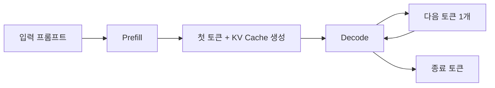
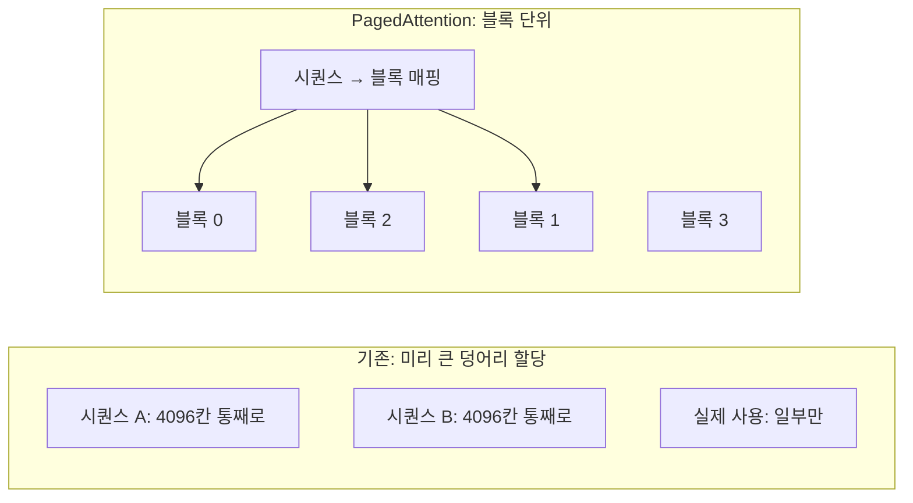
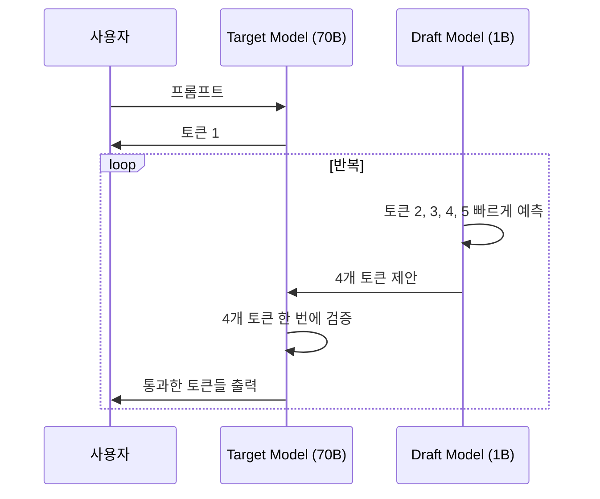

# LLM 추론 최적화 심화

LLM을 프로덕션에서 돌려보면 항상 같은 벽에 부딪힌다. GPU가 비싸고, 메모리가 부족하고, 응답이 느리다. 70B 모델을 띄우려면 A100 80GB가 두 장 필요하고, 토큰당 50ms씩 나오는 디코딩 속도로는 사용자 100명을 동시에 처리할 수 없다. 이 문서는 이 벽을 어떻게 무너뜨리는지 다룬다. Quantization, KV Cache 관리, PagedAttention, Continuous Batching, Speculative Decoding, Flash Attention까지 — 모든 기법이 같은 목표를 가진다. 같은 하드웨어에서 더 많이, 더 빨리.

LLM.md의 KV Cache 섹션을 읽고 왔다면 좋다. 여기서는 그 캐시를 어떻게 페이징하고, 어떻게 압축하고, 어떻게 공유하는지까지 파고든다.

## 1. 추론이 느린 진짜 이유

### 1.1 Prefill과 Decode는 다른 워크로드다

LLM 추론은 두 단계로 나뉜다. 이 둘이 완전히 다른 특성을 가지는데, 이 차이를 모르고 최적화하면 엉뚱한 곳에 시간을 쓴다.



**Prefill 단계**는 입력 프롬프트 전체를 한 번에 처리한다. 1000토큰짜리 프롬프트가 들어오면 1000개 위치의 Key, Value를 한 번에 계산한다. 행렬 곱이 큰 덩어리로 들어가서 GPU의 연산 유닛을 거의 다 쓴다. **compute-bound** 워크로드다.

**Decode 단계**는 토큰을 하나씩 만든다. 새 토큰 하나를 만들 때마다 이전 KV Cache 전체를 읽어와야 한다. 연산량은 적은데 메모리 대역폭이 병목이 된다. **memory-bound** 워크로드다.

A100의 FP16 연산 성능은 312 TFLOPS, 메모리 대역폭은 2TB/s다. Decode 단계에서는 GPU 연산 유닛이 30% 미만으로 놀고 있다. 이게 LLM 추론이 느린 근본 원인이다. 연산이 없어서 느린 게 아니라, KV Cache를 메모리에서 읽어오는 시간이 길어서 느리다.

| 단계 | 병목 | 연산 패턴 | 최적화 방향 |
|------|------|----------|------------|
| Prefill | compute | 큰 GEMM | Flash Attention, 텐서 병렬 |
| Decode | memory bandwidth | 작은 GEMV | KV Cache 압축, Batching, Speculative |

실무에서 첫 토큰 응답 시간(TTFT, Time To First Token)이 늦으면 Prefill이 느린 것이고, 토큰 사이 간격(TPOT, Time Per Output Token)이 길면 Decode가 병목이다. 두 지표를 분리해서 측정하지 않으면 어디를 손봐야 할지 알 수 없다.

### 1.2 GPU 메모리 계산법

배포 전에 반드시 계산해야 한다. 70B 모델을 A100 80GB 한 장에 띄울 수 있나? 결론부터 말하면 FP16으로는 못 띄운다. 왜 그런지 한 줄씩 계산해보자.

**모델 파라미터 메모리**: 파라미터 수 × 데이터 타입 크기.

- FP32(4바이트): 70B × 4 = 280GB
- FP16/BF16(2바이트): 70B × 2 = 140GB
- INT8(1바이트): 70B × 1 = 70GB
- INT4(0.5바이트): 70B × 0.5 = 35GB

70B 모델은 FP16으로 140GB라서 A100 80GB 한 장에 안 들어간다. INT4로 양자화하면 35GB로 줄어서 한 장에 올라간다. 7B 모델이면 FP16으로 14GB라서 RTX 4090 24GB에 여유 있게 들어간다.

**KV Cache 메모리**: 토큰 1개당 KV Cache 크기를 먼저 구한다.

```
KV per token = 2 (K, V) × num_layers × hidden_dim × dtype_size
```

Llama 3 70B 기준으로 계산하면 num_layers=80, hidden_dim=8192, FP16이라서 토큰 1개당 KV Cache가 약 2.5MB다. 컨텍스트 4096토큰이면 한 시퀀스당 10GB가 필요하다. 동시 요청 10개면 KV Cache만 100GB다. 모델 가중치보다 KV Cache가 더 큰 상황이 흔하게 생긴다.

GQA(Grouped Query Attention)를 쓰는 모델은 KV head 수가 줄어서 KV Cache가 더 작다. Llama 3 70B는 num_kv_heads=8이라서 위 계산보다 1/8로 줄어든다. 토큰당 약 320KB 정도가 실제 값이다. 그래서 4096 컨텍스트 × 10 시퀀스 = 약 13GB로 감당 가능한 수준이 된다.

**활성값(activation) 메모리**: Prefill 단계에서 일시적으로 쓰는 메모리다. batch_size × seq_len × hidden_dim에 비례한다. 대략 모델 가중치의 10~20% 정도 잡아두면 안전하다.

종합하면 다음 공식을 외워두면 편하다.

```
필요 메모리 = 모델 가중치 + (KV per token × 평균 컨텍스트 × 동시 요청) + 활성값(15%)
```

이 계산이 GPU 한 장에 안 들어가면 텐서 병렬, KV Cache 양자화, PagedAttention 같은 기법을 고려한다.

### 1.3 처리량 vs 레이턴시

이 둘은 본질적으로 충돌한다. 처리량을 올리면 레이턴시가 늘고, 레이턴시를 줄이면 처리량이 떨어진다. 어느 쪽이 중요한지 먼저 정해야 한다.

| 시나리오 | 우선순위 | 최적화 방향 |
|---------|---------|-----------|
| 채팅 응답, 코드 자동완성 | 레이턴시 | 배치 크기 작게, Speculative Decoding |
| 배치 임베딩, 대량 데이터 처리 | 처리량 | 배치 크기 크게, Continuous Batching |
| 검색 결과 요약, RAG | 균형 | TTFT 우선, 적당한 배치 |

채팅에서는 첫 토큰까지 1초가 넘어가면 사용자가 답답해한다. 배치 임베딩에서는 1만 건을 30분 안에 처리하는 게 중요하지, 한 건당 응답 시간은 중요하지 않다. 두 시나리오를 같은 인프라로 처리하려고 하면 둘 다 어중간해진다. 워크로드를 분리해서 별도 엔드포인트로 구성하는 게 낫다.

## 2. Quantization

양자화는 가중치를 더 작은 비트로 표현해서 메모리와 대역폭을 줄이는 기법이다. FP16에서 INT4로 가면 메모리가 1/4로 줄고, 메모리 대역폭이 병목인 Decode 단계에서 속도도 빨라진다.

### 2.1 양자화의 기본 원리

부동소수점 가중치를 정수 범위로 매핑하는 게 핵심이다. FP16 가중치가 [-2.0, 2.0] 범위에 있다고 하면, 이걸 INT4(-8 ~ 7)로 매핑한다.

```
scale = max(|w|) / 7
quantized = round(w / scale)
dequantized = quantized × scale
```

scale 값을 어떻게 정하느냐, 어떤 단위로 나눠서 양자화하느냐(per-tensor, per-channel, per-group)에 따라 정확도가 갈린다. 그룹 크기 128로 per-group 양자화하는 게 표준적으로 쓰인다.

양자화에는 두 종류가 있다.

**PTQ(Post-Training Quantization)**: 학습이 끝난 모델을 그대로 양자화한다. 빠르고 간단하다. GPTQ, AWQ가 여기 속한다.

**QAT(Quantization-Aware Training)**: 학습 중에 양자화 오차를 시뮬레이션하면서 다시 학습한다. 정확도는 더 좋지만 학습 비용이 든다. 사전학습 모델을 받아서 쓰는 입장에서는 거의 안 만진다.

### 2.2 GPTQ

GPTQ는 한 번에 한 레이어씩 양자화하면서, 양자화 오차를 다음 가중치에 보정해서 흡수시키는 방식이다. 작은 보정 데이터셋(보통 128~1024 샘플)을 모델에 통과시키면서 Hessian 정보를 이용해 오차를 최소화한다.

INT4로 양자화해도 perplexity 손실이 1% 미만이다. 4비트면 모델 크기가 1/4로 줄어든다. 13B 모델이 26GB(FP16)에서 7GB(INT4)로 떨어진다.

```python
# AutoGPTQ 사용 예
from auto_gptq import AutoGPTQForCausalLM, BaseQuantizeConfig

quantize_config = BaseQuantizeConfig(
    bits=4,
    group_size=128,
    desc_act=False,  # True면 정확도 좋지만 속도 느려짐
)

model = AutoGPTQForCausalLM.from_pretrained("meta-llama/Llama-2-13b", quantize_config)

# 보정 데이터로 양자화 실행
examples = [tokenizer(text, return_tensors="pt") for text in calibration_texts]
model.quantize(examples)
model.save_quantized("./llama2-13b-gptq-4bit")
```

GPTQ의 단점은 보정 데이터에 의존한다는 점이다. 보정 데이터가 실제 사용 도메인과 다르면 그 도메인에서 정확도가 떨어진다. 한국어 모델인데 영어 위키피디아로 보정하면 한국어 성능이 안 좋아진다.

### 2.3 AWQ

AWQ(Activation-aware Weight Quantization)는 모든 가중치를 똑같이 양자화하지 않는다. 활성값(activation)이 큰 채널의 가중치는 정확도가 중요하니까 더 정밀하게 보존하고, 작은 채널은 더 거칠게 양자화한다. 가중치의 1%만 정밀하게 다뤄도 전체 정확도가 거의 손상되지 않는다는 관찰에서 나왔다.

GPTQ보다 보정 데이터 의존성이 낮고, 추론 속도가 더 빠르다는 보고가 많다. vLLM, TensorRT-LLM 모두 AWQ를 지원한다. 새로 양자화한다면 AWQ를 우선 고려한다.

### 2.4 GGUF

GGUF는 llama.cpp의 양자화 포맷이다. CPU 추론까지 고려한 포맷이라서 메모리 매핑(mmap) 기반으로 동작한다. 모델 파일을 통째로 메모리에 안 올리고, 디스크에서 필요한 부분만 읽어가며 추론한다. M2 Mac에서 70B 모델을 돌릴 수 있는 게 이 덕분이다.

양자화 단계도 세분화돼 있다.

| 양자화 | 비트 | 특징 |
|--------|------|------|
| Q2_K | 2 | 최소 크기, 정확도 손실 큼 |
| Q4_K_M | 4 | 일반적으로 쓰는 균형 옵션 |
| Q5_K_M | 5 | 정확도 우선 |
| Q6_K | 6 | FP16에 가까운 정확도 |
| Q8_0 | 8 | 거의 무손실 |

`Q4_K_M`이 사실상 표준이다. 정확도 손실이 거의 없고 크기는 1/4로 줄어든다. 로컬에서 노트북으로 모델 돌릴 때 첫 번째 선택지다.

### 2.5 양자화 실측 비교

Llama 3 8B 모델로 RTX 4090에서 측정한 값이다. 환경에 따라 차이가 크니 참고용으로만 본다.

| 양자화 | 모델 크기 | TTFT(ms) | TPOT(ms) | Perplexity |
|--------|----------|---------|---------|-----------|
| FP16 | 16GB | 80 | 22 | 6.2 |
| INT8 | 8GB | 75 | 18 | 6.25 |
| GPTQ INT4 | 4.5GB | 70 | 15 | 6.35 |
| AWQ INT4 | 4.5GB | 65 | 14 | 6.3 |
| GGUF Q4_K_M | 4.7GB | 90 | 25 | 6.32 |

INT4 양자화로 모델 크기가 1/4이 되면서 Decode 속도가 30~40% 빨라진다. Perplexity는 2% 이내로 늘어난다. 실제 작업 품질(코드 생성, QA 정확도)에서는 차이가 거의 안 느껴진다.

주의할 점이 하나 있다. Math, Reasoning이 들어간 작업에서는 INT4가 FP16보다 명확히 떨어진다. 코드 자동완성은 괜찮지만, 복잡한 수학 문제 풀이는 양자화로 인한 성능 저하가 보인다. 작업 종류별로 양자화 영향을 측정해보고 결정해야 한다.

## 3. KV Cache 최적화

KV Cache가 GPU 메모리에서 차지하는 비중이 크다는 건 1.2절에서 봤다. 이 캐시를 어떻게 관리하느냐가 처리량을 결정한다.

### 3.1 KV Cache 양자화

가중치만 양자화하는 게 아니라 KV Cache도 양자화한다. KV Cache는 동적으로 생성되니까 PTQ가 안 되고, 추론 중에 실시간으로 양자화한다. FP16 KV Cache를 INT8로 양자화하면 메모리가 절반으로 줄어든다. 메모리 대역폭이 병목인 Decode 단계에서 속도가 직접적으로 빨라진다.

vLLM에서 KV Cache 양자화는 다음과 같이 켠다.

```python
from vllm import LLM

llm = LLM(
    model="meta-llama/Llama-3-70B",
    kv_cache_dtype="fp8_e5m2",  # 또는 "int8"
    quantization="awq",
)
```

FP8 KV Cache가 INT8보다 정확도가 좋고 H100/H200에서 하드웨어 가속까지 받는다. A100에서는 INT8이 무난하다.

### 3.2 PagedAttention

PagedAttention은 vLLM이 제안한 방식이다. OS의 가상 메모리에서 영감을 얻었다. KV Cache를 연속된 메모리 블록으로 할당하는 게 아니라, 페이지(block) 단위로 쪼개서 관리한다.

기존 방식의 문제부터 보자. HuggingFace의 `transformers`는 시퀀스마다 max_seq_len 크기의 연속된 메모리를 할당한다. 4096토큰짜리 컨텍스트를 위해 미리 4096토큰 분량의 KV Cache 공간을 잡아둔다. 실제로는 100토큰만 쓰더라도 나머지 3996토큰 공간은 다른 요청이 쓸 수 없다. 이게 **내부 단편화(internal fragmentation)** 다. 실측 결과 GPU 메모리의 60~80%가 낭비된다.

PagedAttention은 KV Cache를 16토큰 단위 블록으로 쪼갠다. 시퀀스가 길어지면 새 블록을 동적으로 할당한다. 시퀀스가 끝나면 블록을 회수한다. OS의 페이지 테이블처럼 시퀀스마다 블록 번호 매핑을 관리한다.



PagedAttention의 효과는 두 가지다. 첫째, 메모리 낭비가 거의 사라진다. 시퀀스가 실제로 쓴 만큼만 블록을 점유한다. 둘째, 같은 시스템 프롬프트를 공유하는 요청들이 같은 블록을 참조할 수 있다(prefix caching). 시스템 프롬프트가 1000토큰인데 100명의 사용자가 동시에 쓴다면, 기존에는 100×1000=100000토큰 분량의 KV Cache가 필요했지만 PagedAttention에서는 1000토큰 분량 하나만 있으면 된다.

### 3.3 Prefix Caching

같은 prefix를 공유하는 여러 요청이 들어올 때, 그 prefix의 KV Cache를 재사용하는 기법이다. PagedAttention 위에서 자연스럽게 구현된다.

대화형 챗봇에서 시스템 프롬프트가 동일하면, 모든 요청이 시스템 프롬프트 부분의 Prefill을 건너뛴다. 이게 TTFT를 극적으로 줄인다. 시스템 프롬프트가 2000토큰이고 사용자 메시지가 50토큰이면, 기존에는 2050토큰을 Prefill해야 했지만 prefix cache가 있으면 50토큰만 Prefill하면 된다.

vLLM에서 prefix caching 켜기.

```python
llm = LLM(
    model="meta-llama/Llama-3-8B",
    enable_prefix_caching=True,
)
```

RAG에서 검색 결과 문서가 동일한 경우, multi-turn 대화에서 이전 턴이 누적되는 경우 모두 prefix caching의 혜택을 받는다. 워크로드에 prefix 공유가 많다면 처리량이 2~5배 늘어난다.

## 4. Flash Attention

Self-Attention 계산은 QK^T 행렬을 만들고, softmax를 거치고, V와 곱한다. 이 중간 행렬이 (seq_len × seq_len) 크기다. 8192 토큰이면 8192×8192 = 67M개 원소다. FP16이면 134MB. 이 행렬을 HBM(GPU 메인 메모리)에 쓰고 읽는 게 큰 비용이다.

Flash Attention은 이 중간 행렬을 HBM에 안 쓴다. SRAM(GPU 캐시) 안에서 타일 단위로 처리하면서 결과만 HBM에 쓴다. softmax를 incremental하게 계산해서 큰 행렬을 한 번에 안 만든다.

| 항목 | 표준 Attention | Flash Attention |
|------|---------------|----------------|
| HBM 접근 | seq_len² | seq_len |
| 메모리 사용 | seq_len² × dtype | seq_len × hidden |
| 속도 | baseline | 2~4배 빠름 |
| 정확도 | baseline | 수학적으로 동일 |

Flash Attention v2는 v1보다 GPU 활용률을 더 끌어올렸고, v3는 H100/H200에서 FP8까지 지원한다. vLLM, TensorRT-LLM은 기본으로 Flash Attention을 쓴다. HuggingFace `transformers`에서는 `attn_implementation="flash_attention_2"`로 명시한다.

```python
from transformers import AutoModelForCausalLM

model = AutoModelForCausalLM.from_pretrained(
    "meta-llama/Llama-3-8B",
    torch_dtype=torch.bfloat16,
    attn_implementation="flash_attention_2",
)
```

긴 컨텍스트(8K 이상)에서 Flash Attention의 효과가 두드러진다. 컨텍스트 32K에서는 표준 Attention 대비 4배 이상 빠르고, 메모리도 1/10 수준으로 줄어든다.

## 5. Continuous Batching

배치 처리는 GPU 처리량을 늘리는 표준 기법이다. 하지만 LLM에서는 단순 배치가 잘 안 먹힌다. 시퀀스마다 출력 길이가 다르기 때문이다.

### 5.1 Static Batching의 한계

기존 방식은 배치 안의 모든 시퀀스가 끝날 때까지 기다린다. 시퀀스 4개를 배치했는데 3개는 50토큰에서 끝나고 1개가 500토큰까지 가면, 끝난 3개의 GPU 슬롯이 450토큰 동안 놀고 있다.

```
시간 →
시퀀스 A: ████████░░░░░░░░░░░░░░░░░ (50토큰에서 종료, 이후 낭비)
시퀀스 B: ████████░░░░░░░░░░░░░░░░░ (50토큰에서 종료, 이후 낭비)
시퀀스 C: ██████████████░░░░░░░░░░░ (80토큰에서 종료, 이후 낭비)
시퀀스 D: █████████████████████████ (500토큰까지 진행)
```

### 5.2 Continuous Batching

Continuous Batching(또는 in-flight batching)은 매 디코딩 스텝마다 배치를 재구성한다. 끝난 시퀀스는 즉시 빼고, 새 요청을 즉시 끼워 넣는다. GPU가 항상 가득 차 있게 유지한다.

```
시간 →
시퀀스 A: ████████ → 종료
시퀀스 B: ████████ → 종료
시퀀스 C: ██████████████ → 종료
시퀀스 D: █████████████████████████
새 시퀀스 E:        ████████████████ → 종료
새 시퀀스 F:                ████████████ → 종료
```

vLLM, TensorRT-LLM, TGI 모두 기본으로 Continuous Batching을 쓴다. 워크로드에 따라 처리량이 5~20배 늘어난다는 보고가 많다. 짧은 응답과 긴 응답이 섞인 채팅 트래픽에서 효과가 가장 크다.

### 5.3 Batch Size 정하기

배치 크기는 처리량과 레이턴시의 트레이드오프 지점이다. 크면 처리량이 늘지만 개별 요청의 TPOT이 늘어난다.

실측 기준으로 정해야 한다. A100에서 Llama 3 8B를 돌리면 보통 다음과 같은 곡선이 나온다.

| 배치 크기 | 처리량(tok/s) | TPOT(ms) |
|----------|--------------|---------|
| 1 | 80 | 12 |
| 4 | 280 | 14 |
| 16 | 900 | 18 |
| 64 | 2400 | 27 |
| 128 | 3100 | 41 |
| 256 | 3300 | 78 |

배치 16~64에서 처리량이 급격히 늘고, 그 이상에서는 점점 둔화된다. 256을 넘어가면 처리량 증가가 거의 없고 TPOT만 늘어난다. 워크로드별로 SLO(예: TPOT 30ms 이하)를 정하고, 그 안에서 처리량을 최대화하는 배치 크기를 찾는다.

## 6. Speculative Decoding

Decode 단계가 memory-bound라는 건 1.1에서 봤다. GPU 연산 유닛이 놀고 있다. 이 놀고 있는 연산 능력을 어떻게 쓸까. Speculative Decoding이 답이다.

### 6.1 동작 원리

작은 모델(draft model)이 K개 토큰을 빠르게 예측한다. 큰 모델(target model)이 그 K개 토큰을 한 번에 검증한다. 검증은 K개 위치의 확률을 한 번의 forward pass로 계산한다. Decode가 memory-bound라서 1개 토큰을 검증하나 K개 토큰을 검증하나 시간이 거의 같다.



검증 단계에서 draft model이 예측한 토큰의 확률 분포가 target model과 충분히 일치하면 그 토큰을 받아들인다. 일치하지 않는 첫 토큰에서 멈추고, 그 위치는 target model의 분포로 다시 샘플링한다. 수학적으로 target model 혼자 디코딩한 것과 결과 분포가 완전히 동일하다. 출력 품질이 떨어지지 않는다는 게 핵심이다.

### 6.2 효과

draft model의 정확도가 70%면 평균적으로 한 사이클에 2~3개 토큰이 통과한다. target model의 forward pass 횟수가 1/2~1/3로 줄어든다. 실측에서 2~3배 가속이 나온다.

draft model 선택이 까다롭다. target model과 같은 토크나이저를 써야 하고, 분포가 비슷해야 통과율이 높다. Llama 3 70B의 draft로는 Llama 3 8B나 Llama 3.2 1B를 쓴다. 둘이 같은 학습 데이터로 만들어진 모델이라서 통과율이 높다.

vLLM에서 Speculative Decoding 켜기.

```python
llm = LLM(
    model="meta-llama/Llama-3-70B-Instruct",
    speculative_model="meta-llama/Llama-3.2-1B-Instruct",
    num_speculative_tokens=5,
    use_v2_block_manager=True,
)
```

draft model이 GPU 메모리를 추가로 차지한다는 점은 감안해야 한다. 1B draft model을 FP16으로 띄우면 2GB가 더 필요하다. 메모리 여유가 없으면 양자화한 draft model을 쓴다.

### 6.3 Medusa, EAGLE

Speculative Decoding의 변형이 여러 개 나왔다. Medusa는 별도 draft model 없이 target model에 작은 head를 여러 개 붙여서 동시에 여러 토큰을 예측한다. EAGLE은 feature 레벨에서 예측해서 통과율을 더 높였다. 구현 복잡도가 있어서 표준 Speculative Decoding으로 충분한 경우가 많지만, 더 짜낼 게 필요하면 검토한다.

## 7. 텐서 병렬과 파이프라인 병렬

모델이 GPU 한 장에 안 들어가면 여러 장에 쪼개야 한다. 두 방식이 있다.

**텐서 병렬(Tensor Parallelism)**: 각 레이어의 가중치 행렬을 여러 GPU에 쪼개서 동시에 계산한다. 레이어 하나 안에서 GPU들이 통신하면서 부분 결과를 합친다. 통신량이 많아서 NVLink 같은 고속 인터커넥트가 필요하다. 같은 노드 안에서만 효과적이다.

**파이프라인 병렬(Pipeline Parallelism)**: 모델을 레이어 단위로 쪼개서 GPU마다 다른 레이어를 맡는다. 입력이 첫 GPU에서 시작해서 순차적으로 다음 GPU로 넘어간다. 통신량은 적지만 GPU가 순차적으로 일하기 때문에 활용률이 떨어진다(파이프라인 버블).

실무에서는 같은 노드 안 GPU는 텐서 병렬, 노드 간은 파이프라인 병렬로 조합하는 게 일반적이다. Llama 3 70B를 A100 80GB 4장에 띄울 때 텐서 병렬 4 설정이 표준이다.

```python
llm = LLM(
    model="meta-llama/Llama-3-70B",
    tensor_parallel_size=4,
)
```

텐서 병렬을 늘려도 처리량이 비례해서 늘지는 않는다. 통신 오버헤드 때문에 4 GPU에서 3.2배 정도 빨라지는 게 일반적이다. 모델이 한 장에 들어간다면 텐서 병렬보다 데이터 병렬(여러 인스턴스 띄우기)이 처리량 면에서 유리하다.

## 8. 추론 엔진 비교

같은 모델을 띄워도 엔진에 따라 성능 차이가 크다. 어떤 상황에 뭘 쓸지 정리한다.

### 8.1 vLLM

오픈소스 추론 엔진의 사실상 표준이다. PagedAttention, Continuous Batching, prefix caching, speculative decoding, quantization(AWQ/GPTQ/FP8) 다 지원한다. Python API와 OpenAI 호환 서버 모두 제공한다.

장점은 도입이 간단하고 기능이 다 있다는 것이다. 단점은 TensorRT-LLM보다 절대 성능이 살짝 낮다는 것이다(보통 10~20% 차이).

```bash
# OpenAI 호환 서버로 띄우기
vllm serve meta-llama/Llama-3-8B-Instruct \
  --quantization awq \
  --enable-prefix-caching \
  --max-model-len 8192
```

### 8.2 TensorRT-LLM

NVIDIA가 만든 엔진이다. 모델을 미리 컴파일해서 fused kernel로 만든다. 같은 GPU에서 vLLM보다 1.2~1.5배 빠른 경우가 많다.

단점은 모델 빌드 과정이 복잡하고 시간이 오래 걸린다는 것이다. 새 모델이 나올 때마다 빌드해야 하고, GPU 종류마다 다시 빌드해야 한다. 운영 자동화에 손이 많이 든다. 처리량을 마지막 10%까지 짜내야 하는 경우에 쓴다.

### 8.3 llama.cpp

CPU/Mac/모바일에서 LLM을 돌리는 표준 도구다. GGUF 포맷, 메모리 매핑 기반. Metal Performance Shaders로 Apple Silicon GPU를 활용한다. M2 Max에서 Llama 3 8B를 30 tok/s 정도로 돌릴 수 있다.

장점은 CPU 추론이 잘 된다는 것, 양자화 옵션이 다양하다는 것. GPU 한 장 살 돈으로 인스턴스 띄우기 부담스러운 사이드 프로젝트나 로컬 데모에 적합하다. 처리량은 vLLM/TensorRT-LLM의 1/10 수준이다. 프로덕션 서빙은 적합하지 않다.

### 8.4 실측 비교

Llama 3 8B Instruct를 A100 80GB 한 장에서 측정한 값이다. 입력 1024토큰, 출력 512토큰, 동시 요청 64개 기준.

| 엔진 | 양자화 | 처리량(req/s) | TTFT(ms) | TPOT(ms) | 비고 |
|------|--------|--------------|---------|---------|------|
| HF transformers | FP16 | 0.8 | 200 | 35 | 단순 비교 baseline |
| vLLM | FP16 | 18 | 80 | 18 | Continuous Batching |
| vLLM | AWQ INT4 | 25 | 60 | 14 | 양자화 적용 |
| vLLM | AWQ + spec | 32 | 60 | 9 | Speculative Decoding |
| TensorRT-LLM | INT4 | 30 | 50 | 12 | 빌드 후 |
| llama.cpp | Q4_K_M | 2 | 150 | 60 | CPU+M2 GPU |

vLLM 기본 설정만 써도 HuggingFace 대비 20배 가까이 빠르다. 양자화와 Speculative Decoding을 적용하면 40배까지 간다. 프로덕션 LLM 서빙은 vLLM부터 시작하는 게 합리적이다.

## 9. 실무에서 마주치는 문제들

### 9.1 OOM이 갑자기 터진다

평소엔 잘 돌다가 특정 요청에서 OOM이 난다. 대부분 KV Cache 때문이다. 긴 컨텍스트 요청이 들어오거나 동시 요청이 몰리면 KV Cache가 폭증한다.

해결책은 `max_num_seqs`(동시 시퀀스 수)와 `max_model_len`(최대 컨텍스트)을 명시적으로 제한하는 것이다. vLLM은 시작할 때 사용 가능한 GPU 메모리를 보고 KV Cache용 블록 수를 정하는데, 이 계산이 워크로드 실제 분포와 안 맞을 수 있다. `gpu_memory_utilization`를 0.9 같은 값으로 명시해서 안전 마진을 확보한다.

### 9.2 TTFT가 들쭉날쭉하다

같은 길이 프롬프트인데 응답 시간이 100ms에서 2초까지 흔들린다. Continuous Batching에서 새 요청이 들어올 때 기존 배치에 끼어들어 Prefill을 처리하기 때문이다. 배치가 클 때 Prefill이 끼면 Decode가 잠시 멈춘다.

vLLM의 `chunked_prefill` 옵션을 켜면 Prefill을 작은 조각으로 쪼개서 Decode와 인터리브한다. TTFT 분산이 줄어든다.

```python
llm = LLM(
    model="meta-llama/Llama-3-8B",
    enable_chunked_prefill=True,
    max_num_batched_tokens=8192,
)
```

### 9.3 양자화 후 출력 품질이 떨어졌다

INT4로 양자화했더니 특정 작업에서 답변이 이상해진다. 모든 작업이 동일하게 영향을 받지는 않는다. 수학, 추론, 코드 생성 중 복잡한 케이스에서 양자화 손실이 크게 나타난다.

해결책은 두 가지다. 첫째, 양자화 단계를 한 단계 올린다(INT4 → INT8). 둘째, 양자화에 민감한 레이어만 FP16으로 남긴다(mixed precision). AWQ는 자동으로 중요 채널을 보존하지만, GPTQ는 균일하게 양자화해서 더 민감하다.

작업별 evaluation을 양자화 전후로 돌려보고 결정한다. perplexity만 보면 안 된다. 실제 작업 정확도(예: HumanEval, GSM8K)를 측정해야 한다.

### 9.4 동시 요청이 늘면 응답이 느려진다

배치 크기가 늘면 처리량은 늘지만 개별 응답이 느려진다. SLO를 못 맞추면 인스턴스를 늘려야 한다.

이때 데이터 병렬(인스턴스 복제)과 텐서 병렬(한 인스턴스 키우기) 중 뭐가 나은지 고민이 된다. 일반적인 답은 "모델이 한 장에 들어가면 데이터 병렬, 안 들어가면 텐서 병렬"이다. 8B 모델이 동시 요청을 못 받으면 인스턴스를 2~3개 띄우는 게 GPU를 늘리는 것보다 효율적이다.

### 9.5 prefix caching이 안 먹는다

prefix caching을 켰는데 cache hit가 거의 안 나온다. 시스템 프롬프트에 동적인 부분(타임스탬프, 사용자 ID 등)이 끼어 있으면 prefix가 매번 달라져서 캐시가 안 된다.

시스템 프롬프트는 변하지 않는 부분과 변하는 부분을 분리해서, 변하지 않는 부분을 항상 앞에 둔다. 사용자 메시지 시작 직전까지가 prefix가 되도록 구조를 잡는다.

## 10. 최적화 적용 순서

기능을 다 켜는 게 답이 아니다. 다음 순서로 측정하면서 적용한다.

1. **측정 인프라부터**: TTFT, TPOT, 처리량(req/s, tok/s)을 항상 기록한다. p50/p95/p99로 본다.
2. **vLLM 기본 설정**: HuggingFace에서 vLLM으로 갈아탄다. 이것만으로 10~20배 빨라진다.
3. **양자화**: AWQ INT4를 적용한다. 작업 품질 회귀 테스트를 반드시 돌린다.
4. **Continuous Batching 튜닝**: 배치 크기, max_num_seqs를 워크로드에 맞춘다.
5. **Prefix Caching**: 시스템 프롬프트가 공유되면 적용한다. 프롬프트 구조를 정렬한다.
6. **Chunked Prefill**: TTFT 분산이 문제면 켠다.
7. **Speculative Decoding**: draft model을 준비해서 적용한다. 추가 메모리를 확보한다.
8. **KV Cache 양자화**: FP8 또는 INT8로 압축한다. 메모리가 모자랄 때.
9. **텐서 병렬**: 모델이 한 장에 안 들어갈 때만.
10. **TensorRT-LLM**: vLLM으로 한계가 보이고, 운영 부담을 감수할 수 있을 때.

순서를 지키지 않으면 측정 기준이 흔들려서 뭐가 효과 있었는지 알 수 없게 된다. 한 번에 하나씩, 측정 후 다음 단계로 간다.
