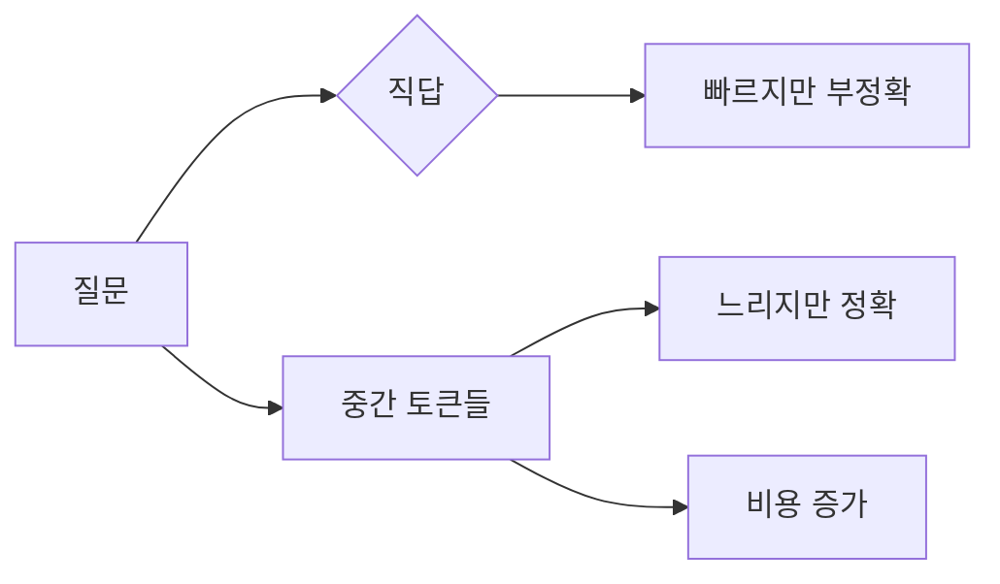
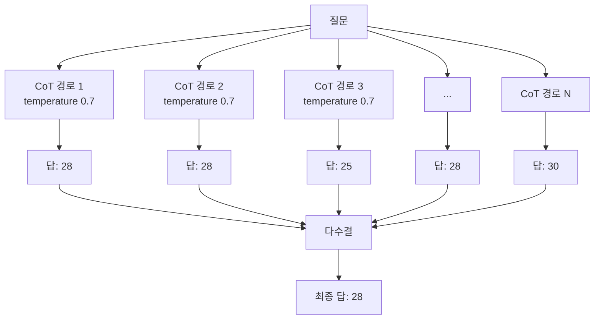
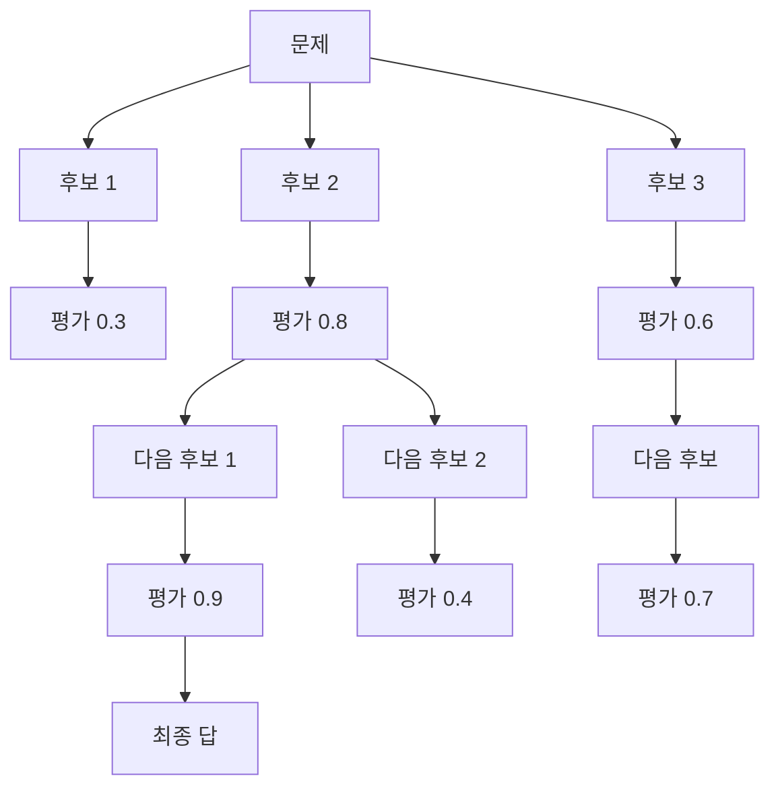
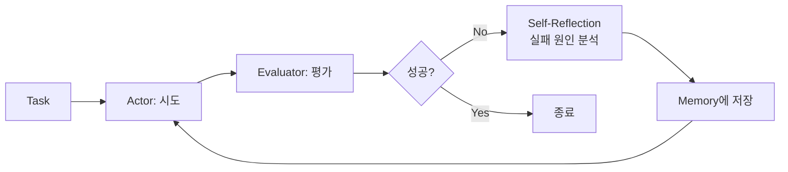

# LLM Reasoning 패턴과 모델

LLM에게 "수도가 어디야"라고 묻는 것과 "이 SQL이 왜 느린지 분석해줘"라고 묻는 것은 완전히 다른 작업이다. 앞은 사실을 꺼내오면 되지만 뒤는 가설을 세우고, 검증하고, 다른 가능성을 떠올려야 한다. 후자가 안 풀리니까 사람들이 만들어낸 게 reasoning 패턴이다. 처음엔 프롬프트 한 줄로 시작했다가, ReAct로 도구를 끼우고, Tree-of-Thoughts로 분기를 치다가, 결국 모델 자체가 추론을 학습한 o1·DeepSeek-R1·Claude Extended Thinking까지 왔다.

이 문서는 그 흐름을 따라가면서, 실무에서 reasoning을 켰을 때 토큰 비용이 어떻게 폭증하는지, 언제 끄는 게 나은지를 정리한다. "체인 오브 솟"이 만능이 아니라는 걸 토큰 청구서를 받아본 사람은 안다.

## 1. Reasoning이 왜 필요한가

GPT-3 시절에 발견된 현상이 있다. "다음 문제를 풀어라"라고 시키면 틀리는데, "단계별로 생각해보자"라고 한 줄 추가하면 정답률이 올라간다. 모델이 한 번에 답을 뱉는 대신 중간 사고 과정을 토큰으로 풀어내면 정확해진다.

이유는 단순하다. Transformer의 forward pass는 토큰 한 개당 고정된 양의 연산만 한다. 복잡한 문제를 한 토큰 안에 압축해서 풀 수 없다. 중간 단계를 토큰으로 출력하게 만들면 그 토큰들이 다시 입력으로 들어가면서 연산량이 곱절로 늘어난다. 모델이 "생각할 시간"을 토큰 길이로 사는 셈이다.



이게 reasoning의 본질이다. 정확도와 토큰 비용·지연을 맞바꾼다. 그래서 "언제 켜고 언제 끄는가"가 실무에서 가장 중요한 판단이 된다.

## 2. Chain-of-Thought (CoT)

가장 오래되고 단순한 패턴이다. 2022년 구글이 발표한 논문이 시작이었는데, 지금도 거의 모든 reasoning 기법의 베이스다.

### 2.1 Zero-shot CoT

프롬프트 마지막에 "Let's think step by step" 한 줄을 추가하는 게 전부다.

```python
prompt = """
문제: 한 가게에 사과가 23개 있다. 점심에 6개를 팔았고 오후에 새로 11개를 받았다.
지금 사과가 몇 개 남았는가?

Let's think step by step.
"""
```

모델이 알아서 "23 - 6 = 17, 17 + 11 = 28"을 풀어쓴다. 산수 문제 같은 다단계 추론에서 정확도가 30~40% 올라간다는 보고가 있었다.

실무에서 쓸 때 주의할 점이 있다. 최신 모델(GPT-4o, Claude Sonnet 4.6 이상)은 별 지시 없이도 어려운 문제에 자동으로 CoT를 한다. "step by step" 같은 마법 단어가 옛날 모델에서만 효과가 컸지, 요즘은 큰 차이가 안 나는 경우가 많다.

### 2.2 Few-shot CoT

예시를 직접 보여주는 방식이다. 추론 과정을 사람이 적은 예시 2~3개를 넣고, 그 다음에 실제 문제를 던진다.

```python
prompt = """
Q: Roger가 테니스공 5개를 가지고 있다. 공 2캔을 더 샀고 캔마다 3개가 들어있다. 지금 몇 개?
A: Roger는 5개로 시작했다. 2캔 × 3개 = 6개. 5 + 6 = 11개.

Q: 식당에 23개의 사과가 있다. 점심에 20개를 썼고 6개를 더 샀다. 지금 몇 개?
A: 23 - 20 = 3개. 3 + 6 = 9개.

Q: 한 가게에 사과가 23개 있다. 점심에 6개를 팔았고 오후에 새로 11개를 받았다. 지금 몇 개?
A:
"""
```

Zero-shot보다 안정적이지만 프롬프트가 길어진다. 도메인 특화 작업(법률 추론, 의료 진단)에서는 few-shot이 여전히 강하다. 모델이 그 도메인의 추론 형식을 모를 때 예시가 가이드 역할을 한다.

### 2.3 CoT가 안 통하는 경우

CoT를 만능으로 생각하면 사고가 난다. 사실 검색(특정 인물의 생일, 위키피디아 사실)은 CoT를 켜도 정답률이 안 오른다. 모델이 모르는 사실은 단계를 쪼개도 모른다. 오히려 그럴듯한 추론 과정을 만들어내면서 hallucination이 강화된다.

CoT가 효과적인 영역은 산수, 논리 퍼즐, 다단계 계획, 코드 디버깅처럼 "주어진 정보로 추론해서 도출하는" 작업이다. "기억해서 꺼내오는" 작업은 RAG로 해결해야지 CoT로는 안 풀린다.

## 3. Self-Consistency

CoT의 약점은 추론 경로가 한 번에 결정된다는 것이다. 모델이 첫 단계에서 삐끗하면 그대로 틀린 답까지 간다. Self-Consistency는 이걸 다수결로 보정한다.



같은 질문을 temperature를 올려서 N번 돌리고, 가장 자주 나온 답을 채택한다. 보통 N=5~40 범위에서 쓴다. GSM8K 같은 산수 벤치마크에서 단일 CoT 대비 10~15%p 정확도가 더 오른다.

대가는 명확하다. 비용이 N배가 된다. 응답 시간도 병렬로 돌리지 않으면 N배 늘어난다.

```python
async def self_consistency(question: str, n: int = 10) -> str:
    tasks = [
        llm.complete(question, temperature=0.7)
        for _ in range(n)
    ]
    responses = await asyncio.gather(*tasks)
    answers = [extract_answer(r) for r in responses]
    return Counter(answers).most_common(1)[0][0]
```

병렬 호출로 지연은 줄여도 토큰 비용은 그대로 N배다. 정답률이 5%p 오르는 데 비용 10배를 쓸 가치가 있는지는 작업에 따라 다르다. 의료 진단처럼 한 번 틀리면 치명적인 곳에서나 정당화된다.

### 3.1 실무 함정

Self-Consistency를 적용했는데 정확도가 안 오르는 경우가 있다. 원인은 보통 두 가지다.

첫째, temperature가 너무 낮으면 N번 돌려도 거의 같은 답이 나온다. 다양성이 없으니 다수결이 의미가 없다. 0.5~0.9 사이를 권장한다.

둘째, 답을 정규화하지 않으면 "28", "28개", "28 apples"가 다 다른 답으로 카운트된다. extract_answer 함수에서 숫자만 뽑거나, 모델에게 "최종 답은 한 줄에 숫자만 적어라"라고 강제해야 한다.

## 4. ReAct (Reasoning + Acting)

CoT는 모델 머릿속에서만 돈다. 외부 정보가 필요하면 못 푼다. "오늘 비트코인 가격이 얼마야"는 모델 가중치에 없다. ReAct는 추론 도중 도구를 호출해서 외부 정보를 끌어온다.

기본 루프는 Thought → Action → Observation의 반복이다.

```
Thought: 비트코인 현재가가 필요하다. 검색 도구를 쓴다.
Action: search("bitcoin price today")
Observation: 95,432 USD
Thought: 한화로 환산해야 한다. 환율 도구를 쓴다.
Action: get_exchange_rate("USD", "KRW")
Observation: 1342.5
Thought: 95432 × 1342.5 = 128,117,460
Final Answer: 약 1억 2,811만 원
```

이 루프가 LangChain, AutoGPT, 그리고 지금의 Claude Code 같은 agent harness의 뿌리다. 도구 호출과 추론을 같은 토큰 스트림에 섞어서 모델이 다음 행동을 결정하게 한다.

### 4.1 구현 시 주의점

ReAct 루프를 직접 구현해보면 몇 가지 함정이 있다.

**무한 루프 방어.** 모델이 같은 도구를 계속 부르거나, Observation을 무시하고 같은 Thought를 반복할 수 있다. 최대 step 수(보통 10~20)로 강제 종료해야 한다.

**도구 출력 잘림.** 검색 도구가 10KB 텍스트를 뱉으면 그게 그대로 context에 쌓인다. 5~6번 호출하면 context window가 터진다. Observation을 요약하거나, 모델이 필요한 부분만 추출하게 한 다음에 다음 step에 넣어야 한다.

**Action 파싱 실패.** 모델이 `Action: search("query")` 형식을 어길 때가 있다. JSON 모드나 function calling을 지원하는 API를 쓰면 파싱 안정성이 올라간다. 텍스트 정규식으로 파싱하는 건 프로토타입까지만 권한다.

```python
async def react_loop(question: str, tools: dict, max_steps: int = 10):
    context = f"Question: {question}\n"
    for step in range(max_steps):
        response = await llm.complete(
            context + "Thought:",
            stop=["Observation:"],
        )
        context += response

        if "Final Answer:" in response:
            return extract_final_answer(response)

        action = parse_action(response)
        if not action:
            context += "\nObservation: Action 형식 오류. 다시 시도.\n"
            continue

        result = await tools[action.name](**action.args)
        context += f"\nObservation: {truncate(result, 2000)}\n"

    return "최대 step 초과"
```

### 4.2 Function calling이 ReAct를 흡수했다

OpenAI가 2023년에 function calling을 정식 API로 내놓으면서 ReAct를 수동으로 짜는 일은 줄었다. 모델이 텍스트로 "Action: ..."를 뱉는 대신, 정형화된 tool_call을 API 응답에 직접 포함시킨다. 파싱 실패가 사라지고, 병렬 도구 호출도 지원된다.

지금은 Anthropic, OpenAI, Google이 다 비슷한 tool use API를 제공한다. ReAct의 개념은 그대로지만, 텍스트 파싱이 SDK 안으로 들어갔다.

## 5. Tree-of-Thoughts (ToT)

CoT는 한 줄기로 추론한다. ToT는 분기를 친다. 각 단계에서 여러 후보를 생성하고, 평가해서 좋은 가지만 남기고, 다음 단계로 간다.



게임 24(주어진 숫자 4개로 사칙연산해서 24 만들기) 같은 탐색 문제에서 강하다. CoT의 정답률 4%가 ToT로 74%까지 올라간 보고가 있다.

### 5.1 실무 적용은 거의 못 본다

흥미로운 기법이지만 프로덕션에서 본 적이 거의 없다. 이유가 명확하다.

**비용이 폭발한다.** depth 5, branch 3이면 한 문제당 최대 243개 분기를 평가한다. 각 분기마다 LLM 호출이니까 단일 CoT 대비 100배 가까운 비용이 나온다.

**평가 함수 만들기가 어렵다.** 각 분기를 LLM으로 평가하면 그 자체가 또 추론이라 비용이 더 늘어난다. 도메인 특화 점수 함수(체스 평가, 산수 검증)가 있으면 가능하지만, 자유 텍스트 작업에는 평가가 곧 또 다른 LLM 호출이다.

**Reasoning 모델이 ToT를 대체했다.** o1, DeepSeek-R1이 내부에서 비슷한 탐색을 하면서 결과만 뱉기 때문에, 외부에서 ToT를 짜는 동기가 줄었다.

ToT는 학술 벤치마크나 매우 특수한 탐색 문제(수학 정리 증명, 합성 경로 탐색)에서만 살아남았다. 일반 백엔드 서비스에서는 거의 안 쓴다.

## 6. Reflexion

Reflexion은 실패에서 배우는 패턴이다. 작업을 시도하고, 결과를 평가하고, 평가 결과를 자연어 피드백으로 저장해서 다음 시도에 컨텍스트로 넣는다.



코드 생성 벤치마크 HumanEval에서 GPT-4 단발 호출이 80%대였는데, Reflexion을 붙이면 90%대로 올라갔다. 테스트 실행 → 실패 메시지 분석 → 코드 수정 사이클이 자동으로 돈다.

실무에서 Cursor의 agent 모드, Claude Code의 다단계 작업, ChatGPT의 Code Interpreter가 모두 Reflexion 변형이다. 코드를 짜고, 실행하고, 에러를 보고, 다시 짠다. 사용자는 이 루프가 돌고 있는 줄도 모르고 결과만 본다.

### 6.1 Reflexion 구현 시 함정

**무한 반복.** 같은 에러로 같은 수정을 반복하는 경우가 흔하다. 같은 self-reflection이 두 번 나오면 멈추는 휴리스틱이 필요하다.

**평가가 비싸다.** 코드라면 테스트 실행이 평가다. 자유 텍스트(에세이 작성)에서는 평가 자체가 LLM 호출이라 비용 부담이 크다.

**메모리 누적.** N번째 시도 때 1~(N-1)번째 reflection이 다 context에 쌓인다. 3번 이상 돌면 context가 빠르게 비대해진다. 최근 3개 reflection만 유지하는 식으로 윈도우를 둬야 한다.

## 7. Reasoning 모델: o1, DeepSeek-R1, Claude Extended Thinking

2024년 9월 OpenAI o1이 나오면서 게임이 바뀌었다. 프롬프트로 reasoning을 유도하는 게 아니라, 모델 자체가 reasoning을 학습했다. 사용자가 "step by step"을 안 적어도 모델이 알아서 길게 생각한다.

### 7.1 o1 시리즈 (OpenAI)

o1은 강화학습으로 reasoning을 학습한 모델이다. 응답 전에 내부적으로 "reasoning tokens"를 만든다. 이 토큰은 사용자에게 안 보이지만 과금된다.

```
사용자 입력 → [숨겨진 reasoning 1000~50000 토큰] → 최종 응답 200 토큰
```

체감으로는 응답 시간이 5~60초로 늘어난다. 단순한 질문에 30초씩 기다리는 게 화면에서 보인다. 비용은 일반 GPT-4o 대비 4~6배 정도 더 비싸다(reasoning 토큰 + 응답 토큰 모두 과금).

o1이 잘 푸는 문제: 수학 올림피아드, 코딩 콘테스트, 다단계 논리 퍼즐, 복잡한 SQL 디버깅. 잘 못 푸는 문제: 사실 검색, 짧은 분류, 대화형 챗봇 응답.

### 7.2 DeepSeek-R1

2025년 초 DeepSeek이 R1을 오픈소스로 공개했다. o1급 성능을 RL만으로 달성했다고 주장했고, 가중치도 풀어서 화제가 됐다. 671B MoE 모델인데 활성 파라미터는 37B다.

핵심은 reasoning trace를 사용자가 볼 수 있다는 점이다. o1은 reasoning을 숨기지만 R1은 `<think>...</think>` 블록으로 노출한다. 디버깅하기 좋고, 모델이 어디서 틀렸는지 추적할 수 있다.

실무에서 자체 호스팅이 가능한 게 큰 차이다. API에 의존하지 않고, 데이터를 외부로 안 보내고 싶은 기업이 R1을 골랐다. 다만 671B를 띄우려면 H100 8장 정도가 필요해서 운영 비용은 크다. Distill 버전(R1-Distill-Qwen-32B 등)이 현실적인 선택지다.

### 7.3 Claude Extended Thinking

Anthropic이 Claude 3.7 Sonnet에 도입한 기능이다. API 파라미터로 thinking budget을 토큰 수로 지정한다.

```python
response = anthropic.messages.create(
    model="claude-sonnet-4-6",
    max_tokens=8192,
    thinking={
        "type": "enabled",
        "budget_tokens": 10000,
    },
    messages=[{"role": "user", "content": "..."}],
)
```

budget_tokens가 thinking에 쓸 최대 토큰 수다. 모델이 그 안에서 알아서 사고하고, 끝나면 응답을 생성한다. 짧은 작업은 1024 토큰, 어려운 수학 문제는 32768 토큰까지 줄 수 있다.

o1과 다른 점은 thinking 내용이 응답에 포함돼서 볼 수 있다는 것이다. R1처럼 디버깅 가능하다. 또 thinking 토큰을 캐싱할 수 있어서 같은 컨텍스트에 여러 질문할 때 비용을 아낀다.

### 7.4 세 모델 비교

| 항목 | o1 | DeepSeek-R1 | Claude Extended Thinking |
|------|-----|-------------|--------------------------|
| Reasoning 노출 | 숨김 | `<think>` 노출 | 응답에 포함 |
| 자체 호스팅 | 불가 | 가능(오픈소스) | 불가 |
| Budget 제어 | reasoning_effort(low/medium/high) | 자동 | budget_tokens 정밀 제어 |
| 일반 모델 대비 비용 | 4~6배 | API 기준 1.5~3배 | thinking 토큰만큼 증가 |
| 응답 지연 | 5~60초 | 3~40초 | 2~30초(budget에 따라) |
| Streaming | 불가 또는 reasoning 끝난 뒤 | 가능 | 가능 |

## 8. Reasoning을 켜야 할 때와 끄는 게 나을 때

이게 실무에서 가장 중요한 부분이다. Reasoning은 무조건 좋은 게 아니다. 잘못 켜면 비용만 날린다.

### 8.1 켜야 하는 작업

- 다단계 수학·논리 추론(SQL 쿼리 플랜 분석, 알고리즘 설계)
- 코드 디버깅(스택 트레이스 → 원인 추적)
- 복잡한 문서 요약(법률 문서, 논문)
- 다중 제약 만족(스케줄링, 자원 배분)
- 에이전트의 plan 단계(다음 step을 무엇으로 할지 결정)

### 8.2 끄는 게 나은 작업

- 분류(스팸·정상, 감성 분석)
- 단순 추출(이메일에서 이름·전화번호 뽑기)
- 사실 검색(고객 정보 조회, 위키 사실)
- 짧은 대화 응답(챗봇의 인사, 단답)
- 번역(특히 짧은 텍스트)
- 형식 변환(JSON ↔ YAML)

이런 작업에 reasoning을 켜면 어떻게 되는지 실제로 본 사례가 있다. 분류 작업(스팸 감지) API에 실수로 o1을 연결했는데, 메시지 한 건당 50초가 걸리고 비용이 평소의 30배가 나왔다. 정확도는 GPT-4o 대비 1%p도 안 올랐다. 단순 분류는 모델이 한 번에 답을 알고 있어서 추가 사고가 무의미하다.

### 8.3 판단 기준

작업을 받았을 때 "사람이 이 문제를 풀려면 종이에 메모하면서 30초 이상 생각해야 하는가"를 따져보면 된다.

- 1초 안에 답이 나오는 작업 → reasoning 끄기
- 종이에 적어가며 풀어야 하는 작업 → reasoning 켜기
- 애매한 작업 → A/B 테스트로 비교

A/B 테스트가 중요한 이유는 reasoning이 도움이 안 되는데도 약간의 정확도 상승이 있어서 "그래도 켜는 게 낫네"라고 착각하기 쉽기 때문이다. 비용과 지연을 같이 측정해야 한다.

## 9. 토큰 비용 폭증 사례

Reasoning을 켰을 때 비용이 어떻게 폭발하는지 구체적인 사례를 보자.

### 9.1 사례 1: 고객 지원 챗봇에 o1 적용

배경: 응답 품질을 높이려고 GPT-4o에서 o1으로 교체.

결과:
- 문의 한 건당 입력 토큰 800, 출력 토큰 400은 동일
- 그런데 reasoning 토큰이 평균 3000~8000개 추가
- 토큰 비용: 일 평균 $40 → $480 (12배)
- 응답 시간: 3초 → 35초 (사용자 이탈률 증가)
- 응답 품질 만족도: 4.2/5 → 4.3/5 (개선 미미)

원인: 고객 문의는 대부분 사실 조회·간단한 안내라서 reasoning이 무의미했다. 1주일 만에 롤백했다.

### 9.2 사례 2: 코드 리뷰 에이전트의 무한 reasoning

배경: PR 리뷰 자동화 에이전트를 ReAct + reasoning 모델로 구성.

결과:
- PR 한 건당 평균 reasoning 토큰 80,000개
- 큰 PR(파일 50개+) 에서는 500,000 토큰 초과
- 한 건당 비용 $30 발생
- 월 PR 1000건 처리 시 $30,000

원인: ReAct loop의 각 step마다 reasoning 모델이 호출되니까 토큰이 누적됐다. 게다가 모델이 같은 파일을 여러 번 다시 읽으면서 reasoning을 반복했다.

해결: plan 단계에서만 reasoning 켜고, 실제 코드 읽기·diff 분석은 일반 모델로 처리. step별로 모델을 다르게 쓰는 router를 도입해서 비용이 1/5로 떨어졌다.

### 9.3 사례 3: Claude Extended Thinking budget 미설정

배경: 문서 요약 API에 thinking 켜고 budget을 max(32768)로 설정.

결과:
- 짧은 문서(2페이지) 요약에도 thinking 25000 토큰 사용
- 짧은 문서는 thinking 1000 토큰이면 충분한데 모델이 budget까지 채움
- 비용이 예상 대비 15배

해결: 입력 토큰 길이 기반으로 budget 동적 설정. 입력 1000 토큰 미만은 thinking 1024, 5000 토큰 미만은 4096, 그 이상만 16384. 평균 비용이 1/4로 줄었다.

## 10. Reasoning + 캐싱 + Streaming 조합

Reasoning 모델을 쓸 때 비용·지연을 줄이는 실무 기법이 몇 가지 있다.

**Prompt caching.** 같은 시스템 프롬프트로 여러 질문을 처리할 때, 시스템 프롬프트와 reasoning trace 일부를 캐싱한다. Anthropic은 prompt cache로 입력 토큰 비용을 90% 절감한다. OpenAI도 자동 캐싱을 지원한다.

**Streaming thinking.** Claude Extended Thinking은 thinking 토큰을 스트리밍할 수 있다. UI에 "생각하는 중..." 표시를 띄우면서 첫 응답까지의 체감 지연을 줄인다.

**Reasoning effort 단계화.** OpenAI는 reasoning_effort를 low/medium/high로 제공한다. 기본은 medium인데, 간단한 작업은 low로 떨어뜨리면 비용·지연이 절반으로 준다.

```python
response = openai.chat.completions.create(
    model="o1",
    messages=[{"role": "user", "content": question}],
    reasoning_effort="low",
)
```

**Router 패턴.** 들어온 요청의 복잡도를 작은 모델로 먼저 판단하고, 단순하면 GPT-4o로, 복잡하면 o1으로 보낸다. 라우팅 비용은 작아서 전체적으로 70~80% 절감되는 경우가 흔하다.

## 11. Reasoning이 hallucination을 줄이는가

직관적으로는 추론을 길게 하면 사실 검증을 더 잘할 것 같다. 실제로는 그렇지 않다.

Reasoning 모델은 모르는 사실에 대해 더 그럴듯한 hallucination을 만든다. CoT가 한 번 잘못된 가설로 출발하면, 그 가설을 정당화하는 추론 단계를 만들어내면서 hallucination이 강화된다. "왜 이게 맞는가"를 모델이 스스로 설득하는 셈이다.

[ai-hallucination](AI_Hallucination.md) 문서에서 다루는 패턴이 reasoning에서 더 심해지기도 한다. 사실 영역은 RAG로 풀고, 그 위에 reasoning을 얹어야 한다. Reasoning만으로 정확도를 끌어올리려 하지 마라.

## 12. 정리

Reasoning 패턴은 CoT → Self-Consistency → ReAct → ToT → Reflexion으로 발전해왔고, 지금은 o1·DeepSeek-R1·Claude Extended Thinking 같은 모델이 이걸 가중치 안으로 흡수했다. 외부에서 프롬프트로 짜던 기법이 모델 내부 동작이 됐다.

실무 판단의 핵심은 두 가지다. 첫째, 작업이 진짜 추론을 필요로 하는가. 분류·추출·검색은 끄는 게 낫다. 둘째, 토큰 비용·지연·정확도 향상을 같이 측정하는가. 정확도가 1%p 올라도 비용이 10배면 의미가 없다.

Reasoning은 도구지 만능약이 아니다. 사람이 머리 싸매고 풀어야 하는 문제에만 켜라. 나머지는 일반 모델이 더 빠르고 싸다.
