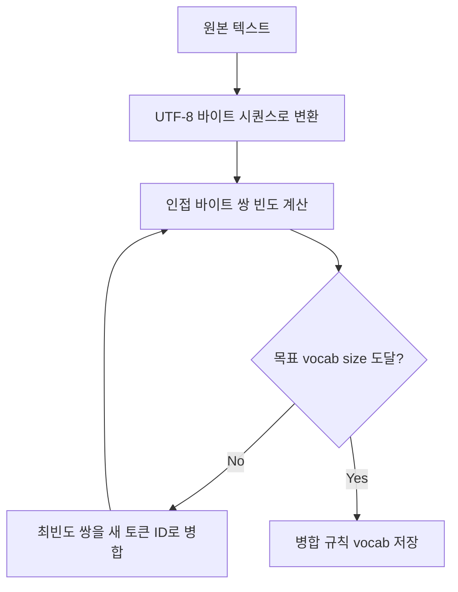

# LLM 토크나이저 — BPE 내부 동작과 병리 현상

LLM.md에 BPE 개요는 있지만, Karpathy의 'Let's build the GPT Tokenizer' 강의에서 다루는 구현 수준의 내용은 없다. 이 문서는 BPE가 내부에서 어떻게 작동하는지, 그 결과로 어떤 병리 현상이 발생하는지를 다룬다. 토크나이저를 블랙박스로 쓰다가 이상한 동작을 만나면 여기서 원인을 찾을 수 있다.

---

## BPE 알고리즘 단계별 동작

BPE(Byte Pair Encoding)는 원래 데이터 압축 알고리즘이었다. 1994년에 제안된 방식을 2015년 Sennrich et al.이 NLP에 적용했고, GPT-2부터 본격적으로 LLM에 사용됐다.

핵심 아이디어는 단순하다. 자주 함께 등장하는 바이트(또는 문자) 쌍을 하나의 새로운 토큰으로 묶는 과정을 반복한다. 시작은 개별 바이트(0~255)고, 끝은 목표 vocabulary size에 도달했을 때다.

### 학습 과정 (Training)

```python
def get_stats(ids: list[int]) -> dict[tuple, int]:
    counts = {}
    for pair in zip(ids, ids[1:]):
        counts[pair] = counts.get(pair, 0) + 1
    return counts

def merge(ids: list[int], pair: tuple, idx: int) -> list[int]:
    new_ids = []
    i = 0
    while i < len(ids):
        if i < len(ids) - 1 and ids[i] == pair[0] and ids[i+1] == pair[1]:
            new_ids.append(idx)
            i += 2
        else:
            new_ids.append(ids[i])
            i += 1
    return new_ids

# 학습 텍스트 예시
text = "aaabdaaabac"
tokens = list(text.encode("utf-8"))  # [97, 97, 97, 98, 100, 97, 97, 97, 98, 97, 99]

vocab_size = 276  # 256 기본 바이트 + 20번 병합
merges = {}
num_merges = vocab_size - 256

for i in range(num_merges):
    stats = get_stats(tokens)
    pair = max(stats, key=stats.get)  # 가장 빈도 높은 쌍
    idx = 256 + i
    tokens = merge(tokens, pair, idx)
    merges[pair] = idx
    print(f"merge {i+1}: {pair} -> {idx}")
```

위 예시에서 `aa` 쌍이 가장 빈번하게 등장하므로 첫 번째로 병합된다. 병합된 결과에서 다시 빈도를 세고, 그 결과에서 또 병합하는 식으로 반복된다.

실제 GPT-4에서 사용하는 cl100k_base의 vocab size는 100,277이다. 기본 256바이트에서 시작해서 약 10만 번의 병합 규칙이 적용된다.



### 인코딩 과정 (Inference)

학습 시 저장한 `merges` 딕셔너리를 순서대로 적용한다. 순서가 중요하다. 학습 때 첫 번째로 병합된 쌍이 인코딩 때도 가장 먼저 적용된다.

```python
def encode(text: str, merges: dict) -> list[int]:
    tokens = list(text.encode("utf-8"))
    while len(tokens) >= 2:
        stats = get_stats(tokens)
        # merges 딕셔너리에서 가장 낮은 인덱스(먼저 학습된) 쌍을 선택
        pair = min(stats, key=lambda p: merges.get(p, float("inf")))
        if pair not in merges:
            break
        tokens = merge(tokens, pair, merges[pair])
    return tokens

def decode(ids: list[int], vocab: dict) -> str:
    tokens = b"".join(vocab[idx] for idx in ids)
    return tokens.decode("utf-8", errors="replace")
```

---

## Byte-level BPE

GPT-2에서 도입된 방식이다. 이전 BPE 구현들은 유니코드 문자 단위에서 시작했는데, 그러면 학습 데이터에 없는 문자가 나왔을 때 OOV(Out-of-Vocabulary) 문제가 생겼다. Byte-level BPE는 0~255 바이트 전체를 기본 vocab으로 사용해서 이 문제를 원천 차단한다.

어떤 UTF-8 텍스트든 바이트 시퀀스로 표현 가능하므로, 이론상 OOV가 발생하지 않는다. 대신 다른 문제가 생긴다.

한글 하나는 UTF-8에서 3바이트다. 영어 소문자는 1바이트다. 영어 중심 코퍼스로 학습한 토크나이저는 영어 바이트 쌍 병합은 많이 일어나지만 한국어 바이트 쌍 병합은 상대적으로 적게 일어난다. 결과적으로 한글 한 글자가 2~4개 토큰으로 쪼개지는 경우가 생긴다.

GPT-2 논문에서는 이 문제를 완화하기 위해 원시 바이트가 아닌 256개의 유니코드 문자로 매핑된 바이트를 사용한다. `!` 같은 일반 ASCII 문자는 그대로 표현되고, 공백 같은 제어 문자는 보기 좋은 유니코드 문자로 매핑된다. `tiktoken`의 인코딩을 직접 확인해보면 이 매핑 테이블을 볼 수 있다.

---

## 토크나이저 병리 현상

Karpathy 강의에서 가장 흥미로운 부분이다. 토크나이저가 단순히 텍스트를 숫자로 바꾸는 것처럼 보이지만, 실제로는 이 변환 과정에서 모델이 근본적으로 할 수 없는 일들이 만들어진다.

### SolidGoldMagikarp

2023년 Lesser et al. 논문에서 발견된 현상이다. GPT 토크나이저의 vocab에 `SolidGoldMagikarp`라는 토큰이 존재했다. 이 토큰이 입력에 포함되면 모델이 욕설을 출력하거나 완전히 무관한 내용을 반복하는 등 예측 불가능한 동작을 보였다.

원인은 토크나이저 학습 데이터와 모델 학습 데이터의 불일치다. `SolidGoldMagikarp`는 Reddit의 특정 유저명이었는데, 토크나이저를 학습한 코퍼스에는 이 유저의 게시물이 포함됐지만 실제 LLM 사전학습 데이터에서는 빠졌다.

결과적으로 vocab에는 해당 토큰 ID가 존재하지만, 그 토큰에 대응하는 임베딩 벡터가 학습 중에 한 번도 업데이트되지 않았다. 임베딩 테이블의 해당 행이 랜덤 초기화된 상태 그대로 남아있는 것이다. 이 토큰이 입력되면 모델이 의미 있는 벡터 표현을 찾지 못하고 이상한 동작을 한다.

현재 GPT-4 이후 모델에서는 이 특정 토큰 문제는 해결됐지만, 개념적으로 이런 종류의 "ghost token"은 모든 tokenizer-model 조합에서 잠재적으로 존재할 수 있다.

### 글자 수 세기 오류

"strawberry에서 r이 몇 개야?"라는 질문에 GPT 계열 모델이 자주 틀린다. 이유가 바로 토크나이저에 있다.

```python
import tiktoken

enc = tiktoken.encoding_for_model("gpt-4")
word = "strawberry"
tokens = enc.encode(word)

for t in tokens:
    print(repr(enc.decode([t])))
# 'st'
# 'rawberry'
```

모델 입장에서 "strawberry"는 `st`와 `rawberry`라는 두 토큰이다. 모델은 개별 문자가 아닌 토큰 단위로 입력을 본다. `rawberry` 안에 `r`이 몇 개 있는지 세는 것은 모델에게 해당 토큰을 다시 문자 단위로 분해해서 분석하라는 요구인데, 이런 문자 수준 분석은 모델이 잘 하도록 학습되지 않는다.

GPT-4o에서 이 문제가 개선됐다는 보고가 있는데, 더 나은 토크나이저와 코드 학습 데이터 증가가 이유로 추정된다. 하지만 완전히 해결된 건 아니다.

### 산술 오류

숫자 토크나이징도 일관성이 없다.

```python
enc = tiktoken.encoding_for_model("gpt-4")

for num in ["1", "12", "123", "1234", "12345", "123456"]:
    tokens = enc.encode(num)
    print(f"{num}: {[enc.decode([t]) for t in tokens]}")

# 1: ['1']
# 12: ['12']
# 123: ['123']
# 1234: ['1234']
# 12345: ['12345']
# 123456: ['123456']
```

숫자 자체는 그나마 일관적으로 처리되지만, 큰 수 계산에서 문제가 생기는 건 자릿수 정렬이 토큰 경계와 맞지 않기 때문이다. 덧셈을 할 때 인간은 오른쪽 자리부터 올림수를 계산하는데, 모델은 왼쪽에서 오른쪽으로 토큰을 처리한다. 수의 표현 방식과 연산 방향이 근본적으로 다르다.

이 때문에 수학 계산이 필요한 경우 LLM에 직접 계산을 시키기보다 코드 실행(Python interpreter tool call)을 쓰는 게 훨씬 신뢰도가 높다.

### 한국어 토큰 비효율

실제로 측정해보면 차이가 크다.

```python
import tiktoken

enc = tiktoken.encoding_for_model("gpt-4o")

texts = {
    "영어": "The server processes the incoming HTTP request.",
    "한국어": "서버가 들어오는 HTTP 요청을 처리합니다.",
}

for lang, text in texts.items():
    tokens = enc.encode(text)
    print(f"{lang}: {len(text)}자 → {len(tokens)}토큰 (비율: {len(tokens)/len(text):.2f})")

# 영어: 47자 → 9토큰 (비율: 0.19)
# 한국어: 29자 → 22토큰 (비율: 0.76)
```

같은 의미를 표현하는데 한국어가 토큰을 훨씬 많이 쓴다. 이게 실무에서 의미하는 바는 두 가지다.

첫째, API 비용이다. OpenAI API는 토큰당 과금이고, 한국어 문서는 영어 대비 같은 정보량에 더 많은 토큰을 소비한다.

둘째, 컨텍스트 창 활용이다. 128K 컨텍스트라고 해도 한국어 텍스트는 영어 대비 2~4배 빠르게 컨텍스트를 채운다. RAG 파이프라인에서 한국어 청크 크기를 영어 기준으로 잡으면 생각보다 훨씬 적은 내용이 컨텍스트에 들어간다.

GPT-4o는 이전 모델 대비 한국어 토큰 효율이 개선됐다. 하지만 한국어 중심 태스크라면 SentencePiece 기반의 다국어 모델(Llama 3, Gemma 2)이 토큰 효율 면에서 유리한 경우가 있다.

---

## tiktoken 실무 사용

```python
import tiktoken

# 모델명으로 인코딩 가져오기
enc = tiktoken.encoding_for_model("gpt-4o")

# 직접 인코딩 이름으로도 가능
# enc = tiktoken.get_encoding("o200k_base")  # gpt-4o
# enc = tiktoken.get_encoding("cl100k_base")  # gpt-4, gpt-3.5-turbo

text = "SELECT * FROM users WHERE id = 1;"

tokens = enc.encode(text)
print(f"토큰 수: {len(tokens)}")
print(f"토큰 ID: {tokens}")

# 토큰별 텍스트 확인 (디버깅용)
for token_id in tokens:
    print(f"  {token_id:6d} → {enc.decode([token_id])!r}")
```

### 비용 계산

API 호출 전에 토큰 수를 추정해서 예산 초과를 방지할 때 쓴다.

```python
def count_tokens(messages: list[dict], model: str = "gpt-4o") -> int:
    enc = tiktoken.encoding_for_model(model)
    total = 0
    for message in messages:
        # 메시지 당 overhead가 있다 (role, separator 등)
        total += 4
        for key, value in message.items():
            total += len(enc.encode(str(value)))
            if key == "name":
                total -= 1
    total += 2  # reply priming
    return total

messages = [
    {"role": "system", "content": "You are a helpful assistant."},
    {"role": "user", "content": "한국어로 설명해줘."},
]
print(count_tokens(messages))
```

### 긴 텍스트 청킹

단순 문자 수로 자르면 토큰 경계에서 UTF-8 디코딩 오류가 날 수 있다. 토큰 단위로 자르는 게 안전하다.

```python
def chunk_by_tokens(
    text: str,
    max_tokens: int,
    model: str = "gpt-4o",
    overlap: int = 50,
) -> list[str]:
    enc = tiktoken.encoding_for_model(model)
    tokens = enc.encode(text)

    chunks = []
    start = 0
    while start < len(tokens):
        end = min(start + max_tokens, len(tokens))
        chunk_tokens = tokens[start:end]
        chunks.append(enc.decode(chunk_tokens))
        start = end - overlap  # overlap으로 문맥 연결

    return chunks
```

### 특수 토큰 처리

`<|endoftext|>` 같은 특수 토큰은 기본 `encode()`에서 에러가 난다.

```python
# 기본 encode는 특수 토큰을 거부한다
# enc.encode("<|endoftext|>")  # ValueError

# 허용하려면 명시적으로 지정
tokens = enc.encode(
    "<|endoftext|> some text",
    allowed_special={"<|endoftext|>"}
)

# 또는 전체 허용
tokens = enc.encode(text, allowed_special="all")
```

---

## 토크나이저 선택이 모델 성능에 미치는 영향

토크나이저는 종종 모델 선택의 부산물처럼 취급되지만, 성능에 직접 영향을 준다.

### Attention 비용

Transformer의 Self-Attention은 시퀀스 길이의 제곱에 비례하는 비용을 쓴다(O(n²)). 토크나이저가 같은 텍스트를 더 많은 토큰으로 쪼개면, 모델이 더 긴 시퀀스를 처리해야 하고 Attention 계산 비용이 증가한다.

vocab size가 작으면 각 텍스트가 더 많은 토큰으로 표현되고, vocab size가 크면 더 적은 토큰으로 표현된다. 하지만 vocab size를 무한정 늘릴 수는 없다. 임베딩 테이블 크기가 `vocab_size × embedding_dim`이기 때문에 메모리와 계산 비용이 선형으로 늘어난다.

GPT-2는 vocab size 50,257, GPT-4는 cl100k_base 기준 100,277, GPT-4o는 o200k_base 기준 200,019다. 점진적으로 늘어나는 추세고, 특히 다국어 지원을 위해 한 번에 크게 늘렸다.

### 언어별 학습 효율

같은 학습 데이터 크기라면, 토큰당 정보 밀도가 높을수록 모델이 더 많은 정보를 학습하는 셈이다. 한국어 텍스트가 동일 의미를 3배 많은 토큰으로 표현한다면, 영어 대비 학습 효율이 1/3이다.

이런 이유로 다국어 모델은 영어 외 언어 학습 데이터를 인위적으로 더 많이 포함시키거나, 각 언어에 맞는 토크나이저 설계에 공을 들인다. Llama 3에서 vocab size를 32K에서 128K로 늘린 것도 비영어 언어 지원 향상이 주요 목적이었다.

### 코드 특화 토크나이저

코드 모델(CodeLlama, Deepseek-Coder 등)은 코드 중심 코퍼스로 토크나이저를 학습하거나 기존 토크나이저에 코드 관련 병합 규칙을 추가한다. `    ` (들여쓰기 공백 4칸)이나 `->`, `=>` 같은 연산자가 단일 토큰이 된다. 일반 모델 토크나이저는 이런 코드 패턴을 여러 토큰으로 쪼개기 때문에 시퀀스가 길어지고 Attention 비용이 증가한다.

실제로 같은 Python 함수를 일반 토크나이저와 코드 특화 토크나이저로 인코딩하면 30~50% 토큰 수 차이가 나는 경우가 있다. 코드 생성 태스크에서 모델을 고를 때 토크나이저 특성을 확인하는 게 의미 있는 이유다.

### 언어 혼합 사용 시 주의

한국어 프롬프트에 영어 기술 용어가 섞이는 경우(실무에서 매우 흔하다), 토크나이저가 각 부분을 다른 밀도로 처리한다. 한국어 부분은 토큰이 많고, 영어 부분은 상대적으로 적다. 이로 인해 모델이 각 언어 부분에 할당하는 Attention이 토큰 수에 따라 다르게 분배된다.

프롬프트 설계 시 이 점을 고려하면, 특히 중요한 지시사항은 영어로 짧게 쓰는 쪽이 더 적은 토큰으로 더 강한 신호를 줄 수 있다.
