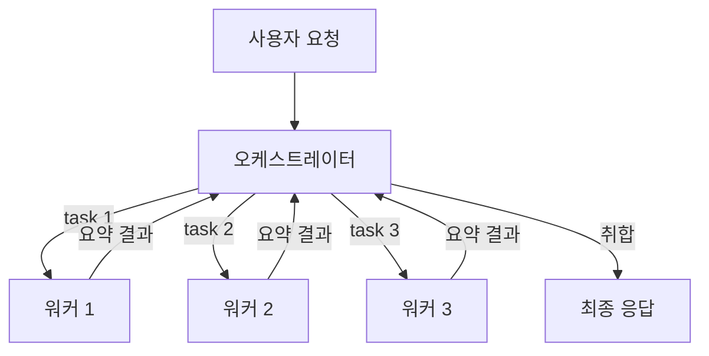

# 멀티 에이전트 시스템

## 이 문서의 범위

단일 에이전트 루프가 무엇인지, 서브에이전트로 컨텍스트를 격리하는 기본 동작은 [LLM_Agent.md](LLM_Agent.md)의 "멀티 에이전트 플래닝", "Subagent 패턴" 절에서 다룬다. 그 루프를 감싸는 런타임(권한, 후크, 토큰 예산 공유)은 [Agent_Harness.md](Agent_Harness.md)가 다룬다. 여기서는 그 위에서 **여러 에이전트를 어떻게 엮을지**만 다룬다. 오케스트레이터-워커 구조, 에이전트 간 통신, 팬아웃과 파이프라인의 선택, 결과 취합, 그리고 멀티 에이전트를 쓰면 안 되는 경우의 판단 기준이다.

먼저 분명히 해둘 게 있다. 멀티 에이전트는 단일 루프로 안 되는 작업을 억지로 풀려는 게 아니다. 단일 루프로 풀 수 있지만 **컨텍스트가 터지거나, 병렬화로 시간을 줄일 수 있거나, 관점을 분리하면 품질이 오르는** 작업에서만 의미가 있다. 이 전제를 잊으면 토큰만 몇 배 쓰고 결과는 더 나빠지는 시스템을 만들게 된다.

## 오케스트레이터-워커 구조

가장 기본이 되는 형태다. 메인 에이전트(오케스트레이터)가 작업을 쪼개서 워커 에이전트에 위임하고, 워커가 돌려준 결과를 모아 다음 행동을 결정한다.

```python
# 오케스트레이터의 한 턴
subtasks = decompose(user_request)        # 작업 분해
results = []
for task in subtasks:
    r = invoke_worker(task, agent_type="Explore")  # 워커에 위임
    results.append(r)                      # 요약된 결과만 받음
final = synthesize(results)               # 취합 후 최종 응답
```

여기서 오케스트레이터가 하는 일과 하지 않는 일을 구분하는 게 핵심이다.

오케스트레이터가 하는 일: 작업 분해, 어느 워커에 무엇을 줄지 결정, 워커 결과 취합, 사용자와의 최종 소통, 실패한 워커 재시도 판단.

오케스트레이터가 하지 않는 일: 실제 파일을 수백 개 읽는 것, grep 결과 수천 줄을 자기 컨텍스트에 쌓는 것, 워커가 이미 한 판단을 다시 하는 것.

이 분리가 무너지면 오케스트레이터가 "최종 책임자"가 아니라 "또 하나의 워커"가 된다. 그러면 컨텍스트 격리 효과가 사라진다. 실무에서 자주 보는 실수가 오케스트레이터 프롬프트에 "필요하면 직접 파일을 읽어서 확인해라"를 넣는 것이다. 이 한 줄 때문에 오케스트레이터가 워커에 위임하지 않고 직접 다 읽기 시작한다.



오케스트레이터가 워커보다 더 비싼 모델일 필요는 없다. 판단(분해·취합)은 좋은 모델, 단순 탐색·추출은 싼 모델로 워커를 돌리는 식으로 모델을 섞는 게 비용 면에서 유리한 경우가 많다. 다만 워커가 잘못된 요약을 올리면 오케스트레이터가 그걸 그대로 믿기 때문에, 워커 출력을 [구조화된 형식](Structured_Output.md)으로 강제해서 검증 가능하게 만드는 편이 안전하다.

## 컨텍스트 격리: 왜 워커 결과가 메인에 안 쌓이는가

서브에이전트의 존재 이유 절반은 컨텍스트 격리다. 이 메커니즘을 정확히 이해해야 멀티 에이전트를 제대로 쓸 수 있다.

워커가 100개 파일을 grep하고 read하면, 그 100개 파일의 내용은 **워커의 컨텍스트 윈도우**에 들어간다. 워커가 작업을 끝내고 오케스트레이터에 돌려주는 건 최종 텍스트 한 덩어리뿐이다. grep 결과 수천 줄, read한 파일 본문은 워커와 함께 사라진다. 오케스트레이터 컨텍스트에는 "이 모듈에서 deprecated API를 쓰는 파일은 A, B, C 세 개다" 같은 요약만 남는다.

이게 중요한 이유는 컨텍스트 윈도우가 유한하기 때문이다. 메인에서 직접 100개 파일을 읽으면 컨텍스트가 금방 차고, 그 뒤로는 압축이 일어나면서 앞부분 정보가 뭉개진다. 워커에 격리하면 메인은 깨끗한 상태로 다음 단계를 진행한다. 컨텍스트 윈도우의 한계와 압축 동작은 [LLM_Context_Window.md](LLM_Context_Window.md)에 정리돼 있다.

한 가지 함정. 격리는 양날의 검이다. 워커가 읽은 raw 데이터가 사라진다는 건, 오케스트레이터가 그 데이터를 직접 볼 수 없다는 뜻이다. 워커가 요약 단계에서 중요한 디테일을 빠뜨리면 오케스트레이터는 그걸 복구할 방법이 없다. 그래서 워커에 위임할 때는 "무엇을 반드시 결과에 포함시켜야 하는지"를 명시해야 한다. "관련 코드를 찾아라"가 아니라 "관련 함수의 파일 경로, 줄 번호, 시그니처를 포함해서 찾아라"처럼.

```python
# 나쁜 위임: 워커가 뭘 요약할지 모름
invoke_worker("이 코드베이스에서 인증 관련 코드를 찾아라")

# 좋은 위임: 결과에 들어가야 할 필드를 못박음
invoke_worker(
    "인증 관련 코드를 찾아라. 각 항목에 대해 "
    "{파일경로, 줄번호, 함수명, 어떤 인증 방식인지} 를 반환해라. "
    "코드 본문은 붙이지 말고 위 메타데이터만."
)
```

## 에이전트 간 핸드오프와 A2A 통신

오케스트레이터-워커는 별 모양(star) 구조다. 모든 통신이 오케스트레이터를 거친다. 그런데 에이전트끼리 직접 작업을 넘기는 패턴도 있다. 이걸 핸드오프(handoff)라고 부른다.

핸드오프는 한 에이전트가 "이건 내 역할이 아니다, 너한테 넘긴다"고 제어권을 통째로 다음 에이전트에 넘기는 것이다. 고객 응대 에이전트가 환불 요청을 받으면 환불 전담 에이전트로 대화를 넘기는 식이다. 오케스트레이터-워커와 다른 점은, 핸드오프는 보통 제어권 자체가 이동하고 원래 에이전트는 빠진다는 것이다. 위임은 워커가 끝나면 제어권이 오케스트레이터로 돌아온다.

```python
# 핸드오프: 제어권이 넘어가고 안 돌아옴
def triage_agent(message):
    if is_refund_request(message):
        return handoff_to("refund_agent", context=message)  # 여기서 끝, refund_agent가 대화를 이어받음
    if is_technical(message):
        return handoff_to("tech_agent", context=message)
    return answer(message)
```

핸드오프에서 가장 까다로운 건 **컨텍스트를 얼마나 넘기느냐**다. 너무 적게 넘기면 받는 에이전트가 맥락을 몰라서 사용자에게 같은 걸 다시 묻는다. 너무 많이 넘기면 받는 에이전트 컨텍스트가 처음부터 오염된다. 보통은 "지금까지의 대화 요약 + 넘기는 이유 + 다음 에이전트가 알아야 할 사실"만 추려서 넘긴다.

A2A(Agent-to-Agent)는 이 통신을 표준화하려는 흐름이다. 서로 다른 팀이, 서로 다른 프레임워크로 만든 에이전트가 같은 규약으로 작업을 주고받게 하는 게 목적이다. 에이전트가 자기 능력을 기술한 명세(어떤 작업을 받을 수 있는지)를 공개하고, 다른 에이전트가 그 명세를 보고 작업을 보내는 식이다. 도구를 표준화하는 [MCP](../MCP/MCP.md)가 "에이전트 ↔ 도구" 규약이라면, A2A는 "에이전트 ↔ 에이전트" 규약이라고 보면 된다. 둘은 경쟁 관계가 아니라 층이 다르다.

실무에서 A2A 같은 표준이 필요해지는 시점은 명확하다. 에이전트가 전부 한 코드베이스 안에 있고 같은 런타임에서 돈다면 그냥 함수 호출로 위임하면 된다. 표준 프로토콜은 오버헤드다. A2A가 의미를 갖는 건 에이전트들이 **다른 프로세스, 다른 팀, 다른 회사**에 흩어져 있을 때다. 사내 단일 서비스 안에서 A2A를 도입하는 건 대개 과설계다.

## 병렬 팬아웃 vs 순차 파이프라인

작업을 워커에 나눌 때 구조가 두 가지로 갈린다. 이걸 잘못 고르면 느려지거나 결과가 꼬인다.

### 병렬 팬아웃

서로 독립적인 작업을 동시에 던지고 전부 끝날 때까지 기다린다. 워커 사이에 의존성이 없을 때 쓴다.

```javascript
// 5개 모듈을 동시에 분석. 서로 아무 관련 없음.
const results = await parallel(
    modules.map(m => () => agent(`Analyze module ${m} for security issues`))
);
// 전부 끝나야 results가 채워짐 (배리어)
```

팬아웃의 이점은 시간이다. 워커 하나가 10초 걸리면 5개를 순차로 돌릴 때 50초인데, 병렬이면 가장 느린 워커 시간(약 10초)에 끝난다. 단, 동시 실행 수에는 상한이 있다(런타임이 보통 10~16개 정도로 제한한다). 작업을 100개 던져도 한 번에 도는 건 그만큼뿐이고 나머지는 큐에서 대기한다.

배리어가 함정이다. `parallel`은 모든 워커가 끝나야 반환한다. 워커 4개가 2초 만에 끝나도 1개가 30초 걸리면 전체가 30초 걸린다. 빠른 워커 4개가 28초를 그냥 노는 것이다. 워커별 처리 시간 편차가 크면 배리어는 손해다.

### 순차 파이프라인

각 항목을 여러 단계에 차례로 통과시킨다. 단계 사이에 의존성이 있을 때 쓴다. "찾기 → 고치기 → 테스트" 같은 흐름이다.

```javascript
// 각 파일이 독립적으로 3단계를 통과. 단계 사이 배리어 없음.
const results = await pipeline(
    files,
    f => agent(`Migrate ${f} to new API`, {isolation: 'worktree'}),
    migrated => agent(`Run tests for ${migrated.file}`),
    tested => agent(`If tests failed, fix: ${tested.errors}`)
);
```

파이프라인의 핵심은 **단계 사이에 전역 배리어가 없다**는 것이다. 파일 A가 3단계(테스트 수정)에 있을 때 파일 B는 아직 1단계(마이그레이션)에 있을 수 있다. 각 항목이 자기 속도로 전체 체인을 흐른다. 그래서 전체 시간이 "단계별 최댓값의 합"이 아니라 "가장 느린 단일 체인"에 가까워진다.

언제 무엇을 쓰는지는 의존성 하나로 갈린다.

| 상황 | 구조 |
|---|---|
| 작업들이 서로 독립, 결과를 한꺼번에 모아야 함 | 병렬 팬아웃(배리어) |
| 작업들이 단계적 의존, 각 항목이 독립적으로 흐름 | 순차 파이프라인 |
| 단계 N이 단계 N-1의 **모든** 결과를 봐야 함 (중복 제거, 0건 조기 종료) | 배리어가 정당함 |

마지막 줄이 중요하다. "중간에 flatten/map/filter가 필요하다"는 배리어의 이유가 안 된다. 그건 파이프라인 단계 안에서 처리하면 된다. 배리어가 정당한 건 단계 N이 이전 단계의 **전체 결과 집합**을 봐야 할 때뿐이다. 대표적으로 모든 워커가 찾은 항목을 모아 중복을 제거한 뒤 다음으로 넘기는 경우다.

## 결과 취합과 중복 제거

워커 여러 개가 각자 찾아온 결과에는 반드시 중복과 충돌이 섞인다. 이걸 정리하는 게 오케스트레이터의 일이다. 여기서 흔히 하는 실수가 **취합을 또 에이전트에 시키는** 것이다. 단순 중복 제거는 코드로 하는 게 빠르고 정확하다. LLM에 "이 목록에서 중복을 제거해라"를 시키면 느리고 가끔 멀쩡한 항목을 지운다.

```javascript
// 중복 제거는 코드로. 키를 정해서 Set으로.
const seen = new Set();
const deduped = allFindings.filter(f => {
    const key = `${f.file}:${f.line}`;   // 무엇이 "같은 것"인지 명시
    if (seen.has(key)) return false;
    seen.add(key);
    return true;
});
```

"무엇을 같은 것으로 볼지"(key)를 정하는 게 설계의 전부다. 파일+줄번호가 같으면 같은 발견인지, 아니면 설명 텍스트가 비슷하면 같은 건지. 의미 수준의 중복(표현은 다른데 같은 문제)까지 잡아야 한다면 그때는 LLM이나 [임베딩 유사도](Embeddings.md)가 필요하다. 단순 키로 잡히는 중복은 절대 LLM에 맡기지 마라.

탐색을 반복하는 루프에서 중복 제거의 기준을 잘못 잡으면 영영 안 끝난다. 흔한 버그가 "이미 확정한 항목"을 기준으로 중복을 거르는 것이다. 그러면 검증 단계에서 한 번 탈락한 항목이 다음 라운드에 또 올라오고, 또 탈락하고, 무한 반복된다. 중복 제거는 **확정 목록이 아니라 "지금까지 본 적 있는 모든 항목"**을 기준으로 해야 한다.

```javascript
const seen = new Set();      // 본 적 있는 모든 항목 (탈락한 것 포함)
const confirmed = [];        // 검증 통과한 항목
let dryRounds = 0;
while (dryRounds < 2) {       // 2라운드 연속 새 항목 없으면 종료
    const found = await runFinders();
    const fresh = found.filter(f => !seen.has(key(f)));  // seen 기준 (confirmed 아님)
    if (fresh.length === 0) { dryRounds++; continue; }
    dryRounds = 0;
    fresh.forEach(f => seen.add(key(f)));
    confirmed.push(...await verify(fresh));
}
```

## 멀티 에이전트를 써야 하는 경우와 쓰면 안 되는 경우

이게 이 문서에서 제일 중요한 부분이다. 멀티 에이전트는 공짜가 아니다. 에이전트 하나당 시스템 프롬프트가 다시 들어가고(캐시가 안 먹는 새 워커면 더), 위임·취합 오버헤드가 붙고, 디버깅이 어려워진다. 그만한 값을 하는지 따져야 한다.

멀티 에이전트가 단일 루프보다 유리한 경우는 세 가지로 좁혀진다.

첫째, **컨텍스트가 터지는 작업**. 수백 개 파일을 읽어야 답이 나오는데 그걸 다 메인에 쌓으면 컨텍스트가 차서 압축이 일어난다. 워커로 격리해서 요약만 받으면 메인이 깨끗하게 유지된다. 단일 루프로는 물리적으로 불가능한 규모를 처리하려는 경우다.

둘째, **병렬화로 시간을 줄일 수 있는 작업**. 서로 독립적인 작업 10개를 순차로 돌리면 10배 시간이 걸린다. 팬아웃하면 한 워커 시간에 끝난다. 단, 작업들이 진짜 독립일 때만이다.

셋째, **관점을 분리하면 품질이 오르는 작업**. 코드 리뷰를 보안·성능·정확성 세 관점으로 나눠 각각 다른 워커에 시키면, 한 에이전트가 세 가지를 동시에 보는 것보다 각 차원을 깊게 본다. 검증을 여러 독립 에이전트에 시켜 다수결로 거르는 패턴도 여기 속한다.

반대로 멀티 에이전트가 **비용과 지연만 늘리는** 경우.

작업이 작을 때. 파일 서너 개 보고 끝날 일을 워커에 위임하면, 위임·취합 오버헤드가 작업 자체보다 크다. 그냥 메인이 직접 하는 게 빠르고 싸다.

작업에 강한 순차 의존성이 있을 때. 각 단계가 이전 단계 결과를 봐야만 다음을 정할 수 있으면 병렬화할 게 없다. 멀티 에이전트로 쪼개봐야 결국 줄 세워 기다리고, 단계마다 컨텍스트를 넘기는 비용만 추가된다.

작업이 본질적으로 탐색적일 때. "이 버그가 왜 나는지 모르겠다, 이것저것 찔러봐야 한다" 같은 작업은 다음에 뭘 할지가 직전 결과에 달려 있다. 이건 자유 루프 한 개가 맥락을 쥐고 가는 게 낫다. 미리 작업을 분해해서 워커에 나눠줄 수가 없다. 자유 루프와 결정론적 Workflow의 차이는 [LLM_Agent.md](LLM_Agent.md)와 [Agent_Harness.md](Agent_Harness.md)에서 다룬다.

판단 기준을 한 줄로 줄이면 이렇다. **작업을 미리 독립적인 조각으로 나눌 수 있는가, 그 조각 수가 단일 컨텍스트에 부담이 될 만큼 많은가.** 둘 다 "예"면 멀티 에이전트가 맞다. 하나라도 "아니오"면 단일 루프를 의심부터 해라.

## 실패 모드와 대응

멀티 에이전트는 단일 루프에 없는 고유한 실패 모드가 있다. 미리 알고 막아야 한다.

### 책임 누락 (gap)

작업을 워커들에 나눴는데, 어느 워커도 자기 일이라고 생각하지 않는 영역이 생긴다. "A는 1번 워커, B는 2번 워커" 식으로 나누면 A와 B 사이 경계에 걸친 일이 빠진다. 코드 리뷰를 "프론트/백엔드"로 나누면 API 계약(둘 사이)이 아무 데도 안 잡히는 식이다.

대응은 분해를 겹치게(overlapping) 하거나, 마지막에 "무엇이 빠졌는가"만 보는 워커를 하나 더 두는 것이다. 빠진 걸 찾는 워커(completeness critic)가 발견한 게 다음 라운드 작업이 된다.

### 무한 위임

워커가 또 다른 워커를 부르고, 그게 또 부르고, 끝이 없다. 오케스트레이터가 작업을 잘게 쪼개는 걸 멈출 기준이 없으면 이렇게 된다. 토큰만 태우다 결과는 안 나온다.

대응은 위임 깊이에 하드 상한을 두는 것이다. Claude Code Workflow는 워커가 또 워커를 만드는 중첩을 한 단계로 제한한다(워커 안에서 다시 워커를 만들면 에러). 위임은 한 층만, 그 아래는 직접 처리하게 강제하는 식이다. 전체 워커 수에도 상한을 둔다(런타임 차원의 폭주 방지). 직접 시스템을 짠다면 최소한 "재귀 깊이"와 "총 호출 수" 두 카운터는 둬야 한다.

### 컨텍스트 단절

워커에 작업을 넘길 때 맥락을 충분히 안 줘서, 워커가 엉뚱한 걸 하거나 이미 결정된 사항을 다시 뒤집는다. 격리의 부작용이다. 워커는 오케스트레이터가 아는 걸 모른다. "이 함수를 리팩터링해라"만 받은 워커는 그 함수가 외부 API라 시그니처를 바꾸면 안 된다는 걸 모른다.

대응은 위임 프롬프트에 제약을 명시하는 것이다. 무엇을 하면 안 되는지(시그니처 변경 금지, 특정 파일 건드리지 말 것), 어떤 형식으로 결과를 줄지를 못박는다. 핸드오프에서는 "지금까지 결정된 사실"을 요약해 함께 넘긴다.

### 워커 침묵 실패

워커가 죽거나, 빈 결과를 주거나, 형식이 깨진 결과를 준다. 오케스트레이터가 이걸 걸러내지 않으면 취합 단계에서 `null`이 섞여 터지거나, 빠진 걸 모른 채 "다 처리했다"고 보고한다.

대응은 두 가지다. 워커 결과를 [구조화된 출력](Structured_Output.md)으로 강제해서 형식 깨짐을 호출 단계에서 잡는다. 그리고 취합 전에 반드시 `null`과 빈 결과를 필터링하고, **몇 개가 떨어져 나갔는지 로그로 남긴다.** 조용히 버리면 "전부 처리"로 보이지만 실제로는 일부가 누락된 것이다. 이건 멀티 에이전트에서 제일 잡기 어려운 버그다.

## 토큰 비용 모니터링

멀티 에이전트는 토큰을 빠르게 태운다. 워커 하나마다 시스템 프롬프트가 다시 들어가고, 오케스트레이터는 워커 결과를 받아 또 추론한다. 모니터링 없이 돌리면 단일 루프의 몇 배가 나가는 걸 끝나고 나서야 안다.

봐야 할 숫자는 세 가지다.

전체 토큰. 워커 전부와 오케스트레이터를 합친 출력 토큰의 총합이다. 부모와 자식이 같은 토큰 풀을 공유하는 구조라면(Claude Code Workflow가 그렇다) 자식이 부모 예산을 다 써버릴 수 있다. 이 자원 공유 문제는 [Agent_Harness.md](Agent_Harness.md) §10.5에 정리돼 있다.

워커당 토큰. 어느 워커가 비정상적으로 많이 쓰는지 본다. 한 워커가 전체의 절반을 쓴다면 그 워커가 받은 작업이 너무 크거나, 위임이 잘못 쪼개진 것이다.

캐시 히트율. 같은 시스템 프롬프트로 도는 워커라면 prompt caching이 먹어야 한다. 히트율이 낮으면 워커마다 프롬프트가 미묘하게 달라서 캐시가 안 먹는 것이다. 캐시 TTL(5분)과 에이전트 루프의 관계는 [LLM_Agent.md](LLM_Agent.md)의 "Prompt Caching과 에이전트 루프" 절에 있다.

예산을 하드 상한으로 거는 패턴이 안전하다. 토큰 목표를 정하고, 거기 닿으면 새 워커를 더 안 만든다.

```javascript
// 예산이 남아 있는 동안만 워커를 더 돌림
const budget = 500_000;            // 출력 토큰 상한
const bugs = [];
while (spent() < budget - 50_000) {  // 여유분 남기고 멈춤
    const r = await agent("Find bugs in this codebase");
    bugs.push(...r.bugs);
    log(`${bugs.length} found, ${budget - spent()} tokens left`);
}
```

상한이 없으면 탐색 루프가 "새 결과가 안 나올 때까지" 도는데, 그 종료 조건이 잘못 잡히면(앞의 무한 위임·중복 제거 버그) 예산을 다 태운다. 비용 상한은 그런 논리 버그의 마지막 안전망이다.

## 정리

멀티 에이전트는 단일 루프의 상위 호환이 아니다. 컨텍스트가 터지거나, 독립 작업을 병렬화하거나, 관점을 분리할 때만 값을 한다. 그 외에는 토큰과 지연만 늘린다. 구조는 오케스트레이터-워커가 기본이고, 작업 의존성에 따라 병렬 팬아웃과 순차 파이프라인을 고른다. 격리는 컨텍스트를 지켜주지만 워커가 요약에서 빠뜨린 건 복구가 안 되니 위임 프롬프트에서 결과 형식과 제약을 못박아야 한다. 책임 누락·무한 위임·컨텍스트 단절·침묵 실패가 고유한 실패 모드고, 토큰은 처음부터 상한을 걸어 모니터링한다.

더 깊은 내용은 단일 에이전트 루프와 플래닝은 [LLM_Agent.md](LLM_Agent.md), 그 런타임은 [Agent_Harness.md](Agent_Harness.md), 워커 결과 검증은 [Structured_Output.md](Structured_Output.md)를 본다.
