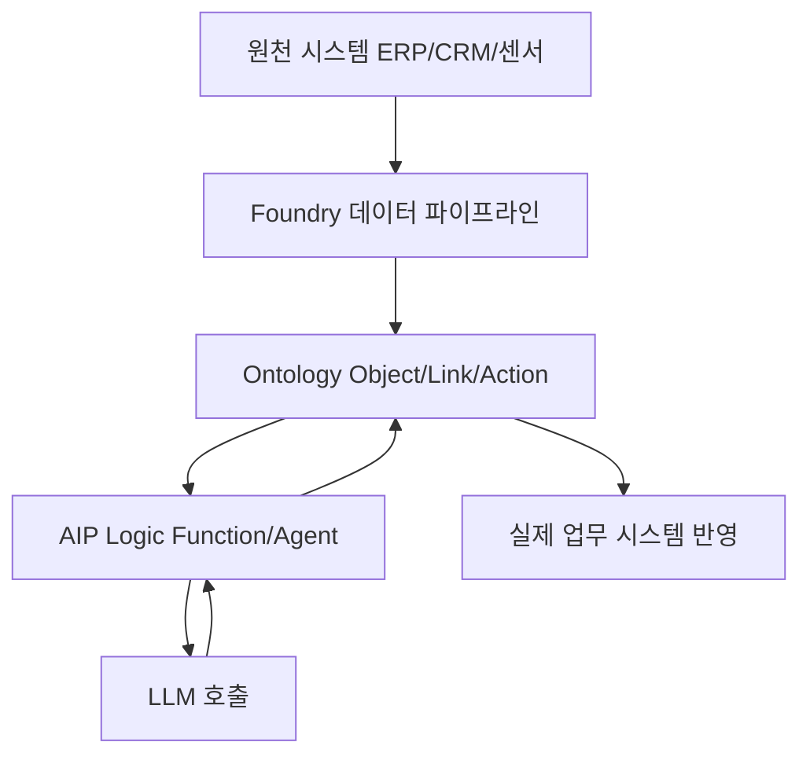
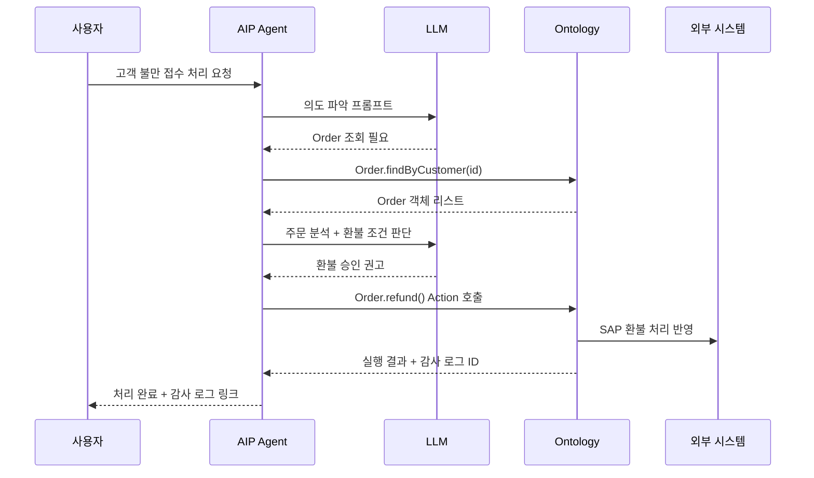

# 팔란티어가 AI로 일하는 방식

## 1. 들어가며: 왜 이 회사 얘기를 해야 하는가

팔란티어(Palantir)는 2003년 창립된 데이터 분석 회사다. 초창기엔 CIA, NSA, FBI 같은 정보기관이 주 고객이었고, 지금은 Airbus, Merck, BP, 미 국방부, NHS까지 고객으로 두고 있다. 국내에서는 거의 이름만 들어봤을 것이다. 이유는 단순한데, 한국 시장에는 제대로 진출한 적이 없다.

그런데 2023년 AIP(Artificial Intelligence Platform)를 발표한 이후로 엔터프라이즈 AI 업계에서 팔란티어의 접근 방식이 거의 표준에 가까운 참고점이 되고 있다. OpenAI가 GPT-4를 팔고, Anthropic이 Claude를 파는 동안, 팔란티어는 "기업의 기존 시스템 위에 LLM을 어떻게 얹을 것인가"라는 질문에 가장 먼저 현실적인 답을 내놨다.

5년차 백엔드 개발자 입장에서 이 회사의 접근 방식이 흥미로운 이유는, 단순한 ChatGPT 래퍼가 아니라 **데이터 모델 자체를 AI가 이해할 수 있는 형태로 재구성하는 것**이 핵심이기 때문이다. LLM을 먼저 갖다 붙이는 게 아니라, LLM이 일할 수 있는 환경을 먼저 만든다.

---

## 2. Foundry와 AIP: 무엇이 뭔지부터 정리

팔란티어 제품군은 이름이 여러 개라 혼란스럽다. 실무자 관점에서 정리하면 이렇게 된다.

- **Foundry**: 데이터 통합 플랫폼. 수십~수백 개의 원천 시스템(ERP, CRM, 센서, 로그 등)을 끌어와서 하나의 일관된 데이터 계층으로 만든다. 기술적으로는 Spark 기반 파이프라인 + 버전관리된 데이터셋 + 권한 시스템의 조합이다.
- **Ontology**: Foundry 위에 얹히는 의미론적 레이어. 원시 테이블을 비즈니스 객체(Object)로 감싸고, 객체 간 관계(Link)와 객체에 수행 가능한 행위(Action)를 정의한다.
- **AIP(Artificial Intelligence Platform)**: Ontology 위에서 LLM을 호출하고 실행 결과를 비즈니스 행위로 연결하는 레이어. 실질적으로는 AIP Logic, AIP Agent Studio, AIP Threads 같은 하위 도구의 집합이다.

쌓는 순서로 이해하면 편하다. 원천 데이터 → Foundry로 정제 → Ontology로 의미 부여 → AIP가 LLM으로 그 Ontology를 조작. LLM이 혼자 일하는 게 아니라 "Ontology라는 중간층"을 반드시 거친다는 점이 핵심이다.



---

## 3. Ontology: 이 회사가 다른 이유

ChatGPT에게 "우리 회사 매출 분석해줘"라고 물으면 뭐가 나오나. 파일을 올려야 하고, 그 파일은 컨텍스트를 벗어나면 사라지고, 권한 개념이 없고, 수정하면 실제 시스템엔 반영이 안 된다. 이게 전형적인 LLM 챗봇의 한계다.

팔란티어의 답은 Ontology다. 데이터를 LLM이 이해할 수 있는 "객체"로 먼저 모델링한다.

### 3.1 Object(객체)

예를 들어 제조사라면 이런 객체들을 정의한다.

- `Product` (제품)
- `ProductionLine` (생산 라인)
- `Shipment` (출하 건)
- `Supplier` (공급사)
- `MaintenanceTicket` (정비 티켓)

각 Object는 속성(property)을 가진다. `Shipment`라면 `shipment_id`, `origin`, `destination`, `eta`, `status`, `carrier` 같은 것들이다. 여기까지는 그냥 DB 테이블과 다를 바 없어 보인다.

### 3.2 Link(관계)

Object끼리 관계를 정의한다. `Shipment` --carries--> `Product`, `Product` --manufactured_by--> `ProductionLine` 이런 식이다. 이 관계는 외래키처럼 단순한 조인이 아니라, "한 Product가 지금 어느 배에 실려 있고, 그 배가 어느 항구에 묶여 있고, 그 항구의 파업 상황은 어떤가"를 그래프 탐색으로 한 번에 가져올 수 있도록 설계된다.

### 3.3 Action(행위)

Object에 대해 수행할 수 있는 행위를 명시적으로 정의한다. `Shipment.reroute(new_destination)`, `MaintenanceTicket.escalate(reason)` 같은 것들이다. 중요한 점은 Action이 단순 API 호출이 아니라 **권한 체크, 감사 로그 기록, 실제 원천 시스템 반영이 포함된 트랜잭션**이라는 것이다.

이게 왜 중요한가. LLM이 "이 출하 건을 부산항으로 재라우팅하면 어떨까"라고 판단했을 때, 그 판단을 실제로 실행하려면 결국 기존 SAP나 Oracle에 명령이 들어가야 한다. 팔란티어는 이 "실행 경로"를 Action으로 표준화해서, LLM이 Action을 호출하기만 하면 나머지 권한/감사/반영이 알아서 처리되도록 만들었다.

---

## 4. AIP Logic: 프롬프트를 비즈니스 로직으로

AIP Logic은 한마디로 "LLM 호출을 함수처럼 정의하는 도구"다. 실무에서 짠 코드를 비유하면 이런 식이다.

```python
# 일반적인 LLM 호출 — 이게 Foundry 밖에서의 모습
def summarize_shipment(shipment_id: str) -> str:
    data = db.query("SELECT * FROM shipments WHERE id = %s", shipment_id)
    prompt = f"다음 출하 건을 요약해라:\n{data}"
    return openai.chat.completions.create(
        model="gpt-4",
        messages=[{"role": "user", "content": prompt}]
    ).choices[0].message.content
```

Foundry/AIP 안에서는 이런 호출을 **Function**이라는 단위로 정의한다. Function은 입력이 Ontology Object이고, 출력도 Ontology Object(또는 primitive 값)인 함수다. LLM 호출은 Function 내부 구현의 한 스텝일 뿐이다.

AIP Logic에서 짜는 함수는 개념적으로 이렇게 생겼다.

```
Function: analyzeShipmentDelayRisk
Input: Shipment (Object)
Output: DelayRiskAssessment (Object)

Step 1: Shipment.carrier의 최근 30일 정시 도착률 조회
Step 2: Shipment.origin 항구의 현재 혼잡도 조회
Step 3: Shipment.destination 기상 예보 API 호출
Step 4: LLM에게 위 3개 데이터 + Shipment 정보를 주고
        지연 위험도(low/medium/high)와 근거 설명 요청
Step 5: LLM 응답을 DelayRiskAssessment 객체로 파싱하여 반환
```

핵심은 Step 1~3이 Ontology의 기존 Object/Function을 재사용한다는 점이다. LLM은 "데이터를 가져오는 주체"가 아니라 "이미 취합된 데이터를 해석하는 주체"다. 이 분리가 환각(hallucination)을 크게 줄인다. LLM이 SQL을 짜서 직접 DB에 꽂는 게 아니라, 이미 검증된 Ontology Function의 결과값만 본다.

---

## 5. AIP Agent Studio: 다단계 에이전트

단발 LLM 호출로 끝나지 않는 업무가 있다. 예를 들어 "고객 불만 접수 → 관련 주문 조회 → 배송 상태 확인 → 환불 가능 여부 판단 → 고객에게 초안 답변 작성" 같은 흐름이다.

AIP Agent Studio는 이런 멀티 스텝 플로우를 정의하는 도구다. LangChain의 Agent 개념과 비슷한데, 차이는 **Tool이 임의의 파이썬 함수가 아니라 Ontology Action/Function으로 제한**된다는 것이다.



Agent Studio로 에이전트를 구성할 때는 세 가지를 정의한다.

- **Persona**: 이 에이전트가 어떤 역할을 하는지 시스템 프롬프트로 기술
- **Tools**: 호출 가능한 Ontology Action/Function 목록
- **Guardrails**: 절대 하면 안 되는 행위, 승인이 필요한 행위, 자동 실행 가능한 행위의 분류

Guardrails가 특히 중요하다. "고객에게 답변 초안을 작성하는 것"은 자동으로 해도 되지만, "실제로 환불 처리 Action을 호출하는 것"은 사람의 최종 승인을 받게 만들 수 있다. 이 분리는 Ontology Action에 `@require_approval` 같은 메타데이터를 달아서 처리한다.

---

## 6. 실제 업무 자동화 사례

팔란티어가 공개한 케이스 중 개발자 관점에서 참고할 만한 세 가지만 본다.

### 6.1 공급망: 한진해운 사태 같은 상황

글로벌 해운사가 컨테이너 라우팅을 AIP로 최적화한 사례가 있다. 수에즈 운하 혼잡, 현지 파업, 기상 이변이 동시에 터졌을 때 사람이 엑셀로 대응하면 며칠이 걸린다.

Ontology에는 `Vessel`, `Container`, `Port`, `Route`, `WeatherEvent`, `LaborEvent` 같은 객체가 미리 모델링되어 있다. AIP Agent는 새로운 `WeatherEvent`가 생기면 영향받는 `Vessel`들을 그래프 탐색으로 식별하고, 각 `Vessel`에 대해 `Vessel.rerouteOptions()` Function을 호출해 대안을 받는다. LLM은 각 대안의 비용/시간/리스크를 종합해서 권고안을 만들고, 최종 승인은 운영 담당자가 대시보드에서 한 번의 클릭으로 Action을 실행한다.

여기서 LLM의 역할은 "의사결정"이 아니라 "의사결정에 필요한 옵션 정리 + 근거 서술"이다. 실제 결정권은 사람에게 남겨둔다.

### 6.2 제조: 예지정비

Airbus나 Merck 같은 고객이 쓰는 패턴이다. 센서 데이터에서 이상 패턴이 감지되면 `MaintenanceTicket`이 자동 생성된다. 여기까지는 전통적인 룰 기반 시스템도 할 수 있다.

AIP가 추가로 하는 일은 이렇다. `MaintenanceTicket`이 생기면 연결된 `Equipment` 객체의 과거 이력, 유사 장비의 사례, 관련 매뉴얼 문서(Ontology에 `Document` 객체로 등록되어 있다)를 LLM에게 묶어서 던지고, "이 티켓의 우선순위와 예상 작업 시간"을 산출한다. 정비 담당자는 리포트를 받고 바로 작업에 들어간다.

이전에는 정비사가 매뉴얼 PDF를 뒤져가며 30분 걸리던 일을, AIP가 5초 만에 초안을 뽑아준다. 정비사는 그 초안을 검토만 한다. 생산성 얘기는 이런 식의 "사람 작업의 전처리"에서 나오는 게 실제다.

### 6.3 헬스케어: NHS의 진료 예약 최적화

NHS(영국 국민보건서비스)가 AIP로 수술 대기 리스트를 최적화한 사례가 있다. `Patient`, `Surgeon`, `OperatingRoom`, `Appointment` 같은 객체가 Ontology에 있고, AIP Agent는 취소·연기 이벤트가 발생할 때마다 "비어있는 슬롯을 누구에게 할당할 것인가"를 실시간으로 재계산한다.

여기서 흥미로운 건 **권한 기반 실행**이다. LLM은 환자의 실제 개인정보(이름, 주민번호)에 접근하지 않는다. Ontology 권한 레이어가 LLM에게 노출되는 필드를 제한한다. LLM이 받는 건 "환자 대기 우선순위 점수, 의료적 긴급도 레벨, 거주 지역 코드" 정도의 비식별화된 데이터다. 최종 할당은 Ontology Action이 원래 환자 ID로 풀어서 수행한다.

---

## 7. 일반 LLM 챗봇과의 결정적 차이

ChatGPT Enterprise나 Claude for Work를 도입한 회사와, AIP를 도입한 회사의 차이는 세 가지로 갈린다.

### 7.1 데이터 컨텍스트의 깊이

챗봇은 파일 업로드나 RAG로 데이터를 주입한다. 이 방식의 한계는 "질문할 때마다 맥락을 다시 주입해야 한다"는 것이다. 게다가 최신성이 보장되지 않는다. 어제 인덱싱한 벡터 DB는 오늘 바뀐 주문 상태를 반영하지 못한다.

AIP는 Ontology 자체가 살아있는 데이터 레이어다. LLM이 `Shipment.getStatus()`를 호출하는 순간 바로 최신 상태가 조회된다. "컨텍스트를 주입하는 것"이 아니라 "컨텍스트가 이미 거기 있는 것"이다.

### 7.2 권한 기반 실행

일반 챗봇 환경에서 "이 주문 환불해줘"라고 시키면, 챗봇이 외부 API를 호출해서 실제로 환불을 실행할 수 있는가. 기술적으론 가능하지만 아무도 그렇게 안 쓴다. 왜냐하면 챗봇이 사용자 권한을 모르고, 감사 로그를 남기지 않으며, 실수했을 때 롤백할 방법이 없기 때문이다.

AIP에서는 모든 Action이 사용자의 기존 RBAC 권한을 물려받는다. 창고 관리자가 AIP Agent에게 "재고 조정해줘"라고 해도, 그 관리자의 실제 권한 범위를 벗어나는 조정은 Action 단에서 거부된다. 감사 로그는 "누가 어떤 프롬프트로 어떤 Action을 언제 실행했는지"를 원자 단위로 기록한다.

### 7.3 결과의 추적 가능성

LLM의 답변이 왜 그렇게 나왔는지를 역추적할 수 있는가. 일반 챗봇은 프롬프트 + 응답 로그만 남는다. AIP는 LLM이 호출한 Function들이 전부 Ontology Function이라서, 각 Function의 입출력 값까지 감사 로그에 남는다. 즉, "LLM이 이런 결론을 낸 이유는 이 Function이 이런 값을 반환했기 때문이다"를 추적할 수 있다.

규제 산업(금융, 의료, 방산)에서 AIP가 채택되는 가장 큰 이유가 이 부분이다. 블랙박스 AI는 감사받을 수 없고, 감사받을 수 없는 것은 프로덕션에 못 올린다.

---

## 8. 프롬프트와 Ontology의 연결 방식

프롬프트 엔지니어링 관점에서 AIP의 특이한 점은, 프롬프트 안에 Ontology 스키마가 구조화된 형태로 자동 주입된다는 것이다.

개발자가 직접 짜는 프롬프트는 이렇게 생겼다.

```
You are a shipment analyst.
The user is asking about a shipment. Use the tools available.

Available tools:
- Shipment.getStatus(id)
- Shipment.getHistory(id)
- Port.getCongestion(code)
- Weather.getForecast(lat, lng)

Respond with a JSON matching DelayRiskAssessment schema:
{
  "risk_level": "low" | "medium" | "high",
  "reasoning": string,
  "confidence": number
}
```

위 프롬프트에서 "Available tools" 블록과 "Respond with JSON matching DelayRiskAssessment" 부분이 **Ontology에서 자동 생성된 것**이다. 개발자가 Ontology에 `Shipment` Object와 `DelayRiskAssessment` Object를 정의해두면, AIP Logic은 이 메타데이터를 읽어서 프롬프트에 주입한다.

이 구조의 장점은, Ontology가 바뀌면 프롬프트도 자동으로 따라간다는 점이다. 새 속성이 추가되면 프롬프트에도 반영되고, 필드 이름이 바뀌면 프롬프트에도 바뀐 이름이 들어간다. 수십 개의 프롬프트가 흩어져 있을 때 이 자동 동기화는 유지보수 비용을 크게 줄인다.

반대로 말하면, **Ontology 설계가 엉성하면 AIP도 엉성하게 작동한다.** 여기가 팔란티어 도입에서 가장 많이 실패하는 지점이다.

---

## 9. 실무 도입 시 현실적인 주의사항

국내외 도입 사례를 보면 실패 패턴이 꽤 일관적이다. 다섯 가지만 짚는다.

### 9.1 데이터 모델링이 9할

AIP를 도입하고 6개월간 LLM은 한 번도 제대로 안 쓰고 Ontology만 만들다 끝나는 프로젝트가 흔하다. 그럴 수밖에 없다. AIP의 가치는 Ontology에서 나오는데, 기존 ERP/CRM 데이터를 Object로 재모델링하는 건 본질적으로 도메인 모델링 작업이기 때문이다.

실패 패턴은 "AI 먼저, 데이터 나중"이다. PoC로 챗봇부터 붙여보겠다는 접근은 거의 다 망한다. 데이터 모델링이 선행되지 않으면 LLM은 결국 비정형 텍스트만 뱉는 비싼 장난감이 된다.

### 9.2 권한 체계의 선행 정리

Ontology는 기존 RBAC를 그대로 가져온다. 문제는 많은 회사의 기존 권한 체계가 엉망이라는 것이다. "차장 이상은 다 볼 수 있다" 수준의 느슨한 권한을 쓰던 조직이 Ontology를 도입하면, 갑자기 LLM이 그 느슨한 권한 전체로 데이터에 접근하게 된다.

AIP 도입은 권한 체계 재정비를 강제한다. 이게 인프라 프로젝트가 아니라 거버넌스 프로젝트가 되는 이유다.

### 9.3 LLM 비용과 지연시간

AIP는 LLM 호출을 Function으로 감싸기 때문에, 한 번의 사용자 요청이 내부적으로 5~10번의 LLM 호출로 펼쳐지는 경우가 흔하다. 에이전트가 반복 추론을 하면 더 늘어난다. 월간 토큰 비용이 생각보다 크게 나오고, 응답 지연도 단일 호출 대비 느리다.

실무에서는 결정론적으로 풀 수 있는 부분은 LLM 호출 없이 일반 Function으로 짜고, 판단이 정말 필요한 지점에만 LLM을 투입하는 식으로 조절한다. 이 분리를 안 하면 AIP는 금방 비용 폭탄이 된다.

### 9.4 감사 로그 활용

AIP가 남기는 감사 로그는 양이 방대하다. 프롬프트, 응답, 호출된 Function, 입출력 값이 전부 기록된다. 이 로그를 그냥 쌓아두기만 하면 스토리지 비용만 나가고 아무도 안 본다.

감사 로그를 실제로 활용하려면 "LLM 판단의 품질을 후행 평가하는 파이프라인"이 필요하다. 예를 들어 환불 승인 Agent의 판단이 실제로 옳았는지를 실제 환불 결과와 대조하는 리뷰 주기가 있어야 한다. 이걸 안 하면 Agent가 잘못 판단해도 아무도 모른 채 몇 달이 지나간다.

### 9.5 벤더 락인

마지막으로 불편한 진실 하나. AIP는 완전한 벤더 락인이다. Ontology 정의, Function, Agent 설정 전부 팔란티어 플랫폼에 묶여 있고, 표준 포맷으로의 export가 제한적이다. 계약을 끊으면 그동안 만든 자산을 꺼내 오기가 매우 어렵다.

이건 팔란티어만의 문제가 아니라 엔터프라이즈 AI 플랫폼 전반의 문제다. 대안으로 LangChain + 자체 스키마 레이어 + 자체 권한 레이어를 짜는 길이 있지만, 이걸 팔란티어 수준으로 맞추려면 실제로 수십 명의 팀이 몇 년을 투자해야 한다. 대부분의 조직은 자체 구축보다 락인을 감수하는 쪽을 택한다.

---

## 10. 참고로 알아둘 만한 경쟁 구도

팔란티어의 접근 방식을 흉내 내는 움직임이 최근 여러 곳에서 나오고 있다.

- Databricks는 Unity Catalog + AI/BI Genie로 유사한 방향을 시도하고 있다. 데이터 카탈로그를 "의미 레이어"로 확장하는 접근이다.
- Snowflake는 Cortex로 비슷한 그림을 그린다. Snowflake 테이블 위에 LLM 함수를 얹는 구조다.
- Microsoft Fabric은 OneLake + Copilot으로 비슷한 조합을 판다.

차이점은 뿌리에 있다. 팔란티어는 처음부터 "Object 모델"을 중심에 뒀고, 나머지는 처음부터 "테이블/컬럼"을 중심에 뒀다. 이 차이가 AI가 일할 때 체감으로 나타난다. Object 중심은 LLM이 "의미 단위로" 데이터를 다루고, 컬럼 중심은 LLM이 결국 SQL을 짜야 한다.

5년 안에 이 구도가 어떻게 정리될지는 불확실하다. 다만 엔터프라이즈 AI가 "챗봇 + RAG" 수준을 넘어서려면 결국 Ontology 같은 의미 레이어가 필요하다는 점은 명확하다. 팔란티어가 그 방향을 가장 먼저 보여줬다는 것 하나는 인정할 만한 지점이다.

---

## 11. 마무리

팔란티어의 AI 방식을 한 줄로 요약하면 이렇게 된다. **LLM을 데이터 위에 얹지 말고, LLM이 일할 수 있는 데이터 모델을 먼저 만들어라.**

실무 엔지니어 입장에서 이 회사에서 배울 점은 팔란티어 제품을 쓰지 않더라도 적용 가능하다. 자체 시스템에 LLM을 붙일 때도 동일한 원칙이 통한다. 비즈니스 객체를 명시적으로 정의하고, 객체에 수행 가능한 행위를 Action으로 분리하고, 권한과 감사 로그를 Action 레이어에 박아두는 구조다. LangChain으로 짜든, 자체 프레임워크를 만들든, 이 구조를 따라가면 적어도 "챗봇 PoC로 끝나는 AI 프로젝트"는 피할 수 있다.

반대로 Ontology 같은 의미 레이어 없이 LLM부터 붙이는 프로젝트는, 규모가 커지는 순간 거의 예외 없이 유지보수 불능에 빠진다. 팔란티어가 20년간 엔터프라이즈 데이터를 만지면서 먼저 터득한 교훈이, 지금 AIP라는 형태로 팔리고 있는 거라고 봐도 된다.
