# RAG 파이프라인

RAG(Retrieval-Augmented Generation)는 외부 문서를 검색해서 LLM의 답변에 근거를 붙이는 구조다. 개념은 단순한데, 실제로 파이프라인을 구축하면 문서 파싱부터 검색 품질, 비용 관리까지 손댈 곳이 많다.

이 문서는 RAG 파이프라인을 직접 구축하고 운영할 때 필요한 내용을 다룬다.

---

## 전체 파이프라인 흐름

RAG 파이프라인은 문서를 준비하는 **인덱싱 단계**와, 질문에 답변하는 **쿼리 단계**로 나뉜다.

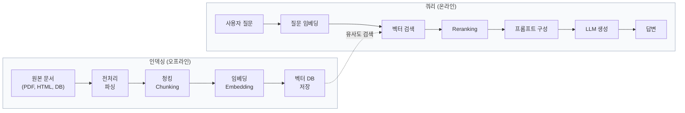

인덱싱은 사용자 질문과 무관하게 미리 수행하고, 쿼리 단계에서 인덱싱된 벡터를 검색한다. Reranking은 선택 단계로, 벡터 검색 품질이 충분하면 생략해도 된다.

---

## 1. 문서 수집과 전처리

### 전처리 파이프라인 흐름

소스가 다르면 파싱 방식도 다르지만, 결과물은 동일한 형태(텍스트 + 메타데이터)로 통일해야 한다. 각 파서를 독립 함수로 분리하면, 소스가 추가되어도 파이프라인 뒷단에 영향이 없다.

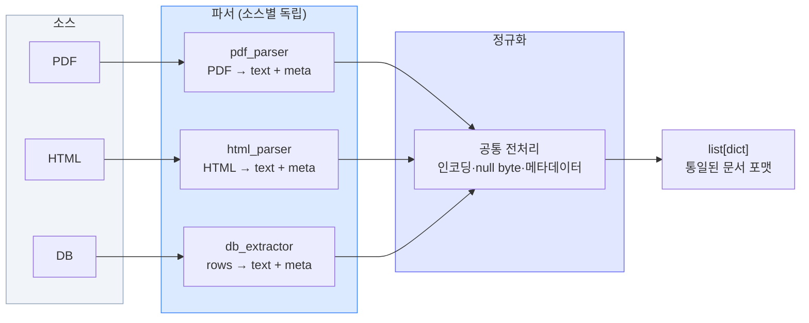

이 구조에서 각 파서는 `str → list[dict]` 타입의 함수다. 입력 포맷만 다르고 출력은 같으므로, 뒤에 나오는 함수형 합성 패턴(9절)에서 `pipe`로 연결할 때 파서를 갈아 끼우기 쉽다.

### 소스별 파싱

문서 소스마다 파싱 방식이 다르고, 각각 고유한 문제가 있다.

**PDF**

PDF는 가장 까다로운 소스다. 텍스트처럼 보이지만 내부 구조는 좌표 기반 렌더링이라, 파싱 결과가 원본과 다르게 나오는 경우가 많다.

```python
# PyMuPDF(fitz)로 PDF 텍스트 추출
import fitz

def extract_pdf(file_path: str) -> list[dict]:
    doc = fitz.open(file_path)
    pages = []
    for page_num, page in enumerate(doc):
        text = page.get_text("text")
        # 빈 페이지 스킵 (스캔 이미지만 있는 페이지)
        if not text.strip():
            continue
        pages.append({
            "text": text,
            "metadata": {
                "source": file_path,
                "page": page_num + 1,
            }
        })
    return pages
```

PDF 파싱에서 자주 겪는 문제:

- 2단 레이아웃 문서에서 왼쪽-오른쪽 순서가 섞여서 추출된다. `pdfplumber`의 `extract_text(layout=True)`를 쓰면 좀 낫지만 완벽하지는 않다.
- 스캔 PDF는 텍스트 레이어가 없다. OCR을 돌려야 하는데, `pytesseract`보다는 `Unstructured` 라이브러리의 `hi_res` 모드가 정확도가 높다.
- 머리글/바닥글이 본문에 섞인다. 페이지마다 반복되는 텍스트를 탐지해서 제거하는 후처리가 필요하다.

**HTML**

```python
from bs4 import BeautifulSoup
import requests

def extract_html(url: str) -> dict:
    resp = requests.get(url, timeout=10)
    soup = BeautifulSoup(resp.text, "html.parser")

    # 네비게이션, 푸터, 사이드바 같은 노이즈 제거
    for tag in soup.find_all(["nav", "footer", "aside", "header"]):
        tag.decompose()

    # 본문 영역 추출 (사이트마다 다름)
    main = soup.find("main") or soup.find("article") or soup.body
    text = main.get_text(separator="\n", strip=True)

    return {
        "text": text,
        "metadata": {"source": url}
    }
```

HTML은 사이트마다 구조가 달라서 범용 파서를 만들기 어렵다. 특정 사이트를 대상으로 한다면 해당 사이트의 DOM 구조에 맞춘 파서를 따로 만드는 게 낫다.

**DB 데이터**

DB에서 문서를 가져올 때는 행 단위로 하나의 문서를 만들지, 여러 행을 묶을지 결정해야 한다. FAQ 테이블이면 질문+답변을 하나의 문서로 만들고, 게시판이면 제목+본문+댓글을 합치는 식이다.

```python
import psycopg2

def extract_from_db(conn_str: str) -> list[dict]:
    conn = psycopg2.connect(conn_str)
    cur = conn.cursor()
    cur.execute("""
        SELECT id, title, content, category, updated_at
        FROM articles
        WHERE status = 'published'
    """)

    docs = []
    for row in cur.fetchall():
        docs.append({
            "text": f"{row[1]}\n\n{row[2]}",
            "metadata": {
                "source": f"db://articles/{row[0]}",
                "category": row[3],
                "updated_at": str(row[4]),
            }
        })
    cur.close()
    conn.close()
    return docs
```

### 전처리 공통 사항

어떤 소스든 전처리에서 챙겨야 할 것들:

- **인코딩 정리**: UTF-8이 아닌 문서가 섞여 있으면 `chardet`으로 감지 후 변환한다.
- **특수 문자 처리**: `\x00` 같은 null 바이트가 들어가면 벡터 DB 저장 시 에러가 난다.
- **메타데이터 보존**: 원본 소스, 생성일, 카테고리 같은 메타데이터를 청크마다 붙여야 나중에 필터링이 가능하다.

---

## 2. 청킹

### 청킹-임베딩-검색의 데이터 변환 과정

각 단계에서 데이터가 어떤 형태로 바뀌는지 구체적으로 보자.

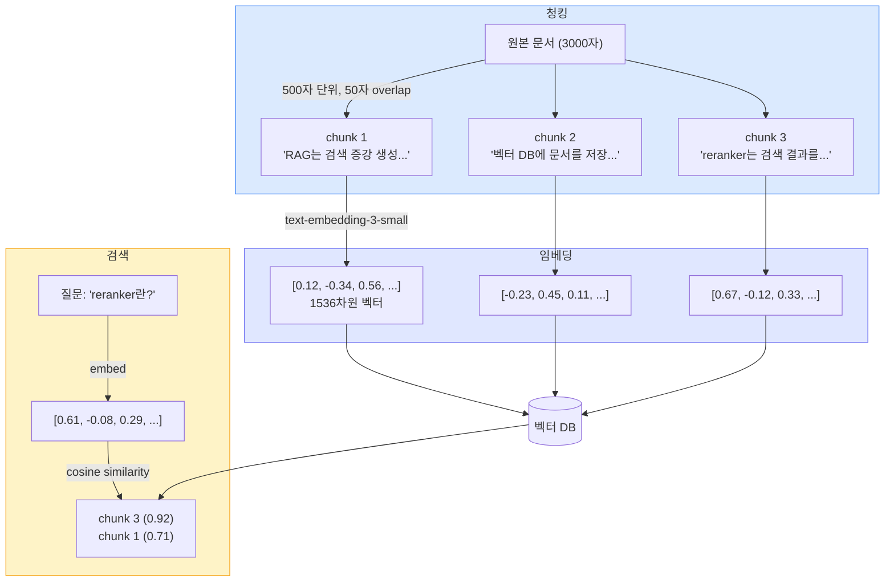

질문 벡터와 저장된 chunk 벡터 사이의 코사인 유사도를 계산해서, 가장 가까운 k개를 가져온다. chunk 크기가 너무 크면 관련 없는 내용이 섞이고, 너무 작으면 문맥이 부족하다. 이 균형을 잡는 게 청킹의 핵심이다.

### 청킹 방식별 특성

어떤 방식으로 나누느냐에 따라 검색 결과가 달라진다. 문서 특성에 맞는 방식을 골라야 한다.

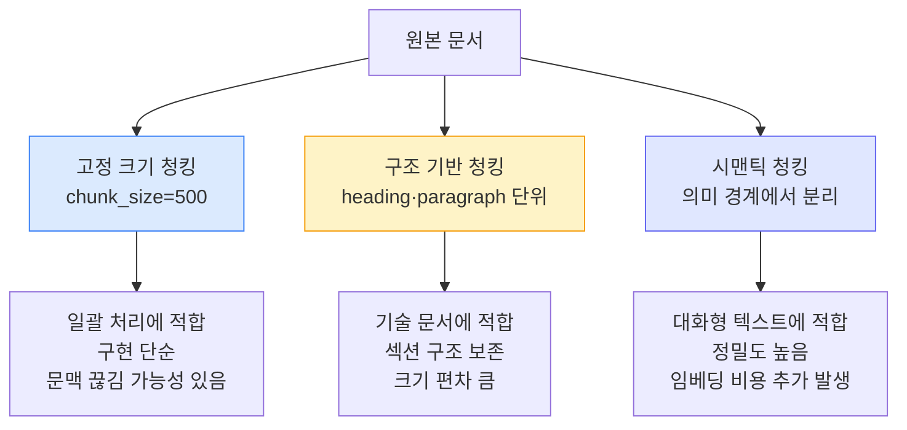

고정 크기 청킹은 대부분의 상황에서 시작점으로 쓸 만하다. API 문서나 기술 문서처럼 heading이 명확하면 구조 기반 청킹이 낫고, 채팅 로그처럼 토픽이 자연스럽게 전환되는 텍스트는 시맨틱 청킹이 맞다. 시맨틱 청킹은 문장 간 임베딩 유사도를 계산해서 의미가 바뀌는 지점에서 자르는 방식인데, 임베딩 호출이 추가로 필요하므로 비용을 고려해야 한다.

### 기본 청킹 방식

청킹은 문서를 LLM이 처리할 수 있는 크기로 나누는 작업이다. 단순해 보이지만 청킹 방식에 따라 검색 품질이 크게 달라진다.

```python
from langchain.text_splitter import RecursiveCharacterTextSplitter

splitter = RecursiveCharacterTextSplitter(
    chunk_size=500,
    chunk_overlap=50,
    separators=["\n\n", "\n", ". ", " "],
)

chunks = splitter.split_text(document_text)
```

`chunk_size`를 얼마로 잡을지가 첫 번째 고민이다. 작으면 검색 정밀도가 올라가지만 문맥이 잘린다. 크면 문맥은 살지만 노이즈가 많이 들어간다. 500~1000자 사이에서 시작하고, 실제 검색 결과를 보면서 조정한다.

`chunk_overlap`은 청크 경계에서 문맥이 끊기는 걸 줄여준다. 보통 `chunk_size`의 10~20% 정도로 설정한다.

### 실제로 겪는 문제들

**토큰 제한과 청크 크기**

임베딩 모델마다 입력 토큰 제한이 다르다. OpenAI의 `text-embedding-3-small`은 8191 토큰이 상한이다. 한국어는 영어보다 토큰 효율이 낮아서, 같은 글자 수에 더 많은 토큰을 쓴다. 한국어 500자가 대략 300~400 토큰 정도 되니까 이걸 기준으로 `chunk_size`를 잡아야 한다.

```python
import tiktoken

enc = tiktoken.encoding_for_model("text-embedding-3-small")

def count_tokens(text: str) -> int:
    return len(enc.encode(text))

# 한국어 텍스트 토큰 수 확인
sample = "RAG 파이프라인에서 청킹은 검색 품질에 직접적인 영향을 준다."
print(count_tokens(sample))  # 대략 30~40 토큰
```

**메타데이터 손실**

문서를 청크로 나누면 "이 청크가 어떤 문서의 어느 부분인지" 정보가 사라진다. 예를 들어 "위에서 언급한 설정을 변경하면"이라는 문장이 청크에 들어가면, "위에서 언급한 설정"이 뭔지 알 수 없다.

해결 방법은 각 청크에 상위 문맥을 붙이는 것이다:

```python
def add_context_to_chunks(chunks: list[str], doc_title: str, section_title: str) -> list[dict]:
    result = []
    for i, chunk in enumerate(chunks):
        # 청크 앞에 문서/섹션 정보를 붙임
        contextual_chunk = f"[문서: {doc_title} > {section_title}]\n\n{chunk}"
        result.append({
            "text": contextual_chunk,
            "metadata": {
                "doc_title": doc_title,
                "section": section_title,
                "chunk_index": i,
            }
        })
    return result
```

**테이블 처리**

테이블을 일반 텍스트 청킹으로 나누면 행이 잘리면서 의미가 깨진다. 테이블은 별도로 감지해서 통째로 하나의 청크로 만들어야 한다.

```python
import re

def split_with_tables(text: str, chunk_size: int = 500) -> list[str]:
    # 마크다운 테이블 패턴 감지
    table_pattern = r'(\|.+\|[\n\r]+\|[-:| ]+\|[\n\r]+(?:\|.+\|[\n\r]*)+)'
    parts = re.split(table_pattern, text)

    chunks = []
    splitter = RecursiveCharacterTextSplitter(chunk_size=chunk_size, chunk_overlap=50)

    for part in parts:
        if re.match(table_pattern, part):
            # 테이블은 통째로 하나의 청크
            chunks.append(part.strip())
        else:
            # 일반 텍스트는 청킹
            chunks.extend(splitter.split_text(part))

    return chunks
```

**이미지 처리**

텍스트 기반 RAG에서는 이미지 자체를 인덱싱할 수 없다. 두 가지 방법이 있다:

1. 이미지의 캡션이나 alt 텍스트를 추출해서 텍스트로 인덱싱한다.
2. 멀티모달 모델(GPT-4o, Claude)로 이미지를 설명하는 텍스트를 생성하고, 그 텍스트를 인덱싱한다.

두 번째 방법은 비용이 드는 대신 정확도가 높다. 다이어그램이나 차트가 많은 문서에서는 고려할 만하다.

---

## 3. 하이브리드 검색

### 하이브리드 검색 흐름

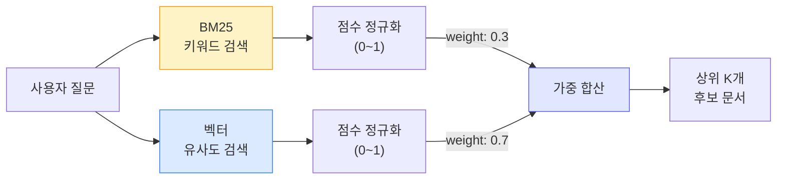

### 왜 하이브리드인가

벡터 검색만 쓰면 정확한 키워드 매칭에 약하다. "에러 코드 E-4012"를 검색할 때, 의미적으로 비슷한 "오류가 발생했습니다" 같은 문서가 올라오고 정작 "E-4012"가 포함된 문서는 밀려난다.

키워드 검색(BM25)만 쓰면 동의어나 의미적 유사성을 못 잡는다. "배포 실패 원인"을 검색할 때, "deploy error"라고 쓰여진 문서를 찾지 못한다.

두 방식을 조합하면 서로의 약점을 보완한다.

### BM25 + 벡터 검색 구현

```python
from rank_bm25 import BM25Okapi
from typing import List
import numpy as np

class HybridSearcher:
    def __init__(self, chunks: list[dict], embeddings: np.ndarray):
        self.chunks = chunks
        self.embeddings = embeddings  # shape: (num_chunks, embedding_dim)

        # BM25 인덱스 구축
        tokenized = [self._tokenize(c["text"]) for c in chunks]
        self.bm25 = BM25Okapi(tokenized)

    def _tokenize(self, text: str) -> list[str]:
        # 한국어는 형태소 분석기를 쓰는 게 좋다
        # 여기서는 간단히 공백 분리. 실서비스에선 mecab 등 사용
        return text.split()

    def search(
        self,
        query: str,
        query_embedding: np.ndarray,
        top_k: int = 10,
        keyword_weight: float = 0.3,
        vector_weight: float = 0.7,
    ) -> list[dict]:
        # BM25 점수
        bm25_scores = self.bm25.get_scores(self._tokenize(query))
        bm25_scores = bm25_scores / (bm25_scores.max() + 1e-6)  # 0~1 정규화

        # 벡터 유사도 (코사인 유사도)
        similarities = np.dot(self.embeddings, query_embedding)
        norms = np.linalg.norm(self.embeddings, axis=1) * np.linalg.norm(query_embedding)
        vector_scores = similarities / (norms + 1e-6)

        # 가중 합산
        combined = keyword_weight * bm25_scores + vector_weight * vector_scores

        # 상위 K개 반환
        top_indices = np.argsort(combined)[::-1][:top_k]
        return [
            {**self.chunks[i], "score": float(combined[i])}
            for i in top_indices
        ]
```

`keyword_weight`와 `vector_weight` 비율은 데이터 특성에 따라 다르다. 기술 문서처럼 정확한 용어가 중요한 경우 키워드 비중을 높이고(0.4:0.6), 일반 질의응답이면 벡터 비중을 높인다(0.2:0.8).

### 한국어 BM25의 함정

한국어에서 BM25를 쓸 때 공백 분리(whitespace tokenization)는 성능이 안 나온다. "데이터베이스"와 "데이터베이스의"를 다른 토큰으로 인식한다. 형태소 분석기를 써야 한다.

```python
# mecab 사용 예시
from konlpy.tag import Mecab

mecab = Mecab()

def tokenize_korean(text: str) -> list[str]:
    # 명사, 동사, 형용사만 추출
    pos_tags = mecab.pos(text)
    return [word for word, tag in pos_tags if tag.startswith(("N", "V", "XR"))]
```

---

## 4. Reranker

### Reranker 동작 과정

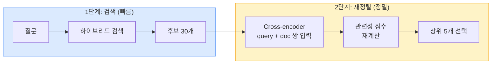

### 왜 필요한가

첫 단계 검색(BM25 + 벡터)은 빠르게 후보를 추리는 역할이다. 하지만 query-document 쌍의 세밀한 관련성을 판단하지 못한다. 벡터 검색은 query와 document를 각각 독립적으로 임베딩하기 때문에 둘 사이의 상호작용을 반영하지 않는다.

Reranker는 query와 document를 함께 입력받아 관련성 점수를 매기는 Cross-encoder 모델이다. 정확도는 높지만 느리기 때문에, 먼저 검색으로 20~50개 후보를 뽑고 그 중에서 Reranker로 재정렬하는 방식으로 쓴다.

### 구현

```python
from sentence_transformers import CrossEncoder

reranker = CrossEncoder("BAAI/bge-reranker-v2-m3", max_length=512)

def rerank(query: str, candidates: list[dict], top_k: int = 5) -> list[dict]:
    pairs = [(query, c["text"]) for c in candidates]
    scores = reranker.predict(pairs)

    for i, score in enumerate(scores):
        candidates[i]["rerank_score"] = float(score)

    ranked = sorted(candidates, key=lambda x: x["rerank_score"], reverse=True)
    return ranked[:top_k]
```

```python
# 전체 흐름
candidates = hybrid_searcher.search(query, query_embedding, top_k=30)
results = rerank(query, candidates, top_k=5)
```

### Reranker 선택

| 모델 | 특징 |
|------|------|
| `BAAI/bge-reranker-v2-m3` | 다국어 지원, 성능 좋음, 로컬 실행 가능 |
| `Cohere Rerank` | API 기반, 설치 불필요, 비용 발생 |
| `ms-marco-MiniLM` | 가볍고 빠름, 영어 중심 |

한국어 문서를 다루면 `bge-reranker-v2-m3`가 무난하다. Cohere Rerank도 한국어를 지원하는데, 직접 비교해 보고 골라야 한다.

---

## 5. 프롬프트 구성과 컨텍스트 윈도우 관리

### 프롬프트 구성

검색된 문서를 어떤 구조로 LLM에 전달하느냐가 답변 품질에 직접 영향을 준다. 컨텍스트 윈도우 안에서 각 영역이 차지하는 비율을 의식해야 한다.

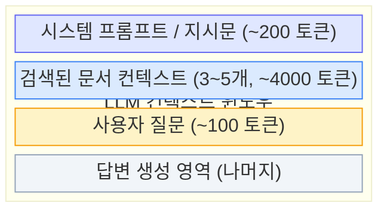

검색된 문서가 차지하는 영역이 가장 크다. 여기에 넣는 문서 수와 순서가 답변 품질을 결정한다.

```python
def build_prompt(query: str, contexts: list[dict]) -> str:
    context_text = ""
    for i, ctx in enumerate(contexts, 1):
        source = ctx["metadata"].get("source", "unknown")
        context_text += f"[문서 {i}] (출처: {source})\n{ctx['text']}\n\n"

    return f"""다음 문서를 참고해서 질문에 답변하라.
문서에 없는 내용은 "해당 정보를 찾을 수 없습니다"라고 답하라.

---
{context_text}
---

질문: {query}
답변:"""
```

주의할 점:

- 검색된 문서에 답이 없을 때 LLM이 지어내는 걸 막아야 한다. "문서에 없는 내용은 답하지 마라"는 지시를 명시한다.
- 출처를 함께 전달하면 답변에 근거를 붙일 수 있다.
- 문서 순서도 영향을 준다. 가장 관련도 높은 문서를 앞에 놓는 게 좋다.

### 컨텍스트 윈도우 관리

LLM의 컨텍스트 윈도우는 한정되어 있다. 검색 결과를 많이 넣을수록 근거는 풍부해지지만, 프롬프트가 길어지면 비용이 올라가고 답변 품질도 떨어질 수 있다(중간에 있는 정보를 무시하는 "Lost in the Middle" 현상).

```python
import tiktoken

enc = tiktoken.encoding_for_model("gpt-4o")

def fit_contexts_to_window(
    contexts: list[dict],
    query: str,
    max_context_tokens: int = 6000,
) -> list[dict]:
    """컨텍스트 윈도우에 맞게 문서를 잘라서 반환"""
    system_prompt_tokens = 200  # 시스템 프롬프트 + 질문 예약
    available = max_context_tokens - system_prompt_tokens - len(enc.encode(query))

    selected = []
    used_tokens = 0

    for ctx in contexts:
        ctx_tokens = len(enc.encode(ctx["text"]))
        if used_tokens + ctx_tokens > available:
            # 남은 공간에 일부만 넣을 수 있으면 잘라서 넣음
            remaining = available - used_tokens
            if remaining > 100:  # 100 토큰 미만이면 의미 없으니 스킵
                truncated = enc.decode(enc.encode(ctx["text"])[:remaining])
                selected.append({**ctx, "text": truncated})
            break
        selected.append(ctx)
        used_tokens += ctx_tokens

    return selected
```

실무에서는 보통 3~5개 문서를 전달한다. 10개 이상 넣어도 답변 품질이 비례해서 올라가지 않는다.

---

## 6. 파이프라인 구현 예제

### LangChain 기반

```python
from langchain_community.vectorstores import Chroma
from langchain_openai import OpenAIEmbeddings, ChatOpenAI
from langchain.text_splitter import RecursiveCharacterTextSplitter
from langchain.chains import RetrievalQA
from langchain_community.document_loaders import PyMuPDFLoader

# 1. 문서 로드
loader = PyMuPDFLoader("docs/manual.pdf")
documents = loader.load()

# 2. 청킹
splitter = RecursiveCharacterTextSplitter(
    chunk_size=800,
    chunk_overlap=100,
)
chunks = splitter.split_documents(documents)

# 3. 벡터 스토어 생성
embeddings = OpenAIEmbeddings(model="text-embedding-3-small")
vectorstore = Chroma.from_documents(
    chunks,
    embeddings,
    persist_directory="./chroma_db",
)

# 4. 검색 + 생성 체인
llm = ChatOpenAI(model="gpt-4o", temperature=0)
qa_chain = RetrievalQA.from_chain_type(
    llm=llm,
    chain_type="stuff",  # 검색 결과를 하나의 프롬프트에 넣음
    retriever=vectorstore.as_retriever(search_kwargs={"k": 5}),
    return_source_documents=True,
)

# 5. 질의
result = qa_chain.invoke({"query": "배포 절차가 어떻게 되나요?"})
print(result["result"])
for doc in result["source_documents"]:
    print(f"  출처: {doc.metadata['source']} (p.{doc.metadata.get('page', '?')})")
```

LangChain은 빠르게 프로토타입을 만들 때 편하다. 하지만 커스터마이징이 필요하면 추상화 레이어가 오히려 방해가 된다. 검색 로직을 세밀하게 조정해야 하면 직접 구현하는 게 나을 수 있다.

### LlamaIndex 기반

```python
from llama_index.core import VectorStoreIndex, SimpleDirectoryReader, Settings
from llama_index.embeddings.openai import OpenAIEmbedding
from llama_index.llms.openai import OpenAI
from llama_index.core.node_parser import SentenceSplitter

# 설정
Settings.llm = OpenAI(model="gpt-4o", temperature=0)
Settings.embed_model = OpenAIEmbedding(model_name="text-embedding-3-small")

# 1. 문서 로드
documents = SimpleDirectoryReader("./docs").load_data()

# 2. 인덱스 생성 (청킹 포함)
node_parser = SentenceSplitter(chunk_size=800, chunk_overlap=100)
index = VectorStoreIndex.from_documents(
    documents,
    transformations=[node_parser],
)

# 3. 쿼리 엔진
query_engine = index.as_query_engine(
    similarity_top_k=5,
    response_mode="compact",  # 검색 결과를 압축해서 프롬프트에 넣음
)

# 4. 질의
response = query_engine.query("배포 절차가 어떻게 되나요?")
print(response)
for node in response.source_nodes:
    print(f"  출처: {node.metadata.get('file_name', '?')} (score: {node.score:.3f})")
```

LlamaIndex는 문서 인덱싱에 특화되어 있어서, 문서 구조가 복잡하거나 다양한 소스를 다룰 때 편하다. `response_mode`를 바꿔가며 프롬프트 구성 방식을 실험할 수 있다.

### 하이브리드 검색 + Reranker 통합 예제

프레임워크의 기본 검색으로는 부족할 때, 커스텀 검색 파이프라인을 구현한다.

```python
from langchain_community.vectorstores import Chroma
from langchain_openai import OpenAIEmbeddings
from rank_bm25 import BM25Okapi
from sentence_transformers import CrossEncoder
import numpy as np

class RAGPipeline:
    def __init__(self, chunks: list[dict]):
        self.chunks = chunks
        self.embeddings_model = OpenAIEmbeddings(model="text-embedding-3-small")
        self.reranker = CrossEncoder("BAAI/bge-reranker-v2-m3")

        # 벡터 인덱스
        texts = [c["text"] for c in chunks]
        self.vectorstore = Chroma.from_texts(
            texts,
            self.embeddings_model,
            metadatas=[c["metadata"] for c in chunks],
        )

        # BM25 인덱스
        tokenized = [t.split() for t in texts]
        self.bm25 = BM25Okapi(tokenized)

    def retrieve(self, query: str, top_k: int = 5) -> list[dict]:
        # 1단계: 하이브리드 검색으로 후보 30개
        vector_results = self.vectorstore.similarity_search_with_score(query, k=20)
        bm25_scores = self.bm25.get_scores(query.split())

        # 점수 합산 후 상위 30개 선택
        candidates = self._merge_results(vector_results, bm25_scores, top_n=30)

        # 2단계: Reranker로 재정렬
        pairs = [(query, c["text"]) for c in candidates]
        rerank_scores = self.reranker.predict(pairs)

        for i, score in enumerate(rerank_scores):
            candidates[i]["final_score"] = float(score)

        candidates.sort(key=lambda x: x["final_score"], reverse=True)
        return candidates[:top_k]

    def _merge_results(self, vector_results, bm25_scores, top_n: int) -> list[dict]:
        scores = {}
        # 벡터 검색 결과 (점수 정규화)
        if vector_results:
            max_score = max(s for _, s in vector_results) or 1
            for doc, score in vector_results:
                idx = self._find_chunk_index(doc.page_content)
                if idx is not None:
                    scores[idx] = scores.get(idx, 0) + 0.7 * (score / max_score)

        # BM25 결과
        if bm25_scores.max() > 0:
            normalized = bm25_scores / bm25_scores.max()
            for idx, score in enumerate(normalized):
                scores[idx] = scores.get(idx, 0) + 0.3 * score

        top_indices = sorted(scores, key=scores.get, reverse=True)[:top_n]
        return [self.chunks[i] for i in top_indices]

    def _find_chunk_index(self, text: str) -> int | None:
        for i, c in enumerate(self.chunks):
            if c["text"] == text:
                return i
        return None
```

---

## 7. 평가 지표

RAG 파이프라인의 품질을 측정하려면 생성된 답변과 검색 결과 양쪽을 평가해야 한다. RAGAS 프레임워크가 표준적인 평가 지표를 제공한다.

### 평가 대상과 지표 매핑

RAG는 검색과 생성 두 부분으로 나뉘므로, 평가 지표도 각각 다른 부분을 측정한다.

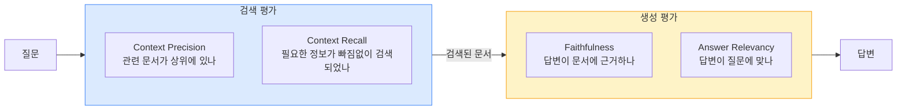

검색 지표가 낮으면 생성 품질을 아무리 올려도 소용없다. 파이프라인을 개선할 때는 검색 지표부터 확인하고, 검색이 충분한데 답변이 안 좋으면 그때 생성 쪽을 손본다.

### 주요 지표

**Faithfulness (충실도)**

생성된 답변이 검색된 문서에 근거하는지 측정한다. LLM이 문서에 없는 내용을 지어낸 비율이 낮을수록 좋다.

**Answer Relevancy (답변 관련성)**

답변이 질문에 적절한지 측정한다. 질문과 무관한 내용이 답변에 포함되면 점수가 내려간다.

**Context Precision (컨텍스트 정밀도)**

검색된 문서 중 실제로 답변에 필요한 문서가 얼마나 상위에 위치하는지 측정한다. 관련 없는 문서가 상위에 있으면 점수가 낮다.

**Context Recall (컨텍스트 재현율)**

정답에 필요한 정보가 검색 결과에 얼마나 포함되어 있는지 측정한다.

### RAGAS로 평가하기

```python
from ragas import evaluate
from ragas.metrics import faithfulness, answer_relevancy, context_precision, context_recall
from datasets import Dataset

# 평가 데이터셋 준비
eval_data = {
    "question": [
        "서비스 배포 절차는?",
        "에러 코드 E-4012의 원인은?",
    ],
    "answer": [
        # RAG 파이프라인이 생성한 답변
        "배포는 Jenkins 파이프라인을 통해 진행됩니다...",
        "E-4012는 인증 토큰 만료로 발생합니다...",
    ],
    "contexts": [
        # 검색된 문서 목록
        ["Jenkins 배포 파이프라인은 main 브랜치에 push 시...", "배포 전 staging 환경에서..."],
        ["에러 코드 E-4012: 토큰 만료 시 발생...", "인증 관련 에러 코드 목록..."],
    ],
    "ground_truth": [
        # 정답 (사람이 작성)
        "main 브랜치에 push하면 Jenkins 파이프라인이 실행되고, staging 테스트 후 production에 배포된다.",
        "E-4012는 인증 토큰이 만료되었을 때 발생하며, 토큰을 재발급해야 한다.",
    ],
}

dataset = Dataset.from_dict(eval_data)

result = evaluate(
    dataset,
    metrics=[faithfulness, answer_relevancy, context_precision, context_recall],
)

print(result)
# {'faithfulness': 0.85, 'answer_relevancy': 0.92, 'context_precision': 0.78, 'context_recall': 0.81}
```

### 평가 데이터셋 만드는 법

평가 데이터셋은 수동으로 만들어야 한다. 실제 사용자 질문 50~100개를 뽑고, 각 질문에 대한 정답과 정답 근거 문서를 사람이 작성한다. 시간이 많이 들지만, 이 과정을 건너뛰면 파이프라인 개선 방향을 잡을 수 없다.

LLM으로 평가 데이터를 자동 생성하는 방법도 있는데, ground truth의 품질이 낮으면 평가 자체가 무의미하므로 최소한 정답은 사람이 검수해야 한다.

---

## 8. 운영 시 문제들

### 인덱스 갱신

문서가 추가/수정/삭제될 때 인덱스를 업데이트해야 한다. 전체 재인덱싱은 간단하지만 문서가 많아지면 시간과 비용이 든다.

```python
import hashlib
import json

class IncrementalIndexer:
    def __init__(self, vectorstore, hash_store_path: str = "doc_hashes.json"):
        self.vectorstore = vectorstore
        self.hash_store_path = hash_store_path
        self.hashes = self._load_hashes()

    def _load_hashes(self) -> dict:
        try:
            with open(self.hash_store_path) as f:
                return json.load(f)
        except FileNotFoundError:
            return {}

    def _save_hashes(self):
        with open(self.hash_store_path, "w") as f:
            json.dump(self.hashes, f)

    def _hash_content(self, text: str) -> str:
        return hashlib.sha256(text.encode()).hexdigest()

    def update(self, doc_id: str, text: str, metadata: dict):
        new_hash = self._hash_content(text)

        if doc_id in self.hashes and self.hashes[doc_id] == new_hash:
            return  # 변경 없음, 스킵

        # 기존 문서 삭제 후 새로 추가
        self.vectorstore.delete(where={"doc_id": doc_id})

        # 청킹 후 추가
        chunks = split_document(text)  # 위에서 정의한 청킹 함수
        for i, chunk in enumerate(chunks):
            self.vectorstore.add_texts(
                [chunk],
                metadatas=[{**metadata, "doc_id": doc_id, "chunk_index": i}],
            )

        self.hashes[doc_id] = new_hash
        self._save_hashes()
```

문서 해시를 저장해두고, 변경된 문서만 재인덱싱하는 방식이다. 대부분의 운영 환경에서는 이 정도면 충분하다.

### 캐시

같은 질문이 반복되면 검색과 LLM 호출을 매번 할 필요가 없다. 쿼리 단위 캐시를 둔다.

```python
import hashlib
from functools import lru_cache

class QueryCache:
    def __init__(self, ttl_seconds: int = 3600):
        self.cache = {}
        self.ttl = ttl_seconds

    def _cache_key(self, query: str) -> str:
        # 정규화: 소문자 변환, 공백 정리
        normalized = " ".join(query.lower().split())
        return hashlib.md5(normalized.encode()).hexdigest()

    def get(self, query: str) -> dict | None:
        key = self._cache_key(query)
        if key in self.cache:
            entry = self.cache[key]
            if time.time() - entry["timestamp"] < self.ttl:
                return entry["result"]
            del self.cache[key]
        return None

    def set(self, query: str, result: dict):
        key = self._cache_key(query)
        self.cache[key] = {
            "result": result,
            "timestamp": time.time(),
        }
```

시맨틱 캐시(의미가 비슷한 질문에 대해 같은 캐시를 반환)도 가능하지만, 구현이 복잡하고 오히려 잘못된 답변을 반환할 수 있어서 처음에는 정확히 같은 쿼리에 대해서만 캐시하는 게 안전하다.

### 벡터 DB 스케일링

| DB | 특징 | 적합한 규모 |
|---|---|---|
| Chroma | 로컬 실행, 설정 간단 | 수만 건 이하 프로토타입 |
| Qdrant | 셀프호스팅 가능, 필터링 성능 좋음 | 수십만~수백만 건 |
| Pinecone | 완전 관리형, 스케일링 자동 | 대규모 프로덕션 |
| Weaviate | 하이브리드 검색 내장 | 수십만 건 이상 |
| pgvector | PostgreSQL 확장, 기존 DB 활용 | 수십만 건 이하 |

프로토타입은 Chroma로 시작하고, 프로덕션으로 가면 Qdrant나 Pinecone으로 옮기는 경로가 일반적이다. 이미 PostgreSQL을 쓰고 있으면 pgvector로 시작하는 것도 괜찮다. 별도 인프라를 추가하지 않아도 된다.

벡터 DB 선택 시 확인할 것:

- **메타데이터 필터링**: "카테고리가 X인 문서에서만 검색" 같은 필터링이 필요하면 지원 여부를 확인한다.
- **삭제/업데이트**: 인덱스 갱신 시 특정 문서만 삭제하고 다시 넣을 수 있는지.
- **백업/복구**: 인덱스 데이터를 백업할 수 있는지. Chroma는 디렉토리 복사로 되지만, 관리형 서비스는 방법이 다르다.

### 비용 관리

RAG 파이프라인의 비용은 크게 세 가지다.

**임베딩 비용**: 문서 인덱싱 시 1회 + 쿼리마다 1회 발생한다. OpenAI `text-embedding-3-small`은 100만 토큰당 $0.02로 저렴한 편이다. 문서 1만 건(청크 기준) 인덱싱에 $1 이하다.

**LLM 호출 비용**: 답변 생성 시 발생한다. 컨텍스트에 넣는 문서가 많을수록 입력 토큰이 늘어나서 비용이 올라간다. GPT-4o 기준 입력 100만 토큰당 $2.50인데, 쿼리당 평균 3000 토큰을 쓰면 1만 쿼리에 $75 정도다.

**Reranker 비용**: 로컬 모델을 쓰면 GPU 비용만 든다. Cohere Rerank API는 검색 1회당 $0.002 정도다.

비용을 줄이는 방법:

- 쿼리 캐시를 적극 활용한다. 반복 질문이 많으면 LLM 호출을 크게 줄일 수 있다.
- 간단한 질문은 작은 모델(GPT-4o-mini)로 처리하고, 복잡한 질문만 큰 모델로 라우팅한다.
- 컨텍스트에 넣는 문서 수를 줄인다. 5개면 충분한데 10개 넣을 필요 없다.
- 임베딩 모델을 직접 호스팅하면 대량 처리 시 API 호출보다 저렴하다.

---

## 9. 함수형 합성으로 파이프라인 구성하기

지금까지 본 예제 코드는 대부분 절차적이다. `answer_question` 함수 하나에 임베딩, 검색, reranking, LLM 호출이 전부 들어가 있고, 단계를 바꾸려면 함수 내부를 뜯어야 한다.

함수형 합성 방식으로 파이프라인을 구성하면, 각 단계를 독립된 함수로 만들고 이를 조합해서 전체 파이프라인을 만든다. 단계를 바꿔 끼우거나, 중간에 로깅을 추가하거나, 실패 처리를 덧붙이는 게 쉬워진다.

### 단계별 타입 흐름

함수형으로 파이프라인을 분리할 때 핵심은, 각 단계의 입력과 출력 타입이 명확해야 한다는 것이다. 타입이 맞아야 `pipe`로 합성할 수 있고, 단계를 교체할 때도 같은 타입 시그니처를 구현하기만 하면 된다.

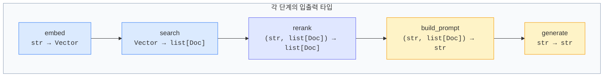

이 문서 앞부분에서 다룬 전처리(1절), 청킹(2절), 검색(3~4절), 생성(5절) 각각이 위 다이어그램의 한 블록에 대응한다. 절차적 코드에서는 이 경계가 모호한데, 함수형으로 분리하면 각 블록을 독립적으로 테스트하고 교체할 수 있다.

실제로 `RAGState`를 도입하면 모든 단계가 `RAGState → RAGState` 타입으로 통일되어 합성이 더 쉬워진다. 아래에서 구체적인 구현을 살펴보자.

### 파이프라인 합성 구조

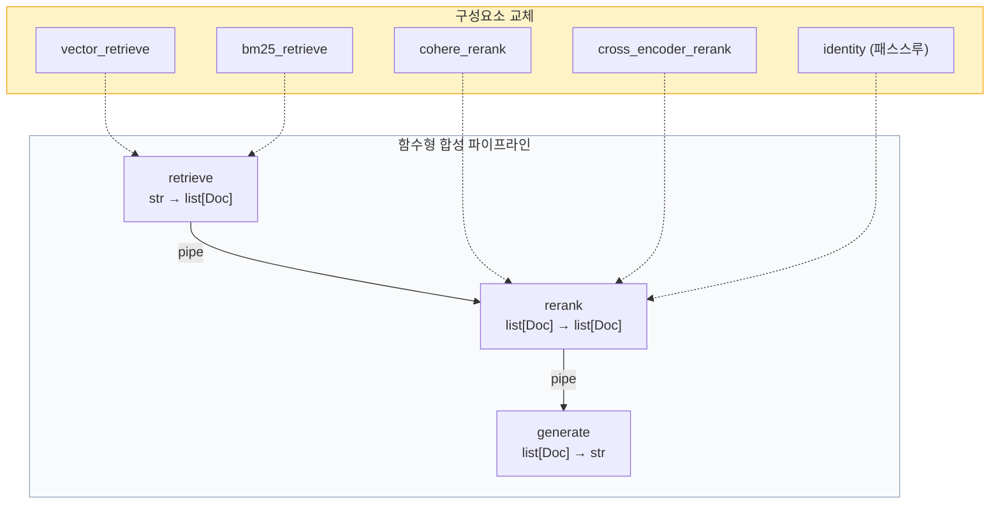

### 기본 구현

각 단계를 `Callable`로 정의하고, `pipe`로 합성한다.

```python
from dataclasses import dataclass, field, replace
from typing import Callable
from functools import reduce

@dataclass(frozen=True)
class Document:
    id: str
    text: str
    metadata: dict = field(default_factory=dict)
    score: float = 0.0

@dataclass(frozen=True)
class RAGState:
    query: str
    documents: list[Document] = field(default_factory=list)
    context: str = ""
    answer: str = ""

Step = Callable[[RAGState], RAGState]

def pipe(*steps: Step) -> Step:
    """왼쪽에서 오른쪽으로 함수를 합성한다."""
    return reduce(lambda f, g: lambda x: g(f(x)), steps)
```

`RAGState`를 `frozen=True`로 선언했다. 각 단계에서 `replace`로 새 상태를 만들기 때문에, 파이프라인 어느 지점에서든 이전 상태를 확인할 수 있다.

```python
def retrieval_step(embed_fn, search_fn, min_score: float = 0.5) -> Step:
    def step(state: RAGState) -> RAGState:
        vector = embed_fn(state.query)
        docs = search_fn(vector, k=10)
        filtered = [d for d in docs if d.score >= min_score]
        return replace(state, documents=filtered)
    return step

def rerank_step(rerank_fn, top_n: int = 3) -> Step:
    def step(state: RAGState) -> RAGState:
        reranked = rerank_fn(state.query, state.documents)
        return replace(state, documents=reranked[:top_n])
    return step

def generation_step(llm_fn, template: str) -> Step:
    def step(state: RAGState) -> RAGState:
        context = "\n\n---\n\n".join(d.text for d in state.documents)
        prompt = template.format(context=context, question=state.query)
        answer = llm_fn(prompt)
        return replace(state, context=context, answer=answer)
    return step
```

파이프라인 조립:

```python
# 벡터 검색 + Cohere reranker
rag = pipe(
    retrieval_step(embed_fn=openai_embed, search_fn=pinecone_search),
    rerank_step(rerank_fn=cohere_rerank, top_n=3),
    generation_step(llm_fn=openai_chat, template=PROMPT_TEMPLATE)
)

# BM25 검색, reranker 없이
simple_rag = pipe(
    retrieval_step(embed_fn=openai_embed, search_fn=bm25_search, min_score=0.3),
    generation_step(llm_fn=openai_chat, template=PROMPT_TEMPLATE)
)

result = rag(RAGState(query="배포 절차가 어떻게 되나요?"))
print(result.answer)
```

### 미들웨어로 기능을 덧붙인다

파이프라인 단계에 로깅이나 타이밍 측정을 넣고 싶으면, 단계 함수 자체를 수정하지 말고 감싸는 함수를 만든다.

```python
import time
import logging

def with_logging(name: str, step: Step) -> Step:
    def wrapper(state: RAGState) -> RAGState:
        logging.info(f"[{name}] 시작 — query: {state.query[:50]}")
        result = step(state)
        doc_count = len(result.documents)
        logging.info(f"[{name}] 완료 — documents: {doc_count}")
        return result
    return wrapper

def with_timing(name: str, step: Step) -> Step:
    def wrapper(state: RAGState) -> RAGState:
        start = time.time()
        result = step(state)
        elapsed = time.time() - start
        logging.info(f"[{name}] {elapsed:.3f}s")
        return result
    return wrapper

# 미들웨어 적용
rag = pipe(
    with_timing("retrieval", with_logging("retrieval",
        retrieval_step(embed_fn=openai_embed, search_fn=pinecone_search)
    )),
    with_timing("reranking",
        rerank_step(rerank_fn=cohere_rerank, top_n=3)
    ),
    with_timing("generation",
        generation_step(llm_fn=openai_chat, template=PROMPT_TEMPLATE)
    ),
)
```

원본 단계 함수를 건드리지 않고 기능을 덧붙이므로, 미들웨어 조합을 바꿔도 핵심 로직은 영향을 받지 않는다.

### 조건부 분기

검색 결과가 부족하면 쿼리를 확장해서 재검색하는 식의 분기가 필요할 때가 있다.

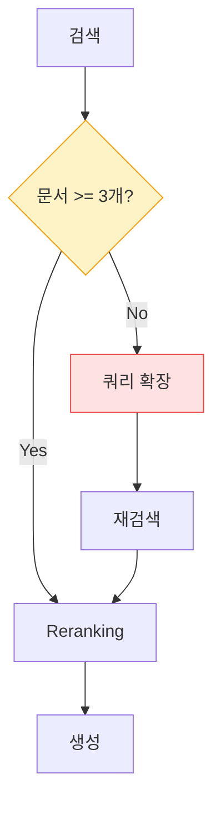

```python
def branch(condition: Callable[[RAGState], bool], if_true: Step, if_false: Step) -> Step:
    def step(state: RAGState) -> RAGState:
        if condition(state):
            return if_true(state)
        return if_false(state)
    return step

def identity(state: RAGState) -> RAGState:
    return state

rag = pipe(
    retrieval_step(embed_fn=openai_embed, search_fn=pinecone_search),
    branch(
        condition=lambda s: len(s.documents) >= 3,
        if_true=identity,
        if_false=pipe(
            query_expansion_step,
            retrieval_step(embed_fn=openai_embed, search_fn=pinecone_search)
        )
    ),
    rerank_step(rerank_fn=cohere_rerank),
    generation_step(llm_fn=openai_chat, template=PROMPT_TEMPLATE)
)
```

`branch`도 `Step` 타입이므로 `pipe` 안에 자유롭게 조합된다. `branch` 안에 `pipe`를 넣고, `pipe` 안에 `branch`를 넣는 식으로 복잡한 흐름을 표현할 수 있다.

### 함수형 방식이 맞는 경우와 아닌 경우

파이프라인이 3단계 이하이고 바뀔 일이 없으면 절차적으로 짜는 게 낫다. 함수형 패턴은 다음 상황에서 쓸 만하다:

- 검색 방식이나 reranker를 자주 바꿔가며 실험한다
- 도메인별로 다른 파이프라인을 조합해야 한다
- 파이프라인 단계별로 단위 테스트가 필요하다
- 실패 처리 경로가 단계마다 다르다

LangChain LCEL을 쓰면 `|` 연산자로 Runnable을 합성하는 구조가 이 함수형 패턴과 같은 원리다. 프레임워크가 함수형 합성을 강제하므로 별도로 `pipe`를 구현할 필요는 없지만, 원리를 알아두면 LCEL 코드를 읽고 커스터마이징하기 수월하다.

### Functional RAG와의 관계

이 문서에서는 RAG 파이프라인의 각 단계(전처리, 청킹, 검색, reranking, 생성)가 무엇을 하는지와, 마지막 절에서 함수형 합성으로 이들을 조합하는 방법을 다뤘다.

[Functional RAG](Functional_RAG.md) 문서는 이 합성 패턴 자체를 더 깊이 파고든다. 순수 함수 분리, 불변 Document 체인, `Result` 타입을 사용한 에러 전파, 스트리밍 파이프라인, 테스트 패턴 같은 내용이다.

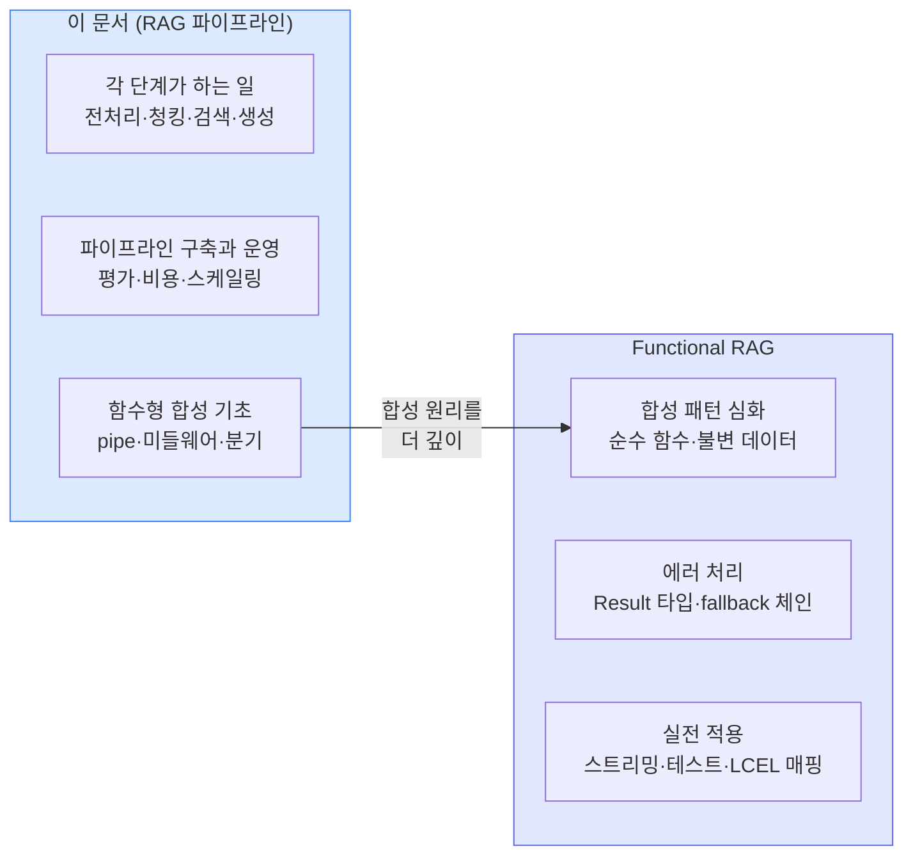

이 문서의 9절 코드를 운영 수준으로 발전시키려면 Functional RAG 문서의 에러 처리, 스트리밍 패턴을 참고한다. 반대로 Functional RAG 문서의 예제 코드가 어떤 맥락에서 쓰이는지 이해하려면 이 문서의 1~8절을 먼저 보는 게 좋다.
