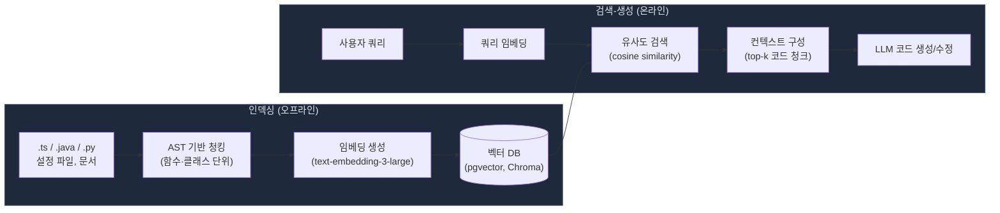
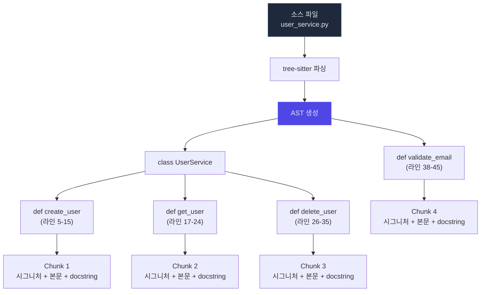
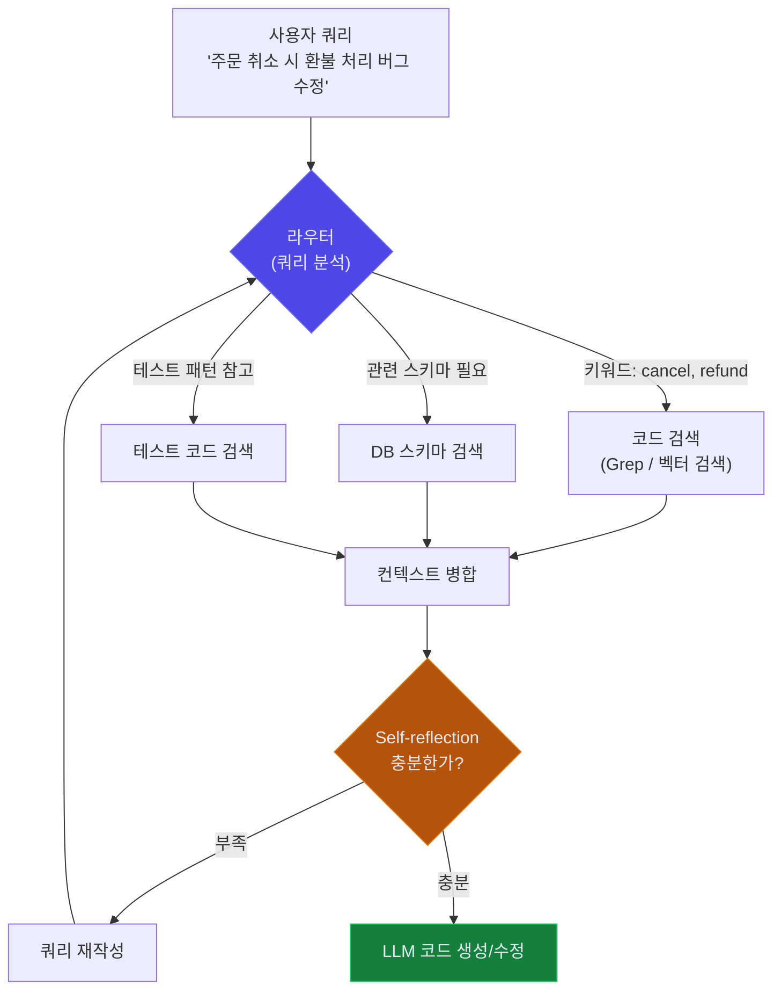
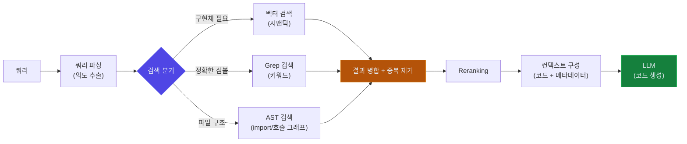
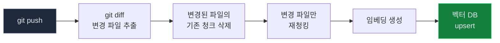

# RAG for Code

## 1. RAG란

**RAG(Retrieval-Augmented Generation)**는 LLM이 응답을 생성하기 전에 관련 정보를 **검색(Retrieval)**하여 컨텍스트에 추가하는 아키텍처 패턴이다. 코드에 적용하면, AI가 코드베이스를 검색하여 관련 파일/함수를 이해한 뒤 코드를 생성한다.

### 1.1 모든 AI 코딩 도구의 기반

실제로 우리가 사용하는 AI 코딩 도구들은 내부적으로 RAG를 사용한다.

```
Cursor가 코드를 수정할 때:
1. 코드베이스 인덱싱 (임베딩 생성)     ← Retrieval
2. 관련 파일/함수 검색                ← Retrieval
3. 검색된 코드를 컨텍스트에 추가        ← Augmented
4. 코드 생성/수정                     ← Generation
```

| AI 도구 | RAG 구현 방식 |
|---------|-------------|
| **Cursor** | 전체 코드베이스 인덱싱 + 시맨틱 검색 |
| **Claude Code** | Glob, Grep으로 파일 검색 후 Read |
| **GitHub Copilot** | @workspace로 프로젝트 컨텍스트 검색 |
---

## 2. 코드 RAG 아키텍처

### 2.1 기본 흐름



인덱싱과 검색-생성은 별도 프로세스다. 인덱싱은 코드가 변경될 때 비동기로 돌리고, 검색-생성은 사용자 요청마다 실행된다. 실제로 Cursor가 프로젝트를 열면 백그라운드에서 인덱싱부터 시작하는 게 이 구조다.

### 2.2 각 단계 설명

| 단계 | 설명 | 코드에서의 의미 |
|------|------|---------------|
| **청킹** | 코드를 적절한 단위로 분할 | 함수, 클래스, 모듈 단위로 분할 |
| **임베딩** | 텍스트를 벡터(숫자 배열)로 변환 | 코드의 의미를 수치화 |
| **벡터 저장** | 임베딩을 벡터 DB에 저장 | Pinecone, Chroma, Weaviate 등 |
| **유사도 검색** | 쿼리와 유사한 코드 검색 | "인증 로직" → 관련 코드 반환 |
| **컨텍스트 구성** | 검색 결과를 LLM 프롬프트에 추가 | 관련 코드 + 사용자 질문 결합 |

---

## 3. 코드 청킹 — 텍스트 청킹과 다른 점

코드를 어떻게 분할하느냐가 RAG 품질을 결정한다. 일반 문서 RAG에서는 토큰 수 기준으로 잘라도 크게 문제없지만, 코드는 구조가 있다. 함수 중간에서 잘리면 의미를 잃는다.

### 3.1 청킹 방식 비교

| 방식 | 설명 | 장점 | 단점 |
|------|------|------|------|
| **고정 크기** | N줄씩 분할 | 간단 | 함수가 중간에 잘림 |
| **함수/클래스 단위** | AST 기반 분할 | 의미 보존 | 파서 구현 필요 |
| **파일 단위** | 파일 전체를 하나의 청크 | 컨텍스트 완전 | 큰 파일에 비효율 |
| **슬라이딩 윈도우** | 겹치는 구간으로 분할 | 경계 정보 보존 | 중복 저장 |

코드는 **함수/클래스 단위** 청킹이 가장 결과가 좋다. 전체 함수 시그니처, 주석, 본문이 함께 보존되기 때문이다. tree-sitter 같은 파서를 쓰면 언어에 관계없이 AST 기반 청킹이 가능하다.

### 3.2 AST 기반 코드 청킹



고정 크기 청킹과의 차이: 고정 크기 방식에서는 `create_user` 함수가 15줄인데 청크 크기가 10줄이면 함수가 두 조각으로 갈린다. AST 기반에서는 함수 노드를 통째로 하나의 청크로 만든다.

### 3.3 코드 청킹 예시

```python
# 함수 단위 청킹 예시

# Chunk 1: UserService.createUser
class UserService:
    async def create_user(self, data: UserCreate) -> User:
        """새 사용자를 생성합니다"""
        existing = await self.repo.find_by_email(data.email)
        if existing:
            raise DuplicateEmailError(data.email)
        user = User(**data.dict())
        return await self.repo.save(user)

# Chunk 2: UserService.get_user
    async def get_user(self, user_id: str) -> User:
        """사용자를 조회합니다"""
        user = await self.repo.find_by_id(user_id)
        if not user:
            raise UserNotFoundError(user_id)
        return user
```

### 3.4 청킹 시 주의할 점

**메타데이터를 반드시 포함시켜야 한다.** 코드 청크만 벡터 DB에 넣으면 나중에 검색 결과를 활용하기 어렵다. 파일 경로, 라인 번호, 언어, 심볼명을 메타데이터로 같이 저장해야 LLM이 수정할 위치를 특정할 수 있다.

**import 문은 별도로 처리한다.** 함수 단위로 자르면 파일 상단의 import 문이 빠진다. import 정보가 없으면 LLM이 코드를 생성할 때 의존성을 모르고 존재하지 않는 모듈을 만들어낸다. import 문을 각 청크의 메타데이터에 포함시키거나, 별도 청크로 저장하는 방식을 써야 한다.

**너무 짧은 함수는 합친다.** getter/setter 같은 1-2줄짜리 함수를 개별 청크로 만들면 노이즈만 늘어난다. 같은 클래스 내 짧은 메서드들은 하나의 청크로 합치는 게 낫다.

---

## 4. 임베딩 모델

### 4.1 코드 임베딩 모델 비교

| 모델 | 제공사 | 특징 |
|------|--------|------|
| **text-embedding-3-large** | OpenAI | 범용, 코드도 우수 |
| **Voyage Code 3** | Voyage AI | 코드 특화, 벤치마크에서 코드 검색 정확도 높음 |
| **CodeBERT** | Microsoft | 코드+NL 이해, 오픈소스 |
| **StarEncoder** | BigCode | 다국어 코드 지원 |

범용 임베딩 모델(text-embedding-3-large)을 쓸지, 코드 특화 모델(Voyage Code 3)을 쓸지는 코드베이스 상황에 따라 다르다. 코드와 자연어 문서가 섞여 있으면 범용 모델이 낫고, 순수 코드 검색이면 코드 특화 모델이 정확도가 높다.

### 4.2 코드 임베딩에서 주의할 점

변수명과 주석이 임베딩 품질에 큰 영향을 준다. `def f(x, y)` 같은 코드는 임베딩만으로 의미를 파악하기 어렵다. 반면 `def calculate_shipping_cost(order: Order, destination: Address)` 같은 코드는 함수명만으로 의미가 잡힌다.

**코드와 쿼리 사이의 의미 격차(semantic gap)**도 문제다. 개발자가 "인증 로직"이라고 검색하는데, 코드에는 `verify_jwt_token` 함수가 있다. 임베딩 모델이 "인증"과 "JWT 토큰 검증"의 관련성을 잡아야 하는데, 범용 모델은 이걸 놓치는 경우가 있다. docstring이 잘 작성되어 있으면 이 격차가 줄어든다.

### 4.3 임베딩 생성 예시

```python
from openai import OpenAI

client = OpenAI()

def embed_code(code_chunk: str) -> list[float]:
    response = client.embeddings.create(
        model="text-embedding-3-large",
        input=code_chunk
    )
    return response.data[0].embedding
```

---

## 5. 벡터 데이터베이스

### 5.1 주요 벡터 DB

| DB | 특징 | 적합한 상황 |
|----|------|-----------|
| **Chroma** | 경량, 임베디드 | 로컬 개발, 프로토타입 |
| **Pinecone** | 관리형 SaaS | 프로덕션, 확장성 |
| **Weaviate** | 오픈소스, 하이브리드 검색 | 자체 호스팅 |
| **pgvector** | PostgreSQL 확장 | 기존 PG 사용 팀 |
| **Qdrant** | 고성능, Rust 기반 | 대규모 인덱싱 |

코드 RAG에서 벡터 DB를 고를 때 한 가지 더 생각할 것이 있다. 코드는 자주 바뀐다. 매일 커밋이 들어오면 인덱스를 업데이트해야 한다. upsert 성능과 삭제/갱신 처리가 얼마나 쉬운지가 일반 문서 RAG보다 중요하다.

### 5.2 pgvector 예시

```sql
-- PostgreSQL에 벡터 확장 추가
CREATE EXTENSION vector;

-- 코드 청크 테이블
CREATE TABLE code_chunks (
    id SERIAL PRIMARY KEY,
    file_path TEXT NOT NULL,
    symbol_name TEXT,           -- 함수명, 클래스명
    chunk_text TEXT NOT NULL,
    embedding vector(3072),     -- text-embedding-3-large
    language TEXT,
    line_start INT,
    line_end INT,
    commit_sha TEXT,            -- 인덱싱 시점의 커밋 해시
    created_at TIMESTAMP DEFAULT NOW()
);

-- 유사도 검색
SELECT file_path, symbol_name, chunk_text,
       1 - (embedding <=> $1::vector) AS similarity
FROM code_chunks
WHERE commit_sha = $2           -- 특정 커밋 기준으로 검색
ORDER BY embedding <=> $1::vector
LIMIT 5;
```

`commit_sha` 컬럼이 있는 이유: 코드가 변경되면 이전 임베딩은 쓸모없다. 커밋 해시로 버전을 관리하면, 인덱싱이 끝난 뒤 이전 버전 청크를 삭제하거나 특정 시점의 코드베이스를 검색할 수 있다.

---

## 6. 하이브리드 검색 — 코드 RAG의 기본

일반 문서 RAG에서는 벡터 검색만으로 대부분의 케이스를 처리할 수 있다. 코드 RAG는 다르다.

```mermaid
flowchart TD
    Q["개발자 쿼리"]

    Q --> A1["'인증 관련 로직 찾아줘'"]
    Q --> A2["'UserService 클래스 보여줘'"]
    Q --> A3["'utils 폴더에 있는 헬퍼 함수들'"]

    A1 --> V["벡터 검색\n(시맨틱 매칭)"]
    A2 --> G["Grep/키워드 검색\n(정확한 심볼명)"]
    A3 --> F["파일 경로 검색\n(Glob 패턴)"]

    V --> M["결과 병합\n+ 중복 제거\n+ Reranking"]
    G --> M
    F --> M

    style Q fill:#1e293b,stroke:#475569,color:#e2e8f0
    style M fill:#b45309,stroke:#d97706,color:#e2e8f0
```



"인증 관련 로직"은 벡터 검색이 잘 잡는다. `verify_jwt_token`, `authenticate_user` 같은 함수를 의미 기반으로 찾아준다. 반면 "UserService"는 정확한 문자열이다. 벡터 검색보다 Grep이 빠르고 정확하다. 파일 경로 기반 검색도 마찬가지로 벡터 검색으로는 못 한다.

세 가지 검색을 조합하는 게 코드 RAG의 기본이다. 쿼리를 분석해서 어떤 검색을 쓸지 판단하거나, 전부 실행해서 결과를 합치는 방식을 쓴다.

---

## 7. 실전 활용 패턴

### 7.1 사내 코드 검색 챗봇

```
개발자: "주문 결제 처리 로직이 어디에 있어?"

RAG 챗봇:
1. 쿼리 임베딩 생성
2. 벡터 DB에서 유사 코드 검색
3. 관련 파일/함수 위치 반환
4. 코드 설명 생성
```

### 7.2 코드 리뷰 보조

```
PR 변경 사항 → 관련 기존 코드 검색 → 패턴 일관성 체크
```

PR diff를 벡터 검색의 쿼리로 넣으면 비슷한 패턴의 기존 코드가 나온다. 기존 코드와 다른 방식으로 구현했는지 비교하면 코드 리뷰에서 일관성을 잡을 수 있다.

### 7.3 레거시 코드 이해

새로 합류한 팀원이 레거시 코드를 파악할 때 RAG 챗봇이 유용하다. "주문 생성 플로우가 어떻게 되지?"라고 물으면 관련 코드를 검색해서 호출 순서와 함께 설명해준다. 코드만 보여주는 게 아니라 코드의 컨텍스트를 같이 제공하는 게 핵심이다.

---

## 8. RAG vs Fine-tuning

| 항목 | RAG | Fine-tuning |
|------|-----|------------|
| **데이터 업데이트** | 즉시 반영 | 재학습 필요 |
| **비용** | 추론 비용만 | 학습 + 추론 비용 |
| **정확도** | 검색 품질에 의존 | 도메인 특화 높음 |
| **환각** | 근거 기반으로 감소 | 여전히 발생 가능 |
| **구현 난이도** | 중간 | 높음 |
| **추천 상황** | 코드베이스가 자주 변경 | 고정된 코딩 스타일 학습 |

대부분의 경우 **RAG가 더 맞다**. 코드베이스는 계속 변경되므로 실시간 검색이 재학습보다 현실적이다. 필요하면 RAG + Fine-tuning을 조합할 수 있다.

---

## 9. Agentic RAG (A-RAG)

**Agentic RAG**는 단순 검색-생성을 넘어, AI 에이전트가 검색 방법을 **스스로 결정**하는 방식이다.

기존 RAG와 가장 큰 차이는 **검색 루프**다. 기존 RAG는 검색을 한 번 하고 끝이지만, Agentic RAG는 검색 결과를 보고 부족하면 다시 검색한다. 검색 쿼리를 재작성하거나, 다른 소스에서 추가 검색하는 판단을 에이전트가 한다.



위 다이어그램에서 핵심은 `Self-reflection → 쿼리 재작성 → 라우터` 루프다. 검색 결과가 질문에 답하기에 부족하면 에이전트가 스스로 쿼리를 바꿔서 재검색한다. 이 루프가 없으면 그냥 RAG다.

### 9.1 Agentic RAG의 핵심 구성 요소

| 구성 요소 | 설명 |
|-----------|------|
| **라우터(Router)** | 쿼리를 분석하여 어떤 데이터 소스를 검색할지 결정 |
| **Self-reflection** | 검색 결과가 질문에 충분한지 판단하고, 부족하면 재검색 |
| **쿼리 재작성** | 검색 결과가 부정확하면 쿼리를 바꿔서 다시 시도 |
| **멀티 소스 검색** | 코드, 문서, 이슈 트래커, 위키 등 여러 소스를 동시에 검색 |

### 9.2 실제 도구에서의 동작

Claude Code를 예로 들면:

```
사용자: "주문 취소 시 환불 처리가 안 되는 버그 수정해줘"

에이전트 내부 동작:
1. Grep으로 "cancel", "refund" 키워드 검색
2. 관련 파일 3개 발견 → Read로 코드 확인
3. "환불 로직이 PaymentService에 있을 것 같다"
   → PaymentService 검색
4. 테스트 코드에서 환불 관련 테스트 검색
5. 모든 컨텍스트를 조합하여 버그 원인 파악 + 수정 코드 생성
```

이런 식으로 Claude Code, Cursor 같은 AI 코딩 도구가 내부적으로 Agentic RAG를 수행한다.

---

## 10. 코드 검색-생성 파이프라인

코드 RAG에서는 검색 대상이 다양하다. 함수 시그니처, import 관계, 테스트 코드, 설정 파일 등이 각각 다른 검색 방식을 요구한다. 이걸 하나의 함수에 때려넣으면 금방 관리가 안 된다.

각 검색 단계를 독립 함수로 만들고, 파이프라인으로 합성하면 검색 방식을 바꾸거나 단계를 추가/제거하기 쉬워진다. 함수형 파이프라인의 일반 패턴(순수 함수, Result 모나드, LCEL 등)은 [Functional RAG](Functional_RAG.md) 문서에서 다루므로, 여기서는 코드 RAG에 특화된 부분만 다룬다.

### 10.1 코드 검색-생성 체인 구조



코드 검색에서는 벡터 검색만으로 부족한 경우가 많다. `UserService`라는 정확한 클래스명을 찾을 때는 Grep이 벡터 검색보다 정확하다. 반대로 "인증 관련 로직"처럼 의미 기반 검색은 벡터 검색이 맞다. 두 방식을 합치는 하이브리드 검색이 코드 RAG의 기본이다.

### 10.2 코드 검색 함수 구현

```python
from dataclasses import dataclass, field
from typing import Callable

@dataclass(frozen=True)
class CodeChunk:
    file_path: str
    symbol_name: str       # 함수명, 클래스명
    content: str
    language: str
    chunk_type: str        # "function", "class", "module"
    line_start: int
    line_end: int
    score: float = 0.0
    metadata: dict = field(default_factory=dict)

# 각 검색 방식을 같은 시그니처로 통일한다
CodeRetriever = Callable[[str], list[CodeChunk]]

def vector_code_search(vectorstore, k: int = 10) -> CodeRetriever:
    """시맨틱 검색 — "인증 처리 로직" 같은 의미 기반 쿼리에 적합"""
    def search(query: str) -> list[CodeChunk]:
        results = vectorstore.similarity_search_with_score(query, k=k)
        return [
            CodeChunk(
                file_path=doc.metadata["file_path"],
                symbol_name=doc.metadata.get("symbol", ""),
                content=doc.page_content,
                language=doc.metadata.get("language", ""),
                chunk_type=doc.metadata.get("chunk_type", "function"),
                line_start=doc.metadata.get("line_start", 0),
                line_end=doc.metadata.get("line_end", 0),
                score=score
            )
            for doc, score in results
        ]
    return search

def grep_code_search(codebase_path: str) -> CodeRetriever:
    """키워드 검색 — 정확한 심볼명, 에러 메시지 등을 찾을 때"""
    import subprocess
    def search(query: str) -> list[CodeChunk]:
        result = subprocess.run(
            ["rg", "--json", "-l", query, codebase_path],
            capture_output=True, text=True
        )
        # 매칭 파일에서 함수/클래스 단위로 CodeChunk 추출
        # (실제 구현에서는 tree-sitter 등으로 AST 파싱 필요)
        return _extract_chunks_from_matches(result.stdout, query)
    return search
```

`CodeRetriever` 타입을 통일했기 때문에 벡터 검색이든 Grep이든 같은 방식으로 파이프라인에 끼워넣을 수 있다.

### 10.3 하이브리드 검색과 의존성 확장

```python
def hybrid_search(*retrievers: CodeRetriever) -> CodeRetriever:
    """여러 검색기의 결과를 합치고 중복을 제거한다."""
    def search(query: str) -> list[CodeChunk]:
        all_chunks = []
        seen_keys = set()

        for retriever in retrievers:
            for chunk in retriever(query):
                key = (chunk.file_path, chunk.line_start)
                if key not in seen_keys:
                    seen_keys.add(key)
                    all_chunks.append(chunk)

        return all_chunks
    return search

def with_dependency_expansion(
    retriever: CodeRetriever,
    import_graph: dict[str, list[str]]
) -> CodeRetriever:
    """검색된 코드가 import하는 파일도 함께 가져온다."""
    def search(query: str) -> list[CodeChunk]:
        chunks = retriever(query)
        expanded = list(chunks)
        for chunk in chunks:
            deps = import_graph.get(chunk.file_path, [])
            for dep_path in deps[:3]:  # 의존성 최대 3개로 제한
                expanded.extend(_read_file_as_chunks(dep_path))
        return expanded
    return search

# 조합
code_retriever = with_dependency_expansion(
    retriever=hybrid_search(
        vector_code_search(vectorstore, k=10),
        grep_code_search("/app/src")
    ),
    import_graph=build_import_graph("/app/src")
)
```

`with_dependency_expansion`은 검색된 파일의 import 대상까지 컨텍스트에 포함시킨다. 코드 수정에서는 현재 파일만 보면 안 되는 경우가 많다. `PaymentService`를 수정하려면 `PaymentService`가 호출하는 `RefundClient`도 봐야 한다.

### 10.4 코드 생성 체인 구성

검색 결과를 LLM에 넘길 때 코드의 메타데이터를 함께 전달하면 생성 품질이 올라간다.

```python
def format_code_context(chunks: list[CodeChunk]) -> str:
    """검색된 코드 청크를 LLM 컨텍스트로 포맷팅한다."""
    sections = []
    for chunk in chunks:
        header = f"# {chunk.file_path}:{chunk.line_start}-{chunk.line_end}"
        if chunk.symbol_name:
            header += f" ({chunk.symbol_name})"
        sections.append(f"{header}\n```{chunk.language}\n{chunk.content}\n```")
    return "\n\n".join(sections)

def build_code_rag_chain(
    retriever: CodeRetriever,
    llm_client,
    model: str = "gpt-4o"
) -> Callable[[str], str]:
    """코드 검색-생성 파이프라인을 하나의 함수로 합성한다."""

    def chain(query: str) -> str:
        chunks = retriever(query)
        context = format_code_context(chunks)

        response = llm_client.chat.completions.create(
            model=model,
            messages=[
                {"role": "system", "content": (
                    "코드베이스에서 검색된 관련 코드를 참고하여 답변한다. "
                    "파일 경로와 라인 번호가 포함되어 있으므로 "
                    "수정할 위치를 정확히 지정해서 답변한다."
                )},
                {"role": "user", "content": f"{context}\n\n---\n\n{query}"}
            ]
        )
        return response.choices[0].message.content

    return chain

# 사용
chain = build_code_rag_chain(
    retriever=code_retriever,
    llm_client=openai_client
)

answer = chain("OrderService.cancelOrder에서 환불 처리가 누락된 것 같다. 확인해줘")
```

이 구조에서 retriever만 교체하면 검색 방식이 바뀌고, `format_code_context`만 수정하면 LLM에 전달하는 포맷이 바뀐다. 각 부분이 독립적이므로 A/B 테스트도 단계별로 할 수 있다.

### 10.5 파이프라인 테스트

코드 검색-생성 체인의 각 단계는 독립 함수이므로, 외부 API 없이 단위 테스트가 가능하다.

```python
import pytest
from dataclasses import replace

# --- Fake 구현체 ---

def fake_vector_search(query: str) -> list[CodeChunk]:
    """벡터 DB 없이 테스트용 검색 결과를 반환한다."""
    return [
        CodeChunk(
            file_path="src/services/order_service.py",
            symbol_name="OrderService.cancel_order",
            content="async def cancel_order(self, order_id: str): ...",
            language="python",
            chunk_type="function",
            line_start=45, line_end=62, score=0.92
        ),
    ]

def fake_grep_search(query: str) -> list[CodeChunk]:
    return [
        CodeChunk(
            file_path="src/services/payment_service.py",
            symbol_name="PaymentService.process_refund",
            content="async def process_refund(self, payment_id: str): ...",
            language="python",
            chunk_type="function",
            line_start=30, line_end=48, score=1.0
        ),
    ]


# --- hybrid_search 테스트 ---

def test_hybrid_search_merges_results():
    """두 검색기의 결과가 합쳐지는지 확인한다."""
    searcher = hybrid_search(fake_vector_search, fake_grep_search)
    results = searcher("refund")

    assert len(results) == 2
    paths = [c.file_path for c in results]
    assert "src/services/order_service.py" in paths
    assert "src/services/payment_service.py" in paths

def test_hybrid_search_deduplicates():
    """같은 파일/라인의 결과가 중복 제거되는지 확인한다."""
    # 두 검색기가 같은 코드를 반환하는 상황
    def dup_search(query: str) -> list[CodeChunk]:
        return [
            CodeChunk(
                file_path="src/services/order_service.py",
                symbol_name="cancel_order",
                content="...", language="python", chunk_type="function",
                line_start=45, line_end=62, score=0.8
            ),
        ]

    searcher = hybrid_search(fake_vector_search, dup_search)
    results = searcher("cancel")

    # fake_vector_search도 order_service.py:45를 반환하므로 중복 제거
    order_chunks = [c for c in results if c.line_start == 45
                    and c.file_path == "src/services/order_service.py"]
    assert len(order_chunks) == 1


# --- format_code_context 테스트 ---

def test_format_code_context_includes_metadata():
    """포맷팅 결과에 파일 경로, 라인 번호, 심볼명이 포함되는지 확인한다."""
    chunks = [
        CodeChunk(
            file_path="src/auth.py",
            symbol_name="verify_token",
            content="def verify_token(token): ...",
            language="python", chunk_type="function",
            line_start=10, line_end=20, score=0.9
        ),
    ]
    formatted = format_code_context(chunks)

    assert "src/auth.py:10-20" in formatted
    assert "verify_token" in formatted
    assert "```python" in formatted

def test_format_code_context_empty():
    """빈 리스트에 대해 빈 문자열을 반환하는지 확인한다."""
    assert format_code_context([]) == ""


# --- with_dependency_expansion 테스트 ---

def test_dependency_expansion_adds_imports():
    """검색된 코드의 import 대상이 결과에 추가되는지 확인한다."""
    import_graph = {
        "src/services/order_service.py": [
            "src/services/payment_service.py",
            "src/models/order.py",
        ]
    }

    # _read_file_as_chunks를 대체할 fake
    original_fn = globals().get("_read_file_as_chunks")

    def mock_read_file(path):
        return [
            CodeChunk(
                file_path=path, symbol_name="", content="...",
                language="python", chunk_type="module",
                line_start=1, line_end=10, score=0.0
            )
        ]

    # with_dependency_expansion의 _read_file_as_chunks를 모듈 레벨에서 교체
    import types
    module = types.ModuleType("test_module")
    module._read_file_as_chunks = mock_read_file

    expanded_retriever = with_dependency_expansion(
        retriever=fake_vector_search,
        import_graph=import_graph
    )
    # 실제 실행 시에는 _read_file_as_chunks를 주입받는 구조로 바꾸는 게 낫다
```

테스트 코드에서 주목할 점:

- **외부 의존성이 없다.** 벡터 DB, LLM API 호출 없이 파이프라인 로직만 검증한다.
- **각 함수를 독립적으로 테스트한다.** `hybrid_search`의 중복 제거, `format_code_context`의 포맷팅, `with_dependency_expansion`의 의존성 확장을 각각 따로 확인한다.
- **fake 구현체를 `CodeRetriever` 시그니처에 맞춘다.** 시그니처만 맞으면 어떤 구현이든 끼워넣을 수 있으므로 mock 라이브러리 없이 테스트가 가능하다.

---

## 11. 코드 RAG 구현 시 부딪히는 문제들

### 11.1 인덱싱 지연

코드가 변경되면 임베딩을 다시 생성해야 한다. 대규모 코드베이스에서 전체 재인덱싱은 시간이 오래 걸린다. git diff로 변경된 파일만 추출하여 증분 인덱싱하는 방식을 쓴다.



CI/CD 파이프라인에 인덱싱을 붙이면 푸시할 때마다 인덱스가 자동으로 갱신된다. 전체 인덱싱은 초기 한 번만 하고, 이후로는 증분 인덱싱만 돌리면 된다.

### 11.2 컨텍스트 윈도우 관리

검색 결과가 많으면 LLM의 컨텍스트 윈도우를 넘긴다. top-k를 줄이면 관련 코드를 놓치고, 늘리면 토큰 비용이 올라간다.

실무에서 쓰는 방식:
- **Reranking 후 top-3~5만 사용.** 검색은 넓게 하되(k=20), reranking 후 상위 결과만 컨텍스트에 넣는다.
- **코드 요약 계층.** 전체 코드 대신 함수 시그니처만 먼저 보여주고, LLM이 "이 함수의 본문이 필요하다"고 판단하면 전체 코드를 가져오는 2단계 방식.
- **토큰 예산 관리.** 컨텍스트 윈도우의 60%를 검색 결과에, 20%를 시스템 프롬프트에, 20%를 생성에 할당하는 식으로 예산을 정한다.

### 11.3 다국어 코드베이스

Python, TypeScript, Java가 섞인 모노레포에서는 언어별로 AST 파서가 달라야 한다. tree-sitter는 다국어를 지원하므로 파서 하나로 여러 언어를 처리할 수 있지만, 언어별 코드 관습이 다르다는 점은 별도로 처리해야 한다.

예를 들어, Java는 클래스 단위로 파일이 나뉘어 있어서 파일 단위 청킹이 의미가 있지만, Python은 한 파일에 여러 클래스와 함수가 있어서 함수 단위 청킹이 필수다.

---

## 참고

- [LangChain RAG 튜토리얼](https://python.langchain.com/docs/tutorials/rag/)
- [OpenAI 임베딩 가이드](https://platform.openai.com/docs/guides/embeddings)
- [pgvector 공식 문서](https://github.com/pgvector/pgvector)
- [Chroma 공식 문서](https://docs.trychroma.com)
- [tree-sitter 공식 문서](https://tree-sitter.github.io/tree-sitter/)
