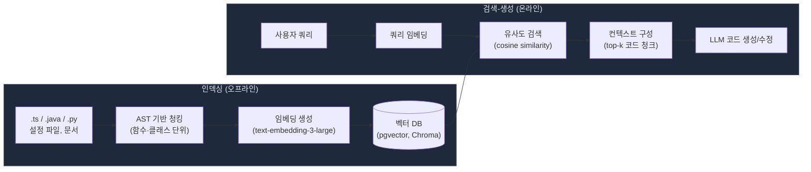
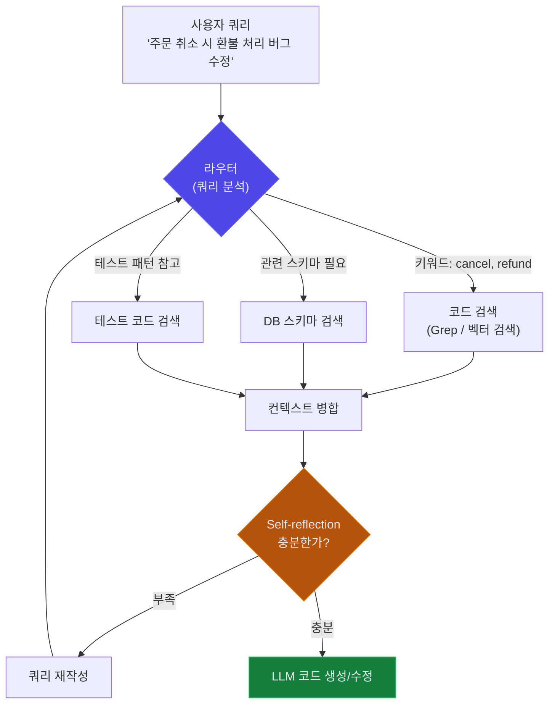
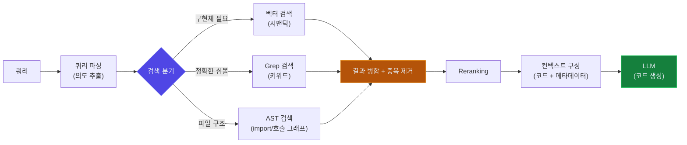

# RAG for Code

## 1. RAG란

**RAG(Retrieval-Augmented Generation)**는 LLM이 응답을 생성하기 전에 관련 정보를 **검색(Retrieval)**하여 컨텍스트에 추가하는 아키텍처 패턴이다. 코드에 적용하면, AI가 코드베이스를 검색하여 관련 파일/함수를 이해한 뒤 코드를 생성한다.

### 1.1 모든 AI 코딩 도구의 기반

실제로 우리가 사용하는 AI 코딩 도구들은 내부적으로 RAG를 사용한다.

```
Cursor가 코드를 수정할 때:
1. 코드베이스 인덱싱 (임베딩 생성)     ← Retrieval
2. 관련 파일/함수 검색                ← Retrieval
3. 검색된 코드를 컨텍스트에 추가        ← Augmented
4. 코드 생성/수정                     ← Generation
```

| AI 도구 | RAG 구현 방식 |
|---------|-------------|
| **Cursor** | 전체 코드베이스 인덱싱 + 시맨틱 검색 |
| **Claude Code** | Glob, Grep으로 파일 검색 후 Read |
| **GitHub Copilot** | @workspace로 프로젝트 컨텍스트 검색 |
---

## 2. 코드 RAG 아키텍처

### 2.1 기본 흐름



인덱싱과 검색-생성은 별도 프로세스다. 인덱싱은 코드가 변경될 때 비동기로 돌리고, 검색-생성은 사용자 요청마다 실행된다. 실제로 Cursor가 프로젝트를 열면 백그라운드에서 인덱싱부터 시작하는 게 이 구조다.

### 2.2 각 단계 설명

| 단계 | 설명 | 코드에서의 의미 |
|------|------|---------------|
| **청킹** | 코드를 적절한 단위로 분할 | 함수, 클래스, 모듈 단위로 분할 |
| **임베딩** | 텍스트를 벡터(숫자 배열)로 변환 | 코드의 의미를 수치화 |
| **벡터 저장** | 임베딩을 벡터 DB에 저장 | Pinecone, Chroma, Weaviate 등 |
| **유사도 검색** | 쿼리와 유사한 코드 검색 | "인증 로직" → 관련 코드 반환 |
| **컨텍스트 구성** | 검색 결과를 LLM 프롬프트에 추가 | 관련 코드 + 사용자 질문 결합 |

---

## 3. 코드 청킹 전략

코드를 어떻게 분할하느냐가 RAG 품질을 결정한다.

### 3.1 청킹 방식 비교

| 방식 | 설명 | 장점 | 단점 |
|------|------|------|------|
| **고정 크기** | N줄씩 분할 | 간단 | 의미 단위 무시 |
| **함수/클래스 단위** | AST 기반 분할 | 의미 보존 | 구현 복잡 |
| **파일 단위** | 파일 전체를 하나의 청크 | 컨텍스트 완전 | 큰 파일에 비효율 |
| **슬라이딩 윈도우** | 겹치는 구간으로 분할 | 경계 정보 보존 | 중복 저장 |

코드는 **함수/클래스 단위** 청킹이 가장 결과가 좋다. 전체 함수 시그니처, 주석, 본문이 함께 보존되기 때문이다.

### 3.2 코드 청킹 예시

```python
# 함수 단위 청킹 예시

# Chunk 1: UserService.createUser
class UserService:
    async def create_user(self, data: UserCreate) -> User:
        """새 사용자를 생성합니다"""
        existing = await self.repo.find_by_email(data.email)
        if existing:
            raise DuplicateEmailError(data.email)
        user = User(**data.dict())
        return await self.repo.save(user)

# Chunk 2: UserService.get_user
    async def get_user(self, user_id: str) -> User:
        """사용자를 조회합니다"""
        user = await self.repo.find_by_id(user_id)
        if not user:
            raise UserNotFoundError(user_id)
        return user
```

---

## 4. 임베딩 모델

### 4.1 코드 임베딩 모델 비교

| 모델 | 제공사 | 특징 |
|------|--------|------|
| **text-embedding-3-large** | OpenAI | 범용, 코드도 우수 |
| **Voyage Code 3** | Voyage AI | 코드 특화 |
| **CodeBERT** | Microsoft | 코드+NL 이해 |
| **StarEncoder** | BigCode | 다국어 코드 지원 |

### 4.2 임베딩 생성 예시

```python
from openai import OpenAI

client = OpenAI()

def embed_code(code_chunk: str) -> list[float]:
    response = client.embeddings.create(
        model="text-embedding-3-large",
        input=code_chunk
    )
    return response.data[0].embedding
```

---

## 5. 벡터 데이터베이스

### 5.1 주요 벡터 DB

| DB | 특징 | 적합한 상황 |
|----|------|-----------|
| **Chroma** | 경량, 임베디드 | 로컬 개발, 프로토타입 |
| **Pinecone** | 관리형 SaaS | 프로덕션, 확장성 |
| **Weaviate** | 오픈소스, 하이브리드 검색 | 자체 호스팅 |
| **pgvector** | PostgreSQL 확장 | 기존 PG 사용 팀 |
| **Qdrant** | 고성능, Rust 기반 | 대규모 인덱싱 |

### 5.2 pgvector 예시

```sql
-- PostgreSQL에 벡터 확장 추가
CREATE EXTENSION vector;

-- 코드 청크 테이블
CREATE TABLE code_chunks (
    id SERIAL PRIMARY KEY,
    file_path TEXT NOT NULL,
    chunk_text TEXT NOT NULL,
    embedding vector(3072),  -- text-embedding-3-large
    language TEXT,
    created_at TIMESTAMP DEFAULT NOW()
);

-- 유사도 검색
SELECT file_path, chunk_text,
       1 - (embedding <=> $1::vector) AS similarity
FROM code_chunks
ORDER BY embedding <=> $1::vector
LIMIT 5;
```

---

## 6. 실전 활용 패턴

### 6.1 사내 코드 검색 챗봇

```
개발자: "주문 결제 처리 로직이 어디에 있어?"

RAG 챗봇:
1. 쿼리 임베딩 생성
2. 벡터 DB에서 유사 코드 검색
3. 관련 파일/함수 위치 반환
4. 코드 설명 생성
```

### 6.2 코드 리뷰 보조

```
PR 변경 사항 → 관련 기존 코드 검색 → 패턴 일관성 체크
```

### 6.3 문서 자동 생성

```
코드 변경 감지 → 관련 코드 컨텍스트 검색 → API 문서 자동 업데이트
```

---

## 7. RAG vs Fine-tuning

| 항목 | RAG | Fine-tuning |
|------|-----|------------|
| **데이터 업데이트** | 즉시 반영 | 재학습 필요 |
| **비용** | 추론 비용만 | 학습 + 추론 비용 |
| **정확도** | 검색 품질에 의존 | 도메인 특화 높음 |
| **환각** | 근거 기반으로 감소 | 여전히 발생 가능 |
| **구현 난이도** | 중간 | 높음 |
| **추천 상황** | 코드베이스가 자주 변경 | 고정된 코딩 스타일 학습 |

대부분의 경우 **RAG가 더 맞다**. 코드베이스는 계속 변경되므로 실시간 검색이 재학습보다 현실적이다. 필요하면 RAG + Fine-tuning을 조합할 수 있다.

---

## 8. Agentic RAG (A-RAG)

**Agentic RAG**는 단순 검색-생성을 넘어, AI 에이전트가 검색 방법을 **스스로 결정**하는 방식이다. 기존 RAG와 가장 큰 차이는 **검색 루프**다. 기존 RAG는 검색을 한 번 하고 끝이지만, Agentic RAG는 검색 결과를 보고 부족하면 다시 검색한다. 검색 쿼리를 재작성하거나, 다른 소스에서 추가 검색하는 판단을 에이전트가 한다.



위 다이어그램에서 핵심은 `Self-reflection → 쿼리 재작성 → 라우터` 루프다. 검색 결과가 질문에 답하기에 부족하면 에이전트가 스스로 쿼리를 바꿔서 재검색한다. 이 루프가 없으면 그냥 RAG다.

### 8.1 Agentic RAG의 핵심 구성 요소

| 구성 요소 | 설명 |
|-----------|------|
| **라우터(Router)** | 쿼리를 분석하여 어떤 데이터 소스를 검색할지 결정 |
| **Self-reflection** | 검색 결과가 질문에 충분한지 판단하고, 부족하면 재검색 |
| **쿼리 재작성** | 검색 결과가 부정확하면 쿼리를 바꿔서 다시 시도 |
| **멀티 소스 검색** | 코드, 문서, 이슈 트래커, 위키 등 여러 소스를 동시에 검색 |

### 8.2 실제 도구에서의 동작

Claude Code를 예로 들면:

```
사용자: "주문 취소 시 환불 처리가 안 되는 버그 수정해줘"

에이전트 내부 동작:
1. Grep으로 "cancel", "refund" 키워드 검색
2. 관련 파일 3개 발견 → Read로 코드 확인
3. "환불 로직이 PaymentService에 있을 것 같다"
   → PaymentService 검색
4. 테스트 코드에서 환불 관련 테스트 검색
5. 모든 컨텍스트를 조합하여 버그 원인 파악 + 수정 코드 생성
```

이런 식으로 Claude Code, Cursor 같은 AI 코딩 도구가 내부적으로 Agentic RAG를 수행한다.

RAG 파이프라인의 구현 방법과 각 단계별 세부 사항은 [RAG 파이프라인](RAG_Pipeline.md) 문서를 참고한다.

---

## 9. 함수형 파이프라인으로 코드 검색-생성 체인 구성

코드 RAG에서는 검색 대상이 다양하다. 함수 시그니처, import 관계, 테스트 코드, 설정 파일 등이 각각 다른 검색 방식을 요구한다. 이걸 하나의 함수에 때려넣으면 금방 관리가 안 된다.

각 검색 단계를 독립 함수로 만들고, 파이프라인으로 합성하면 검색 방식을 바꾸거나 단계를 추가/제거하기 쉬워진다. 함수형 RAG의 일반적인 패턴은 [Functional RAG](Functional_RAG.md) 문서에서 다루므로, 여기서는 코드 RAG에 특화된 구성만 다룬다.

### 9.1 코드 검색-생성 체인 구조



코드 검색에서는 벡터 검색만으로 부족한 경우가 많다. `UserService`라는 정확한 클래스명을 찾을 때는 Grep이 벡터 검색보다 정확하다. 반대로 "인증 관련 로직"처럼 의미 기반 검색은 벡터 검색이 맞다. 두 방식을 합치는 하이브리드 검색이 코드 RAG의 기본이다.

### 9.2 코드 검색 함수 구현

```python
from dataclasses import dataclass, field
from typing import Callable

@dataclass(frozen=True)
class CodeChunk:
    file_path: str
    symbol_name: str       # 함수명, 클래스명
    content: str
    language: str
    chunk_type: str        # "function", "class", "module"
    line_start: int
    line_end: int
    score: float = 0.0
    metadata: dict = field(default_factory=dict)

# 각 검색 방식을 같은 시그니처로 통일한다
CodeRetriever = Callable[[str], list[CodeChunk]]

def vector_code_search(vectorstore, k: int = 10) -> CodeRetriever:
    """시맨틱 검색 — "인증 처리 로직" 같은 의미 기반 쿼리에 적합"""
    def search(query: str) -> list[CodeChunk]:
        results = vectorstore.similarity_search_with_score(query, k=k)
        return [
            CodeChunk(
                file_path=doc.metadata["file_path"],
                symbol_name=doc.metadata.get("symbol", ""),
                content=doc.page_content,
                language=doc.metadata.get("language", ""),
                chunk_type=doc.metadata.get("chunk_type", "function"),
                line_start=doc.metadata.get("line_start", 0),
                line_end=doc.metadata.get("line_end", 0),
                score=score
            )
            for doc, score in results
        ]
    return search

def grep_code_search(codebase_path: str) -> CodeRetriever:
    """키워드 검색 — 정확한 심볼명, 에러 메시지 등을 찾을 때"""
    import subprocess
    def search(query: str) -> list[CodeChunk]:
        result = subprocess.run(
            ["rg", "--json", "-l", query, codebase_path],
            capture_output=True, text=True
        )
        # 매칭 파일에서 함수/클래스 단위로 CodeChunk 추출
        # (실제 구현에서는 tree-sitter 등으로 AST 파싱 필요)
        return _extract_chunks_from_matches(result.stdout, query)
    return search
```

`CodeRetriever` 타입을 통일했기 때문에 벡터 검색이든 Grep이든 같은 방식으로 파이프라인에 끼워넣을 수 있다.

### 9.3 하이브리드 검색 합성

```python
def hybrid_search(*retrievers: CodeRetriever) -> CodeRetriever:
    """여러 검색기의 결과를 합치고 중복을 제거한다."""
    def search(query: str) -> list[CodeChunk]:
        all_chunks = []
        seen_keys = set()

        for retriever in retrievers:
            for chunk in retriever(query):
                key = (chunk.file_path, chunk.line_start)
                if key not in seen_keys:
                    seen_keys.add(key)
                    all_chunks.append(chunk)

        return all_chunks
    return search

def with_dependency_expansion(
    retriever: CodeRetriever,
    import_graph: dict[str, list[str]]
) -> CodeRetriever:
    """검색된 코드가 import하는 파일도 함께 가져온다."""
    def search(query: str) -> list[CodeChunk]:
        chunks = retriever(query)
        expanded = list(chunks)
        for chunk in chunks:
            deps = import_graph.get(chunk.file_path, [])
            for dep_path in deps[:3]:  # 의존성 최대 3개로 제한
                expanded.extend(_read_file_as_chunks(dep_path))
        return expanded
    return search

# 조합
code_retriever = with_dependency_expansion(
    retriever=hybrid_search(
        vector_code_search(vectorstore, k=10),
        grep_code_search("/app/src")
    ),
    import_graph=build_import_graph("/app/src")
)
```

`with_dependency_expansion`은 검색된 파일의 import 대상까지 컨텍스트에 포함시킨다. 코드 수정에서는 현재 파일만 보면 안 되는 경우가 많다. `PaymentService`를 수정하려면 `PaymentService`가 호출하는 `RefundClient`도 봐야 한다.

### 9.4 코드 생성 체인 구성

검색 결과를 LLM에 넘길 때 코드의 메타데이터를 함께 전달하면 생성 품질이 올라간다.

```python
def format_code_context(chunks: list[CodeChunk]) -> str:
    """검색된 코드 청크를 LLM 컨텍스트로 포맷팅한다."""
    sections = []
    for chunk in chunks:
        header = f"# {chunk.file_path}:{chunk.line_start}-{chunk.line_end}"
        if chunk.symbol_name:
            header += f" ({chunk.symbol_name})"
        sections.append(f"{header}\n```{chunk.language}\n{chunk.content}\n```")
    return "\n\n".join(sections)

def build_code_rag_chain(
    retriever: CodeRetriever,
    llm_client,
    model: str = "gpt-4o"
) -> Callable[[str], str]:
    """코드 검색-생성 파이프라인을 하나의 함수로 합성한다."""

    def chain(query: str) -> str:
        chunks = retriever(query)
        context = format_code_context(chunks)

        response = llm_client.chat.completions.create(
            model=model,
            messages=[
                {"role": "system", "content": (
                    "코드베이스에서 검색된 관련 코드를 참고하여 답변한다. "
                    "파일 경로와 라인 번호가 포함되어 있으므로 "
                    "수정할 위치를 정확히 지정해서 답변한다."
                )},
                {"role": "user", "content": f"{context}\n\n---\n\n{query}"}
            ]
        )
        return response.choices[0].message.content

    return chain

# 사용
chain = build_code_rag_chain(
    retriever=code_retriever,
    llm_client=openai_client
)

answer = chain("OrderService.cancelOrder에서 환불 처리가 누락된 것 같다. 확인해줘")
```

이 구조에서 retriever만 교체하면 검색 방식이 바뀌고, `format_code_context`만 수정하면 LLM에 전달하는 포맷이 바뀐다. 각 부분이 독립적이므로 A/B 테스트도 단계별로 할 수 있다.

---

## 참고

- [LangChain RAG 튜토리얼](https://python.langchain.com/docs/tutorials/rag/)
- [OpenAI 임베딩 가이드](https://platform.openai.com/docs/guides/embeddings)
- [pgvector 공식 문서](https://github.com/pgvector/pgvector)
- [Chroma 공식 문서](https://docs.trychroma.com)
