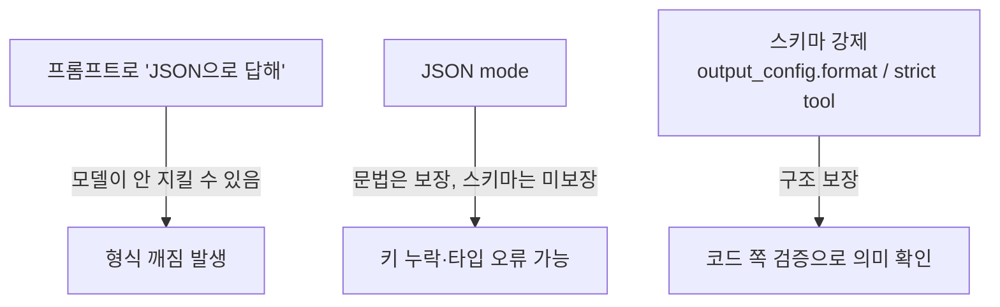

# Structured Output

LLM은 자유 텍스트를 뱉는 게 본업이다. 그런데 백엔드에서는 그 출력을 사람이 읽는 게 아니라 코드가 받아서 처리해야 하는 경우가 대부분이다. 분류 결과를 enum 컬럼에 넣거나, 추출한 필드를 DTO에 매핑하거나, 다음 단계 API 호출의 파라미터로 쓰거나. 이때 모델이 `{"category": "urgent"}`를 줄 줄 알았는데 `네, 분류해 드리겠습니다. 카테고리는 urgent입니다.`를 주면 파이프라인이 통째로 깨진다.

구조화 출력은 모델이 "정해진 스키마에 맞는 JSON만" 내보내도록 강제하는 기법이다. 이 문서는 프롬프트로 부탁하는 수준이 아니라, API 차원에서 출력 형식을 제약하는 방법, 그래도 스키마를 어기는 경우, 그리고 받은 출력을 코드 쪽에서 검증하고 재시도하는 흐름을 다룬다.

코드 예제는 Anthropic 메시지 API(`claude-opus-4-8`)를 기준으로 한다. OpenAI의 `response_format`이든 다른 제공자든 필드 이름만 다르지, "스키마를 JSON Schema로 넘기고 모델 출력을 거기에 맞춘다"는 구조는 같다. 스키마 검증 라이브러리는 Python `pydantic`, TypeScript `zod`를 든다.

도구 호출(function calling)의 인자 강제는 `Tool_Use.md`에서 이미 다뤘다. 여기서는 "모델의 최종 응답 자체를 구조화하는" 쪽에 초점을 둔다. 둘은 메커니즘이 겹치지만 쓰는 자리가 다르다.

## 1. 세 가지 강제 수준

모델에게 JSON을 받아내는 방법은 강제력이 약한 것부터 강한 것까지 단계가 있다. 어느 단계를 쓸지가 안정성을 좌우한다.



**프롬프트로 부탁하기.** "JSON 형식으로만 답해"라고 시스템 프롬프트에 적는 방식이다. 가장 약하다. 모델은 대부분 따르지만, 가끔 ```json 펜스를 붙이거나, 앞에 "다음은 결과입니다" 같은 말을 붙이거나, 필드를 빼먹는다. 프로토타입에서는 쓸 수 있지만 프로덕션 파이프라인의 유일한 방어선으로 두면 안 된다.

**JSON mode.** "출력이 반드시 유효한 JSON이어야 한다"를 API가 보장하는 모드다. 문법적으로 깨진 JSON은 안 나오지만, 그 JSON이 **내가 원한 스키마**인지는 보장하지 않는다. `{"wrong_key": 1}`도 유효한 JSON이다. 키 이름, 타입, 필수 필드는 여전히 코드가 검증해야 한다.

**스키마 강제.** JSON Schema를 API에 넘겨서 모델 출력이 그 스키마에 정확히 맞도록 제약하는 방식이다. 키, 타입, enum 값, 필수 필드까지 구조 수준에서 보장된다. 백엔드에서 LLM 응답을 코드로 받는다면 기본적으로 이 단계를 써야 한다.

## 2. 스키마 강제 - 응답 형식 제약

응답 전체를 구조화하려면 `output_config`의 `format`에 JSON Schema를 넘긴다. 예전에 쓰던 최상위 `output_format` 파라미터는 폐기됐으니, `output_config.format`을 써야 한다.

```python
import anthropic
import json

client = anthropic.Anthropic()

response = client.messages.create(
    model="claude-opus-4-8",
    max_tokens=1024,
    messages=[{
        "role": "user",
        "content": "다음 문의를 분류해라: '결제했는데 주문이 안 보여요'"
    }],
    output_config={
        "format": {
            "type": "json_schema",
            "schema": {
                "type": "object",
                "properties": {
                    "category": {
                        "type": "string",
                        "enum": ["billing", "shipping", "account", "other"]
                    },
                    "urgency": {"type": "integer"},
                    "summary": {"type": "string"}
                },
                "required": ["category", "urgency", "summary"],
                "additionalProperties": False
            }
        }
    }
)

# 첫 text 블록이 스키마에 맞는 JSON 문자열이다
text = next(b.text for b in response.content if b.type == "text")
data = json.loads(text)
```

`additionalProperties: False`를 넣으면 스키마에 없는 키를 모델이 추가하지 못한다. enum을 박으면 `category`가 네 값 중 하나임이 보장된다. 이렇게 해두면 `data["category"]`를 그대로 분기에 써도 안전하다.

### 2.1 SDK 헬퍼로 파싱까지 한 번에

직접 스키마를 손으로 쓰고 `json.loads`로 파싱하는 것보다, SDK가 제공하는 파싱 헬퍼를 쓰면 모델 클래스에서 스키마를 자동 생성하고 검증된 객체로 돌려준다. Python은 pydantic, TypeScript는 zod 기반이다.

```python
from pydantic import BaseModel
from typing import Literal

class Ticket(BaseModel):
    category: Literal["billing", "shipping", "account", "other"]
    urgency: int
    summary: str

response = client.messages.parse(
    model="claude-opus-4-8",
    max_tokens=1024,
    messages=[{"role": "user", "content": "..."}],
    output_format=Ticket,
)

ticket = response.parsed_output   # 검증된 Ticket 인스턴스
print(ticket.category)
```

`parsed_output`은 pydantic 검증을 통과한 객체다. 스키마 정의와 파싱이 한 곳에 모여서, DTO를 따로 정의하고 매핑 코드를 또 짜는 중복이 사라진다. 단, 파싱이 실패하면 `parsed_output`이 `None`일 수 있으니 그대로 dereference하지 말고 확인하고 써야 한다.

TypeScript는 zod 스키마를 넘긴다.

```typescript
import Anthropic from "@anthropic-ai/sdk";
import { z } from "zod";
import { zodOutputFormat } from "@anthropic-ai/sdk/helpers/zod";

const Ticket = z.object({
  category: z.enum(["billing", "shipping", "account", "other"]),
  urgency: z.number().int(),
  summary: z.string(),
});

const response = await client.messages.parse({
  model: "claude-opus-4-8",
  max_tokens: 1024,
  messages: [{ role: "user", content: "..." }],
  output_config: { format: zodOutputFormat(Ticket) },
});

// parsed_output이 null일 수 있다 — 단언하거나 가드해라
const ticket = response.parsed_output!;
```

### 2.2 도구 인자 강제 (strict tool use)

응답 본문이 아니라 도구 호출의 인자를 구조화하고 싶으면, 도구 정의에 `strict: True`를 붙인다. 이러면 `tool_use.input`이 스키마에 정확히 맞는 게 보장된다.

```python
tools = [{
    "name": "create_ticket",
    "description": "지원 티켓을 생성한다.",
    "strict": True,
    "input_schema": {
        "type": "object",
        "properties": {
            "category": {"type": "string", "enum": ["billing", "shipping"]},
            "urgency": {"type": "integer"}
        },
        "required": ["category", "urgency"],
        "additionalProperties": False
    }
}]
```

`strict`는 도구 정의 자체에 붙인다. `tool_choice`에 붙이는 게 아니다. 여기를 헷갈리는 경우가 많다. 그리고 `additionalProperties: False`와 `required`가 스키마에 있어야 동작한다. 응답 본문을 구조화할 거면 `output_config.format`, 도구 인자를 구조화할 거면 도구의 `strict`. 둘 다 같은 JSON Schema 제약을 쓴다.

## 3. JSON Schema의 제약

스키마 강제가 모든 JSON Schema 기능을 다 지원하지는 않는다. 여기서 막히는 경우가 실무에서 자주 나온다.

지원되는 것: 기본 타입(object, array, string, integer, number, boolean, null), `enum`, `const`, `anyOf`, `allOf`, `$ref`/`$def`, 문자열 포맷(`date-time`, `date`, `email`, `uri`, `uuid` 등), `additionalProperties: false`.

지원 안 되는 것:

- 재귀 스키마 (자기 자신을 `$ref`로 참조하는 트리 구조 등)
- 숫자 제약 (`minimum`, `maximum`, `multipleOf`)
- 문자열 길이 제약 (`minLength`, `maxLength`)
- 복잡한 배열 제약
- `additionalProperties`를 `false` 외의 값으로 두는 것

pydantic이나 zod 모델에 `min_length`, `ge=0` 같은 제약을 걸어두면, Python/TypeScript SDK는 **지원 안 되는 제약을 API로 보내는 스키마에서 떼어내고 대신 클라이언트 쪽에서 검증한다.** 그래서 모델 정의에 제약을 걸어도 에러는 안 나지만, "모델이 그 제약을 알고 출력을 맞추는" 게 아니라 "받은 뒤에 우리가 거른다"는 점을 알아야 한다. 즉 `urgency`에 `1~5` 범위 제약을 걸면, 모델은 6을 낼 수 있고 그건 클라이언트 검증에서 걸린다. 범위를 모델에게 강제하고 싶으면 enum(`[1,2,3,4,5]`)으로 박는 게 확실하다.

## 4. 그래도 스키마를 어기는 경우

스키마 강제를 켜도 출력이 항상 깨끗하게 나온다고 가정하면 안 된다. 형식이 보장되지 않는 상황이 몇 가지 있다.

**거부(refusal).** 모델이 안전상 이유로 응답을 거부하면 출력이 스키마를 안 따른다. 응답의 `stop_reason`이 `refusal`이면 `content`가 비어 있거나 스키마와 무관한 내용일 수 있다. `content[0]`을 무조건 읽으면 인덱스 에러가 난다. 스키마 강제를 쓰더라도 `stop_reason`을 먼저 확인하는 게 안전하다.

```python
if response.stop_reason == "refusal":
    # 거부됨 — 스키마에 맞는 출력이 없다
    handle_refusal()
else:
    data = json.loads(next(b.text for b in response.content if b.type == "text"))
```

**토큰 잘림(max_tokens).** `stop_reason`이 `max_tokens`면 출력이 중간에 잘린 거다. JSON이 `{"summary": "주문이 안` 처럼 닫히지 않은 채로 끝난다. `json.loads`가 `JSONDecodeError`를 던진다. 긴 출력을 받는다면 `max_tokens`를 넉넉히 잡고, 잘림을 파싱 실패의 한 원인으로 다뤄야 한다.

**의미적 오류.** 스키마 강제는 구조만 보장한다. `urgency`가 정수인 건 보장하지만 그 값이 맥락에 맞는지는 보장 못 한다. `category`가 enum 안의 값인 건 보장하지만 분류가 정확한지는 보장 못 한다. 이건 스키마로 못 잡고, 비즈니스 로직에서 검증하거나 평가 단계(`LLM_Evaluation.md`)에서 따로 봐야 한다.

**스키마 미지원 모델.** 구조화 출력은 최근 모델에서만 동작한다. 오래된 모델에 `output_config.format`을 넘기면 무시되거나 에러가 난다. 모델을 바꿀 때 이 기능이 살아 있는지 확인해야 한다.

## 5. 파싱 실패 시 재시도

스키마 강제 + 클라이언트 검증을 거쳐도 실패는 일어난다. 토큰 잘림, 검증 라이브러리 제약 위반, 거부. 백엔드에서는 이걸 예외로 터뜨리고 끝내는 대신, 검증 에러를 모델에게 되먹여서 한 번 더 시도하게 만드는 루프를 두는 게 보통이다.

핵심은 **검증 에러 메시지를 그대로 다음 프롬프트에 넣는 것**이다. "형식이 틀렸다"가 아니라 "`urgency` 필드가 누락됐다, 정수로 넣어라"처럼 구체적으로 줄수록 모델이 잘 고친다.

```python
from pydantic import ValidationError

def extract_ticket(user_input: str, max_retries: int = 2) -> Ticket:
    messages = [{"role": "user", "content": user_input}]

    for attempt in range(max_retries + 1):
        response = client.messages.parse(
            model="claude-opus-4-8",
            max_tokens=1024,
            messages=messages,
            output_format=Ticket,
        )

        if response.stop_reason == "refusal":
            raise RuntimeError("모델이 응답을 거부했다")

        try:
            ticket = response.parsed_output
            if ticket is None:
                raise ValueError("파싱 결과가 비어 있다")
            return ticket
        except (ValidationError, ValueError) as e:
            # 마지막 시도였으면 포기
            if attempt == max_retries:
                raise

            # 검증 에러를 그대로 모델에게 되먹인다
            raw = next((b.text for b in response.content if b.type == "text"), "")
            messages.append({"role": "assistant", "content": raw})
            messages.append({
                "role": "user",
                "content": f"위 출력이 스키마 검증에 실패했다. 에러: {e}. "
                           f"스키마에 맞게 다시 출력해라."
            })

    raise RuntimeError("재시도 한도 초과")
```

재시도 설계에서 몇 가지 짚을 점.

재시도 횟수에 상한을 둬야 한다. 모델이 계속 같은 실수를 반복하면 무한히 돌면서 토큰만 태운다. 두세 번 안에 못 고치면 사람이 봐야 할 입력이라고 보는 게 맞다.

거부(`refusal`)는 재시도 대상이 아니다. 같은 프롬프트로 다시 보내봐야 또 거부한다. 거부는 별도 경로로 처리해야 한다.

토큰 잘림으로 인한 실패는 재시도보다 `max_tokens`를 늘리는 게 근본 해결이다. 출력이 일관되게 긴데 한도가 작으면, 재시도해도 또 잘린다.

검증을 모델에게 떠넘기지 말고 코드에서 해라. "이 JSON이 스키마에 맞는지 확인해줘"를 모델에게 다시 물어보는 패턴은 토큰만 쓰고 신뢰할 수 없다. pydantic/zod로 결정론적으로 검증하는 게 빠르고 정확하다.

## 6. 정리

백엔드에서 LLM 응답을 코드로 받는다면, 출력 형식을 운에 맡기면 안 된다. 단계적으로 강제력을 올린다. 프롬프트로 부탁하는 건 최후의 보루가 아니라 보조 수단이고, JSON mode는 문법만 보장하며, 스키마 강제(`output_config.format` 또는 도구의 `strict`)가 구조를 보장하는 기본선이다.

스키마 강제는 구조까지만이다. 거부·토큰 잘림으로 형식이 깨질 수 있고, 형식이 맞아도 의미가 틀릴 수 있다. 그래서 받은 출력은 항상 pydantic/zod로 다시 검증하고, 실패하면 검증 에러를 되먹여 제한된 횟수만큼 재시도한다.

스키마는 가능한 한 제약을 enum과 필수 필드로 표현하고, 라이브러리에만 있는 제약(길이·범위)은 클라이언트 검증이 잡는다는 걸 전제로 깔아둔다. 도구 인자 강제와 실행 루프는 `Tool_Use.md`, 프롬프트로 형식을 유도하는 기법은 `Prompt_Engineering.md`에서 더 다룬다.
