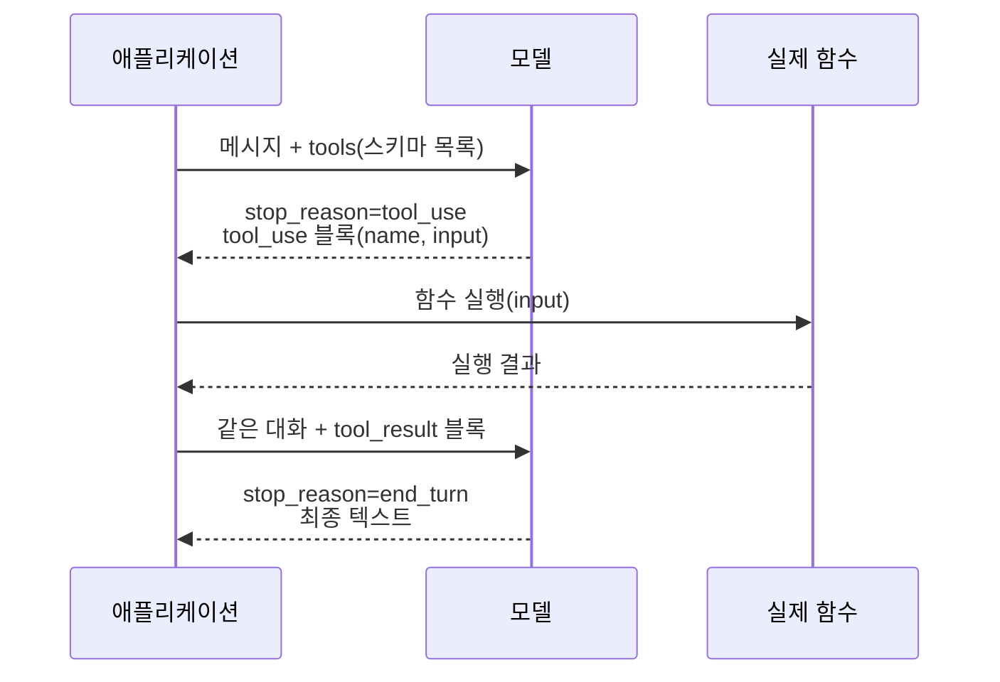

# Function Calling / Tool Use

LLM은 텍스트만 출력한다. 날씨를 조회하거나 DB를 읽거나 결제를 거는 일은 못 한다. Tool Use는 그 한계를 메우는 구조다. 모델에게 "네가 호출할 수 있는 함수 목록"을 알려주고, 모델이 "이 함수를 이 인자로 부르고 싶다"는 신호를 텍스트 대신 구조화된 블록으로 내보내면, 그걸 받아서 실제 함수를 실행한 뒤 결과를 다시 모델에게 넣어주는 식이다.

이 문서는 에이전트 전반(`LLM_Agent.md`, `Agent_Harness.md`)이 아니라 도구 호출이라는 메커니즘 하나에만 집중한다. 스키마를 어떻게 정의하고, 모델이 인자를 틀리게 만들 때 뭘 해야 하고, 병렬 호출과 실행 루프를 어떻게 돌리고, 무한 호출을 어떻게 막는지를 다룬다.

코드 예제는 Anthropic 메시지 API(`claude-opus-4-8`)를 기준으로 한다. OpenAI든 Gemini든 필드 이름만 다르지 구조는 같다. 모델이 "호출 의도"를 구조화된 블록으로 내보내고, 클라이언트가 실행하고, 결과를 되돌려주는 핵심 루프는 어디서나 동일하다.

## 1. 전체 흐름

도구 호출은 한 번의 API 호출로 끝나지 않는다. 모델이 도구를 부르고 싶어 하면, 그 요청을 받아 실행하고, 결과를 붙여 다시 모델을 호출하는 왕복이 반복된다.



여기서 헷갈리지 말아야 할 게 두 가지 있다.

첫째, 모델은 함수를 직접 실행하지 않는다. "이 함수를 이 인자로 부르겠다"는 의도만 내보낸다. 실제 실행은 전적으로 우리 코드 책임이다. 그래서 모델이 `delete_all_users()`를 부르고 싶어 해도, 실행할지 말지는 우리가 결정한다.

둘째, API는 상태가 없다. 매 호출마다 전체 대화 이력(사용자 메시지, 모델의 tool_use, 우리가 만든 tool_result)을 전부 다시 보내야 한다. tool_use 블록을 대화에 안 붙이고 tool_result만 보내면 에러가 난다. 짝이 안 맞기 때문이다.

## 2. 도구 스키마 정의

모델은 우리가 준 스키마만 보고 도구를 언제, 어떻게 쓸지 판단한다. 스키마는 세 부분이다. 이름, 설명, 입력 스키마(JSON Schema).

```python
import anthropic

client = anthropic.Anthropic()

tools = [
    {
        "name": "get_order_status",
        "description": "주문 번호로 배송 상태를 조회한다. 사용자가 '내 주문', '배송', "
                       "'언제 와' 같은 질문을 하면 이 도구를 쓴다.",
        "input_schema": {
            "type": "object",
            "properties": {
                "order_id": {
                    "type": "string",
                    "description": "주문 번호. 'ORD-' 접두사를 포함한 전체 문자열."
                },
                "include_history": {
                    "type": "boolean",
                    "description": "배송 이력 전체를 함께 반환할지 여부. 기본 false."
                }
            },
            "required": ["order_id"]
        }
    }
]
```

실무에서 도구가 제대로 안 불리는 문제의 8할은 스키마가 부실해서다. 몇 가지 짚을 점.

`description`이 가장 중요하다. 모델은 함수 본문을 못 본다. 설명 문장만 읽고 "지금 이 도구를 써야 하나"를 판단한다. 함수가 뭘 하는지만 적지 말고 **언제 부르는지**를 적어야 한다. "주문 상태를 조회한다"보다 "사용자가 배송을 물으면 이 도구를 쓴다"가 호출률을 확실히 높인다. 최근 모델일수록 도구를 보수적으로 부르는 경향이 있어서, 트리거 조건을 명시하는 게 더 중요해졌다.

`required`에 진짜 필수인 것만 넣어야 한다. 선택 인자까지 required로 묶으면 모델이 없는 값을 지어낸다. `include_history`처럼 기본값이 있는 건 required에서 빼고, 설명에 기본 동작을 적어둔다.

`enum`은 적극적으로 써라. 값이 정해진 파라미터(`"celsius" | "fahrenheit"`, 상태 코드 등)는 enum으로 박아두면 모델이 엉뚱한 값을 넣을 여지가 줄어든다.

도구 개수는 의식적으로 줄여야 한다. 도구가 수십 개면 모델이 비슷한 도구 사이에서 헷갈린다. 한 요청에서 실제로 쓰일 만한 것만 추려서 넣는 게 정확도에 낫다.

## 3. 잘못 생성된 인자 처리

모델은 스키마를 어기는 인자를 만든다. 이건 가끔 일어나는 예외가 아니라 항상 대비해야 하는 상황이다. 필수 필드를 빼먹거나, 타입을 틀리거나(숫자 자리에 `"3개"` 같은 문자열), 존재하지 않는 주문 번호를 넣거나 한다.

### 3.1 strict 모드로 스키마 위반 막기

타입·필수 필드 수준의 위반은 strict 모드로 원천 차단할 수 있다. 도구 정의에 `strict: true`를 넣으면 모델 출력이 스키마에 정확히 맞도록 제약된다. 단, `additionalProperties: false`와 `required`가 스키마에 있어야 한다.

```python
tools = [
    {
        "name": "create_ticket",
        "description": "지원 티켓을 생성한다.",
        "strict": True,
        "input_schema": {
            "type": "object",
            "properties": {
                "title": {"type": "string"},
                "priority": {"type": "string", "enum": ["low", "medium", "high"]}
            },
            "required": ["title", "priority"],
            "additionalProperties": False
        }
    }
]
```

`strict`는 도구 정의 자체에 붙인다. `tool_choice`에 붙이는 게 아니다. 여기를 헷갈리는 경우가 많다.

다만 strict가 막아주는 건 구조다. "값이 의미적으로 맞느냐"는 못 막는다. `order_id`가 문자열인 건 보장하지만 그게 실재하는 주문인지는 보장 못 한다. 그건 실행 단계에서 검증할 일이다.

### 3.2 실행 단계 검증과 에러 반환

도구 함수 안에서 입력을 검증하고, 문제가 있으면 예외를 던지는 대신 **모델이 읽을 수 있는 에러 메시지**를 만들어 돌려준다. 핵심은 `tool_result`에 `is_error: True`를 붙여서 보내는 것이다.

```python
def execute_tool(name, tool_input):
    if name == "get_order_status":
        order_id = tool_input.get("order_id", "")
        if not order_id.startswith("ORD-"):
            return {
                "content": f"잘못된 주문 번호 형식: '{order_id}'. "
                           f"'ORD-'로 시작하는 번호가 필요하다.",
                "is_error": True
            }
        order = db.find_order(order_id)
        if order is None:
            return {
                "content": f"주문 '{order_id}'을(를) 찾을 수 없다. "
                           f"번호를 다시 확인하도록 사용자에게 요청해라.",
                "is_error": True
            }
        return {"content": str(order.status), "is_error": False}
```

`is_error: True`로 돌려주면 모델은 그걸 읽고 스스로 보정한다. 사용자에게 번호를 다시 묻거나, 다른 도구를 시도하거나 한다. 여기서 에러 메시지를 친절하게 쓸수록 모델이 복구를 잘한다. "Invalid input"보다 "ORD-로 시작해야 한다, 사용자에게 다시 물어봐라"가 훨씬 낫다. 에러 메시지가 곧 모델에게 주는 다음 지시문이라고 생각하면 된다.

예외를 그냥 던져서 API 호출 자체를 죽이면 안 된다. 모델은 복구할 기회를 잃고, 사용자는 "오류가 발생했습니다"만 본다. 도구 안에서 실패는 정상 흐름의 일부로 다뤄야 한다.

### 3.3 JSON 파싱은 반드시 라이브러리로

모델이 만든 `input`은 SDK가 이미 파싱된 객체로 준다(`block.input`은 dict). 하지만 raw JSON 문자열을 직접 다뤄야 하는 상황이라면, 절대 정규식이나 문자열 매칭으로 파싱하지 마라. 모델은 유니코드 이스케이프나 슬래시 이스케이프를 모델 버전마다 다르게 내보낼 수 있다. `json.loads()`로만 파싱해야 깨지지 않는다.

## 4. 병렬 도구 호출

모델은 한 번의 응답에서 여러 도구를 동시에 부를 수 있다. "서울이랑 부산 날씨 알려줘"라고 하면 `get_weather("서울")`과 `get_weather("부산")`을 한 응답에 같이 담는다. 이게 기본 동작이다.

이때 주의할 게 두 가지다.

첫째, 실행은 동시에 해도 되지만(서로 의존이 없으면) **결과는 반드시 하나의 user 메시지에 모아서** 돌려줘야 한다. tool_result 블록을 메시지 여러 개로 쪼개서 보내면 안 된다. 쪼개 보내면 에러가 나거나, 더 고약하게는 모델이 "병렬 호출을 하면 안 되는구나"를 학습해서 이후로 병렬 호출을 안 하게 된다.

둘째, 실패한 도구도 결과를 빠뜨리면 안 된다. tool_use 블록 하나당 tool_result 하나가 짝이다. 하나라도 빠지면 API가 거부한다. 실패한 건 `is_error: True`로라도 반드시 채워서 보낸다.

```python
# 모델 응답에서 tool_use 블록을 모두 모은다
tool_use_blocks = [b for b in response.content if b.type == "tool_use"]

# 각각 실행 (서로 독립이면 스레드/asyncio로 동시 실행해도 된다)
tool_results = []
for block in tool_use_blocks:
    result = execute_tool(block.name, block.input)
    tool_results.append({
        "type": "tool_result",
        "tool_use_id": block.id,          # 어느 호출의 결과인지 짝을 맞추는 키
        "content": result["content"],
        "is_error": result["is_error"]
    })

# 모든 결과를 한 user 메시지로 보낸다
messages.append({"role": "user", "content": tool_results})
```

`tool_use_id`가 짝을 맞추는 키다. 모델이 부른 블록의 `id`를 결과의 `tool_use_id`에 그대로 넣어야 모델이 "이 결과가 그 호출에 대한 답"이라고 안다. 순서로 맞추려 하지 말고 id로 맞춰야 한다.

병렬 호출을 끄고 싶으면(한 번에 하나씩만 부르게 하려면) `tool_choice`에 `disable_parallel_tool_use: True`를 준다. 도구가 외부 상태를 바꾸고 순서가 중요한 경우에 쓴다.

## 5. 실행 루프

도구 호출은 한 왕복으로 안 끝난다. 모델이 도구를 부르고, 결과를 받고, 그 결과를 보고 또 다른 도구를 부르고, 그러다 최종 답을 내는 식이다. 이걸 직접 돌리는 루프는 이렇게 생겼다.

```python
def run_agent(user_input, tools, max_turns=10):
    messages = [{"role": "user", "content": user_input}]

    for turn in range(max_turns):
        response = client.messages.create(
            model="claude-opus-4-8",
            max_tokens=4096,
            tools=tools,
            messages=messages,
        )

        # 모델이 도구를 더 안 부르면 종료
        if response.stop_reason == "end_turn":
            messages.append({"role": "assistant", "content": response.content})
            return next(b.text for b in response.content if b.type == "text")

        # 모델 응답(tool_use 블록 포함)을 대화에 먼저 붙인다
        messages.append({"role": "assistant", "content": response.content})

        # 도구 실행 후 결과를 한 user 메시지로 붙인다
        tool_results = []
        for block in response.content:
            if block.type == "tool_use":
                result = execute_tool(block.name, block.input)
                tool_results.append({
                    "type": "tool_result",
                    "tool_use_id": block.id,
                    "content": result["content"],
                    "is_error": result["is_error"],
                })
        messages.append({"role": "user", "content": tool_results})

    # max_turns를 다 쓰고도 안 끝남 → 6장 참고
    raise RuntimeError(f"{max_turns}턴 안에 종료하지 못했다")
```

루프에서 가장 자주 틀리는 부분은 **assistant 응답을 대화에 안 붙이고 tool_result만 붙이는 것**이다. 모델의 tool_use 블록과 우리의 tool_result는 짝이다. tool_use가 대화에 없는데 tool_result만 있으면 API가 "이 결과가 누구 거냐"며 거부한다. 항상 `response.content` 전체를 assistant 메시지로 붙인 다음, tool_result를 user 메시지로 붙인다.

종료 조건은 `stop_reason`으로 판단한다. `end_turn`이면 모델이 할 말을 다 했다는 뜻이니 루프를 빠져나온다. `tool_use`면 도구를 더 부르겠다는 뜻이니 계속 돈다.

SDK에 따라서는 이 루프를 대신 돌려주는 tool runner 헬퍼가 있다. 직접 루프를 짜는 건 중간에 끼어들어 로깅하거나, 위험한 도구는 사람 승인을 받거나, 조건부로 실행을 건너뛰는 등 세밀한 제어가 필요할 때다. 단순히 끝까지 자동으로 돌리기만 하면 되면 헬퍼를 쓰는 게 편하다.

## 6. 무한 호출 방지

도구 루프는 안 끝날 수 있다. 모델이 같은 도구를 계속 부르거나, 두 도구를 번갈아 무한히 부르거나, 결과가 마음에 안 든다며 같은 호출을 반복하거나 한다. 자동으로 도는 루프에 안전장치가 없으면 API 비용이 폭주하고 응답은 영영 안 온다.

가장 기본은 **턴 수 상한**이다. 위 코드의 `max_turns`가 그것이다. 도구를 한 번 부르고 결과를 받는 게 한 턴이다. 대부분의 작업은 한 자릿수 턴 안에 끝난다. 10턴, 20턴 안에 안 끝나면 뭔가 잘못 돌고 있는 거다. 상한에 닿으면 무조건 멈추는 게 맞다.

상한에 닿았을 때 그냥 예외를 던지고 끝낼 수도 있지만, 모델에게 한 번 더 기회를 주는 방법도 있다. 마지막으로 도구를 빼고(`tool_choice`를 `none`으로) 호출해서, 지금까지 모은 정보로 답을 정리하게 만드는 것이다.

```python
# max_turns에 닿았을 때: 도구 없이 한 번 더 호출해 마무리시킨다
final = client.messages.create(
    model="claude-opus-4-8",
    max_tokens=4096,
    tool_choice={"type": "none"},   # 더는 도구를 못 부르게 막는다
    messages=messages,
)
return next(b.text for b in final.content if b.type == "text")
```

같은 도구를 같은 인자로 반복 호출하는 패턴은 별도로 잡아주면 좋다. 직전 호출의 `(name, input)`을 기록해두고, 똑같은 호출이 N번 연속되면 루프를 끊거나 모델에게 "같은 도구를 반복 호출하고 있다, 다른 접근을 해라"는 에러를 tool_result로 넣어준다.

```python
seen = {}
# ... 루프 안에서 ...
key = (block.name, json.dumps(block.input, sort_keys=True))
seen[key] = seen.get(key, 0) + 1
if seen[key] >= 3:
    tool_results.append({
        "type": "tool_result",
        "tool_use_id": block.id,
        "content": "같은 도구를 같은 인자로 반복 호출하고 있다. "
                   "다른 방법을 쓰거나 지금까지의 정보로 답을 정리해라.",
        "is_error": True,
    })
    continue   # 실제 실행은 건너뛴다
```

서버 측 도구(웹 검색, 코드 실행 등)를 쓸 때는 `stop_reason`이 `pause_turn`으로 올 수 있다. 서버 내부 도구 루프가 반복 한도에 닿았다는 신호다. 이때는 직전 user 메시지와 모델 응답을 그대로 다시 보내면 서버가 이어서 처리한다. 이 경우에도 무한히 이어붙이지 않도록 재개 횟수에 상한을 둔다.

비용 관점에서 한 가지 더. 매 턴마다 전체 대화 이력을 다시 보내기 때문에, 루프가 길어질수록 입력 토큰이 누적된다. 도구 결과가 큰 경우(긴 검색 결과, 큰 파일 내용)는 이게 빠르게 쌓인다. 같은 시스템 프롬프트와 도구 목록을 매번 보낸다면 프롬프트 캐싱으로 입력 비용을 크게 줄일 수 있다. 도구 목록은 요청의 맨 앞(`tools` → `system` → `messages` 순서)에 렌더링되므로, 도구를 도중에 추가·제거·재정렬하면 캐시가 통째로 깨진다. 도구 집합은 세션 내내 고정하는 게 캐시에 유리하다.

## 7. 정리

도구 호출의 본질은 단순하다. 모델은 "이 함수를 이 인자로 부르고 싶다"는 의도만 내보내고, 실행과 결과 반환은 전부 우리 코드가 책임진다. 그래서 실무에서 챙길 건 모델 쪽이 아니라 우리 쪽이다.

스키마는 모델이 도구를 쓸지 판단하는 유일한 근거다. 설명에 "언제 쓰는지"를 적고, required를 최소화하고, enum을 쓴다. 모델이 인자를 틀리게 만드는 건 항상 일어난다고 가정하고, strict로 구조를 잡고 실행 단계에서 의미를 검증하고 실패는 `is_error`로 돌려준다. 병렬 호출 결과는 한 user 메시지에 모아 보내고 빠뜨리지 않는다. 실행 루프에서는 assistant 응답을 반드시 대화에 붙이고, 턴 상한과 반복 호출 감지로 무한 루프를 막는다.

이 메커니즘 위에 컨텍스트 관리, 권한 검사, 후크 같은 걸 얹으면 에이전트 하네스가 된다. 그쪽은 `Agent_Harness.md`에서 다룬다.
