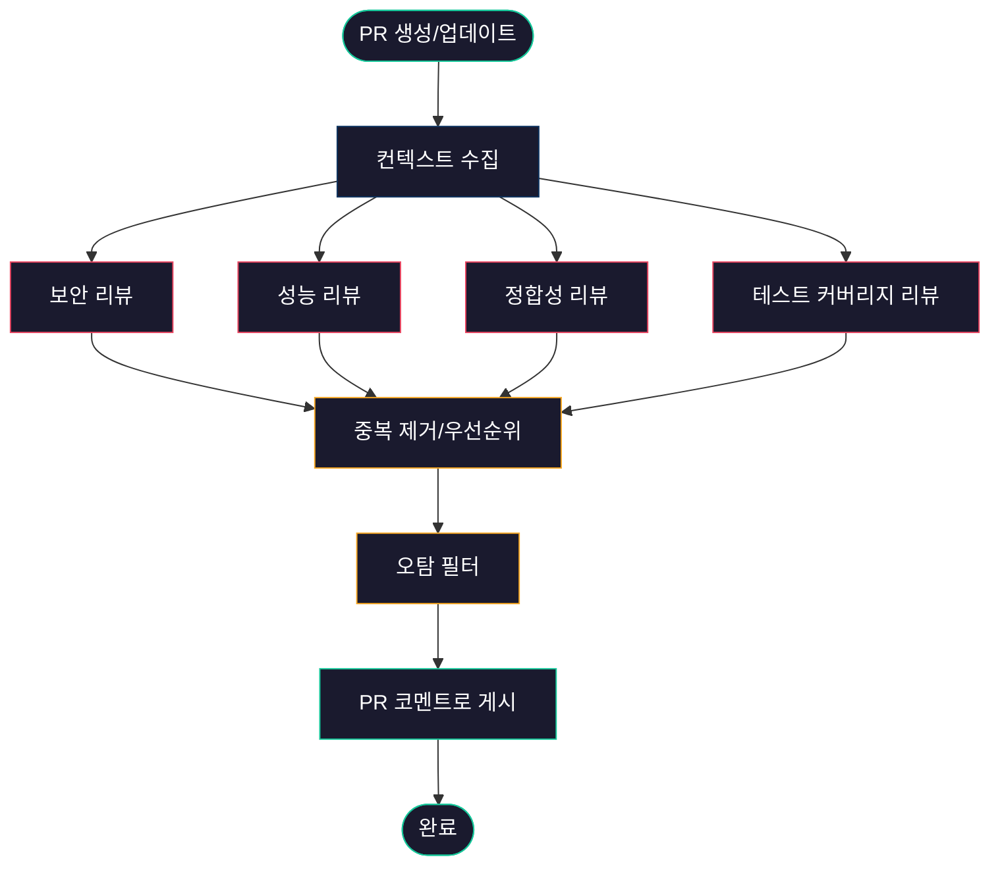

# UltraReview - AI 기반 심층 코드 리뷰

## 1. UltraReview란 무엇인가

**UltraReview**는 LLM에게 PR 하나를 단순히 "훑어보게" 하는 것이 아니라, 여러 단계로 나눠서 각 단계마다 다른 관점으로 코드를 분석하게 만드는 리뷰 방식을 부르는 말이다. 요즘 팀마다 이름은 조금씩 다르다. "Deep Review", "Multi-pass Review", "Pipeline Review"라고도 부른다. 핵심은 같다. **한 번의 호출로 끝나지 않는 리뷰**다.

처음 LLM 코드 리뷰를 도입했을 때 대부분의 팀이 겪는 패턴이 있다. diff를 통째로 프롬프트에 넣고 "리뷰해줘"라고 요청한다. 결과는 그럴듯하지만 실제로 쓸 만한 지적은 10개 중 1~2개다. 나머지는 "변수명을 더 의미있게 지어보세요" 같은 일반론이다. 이걸 팀 채널에 공유하면 첫 주는 다들 신기해하지만, 둘째 주부터는 무시당한다.

UltraReview는 이 문제를 "리뷰를 한 방에 끝내지 말자"는 접근으로 푼다. 보안, 성능, 정합성, 테스트 커버리지처럼 관점을 나누고 각각 별도의 프롬프트로 리뷰하게 만든다. 각 단계에서 필요한 컨텍스트도 다르게 수집한다.

### 1.1 일반 `/review` 커맨드와의 차이

Claude Code나 Cursor에 내장된 `/review` 커맨드는 편리하지만 한계가 있다. 주로 현재 diff만 보고, 프롬프트는 범용이며, 결과를 어디에 쌓아둘지는 사용자 책임이다.

| 항목 | 일반 `/review` | UltraReview |
|------|---------------|-------------|
| 패스 수 | 1회 | 3~5회 (카테고리별) |
| 컨텍스트 | diff 중심 | diff + 호출부 + 테스트 + 의존성 |
| 프롬프트 | 범용 "리뷰해줘" | 관점별 전용 프롬프트 |
| 실행 주체 | 개발자 로컬 | 로컬 + CI 파이프라인 |
| 결과 집계 | 대화 창에 한 번 | 카테고리별 분리 후 merge |
| 비용 | 저렴 | 5~10배 더 든다 |

비용이 몇 배 더 드는 대신, 얻는 건 "실제로 고치게 되는 지적"의 비율이 높아진다는 점이다. 일반 리뷰가 1/10 채택률이라면 잘 튜닝된 UltraReview는 4~5/10 수준까지 올라간다. 이 비율이 올라가지 않으면 결국 팀원들이 리뷰 결과를 안 본다.

---

## 2. 다단계 리뷰 파이프라인 설계

UltraReview의 핵심은 **파이프라인**이다. 각 단계는 독립적으로 실행되고, 마지막에 결과를 하나로 합친다.



### 2.1 왜 단계를 나누는가

한 프롬프트에 "보안, 성능, 정합성, 테스트 전부 봐줘"라고 넣으면 모델은 결국 한 카테고리에만 집중하거나 전부 얕게 본다. LLM은 긴 지시사항에서 앞뒤 일부만 강하게 반응하는 경향이 있다. 관점별로 나눠서 호출하면 각 호출에서는 그 관점에 집중하게 된다.

실제로 해 보면 체감이 된다. 보안 전용 프롬프트로 돌릴 때와 통합 프롬프트로 돌릴 때, SQL Injection 가능성 같은 지적이 나오는 빈도가 2배 이상 차이 난다.

### 2.2 병렬 vs 순차 실행

4개 카테고리를 순차로 돌리면 20~40초, 병렬로 돌리면 10초 안쪽이다. 대부분 병렬로 돌리는 게 맞다. 다만 다음 경우는 순차가 낫다.

- 이전 단계 결과를 다음 단계 프롬프트에 넣을 때 (예: 보안 지적이 있으면 테스트 커버리지 검토 시 해당 영역 집중)
- Rate limit이 빡빡한 API 키를 쓸 때
- 비용이 민감해서 앞 단계에서 "심각한 문제 없음"이면 뒤 단계를 스킵하고 싶을 때

### 2.3 결과 병합 단계

각 카테고리 결과를 그대로 PR에 붙이면 코멘트가 20개씩 달린다. 개발자들이 금방 피로해진다. 병합 단계에서 다음을 처리한다.

- **중복 제거**: 성능과 정합성 리뷰가 같은 라인을 다른 이유로 지적할 수 있다. 같은 라인에 대한 지적을 묶는다.
- **우선순위 정렬**: Critical → Major → Minor로 분류해 Critical만 PR에 코멘트로 달고 나머지는 요약 한 줄로 처리한다.
- **허용 범위 필터**: 팀에서 합의된 "이건 알고 있지만 지금 안 고침" 패턴을 걸러낸다.

---

## 3. 컨텍스트 수집 범위

UltraReview가 일반 리뷰보다 나은 결과를 내는 가장 큰 이유는 **컨텍스트 수집 범위**가 넓기 때문이다. diff만 보면 실제 프로덕션에서 문제가 될지 알 수 없다.

### 3.1 수집해야 하는 것

다음 4가지를 모두 수집해서 프롬프트에 넣는다.

**1) Diff 자체**

`git diff origin/main...HEAD` 결과. 파일별, 훨씬 큰 PR이라면 hunk 단위로 쪼갠다. 한 번에 LLM 컨텍스트에 들어갈 크기를 넘으면 청크로 나눠서 각각 리뷰하고 결과를 합친다.

**2) 변경된 함수의 호출부**

변경된 함수가 어디서 불리는지 찾아서 해당 파일도 컨텍스트에 포함한다. `grep` 또는 언어별 LSP를 써서 찾는다. 호출부를 모르면 "이 함수의 반환 타입이 바뀌었는데 괜찮을지" 같은 지적을 못 한다.

**3) 관련 테스트 파일**

`src/user/service.ts`가 변경됐다면 `src/user/service.test.ts`를 찾아서 같이 넣는다. 테스트가 없으면 "테스트가 없음"이라는 사실 자체가 중요한 정보다.

**4) 의존성 정보**

변경된 파일이 import하는 모듈, 특히 변경 내용과 관련된 모듈의 시그니처. `package.json`의 버전도 포함한다. 외부 라이브러리 메서드를 쓰는데 그 라이브러리의 최신 버전에서 deprecated 된 경우를 잡아낼 수 있다.

### 3.2 컨텍스트 수집 스크립트 예시

```python
import subprocess
from pathlib import Path

def collect_context(base_branch="origin/main"):
    # 1) diff
    diff = subprocess.check_output(
        ["git", "diff", f"{base_branch}...HEAD"],
        text=True
    )

    # 2) 변경된 파일 목록
    changed_files = subprocess.check_output(
        ["git", "diff", "--name-only", f"{base_branch}...HEAD"],
        text=True
    ).strip().split("\n")

    # 3) 각 파일의 관련 테스트/호출부 수집
    context = {"diff": diff, "related": {}}
    for f in changed_files:
        if not f.endswith((".ts", ".py", ".java")):
            continue

        # 테스트 파일
        test_candidates = find_test_files(f)
        # 호출부 (단순 grep 기반)
        callers = find_callers(f)

        context["related"][f] = {
            "tests": [Path(t).read_text() for t in test_candidates if Path(t).exists()],
            "callers": callers,
        }

    return context

def find_test_files(source_path: str):
    base = Path(source_path).stem
    dir_ = Path(source_path).parent
    return [
        str(dir_ / f"{base}.test.ts"),
        str(dir_ / f"{base}.spec.ts"),
        str(Path("tests") / f"test_{base}.py"),
    ]

def find_callers(source_path: str, max_results: int = 20):
    module = Path(source_path).stem
    try:
        result = subprocess.check_output(
            ["grep", "-rn", "--include=*.ts", f"from .*{module}", "src/"],
            text=True
        )
        return result.splitlines()[:max_results]
    except subprocess.CalledProcessError:
        return []
```

이 스크립트는 실무에서 쓸 땐 더 정교하게 만들어야 한다. 특히 `find_callers`는 단순 grep이라 false positive가 많다. 규모가 커지면 tree-sitter 같은 파서를 써서 import 그래프를 정확히 만드는 게 낫다.

### 3.3 컨텍스트가 너무 커질 때

큰 PR에서는 모든 걸 다 넣으면 컨텍스트 윈도우를 넘어간다. 이럴 땐 아래 방식으로 쪼갠다.

- 파일 단위로 나누되, 서로 강하게 연결된 파일은 같은 청크에
- 각 청크에 같은 시스템 프롬프트를 앞에 붙이고 결과는 각각 받아서 병합
- 병합 단계에서 중복 지적 제거

500줄 넘는 PR은 사실 사람이 리뷰해도 품질이 떨어진다. UltraReview 결과가 나빠지는 건 도구 문제라기보다 PR 크기 문제인 경우가 많다. 팀 차원에서 "PR은 400줄 이하로"라는 룰을 두는 게 결과적으로 리뷰 품질에 더 큰 영향을 미친다.

---

## 4. 리뷰 카테고리

카테고리를 무작정 늘리면 관리가 어렵다. 실무에서 자리잡는 조합은 보통 4개다.

### 4.1 보안 리뷰

가장 가치가 높은 카테고리다. 사람이 놓치는 패턴을 LLM이 잘 잡는다.

보는 관점:
- SQL Injection (특히 동적 쿼리 조립)
- 인증/인가 누락 (엔드포인트에 auth 미들웨어 빠짐)
- 민감정보 로깅 (비밀번호, 토큰이 로그로 나가는 경우)
- CORS 설정 변경, CSP 헤더 변경
- 외부 입력을 직접 파일 경로나 명령어에 붙이는 경우

보안 리뷰는 false positive 비율이 높아도 수용 가능하다. 실제 사고 하나 막는 게 false positive 100개 처리 비용보다 크다.

### 4.2 성능 리뷰

보는 관점:
- N+1 쿼리 (루프 안에서 DB 호출)
- 불필요한 O(n²) 알고리즘
- 캐시 미스를 유발하는 변경
- 큰 객체의 불필요한 복사
- 동기 I/O가 이벤트 루프를 막는 경우

성능 리뷰는 컨텍스트가 중요하다. 호출 빈도를 모르면 의미 없는 지적이 많이 나온다. 관리자 페이지의 하루 5번 호출되는 API에 "이 루프가 O(n²)입니다"라고 지적하는 건 시간 낭비다. 프롬프트에 "이 파일의 예상 호출 빈도" 같은 힌트를 넣으면 지적 품질이 올라간다.

### 4.3 정합성 리뷰

정합성(consistency)은 이 프로젝트의 기존 관례와 맞는지를 본다.

보는 관점:
- 네이밍 컨벤션 일관성
- 에러 처리 패턴 (프로젝트가 Result 타입을 쓰는데 try/catch로 throw하는 경우)
- 로깅 포맷, 로그 레벨 사용
- 트랜잭션 경계 설정 방식
- 의존성 주입 패턴

정합성은 레퍼런스 파일을 프롬프트에 같이 넣어야 잘 나온다. "이 프로젝트의 다른 서비스 파일을 참고해서 패턴이 다른 부분을 지적해"라고 요청한다.

### 4.4 테스트 커버리지 리뷰

단순히 "테스트가 있냐"를 넘어서, **어떤 시나리오가 빠졌는지**를 보게 만든다.

보는 관점:
- 새 분기(if)에 대한 테스트 케이스 존재 여부
- 에러 경로 테스트 (성공 경로만 있고 실패 케이스 없음)
- 경계값 테스트 (0, 음수, 빈 배열, null)
- 동시성 관련 테스트 (해당하는 경우)

`diff`와 `테스트 파일의 diff`를 함께 프롬프트에 넣고 "코드 변경에 비해 테스트 변경이 커버하지 못하는 시나리오"를 물어본다.

---

## 5. 프롬프트 예시

아래는 보안 카테고리 프롬프트의 실제 예시다. 다른 카테고리도 비슷한 구조로 만든다.

```
당신은 10년차 백엔드 보안 엔지니어다. 아래 Pull Request를 "보안" 관점에서만 리뷰한다.
성능, 스타일, 일반 버그는 지적하지 마라.

[검토 대상]
- 변경된 diff
- 변경 파일이 import하는 모듈 시그니처
- 변경 파일을 호출하는 코드 일부

[보는 것]
1. 외부 입력이 직접 SQL/쉘/파일 경로에 들어가는지
2. 인증/인가 미들웨어가 빠진 엔드포인트가 있는지
3. 비밀번호, 토큰, PII가 로그/응답에 포함되는지
4. 헤더/쿠키 설정 변경이 보안 정책을 약화시키는지
5. 외부 라이브러리 호출 시 검증되지 않은 입력을 전달하는지

[출력 형식]
각 지적은 아래 JSON으로 출력한다. 지적할 게 없으면 빈 배열을 반환한다.

[
  {
    "file": "src/user/controller.ts",
    "line": 42,
    "severity": "critical|major|minor",
    "category": "security",
    "title": "한 줄 요약",
    "description": "구체적 설명과 공격 시나리오",
    "suggestion": "수정 예시 코드"
  }
]

[주의]
- 확실하지 않으면 지적하지 않는다. false positive는 팀 신뢰를 해친다.
- "~할 수도 있다" 같은 추측성 지적은 제외한다.
- 이미 검증된 라이브러리(예: bcrypt, argon2)의 사용 자체를 문제삼지 않는다.

[입력]
<여기에 diff와 컨텍스트 삽입>
```

핵심은 **"확실하지 않으면 지적하지 말라"**는 지시다. 이거 하나로 false positive가 절반 이상 줄어든다. LLM은 기본적으로 "뭐라도 말해야 한다"는 편향이 있어서, 명시적으로 침묵을 허용하지 않으면 없는 문제도 만들어낸다.

---

## 6. CI 통합 (GitHub Actions)

로컬에서만 돌리면 사람마다 사용 빈도가 다르다. CI에 붙여서 PR마다 자동 실행되게 만드는 게 정착의 핵심이다.

```yaml
name: UltraReview

on:
  pull_request:
    types: [opened, synchronize, reopened]

jobs:
  ultrareview:
    runs-on: ubuntu-latest
    permissions:
      contents: read
      pull-requests: write

    steps:
      - uses: actions/checkout@v4
        with:
          fetch-depth: 0

      - name: Setup Python
        uses: actions/setup-python@v5
        with:
          python-version: "3.12"

      - name: Install deps
        run: pip install anthropic gitpython

      - name: Collect context
        id: ctx
        run: |
          python scripts/ultrareview/collect.py \
            --base "${{ github.event.pull_request.base.sha }}" \
            --head "${{ github.event.pull_request.head.sha }}" \
            --out /tmp/context.json

      - name: Run review pipeline
        env:
          ANTHROPIC_API_KEY: ${{ secrets.ANTHROPIC_API_KEY }}
        run: |
          python scripts/ultrareview/run.py \
            --context /tmp/context.json \
            --categories security,performance,consistency,coverage \
            --out /tmp/findings.json

      - name: Post review comments
        env:
          GH_TOKEN: ${{ secrets.GITHUB_TOKEN }}
        run: |
          python scripts/ultrareview/post.py \
            --findings /tmp/findings.json \
            --pr "${{ github.event.pull_request.number }}"
```

### 6.1 CI 연동 시 주의사항

**동시성 제어**: `synchronize`는 푸시할 때마다 실행된다. 개발자가 연속 푸시하면 같은 PR에 대해 리뷰가 중복 실행된다. `concurrency` 블록으로 이전 실행을 취소한다.

```yaml
concurrency:
  group: ultrareview-${{ github.event.pull_request.number }}
  cancel-in-progress: true
```

**비용 제어**: PR이 10개 동시에 열리면 비용이 한 번에 튄다. 월 예산 한도를 로그로 기록하고 초과하면 스킵하는 로직이 필요하다. 실무에서는 보통 월 리뷰 예산을 정해 두고, 소진되면 보안 카테고리만 돌리는 degraded mode로 전환한다.

**PR 크기 제한**: diff가 5000줄 넘는 PR은 아예 스킵하고 "PR이 너무 커서 UltraReview를 실행하지 않았습니다. 분할을 권장합니다"라는 코멘트만 남긴다. 큰 PR을 억지로 돌리면 비용은 많이 드는데 품질이 낮아서 손해다.

**Draft PR 제외**: Draft 상태 PR은 스킵한다. 개발자가 중간 상태에서 계속 푸시하는데 리뷰가 돌면 피로해진다.

---

## 7. 오탐과 과한 지적 다루기

UltraReview를 실무에 도입할 때 가장 큰 골치는 **false positive**와 **nitpick**이다. 둘 다 방치하면 팀이 리뷰 결과를 무시하기 시작한다.

### 7.1 오탐(False Positive)의 유형

실무에서 자주 나오는 오탐 패턴:

- "SQL Injection 가능성이 있습니다" → 실제로는 파라미터 바인딩이 적용되는 ORM 메서드
- "N+1 쿼리입니다" → 실제로는 `includes`/`join`이 이미 적용됨
- "테스트가 없습니다" → 실제로는 다른 디렉토리 구조에 테스트가 존재
- "에러 처리가 없습니다" → 상위 레벨에서 처리하는 에러 바운더리가 있음

### 7.2 대응 방식

**레퍼런스 룰북**: 프로젝트 루트에 `.ultrareview/rules.md`를 두고 "이 프로젝트에서 false positive로 간주하는 패턴"을 기록한다. 리뷰 프롬프트에 이 파일 내용을 넣는다.

```markdown
# UltraReview 예외 규칙

## 보안
- TypeORM의 `repository.findOne({ where: {...} })`는 SQL Injection 위험 없음
- `@CurrentUser()` 데코레이터가 있는 엔드포인트는 auth 미들웨어 적용됨

## 성능
- `src/admin/**`는 관리자 전용, 호출 빈도 낮음. O(n²) 지적 제외
- 배치 스크립트(`scripts/batch/**`)는 성능 검토 제외

## 테스트
- 타입 정의 파일(`*.d.ts`)은 테스트 불필요
- `migrations/**`는 테스트 불필요
```

**피드백 루프**: PR 저자가 "이건 false positive"라고 코멘트한 지적을 주기적으로 모아서 프롬프트와 rules.md를 업데이트한다. 2주에 한 번씩만 해도 지적 품질이 올라간다.

**Severity 필터**: 처음에는 `critical`만 PR 코멘트로 달고 `major`, `minor`는 봇이 요약만 남기게 한다. 팀이 익숙해지면 점진적으로 올린다.

### 7.3 Nitpick 줄이기

Nitpick은 기술적으로 틀린 건 아닌데 쓸데없는 지적이다. "변수명을 더 구체적으로"나 "주석을 추가하세요" 같은 것들.

프롬프트에 다음을 추가하면 크게 줄어든다:

- "스타일 지적 금지. 네이밍, 주석, 포맷팅은 지적하지 마라."
- "프로덕션에서 실제로 문제가 될 수 있는 것만 지적해라."
- "확신이 60% 이하면 출력하지 마라."

완전히 없어지진 않는다. 하지만 횟수를 5분의 1 수준으로 줄일 수 있다.

---

## 8. 실제 사용 시 주의사항과 트러블슈팅

### 8.1 비용이 예상보다 빨리 소진된다

첫 달에 흔히 겪는 문제다. 원인은 보통 다음 중 하나다.

- **큰 PR이 섞여 있음**: diff가 몇천 줄짜리 PR이 2~3개만 있어도 월 예산을 삼킨다.
- **Synchronize 이벤트마다 실행**: 한 PR에 15번 푸시하면 15번 실행된다. concurrency 설정을 빼먹은 경우.
- **리트라이 로직 없음**: API 에러 시 무한 재시도하면서 토큰을 계속 소모하는 버그.

해결은 모니터링부터다. 리뷰 실행마다 입력 토큰, 출력 토큰, 비용을 로그로 남겨 두고 일간/주간으로 집계한다. 평소 대비 급증하는 날을 찾아서 원인을 본다.

### 8.2 리뷰 품질이 시간이 지나면서 떨어진다

도입 첫 주는 다들 만족하는데, 한 달 후에 "요즘 리뷰 별로 안 좋아졌어"라는 얘기가 나온다. 실제로 모델은 그대로인데 체감이 떨어진다. 원인은 보통 다음이다.

- 팀이 익숙한 지적은 자동으로 처리하고, 새로운 지적만 기억에 남는다.
- 프로젝트가 커지면서 컨텍스트 수집이 불완전해져서 예전만큼 정확한 지적이 안 나온다.
- rules.md가 자꾸 커지면서 프롬프트가 혼탁해진다.

대응은 정기 점검이다. 3개월에 한 번은 rules.md와 프롬프트를 정리한다. 그리고 "최근 실제 버그 중 UltraReview가 잡을 수 있었지만 놓친 케이스"를 모아서 프롬프트에 예시로 추가한다.

### 8.3 개발자들이 리뷰를 무시한다

이게 가장 심각하다. 일단 무시하기 시작하면 되돌리기 어렵다. 원인은 대부분 다음 중 하나다.

- 지적이 너무 많다 (PR 하나에 20개 이상)
- nitpick 비율이 높다
- 같은 지적이 반복해서 나온다 (rules.md 미반영)
- 지적이 맞지만 수정 제안이 부실하다

**한 PR당 Critical 지적 5개 이하**라는 상한을 두는 것이 실무 경험상 가장 효과적이다. 많아 보이면 우선순위를 매겨서 5개만 남긴다. 사람 리뷰어도 한 PR에 20개 지적을 받으면 의욕이 떨어진다.

### 8.4 LLM이 존재하지 않는 라인을 지적한다

"line: 145에서 문제가 있습니다"라고 했는데 그 파일은 100줄밖에 안 되는 경우. LLM이 환각을 일으킨 경우다.

검증 단계를 넣어야 한다. 지적 결과를 받으면 해당 file/line이 실제 diff에 존재하는지 확인하고, 존재하지 않으면 버린다. 그리고 해당 패턴이 자주 나오는 카테고리가 있다면 프롬프트에 "라인 번호는 diff에 명시된 라인만 사용한다"를 강조한다.

### 8.5 같은 PR에 여러 번 같은 코멘트가 달린다

봇이 푸시마다 새로 코멘트를 달면 금방 스레드가 지저분해진다. 처리 방식은 두 가지다.

- **이전 봇 코멘트 모두 삭제 후 재작성**: 간단하지만 히스토리가 사라진다.
- **기존 코멘트 업데이트(edit)**: 깔끔하지만 구현이 좀 귀찮다. `PATCH /repos/{owner}/{repo}/issues/comments/{comment_id}` 로 업데이트한다.

GitHub Actions 예시에서는 봇이 남긴 이전 코멘트를 찾아서 업데이트하거나, 해결된 지적은 "resolved" 표시를 남기는 방식이 낫다.

### 8.6 민감한 코드를 LLM에 보내도 되는가

이건 조직의 보안 정책에 따라 결정된다. 사내 정책이 외부 LLM API 사용을 막는 경우라면 selfhosted 모델(CodeLlama, DeepSeek-Coder 같은 것)로 돌리거나, 엔터프라이즈 계약으로 "학습에 사용하지 않음"이 보장된 API를 쓴다.

PR 내용에 다음이 포함되는 경우는 특히 주의한다:
- 프로덕션 데이터베이스 스키마 전체
- 실제 API 키가 섞인 config 파일
- 고객 데이터 샘플이 포함된 테스트 픽스처

전처리 단계에서 정규식으로 명백한 시크릿 패턴(AWS 키, JWT 등)을 마스킹하는 로직은 기본으로 넣는 게 좋다.

---

## 9. 도입 순서

한 번에 다 만들면 실패한다. 실무에서 자리잡은 순서는 보통 이렇다.

1주차: 로컬에서 수동으로 보안 카테고리 프롬프트만 돌려본다. diff만 넣고 결과 본다.

2~3주차: 컨텍스트 수집 스크립트를 만든다. 호출부와 테스트를 같이 넣기 시작한다.

4주차: 카테고리를 성능, 정합성, 테스트 커버리지로 확장한다.

5~6주차: CI에 붙인다. 처음엔 draft PR 제외하고 Critical만 코멘트로 달도록 제한한다.

7~8주차: rules.md를 만들고 피드백 루프를 돌린다. false positive를 모아서 프롬프트를 다듬는다.

이 순서를 건너뛰어 1주차에 CI 통합까지 밀어붙이면, 대부분 팀이 둘째 주에 "이거 쓸 만한가?" 회의를 하고 끄게 된다. 사람 리뷰어를 신규로 영입했을 때 온보딩에 한두 달 걸리는 것과 비슷한 시간이 필요하다.
