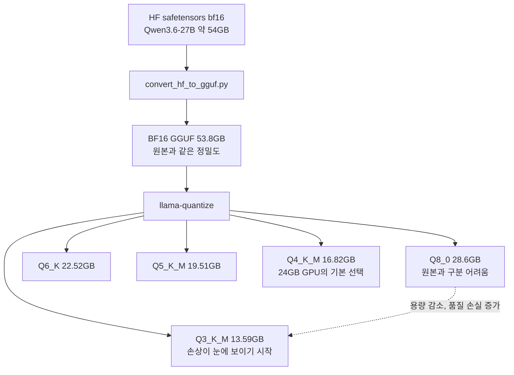
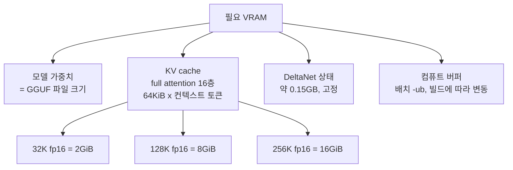
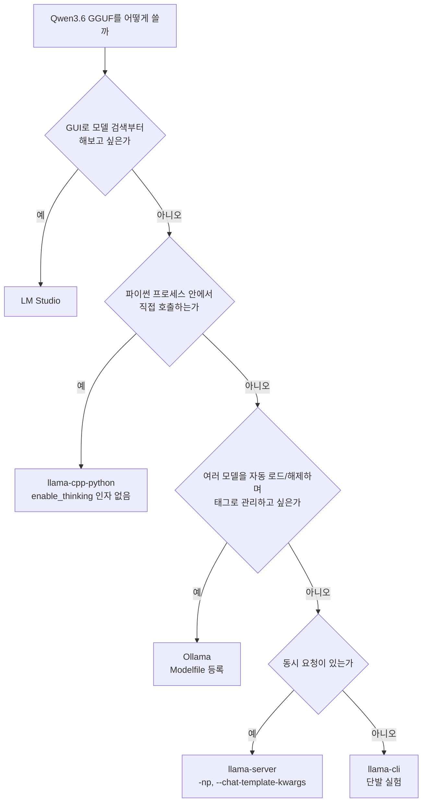
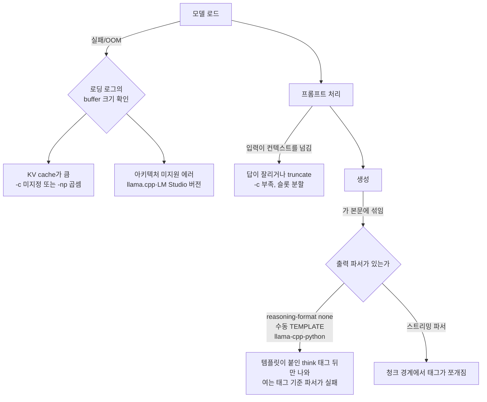
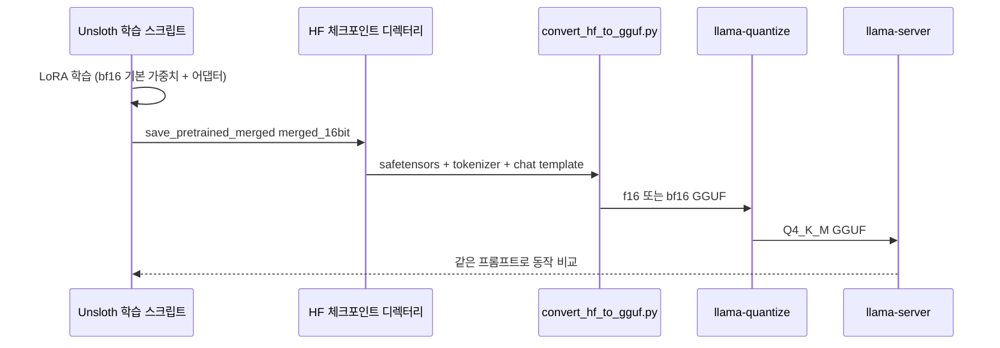
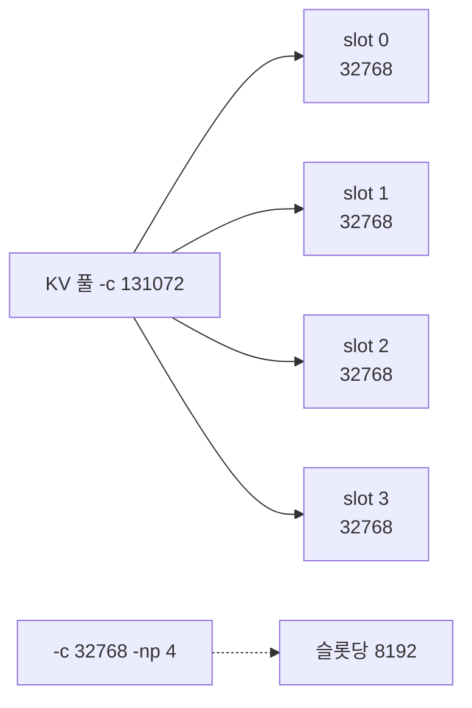

# unsloth/Qwen3.6-27B-GGUF 로컬 구동

## 1. 왜 이 저장소를 골라야 하는가

`Qwen/Qwen3.6-27B`는 bf16 약 54GB라 컨슈머 GPU에 안 올라가고, Qwen 쪽에는 GGUF 저장소가 없다. 서드파티 중 `unsloth/Qwen3.6-27B-GGUF`는 양자화 변형과 비전용 `mmproj`가 한 곳에 있고(`UD-`는 레이어별 정밀도를 달리 둔 Unsloth Dynamic 빌드), 학습부터 GGUF 변환까지 같은 팀 도구로 이어진다. 토크나이저 문제로 재업로드가 올라오니 오래된 파일이면 갱신일을 본다.

---

## 2. Qwen3.6 27B 모델 개요

값은 `Qwen/Qwen3.6-27B`의 `config.json`과 모델 카드 기준이다.

| 항목 | 값 |
|------|----|
| 파라미터 | 27B, dense (MoE 아님) |
| 레이어 | 64 = 16 × (Gated DeltaNet 3 + Gated Attention 1) |
| hidden / FFN | 5120 / 17408 |
| Gated Attention | Q 24헤드, KV 4헤드, head dim 256 |
| Gated DeltaNet | V 48헤드, QK 16헤드, head dim 128 |
| vocab | 248,320 (Qwen3의 151,669와 다르다) |
| 컨텍스트 | 기본 262,144, YaRN으로 최대 1,010,000 |
| 입력 | 텍스트 + 이미지 (비전 인코더 포함) |

full attention은 64층 중 16층뿐이다. 나머지 48층은 DeltaNet이라 고정 크기 상태만 갖고, KV cache는 16층분만 컨텍스트에 비례한다. 전층 기준으로 계산하면 4배 틀린다.

```python
# KV cache 크기 = K,V(2) x full attention 층(16) x KV 헤드(4) x head dim(256) x fp16(2B)
per_token = 2 * 16 * 4 * 256 * 2          # 65,536 B = 64KiB
for ctx in (32_768, 131_072, 262_144):
    print(ctx, per_token * ctx / 2**30, "GiB")   # 2.0 / 8.0 / 16.0
```

DeltaNet 상태는 `48헤드 × 128 × 128 × 4B × 48층`, 약 0.15GB로 컨텍스트와 무관하다.

기본이 reasoning 모드다. template이 생성 프롬프트 끝에 `<think>\n`을 붙여서 출력에는 `</think>`만 나온다(8.5절).

---

## 3. GGUF 포맷과 양자화가 실제로 하는 일

GGUF는 텐서, 토크나이저, chat template, 하이퍼파라미터를 한 파일에 담는다. 비전 입력은 별도 `mmproj-*.gguf`(BF16 0.93GB)를 `--mmproj`로 넘긴다.

양자화는 블록 단위로 스케일을 공유하고 값을 적은 비트로 저장한다. Q4_K_M 파일 크기로 역산하면 파라미터당 약 5bit다. `_S/_M/_L`은 일부 텐서를 더 높은 정밀도로 남기는 정도다.

용량이 줄수록 한국어·수식·코드 같은 작업에서 손실이 먼저 드러난다.



24GB GPU면 Q4_K_M, 여유가 있으면 Q5_K_M, Q6_K다. Q3 이하는 존댓말·반말이 섞이고 계산이 틀어지는 걸 자주 봤다. 품질 수치는 재지 않았으니 Unsloth의 GGUF 벤치마크를 본다.

---

## 4. 양자화 변형별 디스크/VRAM 요구량

디스크 크기는 저장소 파일 목록의 값이다. VRAM은 아래 합이다.



컨텍스트에 비례하는 건 KV cache뿐이다. 표는 32K, fp16 KV 기준 `파일 + 2.0 + 0.15 + 컴퓨트 버퍼 1.5GB`다. 1.5GB는 실측이 아닌 여유값이라 로딩 로그의 `compute buffer size`로 확인한다.

| Quant | 디스크 | 필요 VRAM (32K) | 맞는 환경 |
|-------|--------|-----------------|----------|
| UD-Q2_K_XL | 11.85GB | 약 15.5GB | 16GB GPU, 품질 손상 감수 |
| Q3_K_M | 13.59GB | 약 17.3GB | 16GB GPU는 컨텍스트를 줄여야 함 |
| Q4_K_M | 16.82GB | 약 20.5GB | RTX 4090 24GB, M2 Max 32GB |
| UD-Q4_K_XL | 17.61GB | 약 21.3GB | 24GB GPU |
| Q5_K_M | 19.51GB | 약 23.2GB | 24GB GPU에서 컨텍스트 여유 없음 |
| Q6_K | 22.52GB | 약 26.2GB | RTX 5090 32GB, A6000 48GB |
| Q8_0 | 28.6GB | 약 32.3GB | A6000 48GB, 통합 메모리 48GB 이상 |
| BF16 | 53.8GB | 약 57.5GB | 80GB급 |

`-ctk q8_0 -ctv q8_0`은 KV를 절반으로 줄이지만 32K에서는 1GiB 남짓이라 256K를 열 때 의미가 있다. Mac은 wired limit이 기준이고 `sudo sysctl iogpu.wired_limit_mb=28000`으로 올려야 할 수 있다. 넘기면 swap이 돈다.

---

## 5. llama.cpp로 로딩하는 기본 흐름

```bash
git clone https://github.com/ggml-org/llama.cpp
cd llama.cpp
cmake -B build -DGGML_CUDA=ON        # Mac은 Metal이 기본 포함
cmake --build build --config Release -j

hf download unsloth/Qwen3.6-27B-GGUF Qwen3.6-27B-Q4_K_M.gguf --local-dir ./models
```

```bash
./build/bin/llama-cli \
  -m ./models/Qwen3.6-27B-Q4_K_M.gguf \
  -ngl 99 -c 32768 -n 2048 \
  --temp 1.0 --top-p 0.95 --top-k 20 --min-p 0.0 \
  -p "서울의 지하철 2호선에 대해 설명해줘."
```

| 옵션 | 주의 |
|------|------|
| `-c` | 안 주면 소스 기준 0, 즉 학습 컨텍스트 262,144를 시도해 KV만 16GiB다. 기본 켜진 `--fit`이 줄여 주기도 하지만 빌드마다 다르니 명시한다 |
| `-ngl` | GPU 레이어 수. 모자라면 50처럼 낮춰 CPU로 넘기는데, 몫이 커질수록 속도가 급락한다 |
| `-fa` | 기본 `auto`. 로딩 로그로 켜졌는지 본다 |
| `--jinja` | 동봉 template 사용. 소스 기준 기본 켜짐 |
| YaRN | 262,144까지는 불필요. 그 위에서만 `rope_parameters`를 바꾸고, 모델 카드는 정적 YaRN이 짧은 입력 품질에 영향을 줄 수 있다고 경고한다 |

---

## 6. Ollama, LM Studio, llama-cpp-python 예제

요구에 따라 경로가 갈린다. thinking 토글(`chat_template_kwargs`)은 llama-server에서만 확인했고 llama-cpp-python에는 없다.



### 6.1 Ollama

Ollama 컨텍스트 기본값은 v0.35.0 문서에서 FAQ가 4096, context-length 문서가 VRAM별(24GiB 미만 4k, 24~48GiB 32k, 그 이상 256k)이다. `num_ctx`를 직접 주고 `ollama ps`로 확인한다. `OLLAMA_NUM_PARALLEL`만큼 컨텍스트가 곱해진다.

```
FROM ./models/Qwen3.6-27B-Q4_K_M.gguf

PARAMETER num_ctx 32768
PARAMETER temperature 1.0
PARAMETER top_p 0.95
PARAMETER top_k 20
PARAMETER stop "<|im_end|>"
PARAMETER stop "<|endoftext|>"

TEMPLATE """{{- if .System }}<|im_start|>system
{{ .System }}<|im_end|>
{{ end }}{{- range .Messages }}<|im_start|>{{ .Role }}
{{ .Content }}<|im_end|>
{{ end }}<|im_start|>assistant
<think>
"""
```

끝의 `<think>`는 `chat_template.jinja`의 생성 프롬프트와 맞춘 것이다. 이 Modelfile은 직접 돌려 검증하지 못했으니 렌더 결과를 jinja 원본과 대조한다.

```bash
ollama create qwen3.6-27b -f Modelfile
ollama run qwen3.6-27b "한국의 장마철 강수 패턴을 설명해줘."
```

### 6.2 LM Studio

내장 llama.cpp 런타임이 `qwen3_5`를 모르면 로드 단계에서 에러가 나니 런타임부터 올린다.

### 6.3 llama-cpp-python

```python
from llama_cpp import Llama

llm = Llama(
    model_path="./models/Qwen3.6-27B-Q4_K_M.gguf",
    n_ctx=32768, n_gpu_layers=99, flash_attn=True, verbose=False,
)
out = llm.create_chat_completion(
    messages=[
        {"role": "system", "content": "너는 친절한 한국어 어시스턴트다."},
        {"role": "user", "content": "GGUF가 safetensors와 뭐가 다른지 설명해줘."},
    ],
    temperature=1.0, top_p=0.95, top_k=20, max_tokens=2048,
)
print(out["choices"][0]["message"]["content"])
```

`create_chat_completion`에는 `chat_template_kwargs`가 없어 `enable_thinking`을 넘기면 `TypeError`다. 끄려면 llama-server로 옮기거나 프롬프트 끝을 `<think>\n\n</think>\n\n`로 직접 만들어 `create_completion`에 넣는다.

---

## 7. 환경별 성능 수치

decode는 토큰마다 가중치 전체를 읽어서 상한이 `대역폭 ÷ 파일 크기`다. 표는 제조사 공개 대역폭으로 계산한 상한이고 측정값이 아니다.

| 환경 | 대역폭 | Q4_K_M(16.82GB) 상한 | Q8_0(28.6GB) 상한 |
|------|--------|----------------------|-------------------|
| RTX 4090 24GB | 1,008 GB/s | 59.9 tok/s | 올라가지 않음 |
| RTX 5090 32GB | 1,792 GB/s | 106.5 tok/s | 62.7 tok/s |
| RTX A6000 48GB | 768 GB/s | 45.7 tok/s | 26.9 tok/s |
| M3 Max (40코어 GPU) | 400 GB/s | 23.8 tok/s | 14.0 tok/s |
| M3 Ultra | 819 GB/s | 48.7 tok/s | 28.6 tok/s |
| DDR5-5600 듀얼채널 CPU | 89.6 GB/s | 5.3 tok/s | 3.1 tok/s |

MTP·speculative decoding은 상한을 넘길 수 있다. prefill은 이 표로 못 구하니 `llama-bench`로 조건과 함께 잰다.

```bash
./build/bin/llama-bench -m ./models/Qwen3.6-27B-Q4_K_M.gguf \
  -ngl 99 -p 4096 -n 256 -b 2048 -ub 512 -fa 1
# 결과 옆에 GPU 모델, 드라이버, llama.cpp 커밋 해시, 컨텍스트, 배치를 함께 적는다
```

---

## 8. 실무에서 자주 만나는 문제들



### 8.1 OOM: 그런데 여유 VRAM이 있다고 찍힌다

24GB GPU에서 Q4_K_M(16.82GB)이 OOM이면 `-c`부터 본다. 안 주면 KV만 16GiB다. 컨텍스트 축소(`-c 16384`), KV 양자화, `-ngl` 낮추기 순으로 한다.

### 8.2 컨텍스트 길이 초과: 32K로 설정했는데 답이 중간에 끊긴다

입력이 실제로 `-c`를 넘긴 경우가 대부분이다. 토큰 수는 llama-tokenize로 센다.

```bash
./build/bin/llama-tokenize -m ./models/Qwen3.6-27B-Q4_K_M.gguf -f 문서.md --show-count
```

thinking은 추론이 출력 예산을 먼저 쓴다. `-n`이 작으면 `</think>` 전에 잘린다. 모델 카드는 출력 32,768토큰을 권한다. 슬롯 분할은 10.1절이다.

### 8.3 한국어 토큰화 이슈

Qwen3.6 tokenizer.json으로 쟀다. 한글 12,779자가 9,514토큰이라 1자당 0.74토큰이고 Qwen3는 0.99다. "안녕하세요"와 "괜찮아"는 3토큰이다. 영어 "Hello, how are you today?"는 25자 7토큰이라 글자 기준 속도는 영어의 30~40%다.

```python
from tokenizers import Tokenizer
t = Tokenizer.from_file("tokenizer.json")   # Qwen/Qwen3.6-27B 저장소 파일
print(len(t.encode("안녕하세요").ids))       # 3
```

저비트에서 "~"나 "…" 근처 UTF-8이 깨져 보인 적이 있다. 재현 조건은 못 정리했다.

### 8.4 Ollama가 컨텍스트를 내 설정대로 안 잡는다

기본값이 버전·VRAM에 따라 갈린다(6.1절). `ollama ps`의 `CONTEXT`로 확인하고, 서버 환경변수는 서버를 재시작해야 적용된다.

### 8.5 `<think>` 블록이 출력에 그대로 섞여 나온다

응답에는 `</think>`만 있고 `<think>`가 없다. 짝으로 지우는 정규식은 안 먹히니 `</think>` 앞을 자른다.

```python
def strip_think(text: str) -> str:
    return text.split("</think>", 1)[-1].lstrip("\n")
```

llama-server는 `--reasoning-format` 기본(auto)에서 추론을 `message.reasoning_content`로 분리한다. 섞여 나오면 `none`이거나 template을 직접 쓴 경우다.

```bash
llama-server ... --chat-template-kwargs '{"enable_thinking":false}'
```

```python
client.chat.completions.create(
    model="qwen3.6-27b", messages=messages,
    temperature=0.7, top_p=0.8, presence_penalty=1.5,
    extra_body={"top_k": 20, "chat_template_kwargs": {"enable_thinking": False}},
)
```

끄면 코드·수학 정확도가 떨어지는 경우가 있다. 끌 때 샘플링은 non-thinking 값으로 바꾼다.

---

## 9. Unsloth로 fine-tuning하고 GGUF로 내보내는 파이프라인



Unsloth의 Qwen3.5 fine-tuning 문서는 QLoRA(4bit)를 권하지 않고 27B bf16 LoRA에 VRAM 56GB를 쓴다고 적는다. 4090 24GB 한 장으로는 안 되고 `unsloth/Qwen3.6-27B-bnb-4bit` 저장소도 없다.

```python
from unsloth import FastLanguageModel

model, tokenizer = FastLanguageModel.from_pretrained(
    model_name="unsloth/Qwen3.6-27B",
    max_seq_length=4096,
    load_in_4bit=False,
    load_in_16bit=True,
    full_finetuning=False,
)
model = FastLanguageModel.get_peft_model(
    model, r=16, lora_alpha=16, lora_dropout=0, bias="none",
    target_modules=["q_proj", "k_proj", "v_proj", "o_proj",
                    "gate_proj", "up_proj", "down_proj"],
    use_gradient_checkpointing="unsloth",
)
# ... SFTTrainer 설정, train() ...

model.save_pretrained_merged("./qwen3.6-27b-merged", tokenizer, save_method="merged_16bit")
```

`merged_16bit`는 GGUF로 보내기 안전한 16bit 병합본이다. reasoning 예시를 75% 이상 섞으라는 것이 Unsloth 문서의 권고다.

```bash
python llama.cpp/convert_hf_to_gguf.py ./qwen3.6-27b-merged \
  --outfile qwen3.6-27b-custom-bf16.gguf --outtype bf16

./build/bin/llama-quantize qwen3.6-27b-custom-bf16.gguf qwen3.6-27b-custom-Q4_K_M.gguf Q4_K_M
```

스크립트가 아키텍처를 모르면 llama.cpp부터 올린다. `save_pretrained_gguf`는 이 과정을 한 번에 돌리지만 실패 지점을 알기 어려워 운영에서는 단계를 나눈다.

---

## 10. API 서버로 붙일 때 주의할 점

### 10.1 llama.cpp server

```bash
./build/bin/llama-server \
  -m ./models/Qwen3.6-27B-Q4_K_M.gguf \
  -ngl 99 -c 131072 -np 4 \
  --host 0.0.0.0 --port 8080 --api-key sk-local
```

`-c`는 슬롯 하나가 아니라 전체 KV 풀이고, 통합 KV가 아니면 슬롯당 `-c ÷ -np`다. `-c 32768 -np 4`는 슬롯당 8192라 긴 요청이 잘린다. 슬롯당 32K면 `-c 131072`이고 fp16 KV는 8GiB다. 슬롯당 상한은 `--kv-unified-per-slot`이다.



### 10.2 vLLM과 GGUF

vLLM 문서는 GGUF를 "highly experimental and under-optimized"라 적고 메모리 절감용으로 쓰라 한다. `vllm-gguf-plugin`과 `--tokenizer Qwen/Qwen3.6-27B`가 필요하다. 처리량이 목표면 모델 카드대로 safetensors나 `Qwen/Qwen3.6-27B-FP8`을 올린다.

### 10.3 공통 주의점

| 증상 | 원인 | 처방 |
|------|------|------|
| 클라이언트에 추론이 흘러나옴 | 스트리밍에서 `reasoning_content` 미분리 | 서버 분리를 쓰거나 `</think>`까지 버퍼링해 버림 |
| 다음 턴까지 생성 | stop 토큰 누락 | `<|im_end|>`, `<|endoftext|>` 지정 |
| 같은 세션인데 latency 튐 | 인스턴스마다 KV cache가 따로 | sticky session 또는 prefix cache |
| 배포 직후 첫 요청이 느림 | health check가 기동만 확인 | 로딩 완료 후 전환(blue-green). 16.82GB를 3GB/s NVMe로 읽으면 하한 6초 안팎이고 그 이상은 직접 잰다 |

---

## 11. 정리

Q4_K_M은 24GB GPU 한 장에 32K 컨텍스트로 올라간다. 숫자는 4절의 식과 `llama-bench`로 자기 장비에서 확인한다. fine-tuning은 bf16 LoRA에 56GB가 필요하다.
