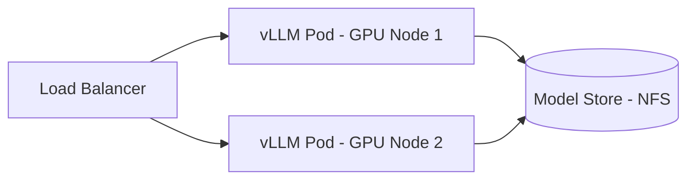

# 온프레미스 GPU 클러스터에서 vLLM 운영하기

## Ollama와 언제 바꿔야 하는가

Ollama는 단일 머신에서 모델 하나를 돌리는 데 잘 맞는다. 설치가 빠르고 REST API도 제공하지만, 동시 요청은 순차 처리한다. 두 번째 요청은 첫 번째가 끝날 때까지 기다린다.

팀 내 도구 수준이라면 Ollama로 충분하다. 동시 사용자가 늘거나 처리량 SLA가 생기는 순간이 전환점이다. Llama 3.1 8B 기준으로 Ollama는 단일 요청에서 15~20 tok/s를 낸다. 동시에 10명이 요청하면 각자 1.5~2 tok/s가 된다. vLLM은 같은 상황에서 continuous batching으로 묶어 10~12 tok/s를 유지한다.

| 항목 | Ollama | vLLM |
|---|---|---|
| 동시 요청 | 순차 처리 | continuous batching |
| 멀티 GPU | 단순 레이어 분할 | tensor parallel / pipeline parallel |
| 메트릭 | 없음 | Prometheus endpoint |
| OpenAI 호환 | 부분 | 완전 호환 |
| 메모리 관리 | 기본 | PagedAttention |

전환 시점은 대체로 동시 사용자 5명 이상이거나, 서비스 파이프라인에 LLM 호출이 포함되면서 처리량이 병목이 되는 때다.

## PagedAttention이 실제로 하는 일

LLM 추론에서 병목은 KV(Key-Value) 캐시 메모리다. Transformer가 토큰을 생성할 때마다 이전 토큰의 Key와 Value 텐서를 캐시에 저장하고 매 스텝마다 읽는다. 이 캐시가 요청마다, 레이어마다, 헤드마다 쌓인다.

전통적인 방식은 요청이 들어오면 max_seq_len 전체 길이에 대한 KV 캐시를 미리 할당한다. 실제로 4096 토큰을 다 쓰는 요청은 드물지만 메모리는 4096 기준으로 잡혀있다. 동시 요청 32개면 낭비가 크다.

PagedAttention은 OS 가상 메모리 페이징에서 이름을 따왔다. KV 캐시를 고정 크기 블록(block_size, 기본 16 토큰)으로 나눠 관리한다. 요청이 실제로 쓰는 만큼만 블록을 할당하고, 요청이 끝나면 블록을 즉시 반환한다.

부수 효과로 같은 prefix를 공유하는 시퀀스들이 KV 블록을 copy-on-write로 참조할 수 있다. `--enable-prefix-caching`을 켜면 동일한 시스템 프롬프트를 쓰는 요청들이 prefix 구간의 KV 블록을 공유한다. 첫 번째 요청 이후 prefill 비용이 거의 사라진다.

vLLM 논문에서는 기존 대비 최대 24배 throughput 향상을 보고했는데, 실제 운영에서는 모델 크기와 GPU 조합에 따라 3~8배 범위가 많다.

## 배포 전 메모리 계산

A100 80GB 한 장에 무엇을 올릴 수 있는지 계산하는 방법이다.

**모델 가중치 메모리:**

```
가중치 메모리 = 파라미터 수 × dtype 바이트 수
  fp32:   4바이트
  bf16:   2바이트
  int8:   1바이트
  int4:   0.5바이트

Llama 3.1 8B, bf16  → 8×10⁹ × 2 = 16GB
Llama 3.1 70B, bf16 → 70×10⁹ × 2 = 140GB (A100 80GB 단일 카드 불가)
```

**KV 캐시 메모리 (Llama 3.1 8B 기준):**

Llama 3.1 8B는 num_layers=32, num_kv_heads=8, head_dim=128이다.

```
블록 하나 크기 = 2(K+V) × num_layers × num_kv_heads × head_dim × block_size × dtype_bytes
              = 2 × 32 × 8 × 128 × 16 × 2
              = 2,097,152 바이트 ≈ 2MB

A100 80GB 가용 메모리:
  80GB - 16GB(가중치) - 3GB(CUDA 오버헤드) = 61GB

gpu_memory_utilization=0.90 적용 시: 61 × 0.90 ≈ 55GB를 KV 캐시에 사용

최대 블록 수: 55GB / 2MB ≈ 27,500 블록

max_seq_len=4096이면 요청당 필요 블록: 4096 / 16 = 256 블록
이론적 최대 동시 요청: 27,500 / 256 ≈ 107개
```

실제로는 모든 요청이 max_seq_len을 다 채우지 않기 때문에 수용 가능 요청 수가 이보다 많다. GQA(Grouped Query Attention)를 쓰는 모델은 num_kv_heads가 작아서 블록 크기가 더 작고 동시 처리 가능 요청이 늘어난다.

Llama 3.1 70B를 A100 4장에 올리면(tensor_parallel_size=4):
- 가중치: 140GB / 4 = 35GB per GPU
- KV 캐시 가용: (80 - 35 - 3) × 0.85 × 4 ≈ 144GB

## Docker 배포

단일 GPU 기본 구성:

```bash
docker run --gpus all \
  --shm-size 16g \
  -p 8000:8000 \
  -v ~/.cache/huggingface:/root/.cache/huggingface \
  vllm/vllm-openai:v0.6.3 \
  --model meta-llama/Llama-3.1-8B-Instruct \
  --dtype bfloat16 \
  --max-model-len 4096 \
  --gpu-memory-utilization 0.90 \
  --max-num-seqs 256
```

`--shm-size`는 멀티 GPU에서 GPU 간 NCCL 통신이 공유 메모리를 쓰기 때문에 중요하다. 기본값 64MB로 두면 tensor parallel 모드에서 NCCL 오류가 발생한다. 16GB 이상으로 잡는다.

멀티 GPU (tensor parallel):

```bash
docker run --gpus all \
  --shm-size 32g \
  -p 8000:8000 \
  -v ~/.cache/huggingface:/root/.cache/huggingface \
  vllm/vllm-openai:v0.6.3 \
  --model meta-llama/Llama-3.1-70B-Instruct \
  --dtype bfloat16 \
  --tensor-parallel-size 4 \
  --max-model-len 8192 \
  --gpu-memory-utilization 0.85
```

tensor parallel은 같은 노드 안의 GPU에서만 효율적이다. 노드를 넘어가면 네트워크 대역폭이 bottleneck이 되어 throughput이 떨어진다. 70B를 2노드 4GPU씩 8GPU로 돌려도 4GPU 대비 throughput 향상이 크지 않은 경우가 많다.

## Kubernetes 배포



NVIDIA Device Plugin이 설치된 클러스터 기준 Deployment:

```yaml
apiVersion: apps/v1
kind: Deployment
metadata:
  name: vllm-llama3-8b
spec:
  replicas: 1
  selector:
    matchLabels:
      app: vllm-llama3-8b
  template:
    metadata:
      labels:
        app: vllm-llama3-8b
      annotations:
        prometheus.io/scrape: "true"
        prometheus.io/port: "8000"
        prometheus.io/path: "/metrics"
    spec:
      containers:
      - name: vllm
        image: vllm/vllm-openai:v0.6.3
        args:
        - --model=/models/Llama-3.1-8B-Instruct
        - --dtype=bfloat16
        - --max-model-len=4096
        - --gpu-memory-utilization=0.90
        - --max-num-seqs=256
        - --max-num-batched-tokens=8192
        ports:
        - containerPort: 8000
        resources:
          limits:
            nvidia.com/gpu: "1"
          requests:
            nvidia.com/gpu: "1"
        volumeMounts:
        - name: model-store
          mountPath: /models
        - name: shm
          mountPath: /dev/shm
        livenessProbe:
          httpGet:
            path: /health
            port: 8000
          initialDelaySeconds: 120
          periodSeconds: 30
        readinessProbe:
          httpGet:
            path: /health
            port: 8000
          initialDelaySeconds: 60
          periodSeconds: 10
      volumes:
      - name: model-store
        nfs:
          server: 192.168.1.100
          path: /models
      - name: shm
        emptyDir:
          medium: Memory
          sizeLimit: 16Gi
```

`emptyDir`을 `Memory` medium으로 마운트하는 게 Docker의 `--shm-size` 에 대응한다. 빠뜨리면 멀티 GPU 파드에서 NCCL SharedMemory 오류가 난다.

모델 파일은 NFS에 미리 내려받아 두는 게 현실적이다. 파드가 뜰 때마다 HuggingFace에서 받으면 Llama 3.1 70B는 140GB를 받아야 해서 기동에 10분 이상 걸린다.

HPA를 GPU 파드에 붙이기는 어렵다. GPU 노드는 수가 제한적이고, 모델 로딩 시간이 길어 스케일아웃이 트래픽 스파이크에 대응하지 못한다. 고정 레플리카로 운영하고 앞단에 큐를 두는 방식이 더 실용적이다.

## Continuous Batching 파라미터

vLLM의 continuous batching은 iteration 단위로 동작한다. 한 스텝에서 decode 중인 요청들과 새로 들어온 prefill 요청을 함께 묶어 forward pass를 실행한다. 요청이 끝나면 그 자리에 새 요청이 채워진다.

핵심 파라미터:

```bash
--max-num-seqs 256
# 동시에 처리하는 최대 시퀀스 수
# 이 값을 넘는 요청은 큐에서 대기한다

--max-num-batched-tokens 8192
# 한 forward pass에서 처리하는 최대 토큰 수 (prefill + decode 합산)
# 긴 입력이 많으면 크게 잡아야 TTFT가 줄어든다

--max-model-len 4096
# 요청당 최대 컨텍스트 길이 (입력 + 출력 합산)
# 이보다 긴 요청은 에러로 반환된다
```

`max-num-batched-tokens`가 중요한 이유가 있다. prefill 단계에서 입력 토큰을 한 번에 처리하기 때문이다. 2048 토큰짜리 문서가 들어오면 그 요청 하나가 배치 토큰의 절반을 차지한다. 이 값이 너무 작으면 긴 입력이 여러 스텝에 걸쳐 처리되어 TTFT가 늘어난다.

설정 기준:
- 짧은 QA, 챗봇: `max-num-batched-tokens`를 `max-num-seqs × 평균 입력 길이` 수준으로 잡는다
- 문서 처리, RAG: `max-num-batched-tokens`를 크게 잡되 메모리가 허용하는 범위에서

`max-num-seqs`를 무작정 키우면 OOM이 난다. 위에서 계산한 이론적 최대치를 기준으로 시작해서 실제 부하를 보며 조정한다.

## 프로덕션에서 봐야 할 지표

vLLM은 `/metrics` 엔드포인트로 Prometheus 메트릭을 제공한다. Grafana와 연결해서 보는 지표들이다.

**처리량과 지연:**

```
vllm:request_success_total
  완료된 요청 수. rate()로 보면 RPS

vllm:e2e_request_latency_seconds
  요청 시작부터 마지막 토큰까지 전체 지연

vllm:time_to_first_token_seconds
  첫 토큰까지 걸린 시간. prefill 성능을 반영한다

vllm:time_per_output_token_seconds
  토큰 생성 간격. decode 성능을 반영한다
```

TTFT가 갑자기 늘면 prefill이 밀리는 것이고, TPOT가 늘면 decode가 느려지거나 GPU가 busy 상태다. 두 지표를 분리해서 보면 병목 위치가 드러난다.

**메모리와 큐 상태:**

```
vllm:gpu_cache_usage_perc
  KV 캐시 사용률 (0~1). 0.7~0.9 범위가 적당하다

vllm:num_running_seqs
  현재 처리 중인 시퀀스 수

vllm:num_waiting_seqs
  큐에서 대기 중인 시퀀스 수
```

`gpu_cache_usage_perc`가 0.95 이상이면 새 요청에 할당할 KV 블록이 부족해서 대기가 발생한다. 0.5 이하면 `max-num-seqs`를 늘릴 여지가 있다.

`num_waiting_seqs`가 지속적으로 0이 아닌 상태면 처리 용량이 부족한 시점이다. GPU를 추가하거나 더 작은 모델로 교체해야 한다.

**GPU 수준 지표 (DCGM Exporter):**

```
DCGM_FI_DEV_GPU_UTIL        # GPU SM 사용률
DCGM_FI_DEV_MEM_COPY_UTIL   # 메모리 대역폭 사용률
DCGM_FI_DEV_FB_USED         # 사용 중인 GPU 메모리 (MB)
DCGM_FI_DEV_POWER_USAGE     # 소비 전력 (W)
```

decode 단계에서 GPU SM 사용률이 30~50%에 머무는 경우가 많다. LLM decode는 메모리 대역폭 bound 작업이라 연산 유닛을 다 쓰지 않는다. SM이 100%에 가까우면 prefill 요청이 많이 들어오는 상황이다.

## OOM이 나는 흔한 원인

**prefix caching과 블록 고갈:** `--enable-prefix-caching`을 켜면 KV 블록이 캐시에 남아있다가 같은 prefix 요청에서 재사용된다. 캐시된 블록은 새 요청에 할당할 수 없어서 시간이 지나면서 가용 블록이 줄어든다. 처음엔 잘 돌다가 몇 시간 후 OOM이 나는 패턴이다. `gpu_cache_usage_perc`를 시계열로 보면 천천히 올라가는 추세가 보인다.

**max-model-len 설정 오류:** 설정된 max-model-len이 GPU 메모리가 수용할 수 있는 KV 캐시를 초과하면 서버 시작 시 오류가 난다.

```
ValueError: The model's max seq len (131072) is larger than the maximum number of tokens
that can be stored in KV cache (65536). Try increasing gpu_memory_utilization or
decreasing max_model_len when initializing the engine.
```

이 메시지가 나오면 `--max-model-len`을 줄이거나 `--gpu-memory-utilization`을 높인다.

**멀티 GPU NCCL 초기화 메모리:** tensor parallel 모드에서 NCCL이 GPU 메모리를 추가로 잡는다. 계산한 것보다 실제 사용량이 1~2GB 더 높다. `gpu_memory_utilization`을 0.90이 아닌 0.85로 시작하는 이유다. OOM이 나면 먼저 이 값을 0.05씩 낮춰본다.

**요청 취소 없는 긴 시퀀스 누적:** 클라이언트가 연결을 끊어도 vLLM이 이미 스케줄링한 시퀀스를 계속 처리한다. max_model_len이 긴 설정에서 클라이언트 재시도가 많으면 완료되지 않는 긴 시퀀스들이 KV 블록을 점유한다. `num_running_seqs`가 줄지 않으면서 `num_waiting_seqs`가 쌓이면 이 경우다. vLLM 0.5 이상에서는 `--cancellation-token-enable`(버전마다 플래그 이름이 다름)로 클라이언트 연결 끊김 시 시퀀스를 취소할 수 있다.
