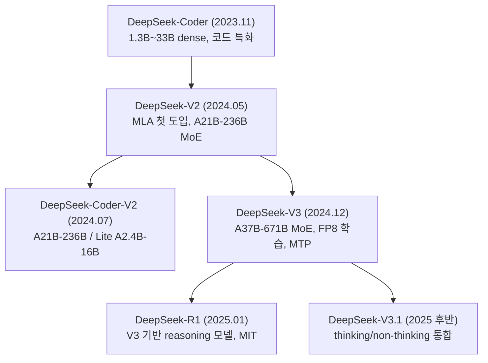

# DeepSeek

## 1. DeepSeek이 뭔지부터 정리

DeepSeek은 중국 항저우의 AI 연구소 深度求索(딥시크)가 만드는 LLM 패밀리다. 모회사가 퀀트 헤지펀드 High-Flyer라 GPU 자원이 두둑한 상태에서 출발했고, 2023년 말 DeepSeek-Coder를 시작으로 V2, V3, R1까지 1년 남짓 만에 라인업을 쌓았다. 2025년 초 R1을 공개했을 때 "OpenAI o1급 추론 모델을 훨씬 싼 학습 비용으로 만들었고 가중치까지 풀었다"는 점에서 시장이 크게 출렁였다.

실무 입장에서 DeepSeek의 위치는 Qwen과 비슷하면서도 다르다. 가중치가 공개되고 OpenAI 호환 API가 같이 굴러간다는 점은 같은데, 모델 사이즈가 671B급이라 자체 호스팅 진입 장벽이 훨씬 높다. Qwen은 0.5B부터 72B까지 촘촘하게 깔려 있어서 단일 GPU로도 굴릴 수 있지만, DeepSeek-V3/R1은 사실상 멀티노드 서버가 아니면 못 띄운다. 그래서 현실적으로는 "API로 쓰거나, 인프라 팀이 작정하고 노드를 붙이거나" 둘 중 하나다.

벤치마크상 V3는 GPT-4o, Claude 3.5 Sonnet 구간이고 R1은 o1 계열과 경쟁한다. 가격이 같은 품질 대비 압도적으로 싸다는 게 채택 이유의 절반이다. 코드, 수학, 추론 작업에서 강하고 영어/중국어가 메인이다. 한국어는 Qwen보다 약간 떨어지지만 V3 이상 사이즈에서는 실무에 쓸 만한 수준이다.

---

## 2. 모델 패밀리 구조

세대를 시간순으로 정리한다. 이름에 V2/V3/R1/Coder가 섞여 나와서 한 번 짚고 가는 게 낫다.



세대별로 실무에서 알아야 할 차이만 짚는다.

### 2.1 DeepSeek-V2 / Coder-V2

MLA(Multi-head Latent Attention)가 처음 들어간 세대다. MLA는 KV 캐시를 압축하는 어텐션 변종인데, 이게 self-host 비용에 직접 영향을 준다(3장에서 다룬다). Coder-V2는 V2를 코드 데이터로 추가 학습한 버전이고, 풀 사이즈(A21B-236B)와 Lite(A2.4B-16B) 두 종이 있다. Lite는 단일 GPU에서도 돌아가서 IDE 자동완성용 self-host 후보로 많이 쓰였다. 컨텍스트 128K, FIM(fill-in-the-middle) 지원이라 코드 보간 용도로 맞다.

### 2.2 DeepSeek-V3

현행 베이스 모델이다. 전체 671B 파라미터에 토큰당 활성 37B(A37B-671B)인 MoE다. 핵심은 세 가지다.

- MLA로 KV 캐시를 dense 대비 1/5 이하로 줄였다
- FP8 혼합정밀도로 학습해서 학습 비용을 크게 낮췄다(공개된 학습 비용이 화제가 됐던 이유)
- MTP(Multi-Token Prediction) 목적함수를 써서 학습 효율과 추론 시 speculative decoding을 동시에 노렸다

API에서는 `deepseek-chat`이 V3 계열을 가리킨다. 일반 대화/코드/요약 작업에 쓰는 기본 모델이다.

### 2.3 DeepSeek-R1

V3를 베이스로 강화학습을 돌려 만든 reasoning 특화 모델이다. 응답 전에 `<think>...</think>` 블록으로 내부 추론을 길게 뽑고 그 다음 최종 답을 낸다. o1 계열과 경쟁하는 포지션이고, 수학/코드/논리 문제에서 V3보다 정확도가 확실히 높다. API에서는 `deepseek-reasoner`다.

R1의 가장 큰 의미는 라이선스다. 가중치를 MIT로 풀었고 distillation(증류)을 명시적으로 허용했다. R1 출력으로 작은 모델을 학습시켜 상업적으로 쓰는 게 라이선스상 막히지 않는다. 실제로 R1 distill 버전(Qwen/Llama 베이스)이 여럿 나왔다.

### 2.4 DeepSeek-V3.1 (통합 세대)

R1을 별도 모델로 두던 구조에서, thinking/non-thinking을 한 베이스에서 처리하는 방향으로 정리한 세대다. Qwen3가 `enable_thinking` 토글로 한 모델에서 처리하는 것과 비슷한 발상인데, DeepSeek은 모델 가중치는 공유하되 API 엔드포인트(`deepseek-chat` vs `deepseek-reasoner`)로 모드를 가른다. 이 구분은 5장에서 다시 본다.

---

## 3. MoE 아키텍처가 self-host와 비용에 주는 실제 영향

V3/R1의 671B라는 숫자만 보면 겁이 나지만, MoE 구조 때문에 실제 연산량과 메모리 요구는 좀 다르게 움직인다. 이걸 이해해야 인프라 견적이 나온다.

### 3.1 A37B-671B의 의미

토큰 하나를 처리할 때 671B 전체가 도는 게 아니라 라우터가 고른 전문가(expert)만 활성화돼서 37B 분량만 연산한다. 그래서 추론 시 연산량(FLOPs)은 37B dense 모델 수준이다. 처리 속도가 빠른 이유가 이것이다.

문제는 메모리다. 어떤 토큰이 어떤 expert를 부를지 모르니 671B 가중치 전체를 VRAM에 올려둬야 한다. 즉 연산은 37B인데 메모리는 671B를 요구한다. 이 비대칭이 MoE self-host의 핵심 함정이다. "연산 가벼우니까 작은 카드로 되겠지" 하고 견적 잡으면 메모리에서 막힌다.

대략적인 메모리 계산:

| 정밀도 | 가중치 크기 | 비고 |
|--------|------------|------|
| FP8 | 약 670GB | DeepSeek 공식 배포 포맷 |
| BF16 | 약 1.3TB | FP8을 풀면 두 배 |
| 양자화(INT4 등) | 약 350GB 전후 | 커뮤니티 양자화, 품질 손실 있음 |

여기에 KV 캐시와 활성화 메모리가 추가로 붙는다. 그래서 FP8 670GB가 H100 8장(640GB)에 "딱 안 들어간다". 가중치만으로 이미 초과다.

### 3.2 MLA가 self-host에 주는 이점

MLA는 KV 캐시를 저차원 latent로 압축해서 저장한다. 일반 multi-head attention 대비 KV 캐시 메모리가 크게 줄어든다(모델마다 다르지만 1/5~1/10 수준으로 보고된다). self-host 입장에서 이게 중요한 이유는, 긴 컨텍스트나 높은 동시성을 받을 때 보통 KV 캐시가 VRAM을 잡아먹는데 MLA는 그 부담을 줄여주기 때문이다. 같은 카드로 더 많은 동시 요청, 더 긴 컨텍스트를 처리할 수 있다.

단, MLA는 서빙 엔진이 전용 커널로 지원해야 성능이 나온다. 아래에서 보듯 vLLM/SGLang 버전이 낮으면 MLA 최적화 경로를 안 타서 메모리 이점을 못 누리는 경우가 있다.

### 3.3 MTP와 speculative decoding

MTP는 학습 시 다음 토큰 하나가 아니라 여러 토큰을 동시에 예측하게 한 목적함수다. 추론 단계에서는 이 MTP 헤드를 speculative decoding의 draft로 재활용할 수 있어서 토큰 생성 속도가 올라간다. SGLang/vLLM 최신 버전에서 MTP speculative decoding을 옵션으로 켤 수 있는데, 워크로드에 따라 처리량이 더 나오기도 하고 오히려 손해를 보기도 해서 실제 트래픽으로 A/B를 봐야 한다.

---

## 4. 라이선스가 모델마다 다르다

DeepSeek도 Qwen처럼 모델별 라이선스가 갈린다. 한 번 정리해두지 않으면 상업 도입 단계에서 법무에 막힌다.

| 모델 | 코드 라이선스 | 가중치 라이선스 | 상업 사용 |
|------|-------------|---------------|----------|
| DeepSeek-Coder (1.3B~33B) | MIT | DeepSeek License | 가능 (사용 제한 조항 있음) |
| DeepSeek-V2 / Coder-V2 | MIT | DeepSeek License | 가능 (사용 제한 조항 있음) |
| DeepSeek-V3 | MIT | DeepSeek License | 가능 (사용 제한 조항 있음) |
| DeepSeek-R1 | MIT | MIT | 자유, distillation 허용 |

핵심은 두 가지다.

R1만 가중치까지 완전한 MIT다. 코드, 모델, 출력 증류까지 제약이 거의 없다. R1 출력으로 사내 작은 모델을 fine-tuning해서 상업 서비스에 박아도 라이선스상 문제가 없다. 이게 R1이 화제가 됐던 실무적 이유다.

V3/Coder 계열은 코드는 MIT지만 가중치는 "DeepSeek License Agreement"다. 상업 사용은 허용하되 군사 용도, 불법 행위 등 use-based restriction(사용 목적 제한) 조항이 붙어 있다. Apache 2.0/MIT처럼 무조건 자유는 아니고, Llama의 Acceptable Use Policy와 비슷한 성격이다. 일반적인 SaaS/내부 도구 용도면 거의 걸릴 일이 없지만, 상업 서비스에 박기 전에 법무가 use-based restriction 조항을 한 번 읽어두는 게 안전하다.

MAU 같은 사용자 수 상한 조항은 DeepSeek License에는 없다. Qwen 72B의 "1억 MAU" 같은 트랩은 없다는 뜻이라 그 점은 오히려 단순하다.

---

## 5. API 호출 방법

DeepSeek은 OpenAI 호환 엔드포인트를 제공한다. 기존 OpenAI SDK 코드에서 base URL과 모델명만 바꾸면 그대로 돈다. 별도 SDK가 없어서 마이그레이션이 Qwen보다 더 단순하다.

### 5.1 기본 호출 (V3 = deepseek-chat)

```python
from openai import OpenAI

client = OpenAI(
    api_key="sk-xxxxxxxxxxxxxxxxxxxxxxxxxxxxxxxx",
    base_url="https://api.deepseek.com",  # 또는 /v1
)

response = client.chat.completions.create(
    model="deepseek-chat",
    messages=[
        {"role": "system", "content": "당신은 백엔드 개발자입니다."},
        {"role": "user", "content": "분산 락 구현 방법을 알려주세요."},
    ],
    temperature=0.7,
    max_tokens=2048,
)

print(response.choices[0].message.content)
```

`base_url`은 `https://api.deepseek.com`과 `https://api.deepseek.com/v1` 둘 다 동작한다. `/v1`은 OpenAI 호환 경로일 뿐 모델 버전과 무관하다. 여기서 헷갈리는 사람이 많다.

### 5.2 R1 호출과 reasoning_content 파싱

`deepseek-reasoner`를 부르면 응답에 `reasoning_content` 필드가 추가로 들어온다. 최종 답변인 `content`와 별개로, R1이 거친 내부 추론(`<think>` 내용)이 여기 담긴다. o1과 달리 추론 과정을 통째로 노출해준다.

```python
response = client.chat.completions.create(
    model="deepseek-reasoner",
    messages=[
        {"role": "user", "content": "1부터 100까지 소수의 개수를 구하고 풀이 과정을 설명해줘."},
    ],
)

msg = response.choices[0].message
print("추론 과정:", msg.reasoning_content)  # <think> 내용
print("최종 답변:", msg.content)            # 사용자에게 보여줄 답
```

스트리밍에서는 `delta.reasoning_content`가 먼저 흘러나오고 추론이 끝나면 `delta.content`가 나온다. 챗 UI라면 reasoning_content는 접어두고 content만 펼쳐 보여주는 식으로 처리한다.

```python
stream = client.chat.completions.create(
    model="deepseek-reasoner",
    messages=[{"role": "user", "content": "..."}],
    stream=True,
)

for chunk in stream:
    delta = chunk.choices[0].delta
    if delta.reasoning_content:
        print(delta.reasoning_content, end="", flush=True)  # 추론 스트림
    elif delta.content:
        print(delta.content, end="", flush=True)             # 답변 스트림
```

멀티턴에서 함정이 하나 있다. 다음 턴 요청을 보낼 때 직전 assistant 메시지의 `reasoning_content`를 messages에 다시 넣으면 안 된다. `content`만 넣어야 한다. reasoning_content를 그대로 다시 보내면 400 에러가 나거나 추론이 꼬인다. 멀티턴 히스토리를 쌓는 코드에서 이 필드를 자동으로 떼어내도록 짜둬야 한다.

```python
# 멀티턴 히스토리 누적 시 reasoning_content는 제외
history.append({"role": "assistant", "content": msg.content})
```

### 5.3 FIM (코드 보간)

코드 자동완성용 fill-in-the-middle은 별도 beta 엔드포인트를 쓴다. prefix와 suffix를 주면 그 사이를 채운다.

```python
client = OpenAI(
    api_key="sk-...",
    base_url="https://api.deepseek.com/beta",  # FIM은 beta 경로
)

response = client.completions.create(
    model="deepseek-chat",
    prompt="def quicksort(arr):\n    if len(arr) <= 1:\n        return arr\n    ",
    suffix="\n    return quicksort(left) + middle + quicksort(right)",
    max_tokens=128,
)
print(response.choices[0].text)
```

self-host 시에는 FIM 특수 토큰 형식을 직접 맞춰야 하는 경우가 있다(7장 참고).

---

## 6. Reasoning 모드 동작 방식과 다른 모델과의 차이

### 6.1 R1의 동작

R1은 강화학습으로 추론 행동이 가중치에 박힌 모델이다. 응답을 내기 전 `<think>` 블록 안에서 문제를 분해하고, 가설을 세우고, 틀리면 되돌아가는 과정을 길게 토큰으로 뽑는다. 이 추론 토큰이 다 생성된 뒤에야 최종 답이 시작된다. 그래서 정확도는 올라가지만 latency와 토큰 비용이 크게 늘어난다.

R1에는 제약이 몇 개 있다. `deepseek-reasoner`는 function calling, JSON output, `temperature`, `top_p` 같은 파라미터를 지원하지 않거나 무시한다. 구조화 출력이나 도구 호출이 필요한 작업이면 R1이 아니라 V3(`deepseek-chat`)를 써야 한다. 이걸 모르고 R1에 `tools`를 넘기면 무시되거나 깨진 응답이 나온다.

### 6.2 Qwen3 내장 토글과의 차이

Qwen3는 한 모델/한 엔드포인트에서 `enable_thinking` 플래그로 추론을 켜고 끈다. DeepSeek은 모델(엔드포인트)을 아예 갈라놨다. non-thinking은 `deepseek-chat`, thinking은 `deepseek-reasoner`다. V3.1 세대부터 베이스 가중치는 공유하지만 호출 인터페이스는 여전히 엔드포인트로 나뉜다.

실무 차이는 라우팅에 있다. Qwen3는 같은 모델 인스턴스에 요청별로 플래그만 바꿔 보내면 되지만, DeepSeek은 작업 성격에 따라 어느 엔드포인트로 보낼지를 애플리케이션 레벨에서 라우팅해야 한다. "이 요청은 추론이 필요하니 reasoner, 단순 답변이니 chat" 식의 분기를 코드로 짜두는 패턴이 일반적이다.

### 6.3 OpenAI o1 계열과의 차이

o1은 추론 토큰을 사용자에게 노출하지 않는다. 요약된 reasoning summary만 보여주고 원문 CoT는 숨긴다. R1은 `reasoning_content`로 전체 추론을 그대로 준다. 디버깅이나 추론 품질 검수가 필요한 워크로드에서는 R1 쪽이 다루기 편하다. 모델이 왜 그 답을 냈는지 추론 과정을 직접 들여다볼 수 있어서 프롬프트를 고치기 쉽다.

또 o1은 reasoning effort를 파라미터로 조절할 수 있는데, R1은 그런 다이얼이 없다. 추론 길이를 직접 통제하기 어렵고, 프롬프트로 "짧게 생각해"를 넣어도 잘 안 먹는다. 토큰 폭주를 max_tokens로 막는 수밖에 없다(7장).

작업별로 정리하면:

- 수학, 코드 디버깅, 복잡한 논리: `deepseek-reasoner` (R1)
- 일반 대화, 요약, 번역, 도구 호출, JSON 출력: `deepseek-chat` (V3)

---

## 7. 자체 호스팅 — 670GB 모델을 멀티노드로 띄우기

V3/R1을 self-host하려는 순간 단일 노드로는 안 된다는 벽에 부딪힌다. 견적부터 정리한다.

### 7.1 하드웨어 요구

FP8 가중치 670GB + KV 캐시 + 활성화 메모리를 담아야 한다. 카드별로 보면:

| 구성 | 총 VRAM | FP8 671B 수용 |
|------|---------|---------------|
| H100 80GB × 8 (1노드) | 640GB | 불가 (가중치만으로 초과) |
| H100 80GB × 16 (2노드) | 1280GB | 가능 |
| H200 141GB × 8 (1노드) | 1128GB | 가능 (여유 있음) |
| B200/GB200 계열 | 노드당 더 큼 | 단일 노드 가능 |

핵심은 H100 8장 단일 노드로는 FP8 671B가 안 들어간다는 것이다. 1노드로 끝내려면 H200 이상 메모리 큰 카드가 필요하고, H100 세대면 2노드를 묶어야 한다. 2노드 구성은 노드 간 인터커넥트(InfiniBand 등)가 병목이 되므로 네트워크 사양도 같이 봐야 한다.

### 7.2 SGLang으로 띄우기

DeepSeek 계열은 SGLang이 MLA, MTP, DP attention 최적화를 가장 먼저 지원해서 사실상 표준에 가깝다. 단일 노드(H200 8장) 예시:

```bash
python -m sglang.launch_server \
    --model-path deepseek-ai/DeepSeek-V3 \
    --tp 8 \
    --trust-remote-code \
    --port 30000
```

H100 2노드 구성이면 `--nnodes 2`로 노드를 묶고 각 노드에서 띄운다.

```bash
# 노드 0 (마스터)
python -m sglang.launch_server \
    --model-path deepseek-ai/DeepSeek-V3 \
    --tp 16 --nnodes 2 --node-rank 0 \
    --dist-init-addr 10.0.0.1:5000 \
    --trust-remote-code

# 노드 1
python -m sglang.launch_server \
    --model-path deepseek-ai/DeepSeek-V3 \
    --tp 16 --nnodes 2 --node-rank 1 \
    --dist-init-addr 10.0.0.1:5000 \
    --trust-remote-code
```

두 노드의 `--dist-init-addr`가 같아야 하고, 방화벽에서 해당 포트가 노드 간 열려 있어야 한다. 인터커넥트가 이더넷이면 TP 통신 오버헤드가 커서 처리량이 확 떨어진다. 멀티노드 TP는 InfiniBand/NVLink가 전제다.

### 7.3 vLLM으로 띄우기

vLLM도 DeepSeek MLA를 지원하지만 버전에 민감하다. 낮은 버전은 MLA 전용 커널이 빠져서 KV 캐시 이점을 못 누리거나 아예 로드가 안 된다. 멀티노드는 Ray 클러스터를 먼저 띄운 뒤 그 위에서 서빙한다.

```bash
vllm serve deepseek-ai/DeepSeek-R1 \
    --tensor-parallel-size 8 \
    --pipeline-parallel-size 2 \
    --trust-remote-code \
    --max-model-len 65536
```

TP×PP가 전체 GPU 수와 맞아야 한다(위 예시는 16장). reasoning 모델은 vLLM의 reasoning parser(`--reasoning-parser deepseek_r1`)를 켜야 `<think>` 블록을 reasoning_content로 분리해준다. 안 켜면 추론이 그대로 content에 섞여 나온다.

self-host는 노드 비용이 크기 때문에, 트래픽이 풀로 안 차는 상황이면 API가 훨씬 싸다. 670GB 모델을 24시간 돌리는 H100 16장 비용 vs API 토큰 단가를 실제 트래픽 기준으로 비교해보고 결정해야 한다. 어중간한 트래픽이면 API가 이긴다.

---

## 8. 다른 모델과의 비교

### 8.1 대형 MoE 라인

| 항목 | DeepSeek-V3 (A37B-671B) | Qwen3.6-A22B-235B | Mixtral 8x22B (A39B-141B) |
|------|--------------------------|-------------------|----------------------------|
| 라이선스(가중치) | DeepSeek License | Apache 2.0 | Apache 2.0 |
| 활성/전체 파라미터 | 37B / 671B | 22B / 235B | 39B / 141B |
| VRAM (FP8/full) | 670GB / 1.3TB | 약 470GB (bf16) | 280GB (bf16) |
| self-host 노드 | 2노드(H100) 또는 H200 1노드 | H100 8장 1노드 | H100 4장 |
| KV 캐시 최적화 | MLA | GQA | GQA |
| 한국어 품질 | 중상 | 상 | 중 |

self-host 진입 장벽은 DeepSeek-V3가 셋 중 가장 높다. Qwen3.6-A22B는 H100 한 노드면 올라가는데 V3는 두 노드가 필요하다. 회사에서 LLM 인프라를 직접 구성한다면 이 한 노드 차이가 운영 비용에 크게 작용한다. 품질만 보면 V3가 앞서지만, 인프라 부담까지 합치면 한국어 워크로드는 Qwen이 가성비가 낫다.

### 8.2 reasoning 모델

| 항목 | DeepSeek-R1 | OpenAI o1 | Qwen3 (thinking) |
|------|-------------|-----------|-------------------|
| 추론 노출 | 전체 CoT (reasoning_content) | 요약만 | 전체 `<think>` |
| 모드 전환 | 엔드포인트 분리 | 모델 분리 | 한 모델 토글 |
| 가중치 공개 | O (MIT) | X | O (Apache 2.0) |
| function calling | 미지원 | 지원 | 지원(끄는 게 안정적) |
| reasoning effort 조절 | 불가 | 가능 | 불가 |
| 가격 | 가장 쌈 | 비쌈 | 중간/self-host |

R1은 추론 과정을 통째로 노출하고 가중치가 MIT라 검수와 distillation 측면에서 다루기 편하다. 대신 도구 호출/구조화 출력이 안 되니 그런 작업은 V3로 빠져야 한다. o1은 폐쇄형이지만 reasoning effort 다이얼과 안정적인 도구 호출이 강점이다.

### 8.3 코딩 특화

| 항목 | DeepSeek-Coder-V2 (A21B-236B) | DeepSeek-Coder-V2-Lite (A2.4B-16B) | Qwen2.5-Coder-32B |
|------|--------------------------------|--------------------------------------|---------------------|
| 컨텍스트 | 128K | 128K | 32K |
| FIM 지원 | O | O | O |
| self-host | 멀티 GPU | 단일 GPU 가능 | 단일 GPU(bf16 64GB) |
| 라이선스(가중치) | DeepSeek License | DeepSeek License | Apache 2.0 |

IDE 자동완성을 self-host로 붙일 거면 Coder-V2-Lite가 단일 GPU에서 돌고 128K 컨텍스트라 리포지토리 레벨 보간에 쓸 만하다. 다만 라이선스가 Apache가 아니라 DeepSeek License라 상업 도입 전 use-based restriction 확인이 필요하다. 그 부담을 피하려면 Qwen2.5-Coder가 깔끔하다.

---

## 9. 실무에서 자주 마주치는 함정

### 9.1 R1 추론 토큰 폭주

R1은 reasoning effort 조절이 없어서 어려운 문제를 던지면 추론 토큰이 1만 토큰 이상 나가기도 한다. "단계별로 자세히" 같은 지시를 system/user에 넣으면 더 길어진다. `max_tokens`를 안 걸어두면 비용이 예상의 몇 배로 튄다. R1에서는 max_tokens를 넉넉히 잡되 상한을 반드시 두고, 추론 길이를 늘리는 프롬프트 지시는 빼는 게 낫다. 그리고 reasoning_content도 과금 대상이라는 점을 비용 산정에 반영해야 한다.

### 9.2 R1에 도구 호출/JSON을 시키면 깨진다

`deepseek-reasoner`는 function calling, JSON output을 지원하지 않는다. `tools`나 `response_format={"type": "json_object"}`를 넘겨도 무시되거나 깨진 응답이 나온다. 구조화 출력/도구 호출이 필요하면 `deepseek-chat`(V3)으로 보내야 한다. 라우팅 코드에서 "도구 필요 → chat, 추론 필요 → reasoner"로 분기하고, 둘 다 필요한 작업은 추론은 reasoner로 먼저 받고 그 결과를 chat에 넘겨 JSON으로 정리하는 2단 파이프라인으로 푸는 게 안전하다.

### 9.3 멀티턴에서 reasoning_content 재전송

5.2에서 짚었듯, 다음 턴에 직전 assistant의 `reasoning_content`를 messages에 다시 넣으면 에러가 난다. `content`만 히스토리에 누적해야 한다. 대화 히스토리를 통째로 append하는 흔한 패턴을 그대로 쓰면 이 필드가 섞여 들어가서 깨진다. assistant 메시지를 저장할 때 reasoning_content를 떼어내는 로직을 넣어둬야 한다.

### 9.4 FIM 토큰 형식

self-host로 FIM을 쓸 때 특수 토큰 형식을 직접 맞춰야 한다. DeepSeek FIM은 `<｜fim▁begin｜>`, `<｜fim▁hole｜>`, `<｜fim▁end｜>` 형태의 토큰을 쓴다(전각 파이프 문자라 일반 `|`와 다르다). 이걸 ASCII 파이프로 잘못 적으면 토크나이저가 특수 토큰으로 인식 못 하고 평문으로 처리해서 보간이 완전히 망가진다. API beta 엔드포인트(`completions` + suffix)를 쓰면 이 토큰을 직접 만질 일은 없지만, self-host에서 raw completion으로 FIM을 구현하면 토큰 형식이 첫 번째 디버깅 포인트다.

### 9.5 컨텍스트 길이 한계

API의 컨텍스트는 모델 페이지에 명시된 값을 따른다(세대에 따라 64K~128K). 입력 + reasoning_content + 출력이 전부 이 한도 안에 들어가야 한다. R1은 reasoning_content가 컨텍스트를 크게 잡아먹기 때문에, 긴 입력에 R1을 쓰면 추론 도중 한도에 걸려 답이 잘리는 일이 생긴다. 긴 문서를 R1으로 처리할 때는 입력을 줄이거나 작업을 쪼개야 한다. self-host에서 `--max-model-len`을 모델 학습 컨텍스트보다 크게 잡으면 로드는 되지만 품질이 무너지므로 학습 한도 안에서 잡는다.

### 9.6 캐시 가격 정책

DeepSeek API는 context caching이 있어서 같은 prefix가 반복되면 cache hit 단가로 크게 싸진다. cache miss(처음 보는 입력) 대비 cache hit 토큰 단가가 몇 분의 일 수준이다. 같은 system 프롬프트나 같은 문서를 반복 질의하는 워크로드면 prefix를 고정해서 캐시를 태우는 것만으로 비용이 크게 준다. 반대로 매 요청 prefix가 달라지면 캐시가 안 먹어서 단가가 비싸진다. 비용을 추정할 때 cache hit/miss 비율을 가정에 넣어야 실제 청구액과 맞는다. 캐시는 일정 시간 미사용 시 만료되므로, 트래픽이 듬성듬성하면 캐시 적중률이 생각보다 낮게 나온다.

---

## 10. 정리

DeepSeek은 V3로 GPT-4o 구간의 범용 성능을, R1으로 o1 구간의 추론 성능을 가져가면서 가격을 크게 낮춘 라인이다. API로 쓰면 가성비가 가장 큰 무기지만, self-host는 671B MoE라 멀티노드가 필요해서 진입 장벽이 Qwen보다 훨씬 높다.

모델 선택은 단순하게 가른다. 도구 호출/JSON/일반 작업은 `deepseek-chat`(V3), 수학·코드·논리 추론은 `deepseek-reasoner`(R1)다. R1은 도구 호출과 구조화 출력이 안 되고 추론 토큰이 폭주할 수 있으니 max_tokens 상한과 라우팅 분기를 코드에 박아두는 게 운영의 절반이다. 가중치를 완전히 풀고 distillation까지 허용하는 R1의 MIT 라이선스는, 사내 작은 모델을 학습시켜 쓰려는 경우 실무에서 가장 큰 이점이다.

오픈소스 LLM을 폭넓게 비교하려면 [Qwen 모델 패밀리](../Qwen/Qwen.md) 문서를 같이 보면 된다.
