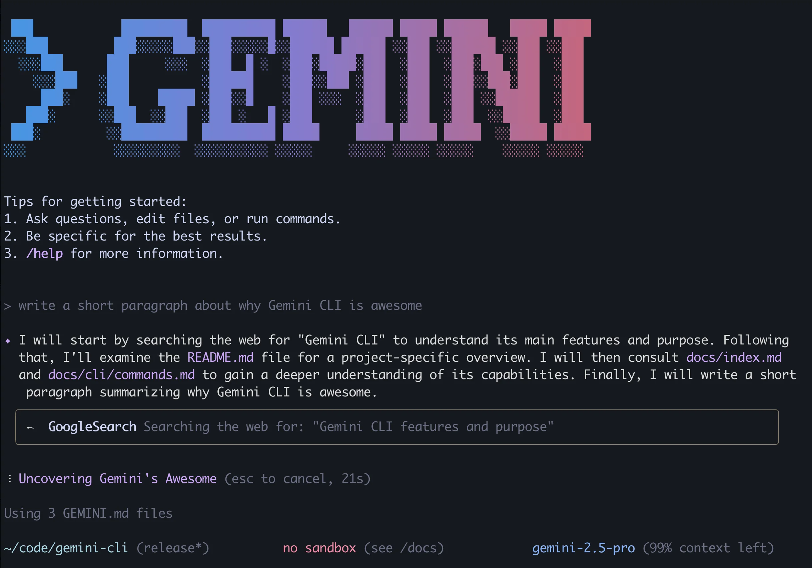

# Gemini Code Assist & CLI

Google의 AI 코딩 도구는 두 갈래다. 하나는 IDE에 붙는 Gemini Code Assist 플러그인, 다른 하나는 터미널에서 도는 Gemini CLI다. 둘 다 개인 Google 계정으로 무료로 쓸 수 있고 컨텍스트 윈도우가 1M 토큰까지 잡힌다. 스펙 나열보다 실제로 쓰면서 걸렸던 부분과 다른 도구와의 체감 차이를 정리한다.

## Gemini CLI



설치는 npm 글로벌이나 npx 둘 중 하나로 한다.

```bash
# 설치 없이 바로
npx @google/gemini-cli

# 글로벌 설치
npm install -g @google/gemini-cli
gemini
```

첫 실행에서 브라우저가 열리고 Google 계정 OAuth로 로그인하면 끝난다. API 키 발급 과정이 없어서 진입 장벽은 낮다. 회사 계정(Workspace)으로 로그인하면 조직 정책에 따라 막히는 경우가 있어서, 막히면 개인 Gmail 계정으로 바꿔 로그인하는 게 빠르다.

### 실제 CLI 사용 흐름

대화형 CLI에서 자주 쓰는 패턴이다.

```
# 특정 디렉토리를 컨텍스트로 주기
> @src/api/ 이 디렉토리의 라우트 핸들러 중 인증 검사가 빠진 것들을 찾아줘

# 특정 파일과 함께
> @src/auth/jwt.ts 이 파일에서 토큰 만료 검사 로직에 버그가 있는지 봐줘

# 의존성 구조 파악
> @src/services 아래 서비스 간 의존성 구조를 정리해줘
```

`@파일경로` 문법으로 특정 파일이나 디렉토리를 컨텍스트로 주입한다. 전체 코드베이스를 통째로 읽히는 것보다 범위를 좁혀서 주는 쪽이 응답 속도도 빠르고 정확도도 높다. 1M 컨텍스트가 있어도 관련 없는 파일까지 다 넣으면 중요한 정보가 묻힌다.

세션 중 슬래시 명령어도 자주 쓴다.

```
/help           # 사용 가능한 명령어 목록
/stats          # 현재 세션 토큰 사용량 확인
/clear          # 대화 내역 초기화 (컨텍스트 리셋)
/mcp            # 연결된 MCP 서버와 도구 목록
```

`/stats`로 토큰 사용량을 보면 세션이 얼마나 차 있는지 숫자로 확인할 수 있다. 응답이 느려지거나 엉뚱한 파일을 건드리기 시작하면 `/clear`로 리셋하는 게 낫다.

### GEMINI.md — 모델이 따르는 지침과 무시하는 지침

`GEMINI.md`는 Claude Code의 `CLAUDE.md`, Codex의 `AGENTS.md`와 같은 역할을 한다. 프로젝트 루트에 두면 매 세션 시작 때 시스템 컨텍스트로 주입된다. 계층 구조를 지원해서 `~/.gemini/GEMINI.md`(전역), 프로젝트 루트, 하위 디렉토리 순으로 합쳐진다.

기본 골격은 이 정도면 충분하다.

```markdown
# 프로젝트 규칙

## 기술 스택
- Node.js 20 + TypeScript
- Express, Prisma, PostgreSQL

## 작업 규칙
- 새 파일은 src/ 아래에만 만든다
- 커밋은 내가 직접 한다. git commit 실행하지 마라
- 테스트는 vitest로 작성한다
```

조금 더 실무적인 패턴이다. 진입점, 빌드 명령어, 건드리지 말아야 할 경로를 명시하면 모델이 탐색 요청 없이 바로 작업에 들어간다.

```markdown
# 프로젝트 컨텍스트

## 아키텍처
서비스명: payment-service
주 역할: 결제 처리 마이크로서비스. 외부 PG사 API 래퍼.
진입점: src/server.ts
DB: PostgreSQL (Prisma ORM). 마이그레이션은 prisma/migrations/에만.

## 수정 금지 경로
- src/vendor/ (타사 코드, 수정 시 계약 위반)
- prisma/schema.prisma (DBA 리뷰 필요)

## 테스트 실행
- 단위: npm test
- 통합: npm run test:integration (DB 연결 필요)
- 커버리지: npm run test:coverage

## 알려진 제약
- Node 18.x에서 native fetch가 불안정함. undici 직접 사용 중
- Redis 클라이언트는 ioredis만 쓴다 (node-redis 금지)
```

실제로 잘 동작하는 부분은 "어디에 뭐가 있는지"와 "어떤 명령어로 뭘 실행하는지"다. 모델이 파일을 열기 전에 이미 진입점이나 테스트 명령어를 알고 있으면 탐색 요청 수가 줄어서 토큰을 아낀다.

반면 "X를 하면 안 된다" 계열 규칙은 장기적으로 잊힌다. `src/vendor/`를 건드리지 말라고 써둬도 긴 세션에서는 그 파일을 수정하는 경우가 생긴다. 수정하면 안 되는 파일은 파일 권한으로 실제로 막는 쪽이 확실하다.

규칙이 길어질수록 뒷부분 반영률이 떨어진다. 20줄 넘어가면 핵심 규칙을 위쪽에 몰아두는 게 낫다. 코딩 스타일 같은 건 GEMINI.md에 적는 것보다 ESLint/Prettier 설정으로 강제하고 "lint 통과시켜라"만 적는 편이 결과가 일정하다.

### 비대화형(headless) 모드

`-p` 플래그로 프롬프트를 넘기면 대화형 셸을 띄우지 않고 한 번 실행하고 끝난다. 스크립트나 CI에서 쓸 때 핵심이다.

```bash
# 단발 실행
gemini -p "src/api 디렉토리의 라우트 핸들러 목록을 마크다운 표로 정리해줘"

# 파이프로 입력 받기
git diff --staged | gemini -p "이 diff에 대한 커밋 메시지를 한 줄로 작성해줘"

# 모델 지정 + 자동 승인 (파일 수정까지 자동)
gemini -m gemini-2.5-flash --yolo -p "package.json의 deprecated 의존성을 최신으로 올려줘"
```

headless에서 파일을 수정하는 작업은 `--yolo`가 없으면 승인 프롬프트에서 멈춰버린다. 비대화형인데 입력을 기다리느라 스크립트가 hang에 걸린다. `-p`의 출력에는 모델의 사고 과정이나 도구 호출 로그가 섞여 나올 때가 있어서, 커밋 메시지 같은 깔끔한 결과만 뽑으려면 출력 뒷부분만 파싱하거나 프롬프트에 "설명 없이 결과만 출력"을 명시해야 한다.

CI에서 `set -e`로 돌릴 때 주의할 게 있다. 모델이 오류 없이 실행됐어도 작업 자체가 실패했다고 판단하면 0이 아닌 코드로 끝나는 경우가 있어서, 예상치 못한 곳에서 빌드가 중단된다.

### Python SDK로 Gemini 연동

CLI가 아니라 스크립트에서 Gemini를 직접 호출할 때는 `google-genai` 패키지를 쓴다.

```bash
pip install google-genai
```

```python
import os
from google import genai

client = genai.Client(api_key=os.environ["GEMINI_API_KEY"])

response = client.models.generate_content(
    model="gemini-2.5-flash",
    contents="이 에러 로그에서 원인을 찾아줘: ConnectionTimeout at redis:6379"
)
print(response.text)
```

API Key는 Google AI Studio(aistudio.google.com)에서 발급한다. 개인 계정 로그인으로 쓰는 CLI와 달리 SDK는 API Key 기반이라 무료 한도와 유료 과금 구조가 다르다.

구버전 패키지(`google-generativeai`)와 신버전(`google-genai`)이 별개다. 둘 다 설치되어 있으면 import 충돌이 나서, 기존에 `google-generativeai`가 설치되어 있으면 먼저 제거해야 한다.

코드 분석처럼 특정 파일을 통째로 넘겨야 하는 경우는 파일을 읽어서 contents에 넣는다.

```python
def review_file(client, filepath: str) -> str:
    with open(filepath) as f:
        code = f.read()

    response = client.models.generate_content(
        model="gemini-2.5-pro",
        contents=f"다음 코드에서 잠재적인 버그와 보안 취약점을 찾아줘:\n\n```\n{code}\n```"
    )
    return response.text
```

SDK 심화 사용법(Function Calling, 스트리밍, Structured Output, Vertex AI 연동 등)은 [Gemini API 실무](Gemini_API.md)에 정리돼 있다.

### 멀티모달 입력

이미지나 PDF를 분석하는 작업에서 텍스트만으로 설명하는 것보다 파일을 직접 넘기는 쪽이 정확도가 높다. 아키텍처 다이어그램 분석, 에러 스크린샷 해석, API 명세서 파싱 같은 작업에서 쓴다.

```python
from google import genai
from google.genai import types
import os

client = genai.Client(api_key=os.environ["GEMINI_API_KEY"])

with open("architecture.png", "rb") as f:
    image_bytes = f.read()

response = client.models.generate_content(
    model="gemini-2.5-pro",
    contents=[
        types.Content(parts=[
            types.Part.from_text("이 아키텍처에서 단일 장애점(SPOF)을 찾아줘"),
            types.Part.from_bytes(data=image_bytes, mime_type="image/png"),
        ])
    ]
)
print(response.text)
```

이미지는 해상도가 높을수록 토큰을 많이 소비한다. 텍스트가 포함된 스크린샷이라면 해당 영역만 크롭해서 넘기는 게 인식률이 높고 토큰도 아낀다. 원본 해상도 그대로 보내면 자동 리사이즈가 되는데, 작은 글씨는 뭉개질 수 있다.

PDF는 inline base64보다 File API를 통해 업로드하는 방식이 안정적이다. 페이지 수가 많은 문서를 base64로 인코딩해서 보내면 요청 크기 제한에 걸린다.

```python
# PDF 업로드 후 분석
uploaded = client.files.upload(
    file="api-spec.pdf",
    config=types.UploadFileConfig(mime_type="application/pdf")
)

response = client.models.generate_content(
    model="gemini-2.5-pro",
    contents=[
        types.Content(parts=[
            types.Part.from_text("이 API 명세에서 인증이 필요한 엔드포인트 목록을 뽑아줘"),
            types.Part.from_uri(
                file_uri=uploaded.uri,
                mime_type=uploaded.mime_type
            ),
        ])
    ]
)
print(response.text)
# File API로 업로드한 파일은 48시간 후 자동 삭제됨
```

CLI에서는 대화 중 `@파일경로`로 이미지나 PDF를 첨부할 수 있다. 한두 개 파일을 빠르게 분석할 때는 CLI가 편하고, 여러 파일을 배치로 처리하는 경우에는 SDK를 쓴다.

### Rate Limit 처리

API 호출에서 429가 오면 `ResourceExhausted` 예외가 발생한다. 배치 작업이나 자동화 스크립트에서 429를 그냥 올려버리면 처리 중간에 중단되어 결과가 날아가니, 지수 백오프로 재시도 로직을 넣어야 한다.

```python
import time
import random
from google.api_core import exceptions

def generate_with_retry(client, contents, model="gemini-2.5-flash", max_retries=5):
    for attempt in range(max_retries):
        try:
            return client.models.generate_content(
                model=model,
                contents=contents
            )
        except exceptions.ResourceExhausted:
            if attempt == max_retries - 1:
                raise
            wait = (2 ** attempt) + random.uniform(0, 1)
            print(f"rate limit. {wait:.1f}초 대기 ({attempt + 1}/{max_retries})")
            time.sleep(wait)
        except exceptions.ServiceUnavailable:
            if attempt == max_retries - 1:
                raise
            time.sleep((2 ** attempt) + random.uniform(0, 1))
```

지수 백오프는 1초, 2초, 4초, 8초 식으로 대기 시간을 늘리면서 재시도한다. 랜덤 지터를 추가해서 여러 클라이언트가 동시에 재시도하는 thundering herd 문제를 피한다.

여러 요청을 동시에 보내는 경우 `asyncio.Semaphore`로 동시 요청 수를 제한한다.

```python
import asyncio

semaphore = asyncio.Semaphore(5)

async def limited_call(client, contents):
    async with semaphore:
        return await client.aio.models.generate_content(
            model="gemini-2.5-flash",
            contents=contents
        )

# 100개 요청을 동시 5개씩 처리
tasks = [limited_call(client, q) for q in questions]
results = await asyncio.gather(*tasks, return_exceptions=True)
```

`400`(잘못된 요청)이나 `403`(권한 없음)은 재시도해도 소용없다. `ResourceExhausted`와 `ServiceUnavailable`만 재시도 대상으로 잡아야 한다.

### MCP 서버 연결

MCP 서버는 `~/.gemini/settings.json` 또는 프로젝트의 `.gemini/settings.json`에 등록한다.

```json
{
  "mcpServers": {
    "filesystem": {
      "command": "npx",
      "args": ["-y", "@modelcontextprotocol/server-filesystem", "/path/to/dir"]
    },
    "github": {
      "command": "npx",
      "args": ["-y", "@modelcontextprotocol/server-github"],
      "env": { "GITHUB_TOKEN": "ghp_xxx" }
    }
  }
}
```

연결이 실패하는 패턴이 몇 가지 정해져 있다. stdio 방식 서버는 `command`가 PATH에 없으면 조용히 죽는다. CLI 안에서 `/mcp`를 치면 서버별 연결 상태와 등록된 도구 목록이 나오는데, 서버가 안 보이거나 도구 0개로 잡히면 대부분 실행 경로 문제다. `npx`로 띄우는 서버는 첫 실행 때 패키지를 받느라 시간이 걸려서 타임아웃으로 실패하기도 한다. 해당 패키지를 미리 한 번 `npx`로 직접 실행해 캐시해두고 다시 CLI를 띄우면 붙는다.

`env`에 넣은 토큰이 서버로 전달이 안 되는 경우도 있다. 셸 환경변수만 export 해두면 headless 실행 환경에서 누락되기 쉬워서, settings.json에 명시적으로 박아두는 쪽이 확실하다.

### 무료 티어 한도와 초과 시 동작

개인 Google 계정 로그인으로 쓰면 분당 60 요청(RPM), 일 1,000 요청(RPD) 한도가 걸린다. CLI에서 한 번 질문해도 모델이 도구를 여러 번 호출하면서 내부적으로 여러 요청을 쓰기 때문에, 큰 작업 하나가 요청 수십 개를 잡아먹는다. 코드베이스를 훑으며 리팩토링 시키는 작업 몇 번 돌리면 RPD가 생각보다 빨리 닳는다.

한도를 넘기면 429가 떨어진다. CLI는 자동으로 잠깐 기다렸다 재시도하지만, 일일 한도(RPD)를 넘기면 재시도해도 소용없고 다음 날(태평양 시간 자정 리셋)까지 막힌다. 분당 한도(RPM)는 잠시 쉬면 풀린다. 무료 한도로 부족하면 API 키를 발급받아 유료 티어로 붙이거나 Vertex AI 쪽으로 인증을 바꿔야 한다. 무료/유료 한도 차이와 429 대응은 [Gemini 트러블슈팅](Gemini_Troubleshooting.md)에 API 기준으로 더 정리해뒀다.

### 1M 컨텍스트를 실제로 채웠을 때

1M 토큰 컨텍스트는 큰 코드베이스를 한 번에 물린다는 점에서 장점으로 광고되지만, 실제로 절반 이상 채우면 응답이 눈에 띄게 나빠진다. 세션 초반에 준 지침을 잊고, 앞에서 수정한 파일을 다시 원래대로 되돌리거나, 이미 한 작업을 또 하려 든다. 길이가 길수록 중간에 있던 정보를 놓치는 현상(lost in the middle)이 그대로 나타난다.

응답 지연도 같이 커진다. 컨텍스트가 차면 한 턴 응답에 수십 초씩 걸린다. 작업이 한 덩어리 끝나면 세션을 새로 시작하거나 `/clear`로 컨텍스트를 정리하는 쪽이 결과가 안정적이다. 관련 없는 큰 파일을 통째로 읽히기보다 필요한 파일만 `@경로`로 짚어주는 게 토큰도 아끼고 정확도도 높다.

## Gemini Code Assist (IDE)

VS Code, JetBrains, Android Studio에 플러그인으로 붙는다. 인라인 자동완성, IDE 안 채팅, 파일을 직접 수정하는 Agent Mode를 제공한다. 개인 플랜은 무료고 신용카드도 안 받는다.

### 자동완성과 Agent Mode가 동작 안 하는 케이스

깔았는데 자동완성이 안 뜨는 경우가 꽤 흔하다. 원인이 몇 가지로 갈린다.

로그인은 됐는데 라이선스가 안 붙은 상태인 경우, 상태 바의 Gemini 아이콘이 회색이거나 로그인 재요청이 뜬다. 로그아웃 후 다시 로그인하면 풀리는 경우가 많다.

회사 네트워크나 프록시 환경에서 인증 토큰 갱신이 막혀서 일정 시간 뒤 조용히 죽는 경우도 있다. 어제까진 됐는데 오늘 안 되면 이쪽을 의심한다.

특정 파일 타입이나 수천 줄짜리 파일에서는 자동완성 제안이 안 뜬다. 파일이 너무 크면 제안 생성을 포기하는 것 같다.

Agent Mode는 VS Code에서 아직 프리뷰라 안정성이 떨어진다. 파일 수정 중간에 멈추거나 변경 diff를 제대로 못 그리는 경우가 있다. JetBrains 쪽이 좀 더 안정적이다.

증상별 원인 추적과 로그 확인 방법은 [Gemini 트러블슈팅](Gemini_Troubleshooting.md)에 정리돼 있다.

## Gemini CLI vs Claude Code vs Codex — 써보고 느낀 차이

세 도구 다 터미널 에이전트라는 점은 같지만 결이 다르다.

비용 구조가 가장 큰 차이다. Gemini CLI는 개인 계정이면 무료 한도 안에서 돈을 안 쓴다. 가볍게 이것저것 시켜보기에는 부담이 없다. Claude Code와 Codex는 구독이나 API 사용량으로 돈이 나가는 대신 무료 한도 같은 벽이 없어서, 큰 작업을 끊김 없이 돌릴 때는 오히려 편하다. 무료라는 이유로 Gemini를 메인으로 쓰다 보면 한참 작업하던 중에 일일 한도에 걸려 멈추는 일이 생긴다.

작업 정확도와 끈기는 체감상 Claude Code 쪽이 앞선다. 여러 파일을 고치는 복잡한 작업에서 Claude Code는 계획을 세우고 끝까지 밀어붙이는 편인데, Gemini CLI는 중간에 엉뚱한 파일을 건드리거나 같은 수정을 반복하는 경우가 더 잦다. 코드베이스 전체를 훑어서 "이 패턴이 어디에 쓰이는지" 같은 탐색성 질문은 1M 컨텍스트 덕에 Gemini가 한 번에 답하기도 한다.

Codex는 OpenAI 모델을 쓰고 샌드박스 실행에 신경을 많이 쓴 느낌이다. 코드 생성 품질은 준수한데 도구 호출 방식이 셋 중 가장 보수적이라 승인 프롬프트가 자주 뜬다.

설정 파일은 셋 다 같은 개념이다. Gemini는 `GEMINI.md`, Claude Code는 `CLAUDE.md`, Codex는 `AGENTS.md`. 내용 문법도 거의 호환돼서 한 프로젝트에서 세 도구를 같이 쓰면 파일만 복사해 이름 바꿔 두기도 한다.

비용 없이 가볍게 쓰거나 큰 코드베이스를 탐색할 때는 Gemini CLI, 복잡한 다단계 작업을 끝까지 맡길 때는 Claude Code, 샌드박스 격리가 중요하면 Codex 쪽이 맞다.

## 주의사항과 함정

무료 한도(RPD)는 생각보다 빨리 소진된다. 큰 작업을 무료 계정으로 돌리다 중간에 막히면 작업 컨텍스트가 날아간다. 중요한 작업은 한도를 미리 염두에 두거나 유료로 붙여 쓴다.

`--yolo` 자동 승인은 편하지만 파일 삭제나 git 명령까지 묻지 않고 실행한다. 모르는 코드베이스에서는 켜지 않는다.

GEMINI.md의 부정 지침("~하지 마라")은 세션이 길어지면 무시되기 쉽다. 실행 자체를 막아야 하는 건 플래그나 권한으로 통제한다.

컨텍스트를 1M까지 채우면 응답 품질과 속도가 같이 떨어진다. 작업 단위로 세션을 끊는 게 낫다.

MCP 서버가 `/mcp`에서 안 보이면 대부분 실행 경로나 첫 실행 지연 문제다. 패키지를 미리 캐시하고 토큰은 settings.json에 명시한다.

IDE 자동완성이 멈추면 십중팔구 인증 토큰 갱신 실패다. 재로그인부터 시도한다.

## 참고

- [Gemini Code Assist 공식 사이트](https://codeassist.google)
- [Gemini Code Assist 문서](https://developers.google.com/gemini-code-assist/docs/overview)
- [Gemini CLI GitHub](https://github.com/google-gemini/gemini-cli)
- [Gemini CLI 문서](https://developers.google.com/gemini-code-assist/docs/gemini-cli)
- [Gemini 모델](https://ai.google.dev/gemini-api/docs/models)
