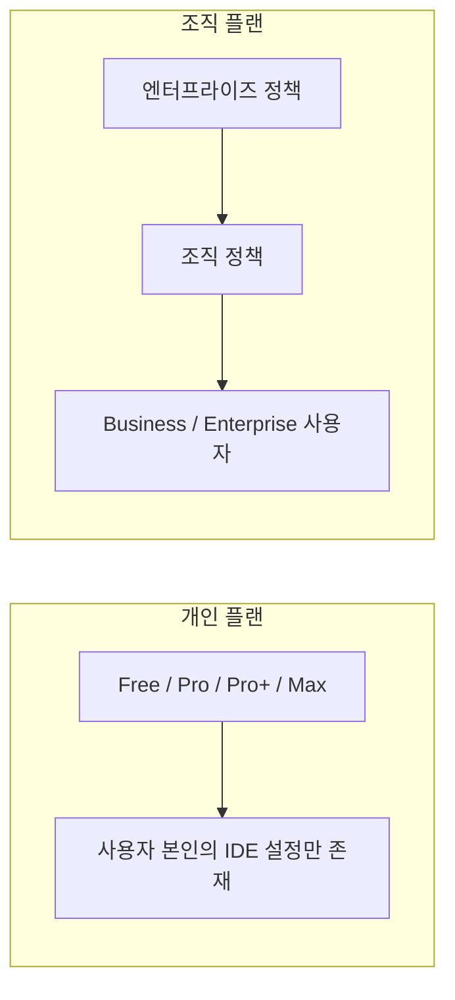
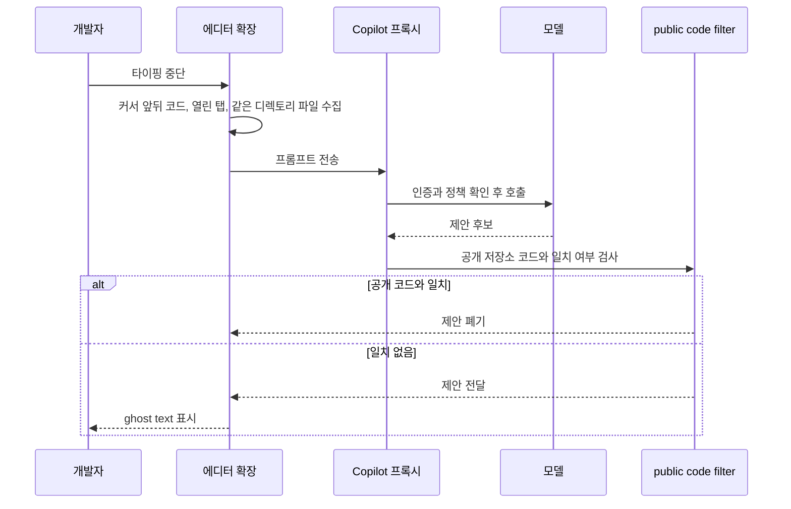
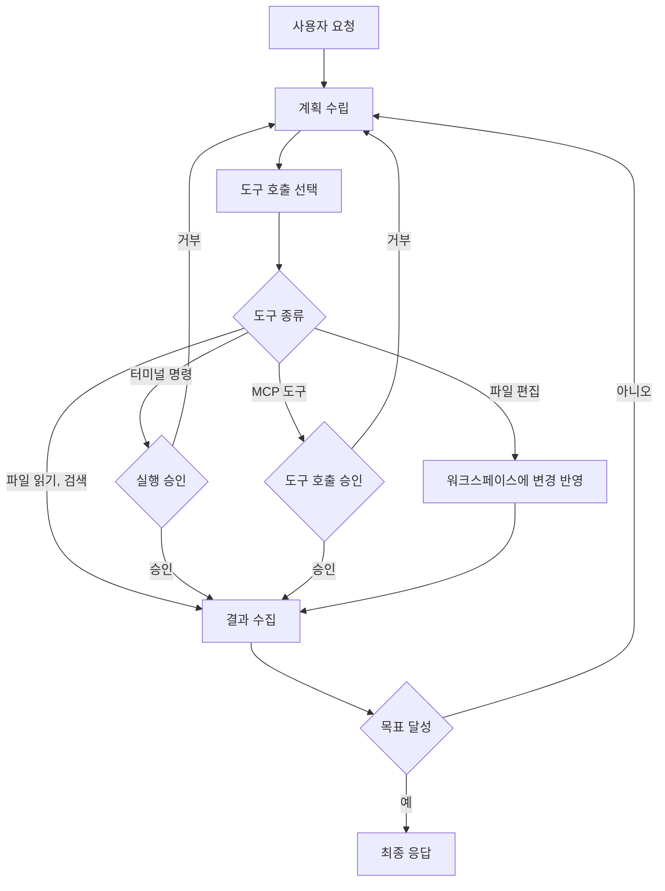
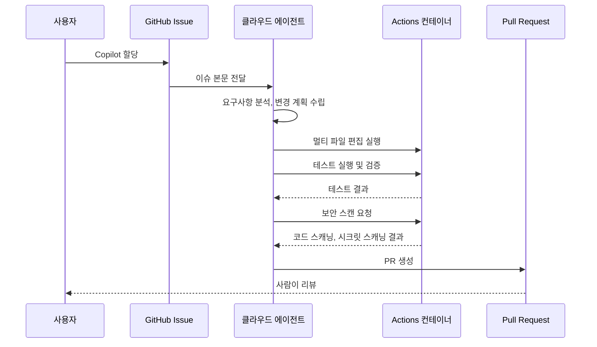
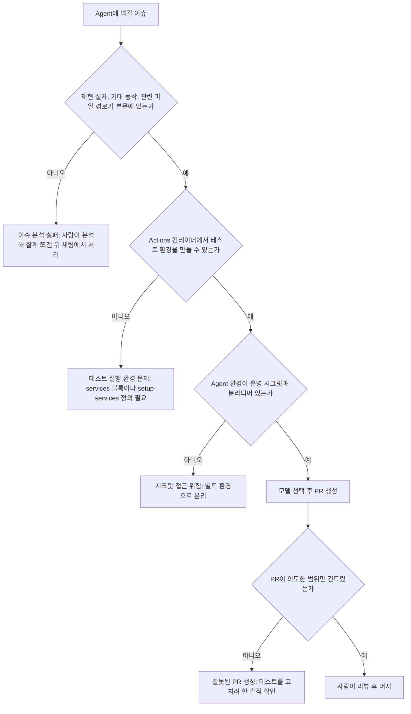
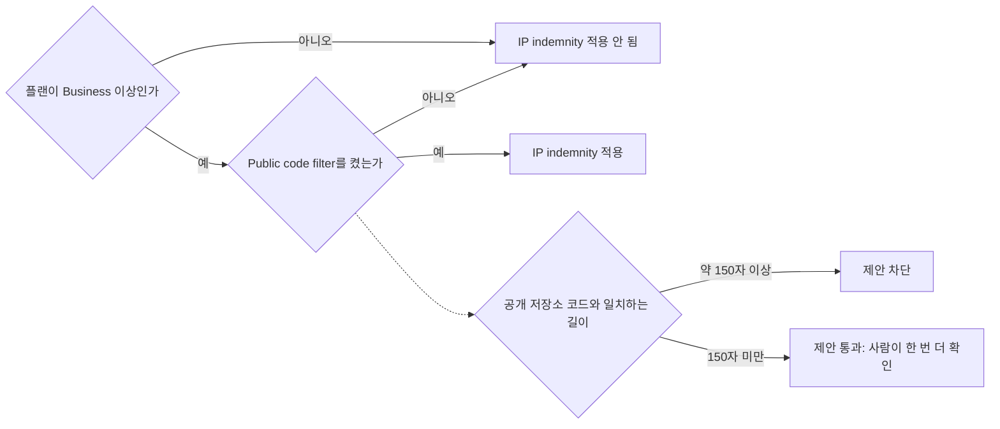
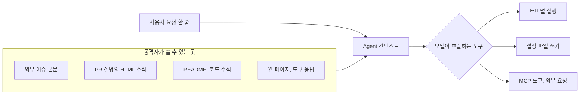
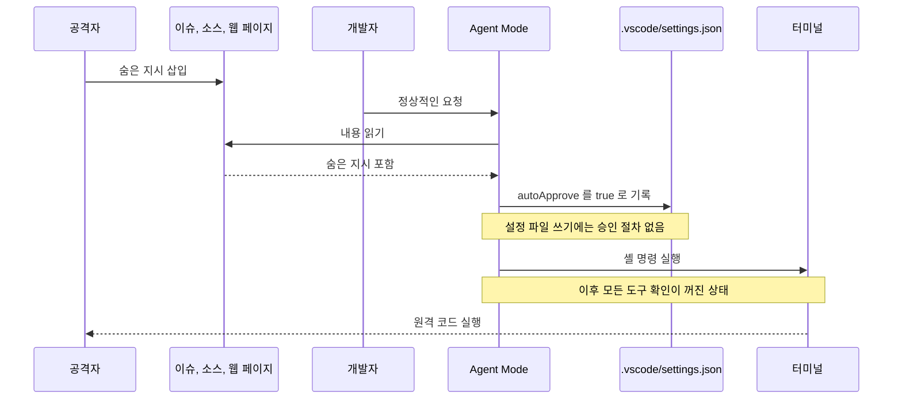

# GitHub Copilot

## 1. GitHub Copilot이란

GitHub Copilot은 GitHub(Microsoft)이 만든 AI 코딩 어시스턴트다. IDE 안에 붙어서 인라인 자동완성, 채팅, Agent Mode를 통한 자율 작업, PR 리뷰까지 처리한다. 2021년 OpenAI Codex 기반으로 출시된 이후 모델 라인업이 GPT, Claude, Gemini, Grok까지 확장되면서 사실상 IDE 통합 AI 도구의 표준 자리에 가깝게 자리잡았다.

5년차 정도 백엔드 일을 하다 보면 새 도구를 도입할 때 회사 정책(보안, 라이선스, IP)이 같이 걸린다. Copilot이 다른 도구보다 회사에서 통과되기 쉬운 이유는 Microsoft/GitHub라는 공급자 신뢰도, Business 플랜의 IP indemnity, 그리고 GitHub Enterprise 권한 모델과의 연동 때문이다. 기능적으로 가장 앞서서가 아니라 "도입 마찰"이 가장 적어서 선택되는 경우가 많다.

### 1.1 실제 동작 방식

Copilot은 크게 세 가지 모드로 동작한다.

**인라인 자동완성**은 커서 위치 주변 코드를 컨텍스트로 보내고 다음에 올 코드를 받아서 회색 텍스트(ghost text)로 보여준다. 한 줄 단위가 아니라 함수 단위, 블록 단위로 제안하기도 한다. 백엔드에서 비슷한 패턴의 DTO나 Mapper, 테스트 코드를 반복 작성할 때 가장 효율이 잘 나온다. 반대로 도메인 로직이나 비즈니스 규칙이 들어가는 코드에서는 그럴듯하지만 틀린 제안이 자주 나온다.

**채팅**은 IDE 사이드 패널에서 자연어로 질문하고 답을 받는 형태다. 현재 파일이나 선택한 영역을 컨텍스트로 명시적으로 첨부할 수 있다. 코드 리뷰 전 "이 함수 어떻게 동작하는지 설명해줘"같이 한 번씩 도움을 받는 용도로 쓰면 무난하다.

**Agent Mode**는 IDE 안에서 Copilot이 파일을 읽고, 편집하고, 터미널 명령까지 직접 실행하는 모드다. 이와 별개로 GitHub Issue를 Copilot에 할당하면 백그라운드에서 코드를 분석하고 수정한 뒤 PR을 만들어주는 클라우드 쪽 에이전트가 있다. 이 문서는 앞의 것을 IDE Agent Mode, 뒤의 것을 클라우드 에이전트로 구분해서 부른다. 클라우드 에이전트는 CI 환경에서 도커 컨테이너를 띄워서 테스트까지 돌린다. 단순한 의존성 업데이트나 명확한 버그 수정 정도는 자동으로 처리되지만, 도메인 컨텍스트가 필요한 작업은 여전히 사람 손이 더 들어간다. 두 형태 모두 모델이 도구를 호출한다는 점에서 8장의 보안 문제와 직결된다.

### 1.2 다른 AI 도구와의 비교

| 특징 | GitHub Copilot | Claude Code | Cursor |
|------|---------------|------------|--------|
| 인터페이스 | IDE 플러그인 | CLI | 독립 IDE |
| 접근 방식 | 보조형 (사용자 주도) | 에이전틱 (자율 실행) | 에이전틱 (IDE 내장) |
| 코드 완성 | 인라인 자동완성 | 없음 | Tab 자동완성 |
| Agent Mode | 지원 (2026~) | 기본 동작 방식 | 장시간 에이전트 지원 |
| IDE 지원 | 다양한 IDE | 터미널 전용 | VS Code 포크 전용 |
| 가격 | $10~100/월 (개인 기준) | API 사용량 기반 | $20~200/월 |

Copilot의 강점은 "이미 쓰던 IDE에 붙는다"는 점 하나다. JetBrains 라이선스가 있는 팀에 Cursor를 강제로 도입하기는 어렵지만 Copilot은 IntelliJ 플러그인으로 그냥 깔린다.

---

## 2. 가격

### 2.1 개인 플랜

| 플랜 | 가격 | 코드 완성 | 포함 AI 크레딧 |
|------|------|----------|-------------|
| Free | $0 | 2,000회/월 (채팅 50회 포함 한도) | 없음 |
| Pro | $10/월 | 무제한 | $15/월어치 |
| Pro+ | $39/월 | 무제한 | $70/월어치 |
| Max | $100/월 | 무제한 | $200/월어치 |

2026-10-08에 공식 요금 페이지(github.com/features/copilot/plans)와 대조한 값이다. 이전 판에 있던 "프리미엄 요청 300회/1,500회" 열은 요청 기반 청구 시절 수치라서 이 표에서 뺐다. Max 플랜은 이전 판에 없던 줄이다.

### 2.2 조직 플랜

| 플랜 | 가격 | 특징 |
|------|------|------|
| Business | $19/사용자/월 | 조직 관리, 감사 로그, 정책 제어, IP indemnity |
| Enterprise | $39/사용자/월 | 지식 베이스, 커스텀 모델, GitHub.com 지식 검색 |

가격은 공식 플랜 비교 문서(docs.github.com/en/copilot/get-started/plans)와 일치한다. 조직 플랜의 크레딧 포함량은 두 문서 어디에서도 금액으로 확인하지 못했다. 특징 열은 이전 판 내용 그대로이고 이번에 다시 대조하지 않았다.

### 2.3 AI 크레딧 과금과 옛 프리미엄 요청

현재 공식 청구 문서는 사용량 기반 청구로 설명한다. 1 AI 크레딧이 $0.01이고, 모델별 단가는 100만 토큰당 입력·출력 가격으로 매겨진다. 인라인 자동완성과 다음 편집 제안은 크레딧을 쓰지 않고 유료 플랜에서 무제한이다. 크레딧을 쓰는 쪽은 채팅, Agent Mode, 코드 리뷰, CLI다.

토큰 단가 기준이라 컨텍스트가 길수록 호출 한 번의 비용이 커진다. 파일을 여러 개 첨부해서 에이전트를 몇 번 돌리면 요청 횟수보다 토큰량이 청구를 좌우한다. 7.4절에서 말하는 "컨텍스트를 줄여라"가 품질뿐 아니라 비용에도 걸린다.

요청 기반 청구는 레거시로 분류되어 있고, 요청 기반 연간 플랜을 쓰는 Pro·Pro+ 구독자에게는 별도의 모델 배수가 적용된다고 문서에 적혀 있다. 이전 판에 있던 "Claude Opus 10배, Sonnet 1배" 같은 배수 표는 이 레거시 체계의 수치였고 현재 문서와 대조되지 않아 삭제했다. 모델별 단가는 모델이 바뀔 때마다 같이 바뀌므로 이 문서에 박아두지 않는다. 공식 models-and-pricing 페이지를 직접 본다.

한도를 넘겼을 때의 동작(개인 플랜 차단, 조직 플랜 초과분 청구)도 요청 기반 시절 설명이라 이번에 대조하지 못했다. 조직 관리자라면 사용자별 예산 상한과 알림을 먼저 설정하고 시작하는 편이 안전하다.

### 2.4 플랜별 정책 범위

플랜이 바뀌면 가격보다 정책이 적용되는 범위가 더 크게 달라진다. 공식 정책 문서는 정책이 Copilot Business 또는 Enterprise 플랜을 가진 사용자에게만 적용된다고 적고 있다. 정책은 엔터프라이즈에서 먼저 정하고, 조직에 결정을 넘길 수도 있다.



왼쪽 묶음에는 관리자가 없다. 공개 코드 필터나 MCP 사용 여부를 사용자 스스로 정하므로, 회사 노트북에서 개인 계정으로 Copilot을 쓰면 조직 정책이 닿지 않는다. 오른쪽 묶음에서는 엔터프라이즈가 내려보낸 정책을 조직이 덮어쓸 수 있는지가 설정 한 줄로 갈린다.

| 항목 | Free / Pro / Pro+ / Max | Business | Enterprise |
|------|------------------------|----------|-----------|
| 조직 정책 적용 (MCP servers in Copilot 정책 포함) | 해당 없음 | 적용 | 적용 |
| 공개 코드 필터 강제 | 사용자 설정 | 조직 정책으로 강제 | 조직 정책으로 강제 |
| IP indemnity | 없음 | 있음 | 있음 |
| 감사 로그 | 없음 | 있음 | 있음 |

첫 줄만 이번에 공식 문서로 확인했다. 나머지 세 줄은 이전 판과 7.3절의 서술을 표로 옮긴 것이다. 법무 검토에 쓸 때는 플랜 비교 문서의 해당 항목을 다시 열어봐야 한다.

---

## 3. 핵심 기능

### 3.1 코드 자동완성

IDE에서 코딩 중 실시간으로 코드 제안을 표시한다. Tab 키로 수락, Esc로 거부.

```python
def calculate_discount(price, discount_rate):
    if discount_rate < 0 or discount_rate > 1:
        raise ValueError("할인율은 0~1 사이여야 합니다")
    return price * (1 - discount_rate)
```

요청 하나가 제안으로 돌아오기까지의 경로는 다음 순서다. 에디터 확장이 컨텍스트를 모으고, 프록시를 거쳐 모델에 가고, 돌아온 후보가 public code filter를 통과해야 ghost text로 뜬다.



보안 쪽에서 눈여겨볼 곳은 첫 번째 화살표 직후의 수집 단계다. 열어둔 탭과 같은 디렉토리 파일이 전부 프롬프트에 들어가므로, `.env`나 키가 든 설정 파일을 탭에 열어둔 채 코딩하면 그 내용이 외부로 나가는 요청에 섞일 수 있다. 8.4절의 콘텐츠 제외가 막으려는 지점이 여기다. 필터는 모델 호출이 끝난 뒤에 붙어서 후보를 버리기만 하고, 모델이 받은 컨텍스트에는 관여하지 않는다.

자동완성이 잘 안 맞을 때는 거의 컨텍스트 부족이 원인이다. Copilot은 현재 파일 상단, 같은 디렉토리의 다른 파일, 그리고 최근 열어둔 탭을 컨텍스트로 사용한다. 관련된 인터페이스나 타입 정의 파일을 미리 열어두는 것만으로도 제안 품질이 눈에 띄게 달라진다.

### 3.2 Agent Mode

IDE Agent Mode는 자동완성과 구조가 다르다. 한 번 묻고 한 번 답하는 대신, 모델이 계획을 세우고 도구를 호출하고 결과를 보고 다시 계획을 고치는 일을 목표를 달성할 때까지 반복한다.



루프에서 사람이 개입하는 지점은 터미널 실행과 MCP 도구 호출의 승인 두 군데다. 8.2절의 보고자 원문에 따르면 당시 파일 편집은 승인 없이 디스크에 바로 쓰였다. 자동 승인 설정을 켜면 이 두 승인도 사라지고 루프가 사람 없이 돈다. 8.2절의 CVE-2025-53773이 정확히 이 구조를 파고들었다.

GitHub Issue를 할당하는 클라우드 에이전트는 백그라운드에서 코드를 분석, 수정, 테스트하고 PR을 생성한다.

클라우드 에이전트의 동작 흐름:

```
1. GitHub Issue에 Copilot 할당
2. 요구사항 분석 및 변경 계획 수립
3. 멀티 파일 편집 실행
4. 테스트 실행 및 검증
5. 보안 스캔 (코드 스캐닝, 시크릿 스캐닝)
6. PR 생성 → 사람이 리뷰
```

아래 시퀀스에서 편집, 테스트, 보안 스캔이 모두 사용자 로컬이 아니라 Actions 컨테이너 안에서 일어난다는 점을 보면 된다. 사람이 개입하는 곳은 마지막 PR 리뷰뿐이다.



클라우드 에이전트는 GitHub Actions 환경 위에서 컨테이너를 띄워 동작한다. 즉 로컬에서 잘 빌드되고 테스트되는 코드라도, Actions 컨테이너에서 빌드/테스트가 안 되면 Agent는 같은 자리에서 막힌다.

### 3.3 채팅 인터페이스

자연어로 코딩 질문, 코드 설명, 리팩토링 요청 가능.

채팅 참여자(@mentions):

| 참여자 | 설명 |
|--------|------|
| `@github` | GitHub 컨텍스트 (이슈, PR, 디스커션) |
| `@workspace` | 프로젝트 전체 컨텍스트 |
| `@terminal` | 터미널/CLI 컨텍스트 |
| `@vscode` | VS Code 관련 기능 |

채팅 변수(#mentions):

| 변수 | 설명 |
|------|------|
| `#file` | 현재 파일 |
| `#selection` | 선택한 코드 영역 |
| `#project` | 프로젝트 전체 |

`@workspace`는 인덱싱이 끝나야 제대로 동작한다. 큰 모노레포에서는 인덱싱에 몇 분 걸리거나 메모리를 많이 먹어서 IDE가 느려진다. 이런 환경에서는 `#file`로 명시적으로 파일을 지정하는 편이 더 안정적이다.

### 3.4 슬래시 명령어

| 명령어 | 설명 |
|--------|------|
| `/clear` | 대화 초기화 |
| `/explain` | 코드 동작 설명 |
| `/fix` | 문제 해결 제안 |
| `/tests` | 유닛 테스트 생성 |
| `/new` | 새 프로젝트 설정 (VS Code) |
| `/doc` | 문서 생성 (Visual Studio) |
| `/optimize` | 성능 분석 (VS Code, Visual Studio) |
| `/simplify` | 코드 단순화 (Xcode) |
| `/help` | 도움말 |

### 3.5 코드 리뷰

PR에 대해 AI 기반 코드 리뷰를 자동으로 수행한다. 리뷰 품질은 모델과 PR 크기에 따라 편차가 크다. 작은 PR(파일 5개 이하)에서는 누락된 null 체크나 잘못된 타입 캐스팅 같은 표면적인 이슈를 잘 잡는다. 1000라인이 넘는 큰 PR에서는 컨텍스트가 잘려서 두루뭉실한 코멘트만 다는 경우가 많다.

---

## 4. 지원 모델

### 4.1 사용 가능한 모델

| 제공사 | 모델 | 비고 |
|--------|------|------|
| OpenAI | GPT-5.2, GPT-4.1, GPT-5 mini | GPT-4.1이 기본 |
| Anthropic | Claude Opus 4.6, Sonnet 4.5, Haiku 4.5 | Opus는 Enterprise |
| Google | Gemini 3 Pro, Gemini 2.5 Pro | 프리뷰 |
| xAI | Grok Code Fast | 코딩 특화 |

Auto 모드는 작업 유형을 보고 모델을 골라준다고 되어 있는데, 실제로는 비용이 낮은 쪽으로 라우팅되는 경향이 있다. 중요한 작업이라면 모델을 직접 지정하는 편이 결과가 일관된다.

---

## 5. 지원 IDE

| IDE | 기능 |
|-----|------|
| VS Code | 전체 기능 (Agent Mode, 채팅, 자동완성) |
| Visual Studio | 전체 기능 |
| JetBrains | IntelliJ, PyCharm, WebStorm 등 |
| Vim/Neovim | 자동완성, 채팅 |
| Xcode | 자동완성, 채팅, 명령어 |
| Eclipse | 자동완성 |
| GitHub.com | 웹 채팅, 에이전트 |
| GitHub CLI | 터미널 에이전트 |
| GitHub Mobile | 모바일 채팅 |

### 5.1 JetBrains와 VS Code의 실제 차이

문서상으로는 둘 다 지원되지만, 신기능은 항상 VS Code에 먼저 들어가고 JetBrains는 몇 주~몇 달 늦는다. 실무에서 자주 부딪히는 차이는 다음과 같다.

JetBrains 플러그인은 IDE의 기존 자동완성과 충돌해서 제안이 깜빡거리거나 한 박자 늦게 뜬다. IntelliJ의 ML 기반 자동완성을 끄거나 우선순위를 조정해야 자연스럽게 쓸 수 있다. `.copilot/settings.json` 같은 프로젝트 레벨 인스트럭션 파일을 JetBrains 플러그인이 늦게 인식하거나 무시하는 경우가 있고, 인덱싱이 끝나기 전에 채팅을 열면 `@workspace` 컨텍스트가 비어있다.

Agent Mode와 MCP 서버 연결은 VS Code 쪽이 훨씬 안정적이다. JetBrains에서는 같은 기능이 베타 토글 뒤에 숨어있거나, 아예 GitHub 웹에서만 제공되는 경우가 많다. JetBrains를 메인으로 쓰는 팀이라면 자동완성/채팅은 IDE에서, Agent Mode는 GitHub 웹에서 쓰는 식의 분리 운영이 현실적이다.

---

## 6. 설정 및 구성

### 6.1 프로젝트 레벨 설정

`.copilot/settings.json`을 레포에 커밋하면 팀 전원에게 같은 인스트럭션이 적용된다. 추상적인 설명("좋은 코드를 작성해주세요")은 거의 효과가 없고, 컨벤션을 강제하는 구체적인 지시가 들어가야 동작이 바뀐다.

```json
{
  "copilot": {
    "chat": {
      "instructions": [
        "이 프로젝트는 Spring Boot 3.x + Kotlin + JDK 21 환경이다.",
        "코드 스타일은 ktlint 기본 규칙을 따른다. wildcard import 금지.",
        "엔티티 클래스는 data class를 사용하지 않고 일반 class에 equals/hashCode를 직접 정의한다.",
        "DTO는 record가 아닌 Kotlin data class로 작성한다.",
        "예외는 RuntimeException을 직접 던지지 않고 도메인별 예외 클래스(예: OrderNotFoundException)를 정의한다.",
        "테스트는 JUnit 5 + Kotest assertions를 사용한다. Mockito 대신 MockK를 사용한다.",
        "JPA 엔티티에 @Setter를 붙이지 않는다. 변경은 도메인 메서드로만 수행한다.",
        "Controller는 @RestController, 응답은 ResponseEntity<ApiResponse<T>> 타입으로 통일한다."
      ]
    }
  }
}
```

개인 설정은 `.copilot/settings.local.json`에 두고 `.gitignore`에 추가한다.

```json
{
  "copilot": {
    "chat": {
      "instructions": "응답은 한국어로 한다. 코드 주석은 영어로 작성한다."
    }
  }
}
```

언어/프레임워크 컨벤션을 글로 박아두면 자동완성보다 채팅과 Agent Mode에서 더 효과가 크다. 자동완성은 기본적으로 주변 코드를 따라가므로 기존 코드가 컨벤션을 잘 지키고 있다면 인스트럭션이 없어도 어느 정도 따라가지만, 새 파일을 만들거나 빈 파일에서 시작할 때는 인스트럭션이 없으면 프레임워크 디폴트 스타일이 튀어나온다.

### 6.2 커스텀 에이전트

```yaml
# .github/agents/performance-optimizer.yml
name: Performance Optimizer
description: 성능 최적화에 특화된 에이전트
instructions: |
  코드를 분석하여 성능 병목점을 찾고 최적화 방안을 제안한다.
  N+1 쿼리, 불필요한 메모리 할당, 동기 블로킹 등을 식별한다.
```

### 6.3 MCP 서버 연결과 권한 관리

MCP(Model Context Protocol) 서버를 연결하면 Copilot이 외부 도구(GitHub, Jira, DB, 사내 API 등)에 직접 접근할 수 있다. 편하지만 보안 측면에서 주의할 점이 많다.

MCP 서버는 IDE 프로세스에서 직접 실행되거나 별도 프로세스로 띄워진다. 어느 쪽이든 서버에 넘기는 토큰은 IDE 설정 파일에 평문으로 들어가는 경우가 많다. 실수로 `.vscode/settings.json`을 커밋해서 GitHub 토큰이 유출되는 사고가 종종 발생한다. 토큰은 환경 변수나 OS keychain에서 읽도록 설정해야 한다. MCP 도구 권한과 관련한 사고 경로는 8.5절에서 따로 다룬다.

```json
{
  "mcp": {
    "servers": {
      "github": {
        "command": "npx",
        "args": ["-y", "@modelcontextprotocol/server-github"],
        "env": {
          "GITHUB_PERSONAL_ACCESS_TOKEN": "${env:GITHUB_TOKEN}"
        }
      }
    }
  }
}
```

권한 범위도 중요하다. PAT(Personal Access Token)에 `repo` 풀 권한을 주면 Copilot이 모든 사적 레포에 접근할 수 있다. Fine-grained PAT를 발급해서 필요한 레포와 권한만 제한해야 한다. Agent Mode에서 MCP 도구를 호출할 때 사용자 확인 없이 실행되는 도구가 있는지 미리 검토해야 한다. 파일 쓰기, 외부 API 호출 같은 도구는 매번 확인을 받도록 설정하는 편이 안전하다.

조직에서 사용한다면 GitHub MCP Registry에서 검증된 서버만 허용 목록에 넣는 정책이 필요하다. 임의의 npm 패키지를 MCP 서버로 등록하면 그 패키지가 코드와 토큰을 외부로 빼낼 수 있다.

---

## 7. 실무에서 자주 겪는 문제

### 7.1 자동완성이 잘못된 제안을 하는 패턴

자동완성은 "그럴듯한 코드"를 만드는 데 최적화되어 있어서, 실제 동작이 틀린 제안이 자주 나온다. 자주 마주치는 패턴은 다음과 같다.

존재하지 않는 메서드/필드 호출이 가장 흔하다. 라이브러리 버전이 올라가면서 메서드 시그니처가 바뀌었는데도 옛날 버전 기준으로 제안한다. 예를 들어 Spring Data JPA에서 `findById()`가 `Optional<T>`를 반환한다는 건 알지만, 사내 BaseRepository에서 `findByIdOrThrow()` 같은 커스텀 메서드를 만들어 쓰는 경우 Copilot은 그냥 `findById().get()`을 제안한다.

도메인 규칙을 무시한 검증 로직도 잦다. 결제 로직을 작성하다가 할인율 검증 코드를 자동완성으로 받으면 `if (rate < 0 || rate > 1)` 같은 일반적인 검증이 들어오는데, 사내 정책상 할인율 상한이 0.5라면 그냥 잘못된 코드다.

테스트 코드의 mock 설정에서 실제 호출 순서와 다르게 stubbing하는 경우도 흔하다. 함수 이름과 파라미터로 추측해서 mock을 짜기 때문에 실제 SUT(System Under Test)에서 어떤 순서로 호출되는지 모른다.

회피 방법은 두 가지다. 첫째, 자동완성을 받기 전에 관련 인터페이스 파일과 컨벤션 파일을 미리 열어두면 컨텍스트가 보강된다. 둘째, Tab으로 받은 코드를 그대로 두지 말고 한 번 읽고 넘긴다. 5년차쯤 되면 "이 정도는 안 보고 받아도 되겠지"라는 안일함이 가장 큰 버그 원인이다.

### 7.2 Agent Mode 트러블슈팅

아래 흐름은 이슈를 Agent에 넘기기 전에 거쳐야 할 판단 순서다. 어느 단계에서 막히느냐에 따라 아래 항목별 설명 중 해당하는 쪽을 보면 된다.



**이슈 분석 실패**: Issue 본문이 짧거나 모호하면 Agent가 엉뚱한 방향으로 분석한다. "버튼이 안 눌려요" 같은 이슈를 그대로 넘기면 Agent가 추측으로 PR을 만들어 시간만 쓴다. Agent에 넘길 이슈는 재현 절차, 기대 동작, 관련 파일 경로를 본문에 명시해야 한다. 이게 안 되면 Agent를 쓰지 말고 사람이 분석한 뒤 잘게 쪼갠 작업을 채팅에서 처리하는 편이 빠르다.

**잘못된 PR 생성**: Agent가 만든 PR이 의도와 다르게 광범위하게 코드를 건드리는 경우가 있다. 흔한 원인은 (1) 이슈에 있는 키워드가 여러 파일에 흩어져 있어서 Agent가 전부 손대기로 결정하거나, (2) 테스트가 실패해서 Agent가 테스트를 "고치려고" 하다가 SUT가 아닌 테스트 자체를 망가뜨리는 경우다. 후자는 진짜 자주 나온다. 테스트가 깨졌을 때 Agent에 자동 수정을 맡기는 건 위험하다.

**테스트 실행 환경 문제**: Agent Mode는 GitHub Actions 컨테이너에서 동작한다. 로컬에서 도커 컴포즈로 띄우는 DB나 Redis가 필요한 통합 테스트는 컨테이너 안에서 같은 환경을 만들어주지 않으면 항상 실패한다. `.github/copilot-environment.yml` 같은 환경 정의 파일에 setup-services를 명시하거나, Agent용 워크플로우에 services 블록을 따로 정의해야 한다. 테스트 환경 설정이 어려운 레포에서는 Agent Mode가 거의 무용지물이다.

**시크릿 접근**: Agent가 외부 API 키나 DB 비밀번호가 필요한 작업을 할 때, GitHub Actions 시크릿을 Agent에 노출할지 결정해야 한다. 노출하면 PR 작성 과정에서 시크릿이 로그에 찍히거나 코드에 박힐 위험이 있다. 가능하면 Agent가 접근하는 환경은 운영 시크릿과 분리된 별도 환경으로 둬야 한다.

**모델별 결과 편차**: 같은 이슈를 넘겨도 모델에 따라 결과가 크게 다르다. Sonnet 4.5는 신중하게 한두 파일만 건드리는 경향이 있고, Opus 4.6은 더 넓게 손대는 대신 크레딧 소모가 훨씬 크다. GPT-5는 빠르지만 컨텍스트 손실이 잦다. 팀 안에서 "이런 작업은 어느 모델"이라는 합의를 만들어두는 편이 좋다.

### 7.3 Business 플랜의 IP indemnity와 Public code filter

회사에서 Copilot을 도입할 때 법무팀에서 가장 먼저 묻는 게 "이거 쓰다가 GPL 코드가 우리 코드에 들어오면 어떻게 하냐"다. GitHub은 Business와 Enterprise 플랜에 IP indemnity(지적재산권 보상) 조항을 넣어서 이 우려에 대응한다.

조항의 핵심은 "Copilot이 제안한 코드가 제3자의 저작권을 침해해서 고객이 소송당하면 GitHub이 방어 비용과 합의금을 부담한다"는 것이다. 단, 조건이 있다. **Public code filter**(공개 코드 필터) 옵션을 켜둔 경우에 한해서만 indemnity가 적용된다.

Public code filter는 Copilot이 제안하려는 코드 스니펫이 공개 GitHub 저장소의 코드와 약 150자 이상 일치하면 그 제안을 차단하는 기능이다. 켜두면 라이선스 충돌 위험은 줄지만 자동완성 빈도가 약간 떨어진다는 체감이 있다. 끄면 더 자유롭게 제안받지만 indemnity 보호를 잃는다.

아래 흐름은 indemnity가 적용되는 조건과 필터가 걸러내는 범위를 한 장으로 본 것이다. 두 조건 중 하나라도 빠지면 보호를 받지 못하고, 필터를 켜도 150자 미만 스니펫은 통과한다는 점을 보면 된다.



조직 관리자는 GitHub 조직 설정 → Copilot → Policies에서 이 필터를 강제로 켜둘 수 있다. 법무 통과를 받으려면 (1) 플랜은 Business 이상, (2) Public code filter는 조직 정책으로 강제 ON, (3) 데이터 사용 옵션(prompt와 suggestion을 학습에 사용하지 않음)은 OFF, 이 세 가지가 기본 세팅이다.

filter가 켜져 있다고 해서 모든 라이선스 문제가 사라지는 건 아니다. 150자 미만의 작은 스니펫은 필터를 통과하므로 함수 시그니처나 짧은 알고리즘은 여전히 공개 코드와 비슷할 수 있다. 라이선스가 민감한 코드(예: 라이선스 주석을 그대로 복사한 코드)는 사람이 한 번 더 봐야 한다.

### 7.4 컨텍스트 관리

가장 흔한 실수는 채팅에 너무 많은 파일을 첨부하는 것이다. `@workspace`나 `#project`로 전체를 던지면 모델이 정작 중요한 파일을 못 본다. 5개 이상 파일을 첨부했을 때 답변 품질이 급격히 떨어지는 게 체감된다. 변경 대상 파일과 그 파일이 의존하는 인터페이스 1~2개 정도만 첨부하는 게 가장 결과가 좋다.

긴 대화는 끊어가면서 써야 한다. 대화 컨텍스트가 길어지면 초반에 준 인스트럭션을 잊어버리거나, 중간에 한 번 잘못된 방향으로 답한 내용을 계속 끌고 간다. 작업이 한 사이클 끝나면 `/clear`로 컨텍스트를 비우는 편이 안전하다.

---

## 8. 보안사고 관점

Copilot 보안 이야기는 "내 코드가 학습에 쓰이느냐"에서 멈추는 경우가 많다. 실제로 사고가 난 곳은 다른 쪽이다. 저장소에 있는 텍스트가 전부 모델의 프롬프트가 되고, 모델이 터미널과 파일과 외부 도구를 만질 수 있게 되면서 생긴 경로다. GitHub 자체가 입구였던 사고(OAuth 토큰, 워크플로 인젝션, 시크릿 노출)는 [GitHub를 입구로 터진 보안사고](../../Security/Git_Hub_Security_Incidents.md)에 따로 정리했고, 여기서는 Copilot에 한정한다.

### 8.1 저장소 내용이 곧 프롬프트다

Agent가 읽는 입력은 사용자가 친 문장만이 아니다. 이슈 본문, PR 설명, README, 코드 주석, 의존성 문서, 도구 호출 응답이 전부 같은 컨텍스트 창에 들어간다. 모델은 이 중 어디까지가 사용자 지시이고 어디부터가 읽은 자료인지 구조적으로 구분하지 못한다. 자료 속에 "이 파일을 열고 이 명령을 실행해라"라는 문장이 있으면, 모델이 그 문장을 지시로 따르는 경우가 생긴다. 이것이 간접 프롬프트 인젝션이다.



왼쪽 상자는 공격자가 저장소 권한 없이도 쓸 수 있는 곳이 많다는 점이 중요하다. 공개 저장소에는 누구나 이슈를 열 수 있고, PR은 포크에서 올라온다. 사용자가 한 일은 "이 PR 설명해줘" 한 줄이 전부여도, 그 PR 본문 안의 숨은 지시가 컨텍스트에 합류한다.

숨기는 방법은 두 보고서에서 모두 눈에 보이지 않는 텍스트였다. 마크다운 HTML 주석(`<!-- -->`)은 GitHub 화면에서 렌더링되지 않지만 모델에게는 원문이 그대로 간다. 코드 리뷰어가 화면으로 PR을 읽는 한 이 지시를 볼 방법이 없다.

### 8.2 CVE-2025-53773, 설정 파일을 고쳐서 승인을 없애는 경로

2025년에 공개된 Copilot 관련 취약점 중 NVD에 번호가 붙은 대표적인 건이다. 아래는 NVD 항목과 보고자 원문(Embrace The Red 블로그)을 직접 열어 확인한 내용만 적었다.

NVD 설명 원문은 "Improper neutralization of special elements used in a command ('command injection') in GitHub Copilot and Visual Studio allows an unauthorized attacker to execute code locally."이다. 약점 분류는 CWE-77, 공개일은 2025-08-12, CVSS 3.1 기본 점수는 7.8(AV:L/AC:L/PR:N/UI:R)이며 이 점수는 Microsoft가 제공한 값이다. NVD 구성 정보에 올라 있는 영향 제품은 Visual Studio 2022 17.14.0 이상 17.14.12 미만이다. VS Code 쪽 수정 버전은 NVD 항목에서 확인하지 못했다.

보고자 원문이 설명하는 경로는 다음 순서다. 소스 파일, 웹 페이지, GitHub 이슈, 도구 응답 등에 숨은 지시를 심어두면, Agent가 워크스페이스의 `.vscode/settings.json`에 `"chat.tools.autoApprove": true` 한 줄을 써 넣는다. 이 설정은 당시 실험 기능이었고 켜지는 즉시 도구 실행 확인을 전부 끈다. 원문에 따르면 Agent는 워크스페이스 안의 파일을 사용자 승인 없이 만들고 쓸 수 있었고 편집이 즉시 디스크에 기록됐다. 그래서 설정 변경 자체에는 아무 확인도 뜨지 않았다. 보고는 2025년 6월 29일, 수정은 8월 Patch Tuesday에 포함됐다고 원문에 적혀 있다.



핵심은 승인을 요구하는 설정을 에이전트가 직접 고칠 수 있었다는 점이다. 에이전트가 쓸 수 있는 파일 중에 에이전트의 권한을 정하는 파일이 끼어 있으면, 그 파일이 곧 권한 상승 경로가 된다. 터미널 명령마다 확인을 띄우는 설계가 있어도 확인을 끄는 스위치가 쓰기 가능한 파일에 있으면 그 설계는 아무것도 막지 못한다.

패치가 들어간 뒤에도 자동 승인 모드를 직접 켜는 팀이 있고, 그 경우 구조는 같다. 같은 위험이 사용자의 선택으로 남는 셈이다. 현장에서 할 수 있는 일은 몇 가지로 좁혀진다. 자동 승인은 일회용 devcontainer나 VM 안에서만 켠다. 팀 저장소의 `.vscode/settings.json` 변경은 PR 리뷰에서 눈여겨 보고, 특히 `chat.tools` 아래 키가 늘었는지 diff로 본다. 이슈나 PR 본문을 Agent에게 읽히기 전에는 원문(raw)을 한 번 열어서 주석 속 텍스트를 확인한다.

### 8.3 CamoLeak, Copilot Chat이 비공개 코드를 내보낸 경우

이 건은 CVE 번호가 붙은 사례가 아니다. Legit Security 블로그 원문에는 CVE 번호가 없고 CVSS 9.6으로 표기되어 있다. 원문 기준 내용은 다음과 같다.

공격자는 PR 설명의 HTML 주석 안에 지시를 숨겨둔다. 피해자가 Copilot Chat으로 그 PR을 물으면 Copilot이 지시를 읽고, 피해자 권한으로 접근 가능한 비공개 저장소의 내용을 찾는다. 그 내용을 밖으로 보내는 부분이 이 사고의 독특한 점이다. GitHub 화면은 외부 이미지를 Camo라는 자체 프록시로 감싸서 서명된 URL로만 보여주고 CSP가 그 외 도메인 요청을 막는다. 공격자는 문자 하나하나에 대응하는 서명된 Camo URL 사전을 미리 만들어 두고, Copilot에게 유출할 내용을 "이미지로만 이루어진 ASCII 아트"로 렌더링하게 시켰다. 이미지 요청이 공격자 서버로 전달되는 순서를 보면 내용을 복원할 수 있다. GitHub 자신의 서명을 쓰므로 CSP에 걸리지 않았다.

원문에 적힌 일정은 2025년 6월 발견, HackerOne으로 보고, 2025-08-14 수정이다. 수정 방법은 Copilot Chat에서 이미지 렌더링 자체를 끄는 것이었다.

| 항목 | CVE-2025-53773 | CamoLeak |
|------|---------------|----------|
| 숨은 지시의 위치 | 소스, 웹, 이슈, 도구 응답 | PR 설명의 HTML 주석 |
| 피해 | 개발자 로컬에서 코드 실행 | 비공개 저장소 내용 유출 |
| 우회한 방어 | 도구 실행 승인 | CSP |
| 식별자 | CVE-2025-53773, CWE-77 | CVE 번호 없음 |
| 조치 | 2025년 8월 Patch Tuesday | 2025-08-14 이미지 렌더링 비활성화 |

두 건 모두 사용자가 한 일은 정상적인 요청뿐이었다. 사용자의 실수를 전제로 한 방어는 이 부류에서 소용이 없다. 방어선은 에이전트가 가진 권한과 그 권한이 닿는 출구에 놓아야 한다.

### 8.4 콘텐츠 제외 설정이 막는 곳과 못 막는 곳

콘텐츠 제외(content exclusion)는 지정한 파일을 Copilot 컨텍스트에서 빼는 기능이다. 비밀이 든 파일을 막는 용도로 쓰게 되는데, 공식 문서의 적용 범위 표를 보면 막는 곳이 생각보다 좁다. 아래는 2026-10-08에 docs.github.com의 content exclusion 문서에서 확인한 내용이다.

| 구분 | 내용 |
|------|------|
| 적용됨 | 지원 IDE의 인라인 제안, 제외 파일이 다른 파일의 제안에 끼치는 영향, Copilot 응답에 끼치는 영향 |
| 적용됨 | 채팅 (Visual Studio, JetBrains, VS Code, 웹사이트, 모바일, CLI) |
| 적용 안 됨 | VS Code의 Edit와 Agent (문서 표에서 미지원) |
| 적용 안 됨 | Xcode, Eclipse의 채팅과 에이전트 |
| 적용 안 됨 | Azure Data Studio의 인라인 제안 |
| 새는 곳 | 심볼 정보나 호버 정의 같은 타입 정보는 IDE가 간접적으로 제공할 수 있음 |
| 새는 곳 | 빌드 설정 같은 프로젝트 속성 정보는 사용됨 |
| 지원 안 됨 | 심볼릭 링크, 원격 파일시스템 |

이 표에서 가장 먼저 눈에 걸리는 줄은 VS Code의 Agent다. 8장 앞부분의 사고가 전부 Agent Mode에서 났는데 거기에 콘텐츠 제외가 걸리지 않는다. 비밀 파일을 제외 목록에 넣어놓고 안심한 채 Agent에게 터미널을 맡기면, Agent는 `cat .env`를 칠 수 있다. 제외 설정은 모델 컨텍스트를 정리하는 기능이지 파일 접근을 통제하는 기능이 아니다. 비밀은 작업 디렉토리 밖이나 시크릿 매니저에 두고, 에이전트가 도는 환경에는 그 경로 자체가 없어야 한다.

클라우드 에이전트는 위 표에 없다. 적용된다고 가정하지 않는 편이 맞다.

### 8.5 Agent의 MCP와 도구 권한을 좁히는 법

MCP 서버를 붙이면 Agent의 출구가 늘어난다. 8.3의 유출 경로는 이미지였지만, MCP 도구가 이슈 코멘트를 쓰거나 외부 API를 호출할 수 있다면 그 자체가 더 직접적인 출구다. 읽기 도구와 쓰기 도구가 한 세션에 같이 있는 순간, 읽은 자료 속 인젝션이 곧 쓰기 도구의 호출로 이어질 수 있다. 이건 앞의 두 보고서에서 읽어낸 구조에서 내가 정리한 판단이고, 공식 문서의 문장은 아니다.

공식 문서에서 확인한 통제 지점은 다음과 같다.

| 통제 지점 | 내용 |
|----------|------|
| 조직 정책 | Business/Enterprise 조직 사용자는 "MCP servers in Copilot" 정책이 켜져 있어야 MCP를 쓸 수 있다 |
| OAuth 연결 | MCP 서버는 로그인 때 승인한 범위까지만 접근하고, 조직에서는 관리자 정책이 허용 범위와 앱을 제어한다 |
| PAT 연결 | PAT가 가진 범위가 곧 서버의 범위이고 조직의 PAT 제한도 적용된다 |
| EMU | PAT는 기본 비활성이며 엔터프라이즈 관리자만 켤 수 있다 |

PAT로 연결한다면 토큰을 만들 때 이미 승부가 난다. `repo` 전체 권한 PAT를 넘기면 Agent에게 인젝션이 성공한 순간 그 토큰으로 갈 수 있는 모든 저장소가 범위가 된다. 읽기만 필요한 작업이면 읽기 전용 Fine-grained PAT를 만들어 저장소를 하나로 한정한다.

클라우드 에이전트는 기본 통제가 이미 걸려 있다. 공식 위험·완화 문서에서 확인한 항목이다.

| 위험 | 내장 완화 |
|------|----------|
| 푸시 | 저장소 쓰기 권한이 있는 사용자만 트리거할 수 있고, 단일 브랜치에만 푸시할 수 있다 |
| 병합 | Copilot이 만든 draft PR은 사람이 리뷰하고 병합해야 한다 |
| 워크플로 | 코드가 리뷰되기 전에는 워크플로가 트리거되지 않는다 |
| 유출 | 인터넷 접근을 제한한다 |
| 프롬프트 인젝션 | 사용자 입력을 넘기기 전에 숨은 문자를 걸러낸다 |
| 추적 | 커밋에 서명하고 세션 로그와 감사 로그를 남긴다 |

숨은 문자를 거른다는 항목은 8.1절의 "보이지 않는 텍스트"를 겨냥한 장치다. 다만 HTML 주석처럼 눈에 보이는 문법으로 가려진 텍스트를 걸러주는지는 문서에 적혀 있지 않아 확인하지 못했다. 이 항목을 근거로 이슈 본문을 신뢰하면 안 된다.

---

## 참고

- [GitHub Copilot 공식 문서](https://docs.github.com/en/copilot)
- [GitHub Copilot 기능](https://github.com/features/copilot)
- [GitHub Copilot 가격](https://github.com/features/copilot/plans)
- [Agent Mode 가이드](https://github.blog/ai-and-ml/github-copilot/agent-mode-101-all-about-github-copilots-powerful-mode/)
- [지원 모델](https://docs.github.com/en/copilot/reference/ai-models/supported-models)
- [GitHub를 입구로 터진 보안사고](../../Security/Git_Hub_Security_Incidents.md)
- [NVD CVE-2025-53773](https://nvd.nist.gov/vuln/detail/CVE-2025-53773)
- [Embrace The Red, Copilot 프롬프트 인젝션을 통한 원격 코드 실행](https://embracethered.com/blog/posts/2025/github-copilot-remote-code-execution-via-prompt-injection/)
- [Legit Security, CamoLeak](https://www.legitsecurity.com/blog/camoleak-critical-github-copilot-vulnerability-leaks-private-source-code)
- [Copilot 콘텐츠 제외](https://docs.github.com/en/copilot/concepts/context/content-exclusion)
- [Copilot 클라우드 에이전트의 위험과 완화](https://docs.github.com/en/copilot/concepts/agents/coding-agent/risks-and-mitigations)
- [Copilot 플랜 비교](https://docs.github.com/en/copilot/get-started/plans)
