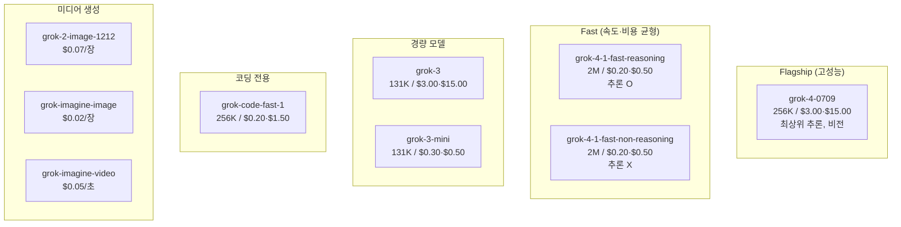
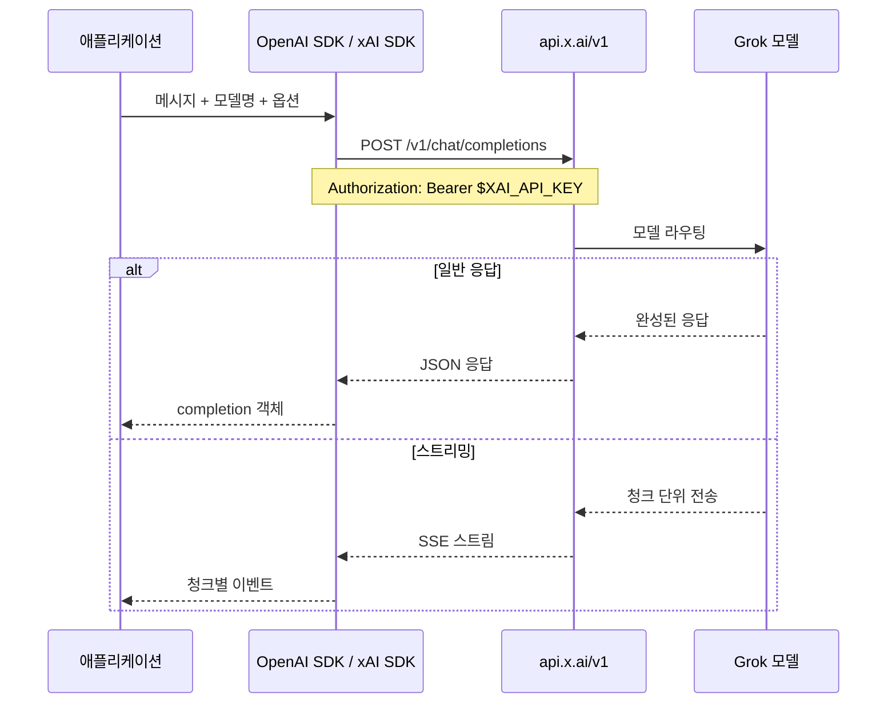
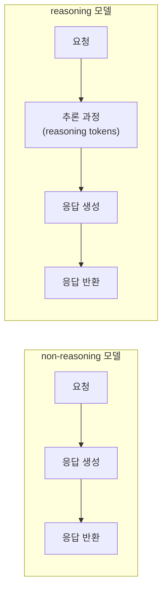

# Grok

## 1. Grok이란

**Grok**은 Elon Musk가 설립한 **xAI**에서 개발한 AI 어시스턴트이자 대규모 언어 모델 패밀리다. X(구 Twitter)와의 실시간 연동이 특징이며, 코딩 전용 모델(`grok-code-fast-1`)과 CLI 도구(Grok Build)를 통해 개발자 워크플로우를 지원한다.

### 1.1 주요 특징

- **실시간 정보 접근**: X/Twitter 통합으로 최신 트렌드와 공개 담론 데이터를 가져온다
- **응답 속도**: 코딩 제안 2초 이내, 일반 응답도 거의 즉시 돌아온다
- **컨텍스트 윈도우**: Fast 모델 기준 최대 2M 토큰까지 처리한다
- **저렴한 가격**: Fast 모델 기준 $0.20/$0.50 per 1M 토큰
- **OpenAI SDK 호환**: 기존 OpenAI SDK를 `base_url`만 변경하면 그대로 쓸 수 있다
- **멀티모달**: 텍스트, 이미지 생성/이해, 비디오 생성, 음성까지 하나의 API로 처리한다

### 1.2 다른 AI 도구와의 비교

| 특징 | Grok | Claude Code | Codex |
|------|------|------------|-------|
| **개발사** | xAI | Anthropic | OpenAI |
| **코딩 전용 모델** | grok-code-fast-1 | Claude Opus/Sonnet | gpt-5.3-codex |
| **컨텍스트 윈도우** | 최대 2M 토큰 | 200K 토큰 | 모델별 상이 |
| **실시간 정보** | X/Twitter 네이티브 | WebSearch | WebSearch |
| **API 가격 (입력)** | $0.20/1M (Fast) | 모델별 상이 | $1.75/1M |
| **CLI 도구** | Grok Build | Claude Code | Codex CLI |
| **오픈소스** | CLI 일부 | 비공개 | Apache-2.0 |

---

## 2. 모델 라인업

### 2.1 모델 라인업 구조



어떤 모델을 쓸지 판단 기준은 다음과 같다.

- **빠른 응답 + 저렴한 비용이 우선**: `grok-4-1-fast-non-reasoning` — 추론 과정 없이 바로 응답하므로 latency가 가장 짧다
- **추론이 필요한 복잡한 질문**: `grok-4-1-fast-reasoning` — 같은 가격이지만 추론 토큰이 추가로 발생한다
- **코딩 작업 전용**: `grok-code-fast-1` — SWE-Bench 70.8% 달성, 코드 관련 작업에 가장 정확하다
- **정확도가 최우선**: `grok-4-0709` — 가격이 15배 비싸지만 복잡한 분석에 적합하다

### 2.2 주요 모델

| 모델 | 컨텍스트 | 입력 가격 | 출력 가격 | 주요 기능 |
|------|---------|----------|----------|----------|
| **grok-4-1-fast-reasoning** | 2M | $0.20 | $0.50 | 함수 호출, 구조화 출력, 추론, 비전 |
| **grok-4-1-fast-non-reasoning** | 2M | $0.20 | $0.50 | 함수 호출, 구조화 출력, 비전 |
| **grok-4-0709** | 256K | $3.00 | $15.00 | 최상위 추론, 비전 |
| **grok-3** | 131K | $3.00 | $15.00 | 함수 호출, 구조화 출력 |
| **grok-3-mini** | 131K | $0.30 | $0.50 | 경량 추론 |
| **grok-code-fast-1** | 256K | $0.20 | $1.50 | 코딩 특화, 추론 |

> 가격은 1M 토큰 기준 (USD)

### 2.3 코딩 전용 모델: grok-code-fast-1

코딩 작업에 최적화된 추론 모델이다.

- **SWE-Bench-Verified**: 70.8%
- **코딩 정확도**: 93.0%
- **지원 언어**: TypeScript, Python, Java, Rust, C++, Go
- **추론 트레이스 노출**: 응답에서 추론 과정을 확인할 수 있다
- **함수 호출 & 구조화 출력**: 자율 에이전트 구축에 사용 가능
- **개발 도구 숙련**: grep, 터미널, 파일 편집 등

### 2.4 특수 모델

| 모델 | 용도 | 가격 |
|------|------|------|
| **grok-2-image-1212** | 텍스트→이미지 | $0.07/장 |
| **grok-imagine-image** | 텍스트/이미지→이미지 | $0.02/장 |
| **grok-imagine-video** | 텍스트/이미지→비디오 | $0.05/초 |

---

## 3. 설치 및 설정

### 3.1 API 접근 설정

```bash
# 1. x.ai에서 계정 생성 및 API 키 발급
#    https://console.x.ai/

# 2. 환경 변수 설정
export XAI_API_KEY="your_api_key"

# .zshrc에 영구 설정
echo 'export XAI_API_KEY="your_api_key"' >> ~/.zshrc
```

무료 크레딧 관련: 신규 가입 시 $25 무료 크레딧이 제공된다. 데이터 공유 프로그램에 참여하면 월 $150이 추가된다.

### 3.2 Grok Build (공식 CLI)

2026년 2월에 출시된 xAI 공식 코딩 에이전트 도구다.

- CLI 기반으로 여러 머신에서 동시 작업 가능
- 코드는 **로컬에서 실행** (클라우드 전송 없음)
- 자동 작업 계획, 정보 검색, 멀티스텝 워크플로우
- GitHub 통합 내장
- 여러 Grok 모델 선택 가능

### 3.3 grok-cli (오픈소스)

```bash
# bun으로 설치
bun add -g @vibe-kit/grok-cli

# 또는 npm으로 설치
npm install -g @vibe-kit/grok-cli
```

**주요 기능**:
- Grok 모델 기반 대화형 AI
- 파일 읽기/생성/수정
- Bash 명령 실행
- 최대 400라운드 도구 실행
- 기본 엔드포인트: `https://api.x.ai/v1`

---

## 4. API 사용법

### 4.1 API 호출 흐름



### 4.2 OpenAI SDK 호환 (Python)

기존 OpenAI SDK의 `base_url`만 변경하면 바로 사용할 수 있다.

```python
from openai import OpenAI

client = OpenAI(
    api_key="your_xai_api_key",
    base_url="https://api.x.ai/v1"
)

# 코딩 전용 모델 사용
completion = client.chat.completions.create(
    model="grok-code-fast-1",
    messages=[
        {"role": "system", "content": "You are a helpful coding assistant."},
        {"role": "user", "content": "Python으로 퀵소트 구현해줘"}
    ]
)

print(completion.choices[0].message.content)
```

### 4.3 스트리밍 응답 처리

긴 응답을 받을 때는 스트리밍을 쓰는 게 낫다. 사용자 입장에서 첫 토큰까지의 대기 시간이 줄어든다.

```python
from openai import OpenAI

client = OpenAI(
    api_key="your_xai_api_key",
    base_url="https://api.x.ai/v1"
)

stream = client.chat.completions.create(
    model="grok-4-1-fast-reasoning",
    messages=[
        {"role": "user", "content": "Spring Boot 3에서 가상 스레드 설정 방법 알려줘"}
    ],
    stream=True
)

for chunk in stream:
    delta = chunk.choices[0].delta
    if delta.content:
        print(delta.content, end="", flush=True)

# 추론 모델 사용 시 reasoning_content도 스트리밍된다
# delta.reasoning_content가 있으면 추론 과정이 먼저 출력된다
```

주의할 점이 있다. 추론 모델(`reasoning` 계열)을 스트리밍으로 호출하면 `reasoning_content`가 먼저 쭉 나오고 그 다음에 `content`가 나온다. 추론 과정이 길면 첫 실제 응답까지 시간이 꽤 걸릴 수 있다.

### 4.4 함수 호출 (Function Calling)

Grok의 함수 호출은 OpenAI와 동일한 포맷을 사용한다. `grok-4-1-fast-reasoning`, `grok-4-1-fast-non-reasoning`, `grok-3`, `grok-code-fast-1`에서 지원한다.

```python
import json
from openai import OpenAI

client = OpenAI(
    api_key="your_xai_api_key",
    base_url="https://api.x.ai/v1"
)

# 1. 도구 정의
tools = [
    {
        "type": "function",
        "function": {
            "name": "get_server_status",
            "description": "서버의 현재 상태를 조회한다",
            "parameters": {
                "type": "object",
                "properties": {
                    "server_name": {
                        "type": "string",
                        "description": "서버 이름 (예: api-prod-01)"
                    },
                    "metrics": {
                        "type": "array",
                        "items": {"type": "string"},
                        "description": "조회할 메트릭 목록 (cpu, memory, disk, connections)"
                    }
                },
                "required": ["server_name"]
            }
        }
    }
]

# 2. 함수 호출 요청
response = client.chat.completions.create(
    model="grok-4-1-fast-non-reasoning",
    messages=[
        {"role": "user", "content": "api-prod-01 서버의 CPU랑 메모리 상태 알려줘"}
    ],
    tools=tools,
    tool_choice="auto"
)

message = response.choices[0].message

# 3. 모델이 함수 호출을 결정한 경우
if message.tool_calls:
    tool_call = message.tool_calls[0]
    args = json.loads(tool_call.function.arguments)
    # args: {"server_name": "api-prod-01", "metrics": ["cpu", "memory"]}

    # 실제 함수 실행 (여기서는 예시)
    result = {"cpu": "45%", "memory": "72%", "status": "healthy"}

    # 4. 함수 결과를 다시 모델에 전달
    follow_up = client.chat.completions.create(
        model="grok-4-1-fast-non-reasoning",
        messages=[
            {"role": "user", "content": "api-prod-01 서버의 CPU랑 메모리 상태 알려줘"},
            message,  # 모델의 tool_call 응답
            {
                "role": "tool",
                "tool_call_id": tool_call.id,
                "content": json.dumps(result)
            }
        ],
        tools=tools
    )

    print(follow_up.choices[0].message.content)
```

함수 호출에서 주의할 점:

- `tool_choice="auto"`가 기본값이다. `"required"`로 설정하면 모델이 반드시 함수를 호출하게 된다
- 함수 이름과 설명을 구체적으로 적어야 모델이 정확히 판단한다. "데이터 조회"처럼 모호하게 쓰면 잘못된 함수를 호출하는 경우가 있다
- `grok-3-mini`는 함수 호출을 지원하지 않는다

### 4.5 xAI 네이티브 SDK (Python)

```bash
pip install xai-sdk
```

```python
from xai_sdk import Client

client = Client(api_key="your_xai_api_key")

# 기본 채팅
response = client.chat.create(
    model="grok-4-1-fast-reasoning",
    messages=[
        {"role": "user", "content": "Java 21의 가상 스레드와 기존 플랫폼 스레드의 차이점을 설명해줘"}
    ]
)

print(response.choices[0].message.content)
```

```python
# 스트리밍
stream = client.chat.create(
    model="grok-4-1-fast-reasoning",
    messages=[
        {"role": "user", "content": "Kubernetes Pod이 CrashLoopBackOff 상태일 때 디버깅 순서"}
    ],
    stream=True
)

for event in stream:
    if event.type == "content":
        print(event.data, end="", flush=True)
```

```python
# 구조화 출력 (JSON 스키마)
from pydantic import BaseModel

class CodeReview(BaseModel):
    file_path: str
    issues: list[str]
    severity: str  # "low", "medium", "high"

response = client.chat.create(
    model="grok-4-1-fast-non-reasoning",
    messages=[
        {"role": "user", "content": "다음 코드를 리뷰해줘: def add(a, b): return a+b"}
    ],
    response_format={
        "type": "json_schema",
        "json_schema": {
            "name": "code_review",
            "schema": CodeReview.model_json_schema()
        }
    }
)
```

### 4.6 Vercel AI SDK (JavaScript/TypeScript)

```bash
npm install @ai-sdk/xai ai
```

```typescript
import { xai } from '@ai-sdk/xai';
import { generateText, streamText } from 'ai';

// 기본 텍스트 생성
const { text } = await generateText({
  model: xai('grok-4-1-fast-reasoning'),
  prompt: 'Express.js에서 에러 핸들링 미들웨어 작성법',
});

console.log(text);
```

```typescript
// 스트리밍 응답
const result = streamText({
  model: xai('grok-4-1-fast-non-reasoning'),
  messages: [
    { role: 'user', content: 'TypeScript에서 제네릭 유틸리티 타입 설명해줘' }
  ],
});

for await (const chunk of result.textStream) {
  process.stdout.write(chunk);
}
```

```typescript
// 도구 호출 (Vercel AI SDK의 tool 인터페이스)
import { tool } from 'ai';
import { z } from 'zod';

const result = await generateText({
  model: xai('grok-4-1-fast-non-reasoning'),
  prompt: '서울 날씨 알려줘',
  tools: {
    getWeather: tool({
      description: '특정 도시의 현재 날씨를 조회한다',
      parameters: z.object({
        city: z.string().describe('도시 이름'),
      }),
      execute: async ({ city }) => {
        // 실제 API 호출 로직
        return { temp: 18, condition: 'sunny' };
      },
    }),
  },
});
```

### 4.7 REST API 직접 호출

```bash
curl https://api.x.ai/v1/chat/completions \
  -H "Content-Type: application/json" \
  -H "Authorization: Bearer $XAI_API_KEY" \
  -d '{
    "model": "grok-code-fast-1",
    "messages": [
      {"role": "user", "content": "TypeScript로 Express 서버 만들어줘"}
    ]
  }'
```

### 4.8 API 엔드포인트

| 엔드포인트 | 용도 |
|-----------|------|
| `POST /v1/chat/completions` | 채팅 완성 |
| `POST /v1/responses` | 응답 생성 |
| **Base URL** | `https://api.x.ai` |
| **리전 엔드포인트** | `us-east-1` (미국), `eu-west-1` (유럽) |

### 4.9 도구 호출 가격

Web Search, X Search, Code Execution, Document Search: **$5 / 1,000 호출**

---

## 5. IDE 통합

### 5.1 GitHub Copilot

Grok Code Fast 1은 GitHub Copilot의 모델 선택기에서 바로 사용할 수 있다.

**지원 환경**:
- github.com
- GitHub Mobile
- VS Code
- Visual Studio
- JetBrains IDEs
- Xcode
- Eclipse

### 5.2 Cursor 설정

```
1. Cursor 설치
2. Cursor Settings → Models → API Keys
3. Override OpenAI Base URL: https://api.x.ai/v1
4. xAI API Key 입력
5. Custom Model 추가: grok-code-fast-1
```

### 5.3 Cline (VS Code 확장)

```
1. VS Code 마켓플레이스에서 Cline 설치
2. Cline 열기 → "Use your own API key"
3. xAI API Key 입력 후 저장
4. Cline Settings → API Configuration → grok-code-fast-1 선택
```

### 5.4 기타 지원 에디터

OpenCode, Kilo Code, Roo Code, Windsurf 등에서도 사용할 수 있다.

---

## 6. 핵심 기능

### 6.1 추론 모드

| 모드 | 설명 |
|------|------|
| **Think Mode** | 기본 추론. 복잡한 문제에 대해 단계적으로 사고한다 |
| **Big Brain Mode** | 더 많은 연산을 할당해서 추론한다. 그만큼 느리다 |

실무에서 체감되는 차이: Think Mode는 일반적인 코딩 질문에 충분하다. Big Brain Mode는 수학적 증명이나 복잡한 알고리즘 설계 같은 경우에만 쓸 만하고, 일반 개발 작업에 쓰면 latency만 늘어난다.

### 6.2 실시간 검색

X/Twitter와의 네이티브 통합으로 다른 AI 도구에 없는 실시간 소셜 데이터에 접근할 수 있다.

```python
# X Search 활용 예시
completion = client.chat.completions.create(
    model="grok-4-1-fast-reasoning",
    messages=[
        {"role": "user", "content": "최근 React 19 관련 트렌드 분석해줘"}
    ],
    tools=[{"type": "x_search"}]  # X 검색 도구 활용
)
```

### 6.3 Batch API

대량 처리 시 **표준 가격의 50%**로 비동기 처리할 수 있다. 대부분 24시간 이내 완료된다.

### 6.4 멀티모달 통합

텍스트, 이미지 생성, 이미지 이해, 비디오 생성, 음성이 하나의 API에서 모두 처리된다. 별도 서비스가 필요 없다.

---

## 7. 트러블슈팅

실제로 Grok API를 운영 환경에서 쓰다 보면 여러 문제를 마주치게 된다. 자주 발생하는 문제와 해결 방법을 정리한다.

### 7.1 Rate Limit

xAI API는 분당 요청 수와 분당 토큰 수에 제한이 있다. 제한에 걸리면 HTTP 429 응답이 온다.

```python
import time
from openai import OpenAI, RateLimitError

client = OpenAI(api_key="your_xai_api_key", base_url="https://api.x.ai/v1")

def call_with_retry(messages, max_retries=3):
    for attempt in range(max_retries):
        try:
            return client.chat.completions.create(
                model="grok-4-1-fast-non-reasoning",
                messages=messages
            )
        except RateLimitError as e:
            # 응답 헤더의 Retry-After 값을 확인한다
            retry_after = int(e.response.headers.get("Retry-After", 5))
            print(f"Rate limit 도달. {retry_after}초 후 재시도 ({attempt + 1}/{max_retries})")
            time.sleep(retry_after)
    raise Exception("최대 재시도 횟수 초과")
```

대응 방법:

- 응답 헤더의 `x-ratelimit-remaining-requests`, `x-ratelimit-remaining-tokens` 값을 모니터링한다
- 429 응답의 `Retry-After` 헤더 값만큼 대기 후 재시도한다
- Batch API를 쓰면 rate limit 걱정 없이 대량 처리가 가능하다
- 무료 크레딧 티어는 rate limit이 상당히 낮다. 프로덕션에서는 유료 플랜으로 전환해야 한다

### 7.2 타임아웃

긴 프롬프트나 추론 모델 사용 시 응답 시간이 길어질 수 있다. 특히 `grok-4-0709`나 reasoning 모델은 추론 시간이 추가된다.

```python
from openai import OpenAI
import httpx

# 타임아웃을 명시적으로 설정한다
client = OpenAI(
    api_key="your_xai_api_key",
    base_url="https://api.x.ai/v1",
    timeout=httpx.Timeout(
        connect=10.0,    # 연결 타임아웃
        read=120.0,      # 읽기 타임아웃 (추론 모델은 넉넉하게)
        write=10.0,
        pool=10.0
    )
)
```

모델별 응답 시간 체감:

| 모델 | 일반 질문 | 복잡한 코딩 | 비고 |
|------|----------|-----------|------|
| grok-4-1-fast-non-reasoning | 1~3초 | 3~8초 | 가장 빠르다 |
| grok-4-1-fast-reasoning | 3~10초 | 10~30초 | 추론 토큰이 응답 전에 생성된다 |
| grok-4-0709 | 5~15초 | 20~60초 | 복잡한 질문일수록 편차가 크다 |
| grok-code-fast-1 | 2~5초 | 5~15초 | 코드 작업에서 가장 정확하다 |

추론 모델을 쓸 때는 `read` 타임아웃을 120초 이상으로 잡는 게 안전하다. 60초로 잡으면 복잡한 질문에서 종종 타임아웃이 발생한다.

### 7.3 토큰 초과

컨텍스트 윈도우를 초과하면 API가 에러를 반환한다. 출력 토큰이 `max_tokens`를 넘으면 응답이 중간에 잘린다.

```python
# 응답이 잘렸는지 확인하는 방법
response = client.chat.completions.create(
    model="grok-4-1-fast-reasoning",
    messages=messages,
    max_tokens=4096
)

# finish_reason 확인
finish_reason = response.choices[0].finish_reason
if finish_reason == "length":
    # 토큰 제한에 걸려서 응답이 잘린 경우
    print("응답이 잘렸다. max_tokens를 늘리거나 프롬프트를 줄여야 한다")
elif finish_reason == "stop":
    # 정상 종료
    print(response.choices[0].message.content)

# 사용량 확인
print(f"입력: {response.usage.prompt_tokens} 토큰")
print(f"출력: {response.usage.completion_tokens} 토큰")
```

겪기 쉬운 실수:

- `max_tokens`를 설정하지 않으면 모델 기본값이 적용된다. 긴 코드 생성을 요청했는데 중간에 잘린다면 `max_tokens`부터 확인한다
- 추론 모델은 reasoning 토큰도 출력 토큰에 포함된다. `max_tokens=1000`으로 설정했는데 추론에 800 토큰을 쓰면 실제 응답은 200 토큰뿐이다
- 2M 컨텍스트 모델이라도 실제로 200K 이상의 입력을 넣으면 응답 품질이 떨어지는 경우가 있다. 컨텍스트가 크다고 무조건 다 넣는 건 좋지 않다

### 7.4 추론 모드별 Latency 차이

reasoning과 non-reasoning 모델 선택이 latency에 크게 영향을 준다.



같은 `grok-4-1-fast` 모델이라도 reasoning과 non-reasoning의 latency 차이가 2~5배 난다. 선택 기준:

- **non-reasoning을 쓰는 경우**: 단순 코드 생성, 텍스트 변환, 데이터 포맷팅, 번역 등. 정답이 명확한 작업
- **reasoning을 쓰는 경우**: 버그 분석, 아키텍처 설계 질문, 복잡한 로직 구현, 코드 리뷰 등. 생각이 필요한 작업

실제로 운영 서비스에서 AI 응답을 보여주는 경우라면, non-reasoning + 스트리밍 조합이 사용자 경험이 가장 좋다. reasoning 모델은 추론이 끝날 때까지 첫 content 토큰이 안 나오기 때문에 사용자가 기다리는 시간이 길어진다.

---

## 8. 비용 관리

| 항목 | 설명 |
|------|------|
| **Fast 모델 활용** | 일반 작업에는 grok-4-1-fast ($0.20/$0.50)로 비용을 줄인다 |
| **코딩은 전용 모델** | 코딩 작업에는 grok-code-fast-1을 쓴다 |
| **Batch API** | 대량 처리 시 50% 할인 |
| **무료 크레딧** | 가입 시 $25 무료 + 데이터 공유 시 월 $150 |
| **캐싱** | 반복 요청은 캐싱해서 API 호출을 줄인다 |

---

## 9. 다른 도구에서 마이그레이션

### OpenAI에서 Grok으로

```python
# 변경 전 (OpenAI)
client = OpenAI(api_key="sk-...")

# 변경 후 (Grok) — base_url만 추가
client = OpenAI(
    api_key="xai-...",
    base_url="https://api.x.ai/v1"
)
```

API 호환성이 높아 `base_url`과 `api_key`, `model`만 변경하면 기존 코드가 대부분 동작한다.

---

## 참고

- [xAI 공식 사이트](https://x.ai)
- [xAI API 문서](https://docs.x.ai)
- [xAI 모델 및 가격](https://docs.x.ai/developers/models)
- [Grok Code Fast 1 발표](https://x.ai/news/grok-code-fast-1)
- [코드 에디터 연동 안내](https://docs.x.ai/docs/guides/use-with-code-editors)
- [xAI API 튜토리얼](https://docs.x.ai/docs/tutorial)
- [Grok Build](https://grokai.build)
