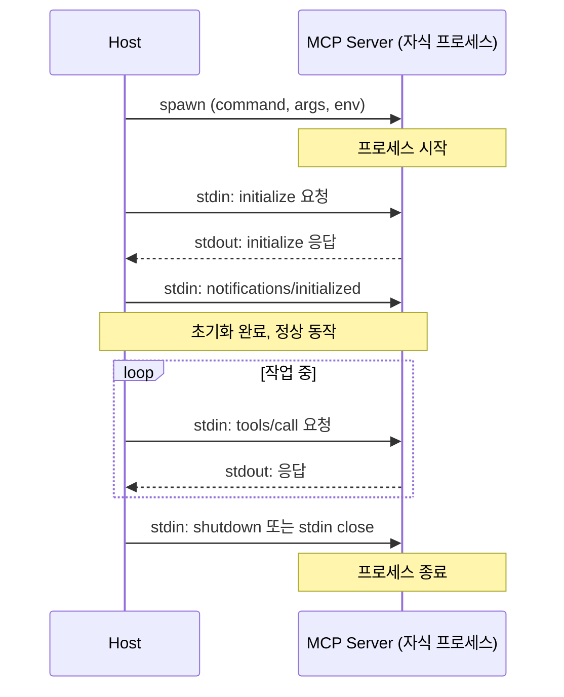
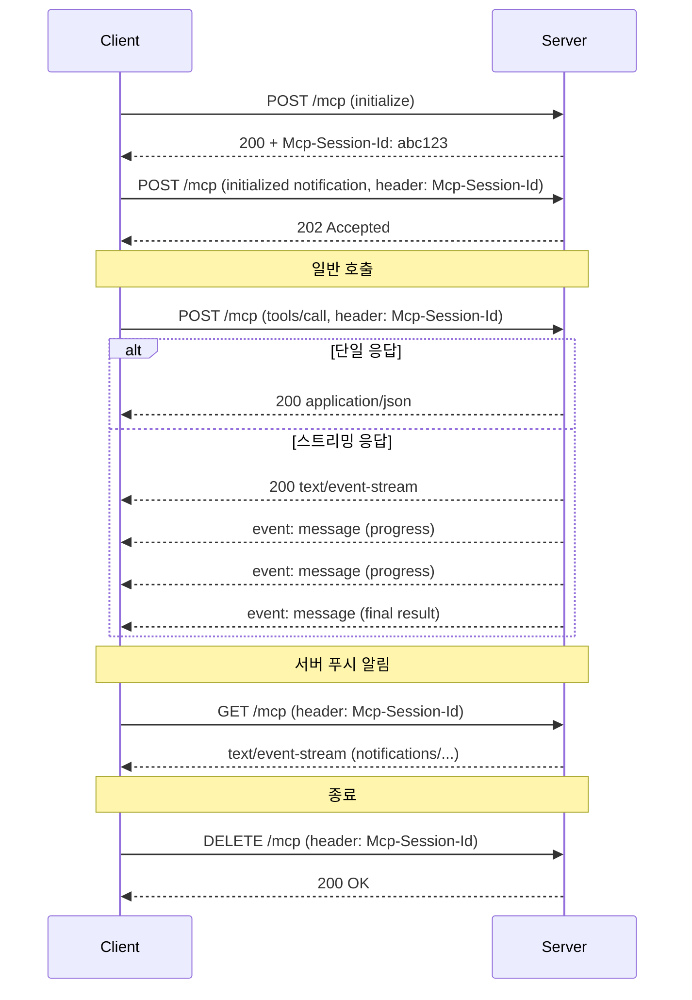

# MCP 전송 방식 — stdio와 SSE/Streamable HTTP

MCP 프로토콜은 JSON-RPC 2.0 메시지를 어떻게 운반할지에 대해 두 가지 공식 전송(transport)을 정의한다. 하나는 로컬 프로세스 간 통신용 **stdio**이고, 다른 하나는 네트워크용 **HTTP 기반 전송**이다. HTTP 쪽은 2024년 말 사양에서 **SSE(Server-Sent Events)** 방식이 먼저 들어왔다가, 2025-03-26 사양 개정에서 **Streamable HTTP**로 대체됐다.

이 문서는 두 전송이 실제로 메시지를 어떻게 주고받는지, 프로세스와 연결의 수명 주기는 어떻게 다른지, 인증과 멀티 클라이언트 처리는 어떤 차이가 있는지, 그리고 실제 운영하다가 부딪히는 문제들을 정리한다.

---

## 1. JSON-RPC 2.0이 전송 방식과 무엇이 다른가

먼저 짚고 갈 것이 있다. **JSON-RPC 2.0은 메시지 포맷이고, 전송 방식은 그 메시지를 어떻게 운반할지를 정한다.** MCP에서 주고받는 모든 메시지는 형태가 같다.

```json
// 요청
{ "jsonrpc": "2.0", "id": 1, "method": "tools/list", "params": {} }

// 응답
{ "jsonrpc": "2.0", "id": 1, "result": { "tools": [...] } }

// 알림 (응답 없음)
{ "jsonrpc": "2.0", "method": "notifications/progress", "params": {...} }
```

stdio든 HTTP든 이 페이로드 자체는 동일하다. 다른 것은 **프레이밍(framing)**, **연결 수명**, **메시지 방향성**, **인증 위치**다. 그래서 잘 만든 MCP 서버는 비즈니스 로직과 전송 계층을 분리해두고, 시작 시 환경 변수나 인자만 보고 어떤 transport를 쓸지 결정한다.

---

## 2. stdio 전송

### 2.1 동작 원리

stdio는 가장 단순하다. Host(AI 도구)가 MCP 서버를 **자식 프로세스로 fork/exec**하고, 그 프로세스의 **stdin과 stdout을 파이프로 연결**해서 JSON-RPC 메시지를 주고받는다. stderr는 로그용으로 따로 빠진다.

```
┌──────────────────┐                     ┌──────────────────┐
│   Host (Cursor)  │                     │   MCP Server     │
│                  │                     │   (자식 프로세스)  │
│  ┌────────────┐  │   stdin (write)     │  ┌────────────┐  │
│  │ stdin pipe │──┼────────────────────▶│  │ process.   │  │
│  └────────────┘  │                     │  │ stdin      │  │
│                  │                     │  └────────────┘  │
│  ┌────────────┐  │   stdout (read)     │  ┌────────────┐  │
│  │ stdout pipe│◀─┼─────────────────────│  │ process.   │  │
│  └────────────┘  │                     │  │ stdout     │  │
│                  │                     │  └────────────┘  │
│  ┌────────────┐  │   stderr (read)     │  ┌────────────┐  │
│  │ stderr pipe│◀─┼─────────────────────│  │ process.   │  │
│  └────────────┘  │   (로그/디버깅용)     │  │ stderr     │  │
│                  │                     │  └────────────┘  │
└──────────────────┘                     └──────────────────┘
```

메시지 프레이밍은 **줄바꿈(`\n`) 구분 JSON**이다. 한 줄에 JSON-RPC 메시지 하나가 통째로 들어가고, 메시지가 끝나면 `\n`을 붙여 보낸다. 그래서 메시지 안에 raw newline이 들어가면 안 된다(JSON 인코딩으로 `\n` 문자열 이스케이프는 괜찮다).

### 2.2 메시지 흐름과 수명 주기

전체 흐름은 다음 순서로 일어난다.



- **연결의 수명 = 프로세스의 수명**이다. Host가 프로세스를 띄우는 순간 연결이 시작되고, 프로세스가 종료되면 연결도 끝난다.
- **재시작 책임은 Host에 있다.** 서버 프로세스가 죽으면 Host가 알아서 다시 spawn 한다. Cursor나 Claude Code는 보통 자동으로 재시작한다.
- **단일 클라이언트 전용**이다. 한 프로세스의 stdin/stdout은 본질적으로 1:1이다. 여러 Host가 같은 stdio 서버 인스턴스를 공유할 수 없다.

### 2.3 인증 모델

stdio는 **인증이 없다**. 정확히 말하면 인증의 단위가 OS 수준의 프로세스 권한이다. Host가 띄운 자식 프로세스이므로, 그 프로세스가 접근할 수 있는 자원(파일 시스템, 환경 변수, 로컬 소켓)은 Host와 같다. 토큰 검증이나 OAuth 같은 게 끼어들 자리가 없다.

대신 자격증명을 서버에 넘겨야 할 때는 **환경 변수**나 **command-line 인자**로 전달한다. MCP 클라이언트 설정 파일에서 `env` 항목으로 토큰을 넣어주는 방식이다.

```json
{
  "mcpServers": {
    "github": {
      "command": "npx",
      "args": ["-y", "@modelcontextprotocol/server-github"],
      "env": {
        "GITHUB_PERSONAL_ACCESS_TOKEN": "ghp_..."
      }
    }
  }
}
```

이 토큰은 자식 프로세스의 환경 변수로 들어간다. 그래서 stdio 서버를 만들 때는 **시크릿이 stderr 로그로 새지 않도록** 조심해야 한다. 예를 들어 디버그 로그에 `process.env`를 통째로 출력하면 토큰이 그대로 노출된다.

### 2.4 SDK 구현 예시

TypeScript SDK로 stdio 서버를 만드는 코드는 이렇게 생겼다.

```typescript
import { McpServer } from "@modelcontextprotocol/sdk/server/mcp.js";
import { StdioServerTransport } from "@modelcontextprotocol/sdk/server/stdio.js";

const server = new McpServer({
  name: "local-fs-server",
  version: "1.0.0",
});

server.tool(
  "read_file",
  "로컬 파일을 읽는다",
  { path: { type: "string" } },
  async ({ path }) => {
    const content = await fs.readFile(path, "utf-8");
    return { content: [{ type: "text", text: content }] };
  }
);

const transport = new StdioServerTransport();
await server.connect(transport);
```

Python SDK도 비슷하다.

```python
from mcp.server import Server
from mcp.server.stdio import stdio_server
import asyncio

server = Server("local-fs-server")

@server.tool()
async def read_file(path: str) -> str:
    with open(path, "r") as f:
        return f.read()

async def main():
    async with stdio_server() as (read_stream, write_stream):
        await server.run(read_stream, write_stream, server.create_initialization_options())

asyncio.run(main())
```

핵심은 두 SDK 모두 **stdin을 read stream으로, stdout을 write stream으로 연결**한다는 점이다. 서버 코드 자체는 transport를 의식하지 않고 동작한다.

---

## 3. SSE 전송 (deprecated)

### 3.1 왜 SSE였고 왜 deprecated 됐는가

2024년 말 MCP 사양에 처음 들어왔을 때는 HTTP 기반 전송으로 **SSE**를 선택했다. 이유는 단순했다. JSON-RPC는 본질적으로 양방향이고 서버가 알림을 푸시할 수 있어야 하는데, 일반 HTTP 요청-응답으로는 서버 푸시가 어렵다. WebSocket을 쓰자니 프록시/방화벽 환경에서 자주 막히고, SSE는 단순한 HTTP GET으로 동작하니 호환성이 좋다.

그래서 초기 SSE 방식은 다음과 같이 **두 개의 엔드포인트**를 분리해서 썼다.

```
┌────────────┐    GET /sse           ┌──────────────┐
│            │──── (SSE 스트림 열기) ─▶│              │
│            │◀──── event: endpoint ──│              │
│            │     data: /messages?  │              │
│  Client    │           sessionId=X │  MCP Server  │
│            │                       │              │
│            │    POST /messages     │              │
│            │──── ?sessionId=X ────▶│              │
│            │     (JSON-RPC 요청)    │              │
│            │                       │              │
│            │◀──── event: message ──│              │
│            │     data: {응답}       │              │
└────────────┘                       └──────────────┘
```

- **GET `/sse`**: 클라이언트가 먼저 SSE 연결을 연다. 서버는 첫 이벤트로 `endpoint`를 보내며 "POST는 이 URL로 보내라"고 알려준다 (보통 `sessionId`를 쿼리에 박는다).
- **POST `/messages?sessionId=X`**: 클라이언트가 요청을 보낼 때마다 별도 HTTP POST로 전송한다.
- **응답과 알림**: 서버가 SSE 스트림으로 `event: message` 형태로 푸시한다.

문제가 여러 가지였다.

1. **두 개의 HTTP 연결을 묶어서 다뤄야 한다.** SSE 스트림과 POST 요청이 별개의 연결이어서, 로드 밸런서가 두 요청을 다른 백엔드로 라우팅하면 세션이 깨진다. Sticky session이 필수가 됐다.
2. **SSE는 단방향(서버 → 클라이언트)**이다. 양방향처럼 보이게 하려고 POST를 별도 채널로 끼워 넣은 구조가 어색했다.
3. **장시간 연결 유지가 부담**이었다. SSE는 본질적으로 long-lived HTTP 연결이라 idle timeout, 프록시 버퍼링, 재연결 처리가 까다로웠다.
4. **Stateless 배포가 사실상 불가능**이었다. 항상 세션 상태를 들고 다녀야 했다.

이런 이유로 2025-03-26 사양 개정에서 **Streamable HTTP**로 대체됐다. 기존 SSE 서버도 한동안은 동작하지만, 신규 개발은 Streamable HTTP로 한다.

### 3.2 SSE 코드가 남아 있다면

레거시로 돌아가는 SSE 서버를 유지보수해야 하는 경우가 있다. TypeScript SDK에는 `SSEServerTransport`가 아직 남아 있다.

```typescript
import express from "express";
import { McpServer } from "@modelcontextprotocol/sdk/server/mcp.js";
import { SSEServerTransport } from "@modelcontextprotocol/sdk/server/sse.js";

const app = express();
const server = new McpServer({ name: "legacy", version: "1.0.0" });
// ... tool 등록 ...

const transports = new Map<string, SSEServerTransport>();

app.get("/sse", async (req, res) => {
  const transport = new SSEServerTransport("/messages", res);
  transports.set(transport.sessionId, transport);
  res.on("close", () => transports.delete(transport.sessionId));
  await server.connect(transport);
});

app.post("/messages", async (req, res) => {
  const sessionId = req.query.sessionId as string;
  const transport = transports.get(sessionId);
  if (!transport) return res.status(404).send("session not found");
  await transport.handlePostMessage(req, res);
});

app.listen(3000);
```

여기서 두 엔드포인트가 같은 프로세스 메모리의 `transports` 맵을 공유한다. 그래서 멀티 인스턴스로 스케일아웃하려면 sticky session이나 외부 세션 스토어가 필요하다.

---

## 4. Streamable HTTP 전송

### 4.1 동작 원리

Streamable HTTP는 **단일 엔드포인트(`/mcp`)로 요청과 응답을 모두 처리**한다. SSE의 두 엔드포인트 구조를 하나로 합치고, 응답 형식을 상황에 따라 골라쓸 수 있게 했다.

```
┌────────────┐    POST /mcp                  ┌──────────────┐
│            │── (JSON-RPC 요청)              │              │
│            │── Accept: application/json,   │              │
│            │           text/event-stream    │              │
│            │── Mcp-Session-Id: <id>        │              │
│  Client    │                                │  MCP Server  │
│            │                                │              │
│            │  서버는 둘 중 하나로 응답         │              │
│            │                                │              │
│            │◀── 200 + JSON 단일 응답         │              │
│            │     또는                       │              │
│            │◀── 200 + SSE 스트림            │              │
│            │     (여러 메시지 푸시 가능)       │              │
│            │                                │              │
│            │    GET /mcp                   │              │
│            │── (서버 → 클라이언트 알림용 스트림)│              │
│            │◀── SSE 스트림                  │              │
└────────────┘                                └──────────────┘
```

핵심 아이디어는 이렇다.

- **POST `/mcp`**: 클라이언트가 요청을 보낸다. 서버는 응답을 (a) 평범한 `application/json` 응답 한 번으로 줄 수도 있고, (b) `text/event-stream`으로 여러 메시지를 스트리밍할 수도 있다. 클라이언트는 `Accept` 헤더로 둘 다 받을 수 있다고 알려준다.
- **GET `/mcp`** (선택): 서버가 클라이언트에게 임의 알림을 푸시하고 싶을 때 클라이언트가 이 엔드포인트로 SSE 스트림을 연다. 모든 서버가 이걸 요구하지는 않는다.
- **`Mcp-Session-Id` 헤더**: stateful 모드에서 세션 식별자. 서버가 `initialize` 응답에서 발급하고, 클라이언트는 이후 모든 요청 헤더에 실어 보낸다.

stateless 모드에서는 세션 헤더 없이 매 요청을 독립적으로 처리한다. 서버리스(Lambda, Cloud Functions) 환경에서 유용하다.

### 4.2 메시지 흐름

stateful 모드의 전체 흐름은 다음과 같다.



스트리밍 응답을 쓰는 대표적인 경우는 **장시간 작업의 progress 알림**이다. tool 실행이 30초 걸린다면, 서버가 SSE로 progress 메시지를 중간에 흘려보내다가 마지막에 최종 결과를 보낸다. 클라이언트는 응답 스트림을 끝까지 읽으면서 중간 메시지로 UI를 업데이트한다.

### 4.3 인증 모델

원격 전송이므로 인증이 필수다. MCP 사양은 **OAuth 2.1 (PKCE 포함)**을 표준 인증 방식으로 정한다. 흐름 자체는 평범한 OAuth와 같다.

```
1. 클라이언트가 /mcp에 토큰 없이 접근
   → 서버: 401 Unauthorized + WWW-Authenticate 헤더
2. 클라이언트가 서버 메타데이터(/.well-known/oauth-authorization-server) 조회
3. 사용자 브라우저로 authorization endpoint 리다이렉트 (PKCE)
4. 토큰 교환
5. 이후 모든 요청에 Authorization: Bearer <token>
```

실무에서는 OAuth까지 가지 않고 **API Key를 헤더로 받는** 단순한 형태로 시작하는 경우도 많다. 사양상 권장은 OAuth 2.1이지만, 사내 망에서 도는 서버라면 단순 토큰으로도 충분하다.

### 4.4 SDK 구현 예시

TypeScript SDK로 Streamable HTTP 서버를 만드는 모습은 이렇다.

```typescript
import express from "express";
import { McpServer } from "@modelcontextprotocol/sdk/server/mcp.js";
import { StreamableHTTPServerTransport } from "@modelcontextprotocol/sdk/server/streamableHttp.js";
import { randomUUID } from "node:crypto";

const app = express();
app.use(express.json());

const server = new McpServer({ name: "remote-server", version: "1.0.0" });
// ... tool 등록 ...

const transports = new Map<string, StreamableHTTPServerTransport>();

app.all("/mcp", async (req, res) => {
  const sessionId = req.headers["mcp-session-id"] as string | undefined;
  let transport = sessionId ? transports.get(sessionId) : undefined;

  if (!transport) {
    transport = new StreamableHTTPServerTransport({
      sessionIdGenerator: () => randomUUID(),
      onsessioninitialized: (id) => transports.set(id, transport!),
    });
    await server.connect(transport);
  }

  await transport.handleRequest(req, res, req.body);
});

app.listen(3000);
```

같은 프로세스 안에서 transport 인스턴스가 세션별로 살아 있다. Stateless 모드로 돌리려면 `sessionIdGenerator`를 `undefined`로 두면 된다.

Python SDK는 ASGI 인터페이스를 통해 FastAPI/Starlette에 마운트한다.

```python
from mcp.server import Server
from mcp.server.streamable_http import streamable_http_server
from starlette.applications import Starlette
from starlette.routing import Mount

server = Server("remote-server")

@server.tool()
async def echo(text: str) -> str:
    return text

app = Starlette(routes=[
    Mount("/mcp", app=streamable_http_server(server)),
])
```

---

## 5. SSE에서 Streamable HTTP로 마이그레이션

기존 SSE 서버가 있다면 이전 작업이 필요하다. 두 가지 접근이 있다.

### 5.1 한 번에 갈아치우기

가장 깔끔하다. SDK 버전을 올리고 transport 클래스만 교체한다. 클라이언트들도 SDK를 올리면 자동으로 새 transport를 쓴다.

```typescript
// before
import { SSEServerTransport } from "@modelcontextprotocol/sdk/server/sse.js";

app.get("/sse", ...);
app.post("/messages", ...);

// after
import { StreamableHTTPServerTransport } from "@modelcontextprotocol/sdk/server/streamableHttp.js";

app.all("/mcp", ...);
```

문제는 **클라이언트가 옛날 SDK라서 SSE만 알 때**다. 이 경우 클라이언트는 `/mcp`를 못 찾고 실패한다.

### 5.2 두 엔드포인트를 동시에 띄우기

호환성을 위해 한동안 양쪽을 다 노출하는 패턴이다.

```typescript
// 신규 클라이언트: /mcp
app.all("/mcp", streamableHttpHandler);

// 레거시 클라이언트: /sse + /messages
app.get("/sse", sseHandler);
app.post("/messages", messagesHandler);
```

두 transport가 같은 `McpServer` 인스턴스를 공유하면 비즈니스 로직은 한 벌이면 된다. 서서히 클라이언트를 옮긴 뒤 SSE 엔드포인트를 제거한다.

### 5.3 클라이언트 측 호환

반대로 클라이언트가 어떤 서버에 붙을지 모를 때는 **fallback 로직**을 넣는다. 먼저 `/mcp`로 POST 시도, 404나 405가 돌아오면 SSE 모드로 떨어지는 식이다. 공식 SDK도 일정 기간 자동 fallback을 지원한다.

---

## 6. 환경별 선택 기준

### 6.1 비교 표

| 항목 | stdio | SSE (deprecated) | Streamable HTTP |
|------|-------|------------------|-----------------|
| 통신 매체 | OS 파이프 (stdin/stdout) | HTTP (2 endpoints) | HTTP (1 endpoint) |
| 메시지 프레이밍 | newline-delimited JSON | SSE event + JSON POST | JSON 또는 SSE |
| 연결 수명 | 프로세스 수명 | long-lived SSE 연결 | 요청 단위 또는 세션 단위 |
| 클라이언트 수 | 1:1 | N:1 (sticky 필요) | N:1 |
| 인증 | OS 권한 + env 변수 | OAuth 2.1 권장 | OAuth 2.1 권장 |
| 프로세스 모델 | Host가 spawn/관리 | 별도 서버 데몬 | 별도 서버 데몬 |
| 재시작 책임 | Host | 서버 자체 | 서버 자체 |
| 로컬 사용 | 자연스러움 | 가능하지만 과함 | 가능하지만 과함 |
| 원격 사용 | 불가능 | 가능 (deprecated) | 표준 |
| 컨테이너화 | sidecar/exec 패턴 | 자연스러움 | 자연스러움 |
| Stateless 배포 | 의미 없음 | 어려움 | 가능 |

### 6.2 로컬 환경

자기 노트북에서만 쓰는 MCP 서버라면 무조건 **stdio**다. 인증도 필요 없고, 설정 파일에 `command`/`args`만 박으면 끝난다. 패키지를 npm/pip으로 받아서 `npx @org/server` 또는 `uvx server` 같은 식으로 띄운다.

stdio의 1:1 제약이 문제가 되는 경우는 거의 없다. Cursor와 Claude Code를 동시에 쓴다면 각각이 자기 자식 프로세스를 따로 띄울 뿐이다. 같은 코드, 다른 프로세스 인스턴스가 두 개 도는 셈인데, 대부분의 MCP 서버는 가벼워서 부담이 안 된다.

### 6.3 원격 환경

팀이 공유하거나, 사내 데이터에 접근해야 하거나, 인증이 필요한 외부 SaaS와 연동하는 서버라면 **Streamable HTTP**다. 다음 같은 상황에서 stdio로는 못 푼다.

- 사내 DB의 read-only MCP 서버를 만들어서 팀 전원이 같은 인증 정보로 쓰게 하고 싶을 때.
- 토큰을 사용자 노트북에 분배하고 싶지 않을 때 (서버에서 OAuth로 받게).
- 서버에 캐시나 인덱스 같은 공유 상태가 있을 때.

OAuth 흐름을 직접 구현하기 부담스러우면 Cloudflare Workers의 MCP 어댑터, Vercel의 MCP 템플릿 같은 매니지드 옵션도 있다.

### 6.4 컨테이너 환경

Docker로 패키징한 MCP 서버는 두 가지 패턴이 있다.

- **Streamable HTTP를 노출하는 서비스 컨테이너**: 가장 평범하다. `docker run -p 3000:3000`으로 띄우고, 클라이언트가 `http://localhost:3000/mcp`로 붙는다. Kubernetes에 올리기도 자연스럽다.
- **stdio 서버를 docker exec로 끼워 넣기**: Host 설정에서 `command`를 `docker`로, `args`를 `["run", "-i", "--rm", "myserver"]`로 잡으면 컨테이너 안의 프로세스가 stdio 서버 역할을 한다. 라이브러리 의존성이 복잡한 서버를 격리해서 쓸 때 좋다. `-i`(interactive)와 `-t`를 빼고 `-i`만 주는 게 포인트다(`-t`는 TTY를 붙여서 stdout이 라인 버퍼링되므로 메시지 프레이밍이 깨진다).

```json
{
  "mcpServers": {
    "my-tool": {
      "command": "docker",
      "args": ["run", "-i", "--rm", "ghcr.io/example/my-mcp:latest"]
    }
  }
}
```

---

## 7. 실무 트러블슈팅

전송별로 자주 부딪히는 문제들이다.

### 7.1 stdio: stdout 오염 (가장 흔한 사고)

**stdio 서버에서 절대 하면 안 되는 것은 비즈니스 로직 로그를 stdout에 찍는 것**이다. stdout은 JSON-RPC 메시지 전용 채널이다. 거기에 `console.log("hello")` 같은 게 끼면 클라이언트가 그 줄을 JSON-RPC 메시지로 파싱하다 실패한다. 그럼 클라이언트 측에서 "Unexpected token h in JSON at position 0" 같은 에러가 뜨고 연결이 죽는다.

흔한 사고:

- `print()`를 디버그용으로 넣었는데 stdout으로 나간다 (Python 기본).
- 의존 라이브러리가 시작 시 banner를 stdout에 찍는다 (예: `tensorflow`, 일부 CLI 래퍼).
- `npm install` 단계에서 postinstall 스크립트가 stdout에 출력한다.

해결 패턴:

- 로그는 무조건 **stderr**로 보낸다. Node는 `console.error()`, Python은 `print(..., file=sys.stderr)` 또는 `logging` 모듈 기본 설정.
- 라이브러리 banner를 못 끌 때는 stdout을 잠깐 가로챈다. Python에서는 시작 시점에 `sys.stdout = sys.stderr` 같은 식으로 무력화하고, MCP transport에 stdout을 다시 명시적으로 넘긴다.
- 자식 프로세스를 또 spawn한다면 그 자식의 stdout이 부모의 stdout으로 흘러들어가지 않도록 `stdio: "pipe"` 또는 `"ignore"`로 격리한다.

진단할 때는 서버를 직접 터미널에서 띄워서 손으로 `initialize` 요청을 흘려 보내본다.

```bash
echo '{"jsonrpc":"2.0","id":1,"method":"initialize","params":{"protocolVersion":"2024-11-05","capabilities":{},"clientInfo":{"name":"manual","version":"0"}}}' | node server.js
```

응답 JSON 외의 다른 텍스트가 나오면 stdout 오염이다.

### 7.2 stdio: 자식 프로세스 좀비화

Host가 죽었는데 서버 프로세스가 안 죽고 남는 경우가 있다. 보통 서버가 SIGTERM을 무시하고 길게 도는 작업을 하고 있을 때 그렇다. 핸들러를 명시적으로 달아둬야 한다.

```typescript
process.on("SIGINT", () => process.exit(0));
process.on("SIGTERM", () => process.exit(0));
// stdin이 close되면 부모가 죽었다는 뜻이므로 같이 종료
process.stdin.on("end", () => process.exit(0));
```

`process.stdin.on("end")` 부분이 중요하다. Host가 cleanly 종료되지 않고 죽으면 SIGTERM이 안 날아오는 환경이 있다. 그때 stdin EOF가 거의 유일한 종료 신호다.

### 7.3 HTTP: 프록시 버퍼링으로 SSE 스트림이 안 나간다

Streamable HTTP에서 스트리밍 응답을 쓸 때 가장 자주 보는 증상이다. 서버는 분명 progress 메시지를 흘려보내는데, 클라이언트는 응답 끝에 한꺼번에 받는다. 원인은 중간 프록시(Nginx, AWS ALB, Cloudflare)가 응답을 버퍼링하기 때문이다.

대처:

- **Nginx**: `proxy_buffering off;`, `proxy_cache off;`, `proxy_read_timeout` 충분히 크게.
- **응답 헤더에 `X-Accel-Buffering: no`** 추가 (Nginx가 알아본다).
- **`Content-Encoding: identity`** 또는 압축 비활성화. gzip이 켜져 있으면 작은 청크는 버퍼에 모아서 한꺼번에 압축하느라 늦게 나간다.
- **Connection: keep-alive** 유지, HTTP/2를 쓴다면 더 좋다.

CDN이 앞단에 있다면 보통 `/mcp` 경로는 캐시 우회 + 스트리밍 허용으로 따로 빼는 룰이 필요하다.

### 7.4 HTTP: 세션 재발급과 만료

`Mcp-Session-Id`로 stateful 모드를 쓸 때, 서버 재시작이나 메모리 삭제로 세션이 사라지면 클라이언트의 다음 요청은 404 또는 400으로 떨어진다. 사양상 서버는 **알 수 없는 세션 ID에 대해 4xx 응답**을 줘야 하고, 클라이언트는 이를 받으면 **세션을 폐기하고 새로 initialize**해야 한다.

서버 측에서 챙길 것:

- 세션 만료 시 명확한 에러 코드를 준다 (404 + 본문에 안내). 200 OK로 빈 응답을 주면 클라이언트가 헷갈린다.
- 멀티 인스턴스로 스케일아웃할 때 세션 스토어를 외부(Redis 등)로 빼거나, 로드 밸런서에 sticky session을 건다. 후자가 운영이 편하다.
- 메모리 누수를 막기 위해 세션 idle timeout을 둔다. 마지막 요청으로부터 일정 시간 지나면 세션 정리.

클라이언트 측에서 챙길 것:

- 401/403/404를 받으면 transport 레벨에서 세션을 버리고 재초기화. 사용자에게 보이는 에러로 던지지 말고 한 번 자동 복구를 시도한다.

### 7.5 HTTP: 헬스체크와 `/mcp` 충돌

`/mcp` 엔드포인트에 ALB 헬스체크를 붙여놓으면 매번 GET 요청이 들어와서 SSE 스트림이 열린다. 헬스체크는 별도 경로를 쓴다.

```typescript
app.get("/healthz", (_req, res) => res.status(200).send("ok"));
app.all("/mcp", mcpHandler);
```

ALB target group, Kubernetes liveness/readiness probe 둘 다 `/healthz` 같은 가벼운 경로로 잡는다. `/mcp`로 헬스체크하면 세션이 의미 없이 쌓이고, 응답 형식이 JSON-RPC라 ALB가 뭘 받았는지 해석을 못 한다.

### 7.6 HTTP: CORS

브라우저에서 직접 MCP 서버를 호출하는 경우(예: 웹 기반 클라이언트)는 CORS 설정이 필요하다. `Mcp-Session-Id`는 사양에 없는 커스텀 헤더이므로 `Access-Control-Allow-Headers`에 명시해야 하고, `Access-Control-Expose-Headers`에도 넣어야 클라이언트가 응답에서 읽을 수 있다.

```typescript
app.use((req, res, next) => {
  res.setHeader("Access-Control-Allow-Origin", "https://my-client.example.com");
  res.setHeader("Access-Control-Allow-Methods", "GET, POST, DELETE, OPTIONS");
  res.setHeader("Access-Control-Allow-Headers", "Content-Type, Authorization, Mcp-Session-Id");
  res.setHeader("Access-Control-Expose-Headers", "Mcp-Session-Id");
  if (req.method === "OPTIONS") return res.sendStatus(204);
  next();
});
```

### 7.7 공통: protocol version 불일치

`initialize` 요청에 클라이언트가 자기 protocolVersion을 보내고, 서버가 자기가 지원하는 버전으로 응답한다. 두 값이 호환되지 않으면 그 자리에서 연결을 끊는다. SDK 버전을 한쪽만 올리면 자주 발생한다. 서버 로그에 `unsupported protocol version` 비슷한 메시지가 찍힌다. SDK 버전을 양쪽 다 비슷하게 맞추는 게 가장 빠른 해결책이다.

---

## 8. 정리

전송 방식 선택은 결국 **누가 어디서 그 서버를 쓰느냐**의 문제다.

- 자기 노트북에서 자기 도구가 쓸 거면 stdio. 가장 단순하고 인증 고민이 없다.
- 팀이 공유하거나 원격에 두고 싶으면 Streamable HTTP. OAuth와 세션 관리 비용이 추가되지만 유일한 표준이다.
- SSE는 새로 안 쓴다. 옛날 서버를 유지보수해야 한다면 Streamable HTTP로 옮길 계획을 세워둔다.

서버를 만들 때는 비즈니스 로직과 transport를 분리해두는 것이 가장 중요하다. 처음에 stdio로 시작했더라도 같은 코드에 transport만 바꿔서 HTTP 서버로 띄울 수 있게 짜두면, 나중에 팀에 공유해야 할 일이 생겨도 이전 부담이 거의 없다.
