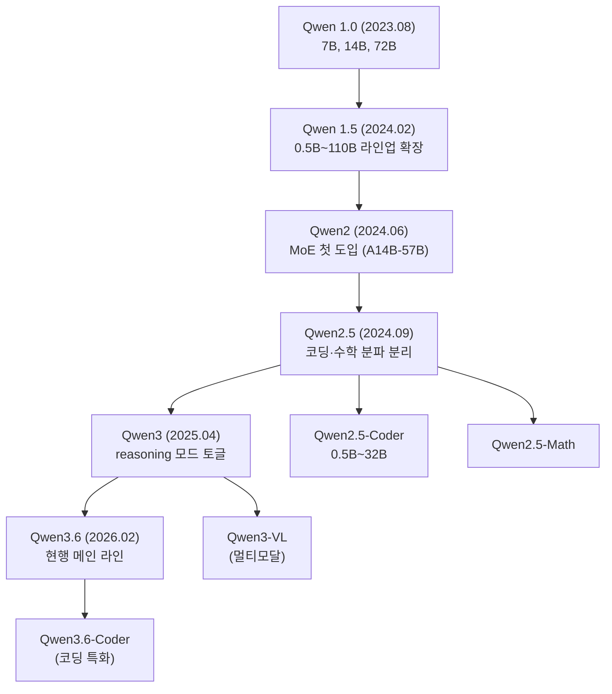

# Qwen

## 1. Qwen이 뭔지부터 정리

Qwen은 알리바바 클라우드(Alibaba Cloud) 산하 통이천원(通义千问, Tongyi Qianwen) 팀이 만드는 LLM 패밀리다. 2023년 8월 첫 공개 이후 2~3개월 주기로 새 버전이 떨어진다. 2026년 5월 현재 메인 라인은 Qwen3.6 계열이고, 그 아래로 멀티모달(Qwen-VL), 코딩 특화(Qwen-Coder), 오디오(Qwen-Audio), 임베딩(Qwen3-Embedding) 같은 변종이 깔려 있다.

오픈소스 LLM 시장에서 Qwen이 차지하는 위치는 살짝 독특하다. Meta Llama처럼 "허깅페이스 한 번 받아서 끝나는" 라이센스도 아니고, OpenAI처럼 "API만 쓰라"는 입장도 아니다. 가중치는 대부분 공개되지만 라이센스 조건이 모델 크기마다 다르고, 동시에 알리바바가 운영하는 DashScope라는 매니지드 API도 같이 굴러간다. 자체 호스팅을 하든 API를 쓰든 둘 다 선택지가 열려 있다는 게 실무 입장에서 가장 큰 차이점이다.

벤치마크 점수만 보면 Llama 3.3 70B, DeepSeek-V3와 비슷한 구간에 있고, 한국어/중국어 처리는 Llama 계열보다 확실히 낫다. 회사 인프라가 중국 본토에 있거나 한국어 토큰화 효율이 중요한 워크로드면 우선순위가 올라가는 모델이다.

---

## 2. 모델 패밀리 구조

세대를 시간순으로 정리한다. 숫자가 헷갈리기 쉬워서 한 번 짚고 가는 게 낫다.



세대별로 실무에서 알아야 할 차이점만 짚는다.

### 2.1 Qwen2.5

가장 많이 쓰이는 안정 라인이다. 한국어 처리 품질이 Qwen2 대비 눈에 띄게 개선된 첫 세대고, fine-tuning 생태계도 가장 두껍다. 0.5B/1.5B/3B/7B/14B/32B/72B로 사이즈가 촘촘하게 깔려 있어서 엣지 디바이스부터 H100 서버까지 한 패밀리로 묶을 수 있다.

코딩 변종인 Qwen2.5-Coder는 HumanEval/MBPP 점수가 GPT-4o에 근접하는 구간(32B 기준)까지 올라왔고, 32K 컨텍스트와 fill-in-the-middle 토큰을 지원해서 IDE 통합용으로 쓰기 좋다.

### 2.2 Qwen3

가장 큰 변화는 reasoning 모드 토글이다. 모든 Qwen3 모델은 `enable_thinking` 플래그로 `<think>...</think>` 블록을 켜고 끌 수 있다. 켜면 응답 전에 내부 추론 토큰을 뿜고 끄면 바로 답한다. DeepSeek-R1처럼 별도 모델로 분리하지 않고 한 모델에서 토글로 처리하는 방식이 Qwen3의 특징이다.

MoE 변종도 이 세대에서 본격화됐다. `Qwen3-A3B`(3B active, 30B total), `Qwen3-A22B`(22B active, 235B total) 같은 모델이 등장했고, MoE 쪽이 동급 dense 대비 처리량이 훨씬 좋다.

### 2.3 Qwen3.6 (현행)

2026년 2월에 떨어진 현행 메인이다. 핵심 변경은 세 가지다.

- 32K가 기본 컨텍스트, YaRN 스케일링으로 131K까지 확장
- reasoning 모드의 토큰 효율이 개선됨. Qwen3 대비 같은 문제에서 추론 토큰 수가 평균 30~40% 감소
- 도구 호출(tool calling) JSON 출력 안정성 강화. 함수 호출 실패율이 Qwen3 대비 절반 수준

dense는 0.5B/1.7B/4B/8B/14B/27B/72B, MoE는 A3B-30B와 A22B-235B 두 종이 있다. 72B는 Hugging Face 비공개고 DashScope API로만 쓸 수 있다는 게 함정이다.

### 2.4 Qwen-VL (멀티모달)

이미지를 함께 받는 비전-언어 모델 라인이다. 2026년 5월 기준 현행은 Qwen3-VL이고, 사이즈는 2B/8B/72B다. 차트나 표가 들어간 PDF 처리, 화면 캡처 기반 UI 자동화, OCR 대체 같은 용도로 쓴다. GPT-4o 비전과 비교하면 영어 자료에서는 약간 밀리지만, 중국어와 한국어가 섞인 문서에서는 Qwen3-VL이 더 안정적인 결과를 낸다.

영상 입력은 Qwen2.5-VL부터 지원되기 시작했는데, 실무에서는 프레임을 잘라서 이미지 시퀀스로 넣는 방식이 여전히 더 안정적이다. 영상 직접 입력은 길이 제한과 토큰 비용 계산이 까다로워서 프로덕션 도입 전에 꼭 테스트해봐야 한다.

### 2.5 Qwen-Coder

코드 작성·디버깅·리포지토리 이해에 특화된 라인이다. Qwen2.5-Coder가 가장 널리 쓰였고, 2026년 들어 Qwen3-Coder(A35B MoE)가 나왔다. 차별점은 두 가지다.

- 코드 + 자연어 + reasoning 모드를 한 모델에서 처리
- repo-level 학습 데이터 비중이 크다. 단일 파일이 아니라 다중 파일 컨텍스트에서 import 관계와 호출 흐름을 따라가는 능력이 일반 모델 대비 우수하다

Cursor나 Continue 같은 IDE 도구에서 Qwen-Coder를 셀프 호스팅 옵션으로 두는 경우가 늘고 있는 이유가 이쪽이다.

---

## 3. 라이선스가 헷갈리는 이유

Qwen 라이선스는 모델 크기와 세대마다 다르다. 한 번 정리해두지 않으면 사고가 난다.

| 모델 | 라이선스 | 상업 사용 |
|------|---------|----------|
| Qwen2.5 (0.5B~14B) | Apache 2.0 | 자유 |
| Qwen2.5 (32B) | Apache 2.0 | 자유 |
| Qwen2.5 (72B) | Qwen License | 월 활성 사용자 1억 이상이면 별도 계약 필요 |
| Qwen2.5-Coder (전 사이즈) | Apache 2.0 | 자유 |
| Qwen3 (0.5B~14B) | Apache 2.0 | 자유 |
| Qwen3 (32B, A22B) | Apache 2.0 | 자유 |
| Qwen3 (72B) | Qwen License | 1억 MAU 조항 |
| Qwen3.6 (0.5B~27B) | Apache 2.0 | 자유 |
| Qwen3.6 (72B) | API 전용 (가중치 비공개) | DashScope만 |

72B 라인이 항상 까칠하다는 게 핵심이다. 자체 호스팅으로 상업 서비스에 박을 거면 27B 이하로 가거나 MoE 변종(A22B)을 쓰는 게 사고가 없다. 72B를 꼭 써야 한다면 그냥 DashScope API를 호출하는 쪽이 라이선스 관리 비용 면에서 싸다.

Qwen License 조항을 더 자세히 읽어보면 "월 1억 MAU"라는 기준이 살짝 모호한 표현이 있다. 한국 시장만 보면 거의 모든 회사가 해당이 안 되는데, 글로벌 서비스라면 법무 검토를 받아두는 게 안전하다.

---

## 4. API 호출 방법

Qwen API는 두 가지 인터페이스를 제공한다. 알리바바 자체 SDK인 DashScope와, OpenAI 호환 엔드포인트다. 같은 모델을 둘 다로 호출할 수 있고, 응답 포맷도 거의 비슷하다. 실무에서는 OpenAI 호환 쪽을 더 자주 쓴다. 기존 OpenAI SDK 코드를 base URL만 바꿔서 쓸 수 있어서 마이그레이션이 쉽다.

### 4.1 OpenAI 호환 엔드포인트

```python
from openai import OpenAI

client = OpenAI(
    api_key="sk-xxxxxxxxxxxxxxxxxxxxxxxxxxxxxxxx",
    base_url="https://dashscope-intl.aliyuncs.com/compatible-mode/v1",
)

response = client.chat.completions.create(
    model="qwen3.6-27b-instruct",
    messages=[
        {"role": "system", "content": "당신은 백엔드 개발자입니다."},
        {"role": "user", "content": "FastAPI에서 미들웨어 실행 순서를 설명해주세요."},
    ],
    temperature=0.7,
    max_tokens=2048,
)

print(response.choices[0].message.content)
```

엔드포인트 URL이 두 종류다. `dashscope.aliyuncs.com`은 중국 본토 리전, `dashscope-intl.aliyuncs.com`은 싱가포르 리전이다. 한국에서 호출하면 인터내셔널 쪽 latency가 절반 정도라 무조건 intl로 붙어야 한다.

리전마다 사용 가능한 모델 리스트가 다르다는 게 함정이다. 중국 본토에 깔린 신규 모델이 intl에는 1~2주 늦게 들어오는 경우가 많고, 일부 비전 모델은 intl 미지원인 적도 있었다. 모델 사용 가능 여부는 `client.models.list()`로 먼저 확인하는 습관을 들이는 게 낫다.

### 4.2 DashScope 네이티브 SDK

DashScope 고유 기능(예: 일부 멀티모달 모달리티, 비동기 작업)이 필요하면 네이티브 SDK를 써야 한다.

```python
import dashscope
from dashscope import Generation

dashscope.api_key = "sk-xxxxxxxxxxxxxxxxxxxxxxxxxxxxxxxx"
dashscope.base_http_api_url = "https://dashscope-intl.aliyuncs.com/api/v1"

response = Generation.call(
    model="qwen3.6-27b-instruct",
    messages=[
        {"role": "user", "content": "분산 락 구현 방법을 알려주세요."},
    ],
    result_format="message",
    enable_thinking=False,
)

print(response.output.choices[0].message.content)
```

`enable_thinking` 플래그가 OpenAI 호환 쪽에서는 표준 파라미터가 아니라 `extra_body`로 넘겨야 한다는 게 자주 빠지는 함정이다.

```python
response = client.chat.completions.create(
    model="qwen3.6-27b-instruct",
    messages=[...],
    extra_body={"enable_thinking": True},
)
```

### 4.3 자체 호스팅 시 vLLM 사용

Hugging Face 가중치를 받아서 vLLM으로 서빙하면 OpenAI 호환 서버가 자동으로 떨어진다.

```bash
vllm serve Qwen/Qwen3.6-27B-Instruct \
    --tensor-parallel-size 2 \
    --max-model-len 32768 \
    --enable-reasoning \
    --reasoning-parser qwen3
```

`--reasoning-parser qwen3` 옵션이 핵심이다. 이걸 안 주면 `<think>` 블록이 그대로 응답에 섞여 나오고, 클라이언트가 reasoning과 최종 답변을 분리하지 못한다. 0.7.0 미만 vLLM은 이 파서가 빠져 있어서 버전 체크가 필수다.

GPU 메모리 계산은 27B 기준 bf16이면 약 54GB, AWQ 4bit 양자화면 16GB 수준이다. A100 40GB 한 장이면 양자화 버전, A100 80GB나 H100이면 풀 정밀도까지 무리 없이 올라간다.

---

## 5. Reasoning 모드 동작 방식

Qwen3부터 도입된 reasoning 모드는 모델 가중치 자체에 추론 동작이 학습된 결과다. DeepSeek-R1처럼 별도 모델로 분리한 게 아니라 같은 가중치에서 토글로 동작한다.

켰을 때 응답 구조는 이렇게 생겼다.

```
<think>
사용자가 분산 락 구현을 물었다. 옵션은 세 가지다.
1. Redis SETNX 기반 - 단순하지만 fencing token 필요
2. Redlock - 분산 환경에서 안전하지만 논쟁이 있음
3. Zookeeper/etcd - 강한 일관성이지만 인프라 부담

먼저 사용 환경부터 확인해야 한다...
</think>

분산 락을 구현하는 방법은 크게 세 가지가 있습니다...
```

`<think>` 블록은 사용자에게 노출하지 않는 게 일반적이다. 토큰은 청구되지만 최종 답변 품질을 위한 내부 사고 과정이다. 시스템 프롬프트 설계 시 주의점이 몇 개 있다.

첫째, reasoning 모드에서는 system 프롬프트의 지시사항을 모델이 추론 과정에서 재해석하는 경향이 있다. 형식 강제(예: "JSON만 출력")는 reasoning 모드에서 가끔 무너진다. 출력 형식이 엄격히 정해진 작업이면 reasoning을 끄거나 응답 후처리로 잡아주는 게 안전하다.

둘째, 토큰 비용. reasoning 모드는 평균적으로 응답 토큰 수가 3~5배 늘어난다. 27B 기준 단순 질문에 reasoning 모드를 켜면 200토큰 답할 걸 1000토큰 쓰는 식이다. API 비용 관리하려면 작업 유형별로 토글하는 게 좋다.

셋째, latency. reasoning 토큰이 먼저 다 생성되어야 최종 답변이 나오기 때문에 첫 토큰까지의 latency는 비슷해도 전체 응답 시간은 확연히 길어진다. 챗 UI에서 reasoning 블록을 접어서 보여주는 식의 UX 처리가 거의 필수다.

작업 유형별로 reasoning 모드를 어떻게 쓸지 정리하면:

- 수학·코드 디버깅·복잡한 분석: 켠다. 정확도 차이가 확실히 난다
- 단순 질의응답·요약·번역: 끈다. 토큰만 더 쓰고 품질은 거의 같다
- 도구 호출(function calling): 끄는 쪽이 안정적이다. reasoning이 켜져 있으면 도구 호출 JSON 직전에 자연어가 끼는 경우가 종종 있다

---

## 6. 한국어 처리 특성

Qwen 토크나이저는 tiktoken 스타일 BPE를 쓰는데, 한국어에 특화된 vocab이 따로 들어가 있다. 한글 1글자가 평균 1.5~2 토큰으로 쪼개진다. 비교하면 Llama 3 토크나이저는 한글 1글자에 2~3 토큰을 쓰니까 Qwen이 같은 문장으로 토큰을 30~40% 덜 먹는다.

같은 32K 컨텍스트라도 실효 정보량이 다르다는 뜻이다. 한국어 문서 검색이나 긴 코드 리뷰 같은 작업에서 Llama 3 70B와 Qwen3 32B를 비교해보면 입력 길이 측면에서 Qwen 쪽이 1.3배 정도 더 많은 내용을 담을 수 있다.

품질 측면에서는 몇 가지 특징이 있다.

존댓말과 반말 일관성은 모델 사이즈에 따라 갈린다. 14B 이하에서는 system 프롬프트에 "존댓말로 답하세요"를 명시해도 중간에 반말이 섞여 나오는 경우가 있다. 27B 이상부터는 거의 안정적이다.

한자어 비중이 높은 법률·의료 문서에서 강점이 있다. 중국어 학습 데이터 비중이 크다 보니 한자 기반 전문 용어 인식이 Llama보다 정확하다. 다만 외래어 표기는 영문을 그대로 쓰는 경향이 있어서 "API"를 "API"로 쓰지 "에이피아이"로 쓰지는 않는다.

번역 작업에서 한↔중은 GPT-4o에 근접하는 품질이 나오고, 한↔영은 GPT-4o 대비 약간 떨어진다. 동남아 언어(베트남어, 태국어)는 의외로 Qwen 쪽이 더 안정적인 결과를 내는데, 알리바바가 동남아 시장을 적극 공략하면서 학습 데이터를 늘린 영향으로 보인다.

한국어 fine-tuning을 따로 하지 않아도 쓸 만한 수준이지만, 도메인 특화가 필요하면 LoRA 정도로 충분하다. Qwen2.5-7B 기준 한국어 instruction 데이터 5만 건으로 LoRA 학습 돌리면 도메인 정확도가 10~15% 정도 올라간다.

---

## 7. 다른 오픈소스 LLM과의 비교

실무에서 모델 선택 기준은 사이즈/라이선스/품질/추론 속도 네 가지다. 같은 구간에서 비교한다.

### 7.1 30B 전후 dense 모델

| 항목 | Qwen3.6-27B | Llama 3.3 70B (Q4) | DeepSeek-V3 (A37B MoE) | Mistral Large 2 |
|------|------------|---------------------|------------------------|-----------------|
| 라이선스 | Apache 2.0 | Llama 3 Community | MIT | Mistral Research/Commercial |
| 컨텍스트 | 32K (131K with YaRN) | 128K | 64K | 128K |
| 한국어 품질 | 상 | 중 | 중상 | 중 |
| 코드 품질 | 중상 | 중 | 상 | 중상 |
| reasoning 모드 | 내장 토글 | 없음 | DeepSeek-R1 별도 | 없음 |
| 자체 호스팅 VRAM | 54GB (bf16) | 40GB (Q4) | 670GB (full) | 240GB (full) |

한국어 워크로드가 우선이면 Qwen3.6-27B가 첫 선택이다. Llama 3.3 70B를 Q4 양자화로 띄우면 메모리는 비슷한데 한국어 품질이 떨어진다. DeepSeek-V3는 품질은 좋지만 self-host가 사실상 불가능한 사이즈고, API로 가야 한다.

### 7.2 7~14B 구간

이 구간이 실무에서 가장 많이 쓰인다. 단일 GPU에서 돌고 추론 속도도 빠르다.

| 항목 | Qwen3.6-14B | Llama 3.1 8B | Mistral Nemo 12B | Gemma 2 9B |
|------|------------|--------------|------------------|------------|
| 라이선스 | Apache 2.0 | Llama 3 Community | Apache 2.0 | Gemma License |
| 한국어 품질 | 중상 | 중하 | 중 | 중 |
| 영어 품질 | 중상 | 상 | 상 | 상 |
| 코드 품질 | 중 | 중하 | 중 | 중 |
| 다국어 학습 비중 | 큼 | 작음 | 중 | 중 |

영어 일변도면 Llama 3.1 8B나 Mistral Nemo가 더 낫다. 한국어가 섞인 워크로드면 Qwen3.6-14B로 가는 게 안정적이다. Gemma 2는 라이선스 조항이 까다로워서 회사 법무 통과가 어렵다.

### 7.3 MoE 라인

MoE는 dense보다 추론 처리량이 좋아서 동시 요청이 많은 서비스에 쓴다.

| 항목 | Qwen3.6-A22B-235B | DeepSeek-V3 (A37B-671B) | Mixtral 8x22B (A39B) |
|------|-------------------|--------------------------|-----------------------|
| 라이선스 | Apache 2.0 | MIT | Apache 2.0 |
| 활성 파라미터 | 22B | 37B | 39B |
| 전체 파라미터 | 235B | 671B | 141B |
| VRAM (full) | 470GB | 1.3TB | 280GB |
| 추론 처리량 | 상 | 중 | 상 |

자체 호스팅 가능 여부가 가장 큰 변수다. Qwen3.6-A22B-235B는 H100 8장 노드 하나면 올라가는데, DeepSeek-V3는 두 노드 이상이 필요하다. 회사에서 LLM 인프라를 구성한다면 이 차이가 운영 비용에 큰 영향을 준다.

### 7.4 코딩 특화

Qwen-Coder, DeepSeek-Coder, Codestral이 직접 경쟁한다.

| 항목 | Qwen2.5-Coder-32B | DeepSeek-Coder-V2-Lite (A2.4B-16B) | Codestral 22B |
|------|-------------------|--------------------------------------|---------------|
| HumanEval | 92.7 | 81.1 | 81.1 |
| 컨텍스트 | 32K | 128K | 32K |
| FIM 지원 | O | O | O |
| 라이선스 | Apache 2.0 | DeepSeek License | Mistral Non-Production |

벤치마크 점수만 보면 Qwen2.5-Coder-32B가 가장 높지만, 실제로 IDE에 붙여서 써보면 차이가 그렇게 극적이지 않다. FIM(fill-in-the-middle) 응답 latency는 DeepSeek 쪽이 빠르고, 긴 컨텍스트 처리에서는 DeepSeek-Coder-V2가 유리하다. Codestral은 라이선스 때문에 프로덕션 도입이 막혀서 보통 후보에서 빠진다.

---

## 8. 실무에서 자주 마주치는 함정

### 8.1 chat template 누락

Qwen은 ChatML 변종을 쓴다. `<|im_start|>`, `<|im_end|>` 특수 토큰이 있고, system/user/assistant 롤이 명시된다. Hugging Face에서 받은 가중치를 vLLM이나 llama.cpp로 변환할 때 chat template가 누락되면 모델이 입력을 이해 못하고 이상한 응답을 뱉는다.

특히 GGUF 변환 직후에 `apply_chat_template`이 빈 문자열을 반환하면 거의 100% 이 문제다. `tokenizer_config.json`의 `chat_template` 필드를 확인하고, 비어 있으면 Qwen 공식 저장소에서 가져와서 채워야 한다.

### 8.2 reasoning 모드 토큰 폭주

reasoning을 켜고 system 프롬프트에 "단계별로 설명해줘" 같은 지시까지 넣으면 응답 토큰이 5000~10000 토큰까지 늘어나기도 한다. max_tokens 제한을 안 걸어두면 비용이 예상의 5배까지 튀는 일이 흔하다. reasoning 모드를 쓸 때는 max_tokens를 평소의 3배 수준으로 잡고, system 프롬프트에서 추론 방식 지시는 빼는 게 낫다.

### 8.3 한국어 stop token 깨짐

특수 토큰을 BPE 합치는 과정에서 종종 문제가 생긴다. 응답 중간에 `<|im_end|>`가 그대로 텍스트로 나오면 토크나이저 빌드가 잘못된 거다. 이때는 stop_token_ids에 명시적으로 토큰 ID를 박아주거나, vLLM의 경우 `--tokenizer-mode auto`가 아니라 `slow`로 띄워야 해결되는 경우가 있다.

### 8.4 함수 호출 JSON 깨짐

reasoning 모드 활성화 상태에서 function calling을 시키면 JSON 직전에 `</think>` 토큰이 빠지거나, JSON 안에 자연어가 섞이는 일이 가끔 있다. function calling이 필요한 워크로드에서는 reasoning을 끄는 게 안전하다. 굳이 둘 다 켜야 한다면 응답 파서에서 JSON 추출 로직을 견고하게 짜야 한다.

### 8.5 DashScope intl 리전 모델 누락

새로 발표된 모델이 며칠~몇 주 동안 intl 리전에서 호출이 안 되는 경우가 있다. 공식 발표에는 "available now"라고 떠 있어도 intl 엔드포인트로 호출하면 `Model not found` 에러가 떨어진다. 이때는 `https://dashscope.console.aliyun.com/`에서 intl 리전 모델 카탈로그를 직접 확인하거나, 본토 리전으로 우회해야 한다. 본토 리전은 한국에서 호출하면 latency가 1~2초씩 추가된다.

---

## 9. 정리

Qwen은 오픈소스 LLM 중에서 한국어/중국어 비중이 큰 워크로드에 첫 번째로 고려할 만한 라인이다. 27B까지는 Apache 2.0이라 상업 사용에 부담이 없고, 자체 호스팅과 API 둘 다 열려 있어서 운영 선택지가 넓다.

세대 선택은 단순하다. 새 프로젝트면 Qwen3.6, 기존 워크로드 유지면 Qwen2.5, 코딩 작업이 메인이면 Qwen-Coder 변종을 쓴다. reasoning이 필요한 작업과 아닌 작업을 명확히 구분해서 토글하는 습관이 비용 관리에서 가장 중요하다.

특정 양자화 빌드 로컬 구동에 대한 더 자세한 내용은 [Unsloth Qwen3 GGUF 로컬 구동](../Concepts/Unsloth_Qwen3_GGUF.md) 문서를 참고한다.
